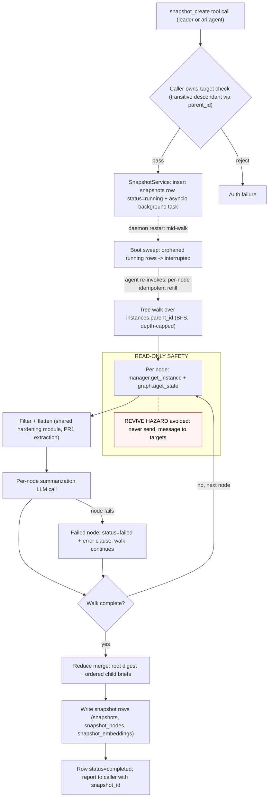
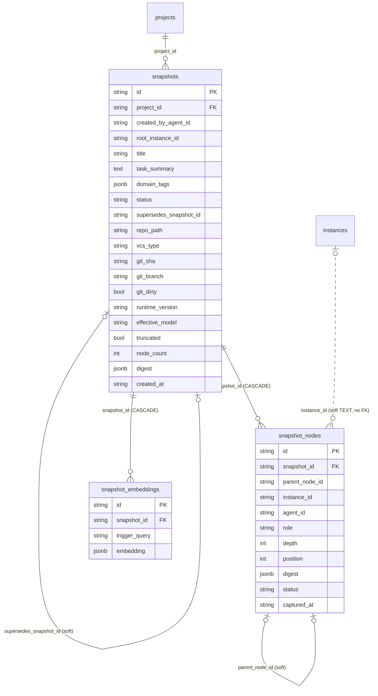
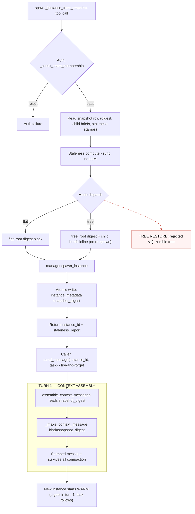

# Agent Snapshot — Design Exploration

**Status:** Rev 2 — discussion-ready (design only — no code changes, no migrations executed). Architecture unchanged from Rev 1; this pass folds in the developer feasibility assessment (4× FEASIBLE-AS-DESIGNED, 2× FEASIBLE-WITH-CHANGES — both changes adopted) and the reviewer critique (4 critical fixes + quick wins).
**Date:** 2026-09-23 (Rev 2)
**Branch:** `plan/agent-snapshot` @ 6ed47fca
**Method:** 6-worker competitive fan-out + dimension analysis, all reports spot-verified by the architect; then two independent gates (developer feasibility re-verification of 38/38 anchors — zero substantive discrepancies — and reviewer design critique).

## Companion Artifacts

| Artifact | Role |
|---|---|
| **`design-exploration.md`** (this file) | Read first — the decisions, trade-off matrices, and recommendations |
| `machinery-inventory.md` | Verified machinery facts (independent read-only inventory, wanderer) |
| `feasibility-notes.md` | Per-component seams, effort, verdicts, hidden-risk investigations, PR breakdown (§A is the execution blueprint) |

---

## 0. Executive Summary

**The problem.** Every new instance/team starts cold: re-reading guidelines, re-discovering domain context, re-exploring the same material (version-pump rituals, domain test packs). Burning tokens on already-solved exploration.

**The proposal.** An Agent Snapshot system: capture an agent (sub)tree's accumulated working context into durable, searchable storage; future agents warm-start via `spawn_instance_from_snapshot`.

**[USER-FIXED v1]** TOOLS ONLY — `snapshot_create` / `snapshot_search` / `spawn_instance_from_snapshot` surfaced to leader + ari; agent judgment drives when to snapshot/search/consume; no auto-injection, no heuristic detection. Snapshot may spawn "as a TREE (restore structure) or as a single child instance (flat digest)" — see §4 for our **proposed** reading of "tree" (user confirmation required, §10 D1).

**Headline verdict on the user's hypothesis** ("reuse the context compaction feature as a summarizer with a modified prompt, plus a snapshoter applying it across a tree"):

> **Directionally correct, but the reuse surface is narrower than "the compaction feature."** All three independently-dispatched pipeline analyses converge: the genuinely reusable core is **one method plus its plumbing** — `_call_summarization_llm` (prompt-as-arg, `daemon/compaction.py:3325`; a `ContextCompactor` instance method — lightweight construction required, see §2.3) wrapping the model-override resolution, adaptive timeout, and HA-failover facade — plus the **dormant-instance read pattern** (`aget_state`, developer-verified including cold-load and daemon-restart cases) and the **permanent-lineage tree walk** (`get_tree_ids_permanent`, `daemon/repositories/instance/repository.py:527`). The compactor *proper* — `compact_state`, the persist seam, the token-pressure trigger machinery, the shrink-to-fit prompts, the per-instance ExecutionGate — is structurally unfit and must NOT be reused.

**Recommended architecture (v1):**

| Decision | Recommendation | Confidence |
|---|---|---|
| Creation pipeline | **Approach B+ (modified reuse with extraction discipline)** — new `SnapshotService`/`SnapshotExecutor` reusing `_call_summarization_llm` (persona parametrized, lightweight construction) + shared content-hardening module | High (developer-verified seams) |
| Trigger lane | **Row-ledger + asyncio + boot sweep** (developer ruling — JobItem lane deferred as separate L-sized PR) | High |
| Storage | **Main ensemble PG, 3 new tables** (`snapshots` / `snapshot_nodes` / `snapshot_embeddings`), D3-compliant | High |
| Consumption | **FLAT spawn** — digest as persistent, compaction-surviving `context_kind`-stamped `HumanMessage`. Tree restore **rejected** on zombie-structure grounds; "tree" = child briefs inline (**our proposed reading — user confirmation pending, §10 D1**) | High (survival developer-verified on all five mutation paths) |
| Staleness | **Metadata compare by default** (age + `daemon.__version__` vs snapshot stamp), **git-anchor opt-in** (`verify=git`) | High |

---

## 1. Existing Machinery Inventory (verified)

### 1.1 Context compaction — how it works today

| Piece | What it does | Anchor | Reusable for snapshots? |
|---|---|---|---|
| `_call_summarization_llm(prompt, context)` | The LLM call: model-override resolution, `ThinkingChatOpenAI` + `clean_llm_config`, `wrap_langchain_failover`, adaptive timeout, never-silent construct fallback, empty-response guard | `daemon/compaction.py:3325-3440` | ✅ with two changes — it is a **`ContextCompactor` instance method** (lightweight construction or fold into the shared module) and the persona needs parametrizing |
| Hardcoded summarizer persona | `"You are a helpful assistant that summarizes conversations"` SystemMessage inside the reused call | `daemon/compaction.py:3429-3432` | ⚠️ **Must parametrize** (one optional argument — developer-verified feasible) |
| `resolve_compaction_model` | Cheap-model override chain (env `COMPACTION_MODEL` > yaml; pure function, `""` = no override) | `daemon/compaction.py:1295`; resolver `daemon/config.py:2835-2867` | ✅ pattern; **model chain `SNAPSHOT_MODEL > COMPACTION_MODEL > session`** (see §8) |
| Adaptive timeout | Per-prompt-size wall clock | `daemon/compaction.py:1176-1195` | ✅ AS-IS (inside the call) |
| Parallel pool + deadline budget | `Semaphore` + **ordered** `gather` + shared `_budget_remaining` deadline | `daemon/compaction.py:2811-2815, 2867-2935` | ✅ pattern (copy shape; ordered reassembly is the documented invariant) |
| Content hardening | `_is_injected_message` / `_has_context_kind` (user-intent preservation — "Summarizing it would erase user intent"), `_extract_text_from_content` multimodal flattener (silent-garbage fix) | `daemon/compaction.py:108-146`, `:81` | ✅ **MUST share** (extraction gate — §2.3) |
| Trigger machinery | Token-pressure thresholds, 80% arm, dedup, precall estimates | `daemon/compaction.py:1893-2058` | ❌ inapplicable (snapshots are tool-driven) |
| `compact_state` (compactor proper) | Single-instance, quiesce-demanding, **mutates** conversation | `daemon/compaction.py:2062` | ❌ unfit |
| Persist seam | Single sentinel channel write (`[RemoveMessage(REMOVE_ALL), …]`) + separate `compacted_at` stamp; writes INTO the target checkpoint | `daemon/services/_compaction_persist_seam.py:72`, stamp `:142-169` | ❌ **opposite** of capture; dedup-stamp contamination hazard |
| `/compact` command path | Sync single-instance CommandDispatcher op; pause→quiesce (30s) because it WRITES | `daemon/services/compact_executor.py:1755`, quiesce `:264/:875` | ❌ wrong shape (sync, single-node) |
| Input clamp constant | `TRUNCATION_GLOBAL_INPUT_CAP_CHARS = 40_000` | `daemon/compaction.py:285` | ✅ precedent for the per-call snapshot clamp |

### 1.2 Instance / spawning / checkpoint machinery

- **Tree walk:** `get_tree_ids_permanent(root_id)` — BFS over permanent `instances.parent_id` lineage ("survives completion, error, terminate, revive"), depth cap 256, NO status filter by design; docstring explicitly blesses it for whole-tree cascades — `daemon/repositories/instance/repository.py:527`, depth cap `:33`.
- **Dormant read:** `manager.get_instance(id)` + `graph_obj.aget_state(config)` — `daemon/services/compact_executor.py:732-738`. **Developer-verified end-to-end including the cold-load and daemon-restart case** (feasibility-notes §B(i)): `get_instance` has NO status filter (`instance_lifecycle.py:3861-3890`; `KeyError` only if the row is gone, `:3887-3888`); `_restore_instance` (`:3977-4370`) compiles the graph, registers it, and performs no status change / message emission / checkpoint write. Caveats in §9.
- **Revive hazard:** `send_message` to a terminal instance auto-revives it to RUNNING — `daemon/services/instance_messaging.py:1897-1931`. (The older blueprint anchor `:1486-1510` is stale; so is a docstring at `repository.py:485-486` — both superseded.) A snapshotter must NEVER message its targets.
- **Spawn facade:** `manager.spawn_instance(agent_id, parent_id, project_id, instance_name, model, version_tag, …) -> (instance_id, model)` — `daemon/manager.py:6870`.
- **Atomic metadata write:** `set_metadata_many` — "ONE SQL statement… prevents torn-state" — `daemon/manager.py:3774`.
- **Pause-first-then-quiesce** exists for checkpoint **writes**. Developer-verified from code (feasibility-notes §D1): compaction's write paths converge on a **single sentinel channel write**, so a concurrent `aget_state` observes the full pre- or post-compaction channel, **never a torn list** — "no pause needed; stamp staleness" is **confirmed**, with one cosmetic window (post-compaction messages + stale `compacted_at`) that snapshots don't gate on.
- **System prompt is NOT in checkpoints** (by design) — digest placement must go through the context-message seam.

### 1.3 Context injection (the consumption seam)

- `CONTEXT_KIND_*` constants — `daemon/services/context_messages.py:83-107`. `CONTEXT_KIND_SYMPTOM_REPAIR` (`:104`) exists precisely to place a doc in "the permanently non-selectable / hoisted bucket… survives every later compaction verbatim". The hoist is **truthy-keyed on any `context_kind` string** (no closed enum — `daemon/compaction.py:129-146`): a new kind requires **zero compaction changes**.
- `_make_context_message(kind, title, content, id_=None)` — stamps `additional_kwargs={"injected_message": True, "context_kind": kind}`; stable ids make the `add_messages` reducer SUPERSEDE in place — `daemon/services/context_messages.py:130-165`. Does NOT escape — caller must run `escape_for_context_block` (`:147-152`).
- `assemble_context_messages` orchestrator (turn-1 assembly, persistent-vs-ephemeral split) — `daemon/services/context_messages.py:1589`.
- Critical-notes and shared-context blocks travel this seam — `:526-647` (reference-field truncation-with-hint at `:618-640`), `:1006-1059`.
- Compaction hoists `context_kind`-stamped messages verbatim — predicates `daemon/compaction.py:108-146`, partition `:217-249`, hoist `:551-556` via `_is_hoisted_injected` `:191`.

### 1.4 Knowledge systems (coexistence surface — §7)

- **Skills:** `skill_embeddings` (JSONB float arrays, no numpy/BYTEA, 1536-dim typical) — `daemon/repositories/skill/models.py:563-621`. Hybrid search: pure-Python BM25 (k1=1.5, b=0.75, "No numpy, no external BM25 library. Per `ensemble.spec`") + cached-embedding cosine rerank + LLM selection with BM25-only degrade — `daemon/services/skill_search_service.py:45-60`. Trigger queries 3-10, computed at creation AND update — `daemon/services/skill_embedding_service.py:11-12`, `:537`.
- **Critical notes:** leader-gated, lifecycle columns (pinned/superseded), `superseded_by_id` soft self-ref, `detail_ref` pointer pattern — `daemon/repositories/project/models.py:210-231`.
- **RAG `experience()`/`explore()`:** `experience()` dispatches kb-writer work as a JobItem on `system_kb_fifo_queue` (`daemon/tools/knowledge_tools.py:342-410`) — the internal-job precedent. Backend lives in the MCP/kb-writer subsystem (contract-level boundary holds — §7).
- **`.agents/shared/`:** planning dirs + context.md — file-surface convention.
- **Migrations:** runner is **SQLite-only** (`daemon/migrations/runner.py:719-727` — "Do not fix this to apply .sql files on PostgreSQL"); fresh **and existing** PG schema comes from `SQLModel.metadata.create_all`, which runs **every boot** (`daemon/manager.py:525`); `_ensure_postgres_columns` (`:5099`) exists only for columns on pre-existing tables. Checksummed, UP/DOWN convention per `daemon/migrations/versions/20260710_000001_create_skill_tables.sql:1-4, :101`.

### 1.5 Version / git anchors

- `daemon.__version__ = "0.14.0"` — `daemon/__init__.py:3`.
- Git usage in the daemon is confined to `daemon/services/doc_commit_service.py` — no repo-HEAD cache exists (§5).

### 1.6 Job pipeline shape (governs the trigger lane — §2.4)

`job_processor` understands **exactly two job shapes**: `job_type == "message"` jobs are skipped at dispatch (the Task row already exists — `daemon/services/job_processor.py:883, :1249`); everything else falls into the task branch that **spawns an agent instance**. Both working internal-job precedents (`experience()` → kb-writer; `skill_job_dispatcher.py:126-145` → skill-keeper) work *because the job carries an agent*. JAFP itself governs instance-execution work and counts **six** public entry points (`docs/architecture/job-as-front-primitive-invariants.md:22-29`) — a snapshot job is internal subsystem work and does NOT violate JAFP, but a `job_type='snapshot'` JobItem with no agent fits **neither** processor branch.

---

## 2. Decision Point 1 — Creation Pipeline (the headline question)

**Options explored competitively** (same skill, different approaches, one worker each):

- **A — Full reuse:** snapshot capture lives INSIDE the compaction subsystem (new trigger + prompt variant on the existing middleware/executor). No new service.
- **B — Modified reuse (user's hypothesis):** compaction untouched; new snapshot pipeline reusing its LLM-call plumbing with a new prompt + tree walk + own persistence.
- **C — Build new:** clean-room `snapshot_service.py` sharing only the generic `llm_failover` facade + repository patterns.

### 2.1 What each approach found (evidence highlights)

**A (full reuse) — collapses under inspection.** The reusable surface is "~2 of ~15 compaction subsystems" (`_call_summarization_llm` + model override). The compactor proper is single-instance, quiesce-demanding, checkpoint-mutating, wrong-prompt-shaped. Additional hazards unique to A: the `compacted_at` dedup stamp would silently suppress the next legitimate `/compact` on a snapshotted instance; `ExecutionGate` is per-instance with no tree-level serialization; tree TOCTOU without quiescence; prompt-fork drift inside the same file.

**B (modified reuse) — the reuse boundary is REAL but narrow.** The expensive, battle-tested part (failover facade, adaptive timeouts, never-silent fallback, parallel pool with deadline budget) is reachable via `_call_summarization_llm`, which takes an arbitrary prompt (`compaction.py:3325-3440`). Precise classification: reuse as-is = the call + model-override + timeout; reuse pattern = parallel pool; parametrize = the hardcoded persona (`:3429-3432`); NEW = prompts, tree walk, artifact, executor; NOT reused = persist seam, trigger machinery. B's weakest point: the persona parametrization + instance-method construction touch a 3,902-line battle-tested file.

**C (build new) — cleanest shape, but re-learns hard-won behavior.** The persist-seam problem disappears entirely (additive writes only). But compaction's content-hardening corpus (~150-250 lines of subtle, bug-derived behavior) would need re-learning; skipping it yields **confidently-wrong digests** (silent garbage). C's mitigation is precedented: `graph.py:1866-1867` already lazily imports `_extract_text_from_content` — extracting predicates + flattener into a neutral shared module converts "re-learn" into "import". C's gate: **shared-module extraction lands BEFORE the first snapshot summarizer.**

**Convergence (all three):** walk = `get_tree_ids_permanent`; read = `aget_state` (no revive, no pause — now developer-confirmed, §1.2); never `send_message` to targets; facade-based LLM invocation; per-node failure isolation; cheap-tier model default.

### 2.2 Five-axis comparison (normalized: **higher = better on every axis; Risk and Cost are inverted so higher = safer/cheaper**)

Weights: Complexity 20% · Scalability 20% · Maintainability 25% · Risk 20% · Cost 15%.

| Approach | Complexity | Scalability | Maintainability | Risk | Cost | Weighted |
|---|---|---|---|---|---|---|
| A: Full reuse | 2 (fork + sink + tree lock + prompt plumbing despite "reuse" label) | 2 (serialized per-node engine, no batching, O(N) LLM calls) | 3 (parallel codepath; `/compact` regression surface) | 2 (dedup contamination, tree TOCTOU, gate mismatch, prompt drift) | 3 (per-node LLM cost, no budget enforcement) | **2.40** |
| **B: Modified reuse** | 2 (plumbing reused wholesale; ~500-700 LOC new) | 4 (bounded by chunk_concurrency + lane caps) | 4 (follows compact_executor precedent; second consumer of compaction internals) | 2 (read-only on targets; two contained touches) | 3 (N conversations as LLM input; cheap-tier chain + budget) | **3.05** |
| C: Build new | 3 (new service+repo+tool wiring; no trigger/sentinel inheritance) | 4 (additive writes, semaphore-capped) | 3 (single-purpose service; second summarizer codepath until extraction) | 2 (read-only; worst case = bad snapshot row, never corrupted conversation) | 3 (token cost approach-invariant; one-time re-derivation) | **3.00** |

B and C land within noise (3.05 vs 3.00). Applying the tie-break sequence (equal weighted totals → best Risk score → best Complexity score): both tie at Risk 2, and **B's Complexity score (2) beats C's (3) under the higher-is-better convention — B's raw complexity is genuinely lower** (the plumbing is imported rather than re-derived). B edges C. The deeper reading: **each report's weakest point is cured by the other's mitigation**, which is exactly what the recommendation below adopts.

### 2.3 Recommendation — **Approach B+ (modified reuse with extraction discipline)** [PROPOSED]

A new `SnapshotService` + `SnapshotExecutor` (C's clean service shape — sibling of `compact_executor.py`) that:

1. **Reuses `_call_summarization_llm`** (B's real reuse boundary) with two developer-verified changes: (a) it is a `ContextCompactor` **instance method** — construct a lightweight compactor carrying the target instance's LLM config + a synthetic `CompactionContext` (only `.config` is read on this path), or fold the call body into the PR1 shared module; (b) the persona parametrized as **one optional argument** at `compaction.py:3429-3434` (the SystemMessage is inlined at a single call site). A snapshot-side wrapper pins the call shape so later compaction signature drift breaks loudly.
2. **Extracts the content-hardening corpus** (`_is_injected_message`, `_has_context_kind`, `_extract_text_from_content`, partition/hoist predicates) into a neutral shared module (C's gate — converts silent-wrong-digest risk into an import; `graph.py:1866-1867` is the existing precedent), swapping graph.py's lazy import to the new home.
3. **Owns its prompts** (new `snapshot_prompts.py`): durable-knowledge extraction (decisions, gotchas, conventions, open threads, artifact refs) — NOT compaction's next-turn-continuity contract.
4. **Model chain `SNAPSHOT_MODEL > COMPACTION_MODEL > session model`** (mirroring `_resolve_compaction_model`, `daemon/config.py:2835-2867`): an operator who already pinned the cheap compaction tier gets cheap snapshot calls by default; a bare `""` must NOT fall straight to the session model (that would make a 32-node tree 32 main-model calls). Stamp the effective model into the snapshot row for cost forensics.
5. **Never touches** the persist seam, trigger machinery, or `compact_state`.

**Assumption that would flip this:** if compaction enters a heavy-refactor cycle (making any shared-module/persona touch expensive), C's clean-room with same-PR extraction becomes the winner — the delta is one extraction PR either way.

### 2.4 Pipeline semantics (agreed by all three approaches + developer rulings)

- **Trigger [PROPOSED, user ratifies — §10 D3]:** `snapshot_create` tool → `SnapshotService.capture_async(...)` asyncio background task; the `snapshots` row **is** the durability ledger (`status: running → completed | failed | interrupted`). **Developer ruling (feasibility-notes §D3):** the JobItem lane has no home — `job_processor` knows exactly two shapes (§1.6) and a no-agent `job_type='snapshot'` job fits neither; retrofitting it means a new dispatch branch + execution processor + terminal-token contract + full e2e lane gates ≈ an L-sized PR. **v1 = row-ledger; JobItem lane deferred.**
- **Restart recovery:** a **boot sweep** marks orphaned `running` rows `interrupted` (one idempotent startup query — same shape as `JobRecoveryService.recover_on_startup`, scoped to one table). Lost: automatic retry. Kept: per-node idempotency makes a manual re-invoke a cheap refill, and snapshots are agent-initiated — the agent sees the failure and can re-invoke.
- **Walk:** BFS via `get_tree_ids_permanent` (depth-256 traversal cap; the binding constraint is the 32-node capture cap, §8); enumerate-first (children spawned after enumeration are excluded); terminated-but-checkpointless children (spawned, never dispatched — no checkpoint row exists; `aget_state` returns empty `values={}`) → skip-and-record.
- **Live vs terminal trees:** terminal = exact capture; live = last-committed-boundary read, stamped per-node `captured_at`. No-pause is **developer-confirmed from code** (§1.2): the sentinel-write design means a racing read never sees a torn channel.
- **Concurrency:** reads don't mutate → two concurrent snapshots of the same tree are safe (idempotency key `root_id+hash` handed to storage for dedup). LLM parallelism bounded by semaphore + shared deadline budget.
- **Failure:** per-node isolation (one dead node never kills the tree); failed nodes recorded with error clauses; re-run refills missing nodes. `KeyError` on hard-deleted instance rows (`instance_lifecycle.py:3887-3888`) is the concrete exception the per-node try/except must tolerate.
- **Cost caps — COMMITTED (§8):** 32 nodes/tree (truncate-with-flag, not silent), 40k chars/call input clamp (matches `TRUNCATION_GLOBAL_INPUT_CAP_CHARS`, `compaction.py:285`), 600s per-tree wall clock, fail loud on breach; cheap-tier model chain default.



---

## 3. Decision Point 2 — Storage & Data Model

### 3.1 Options (normalized: **higher = better; Risk/Cost inverted — higher = safer/cheaper**)

| Option | Complexity | Scalability | Maintainability | Risk | Cost | Weighted |
|---|---|---|---|---|---|---|
| **Main PG, 3 tables (D3)** | 4 | 4 | 5 | 4 | 4 | **4.25** |
| Separate SQLite store | 3 | 2 | 2 | 2 | 3 | 2.40 |
| File/blob store + index table | 2 | 4 | 2 | 3 | 3 | 2.75 |
| Main PG + pgvector | 2 | 5 | 3 | 2 | 3 | 3.00 |

**Recommendation: main ensemble PG (PostgreSQL primary, SQLite-compatible), 3 new tables — D3 followed, no deviation warranted.** The skill subsystem proves the shape in production: 1536-dim float arrays live happily as JSONB; snapshot digests are text, orders of magnitude smaller. pgvector adds an extension dependency for a problem JSONB+cosine already solves at v1 volumes.

### 3.2 Schema

- **`snapshots`** (header + root digest + filterable search metadata): `id`, `project_id` (FK), `created_by_agent_id`, `root_instance_id` (soft TEXT — no FK: the terminate/revive lifecycle makes hard FKs wrong, per the `superseded_by_id` precedent at `project/models.py:215-222`), `title`, `task_summary` (BM25 corpus), `domain_tags` (JSONB), `status` (**`active` | `superseded` only — see below**), `supersedes_snapshot_id` (soft self-ref), `repo_path`, `vcs_type`, `git_sha`, `git_branch`, `git_dirty`, `runtime_version`, `effective_model` (cost forensics), `truncated` (bool — set when the 32-node cap engaged), `node_count`, `digest` (JSONB), `created_at`.
- **`snapshot_nodes`** (tree members): `id`, `snapshot_id` (FK CASCADE), `parent_node_id` (soft self-ref), `instance_id` (soft TEXT), `agent_id`, `role`, `depth`, `position`, `digest` (JSONB), `status` (`ok | failed | skipped`), `captured_at`.
- **`snapshot_embeddings`** (mirrors `skill_embeddings` exactly): `id`, `snapshot_id` (FK CASCADE), `trigger_query` (≤512), `embedding` (JSONB floats).

**Status vs freshness (dead-state resolution):** the stored `status` enum is a **lifecycle** property with a real writer (`active` on create; `superseded` when a newer snapshot of the same root explicitly supersedes). `fresh | stale | expired` are **computed at query time** from `age_days` / `runtime_version` thresholds (§5) — never stored, so there is no dead `expired` column state needing a flip mechanism.

**Why 3 tables:** the ordered 1:N tree and the 1:N vectors don't fit one row; header stays narrow + indexed while digests stay JSONB. Flattening the tree into one header blob kills per-node queries (anti-pattern flagged).



### 3.3 Migration path (simplified per developer ruling — feasibility-notes §D2)

1. New `daemon/migrations/versions/{YYYYMMDD}_{HHMMSS}_create_snapshot_tables.sql` — serves **SQLite + the audit trail**; timestamp must sort after `20260915_212810_…` (latest today); UP **and** DOWN sections; SHA-256 content checksum recorded at apply (`runner.py:67-68`); runner is SQLite-only by design (`runner.py:719-727`).
2. **PG needs no migration-mirror step for brand-new tables:** `SQLModel.metadata.create_all` runs every boot (`manager.py:525`) and creates missing tables on both fresh AND existing PG databases. ~~Mirror DDL in `_ensure_postgres_columns`~~ — **unnecessary** (that helper exists for columns on pre-existing tables). The load-bearing requirement is **importing the snapshot models package before `manager.py:525` executes** (precedent: the `SchemaMigration` import at `:520-522`).
3. SQLModel package `daemon/repositories/snapshot/` (`models.py`, `repository.py`) with `JSONBType` (`daemon/repositories/infra/types.py:35` — degrades to JSON on SQLite).
4. No backfill — brand-new tables.

### 3.4 Search (D4 parallel, not duplicate)

`snapshot_search` parallels the skill hybrid: **shared** — pure-Python BM25 + cached-embedding cosine rerank + LLM selection with BM25-only degrade; **snapshot-specific** — corpus = `task_summary` + node digests + `domain_tags`; candidate filter by project + `status='active'`; freshness post-filter after ranking; no usage-metrics/A-B in v1. Trigger queries generated from `task_summary` + 2-3 node digests (grounds them if summaries are thin).

- **Embedding lifecycle reconciled:** v1 snapshots are **immutable** (supersede, never update) — embeddings are computed **at creation only**; D4's "computed at creation AND update" maps to supersession minting a fresh row with fresh embeddings. (Rev 1's deferral line and this section now agree.)
- **Search-side LLM cost is bounded by candidate count [COMMITTED]:** the LLM-selection stage runs only over the **top-20** hybrid-ranked candidates (hard cap); beyond K the ranking degrades to the BM25+cosine order — mirroring skill_search's graceful-degrade shape.
- **Drift hazard:** direct import of skill-search helpers couples the two ranking behaviors — pin with tests in the same PR (or extract `text_search_common.py` when a third consumer appears).

---

## 4. Decision Point 3 — Consumption (tree restore vs flat digest)

### 4.1 Options (normalized: **higher = better; Risk/Cost inverted — higher = safer/cheaper**)

| Option | Complexity | Scalability | Maintainability | Risk | Cost | Weighted |
|---|---|---|---|---|---|---|
| **FLAT** — one instance, digest as persistent stamped HumanMessage | 4 | 3 | 4 | 4 | 4 | **3.80** |
| TREE RESTORE — re-spawn parent + children | 1 | 2 | 1 | 1 | 2 | 1.35 |
| HYBRID — flat + deferred subtree expansion | 3 | 3 | 3 | 3 | 3 | 3.00 |

### 4.2 Why tree restore is rejected (structural, not preferential)

The snapshot's children **already finished their work**. Re-spawning them produces a **zombie tree**: no pending task, no LLM wake. The completion watcher registers only when a child task/message id exists (`daemon/tools/instance.py:686` — `_register_child_completion_watcher`); the parent's `waiting_children` gate never flips; the parent either idles forever or someone must hand-assign new tasks — which contradicts the feature's purpose.

**Our proposed v1 reading of the [USER-FIXED] "TREE = restore structure" constraint:** structure **preserved as data** — root digest + ordered per-child briefs inline in ONE instance's context — rather than structure re-instantiated as live child instances. This is an interpretation of the constraint, not the constraint's literal text; **user confirmation is required (§10 D1)** before implementation. If the literal reading (re-instantiated children) is required, it needs a task-assignment story that does not exist today and is out of v1 scope.

### 4.3 Recommendation — FLAT for v1; "tree" = inline briefs [PROPOSED, pending §10 D1]

- `mode="flat"`: root digest block. `mode="tree"`: root digest + ordered per-child briefs, inline — same spawn mechanics, only payload shape differs.
- **Digest placement (developer-verified on every path):** during spawn, atomically write `instance_metadata["snapshot_digest"]` (`set_metadata_many`, `manager.py:3774`) **before** returning the instance_id (turn-1 ordering is fully under the tool's control); on TURN 1, `assemble_context_messages` (`context_messages.py:1589`) reads it and emits the block via `_make_context_message(kind=CONTEXT_KIND_SNAPSHOT_DIGEST, id_=f"snapshot_digest:{instance_id}")`. **Feasibility-notes §D4 verified the stamp survives all five compaction/mutation paths** — summarization partition+sentinel, emergency truncation (which never sees hoisted messages and re-attaches them verbatim, `compaction.py:2328-2351`), precall-95%, stamp-only, and CLE-retry — plus the loop breaker. The hoist is truthy-keyed, so **zero compaction changes** are needed.
- **Escape-then-cap ordering [developer-verified discipline]:** `_make_context_message` does NOT escape (`:147-152`); run `escape_for_context_block` FIRST (escaping can expand content up to ~6× — the KV-block lesson, `context_messages.py:932-975`), then apply the **12k-char cap measured post-escape**, tail-truncating with a `snapshot_search`-for-full-body hint (critical-notes reference-truncation shape, `:618-640`). Truncate, never skip — a digest that silently doesn't land defeats warm-start.
- **Hoisted-token accounting (one caveat):** hoisted tokens sit in the compaction gate numerator and are never compaction-relievable. A ~12k digest ≈ ~3k tokens — negligible vs the default 700k window — and the stable-id supersede + one-digest-per-instance keeps N-digest inflation bounded; assert it in the injection hook.
- **System prompt is forbidden placement** (not checkpointed — lost across pause/resume, invisible to the agent's reasoning).
- **`snapshot_search` returns metadata + digest preview only** — the full body is read at spawn time. Keep the surfaces distinct.
- **Hybrid deferred:** a future `spawn_subtree_from_snapshot` is cleanly boxed as v2.
- **Cross-project isolation:** `snapshot_create` stamps `project_id` from the **target tree's root instance**, not the caller's; `snapshot_search` scopes to the caller's project by default; `spawn_instance_from_snapshot` validates `snapshot.project_id` matches the spawn's project unless explicitly overridden — preventing cross-project digest leakage through a shared leader.
- **Poisoning posture (see 🔴 §9):** the digest is permanently hoisted and trusted by warm-started agents — mitigations are mandatory, not optional.



---

## 5. Decision Point 4 — Staleness Verification

### 5.1 Options (normalized: **higher = better; Risk/Cost inverted — higher = safer/cheaper**)

| Option | Complexity | Scalability | Maintainability | Risk | Cost | Weighted |
|---|---|---|---|---|---|---|
| **(b) Freshness metadata** — age_days + `daemon.__version__` vs snapshot stamp | 4 | 5 | 5 | 4 | 5 | **4.60** |
| (a) Git-state anchor — `git rev-parse HEAD` vs snapshot SHA | 3 | 4 | 3 | 3 | 3 | 3.20 |
| (c) Content-hash spot-check — hash files the digest references | 1 | 2 | 1 | 3 | 1 | 1.60 |

### 5.2 Recommendation — (b) default + (a) opt-in; skip (c)

- **Default (every consume call, sync, no LLM, no subprocess):** compare snapshot `runtime_version` stamp vs `daemon.__version__` (`daemon/__init__.py:3`) + `age_days` vs a freshness ceiling. `git_sha`/`git_branch`/`git_dirty` are STORED at capture and surfaced in the report even when not re-verified live.
- **Opt-in (`verify=git`):** `git rev-list --count <snapshot_sha>..HEAD` + diverged-file count. Git usage in the daemon today is confined to `doc_commit_service.py` — a daemon-wide repo-HEAD anchor is a new coupling; keep opt-in.
- **Skip (c):** digests are working narratives, not file manifests.

**`staleness_report` shape** (returned by both `snapshot_search` and `spawn_instance_from_snapshot`):

```python
{
  "snapshot_age_days": float,
  "freshness": "fresh" | "stale" | "expired",   # computed, never stored
  "warnings": ["runtime version drift: 0.13.10 → 0.14.0", ...],
  "repo_state": {            # populated only when verify=git
    "snapshot_head": "<sha>", "current_head": "<sha>", "diverged_files": int
  }
}
```

Verification runs inline in the tool body. The report is surfaced to the spawning agent — **the agent decides whether to trust** (no silent override), and the leader prompt line (§6.2) mandates a drift note in the dispatch when stale.

---

## 6. Tool Surface + Prompt Updates

### 6.1 Signatures and registration [PROPOSED]

Convention: Pydantic `BaseModel` + `Annotated[..., Field]`, matching `SpawnInstanceInput` (`daemon/tools/instance.py:1853`); dict-with-`error` returns matching the command-shape factory (`daemon/tools/critical_notes.py:292`); error strings, never raises (`instance.py:2224-2226`).

```python
class SnapshotCreateInput(BaseModel):
    target_instance_id: str          # root of the subtree; tool validates caller-owns (self or transitive descendant via parent_id)
    scope: Literal["self", "tree"] = "tree"
    name: str                        # e.g. "version-pump-taskpack-after-v0.13.9"
    tags: list[str] = []
    include_message_history: bool = True   # per-node tail, capped (§10 D5)

class SnapshotSearchInput(BaseModel):
    query: str
    project_id: str | None = None    # None = current instance's project
    tags: list[str] = []             # all-of filter
    freshness_max_age_days: int | None = None
    limit: int = 10                  # 1..50

class SpawnFromSnapshotInput(BaseModel):
    snapshot_id: str
    mode: Literal["flat", "tree"]    # tree = inline child briefs, NOT re-spawn (pending §10 D1)
    agent_id: str
    task: str                        # self-contained; digest lands BEFORE this in context
    instance_name: str | None = None
    model: str | None = None         # mirrors spawn_instance fallback semantics
    verify: Literal["metadata", "git"] = "metadata"   # staleness check depth
```

Returns: `{"snapshot_id", "status", "node_count", "truncated", "error"}` / `{"results": [{snapshot_id, name, tags, freshness, age_days, summary}], "error"}` / `{"instance_id", "snapshot_id", "staleness": {...}, "error"}`.

- **Home:** `daemon/tools/snapshot_tools.py` — `CATEGORY_NAME`/`CATEGORY_DOC` module attrs + `create_snapshot_tools(manager, current_instance_id, agent_id, version_tag)` factory + 3 × `@register_tool_category("snapshot")` + `@tool` closures.
- **Registration — the exact 6-file chain (developer-traced, feasibility-notes §B(ii)):**
  1. `daemon/tools/snapshot_tools.py` — NEW (above).
  2. `daemon/tools/_tool_registry.py` — `CATEGORY_MODULES` += `"snapshot": "daemon.tools.snapshot_tools"` (dict at `:513-570`); `DYNAMIC_TOOL_NAMES` += the 3 names (`:23-110`).
  3. `daemon/tools/instance.py` — import + call inside `create_instance_tools` (precedent: skill tools at `:4709-4711`).
  4. `daemon/loader.py` — **warm-list entry** (`:42-63`) — ⚠️ **skipping this pins an EMPTY category into the no-TTL prompt cache on cold boot**.
  5. `agents/leader/meta.json` — `tools.allow` += `"snapshot"` (15 explicit entries today).
  6. `agents/ari/meta.json` — `tools.allow` += `"snapshot"`.
  Non-blocking follow-up: regenerate `KNOWN_TOOL_NAMES` via `discover_source_only_tool_names()` (registry `:370-372`) so frozen builds don't false-positive — pin with a source-discovery test.
- **Auth:** create = caller-owns-target (transitive descendant check); search = project-scoped open; spawn-from = `_check_team_membership` (`daemon/tools/instance.py:663`), same TOCTOU caveat as `spawn_instance`.

### 6.2 Prompt updates — line budget honesty [USER-FIXED constraint: "concise prompt updates (4-5 lines each per agent)"]

The Rev 1 draft spread the additions across 3 files per agent (rule.md guideline + tools_note.md section + soul/workflow line) — roughly 8-12 lines per agent total. **That exceeds the user-fixed 4-5-line budget as literally stated**, and the budget-vs-convention tension is a user decision (§10 D2), not something to pick silently:

- **Option 1 — strict budget:** 4-5 lines per agent, one canonical home (`tools_note.md` — the tool-usage home per `docs/agent-prompt-writing-guide.md`), e.g. ari: *"Before delegating recurring-shape work I run `snapshot_search`; if a fresh snapshot fits I spawn via `spawn_instance_from_snapshot` and say so in the dispatch; after a finished run worth keeping I call `snapshot_create` on the tree root. I never snapshot mid-flight. Stale digests get a one-line drift warning."* leader: equivalent dispatch-side lines.
- **Option 2 — standard minimal 3-file pattern (~8-12 lines/agent):** the fuller Rev 1 spread (usage section + guideline + workflow warm-start variant), following the repo's one-home-per-concern convention at the cost of the literal budget.

**Recommendation: Option 1 for v1** — user-fixed constraints win; prompt polish can iterate post-v1 once usage patterns are known. Both options' exact line drafts are in feasibility-notes §A6's surface.

---

## 7. Coexistence — Snapshots vs the Existing Knowledge Stores

The boundary is drawn by the question each store answers:

| Store | Answers | Lifetime | Rule |
|---|---|---|---|
| **Snapshot** (new) | "What was the working state of this task + tree at time T?" | Time-boxed, consumable | Point-in-time working state: task digest, tree shape, where work stopped, codebase position, freshly distilled task-scoped guidelines |
| `experience()` RAG | "How does this project/system work?" | Indefinite | Timeless, task-independent knowledge — snapshots should **promote** such findings to kb-writer, not hoard them |
| Critical notes | "Which operational facts must survive?" | Reviewable lifecycle | Leader-manual curation only; snapshots never auto-write |
| `.agents/shared/planning/` | "What is the living design for this in-flight feature?" | Feature lifetime | Snapshot references the path, never mirrors content |
| Dynamic skills | "How do I DO this?" | Evolvable (A/B) | Reusable procedures; general snapshot distillations graduate via `skill_create` |

**Anti-corruption rules:** snapshot OWNS its tables only; REFERENCES everything else by pointer (`detail_ref` pattern, `project/models.py:222`). No double-storage: reference-by-pointer + promotion replaces duplication. No cross-context auto-writes (critical notes and skills have human/keeper gates by design).

---

## 8. Recommended V1 Scope + Deferred Items

### In scope (minimal-but-useful) — with COMMITTED numeric caps

1. `daemon/tools/snapshot_tools.py` — 3 tools, `snapshot` category, 6-file registration chain (§6.1), meta.json allows (ari + leader), prompt lines per the §10 D2 ruling.
2. `SnapshotService` + `SnapshotExecutor` (Approach B+): **row-ledger + asyncio + boot-sweep trigger lane** (developer ruling); `get_tree_ids_permanent` walk; read-only `aget_state`; shared-hardening extraction (PR1, hard gate); `_call_summarization_llm` reuse via lightweight construction + persona param; `snapshot_prompts.py`; model chain `SNAPSHOT_MODEL > COMPACTION_MODEL > session` with the effective model stamped on the row.
3. **Committed caps (fail loud on breach, not advisory):** **32 nodes/tree** — if enumeration exceeds 32, capture the first 32 in BFS order, set `truncated=true` on the row and surface a warning recommending a deeper root or `scope='self'` (never silent exclusion); **40k chars (~10k tokens) per-call input clamp** (matches `TRUNCATION_GLOBAL_INPUT_CAP_CHARS`, `compaction.py:285`; the reviewer-suggested 8k-token figure is a one-line tunable if tighter cost control is wanted); **600s per-tree wall clock**; cheap-tier model chain default.
4. 3 tables + SQLite migration file + pre-`create_all` model import (§3.3; no `_ensure_postgres_columns` mirror).
5. `snapshot_search`: BM25 + cached-embedding hybrid paralleling skill search; helpers imported directly, pinned by tests; **LLM-selection stage bounded to top-20 candidates**.
6. Consumption: FLAT (+ inline-briefs "tree" mode pending §10 D1), `instance_metadata["snapshot_digest"]` → stamped persistent HumanMessage with stable id; **escape-then-cap** (12k post-escape, tail-truncate with search hint); `staleness_report` (metadata default, `verify=git` opt-in).
7. **Observability floor:** one structured log line per snapshot capture (node counts, per-node status histogram, token usage, wall clock, effective model), mirrored into the snapshot row and the completion report.

### Phased plan (developer-estimated: 6 PRs ≈ 6-8 focused days; feasibility-notes §A is the execution blueprint)

| PR | Contents | Gate |
|---|---|---|
| **PR1** | Extract content-hardening corpus into a neutral shared module; swap graph.py's lazy import; compaction regression pack green | **HARD ordering gate — must land with-or-before PR4** |
| **PR2** | Persona parametrization (one optional arg, `compaction.py:3429-3434`) + `SNAPSHOT_MODEL > COMPACTION_MODEL > session` chain in config | after PR1 (cheap to sequence) |
| **PR3** | Storage: `daemon/repositories/snapshot/` + migration file + pre-`create_all` import | parallelizable with PR1/2 |
| **PR4** | `SnapshotService` + `SnapshotExecutor` + `snapshot_prompts.py` + committed caps + row-ledger lane | requires PR1, PR2, PR3 |
| **PR5** | `snapshot_search` hybrid + pin-with-tests | requires PR3 |
| **PR6** | Consumption + 3 tools + 6-file registration + meta.json + prompt lines (atomic tool surface) | requires PR4 |

### Deferred (with rationale)

| Item | Rationale |
|---|---|
| Tree restore (re-instantiated structure) | **Rejected** on zombie-structure grounds (§4.2) unless the user overrides §10 D1 — and then it needs a task-assignment story that doesn't exist |
| Hybrid deferred subtree expansion (`spawn_subtree_from_snapshot`) | No concrete consumer; second routing path = race risk |
| JobItem lane for snapshot capture | Developer ruling: no processor home (two-shape pipeline, §1.6); retrofit ≈ L-sized PR (new branch + processor + terminal tokens + e2e lane gates). Revisit only if crash-recovery maximalism is wanted |
| Auto-injection / heuristic when-to-snapshot | [USER-FIXED v1 constraint] tools only, agent judgment |
| Git anchor as DEFAULT staleness check | New daemon-wide repo coupling; opt-in first |
| `text_search_common.py` full extraction | Pin-with-tests suffices; extract when a third consumer appears |
| Retention / auto-supersession automation **incl. deletion semantics (GDPR-style purge of captured content)** | `status` + `supersedes_snapshot_id` ship now; automation + purge semantics later |
| Pause-first live-tree capture | No-pause read developer-confirmed safe (§1.2); stamps cover staleness |
| Per-snapshot usage metrics / A-B | Skill-machinery analog; v2 |
| Live auto-digest on completion (Observer) | Violates tools-only v1; breaks tree walks needing explicit intent |

---

## 9. Risks

- 🔴 **Snapshot poisoning / indirect prompt injection.** Captured content (tool output, web/MCP results, user messages) can carry adversarial text; the summarizer absorbs it; the digest lands in the **permanently-hoisted, compaction-surviving bucket trusted by every warm-started agent**. `escape_for_context_block` is structural escaping, not semantic defense. *Mitigations (all four, mandatory):* (a) summarize only **finalized turns** (never mid-flight content); (b) treat the digest as **low-authority** in the consuming prompt — "a lead, not ground truth" — with warm-started reports held to the same evidence rule as cold ones; (c) sanitization/confidence cap on summarizer output; (d) **digest provenance block** (source tree id, effective model, prompt version, captured_at) rendered atop every digest for audit.
- 🔴 **Stale-digest trust — concrete failure mode:** a v0.13.9-era digest instructs "gate the pack on ensure.md dev.sh boot" — but ensure.md was later corrected to a 4-line boot-probe-only rule (a real drift this repo has hit). An agent trusting the stale digest runs the wrong gate and false-gates a merge. *Mitigation:* staleness_report + the mandated drift note (§6.2) + runtime-version warning.
- 🔴 **Silent-wrong digests** if the content-hardening corpus isn't shared before the first summarizer ships — confidently-wrong output, worse than a crash. *Gate: PR1 is a hard ordering gate (§8).*
- 🔴 **Persona parametrization + instance-method construction touch battle-tested compaction** (`compaction.py:3425-3440`). *Mitigation: one optional argument + lightweight-construction wrapper + compaction regression pack in PR2.*
- 🟡 **Cost overrun.** Caps are COMMITTED (§8): 32 nodes/tree, 40k chars/call, 600s wall clock, fail-loud on breach; search LLM-stage bounded to top-20; cheap-tier model chain with `""`-never-means-session-model semantics. Residual: repeated snapshots of the same tree multiply cost until dedup lands (idempotency key handed to storage).
- 🟡 **Memory pinning on cold-load walks:** `_restore_instance` registers each restored graph in `manager.instances` permanently — a 32-node walk pins up to 32 graphs. *Mitigation: post-walk eviction pass (pop only the entries the walk inserted) — cheap insurance.*
- 🟡 **"Capture never mutates" needs one asterisk:** `_restore_instance` ends with `_recover_watchover_pending_termination` (`instance_lifecycle.py:4369-4370`), which on an instance carrying a **stale watchover marker** triggers a REAL `terminate_instance` cascade (`:3918-3921`). Narrow, but the capture path can terminate a corrupted-watchover instance it touches. Per-node skip-and-record absorbs the fallout.
- 🟡 **Hard-deleted instance rows** raise `KeyError` (`instance_lifecycle.py:3887-3888`) → per-node try/except skip-and-record is mandatory (specified).
- 🟡 **Hoisted-token accounting:** digest tokens permanently count against the compaction gate numerator — bounded by 12k cap + stable-id supersede + one-digest-per-instance (assert in the injection hook).
- 🟡 **Sibling-drift:** skill-search helper edits silently change snapshot ranking (same failure class as the reasoning-echo test-contract drift lesson). *Mitigation: pin with tests in PR5.*
- 🟡 **Digest drift across runtime versions** — mitigated by `runtime_version` stamp + warnings surfaced to the agent.
- 🟡 **Tree TOCTOU on live trees** — stamped per-node `captured_at`; developer-confirmed the read never tears (§1.2); stale-by-one-turn at worst under mid-turn compaction races.
- 🟢 **Storage bloat** — retention v2; JSONB size assumptions to validate at pilot.
- 🟢 **SQLite fallback scan** for `domain_tags` containment (GIN is PG-only) — acceptable at v1 volumes.

---

## 10. Decisions

### (i) Genuine user decisions (mutually exclusive, each with recommendation)

| # | Decision | Recommendation + rationale |
|---|---|---|
| **D1** | **Tree semantics — confirm or reject our proposed reading:** tree mode = **inline child briefs as data**, NOT re-instantiated child instances. (Yes/No) | **Yes.** Zombie-structure mechanism is structural (§4.2): finished children have no task; the watcher never registers; the parent gate never flips. If "No" (literal restore required), scope grows by a task-assignment subsystem — out of v1. |
| **D2** | **Prompt-line budget:** strict 4-5 lines/agent total (one home, `tools_note.md`) vs standard minimal 3-file pattern (~8-12 lines/agent). | **Strict budget for v1.** The 4-5-line figure is a user-fixed constraint; the 3-file spread is the repo convention but exceeds it. Expand post-v1 once usage patterns are known. |
| **D3** | **Trigger lane ratification:** row-ledger + asyncio + boot sweep (developer-grounded ruling) — JobItem lane deferred as a separate L-sized PR. | **Ratify row-ledger.** `job_processor` has no home for a no-agent job type (§1.6); the retrofit (new branch + processor + terminal tokens + e2e gates) is an L for marginal benefit — per-node idempotency + agent re-invoke already cover crash recovery. |
| **D4** | **Persona parametrization now vs v1.1:** touch `compaction.py:3429-3434` now, or accept the generic "summarizes conversations" persona in v1. | **Now (PR2).** One optional argument, regression-packed; the persona mismatch is semantically real for durable-knowledge extraction. Fallback: accept generic in v1 only if the compaction-regression budget is tight. |
| **D5** | **`include_message_history` default:** `True` with a 20-turn per-node tail cap, or `False` (cheapest). | **True + cap.** Thin snapshots undermine the warm-start value proposition; the cheap-tier chain bounds cost. The tail cap is the cost knob. |
| **D6** | **Digest cap:** confirm ~12k chars **post-escape**, tail-truncate with `snapshot_search` hint (never skip). | **Confirm.** Developer-measured: ≈3k tokens ≈ 0.4% of a 700k window; truncation preserves warm-start where skipping would silently defeat it. |
| **D7** | **Live-tree snapshots:** allow (stamped, best-effort) vs terminal-only. Trade: live trees risk stale-by-one-turn captures (TOCTOU, §9) but capture in-flight value; terminal-only is exact but loses mid-flight use. | **Allow with stamps.** No-pause read is developer-confirmed never-torn; per-node `captured_at` makes the staleness honest. |
| **D8** | **Search default scope:** project-scoped by default (`project_id=None` → caller's project). | **Yes.** Cross-project snapshot reuse is a foot-gun in v1; §4.3's isolation paragraph enforces it structurally. |

### (ii) Resolved during exploration (recorded for transparency — no user action needed)

| # | Item | Resolution |
|---|---|---|
| R1 | Escape digest at consume time? | **Yes — mandatory.** `_make_context_message` does NOT escape (`:147-152`); cap applies **post-escape** (expansion up to ~6×). |
| R2 | `context_kind` enum + stable id? | **Confirmed:** `CONTEXT_KIND_SNAPSHOT_DIGEST = "snapshot_digest"`, stable id `snapshot_digest:{instance_id}`. Hoist is truthy-keyed — zero compaction changes; survival developer-verified on all five mutation paths. |
| R3 | `aget_state` cold-load for long-terminal instances? | **Works**, including daemon-restart; three caveats folded into §9 (memory pins, watchover cascade asterisk, KeyError skip-and-record). |
| R4 | JAFP entry-point count | **Six**, not four (Rev 1 said "4" — recalled the four source tags). Doc-level correction; the lane ruling is unaffected. |
| R5 | `_ensure_postgres_columns` mirror | **Unnecessary for new tables** — `create_all` covers existing PG on every boot; migration story simplified (§3.3). |
| R6 | Tool registration pickup | **Fully traced — 6-file chain** (§6.1), including the loader warm-entry that prevents an empty-category cache pin. |
| R7 | "No pause needed" concurrency claim | **Confirmed from code** (single sentinel channel write; reads never tear). |

---

## Appendix — Code Anchor Index (all verified on `plan/agent-snapshot`; ⚙ = developer re-verified in feasibility-notes)

| Anchor | What |
|---|---|
| `daemon/compaction.py:3325-3440` ⚙ | `_call_summarization_llm` — prompt-as-arg reuse seam (ContextCompactor instance method) |
| `daemon/compaction.py:3429-3432` ⚙ | hardcoded summarizer persona (parametrize — one optional arg) |
| `daemon/compaction.py:1295`, `daemon/config.py:2835-2867` ⚙ | model-override resolution (mirror for SNAPSHOT_MODEL chain) |
| `daemon/compaction.py:1176-1195` ⚙ | adaptive summarization timeout |
| `daemon/compaction.py:2811-2815, 2867-2935` ⚙ | parallel pool + deadline budget (ordered gather) |
| `daemon/compaction.py:108-146`, `:217-249`, `:191`, `:551-556` ⚙ | injected/context_kind predicates, partition, hoist (truthy-keyed) |
| `daemon/compaction.py:81` | `_extract_text_from_content` multimodal flattener |
| `daemon/compaction.py:1893-2058` | token-pressure trigger machinery (NOT reused) |
| `daemon/compaction.py:2062` | `compact_state` compactor proper (NOT reused) |
| `daemon/compaction.py:285` ⚙ | `TRUNCATION_GLOBAL_INPUT_CAP_CHARS = 40_000` (clamp precedent) |
| `daemon/services/_compaction_persist_seam.py:72`, `:142-169` ⚙ | persist seam — writes INTO checkpoint (NOT reused) |
| `daemon/services/compact_executor.py:732-738` ⚙ | dormant-instance `aget_state` read |
| `daemon/services/compact_executor.py:1755` | `/compact` command (sync — wrong shape) |
| `daemon/services/job_processor.py:883, :1249` ⚙ | the two job shapes (message-skip / agent-spawn) — lane ruling basis |
| `daemon/tools/knowledge_tools.py:342-410` ⚙ | `experience()` internal-JobItem precedent |
| `daemon/services/skill_job_dispatcher.py:126-145` | skill internal-job precedent |
| `docs/architecture/job-as-front-primitive-invariants.md:22-29` ⚙ | JAFP six public entry points |
| `daemon/repositories/instance/repository.py:527` (depth cap `:33`) ⚙ | `get_tree_ids_permanent` tree walk |
| `daemon/services/instance_lifecycle.py:3861-3890` ⚙ | `get_instance` — no status filter; KeyError `:3887-3888` |
| `daemon/services/instance_lifecycle.py:3977-4370` ⚙ | `_restore_instance` — compiles + pins, no mutation; watchover recovery `:3892-3975`, cascade trigger `:3918-3921` |
| `daemon/services/instance_messaging.py:1897-1931` ⚙ | terminal auto-revive on send (hazard) |
| `daemon/manager.py:6870` ⚙ | `spawn_instance` facade |
| `daemon/manager.py:3774` ⚙ | `set_metadata_many` atomic metadata write |
| `daemon/manager.py:520-525` ⚙ | pre-`create_all` import precedent + every-boot create_all |
| `daemon/manager.py:5099` | `_ensure_postgres_columns` (columns on pre-existing tables only) |
| `daemon/migrations/runner.py:67-68, :719-727` ⚙ | checksums; SQLite-only runner |
| `daemon/migrations/versions/20260710_000001_create_skill_tables.sql:1-4, :101` | dual-driver migration convention |
| `daemon/services/context_messages.py:83-107` ⚙ | `CONTEXT_KIND_*` constants |
| `daemon/services/context_messages.py:130-165` ⚙ | `_make_context_message` (stable ids, stamps, no-escape contract) |
| `daemon/services/context_messages.py:526-647` (truncation `:618-640`) ⚙ | critical-notes block + reference-truncation precedent |
| `daemon/services/context_messages.py:932-975` ⚙ | KV cap-post-escape / skip-not-truncate lesson |
| `daemon/services/context_messages.py:1006-1059` | `build_shared_context_message` precedent |
| `daemon/services/context_messages.py:1589` | `assemble_context_messages` orchestrator |
| `daemon/tools/instance.py:1853` | `SpawnInstanceInput` signature convention |
| `daemon/tools/instance.py:663` / `:686` / `:2224-2226` ⚙ | auth gate / completion watcher (zombie mechanism) / error-string convention |
| `daemon/tools/instance.py:4709-4711` | factory-call precedent inside `create_instance_tools` |
| `daemon/tools/critical_notes.py:292` | command-shape tool factory |
| `daemon/tools/skill_tools.py:140-141` | category-allow precedent |
| `daemon/tools/_tool_registry.py:23-110`, `:513-570`, `:604`, `:370-372` ⚙ | DYNAMIC_TOOL_NAMES / CATEGORY_MODULES / KNOWN_TOOL_NAMES fallback / regen source |
| `daemon/loader.py:42-63` ⚙ | warm-list (empty-category cache-pin hazard) |
| `daemon/repositories/skill/models.py:563-621` ⚙ | `skill_embeddings` JSONB precedent |
| `daemon/services/skill_search_service.py:45-60` | BM25 no-numpy hybrid design |
| `daemon/services/skill_embedding_service.py:11-12`, `:537` | trigger queries, create+update embeddings |
| `daemon/repositories/project/models.py:210-231` | critical-notes lifecycle + soft refs |
| `daemon/repositories/infra/types.py:35` | `JSONBType` |
| `daemon/__init__.py:3` | `__version__ = "0.14.0"` |
| `daemon/services/doc_commit_service.py` | only existing git usage in daemon |
| `agents/leader/workflow.md:660-681` | fire-and-forget spawn contract |
| `docs/agent-prompt-writing-guide.md` | prompt-authoring conventions |

---

*Rev 1 provenance: 6 design workers (pipeline-reuse `9e4a5760`, pipeline-modified `12c24ca1`, pipeline-new `8712bbb1`, storage-model `af1184cb`, tool-surface `bb8b50f9`, consumption `5a7279dc`) + charter `1ed28228`; all reports architect-spot-verified. Rev 2: developer feasibility gate (38/38 anchors re-verified, zero substantive discrepancies — see `feasibility-notes.md` §C) + reviewer critique (C1-C4 critical fixes, quick wins, backlog folds). Architecture unchanged; lane ruling and two FEASIBLE-WITH-CHANGES items adopted.*
