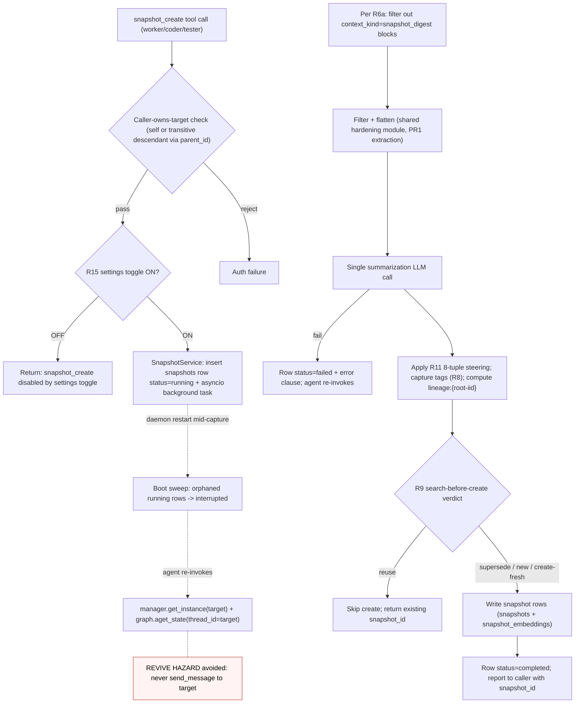
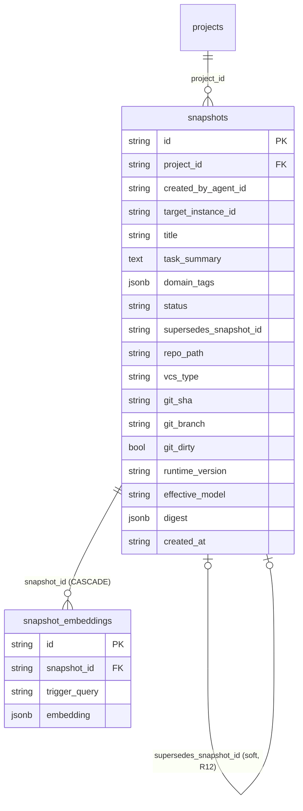

# Agent Snapshot — Design Exploration

**Status:** Rev 5 — user-ratified fold-in (Rounds 10-17, completed 2026-09-25). V1 scope locked: **per-instance pivot (P1)**, grants tightening (**P2-v1**), and the **R6-R16 fold-ins**. Architecture pivot from Rev 4: **capture unit = ONE instance (its own context/history)** — no tree walk, no flatten. **Only the D1 flattening reading is superseded**; D1's hard constraint (job/task/mission system must remain intact/unchanged) is **INTACT**.
**Date:** 2026-09-25 (Rev 5)
**Branch:** `plan/agent-snapshot` @ 720a2b39
**Method:** 6-worker competitive fan-out + dimension analysis, all reports spot-verified by the architect; two independent gates (developer feasibility — 38/38 anchors re-verified, zero substantive discrepancies; reviewer critique); user discussion rounds 1-4 (D1-D8 ratified in rounds 1-3; R8-R16 fold-in in rounds 10-17); round 5 (2026-09-25) is the user-ratified fold-in.

## Rev 5 (2026-09-25) — user-ratified fold-in summary

Rev 5 is a **scope-shape change** (per-instance pivot), not an architecture change. It folds in:

- **P1 — per-instance capture** (supersedes D1 flattening reading). Capture unit = ONE instance. Deleted: `snapshot_nodes` rows, 32-node cap + `truncated`, enumerate-first exclusion, per-node skip-and-record, per-node idempotency/refill, reduce-merge of child briefs, spawn `mode: flat|tree` param. Survives: row-ledger asyncio capture + boot sweep (D3), `_call_summarization_llm` + cheap-tier model chain, embeddings-at-creation, staleness/freshness, D6 ceiling, hardening-filter reuse, all three tool surfaces. Tree/lineage survives as **auto-derived tags** (`lineage:{root-iid}` from permanent `parent_id`).
- **P2-v1 — grants** (3 creators via per-tool `tools.allow` entries; consumption via `instance` category auto-grant, ari permanently excluded).
- **N-rules** — R6a (capture excludes `context_kind=snapshot_digest` blocks), R6b (`spawned_from_snapshot_id` stamp + auto-tag + capture-time banner), R6c norm ("snapshot-born: default skip unless materially new durable knowledge"), R7 (8-item skip list governing creators).
- **R8 tags** (typed `dim:value` strings — auto-derived + judgment).
- **R9 search-before-create** (creator protocol; consumer side collapsed by R14).
- **R10 ranking** (keep three-stage + freshness; ADD tag-overlap; recency tie-break deferred; usage monitoring-only).
- **R11 digest guidance** (5→8 extraction tuple; verbatim steering block).
- **R12 supersession** (`create-mints-successor`; no `snapshot_update` tool).
- **R13 rename** (`spawn_instance_from_snapshot` → `spawn_hot_instance`).
- **R14 auto-fallback** (mandatory result contract; expired → cold; stale-not-expired → warm + drift warning; fail-soft).
- **R15 settings toggle** (gates WRITE side ONLY; `spawn_hot_instance` always-on; default OFF, opt-in rollout).
- **R16 monitoring metrics** (light usage metrics; MONITORING ONLY, NOT a ranking signal).

**Renumbering note.** Section numbers in Rev 4 (27, 157, 414-439, 441-450, 456, 507, 546+) are renamed + param shape evolved in Rev 5. The grep-trap for e2e tests: `\bhot` word-boundary required (substring false-positives: snapshot, shot).

See §10 (decisions table) and §11 (reconciliation list) for the full superseded/resized state. See §12 (verification riders) for the implementation-PR checklist.

## Companion Artifacts

| Artifact | Role |
|---|---|
| **`design-exploration.md`** (this file) | Read first — the decisions, trade-off matrices, and recommendations |
| `machinery-inventory.md` | Verified machinery facts (independent read-only inventory, wanderer) — **superseded pointers only in Rev 5**; the inventory itself remains as the verified codebase fact base |
| `feasibility-notes.md` | Per-component seams, effort, verdicts, hidden-risk investigations, PR breakdown (§A is the execution blueprint) — **superseded pointers only in Rev 5**; the seams/anchors remain the implementation ground truth |

---

## 0. Executive Summary

**The problem.** Every new instance/team starts cold: re-reading guidelines, re-discovering domain context, re-exploring the same material (version-pump rituals, domain test packs). Burning tokens on already-solved exploration.

**⭐ North star (user, verbatim):** *"newly spawned agent ready to work — less thinking, less exploration."* Every decision in this document is checked against it (§10.1).

**The proposal.** An Agent Snapshot system: capture an agent instance's accumulated working context into durable, searchable storage; future agents warm-start via `spawn_hot_instance` (renamed in Rev 5 from `spawn_instance_from_snapshot`, see R13).

**[USER-FIXED v1] constraints (revised in Rev 5):**
1. **TOOLS ONLY** — `snapshot_create` / `snapshot_search` / `spawn_hot_instance` surfaced as a **per-instance tool surface**; agent judgment drives when to snapshot/search/consume; no auto-injection, no heuristic detection.
2. **Capture unit — RATIFIED 2026-09-25 (§10 P1):** capture unit is **ONE instance** (its own context/history); no tree walk; no flatten. The earlier Rev 4 "flatten to ONE snapshot" reading is **superseded** by the per-instance pivot — same one-snapshot outcome, simpler machinery, no per-node failure isolation, no `snapshot_nodes` table. Tree/lineage survives as **auto-derived tags** (`lineage:{root-iid}` from the permanent `parent_id` chain).
3. **The job/task/mission system must remain intact/unchanged** (hard requirement attached to the original D1 ratification — audit in §10; INTACT through the Rev 5 pivot).

**Grants (Rev 5 P2-v1):**
- **Creation (`snapshot_create` + `snapshot_search`):** worker, coder, tester ONLY. Per-tool `tools.allow` entries (`registry.py:64-105` + `instance.py:292-409` allow categories-or-tool-names mixed; precedents: leader `job_pause`/`job_resume` tool-level, wanderer `explore` carve, explorer rag deny-carve). The `snapshot` category remains for prompt-doc grouping (`CATEGORY_NAME`/`CATEGORY_DOC`) only.
- **Consumption (`spawn_hot_instance`):** ships in the `instance` category — **auto-granted to every `instance`-category holder, zero per-agent meta.json edits**. Verified holders (full enumeration at implementation time via `grep '"instance"' agents/*/meta.json`): `_mother`, `approver[v2]`, `architect`, `blueprinter`, `coder`, `developer`, `developer[v2]`, `governor`, `leader`, `planner`, `planner[v2]`, `project-manager`, `reviewer[v2]`, `tester`, `tidier[v2]`, `wanderer`. **Excluded by design:**
  - **worker, explorer** (leaf/latency — pure delegation profile; no recurring-shape work).
  - **ari — PERMANENT user decision:** *"ari manages jobs via job interface; this tool is for agents working directly like leader."* Recorded verbatim-in-spirit.

**Headline verdict on the user's hypothesis** ("reuse the context compaction feature as a summarizer with a modified prompt, plus a snapshoter applying it across a tree"):

> **Directionally correct, but the reuse surface is narrower than "the compaction feature."** All three independently-dispatched pipeline analyses converge: the genuinely reusable core is **one method plus its plumbing** — `_call_summarization_llm` (prompt-as-arg, `daemon/compaction.py:3325`; a `ContextCompactor` instance method — lightweight construction required, see §2.3) wrapping the model-override resolution, adaptive timeout, and HA-failover facade — plus the **dormant-instance read pattern** (`aget_state`, developer-verified including cold-load and daemon-restart cases). The Rev 5 per-instance pivot **deletes the tree walk** (`get_tree_ids_permanent`, `daemon/repositories/instance/repository.py:527`) entirely — capture is now a single instance's `aget_state`. The compactor *proper* — `compact_state`, the persist seam, the token-pressure trigger machinery, the shrink-to-fit prompts, the per-instance ExecutionGate — is structurally unfit and must NOT be reused.

**Recommended architecture (v1, Rev 5):**

| Decision | Recommendation | Confidence |
|---|---|---|
| Creation pipeline | **Approach B+ (modified reuse with extraction discipline)** — new `SnapshotService`/`SnapshotExecutor` reusing `_call_summarization_llm` (persona parametrized, lightweight construction) + shared content-hardening module; **capture is SINGLE-INSTANCE** (the target instance's own context/history) | High (developer-verified seams) |
| Trigger lane | **Row-ledger + asyncio + boot sweep** (developer ruling; the only lane that satisfies the D1 hard requirement — audit §10) | High |
| Storage | **Main ensemble PG, 2 new tables** (`snapshots` / `snapshot_embeddings`), D3-compliant — `snapshot_nodes` **DELETED in Rev 5** | High |
| Tags | **Typed `dim:value` strings** — auto-derived (project/agent/role/lineage/branch/from-snapshot/runtime) + judgment (kind: enum + free-form subsystem:/feature:/topic:); search gains optional `tag_mode: all\|any` (default all) | High |
| Consumption | **PER-INSTANCE — `spawn_hot_instance(agent_id, task, snapshot_id=None, tags=[], …)`** with auto-fallback (`R14`): explicit `snapshot_id` → verify-then-warm (verify-fail → cold + warning); no id → internal search → active-status candidates only (superseded never spawns); expired → cold fallback; stale-not-expired → warm with drift warning. Mandatory result contract: `{"instance_id", "started": "warm"\|"cold", "snapshot_id"?, "staleness": {...}, "hint"}`. NEVER an error on miss (fail-soft). | High |
| Staleness | **Metadata compare by default** (age + `daemon.__version__` + post-capture-advance check for live-tree captures — note: post-capture-advance check is now a single-instance check), **git-anchor opt-in** (`verify=git`) | High |
| Settings gating (R15) | **Daemon setting + FE settings-menu toggle gates WRITE side ONLY.** Default OFF (opt-in rollout). `spawn_hot_instance` ships always-on — toggle OFF = instant cold fallback per R14 | High |

**Prompt-line totals (Rev 5 D2):** ≈10-17 lines across 6-7 agents. Per-agent breakdown: worker 2-3 (Phase-7 light tier), coder 3-4 (full creator protocol), tester 3-5 (creator + hot-spawn for test-pack re-runs), developer[v2] 1-2 (consumer only), leader 1-2 (consumer only), ari 0-1 (relay note — ari is excluded from `spawn_hot_instance` itself but a relay line keeps the team coherent), wanderer 0 (no edits — has `instance` category; HOW-to-call rides `CATEGORY_DOC` at zero per-agent line cost).

---

## 1. Existing Machinery Inventory (verified)

### 1.1 Context compaction — how it works today

| Piece | What it does | Anchor | Reusable for snapshots? |
|---|---|---|---|
| `_call_summarization_llm(prompt, context)` | The LLM call: model-override resolution, `ThinkingChatOpenAI` + `clean_llm_config`, `wrap_langchain_failover`, adaptive timeout, never-silent construct fallback, empty-response guard | `daemon/compaction.py:3325-3440` | ✅ with two changes — it is a **`ContextCompactor` instance method** (lightweight construction or fold into the shared module) and the persona needs parametrizing |
| Hardcoded summarizer persona | `"You are a helpful assistant that summarizes conversations"` SystemMessage inside the reused call | `daemon/compaction.py:3429-3432` | ⚠️ **Must parametrize** (one optional argument — developer-verified feasible) |
| `resolve_compaction_model` | Cheap-model override chain (env `COMPACTION_MODEL` > yaml; pure function, `""` = no override) | `daemon/compaction.py:1295`; resolver `daemon/config.py:2835-2867` | ✅ pattern; **model chain `SNAPSHOT_MODEL > COMPACTION_MODEL > session`** (see §8) |
| Adaptive timeout | Per-prompt-size wall clock | `daemon/compaction.py:1176-1195` | ✅ AS-IS (inside the call) |
| Parallel pool + deadline budget | `Semaphore` + **ordered** `gather` + shared `_budget_remaining` deadline | `daemon/compaction.py:2811-2815, 2867-2935` | ✅ pattern (copy shape; ordered reassembly is the documented invariant) — **still useful for a single LLM call's deadline budget even when the capture is one-instance** |
| Content hardening | `_is_injected_message` / `_has_context_kind` (user-intent preservation — "Summarizing it would erase user intent"), `_extract_text_from_content` multimodal flattener (silent-garbage fix) | `daemon/compaction.py:108-146`, `:81` | ✅ **MUST share** (extraction gate — §2.3) |
| Trigger machinery | Token-pressure thresholds, 80% arm, dedup, precall estimates | `daemon/compaction.py:1893-2058` | ❌ inapplicable (snapshots are tool-driven) |
| `compact_state` (compactor proper) | Single-instance, quiesce-demanding, **mutates** conversation | `daemon/compaction.py:2062` | ❌ unfit |
| Persist seam | Single sentinel channel write (`[RemoveMessage(REMOVE_ALL), …]`) + separate `compacted_at` stamp; writes INTO the target checkpoint | `daemon/services/_compaction_persist_seam.py:72`, stamp `:142-169` | ❌ **opposite** of capture; dedup-stamp contamination hazard |
| `/compact` command path | Sync single-instance CommandDispatcher op; pause→quiesce (30s) because it WRITES | `daemon/services/compact_executor.py:1755`, quiesce `:264/:875` | ❌ wrong shape (sync, single-node) |
| Input clamp constant | `TRUNCATION_GLOBAL_INPUT_CAP_CHARS = 40_000` | `daemon/compaction.py:285` | ✅ precedent for the per-call snapshot clamp |

### 1.2 Instance / spawning / checkpoint machinery

- **Tree walk [DELETED in Rev 5 — see P1 pivot]:** `get_tree_ids_permanent(root_id)` — formerly the capture-time walk. **Survives only as a utility** for the lineage-tag computation (`lineage:{root-iid}` from permanent `instances.parent_id` chain). The capture walk itself is gone — `daemon/repositories/instance/repository.py:527` (BFS over permanent `parent_id`, depth cap 256 at `:33`, docstring explicitly blesses whole-tree cascades). Rev 5 reads `parent_id` for the **single target instance** only — to compute its `lineage:{root-iid}` tag.
- **Dormant read [REMAINS, single-instance only]:** `manager.get_instance(id)` + `graph_obj.aget_state(config)` — `daemon/services/compact_executor.py:732-738`. **Developer-verified end-to-end including the cold-load and daemon-restart case** (feasibility-notes §B(i)): `get_instance` has NO status filter (`instance_lifecycle.py:3861-3890`; `KeyError` only if the row is gone, `:3887-3888`); `_restore_instance` (`:3977-4370`) compiles the graph, registers it, and performs no status change / message emission / checkpoint write. Caveats in §9 (memory pins, watchover cascade asterisk).
- **Revive hazard:** `send_message` to a terminal instance auto-revives it to RUNNING — `daemon/services/instance_messaging.py:1897-1931`. (The older blueprint anchor `:1486-1510` is stale; so is a docstring at `repository.py:485-486` — both superseded.) A snapshotter must NEVER message its targets.
- **Spawn facade:** `manager.spawn_instance(agent_id, parent_id, project_id, instance_name, model, version_tag, …) -> (instance_id, model)` — `daemon/manager.py:6870`. Used by `spawn_hot_instance` (R13 rename — same underlying facade).
- **Atomic metadata write:** `set_metadata_many` — "ONE SQL statement… prevents torn-state" — `daemon/manager.py:3774`. Used for `snapshot_digest` AND `spawned_from_snapshot_id` writes (R6b).
- **Pause-first-then-quiesce** exists for checkpoint **writes**. Developer-verified from code (feasibility-notes §D1): compaction's write paths converge on a **single sentinel channel write**, so a concurrent `aget_state` observes the full pre- or post-compaction channel, **never a torn list** — "no pause needed; stamp staleness" is **confirmed**, with one cosmetic window (post-compaction messages + stale `compacted_at`) that snapshots don't gate on.
- **System prompt is NOT in checkpoints** (by design) — digest placement must go through the context-message seam.

### 1.3 Context injection (the consumption seam)

- `CONTEXT_KIND_*` constants — `daemon/services/context_messages.py:83-107`. `CONTEXT_KIND_SYMPTOM_REPAIR` (`:104`) exists precisely to place a doc in "the permanently non-selectable / hoisted bucket… survives every later compaction verbatim". The hoist is **truthy-keyed on any `context_kind` string** (no closed enum — `daemon/compaction.py:129-146`): a new kind requires **zero compaction changes**. **`CONTEXT_KIND_SNAPSHOT_DIGEST = "snapshot_digest"`** is the new constant.
- `_make_context_message(kind, title, content, id_=None)` — stamps `additional_kwargs={"injected_message": True, "context_kind": kind}`; stable ids make the `add_messages` reducer SUPERSEDE in place — `daemon/services/context_messages.py:130-165`. Does NOT escape — caller must run `escape_for_context_block` (`:147-152`).
- `assemble_context_messages` orchestrator (turn-1 assembly, persistent-vs-ephemeral split) — `daemon/services/context_messages.py:1589`.
- Critical-notes and shared-context blocks travel this seam — `:526-647` (reference-field truncation-with-hint at `:618-640`), `:1006-1059`.
- Compaction hoists `context_kind`-stamped messages verbatim — predicates `daemon/compaction.py:108-146`, partition `:217-249`, hoist `:551-556` via `_is_hoisted_injected` `:191`.

### 1.4 Knowledge systems (coexistence surface — §7)

- **Skills:** `skill_embeddings` (JSONB float arrays, no numpy/BYTEA, 1536-dim typical) — `daemon/repositories/skill/models.py:563-621`. Hybrid search: pure-Python BM25 (k1=1.5, b=0.75, "No numpy, no external BM25 library. Per `ensemble.spec`") + cached-embedding cosine rerank + LLM selection with BM25-only degrade — `daemon/services/skill_search_service.py:45-60`. Trigger queries 3-10, computed at creation AND update — `daemon/services/skill_embedding_service.py:11-12`, `:537`.
- **Critical notes:** leader-gated, lifecycle columns (pinned/superseded), `superseded_by_id` soft self-ref, `detail_ref` pointer pattern — `daemon/repositories/project/models.py:210-231`.
- **RAG `experience()`/`explore()`:** `experience()` dispatches kb-writer work as a JobItem on `system_kb_fifo_queue` (`daemon/tools/knowledge_tools.py:342-410`) — the internal-job precedent. Backend lives in the MCP/kb-writer subsystem (contract-level boundary holds — §7).
- **`.agents/shared/`:** planning dirs + context.md — file-surface convention.
- **Migrations:** runner is **SQLite-only** (`daemon/migrations/runner.py:719-727` — "Do not fix this to apply .sql files on PostgreSQL"); fresh **and existing** PG schema comes from `SQLModel.metadata.create_all`, which runs **every boot** (`daemon/manager.py:525`); `_ensure_postgres_columns` (`:5099`) exists only for columns on pre-existing tables. Checksummed, UP/DOWN convention per `daemon/migrations/versions/20260710_000001_create_skill_tables.sql:1-4, :101`.

### 1.5 Version / git anchors

- `daemon.__version__ = "0.14.0"` — `daemon/__init__.py:3`.
- Git usage in the daemon is confined to `daemon/services/doc_commit_service.py` — no repo-HEAD cache exists (§5).

### 1.6 Job pipeline shape (governs the trigger lane — §2.4)

`job_processor` understands **exactly two job shapes**: `job_type == "message"` jobs are skipped at dispatch (the Task row already exists — `daemon/services/job_processor.py:883, :1249`); everything else falls into the task branch that **spawns an agent instance**. Both working internal-job precedents (`experience()` → kb-writer; `skill_job_dispatcher.py:126-145` → skill-keeper) work *because the job carries an agent*. JAFP itself governs instance-execution work and counts **six** public entry points (`docs/architecture/job-as-front-primitive-invariants.md:22-29`) — a snapshot job is internal subsystem work and does NOT violate JAFP, but a `job_type='snapshot'` JobItem with no agent fits **neither** processor branch.

---

## 2. Decision Point 1 — Creation Pipeline (the headline question)

**Options explored competitively** (same skill, different approaches, one worker each):

- **A — Full reuse:** snapshot capture lives INSIDE the compaction subsystem (new trigger + prompt variant on the existing middleware/executor). No new service.
- **B — Modified reuse (user's hypothesis):** compaction untouched; new snapshot pipeline reusing its LLM-call plumbing with a new prompt + tree walk + own persistence.
- **C — Build new:** clean-room `snapshot_service.py` sharing only the generic `llm_failover` facade + repository patterns.

### 2.1 What each approach found (evidence highlights)

**A (full reuse) — collapses under inspection.** The reusable surface is "~2 of ~15 compaction subsystems" (`_call_summarization_llm` + model override). The compactor proper is single-instance, quiesce-demanding, checkpoint-mutating, wrong-prompt-shaped. Additional hazards unique to A: the `compacted_at` dedup stamp would silently suppress the next legitimate `/compact` on a snapshotted instance; `ExecutionGate` is per-instance with no tree-level serialization; tree TOCTOU without quiescence; prompt-fork drift inside the same file.

**B (modified reuse) — the reuse boundary is REAL but narrow.** The expensive, battle-tested part (failover facade, adaptive timeouts, never-silent fallback, parallel pool with deadline budget) is reachable via `_call_summarization_llm`, which takes an arbitrary prompt (`compaction.py:3325-3440`). Precise classification: reuse as-is = the call + model-override + timeout; reuse pattern = parallel pool (deadline budget still useful for one-call guarantee); parametrize = the hardcoded persona (`:3429-3432`); NEW = prompts, single-instance read, artifact, executor; NOT reused = persist seam, trigger machinery. B's weakest point: the persona parametrization + instance-method construction touch a 3,902-line battle-tested file.

**C (build new) — cleanest shape, but re-learns hard-won behavior.** The persist-seam problem disappears entirely (additive writes only). But compaction's content-hardening corpus (~150-250 lines of subtle, bug-derived behavior) would need re-learning; skipping it yields **confidently-wrong digests** (silent garbage). C's mitigation is precedented: `graph.py:1866-1867` already lazily imports `_extract_text_from_content` — extracting predicates + flattener into a neutral shared module converts "re-learn" into "import". C's gate: **shared-module extraction lands BEFORE the first snapshot summarizer.**

**Convergence (all three, pre-Rev-5):** walk = `get_tree_ids_permanent`; read = `aget_state` (no revive, no pause — now developer-confirmed, §1.2); never `send_message` to targets; facade-based LLM invocation; per-node failure isolation; cheap-tier model default.

**Rev 5 reduction (post-fold-in):** the tree walk is **deleted** — capture is single-instance (§1.2). All three workers' convergence on "walk = `get_tree_ids_permanent`" simplifies to: read = `aget_state` on the target instance only. Per-node failure isolation collapses to a single try/except. The cheaper capture surface makes the per-node idempotency / `snapshot_nodes` rows / reduce-merge all disappear.

### 2.2 Five-axis comparison (normalized: **higher = better on every axis; Risk and Cost are inverted so higher = safer/cheaper**)

Weights: Complexity 20% · Scalability 20% · Maintainability 25% · Risk 20% · Cost 15%.

| Approach | Complexity | Scalability | Maintainability | Risk | Cost | Weighted |
|---|---|---|---|---|---|---|
| A: Full reuse | 2 (fork + sink + tree lock + prompt plumbing despite "reuse" label) | 2 (serialized per-node engine, no batching, O(N) LLM calls) | 3 (parallel codepath; `/compact` regression surface) | 2 (dedup contamination, tree TOCTOU, gate mismatch, prompt drift) | 3 (per-node LLM cost, no budget enforcement) | **2.40** |
| **B: Modified reuse** | 2 (plumbing reused wholesale; ~500-700 LOC new; **Rev 5 reduces further — no walk, no per-node machinery, ~400-500 LOC**) | 4 (bounded by chunk_concurrency + lane caps; **Rev 5: bounded by single-call deadline**) | 4 (follows compact_executor precedent; second consumer of compaction internals) | 2 (read-only on targets; two contained touches) | 3 (N conversations as LLM input; cheap-tier chain + budget; **Rev 5: ONE conversation as LLM input — cost drops materially**) | **3.05** (Rev 5: **3.30** — single-instance simplifies every axis) |
| C: Build new | 3 (new service+repo+tool wiring; no trigger/sentinel inheritance) | 4 (additive writes, semaphore-capped) | 3 (single-purpose service; second summarizer codepath until extraction) | 2 (read-only; worst case = bad snapshot row, never corrupted conversation) | 3 (token cost approach-invariant; one-time re-derivation) | **3.00** |

B and C land within noise (3.05 vs 3.00). Applying the tie-break sequence (equal weighted totals → best Risk score → best Complexity score): both tie at Risk 2, and **B's Complexity score (2) beats C's (3) under the higher-is-better convention — B's raw complexity is genuinely lower** (the plumbing is imported rather than re-derived). B edges C. **Rev 5 widens the gap**: B's per-instance capture drops ~100-200 LOC of walk/skip-record/refill machinery that C would also have to write — the per-instance simplification accrues equally to both, but B's reuse of `_call_summarization_llm` + the deadline-budget pool shape remains the dominant cost saver. The deeper reading: **each report's weakest point is cured by the other's mitigation**, which is exactly what the recommendation below adopts.

### 2.3 Recommendation — **Approach B+ (modified reuse with extraction discipline)** [RATIFIED — Rev 5]

A new `SnapshotService` + `SnapshotExecutor` (C's clean service shape — sibling of `compact_executor.py`) that:

1. **Reuses `_call_summarization_llm`** (B's real reuse boundary) with two developer-verified changes: (a) it is a `ContextCompactor` **instance method** — construct a lightweight compactor carrying the target instance's LLM config + a synthetic `CompactionContext` (only `.config` is read on this path), or fold the call body into the PR1 shared module; (b) the persona parametrized as **one optional argument** at `compaction.py:3429-3434` (the SystemMessage is inlined at a single call site). A snapshot-side wrapper pins the call shape so later compaction signature drift breaks loudly.
2. **Extracts the content-hardening corpus** (`_is_injected_message`, `_has_context_kind`, `_extract_text_from_content`, partition/hoist predicates) into a neutral shared module (C's gate — converts silent-wrong-digest risk into an import; `graph.py:1866-1867` is the existing precedent), swapping graph.py's lazy import to the new home. **Rev 5 uses these predicates for the R6a negative-space exclusion** (skip `context_kind=snapshot_digest` blocks from summarization input — already-persisted knowledge).
3. **Owns its prompts** (new `snapshot_prompts.py`): durable-knowledge extraction — see **R11** for the 8-tuple steering block (decisions, gotchas, conventions, open threads, artifact refs, worked-vs-wasted with reasons, mid-run workflow refinements, judgment calls + reasoning, dead-ends-remembered-as-dead-ends) — NOT compaction's next-turn-continuity contract. **Quality steering (D6):** the prompt steers toward GOOD, well-chosen context — the ~25k-token ceiling is a ceiling, not a target; padding toward it is a prompt-level failure.
4. **Model chain `SNAPSHOT_MODEL > COMPACTION_MODEL > session model`** (mirroring `_resolve_compaction_model`, `daemon/config.py:2835-2867`): an operator who already pinned the cheap compaction tier gets cheap snapshot calls by default; a bare `""` must NOT fall straight to the session model (that would make every snapshot a main-model call). Stamp the effective model into the snapshot row for cost forensics.
5. **Never touches** the persist seam, trigger machinery, or `compact_state`.

**Rev 5 deletion (post-fold-in):** the walk pipeline (`get_tree_ids_permanent` BFS, enumerate-first exclusion, per-node skip-and-record, per-node idempotency/refill, reduce-merge of child briefs) is **deleted in full**. Capture is `manager.get_instance(target) + graph.aget_state(config)` on the target instance only.

**Assumption that would flip this:** if compaction enters a heavy-refactor cycle (making any shared-module/persona touch expensive), C's clean-room with same-PR extraction becomes the winner — the delta is one extraction PR either way.

### 2.4 Pipeline semantics (agreed by all three approaches + developer rulings) — Rev 5

- **Trigger [RATIFIED — §10 D3]:** `snapshot_create` tool → `SnapshotService.capture_async(...)` asyncio background task; the `snapshots` row **is** the durability ledger (`status: running → completed | failed | interrupted`). **Developer ruling (feasibility-notes §D3):** the JobItem lane has no home — `job_processor` knows exactly two shapes (§1.6) and a no-agent `job_type='snapshot'` job fits neither; retrofitting it means a new dispatch branch + execution processor + terminal-token contract + full e2e lane gates ≈ an L-sized PR. **v1 = row-ledger; JobItem lane deferred** (and now additionally constrained-blocked by the D1 hard requirement — audit, §10).
- **Restart recovery:** a **boot sweep** marks orphaned `running` rows `interrupted` (one idempotent startup query — same shape as `JobRecoveryService.recover_on_startup`, scoped to one table). Lost: automatic retry. Kept: the agent sees the failure and can re-invoke.
- **Capture (Rev 5 — single-instance):** no walk. `manager.get_instance(target_instance_id)` + `graph.aget_state({"configurable":{"thread_id": target_instance_id}})` on the **target instance only**. The tree/lineage is recovered **lazily** when the agent constructs tags — `parent_id` chain walk for `lineage:{root-iid}` (read-only, not a capture walk; same `get_tree_ids_permanent` utility, but used for tag computation, not capture). Per Rev 5 deletion: no 32-node cap, no `truncated`, no enumerate-first exclusion, no per-node skip-and-record, no per-node idempotency/refill, no reduce-merge.
- **Live vs terminal instances:** terminal = exact capture; live = last-committed-boundary read, stamped `captured_at` per snapshot. No-pause is **developer-confirmed from code** (§1.2): the sentinel-write design means a racing read never sees a torn channel. The Rev 5 **post-capture-advance check** is now a single-instance check (the captured node's `instance_id` ref vs its current status) — one DB read.
- **Concurrency:** reads don't mutate → two concurrent snapshots of the same instance are safe (idempotency key `target_instance_id+hash` handed to storage for dedup). LLM call bounded by the deadline-budget pool shape (still useful as a single-call wall-clock guarantee).
- **Failure:** single-instance capture means single try/except around the read+LLM+write. `KeyError` on hard-deleted instance rows (`instance_lifecycle.py:3887-3888`) is the concrete exception the try/except must tolerate.
- **Cost caps — COMMITTED (§8):** **40k chars (~10k tokens) per-call input clamp** (matches `TRUNCATION_GLOBAL_INPUT_CAP_CHARS`, `compaction.py:285`); **600s per-snapshot wall clock**; cheap-tier model chain default. **Rev 5 deletes the 32-node cap** (capture is single-instance).



---

## 3. Decision Point 2 — Storage & Data Model

### 3.1 Options (normalized: **higher = better; Risk/Cost inverted — higher = safer/cheaper**)

| Option | Complexity | Scalability | Maintainability | Risk | Cost | Weighted |
|---|---|---|---|---|---|---|
| **Main PG, 2 tables (Rev 5 — D3)** | 4 | 4 | 5 | 4 | 4 | **4.25** |
| Main PG, 3 tables (Rev 4) | 4 | 4 | 4 | 4 | 4 | **4.00** |
| Separate SQLite store | 3 | 2 | 2 | 2 | 3 | 2.40 |
| File/blob store + index table | 2 | 4 | 2 | 3 | 3 | 2.75 |
| Main PG + pgvector | 2 | 5 | 3 | 2 | 3 | 3.00 |

**Recommendation: main ensemble PG (PostgreSQL primary, SQLite-compatible), 2 new tables — D3 followed, no deviation warranted.** **Rev 5 reduces from 3 tables to 2** by deleting `snapshot_nodes` (the per-tree-member rows are gone with the tree walk — per-instance capture is a single header row + its embeddings). The skill subsystem proves the shape in production: 1536-dim float arrays live happily as JSONB; snapshot digests are text, orders of magnitude smaller. pgvector adds an extension dependency for a problem JSONB+cosine already solves at v1 volumes.

**DB guardrail (user directive):** The feature **ADDS NEW TABLES** (`snapshots`, `snapshot_embeddings`) — expected and fine. **Existing tables stay INTACT.** Modify an existing table **only if a must** to keep the system stable; any such must-change is **flagged explicitly in this doc** and would carry a **user-visible callout at implementation**. *Currently flagged:* none — the only schema decision in this doc is the `root_instance_id` → `target_instance_id` column rename **inside the new `snapshots` table** (§3.2; a new-table design choice, not an existing-table modification).

### 3.2 Schema (Rev 5 — 2 tables)

- **`snapshots`** (header + digest + filterable search metadata + tags — Rev 5): `id`, `project_id` (FK), `created_by_agent_id`, `target_instance_id` (soft TEXT — no FK: the terminate/revive lifecycle makes hard FKs wrong, per the `superseded_by_id` precedent at `project/models.py:215-222`; was `root_instance_id` in Rev 4, renamed in Rev 5 to reflect per-instance capture), `title`, `task_summary` (BM25 corpus), **`domain_tags` JSONB** (R8 — typed `dim:value` strings, both auto-derived and judgment; queryable via `tag_mode: all|any` search filter), `status` (**`active` | `superseded` only — R12 ratifies create-mints-successor; an active→superseded atomic flip in the same transaction as the new row's insert**), `supersedes_snapshot_id` (soft self-ref; R12), `repo_path`, `vcs_type`, `git_sha`, `git_branch`, `git_dirty`, `runtime_version`, `effective_model` (cost forensics), **`digest` JSONB** (stored knowledge, unbounded by the consume-side ~25k-token ceiling, with a `refs`/`artifacts` section, see §10.1 D6 — **no `truncated` column in Rev 5**), `created_at`.
- **`snapshot_embeddings`** (mirrors `skill_embeddings` exactly): `id`, `snapshot_id` (FK CASCADE), `trigger_query` (≤512), `embedding` (JSONB floats).

**Status vs freshness (dead-state resolution):** the stored `status` enum is a **lifecycle** property with a real writer (`active` on create; `superseded` when a newer snapshot of the same target explicitly supersedes via R12). `fresh | stale | expired` are **computed at query time** from `age_days` / `runtime_version` thresholds (§5) — never stored, so there is no dead `expired` column state needing a flip mechanism.

**Why 2 tables (Rev 5):** per-instance capture has no ordered 1:N tree to persist — one header row + its 1:N vectors. The previous `snapshot_nodes` table is deleted (the per-tree-member shape no longer exists; the tree/lineage is encoded as tags on the header). Flattening one row into one header blob kills per-vector queries (anti-pattern flagged), so embeddings stay separate.



### 3.3 Migration path (simplified per developer ruling — feasibility-notes §D2)

1. New `daemon/migrations/versions/{YYYYMMDD}_{HHMMSS}_create_snapshot_tables.sql` — serves **SQLite + the audit trail**; timestamp must sort after `20260915_212810_…` (latest today); UP **and** DOWN sections; SHA-256 content checksum recorded at apply (`runner.py:67-68`); runner is SQLite-only by design (`runner.py:719-727`).
2. **PG needs no migration-mirror step for brand-new tables:** `SQLModel.metadata.create_all` runs every boot (`manager.py:525`) and creates missing tables on both fresh AND existing PG databases. The load-bearing requirement is **importing the snapshot models package before `manager.py:525` executes** (precedent: the `SchemaMigration` import at `:520-522`).
3. SQLModel package `daemon/repositories/snapshot/` (`models.py`, `repository.py`) with `JSONBType` (`daemon/repositories/infra/types.py:35` — degrades to JSON on SQLite).
4. No backfill — brand-new tables.

### 3.4 Search (D4 parallel, not duplicate)

`snapshot_search` parallels the skill hybrid: **shared** — pure-Python BM25 + cached-embedding cosine rerank + LLM selection with BM25-only degrade; **snapshot-specific** — corpus = `task_summary` + `digest.task_summary_text` + `domain_tags`; candidate filter by project + `status='active'`; freshness post-filter after ranking; no usage-metrics/A-B in v1. Trigger queries generated from `task_summary` + 1-2 digest excerpts (grounds them if summaries are thin; **Rev 5 reduces from 2-3 node digests to 1-2 excerpts** since there is no per-node digest).

- **Embedding lifecycle reconciled:** v1 snapshots are **immutable** (R12 supersede, never update) — embeddings are computed **at creation only**; D4's "computed at creation AND update" maps to R12 supersession minting a fresh row with fresh embeddings.
- **Tag filter (R8):** search gains optional `tag_mode: all|any` (default `all`). `tag_mode=all` requires every supplied tag to match; `tag_mode=any` is OR-semantics. Filter via JSONB containment on PG (`@>`) with GIN index; SQLite fallback is a JSON-string scan at v1 volumes.
- **Tag-overlap ranking signal (R10):** ADD to the three-stage hybrid — tag overlap between query and candidate's `domain_tags` contributes to the BM25 + cosine score. Recency tie-break is parked (R10 phase-2). Usage-ranking stays deferred (R16 monitoring-only).
- **Search-side LLM cost is bounded by candidate count [COMMITTED]:** the LLM-selection stage runs only over the **top-20** hybrid-ranked candidates (hard cap); beyond K the ranking degrades to the BM25+cosine+tag-overlap order — mirroring skill_search's graceful-degrade shape.
- **Drift hazard:** direct import of skill-search helpers couples the two ranking behaviors — pin with tests in the same PR (or extract `text_search_common.py` when a third consumer appears).

---

## 4. Decision Point 3 — Consumption (per-instance + auto-fallback)

### 4.1 Options (normalized: **higher = better; Risk/Cost inverted — higher = safer/cheaper**)

| Option | Complexity | Scalability | Maintainability | Risk | Cost | Weighted |
|---|---|---|---|---|---|---|
| **PER-INSTANCE + auto-fallback (Rev 5)** — `spawn_hot_instance(agent_id, task, snapshot_id=None, tags=[])` with warm/cold/hint result contract | 4 | 4 | 5 | 4 | 4 | **4.25** |
| FLAT (Rev 4) — one instance, digest as persistent stamped HumanMessage, `mode="flat"` vs `mode="tree"` (latter = child briefs inline) | 4 | 3 | 4 | 4 | 4 | **3.80** |
| TREE RESTORE — re-spawn parent + children | 1 | 2 | 1 | 1 | 2 | 1.35 |
| HYBRID — flat + deferred subtree expansion | 3 | 3 | 3 | 3 | 3 | 3.00 |

### 4.2 Why tree restore is rejected (structural, not preferential) — AND why Rev 5 collapses FLAT

The snapshot's children **already finished their work**. Re-spawning them produces a **zombie tree**: no pending task, no LLM wake. The completion watcher registers only when a child task/message id exists (`daemon/tools/instance.py:686` — `_register_child_completion_watcher`); the parent's `waiting_children` gate never flips; the parent either idles forever or someone must hand-assign new tasks — which contradicts the feature's purpose.

**Rev 4 reading (now superseded):** structure **preserved as data** — root digest + ordered per-child briefs flattened into **ONE snapshot and ONE spawned instance's context**. **Rev 5 collapses this further**: capture is **per-instance**, so there is no tree shape to "flatten" — the tree/lineage is encoded as tags on the single-instance snapshot. The original D1 hard requirement (job/task/mission system must remain intact/unchanged) is INTACT through both Rev 4 and Rev 5 (audit in §10).

### 4.3 Recommendation — Per-instance with auto-fallback [RATIFIED 2026-09-25 — §10 P1 + R14]

**Signature (R13 + R14 — replaces Rev 4's `spawn_instance_from_snapshot`):**

```python
class SpawnHotInstanceInput(BaseModel):
    agent_id: str
    task: str                          # self-contained; digest lands BEFORE this in context
    snapshot_id: str | None = None      # explicit id → verify-then-warm (verify-fail → cold + warning)
    tags: list[str] = []               # steer internal search when snapshot_id is None
    instance_name: str | None = None
    model: str | None = None           # mirrors spawn_instance fallback semantics
    verify: Literal["metadata", "git"] = "metadata"   # staleness check depth
```

**Behavior (R14 — auto-fallback semantics):**

- **Explicit `snapshot_id`:** verify the snapshot exists, project-matches, `status='active'` (superseded never spawns — R12), and pass staleness (§5). On pass → **warm-start** with the digest injected (§4.3 placement). On verify-failure → **cold fallback + warning** in the result (never an error — fail-soft).
- **No `snapshot_id`:** internal search — derive a query from `task` (steered by `tags`); pick the top active-status candidate. **Expired → cold fallback** (`freshness == "expired"` from §5 thresholds). **Stale-not-expired → warm with drift warning** (drift-note mandate; R14 result contract below). **No hit → cold fallback** (fresh spawn, no snapshot consumed).
- **Mandatory result contract (R14 — never an error on miss):**
  ```python
  {
    "instance_id": "<iid>",
    "started": "warm" | "cold",
    "snapshot_id": "<sid>" | None,    # None on cold-no-hit
    "staleness": {"snapshot_age_days": float, "freshness": "fresh"|"stale"|"expired", "warnings": [...], "repo_state": {...}?},
    "hint": "Warm-started from snapshot {id} (age {n}d; tags …)" | "No matching snapshot — spawned cold (searched: …; reason: no-hit | expired | verify-failed)",
    "error": None | "<error-string>"
  }
  ```
- **Fail-soft convention (R14):** "never an error on miss" — cold fallbacks are not errors. Errors are reserved for true failures (auth failure, system fault). Consumer-side R9 search-before-create **collapses** to: "call `spawn_hot_instance` for recurring-shape work; read the warm/cold line; cite it in your dispatch/report."

**Digest placement (developer-verified on every path):** during spawn, atomically write `instance_metadata["snapshot_digest"]` AND `instance_metadata["spawned_from_snapshot_id"]` (R6b) via `set_metadata_many` (`manager.py:3774`) **before** returning the instance_id (turn-1 ordering is fully under the tool's control); on TURN 1, `assemble_context_messages` (`context_messages.py:1589`) reads `snapshot_digest` and emits the block via `_make_context_message(kind=CONTEXT_KIND_SNAPSHOT_DIGEST, id_=f"snapshot_digest:{instance_id}")`. **Feasibility-notes §D4 verified the stamp survives all five compaction/mutation paths** — summarization partition+sentinel, emergency truncation (which never sees hoisted messages and re-attaches them verbatim, `compaction.py:2328-2351`), precall-95%, stamp-only, and CLE-retry — plus the loop breaker. The hoist is truthy-keyed, so **zero compaction changes** are needed.

- **Escape-then-cap ordering [developer-verified discipline; D6-ratified ceiling]:** `_make_context_message` does NOT escape (`:147-152`); run `escape_for_context_block` FIRST (escaping can expand content up to ~6× — the KV-block lesson, `context_messages.py:932-975`), then enforce the **hard ceiling of ~25k tokens, strictly counted** (D6, 2026-09-23), tail-truncating with a `snapshot_search`-for-full-body hint (critical-notes reference-truncation shape, `:618-640`). Truncate, never skip — a digest that silently doesn't land defeats warm-start. **The cap bounds INJECTION, not knowledge** — the full digest (with refs/artifacts) persists in the DB and is fetchable (§10.1 D6).
- **Hoisted-token accounting (updated for the 25k ceiling):** hoisted tokens sit in the compaction gate numerator and are never compaction-relievable. A full 25k-token digest ≈ ~3.6% of a 700k window (fine) but ≈ ~20% of a 128k-class window — permanently. Hence D6's **ceiling-not-target semantics**: the prompt steers toward well-chosen context; the stable-id supersede + one-digest-per-instance keeps N-digest inflation bounded; assert the ceiling in the injection hook.
- **System prompt is forbidden placement** (not checkpointed — lost across pause/resume, invisible to the agent's reasoning).
- **`snapshot_search` returns metadata + digest preview only** — the full body is read at spawn time. Keep the surfaces distinct.
- **R6b stamp:** `instance_metadata["spawned_from_snapshot_id"]` is the second atomic write at spawn (alongside `snapshot_digest`); it feeds the `from-snapshot:{id}` auto-tag (R8) and the capture-time banner in subsequent re-captures (R6c).
- **Cross-project isolation:** `snapshot_create` stamps `project_id` from the **target instance's project**; `snapshot_search` scopes to the caller's project by default; `spawn_hot_instance` validates `snapshot.project_id` matches the spawn's project unless explicitly overridden — preventing cross-project digest leakage through a shared leader.
- **Poisoning posture (see 🔴 §9):** the digest is permanently hoisted and trusted by warm-started agents — mitigations are mandatory, not optional.

```mermaid
flowchart TD
    %% Entry — spawn_hot_instance(agent_id, task, snapshot_id=None, tags=[], verify=metadata) — R13+R14
    C1["spawn_hot_instance tool call (instance-category holder, NOT ari)"]
    %% tools/instance.py:663
    A1{"Auth: _check_team_membership"}
    X1["Auth failure"]
    %% R14 explicit-id branch
    E1{"snapshot_id provided?"}
    R1["Lookup snapshot row (digest, tags, staleness stamps)"]
    %% age_days + runtime version + post-capture-advance (default) / git HEAD compare (opt-in verify=git) — no LLM
    S1["Staleness compute - sync, no LLM"]
    V1{"verify: active status, project match, staleness <= thresholds?"}
    E2["Internal search (query=task, steered by tags)"]
    %% R8 tag_mode=all|any default all
    PICK{"Pick top active candidate"}
    WARM["warm: digest placement via CONTEXT_KIND_SNAPSHOT_DIGEST"]
    COLD["cold: standard spawn_instance; no digest"]
    %% manager.py:6870 — existing spawn lane, unchanged (D1 hard requirement)
    SP1["manager.spawn_instance"]
    %% manager.py:3774 set_metadata_many (snapshot_digest + spawned_from_snapshot_id — R6b)
    AW1["Atomic write: instance_metadata snapshot_digest + spawned_from_snapshot_id"]
    RET1["Return R14 result contract {instance_id, started, snapshot_id?, staleness, hint}"]
    %% R15: spawn_hot_instance is always-on; OFF only affects write-side (snapshot_create)
    SM1["Caller: send_message(instance_id, task) - fire-and-forget"]
    %% context_messages.py:1589
    AC["assemble_context_messages reads snapshot_digest"]
    %% stable id snapshot_digest:{iid} — escape FIRST, then ~25k-token hard ceiling (D6)
    MC["_make_context_message kind=snapshot_digest"]
    %% compaction.py:108-152 hoisted bucket — verified all five mutation paths
    SC["Stamped message survives all compaction"]
    W1A["New instance starts WARM (digest in turn 1, task follows)"]
    W1C["New instance starts COLD (no digest)"]
    %% R14 hint: warm-cold citation contract
    HINT["Caller cites 'warm from snapshot X (age n d; tags ...)' or 'cold (reason ...)' in dispatch/report"]

    C1 --> A1
    A1 -->|"pass"| E1
    A1 -->|"reject"| X1
    E1 -->|"yes"| R1
    E1 -->|"no"| E2
    R1 --> S1
    S1 --> V1
    V1 -->|"pass"| WARM
    V1 -->|"fail"| COLD
    E2 --> PICK
    PICK -->|"found + not expired"| S1
    PICK -->|"expired"| COLD
    PICK -->|"no hit"| COLD
    WARM --> SP1
    COLD --> SP1
    SP1 --> AW1
    AW1 --> RET1
    RET1 --> SM1
    SM1 --> AC
    AC --> MC
    MC --> SC
    SC --> W1A
    SC --> W1C
    RET1 --> HINT

    linkStyle 17 stroke:#c0392b
    classDef rejected fill:#fff3f3,stroke:#c0392b,color:#000000
    classDef warm fill:#e8f5e9,stroke:#2e7d32,color:#000000
    classDef cold fill:#fff8e1,stroke:#f57c00,color:#000000
    class WARM warm
    class COLD cold
    class SC rejected
```



---

## 5. Decision Point 4 — Staleness Verification

### 5.1 Options (normalized: **higher = better; Risk/Cost inverted — higher = safer/cheaper**)

| Option | Complexity | Scalability | Maintainability | Risk | Cost | Weighted |
|---|---|---|---|---|---|---|
| **(b) Freshness metadata** — age_days + `daemon.__version__` vs snapshot stamp | 4 | 5 | 5 | 4 | 5 | **4.60** |
| (a) Git-state anchor — `git rev-parse HEAD` vs snapshot SHA | 3 | 4 | 3 | 3 | 3 | 3.20 |
| (c) Content-hash spot-check — hash files the digest references | 1 | 2 | 1 | 3 | 1 | 1.60 |

### 5.2 Recommendation — (b) default + (a) opt-in; skip (c)

- **Default (every consume call, sync, no LLM, no subprocess):** compare snapshot `runtime_version` stamp vs `daemon.__version__` (`daemon/__init__.py:3`) + `age_days` vs a freshness ceiling. **Plus (live-tree captures, §10.1 D7 adjustment):** a **post-capture-advance check** — one cheap DB read on the captured instance's soft `target_instance_id` ref; if the captured instance has since transitioned to a terminal state, emit `"tree advanced post-capture"` in warnings (Rev 5: this is now a single-instance check, since capture is per-instance). This catches the specific live-tree hazard (the work moved on after the digest froze) that age/version cannot see.
- **Opt-in (`verify=git`):** `git rev-list --count <snapshot_sha>..HEAD` + diverged-file count. Git usage in the daemon today is confined to `doc_commit_service.py` — a daemon-wide repo-HEAD anchor is a new coupling; keep opt-in.
- **Skip (c):** digests are working narratives, not file manifests.

**`staleness_report` shape** (returned by both `snapshot_search` and `spawn_hot_instance`):

```python
{
  "snapshot_age_days": float,
  "freshness": "fresh" | "stale" | "expired",   # computed, never stored
  "warnings": ["runtime version drift: 0.13.10 → 0.14.0",
               "tree advanced post-capture (live-tree snapshot)", ...],
  "repo_state": {            # populated only when verify=git
    "snapshot_head": "<sha>", "current_head": "<sha>", "diverged_files": int
  }
}
```

Verification runs inline in the tool body. The report is surfaced to the spawning agent — **the agent decides whether to trust** (no silent override), and the leader prompt line (§6.2) mandates a drift note in the dispatch when stale.

---

## 6. Tool Surface + Prompt Updates

### 6.1 Signatures and registration [RATIFIED — Rev 5]

Convention: Pydantic `BaseModel` + `Annotated[..., Field]`, matching `SpawnInstanceInput` (`daemon/tools/instance.py:1853`); dict-with-`error` returns matching the command-shape factory (`daemon/tools/critical_notes.py:292`); error strings, never raises (`instance.py:2224-2226`).

```python
class SnapshotCreateInput(BaseModel):                  # was SnapshotCreateInput (Rev 4); name unchanged, signature evolved
    target_instance_id: str          # the capture target — single instance (Rev 5: was root of subtree)
    name: str                        # e.g. "version-pump-taskpack-after-v0.13.9"
    tags: list[str] = []             # R8 typed dim:value strings; 2-4 judgment, cap 8 total
    # Rev 5 deletions: scope param (per-instance is the only mode); include_message_history (D5 — digest-only)

class SnapshotSearchInput(BaseModel):
    query: str
    project_id: str | None = None    # None = current instance's project
    tags: list[str] = []             # R8 filter
    tag_mode: Literal["all", "any"] = "all"   # R8 — default all
    freshness_max_age_days: int | None = None
    limit: int = 10                  # 1..50

class SpawnHotInstanceInput(BaseModel):                 # was SpawnFromSnapshotInput (Rev 4) — RENAMED R13
    agent_id: str
    task: str                        # self-contained; digest lands BEFORE this in context
    snapshot_id: str | None = None   # R14: explicit id → verify-then-warm; None → internal search
    tags: list[str] = []             # R14: steer internal search when snapshot_id is None
    instance_name: str | None = None
    model: str | None = None         # mirrors spawn_instance fallback semantics
    verify: Literal["metadata", "git"] = "metadata"   # staleness check depth
    # Rev 5 deletions: mode param (per-instance is the only consumption shape)
```

Returns (Rev 5):
- `snapshot_create` → `{"snapshot_id", "status", "digest_preview", "tags", "error"}` (R9 verdict-aware — may be `reused-existing-snapshot-id` instead of a new create)
- `snapshot_search` → `{"results": [{snapshot_id, name, tags, freshness, age_days, summary}], "error"}`
- `spawn_hot_instance` → R14 result contract: `{"instance_id", "started": "warm"|"cold", "snapshot_id"?, "staleness": {...}, "hint", "error"}`

- **Home:** `daemon/tools/snapshot_tools.py` — `CATEGORY_NAME`/`CATEGORY_DOC` module attrs + `create_snapshot_tools(manager, current_instance_id, agent_id, version_tag)` factory + 3 × `@register_tool_category("snapshot")` + `@tool` closures.
- **Grants (Rev 5 P2-v1):**
  - `snapshot_create` + `snapshot_search` → per-tool entries in `tools.allow` for **worker, coder, tester** only.
  - `spawn_hot_instance` → ships in the **`instance` category** (auto-granted to every `instance`-category holder, zero per-agent meta.json edits). Verified holders (`grep '"instance"' agents/*/meta.json`): `_mother`, `approver[v2]`, `architect`, `blueprinter`, `coder`, `developer`, `developer[v2]`, `governor`, `leader`, `planner`, `planner[v2]`, `project-manager`, `reviewer[v2]`, `tester`, `tidier[v2]`, `wanderer`. **Excluded by design:** worker, explorer (leaf/latency), **ari — PERMANENT user decision** (*"ari manages jobs via job interface; this tool is for agents working directly like leader."*).
- **Registration — the exact 6-file chain (developer-traced, feasibility-notes §B(ii) — unchanged in Rev 5):**
  1. `daemon/tools/snapshot_tools.py` — NEW (above).
  2. `daemon/tools/_tool_registry.py` — `CATEGORY_MODULES` += `"snapshot": "daemon.tools.snapshot_tools"` (dict at `:513-570`); `DYNAMIC_TOOL_NAMES` += the **3 names** (`snapshot_create`, `snapshot_search`, `spawn_hot_instance`) at `:23-110`.
  3. `daemon/tools/instance.py` — import + call inside `create_instance_tools` (precedent: skill tools at `:4709-4711`).
  4. `daemon/loader.py` — **warm-list entry** (`:42-63`) — ⚠️ **skipping this pins an EMPTY category into the no-TTL prompt cache on cold boot**.
  5. `agents/worker/meta.json` — `tools.allow` += `"snapshot_create"`, `"snapshot_search"`.
  6. `agents/coder/meta.json` — same.
  7. `agents/tester/meta.json` — same.
  Non-blocking follow-up: regenerate `KNOWN_TOOL_NAMES` via `discover_source_only_tool_names()` (registry `:370-372`) so frozen builds don't false-positive — pin with a source-discovery test.
- **Auth:** create = caller-owns-target (self or transitive descendant via `parent_id`); search = project-scoped open; spawn-hot = `_check_team_membership` (`daemon/tools/instance.py:663`), same TOCTOU caveat as `spawn_instance`.
- **R15 settings gating:** `snapshot_create` consults the daemon settings toggle; OFF → returns a clean disabled result (`{"disabled": True, "error": "snapshot_create disabled by settings toggle"}`). `snapshot_search` and `spawn_hot_instance` are NOT gated — search is read-only; spawn-hot has its own fail-soft cold fallback when no snapshot is consumable.

### 6.2 Prompt updates — line budget [Rev 5 D2 — ≈10-17 lines across 6-7 agents]

The Rev 4 D2 ratification (8-12 lines/agent) is **superseded** by Rev 5's P2-v1 grant tightening: **creators are 3 agents (worker, coder, tester), consumers are 6-7 agents (developer[v2], leader, plus the 3 creators who also consume for test-pack re-runs, plus ari's 0-1-line relay note)**. The total ≈10-17 lines is distributed as:

| Agent | Lines | Role | Key sections (re-verify at current HEAD — last check `db71500a`) |
|---|---|---|---|
| **worker** | 2-3 | Creator (light tier) | `workflow.md` Phase-7 (the `skill_feedback` tool-call slot before the final report message; **NEVER after END TURN**); `rule.md` skip-list primer (R7) |
| **coder** | 3-4 | Creator (full) | `workflow.md` end-of-mission capture protocol; `rule.md` R9 search-before-create + R12 supersession + R7 skip list |
| **tester** | 3-5 | Creator + consumer | `workflow.md` post-RESULTS capture + test-pack re-runs via `spawn_hot_instance`; `rule.md` R9 + R12 |
| **developer[v2]** | 1-2 | Consumer | `workflow.md` §6 hot-spawn; `rule.md` warm-cold citation |
| **leader** | 1-2 | Consumer | `workflow.md` §6 hot-spawn for recurring-shape dispatch; `rule.md` warm-cold citation |
| **ari** | 0-1 | Relay note only (excluded from `spawn_hot_instance`) | `workflow.md` / `rule.md` — a one-line note that hot-spawn happens at the agent level, not ari |
| **wanderer** | 0 | None — has `instance` category; HOW-to-call rides `CATEGORY_DOC` at zero per-agent line cost | — |
| **coder / reviewer[v2]** | (Pin at implementation time) | coder is also a creator; reviewer[v2] placement pin at impl time | — |

**Goal discipline (§10.1 D2):** HOW-to-call documentation still rides `CATEGORY_NAME`/`CATEGORY_DOC` module attrs, which `loader.py` emits into the system prompt's `## Snapshot` section at zero per-agent line cost (feasibility-notes §B(ii) step 5) — the agent lines concentrate on WHEN judgment, with the first line always the proactive trigger ("before recurring-shape work, call `spawn_hot_instance`").

### 6.3 R-rules fold-in (Rev 5) — the negative-space, protocol, and surface rules

#### R6 — negative-space rules (capture exclusion + spawn stamp + norm)

- **R6a:** capture walk (single-instance, per R6a) **EXCLUDES `context_kind=snapshot_digest` blocks** from summarization input. These blocks are already-persisted knowledge (stamps exist — `injected_message: True` + `context_kind` via `_make_context_message`, stable id `snapshot_digest:{iid}`; the shared hardening filter already keys on these predicates). One policy line in the snapshot executor; zero new detection machinery. Still needed under per-instance — the digest block sits in the snapshot-born instance's own history (§4.3 placement).
- **R6b:** `spawned_from_snapshot_id` stamped into `instance_metadata` at spawn (beside the existing `snapshot_digest` write); becomes auto-tag `from-snapshot:{id}` (R8); capture-time "snapshot-born" banner in the provenance block of any re-capture from a snapshot-born instance. Rides the spawn tool's WARM path only (cold path: no stamp; `spawned_from_snapshot_id=None`).
- **R6c norm:** "Snapshot-born runs: default skip unless materially new durable knowledge; the walk captures only your new work (delta-only by design)." — surfaced as a prompt line on creator agents (worker/coder/tester) and as the default behavior of R7 item 5 (near-duplicate check) on a snapshot-born target.

#### R7 — skip list (governs the 3 creators; primary volume control)

1. Trivial / pure-relay / childless.
2. KB-shaped knowledge → promote via `experience()` instead (store-boundary rule, §7).
3. Already-durable (value fully in commits/RESULTS/critical notes, no in-head delta).
4. Thin runs.
5. Near-duplicate — search first (R9 protocol).
6. Failed-without-insight — failed missions **with diagnostic insight ARE captured**; failure without insight is skipped.
7. Secret/credential-dense subtrees — skip until purge machinery exists (R16 phase-2); if an operator demands, name-tag for later purge targeting.
8. Thin single-task leaf runs (worker tier) — the worker's light-tier protocol makes capture optional, not mandatory; the skip list applies but is mostly a default-skip.

#### R8 — tags (typed `dim:value` strings)

**Auto-derived (zero prompt cost, computed at capture):**
- `project:{project_id}`
- `agent:{agent_id}` (the target's agent)
- `role:{agent_id}` (alias for `agent:` — historical name; both emitted for backward-compat search)
- `lineage:{mission-root-iid}` (from the permanent `parent_id` chain via `get_tree_ids_permanent`)
- `branch:{git_branch}` (column already stamped on the snapshot row; tag mirrors it)
- `from-snapshot:{id}` (R6b — present iff `spawned_from_snapshot_id` is set)
- `runtime:{version}` (`daemon.__version__`)

**Judgment (2-4 per capture, cap 8):**
- `kind:` — fixed enum: `investigation`, `defect-verification`, `implementation`, `review`, `refactor`, `release-gate`, `design-exploration`, `environment-setup`.
- `subsystem:` / `feature:` / `topic:` — free-form, normalized lowercase-kebab (e.g. `subsystem:upgrade-pipeline`, `feature:job-pause-resume`, `topic:live-promote`).

**Storage:** the `tags` creator param maps to `domain_tags` JSONB (§3.2). **Search filter (R8):** optional `tag_mode: all|any` (default `all`). `tag_mode=all` requires every supplied tag to match; `tag_mode=any` is OR-semantics. PG: JSONB containment (`@>`) + GIN index. SQLite fallback: JSON-string scan (acceptable at v1 volumes).

#### R9 — search-before-create (creator-side protocol)

Three creator agents follow this protocol before creating a snapshot:

1. **Investigate** — read the target instance's `task_summary` + last few turns (if available).
2. **Generate tags** (R8).
3. **`snapshot_search`** with derived query + tags.
4. **Verdict:**
   - **REUSE** — strong match (high tag overlap, same `kind:`, recent age) → skip create; return the existing `snapshot_id` to the agent as a "reused" verdict.
   - **SUPERSEDE** — same target instance, previous snapshot of it exists → create with `supersedes_snapshot_id` (R12 create-mints-successor).
   - **NEW** — distinct tags, no overlap → create fresh (no `supersedes_snapshot_id`).
   - **CREATE-FRESH** — stale match (different `runtime:`, expired) → create fresh anyway (supersession is for same-target continuity, not for stale cross-target).

**Worker light tier:** skip-check only (a quick `snapshot_search` to surface the verdict, but the full R9 protocol is not required — the worker can choose to skip the search entirely on a thin run per R7 item 8).

**Consumer-side R9 collapses (R14):** consumers do not run the R9 protocol — they call `spawn_hot_instance` (which performs its own internal search via `snapshot_id=None`) and cite the warm/cold line in their dispatch/report.

#### R10 — ranking (R10-core; ADD tag-overlap signal)

**Keep:** three-stage hybrid (BM25 + cached-embedding cosine + LLM selection with BM25-only degrade) + freshness post-filter — mirrors `skill_search` (`daemon/services/skill_search_service.py:45-60`).

**Add in v1:** **tag-overlap ranking signal** (R8 typed tags feed into the BM25 + cosine score — when a query's tags overlap a candidate's `domain_tags`, the candidate ranks higher).

**Deferred (R10 phase-2):** recency tie-break as the **designated first-cut** if the PR tightens on tag overlap; usage-ranking stays monitoring-only per R16 (never a ranking signal in v1).

**Search-side LLM cost bounded (unchanged):** top-20 candidates max (LLM selection), graceful-degrade to BM25+cosine+tag-overlap order beyond K.

#### R11 — digest guidance (extraction tuple 5 → 8)

**Rev 5 expands the extraction tuple** from the Rev 4 base (decisions, gotchas, conventions, open threads, artifact refs) to **8 fields**:

1. **Decisions** — durable choices and their rationale.
2. **Gotchas** — discovered traps, sharp edges, "don't repeat my mistake" rules.
3. **Conventions** — codebase-/project-local norms observed or established.
4. **Open threads** — unresolved work, deferred questions, follow-ups.
5. **Artifact refs** — paths, job ids, commit hashes, branch names, RESULTS file paths (reference, do NOT mirror content).
6. **Worked-vs-wasted (with reasons)** — what approaches worked, what wasted time, and **why** each failed or succeeded (this is the new field that makes a snapshot re-usable for a different agent).
7. **Mid-run workflow refinements** — "next time probe X before Y"; sequencing lessons; "the order matters here."
8. **Judgment calls + the reasoning** — what trade-offs were made, what was weighed, what was chosen, and the reasoning behind the choice.

Plus an explicit **dead-ends-remembered-as-dead-ends** norm — record paths that didn't work as paths not to take, with a one-line reason.

**Verbatim steering block for `snapshot_prompts.py`** (adapt phrasing to doc voice; this is the design's stated north-star):

> Distill this instance's EXPERIENCE, not its transcript. Preserve: what worked and what wasted time — and why; gotchas and conventions discovered; mid-run workflow refinements you would apply next time; judgment calls and the reasoning behind them; dead ends worth remembering as dead ends. Do NOT restate results, logs, or outputs — reference them as artifacts (paths, job ids, commits). Flag timeless system knowledge for promotion (`promote-to-kb:`) and reusable procedures for skill graduation instead of embedding them. Capture only the delta over any inherited warm-start digest (already persisted). Prefer specific, reusable instincts over generic summary; when in doubt, keep the lesson, drop the detail. The ~25k ceiling is a ceiling, not a target.

**Boundaries preserved:** artifact-reference pattern (D6), anti-corruption pointer rules (§7), KB promotion (`experience()`), skill graduation (`skill_create`).

#### R12 — supersession (`create-mints-successor`; no `snapshot_update` tool)

**NO `snapshot_update` tool.** Supersession is a creator-side flag on `snapshot_create`:

```python
class SnapshotCreateInput(BaseModel):
    # ... (see §6.1)
    supersedes_snapshot_id: str | None = None   # R12: None = new; set = successor
```

**`create-mints-successor` semantics** (this NAMES the writer Rev 4 left unnamed):

- A new `snapshots` row is INSERTED with `status='active'` AND `supersedes_snapshot_id=<prev>`.
- Fresh embeddings are computed (`snapshot_embeddings` rows INSERTed; old rows CASCADE-DELETE on the old row's eventual cleanup or stay alongside, indexed by snapshot_id).
- The previous row's `status` is UPDATEd to `'superseded'` **in the same transaction** as the new row's INSERT — atomic active→superseded flip (no torn state, no dead `expired` column).
- Cross-root supersession is permitted as a **semantics extension only** — no same-root enforcement exists; validity = creator judgment + same `role:` tag + overlapping tags; **soft-warn never refuse**.
- Supersession chains render in search (`"line: S1→S2→S3, tip active"`); tips preferred in ranking; automation stays deferred (phase-2).

#### R13 — rename (`spawn_instance_from_snapshot` → `spawn_hot_instance`)

**Renamed by user** (Rounds 10-17). Verification: **zero collision** (`grep -r 'spawn_instance_from_snapshot' .` returns no in-tree occurrences). Aligns with internal jargon ("hot instance" = warm in-memory, task_processor.py:117/120/1168, manager.py:4531); follows the `spawn_<noun>` family (`spawn_instance`, `spawn_hot_instance`).

**Registry update:** name=key, category=value; `spawn_hot_instance` joins `snapshot_create` and `snapshot_search` in `DYNAMIC_TOOL_NAMES` (all three MUST be present per §12 verification rider (d)).

**Rename-note list (Rev 4 numbering → Rev 5):** every Rev 4 reference to `spawn_instance_from_snapshot` (sections 27, 157, 414-439, 441-450, 456, 507, 546+) is renamed + param shape evolved. **E2E grep trap:** `\bhot` word-boundary is required (substring false-positives: `snapshot`, `shot`).

#### R14 — auto-fallback (mandatory result contract; fail-soft)

See §4.3 for the full signature + behavior. Key invariants:

- **Active-status candidates only** (superseded never spawns — R12).
- **Expired → cold fallback** (no warm with expired digest; that's a misleading warm-start).
- **Stale-not-expired → warm with drift warning** (drift-note mandate in the result `hint` and in the `staleness.warnings` list).
- **Verify-fail (explicit `snapshot_id`) → cold + warning** (never an error).
- **No-hit → cold** (fresh spawn, no snapshot consumed).
- **Fail-soft:** never an error on miss; errors are reserved for auth failure or system fault.
- **Hint format:**
  - warm: `"Warm-started from snapshot {id} (age {n}d; tags …)"`.
  - cold: `"No matching snapshot — spawned cold (searched: …; reason: no-hit | expired | verify-failed)"`.

#### R15 — settings toggle (gates WRITE side ONLY)

**Scope:** daemon setting + FE settings-menu item.

**Gates:** `snapshot_create` only. `snapshot_search` (read-only) and `spawn_hot_instance` (consumption) are **always-on**.

**Default:** **OFF** (opt-in rollout). ON → `snapshot_create` active. OFF → `snapshot_create` returns a clean disabled result (`{"disabled": True, "error": "snapshot_create disabled by settings toggle"}`); `spawn_hot_instance` ships always-on — toggle OFF = instant cold fallback per R14 (the spawn succeeds, but no snapshot is found because none are being created).

**Implementation sites:** daemon config + FE settings-menu item + tool gating on `snapshot_create` (read the setting at tool entry; no change to `spawn_hot_instance`).

#### R16 — monitoring metrics (light usage; monitoring-only)

**Scope:** light usage metrics in v1.

- **Spawn/usage count per snapshot** — counter incremented on `spawn_hot_instance` warm-start path (and cold-path `None` for cold-no-snapshot).
- **Capture counts by agent/project** — counter incremented on `snapshot_create` (regardless of R9 verdict).
- **Source:** the existing capture log line (one structured log line per snapshot capture, §8 item 7) + a quick metrics surface (counter rows or a Prometheus-style scrape).

**Use:** **MONITORING ONLY.** Explicitly **NOT a ranking signal** in v1. Retention revisited with real production data (R10 usage-ranking stays deferred to phase-2; gated on production usage patterns).

---

## 7. Coexistence — Snapshots vs the Existing Knowledge Stores

The boundary is drawn by the question each store answers:

| Store | Answers | Lifetime | Rule |
|---|---|---|---|
| **Snapshot** (new, Rev 5 per-instance) | "What was the working state of this task + instance at time T?" | Time-boxed, consumable | Point-in-time working state: task digest, codebase position, where work stopped, freshly distilled task-scoped guidelines |
| `experience()` RAG | "How does this project/system work?" | Indefinite | Timeless, task-independent knowledge — snapshots should **promote** such findings to kb-writer, not hoard them |
| Critical notes | "Which operational facts must survive?" | Reviewable lifecycle | Leader-manual curation only; snapshots never auto-write |
| `.agents/shared/planning/` | "What is the living design for this in-flight feature?" | Feature lifetime | Snapshot references the path, never mirrors content |
| Dynamic skills | "How do I DO this?" | Evolvable (A/B) | Reusable procedures; general snapshot distillations graduate via `skill_create` |

**Anti-corruption rules:** snapshot OWNS its tables only; REFERENCES everything else by pointer (`detail_ref` pattern, `project/models.py:222`). No double-storage: reference-by-pointer + promotion replaces duplication. No cross-context auto-writes (critical notes and skills have human/keeper gates by design).

---

## 8. Recommended V1 Scope + Phase-2 Backlog

### In scope (v1, Rev 5 minimal-but-useful) — with COMMITTED numeric caps

1. `daemon/tools/snapshot_tools.py` — 3 tools (`snapshot_create`, `snapshot_search`, `spawn_hot_instance`), `snapshot` category, 6-file registration chain (§6.1). **Grants (Rev 5 P2-v1):** per-tool entries in `tools.allow` for **worker, coder, tester** (creator); `spawn_hot_instance` in the `instance` category (auto-grant, ari excluded).
2. `SnapshotService` + `SnapshotExecutor` (Approach B+): **row-ledger + asyncio + boot-sweep trigger lane** (developer ruling; satisfies the D1 hard requirement — audit §10); **per-instance capture** (P1) — `manager.get_instance(target) + graph.aget_state(thread_id=target)` on the target instance only; shared-hardening extraction (PR1, hard gate); `_call_summarization_llm` reuse via lightweight construction + persona param; `snapshot_prompts.py` carrying the **R11 8-tuple steering block**; model chain `SNAPSHOT_MODEL > COMPACTION_MODEL > session` with the effective model stamped on the row; **R6 negative-space** (R6a exclude digest blocks, R6b stamp + auto-tag, R6c norm); **R7 8-item skip list**; **R8 typed tags**; **R9 search-before-create** (creator protocol); **R10 ranking** (three-stage + tag-overlap); **R12 create-mints-successor**; **R13 rename**; **R14 auto-fallback**; **R15 settings toggle** (default OFF); **R16 monitoring metrics**.
3. **Committed caps (fail loud on breach, not advisory):** **40k chars (~10k tokens) per-call input clamp** (matches `TRUNCATION_GLOBAL_INPUT_CAP_CHARS`, `compaction.py:285`; the reviewer-suggested 8k-token figure is a one-line tunable if tighter cost control is wanted); **600s per-snapshot wall clock**; cheap-tier model chain default. **Rev 5 deletes the 32-node cap** (per-instance capture is single-node).
4. 2 tables (`snapshots`, `snapshot_embeddings`) + SQLite migration file + pre-`create_all` model import (§3.3; no `_ensure_postgres_columns` mirror).
5. `snapshot_search`: BM25 + cached-embedding + tag-overlap hybrid paralleling skill search; helpers imported directly, pinned by tests; **LLM-selection stage bounded to top-20 candidates**; tag filter `tag_mode: all|any` (R8).
6. Consumption: **per-instance + auto-fallback** (§4.3 R14) — `instance_metadata["snapshot_digest"]` + `instance_metadata["spawned_from_snapshot_id"]` (R6b) → stamped persistent HumanMessage with stable id; **escape-then-cap with the D6-ratified hard ceiling of ~25k tokens strictly counted** (tail-truncate with search hint, never skip); `staleness_report` (metadata + post-capture-advance default, `verify=git` opt-in).
7. **Observability floor:** one structured log line per snapshot capture (status histogram, token usage, wall clock, effective model, R16 counters), mirrored into the snapshot row and the completion report.

### Phased plan (developer-estimated: 6 PRs ≈ 6-8 focused days; feasibility-notes §A is the execution blueprint)

| PR | Contents | Gate |
|---|---|---|
| **PR1** | Extract content-hardening corpus into a neutral shared module; swap graph.py's lazy import; compaction regression pack green | **HARD ordering gate — must land with-or-before PR4** |
| **PR2** | Persona parametrization (one optional arg, `compaction.py:3429-3434`) + `SNAPSHOT_MODEL > COMPACTION_MODEL > session` chain in config | after PR1 (cheap to sequence) |
| **PR3** | Storage: `daemon/repositories/snapshot/` + migration file + pre-`create_all` import | parallelizable with PR1/2 |
| **PR4** | `SnapshotService` + `SnapshotExecutor` + `snapshot_prompts.py` (R11 steering block) + committed caps + row-ledger lane + per-instance capture (P1) + R6/R7/R8/R9/R12 protocol; R10 ranking; R13 rename; R15 settings toggle; R16 monitoring metrics | requires PR1, PR2, PR3 |
| **PR5** | `snapshot_search` hybrid + tag-overlap (R8/R10) + pin-with-tests | requires PR3 |
| **PR6** | Consumption + 3 tools + 6-file registration + meta.json grants (worker/coder/tester; `instance`-category auto-grant for `spawn_hot_instance`, ari excluded) + prompt lines (atomic tool surface) + R14 auto-fallback | requires PR4 |

### Phase-2 backlog (gated on "feature works in production")

| Item | Rationale |
|---|---|
| Tree restore (re-instantiated structure) | **Rejected + D1 RATIFIED against it (2026-09-23):** zombie structure; Rev 5 makes the rejection even stronger — per-instance capture has no tree shape to restore |
| Hybrid deferred subtree expansion (`spawn_subtree_from_snapshot`) | No concrete consumer; would need re-approval against the D1 hard requirement |
| JobItem lane for snapshot capture | Developer ruling: no processor home (two-shape pipeline, §1.6); retrofit ≈ L-sized PR. **Now additionally constrained-blocked by the D1 hard requirement** — it is the one deferred item that would touch the job/task/mission system |
| Auto-injection / heuristic when-to-snapshot | [USER-FIXED v1 constraint] tools only, agent judgment |
| Git anchor as DEFAULT staleness check | New daemon-wide repo coupling; opt-in first |
| `text_search_common.py` full extraction | Pin-with-tests suffices; extract when a third consumer appears |
| **Leader + ari creation-side** (mission capture, close-block sweep, crash-backstop) | v1 grants 3 creators (worker/coder/tester); leader + ari would extend coverage to mission-level instances. P2 contingent on production patterns |
| **Mid-flight / LIVE-TREE escape hatch** (D7 deferred half) | v1 = terminal-only capture; the post-capture-advance check + LIVE-TREE banner cover the immediate hazard. P2 = allow `snapshot_create` on a live instance with a `force: bool` flag (soft-warn, never refuse). User-side escape hatch |
| **Purge machinery** (GDPR-style deletion of captured content) | R7 item 7 stands; the hardening filter is the accident line. P2 = operator-driven purge endpoint + name-tag convention (R7 item 7) |
| **R10 recency tie-break + usage-ranking** | Phase-2 — gated on production usage patterns; R10-core (tag-overlap) ships in v1; recency tie-break is the designated first-cut if PR tightens; usage-ranking requires R16 production data |
| **Supersession automation** | R12 ships creator-side (`create-mints-successor`); automation (e.g., auto-supersede on tag overlap) is P2 |
| **Explorer revisit** | v1 excludes explorer from `spawn_hot_instance` (leaf/latency). P2 contingent on demonstrated miss-pattern (agents in explorer-heavy missions failing to find a warm-start) |
| **Creation-roster expansion** (wanderer, reviewer[v2], rest of the 13 worker-spawners) | v1 = worker/coder/tester; P2 adds the remaining `instance`-category holders who would benefit from self-capture |
| **JobItem lane** stays **constrained-blocked** by the D1 hard requirement |
| Retention / auto-supersession automation **incl. deletion semantics** | R12 ships now (creator-side); automation + retention policy later |
| Pause-first live-tree capture | No-pause read developer-confirmed safe (§1.2); stamps + post-capture-advance check cover staleness — Rev 5 makes this a single-instance check |
| Live auto-digest on completion (Observer) | Violates tools-only v1; breaks single-instance capture intent |

---

## 9. Risks

- 🔴 **Snapshot poisoning / indirect prompt injection.** Captured content (tool output, web/MCP results, user messages) can carry adversarial text; the summarizer absorbs it; the digest lands in the **permanently-hoisted, compaction-surviving bucket trusted by every warm-started agent**. `escape_for_context_block` is structural escaping, not semantic defense. *Mitigations (all four, mandatory):* (a) summarize only **finalized turns** (never mid-flight content); (b) treat the digest as **low-authority** in the consuming prompt — "a lead, not ground truth" — with warm-started reports held to the same evidence rule as cold ones; (c) sanitization/confidence cap on summarizer output; (d) **digest provenance block** (source instance id, effective model, prompt version, captured_at; live-instance captures carry a **LIVE banner**) rendered atop every digest for audit.
- 🔴 **Stale-digest trust — concrete failure mode:** a v0.13.9-era digest instructs "gate the pack on ensure.md dev.sh boot" — but ensure.md was later corrected to a 4-line boot-probe-only rule (a real drift this repo has hit). An agent trusting the stale digest runs the wrong gate and false-gates a merge. *Mitigation:* staleness_report + the mandated drift note (§6.2) + runtime-version warning + post-capture-advance check (Rev 5: single-instance read, §5.2) + R14 drift-note mandate on stale-not-expired warm-start.
- 🔴 **Silent-wrong digests** if the content-hardening corpus isn't shared before the first summarizer ships — confidently-wrong output, worse than a crash. *Gate: PR1 is a hard ordering gate (§8).* **Rev 5 impact:** the hardening corpus doubles as the R6a exclusion mechanism (`context_kind=snapshot_digest` skip); if PR1 slips behind PR4, R6a is also broken — same risk, larger blast radius.
- 🔴 **Persona parametrization + instance-method construction touch battle-tested compaction** (`compaction.py:3425-3440`). *Mitigation: one optional argument + lightweight-construction wrapper + compaction regression pack in PR2.*
- 🟡 **Cost overrun.** Caps are COMMITTED (§8): 40k chars/call, 600s wall clock, fail-loud on breach; digest injection hard-capped at ~25k tokens (D6); search LLM-stage bounded to top-20; cheap-tier model chain with `""`-never-means-session-model semantics. **Rev 5 reduces cost materially**: per-instance capture = one LLM call per snapshot (no per-node amplification). Residual: repeated snapshots of the same instance multiply cost until dedup lands (idempotency key handed to storage).
- 🟡 **Memory pinning on cold-load reads:** `_restore_instance` registers each restored graph in `manager.instances` permanently. **Rev 5: single-instance read pins ONE graph** (was up to 32 in Rev 4). *Mitigation: post-read eviction pass (pop only the entry the read inserted) — cheap insurance; now trivial.*
- 🟡 **"Capture never mutates" needs one asterisk:** `_restore_instance` ends with `_recover_watchover_pending_termination` (`instance_lifecycle.py:4369-4370`), which on an instance carrying a **stale watchover marker** triggers a REAL `terminate_instance` cascade (`:3918-3921`). Narrow, but the capture path can terminate a corrupted-watchover instance it touches. **Rev 5: a single-instance try/except absorbs the fallout** (was per-node in Rev 4).
- 🟡 **Hard-deleted instance rows** raise `KeyError` (`instance_lifecycle.py:3887-3888`) → try/except skip-and-record is mandatory (specified).
- 🟡 **Hoisted-token accounting (25k ceiling):** digest tokens permanently count against the compaction gate numerator — a full 25k-token digest ≈ ~3.6% of a 700k window but ≈ ~20% of a 128k-class window, permanently. Bounded by D6's ceiling-not-target discipline + quality steering + stable-id supersede + one-digest-per-instance (assert the ceiling in the injection hook).
- 🟡 **Sibling-drift:** skill-search helper edits silently change snapshot ranking (same failure class as the reasoning-echo test-contract drift lesson). *Mitigation: pin with tests in PR5.*
- 🟡 **Digest drift across runtime versions** — mitigated by `runtime_version` stamp + warnings surfaced to the agent.
- 🟡 **Race on live instances** — stamped per-snapshot `captured_at`; developer-confirmed the read never tears (§1.2); stale-by-one-turn at worst under mid-turn compaction races; the post-capture-advance check (§5.2) surfaces work that finished after capture (now single-instance).
- 🟡 **Tag drift across snapshots** — `kind:` is a fixed enum; `subsystem:`/`feature:`/`topic:` are free-form. Risk: tag proliferation and tag-name drift between agents. *Mitigation (P2 backlog):* tag-normalization pass + a small set of canonical names surfaced in `CATEGORY_DOC`.*
- 🟢 **Storage bloat** — retention P2 (R7 skip list is the v1 volume control); JSONB size assumptions to validate at pilot.
- 🟢 **SQLite fallback scan** for `domain_tags` containment (GIN is PG-only) — acceptable at v1 volumes.
- 🟢 **\bhot word-boundary grep trap** — substring false-positives (`snapshot`, `shot`); e2e tests must use `\bhot`.

---

## 10. Decisions

**⭐ North star (user, verbatim):** *"newly spawned agent ready to work — less thinking, less exploration."* Checked against every decision — see §10.1.

### (i) User decisions (Rev 5 — fully ratified slate)

| # | Decision | Status / Recommendation |
|---|---|---|
| **D1** | **Tree semantics — SUPERSEDED in Rev 5 (P1 per-instance pivot).** Capture unit is **ONE instance** (Rev 5) — no tree walk, no flatten. The Rev 4 "flatten to ONE snapshot" reading is gone with the tree walk. **Hard requirement attached to D1 (verbatim): "the job/task/mission system must remain intact/unchanged" — INTACT through the Rev 5 pivot.** | ✅ **SUPERSEDED (flattening reading); HARD REQUIREMENT INTACT.** Constraint audit below: the recommended v1 SATISFIES the hard requirement under both Rev 4 (row-ledger + boot sweep) and Rev 5 (single-instance capture, even simpler surface, zero job-system coupling). The deferred JobItem lane remains constrained-blocked. |
| **D2** | **Prompt-line budget — RATIFIED 2026-09-25 (Rev 5 P2-v1):** **≈10-17 lines across 6-7 agents** (Rev 4's 8-12/agent superseded). Per-agent breakdown in §6.2: worker 2-3, coder 3-4, tester 3-5, developer[v2] 1-2, leader 1-2, ari 0-1, wanderer 0. HOW-to-call rides `CATEGORY_DOC` at zero per-agent cost. | ✅ **RATIFIED.** The tighter grant (3 creators) lowers total line cost while raising per-agent clarity. Goal interplay (§10.1): the lean lines resolve the tool-underuse risk that threatened the goal. |
| **D3** | **Trigger lane — RATIFIED (user, Rev 4 / Rev 5):** row-ledger + asyncio + boot sweep (developer-grounded ruling). JobItem lane deferred + constrained-blocked by D1 hard requirement. | ✅ **RATIFIED.** Rev 5 makes the row-ledger even simpler (single row per snapshot, no per-node rows). Audit below: zero job-system coupling, agent-visible failures. |
| **D4** | **Persona parametrization — RATIFIED 2026-09-25 (Q2-B):** pull into v1's PR (PR2 already planned it; **Q2-B makes it mandatory, not optional**). One optional argument + regression pack; persona mismatch degrades digest quality, which IS warm-start quality. | ✅ **RATIFIED (Q2-B).** PR2 carries the only invasive touch to battle-tested compaction; regression pack green required. |
| **D5** | **`include_message_history` — RATIFIED 2026-09-25 (Q3-B): digest-only.** **REMOVED** from `SnapshotCreateInput`. North star (verbatim-in-spirit): "The ultimate goal: reduce the exploration phase. Exploration is the first phase of a task → this phase is compacted and saved → the agent doesn't spend turns re-exploring the same task (explorer/RAG never fully cover it and cost time). The agent knows the hardship → embed that experience in the snapshot. Tail messages are mostly results, and results are useless for instance snapshots — results live in artifacts by pointer. We store: HOW the agent did the task, in minimal context." | ✅ **RATIFIED (Q3-B).** The north-star principle is recorded as the design's stated goal. v1 captures the agent's experience (R11 8-tuple), not its transcript. |
| **D6** | **Digest cap — RATIFIED 2026-09-23 (Rev 4):** hard ceiling of ~25k tokens, strictly counted — a ceiling, not a target. | ✅ **RATIFIED.** Recorded in §2.3 (prompt steering), §4.3 (injection ceiling + accounting), §8 (committed cap). Goal interplay (§10.1): 25k ceiling + quality steering serves domain-heavy warm-starts without padding rot. |
| **D7** | **Live-tree snapshots — RATIFIED 2026-09-25 (Q4-A): terminal-only in v1.** Mid-flight / LIVE-TREE escape hatch **PARKED in phase-2 backlog** (force flag, soft-warn, never refuse). v1 = capture at own completion (worker Phase-7 slot, tester post-RESULTS, coder post-delivery). Live-instance post-capture-advance check remains in v1 (single-instance read). | ✅ **RATIFIED (Q4-A).** Terminal-only simplifies the capture surface; live is recoverable via the phase-2 force flag when production patterns demand it. |
| **D8** | **Search default scope — RATIFIED 2026-09-25 (Q5-A): project-scoped. PERMANENT design stance.** Rationale: "the feature is project-scoped: experience and exploration are context-based, and the context is the project." Cross-project is not even phase-2 default; would need a strong case. | ✅ **RATIFIED (Q5-A) — PERMANENT.** §4.3's isolation paragraph enforces it structurally; cross-project is not on the roadmap. |
| **R15** | **Settings toggle — RATIFIED 2026-09-25 (Q7-A):** daemon setting + FE settings-menu item gates WRITE side ONLY (`snapshot_create`). `spawn_hot_instance` ships ALWAYS available. Default OFF (opt-in rollout). OFF → instant cold fallback per R14. **Build shape — RATIFIED 2026-09-25 (Q7-A):** ONE branch, ONE PR, full pipeline (dev → reviewer → tidier → tester A/B → merge). | ✅ **RATIFIED (Q7-A, both halves).** The two-side split (write-gated, read-always) is the cleanest opt-in surface; the build-shape clause records the per-PR delivery lane. |
| **R16** | **Monitoring metrics — RATIFIED 2026-09-25:** light usage metrics in v1 (spawn/usage count per snapshot; capture counts by agent/project). **MONITORING ONLY, NOT a ranking signal.** Retention revisited with real production data. | ✅ **RATIFIED.** Explicit non-promotion to ranking keeps R10 cleanly separable. |
| **Q6-A (secrets)** | **RATIFIED 2026-09-25:** R7 item 7 stands (skip secret-dense captures). Hardening filter is the accident line. Purge machinery deferred to phase-2. Name-tag convention (R7) if an operator ever demands a secret-dense capture. | ✅ **RATIFIED.** |
| **Q8-A (retention)** | **RATIFIED 2026-09-25:** NO eviction in v1. Growth governed by creation discipline (R7 8-item skip list) + R12 supersession (active→superseded atomic flip). Retention revisited with real production data (R16 monitoring). | ✅ **RATIFIED.** |
| **ari permanent exclusion** | **RATIFIED 2026-09-25 — user decision verbatim-in-spirit:** "ari manages jobs via job interface; this tool is for agents working directly like leader." `spawn_hot_instance` is excluded from ari's tools. ari's prompt carries a 0-1-line relay note only. | ✅ **RATIFIED — PERMANENT.** |

**D1 constraint audit — "job/task/mission system must remain intact/unchanged":** the recommended v1 (Rev 5) touches that system **nowhere**. The row-ledger lane writes only `snapshots` rows and runs an in-process asyncio task (§2.4); the boot sweep is one idempotent query on the snapshots table — same *shape* as job recovery but touching zero job/task tables; `spawn_hot_instance` rides the **existing** `manager.spawn_instance` + `send_message` fire-and-forget lanes unchanged (§4.3); the 6-file registration chain is tools/category/meta only (§6.1); the per-instance capture reads ONE checkpoint, never task rows (§2.4). **The working hypothesis holds: the row-ledger ruling SATISFIES the hard requirement** — chosen originally for processor-shape reasons (§1.6), it coincidentally eliminates the design's only job-system touchpoint. The **deferred JobItem lane WOULD violate the requirement** (new dispatch branch + execution processor + terminal-token contract + e2e lane gates — §8): it moves from "deferred" to **constrained-blocked** pending an explicit user lift. No v1 component requires redesign.

### 10.1 Goal check (2026-09-25)

North star: *"newly spawned agent ready to work — less thinking, less exploration."*

| # | Decision | Verdict | Grounding + Adjustment |
|---|---|---|---|
| P1 | per-instance capture (Rev 5) | **supports** | §4.2/§4.3 — one digest, one warm instance; zero job-system coupling by construction; cheaper capture surface; lineage preserved as auto-tag |
| D2 (Rev 5) | prompt-line budget ≈10-17 across 6-7 | **supports** | §6.2 — tighter grant surface + HOW-to-call on `CATEGORY_DOC` = lean lines + when-judgment clarity |
| D3 | row-ledger lane | **supports** | §2.4/§10 audit — zero job-system coupling, agent-visible failures, and the only lane legal under the D1 hard requirement |
| D4 (Q2-B) | persona parametrization in v1 PR | **supports** | §2.3 — persona mismatch degrades digest quality, which IS warm-start quality; Q2-B makes it mandatory |
| D5 (Q3-B) | digest-only (no `include_message_history`) | **supports** | §6.1 + north-star principle — store HOW the agent did the task, in minimal context; tail messages are mostly results (already artifacts) |
| D6 | digest cap → 25k-token ceiling | **supports** | §4.3/§2.3 — RATIFIED: hard ~25k-token ceiling (strictly counted) + quality-steering prompt (R11 8-tuple) — domain-heavy warm-starts get ~8× the original 12k-char injection headroom while the refs/artifacts pattern keeps knowledge unbounded in storage; steering prevents goal-rot via padded low-value context |
| D7 (Q4-A) | terminal-only in v1 (live parked P2) | **supports** | §8/§9 — v1 keeps the post-capture-advance check for the specific live hazard; phase-2 force-flag is the explicit escape hatch |
| D8 (Q5-A) | project-scoped search (permanent) | **supports** | §4.3/§5 — higher result relevance, less cross-project noise → faster warm-start |
| R14 | auto-fallback (warm/cold hint) | **supports** | §4.3 — consumers cite the warm/cold line; cold fallback is never an error; "instant cold" is the fail-soft norm when R15 is OFF |
| R15 | settings toggle (default OFF, write-side only) | **supports** | §6.1 — opt-in rollout; `spawn_hot_instance` ships always-on = no consumer-side regression |
| R16 | monitoring metrics (NOT ranking) | **neutral → supports** | §6.3 R16 — production data shapes retention (P2); no goal interference in v1 |
| ari exclusion | permanent | **supports** | §6.1 — ari's job-routing is the right tool for ari's missions; `spawn_hot_instance` is for agents working directly (leader/developer/tester/coder/etc.) |

### (ii) Resolved during exploration (recorded for transparency — no user action needed)

| # | Item | Resolution |
|---|---|---|
| R1 | Escape digest at consume time? | **Yes — mandatory.** `_make_context_message` does NOT escape (`:147-152`); cap applies **post-escape** (expansion up to ~6×). |
| R2 | `context_kind` enum + stable id? | **Confirmed:** `CONTEXT_KIND_SNAPSHOT_DIGEST = "snapshot_digest"`, stable id `snapshot_digest:{instance_id}`. Hoist is truthy-keyed — zero compaction changes; survival developer-verified on all five mutation paths. |
| R3 | `aget_state` cold-load for long-terminal instances? | **Works** for a single instance, including daemon-restart. Three caveats folded into §9 (memory pins, watchover cascade asterisk, KeyError try/except). |
| R4 | JAFP entry-point count | **Six**, not four (Rev 1 said "4" — recalled the four source tags). Doc-level correction; the lane ruling is unaffected. |
| R5 | `_ensure_postgres_columns` mirror | **Unnecessary for new tables** — `create_all` covers existing PG on every boot; migration story simplified (§3.3). |
| R6 | Tool registration pickup | **Fully traced — 6-file chain** (§6.1), including the loader warm-entry that prevents an empty-category cache pin. |
| R7 | "No pause needed" concurrency claim | **Confirmed from code** (single sentinel channel write; reads never tear). |
| R6a/b/c | Negative-space rules | **RATIFIED (Rev 5):** R6a hardening-filter exclusion; R6b atomic stamp; R6c delta-only norm. |
| R7 (skip list) | Volume control | **RATIFIED (Rev 5):** 8-item skip list governs the 3 creators; primary volume control. |
| R8 (tags) | Typed tag surface | **RATIFIED (Rev 5):** auto-derived + judgment; `tag_mode: all\|any` search filter. |
| R9 (search-before-create) | Creator protocol | **RATIFIED (Rev 5):** investigate → tags → search → verdict (reuse/supersede/new/create-fresh). Worker light tier = skip-check only. |
| R10 (ranking) | Tag-overlap signal | **RATIFIED (Rev 5):** three-stage + tag-overlap + freshness; recency tie-break and usage-ranking parked (R16 monitoring-only). |
| R11 (digest guidance) | 8-tuple extraction | **RATIFIED (Rev 5):** decisions/gotchas/conventions/open-threads/artifact-refs + worked-vs-wasted/mid-run-workflow-refinements/judgment-calls + dead-ends-as-dead-ends. |
| R12 (supersession) | create-mints-successor | **RATIFIED (Rev 5):** no `snapshot_update` tool; atomic active→superseded flip in the same transaction; cross-root = semantics extension only. |
| R13 (rename) | `spawn_instance_from_snapshot` → `spawn_hot_instance` | **RATIFIED (Rev 5):** zero collision; aligns with internal "hot instance" jargon. |
| R14 (auto-fallback) | Mandatory result contract | **RATIFIED (Rev 5):** fail-soft; warm/cold/hint; never an error on miss. |

---

## 11. Reconciliation list — FINAL STATE (verbatim from the Rev 5 fold-in)

**SUPERSEDED:**
- **D1 flattening reading** → **P1** per-instance capture (the hard requirement is INTACT; only the "flatten to one" reading is gone with the tree walk).
- **USER-FIXED v1 constraint-1 grant surface leader+ari** → **P2-v1** (user-revised): creators = worker/coder/tester; consumption = `instance` category auto-grant, ari permanently excluded.
- **Round-2 T1 specialist-self-snapshot rejection** (objections answered by R9 search-before-create + R12 supersession).
- **Round-2 R2 orchestrator-closed trigger semantics** → **per-agent** (creator agents drive; no orchestrator-closed triggers).
- **Round-2 R3 leader+ari-only prompt plan** → **P2-v1** lean lines across 6-7 agents.
- **Original D4 deferral to PR2** → **pulled into v1 PR** (Q2-B); PR2 is no longer optional.

**RESIZED:**
- **Round-2 T2 leader close sweep** → **leader self-snapshot**, then **deferred to phase-2 under P2-v1** (leader is not a creator in v1).
- **Round-2 R5c ari failed-mission salvage** → **reduced; phase-2 with ari creation-side** (ari is not a creator in v1).

**SURVIVED:**
- **D1 hard constraint** (job system unchanged) — INTACT through Rev 5.
- **D2** — superseded on per-agent count; total ≈10-17 lines across 6-7 agents stands.
- **D3** row-ledger lane — survives; simpler now (walk-bound layer deleted).
- **D6 ceiling** — survives.
- **R6a/b/c** (Rev 5 simplification of Rev 4 §9 negative-space notes) — survives.
- **R7** — survives, upgraded to primary volume control (Rev 5).
- **R9-creator** — survives (consumer-side collapsed by R14).
- **R12** — survives (was a Rev 4 design note; named by Rev 5).
- **R8** — survives (typed tag surface; new in Rev 5).
- **R11** — survives (5-tuple → 8-tuple; expanded in Rev 5).
- **R10-core** — survives (three-stage + freshness; tag-overlap added in Rev 5).
- **ari job-routing** (permanent) — survives (recorded as a verbatim-in-spirit user decision).

**EXTENDED:**
- **DE:211 supersession semantics** (Rev 4) — extended via **R12** to cross-root semantics with atomic active→superseded flip.
- **DE:278 immutability** (Rev 4) — preserved via **R12** `create-mints-successor` (fresh row + fresh embeddings + atomic flip = no in-place update path).

---

## 12. Implementation-PR Verification Riders (binding checklist)

Fold these as a checklist section in the implementation PR description:

| Rider | Description | Verified at |
|---|---|---|
| **(a)** | **Checkpoint-TTL capture window.** Verify whether checkpoint cleanup is LIVE or DRY-RUN in prod config. MACH records: `CHECKPOINT_TTL_HOURS=168`, `CHECKPOINT_MAX_PER_THREAD=50`, `MAX_INSTANCE_HISTORY=500` (`daemon/constants.py:115-138`). If LIVE, at-completion capture is **availability-critical** — document the window (capture must complete within `CHECKPOINT_TTL_HOURS` of last activity). | PR4 — capture-window assertion in the integration test |
| **(b)** | **Caller-owns lineage.** Confirm `parent_id` reachability for any consumer-side capture paths still relevant. `instances.parent_id` is PERMANENT (Rev 4 anchor verified; survives terminate-to-revive). | PR4 + PR6 — auth check + lineage-tag computation |
| **(c)** | **Re-pin all agents/ line refs at current HEAD.** Brief's last check was `db71500a`; re-verify against current HEAD before placing any prompt line. Affected files (per §6.2): tester `workflow.md`/`rule.md`, developer[v2] `workflow.md`/`rule.md`, wanderer `workflow.md`/`rule.md`, worker `workflow.md`/`rule.md`, leader `workflow.md`/`rule.md`, ari `workflow.md`/`rule.md`. Pin coder/reviewer[v2] sites at implementation time. | PR6 — line-ref audit before each placement |
| **(d)** | **`DYNAMIC_TOOL_NAMES` entries for all three factory tools.** `snapshot_create`, `snapshot_search`, `spawn_hot_instance` MUST be added to `DYNAMIC_TOOL_NAMES` (`daemon/tools/_tool_registry.py:23-110`) in the same PR that lands the tools. | PR6 — registry audit + frozen-binary source-discovery test |
| **(e)** | **`\bhot` word-boundary** in any grep-based tests. Substring false-positives: `snapshot`, `shot`. The grep-trap is real — e2e tests that grep for `spawn_hot_instance` must use `\bhot\b` (or a tokenized matcher). | PR6 — test grep audit |
| **(f)** | **Tag-mode JSONB containment.** Verify `tag_mode=all` semantics via JSONB `@>` on PG and a JSON-string scan on SQLite. GIN index recommended on `domain_tags` for the PG path. | PR5 — search integration test |
| **(g)** | **R12 atomic flip.** Verify the `active→superseded` UPDATE and the new row's INSERT happen in the same transaction. Use a transactional context; assert no torn state under concurrent search. | PR4 — supersession unit test |
| **(h)** | **R14 fail-soft invariant.** Verify that `spawn_hot_instance` returns a result (never raises) on expired/stale/no-hit/verify-failed paths. Errors are reserved for auth failure / system fault. | PR6 — fail-soft regression test |
| **(i)** | **R15 settings toggle isolation.** Verify that the OFF toggle gates ONLY `snapshot_create` (write side). `snapshot_search` and `spawn_hot_instance` are NOT gated. | PR6 — settings-toggle integration test |
| **(j)** | **R16 monitoring counters.** Verify the capture log line + the metrics surface (counter rows) emit on `snapshot_create` and `spawn_hot_instance` (warm path). Cold-no-snapshot path = no counter. | PR4 + PR6 — observability integration test |

---

## Appendix — Code Anchor Index (all verified on `plan/agent-snapshot`; ⚙ = developer re-verified in feasibility-notes)

| Anchor | What |
|---|---|
| `daemon/compaction.py:3325-3440` ⚙ | `_call_summarization_llm` — prompt-as-arg reuse seam (ContextCompactor instance method) |
| `daemon/compaction.py:3429-3432` ⚙ | hardcoded summarizer persona (parametrize — one optional arg) |
| `daemon/compaction.py:1295`, `daemon/config.py:2835-2867` ⚙ | model-override resolution (mirror for SNAPSHOT_MODEL chain) |
| `daemon/compaction.py:1176-1195` ⚙ | adaptive summarization timeout |
| `daemon/compaction.py:2811-2815, 2867-2935` ⚙ | parallel pool + deadline budget (ordered gather) — still useful as single-call wall-clock guarantee (Rev 5) |
| `daemon/compaction.py:108-146`, `:217-249`, `:191`, `:551-556` ⚙ | injected/context_kind predicates, partition, hoist (truthy-keyed) — R6a hardening filter |
| `daemon/compaction.py:81` | `_extract_text_from_content` multimodal flattener |
| `daemon/compaction.py:1893-2058` | token-pressure trigger machinery (NOT reused) |
| `daemon/compaction.py:2062` | `compact_state` compactor proper (NOT reused) |
| `daemon/compaction.py:285` ⚙ | `TRUNCATION_GLOBAL_INPUT_CAP_CHARS = 40_000` (clamp precedent) |
| `daemon/services/_compaction_persist_seam.py:72`, `:142-169` ⚙ | persist seam — writes INTO checkpoint (NOT reused) |
| `daemon/services/compact_executor.py:732-738` ⚙ | dormant-instance `aget_state` read (Rev 5: single-instance only) |
| `daemon/services/compact_executor.py:1755` | `/compact` command (sync — wrong shape) |
| `daemon/services/job_processor.py:883, :1249` ⚙ | the two job shapes (message-skip / agent-spawn) — lane ruling basis |
| `daemon/tools/knowledge_tools.py:342-410` ⚙ | `experience()` internal-JobItem precedent |
| `daemon/services/skill_job_dispatcher.py:126-145` | skill internal-job precedent |
| `docs/architecture/job-as-front-primitive-invariants.md:22-29` ⚙ | JAFP six public entry points |
| `daemon/repositories/instance/repository.py:527` (depth cap `:33`) ⚙ | `get_tree_ids_permanent` — Rev 5: SURVIVES ONLY as a utility for lineage-tag computation; capture walk is DELETED |
| `daemon/services/instance_lifecycle.py:3861-3890` ⚙ | `get_instance` — no status filter; KeyError `:3887-3888` (Rev 5: single-instance try/except) |
| `daemon/services/instance_lifecycle.py:3977-4370` ⚙ | `_restore_instance` — compiles + pins, no mutation; watchover recovery `:3892-3975`, cascade trigger `:3918-3921` |
| `daemon/services/instance_messaging.py:1897-1931` ⚙ | terminal auto-revive on send (hazard) |
| `daemon/manager.py:6870` ⚙ | `spawn_instance` facade — used by `spawn_hot_instance` (R13 rename) |
| `daemon/manager.py:3774` ⚙ | `set_metadata_many` atomic metadata write — R6b: `snapshot_digest` + `spawned_from_snapshot_id` |
| `daemon/manager.py:520-525` ⚙ | pre-`create_all` import precedent + every-boot create_all |
| `daemon/manager.py:5099` | `_ensure_postgres_columns` (columns on pre-existing tables only) |
| `daemon/migrations/runner.py:67-68, :719-727` ⚙ | checksums; SQLite-only runner |
| `daemon/migrations/versions/20260710_000001_create_skill_tables.sql:1-4, :101` | dual-driver migration convention |
| `daemon/services/context_messages.py:83-107` ⚙ | `CONTEXT_KIND_*` constants (incl. `CONTEXT_KIND_SNAPSHOT_DIGEST = "snapshot_digest"`) |
| `daemon/services/context_messages.py:130-165` ⚙ | `_make_context_message` (stable ids, stamps, no-escape contract) |
| `daemon/services/context_messages.py:526-647` (truncation `:618-640`) ⚙ | critical-notes block + reference-truncation precedent |
| `daemon/services/context_messages.py:932-975` ⚙ | KV cap-post-escape / skip-not-truncate lesson |
| `daemon/services/context_messages.py:1006-1059` | `build_shared_context_message` precedent |
| `daemon/services/context_messages.py:1589` | `assemble_context_messages` orchestrator |
| `daemon/tools/instance.py:1853` | `SpawnInstanceInput` signature convention |
| `daemon/tools/instance.py:663` / `:686` / `:2224-2226` ⚙ | auth gate / completion watcher (zombie mechanism) / error-string convention |
| `daemon/tools/instance.py:292-409` | `resolve_tool_filter` — categories-or-tool-names mixed (Rev 5 P2-v1 grant mechanism) |
| `daemon/tools/instance.py:4709-4711` | factory-call precedent inside `create_instance_tools` |
| `daemon/tools/critical_notes.py:292` | command-shape tool factory |
| `daemon/tools/skill_tools.py:140-141` | category-allow precedent |
| `daemon/tools/_tool_registry.py:23-110`, `:513-570`, `:604`, `:370-372` ⚙ | DYNAMIC_TOOL_NAMES / CATEGORY_MODULES / KNOWN_TOOL_NAMES fallback / regen source — **Rev 5: all 3 factory tools (`snapshot_create`, `snapshot_search`, `spawn_hot_instance`) MUST be in `DYNAMIC_TOOL_NAMES`** |
| `daemon/loader.py:42-63` ⚙ | warm-list (empty-category cache-pin hazard) |
| `daemon/repositories/skill/models.py:563-621` ⚙ | `skill_embeddings` JSONB precedent |
| `daemon/services/skill_search_service.py:45-60` | BM25 no-numpy hybrid design |
| `daemon/services/skill_embedding_service.py:11-12`, `:537` | trigger queries, create+update embeddings |
| `daemon/repositories/project/models.py:210-231` | critical-notes lifecycle + soft refs |
| `daemon/repositories/infra/types.py:35` | `JSONBType` |
| `daemon/__init__.py:3` | `__version__ = "0.14.0"` |
| `daemon/services/doc_commit_service.py` | only existing git usage in daemon |
| `daemon/constants.py:115-138` | `CHECKPOINT_TTL_HOURS=168`, `CHECKPOINT_MAX_PER_THREAD=50`, `MAX_INSTANCE_HISTORY=500` (verification rider (a)) |
| `daemon/task_processor.py:117/120/1168`, `daemon/manager.py:4531` | "hot instance" jargon (R13 alignment) |
| `agents/leader/workflow.md:660-681` | fire-and-forget spawn contract |
| `docs/agent-prompt-writing-guide.md` | prompt-authoring conventions |
| `agents/*/meta.json` | `tools.allow` lists; Rev 5 P2-v1: per-tool entries for worker/coder/tester; `instance`-category auto-grant for `spawn_hot_instance` (verified holders enumerated in §6.1) |

---

*Rev 1: 6 design workers (pipeline-reuse `9e4a5760`, pipeline-modified `12c24ca1`, pipeline-new `8712bbb1`, storage-model `af1184cb`, tool-surface `bb8b50f9`, consumption `5a7279dc`) + charter `1ed28228`; all reports architect-spot-verified. Rev 2: developer feasibility gate (38/38 anchors, zero substantive discrepancies) + reviewer critique (C1-C4 + quick wins + backlog). Rev 3: user discussion round 1 — **D1 RATIFIED 2026-09-23** with the job/task/mission-intact hard requirement (audit: satisfied; JobItem lane constrained-blocked) + north-star goal check. Rev 4: **D2 + D6 RATIFIED 2026-09-23** (8-12 lines/agent; ~25k-token digest ceiling with quality steering) folded into the goal check. Rev 5 (2026-09-25): **architecture pivot per P1 (per-instance capture)** — only the D1 flattening reading is superseded; D1 hard constraint INTACT; full ratified slate (D1 superseded; D2/D3/D4/D5/D6/D7/D8 ratified; R15/R16 ratified; Q6-A/Q8-A/ari-exclusion ratified) + R6/R7/R8/R9/R10/R11/R12/R13/R14 fold-ins + R15 settings toggle + R16 monitoring metrics + reconciliation list (§11) + verification riders checklist (§12).*
