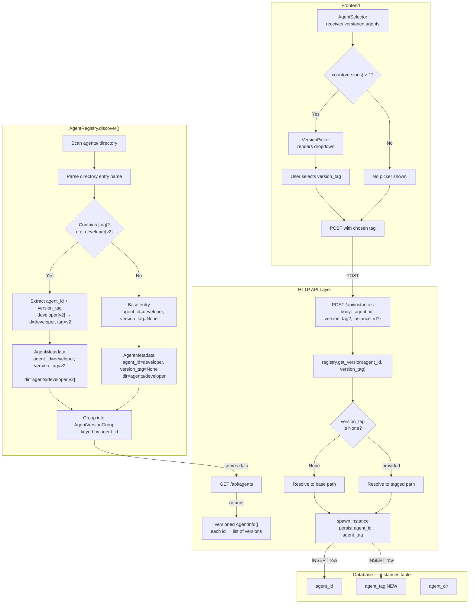

# Plan Overview: Agent Versioning / Tagging System

## Objective

Enable agents to support **versioning via suffix tags in directory names** (e.g., `agents/developer[v2]/`), allowing users to select a specific version when creating an instance. Tagged directories are **full sibling copies** (no overlay/composition), and the backend persists the selected version per-instance.

## Scope Assessment

**LARGE** — Touches 4 layers across the stack: agent discovery/registry, API surface, database schema, instance lifecycle (creation AND restoration), and frontend UI. Spans multiple files/modules but is internally well-bounded (no cross-cutting architectural refactor). Estimated 2–2.5 days for a developer instance.

> **Revision v2 (2026-07-24)**: Scope expanded after review to cover instance restoration (`_restore_instance`), manager wrapper forwarding, and frontend call-site enumeration. See "Revision Log" at bottom.

| Layer | Files/Modules Affected |
|-------|----------------------|
| Registry (discovery + resolution) | `daemon/registry.py` |
| API models | `daemon/models/agent.py`, `daemon/models/instance.py` |
| API routers | `daemon/routers/agents.py`, `daemon/routers/instances.py` |
| Instance lifecycle (creation + restoration) | `daemon/services/instance_lifecycle.py` (`spawn_instance`, `_restore_instance`, `_spawn_instance_db_sync`) |
| Manager wrapper | `daemon/manager.py` (`spawn_instance` delegation, `_ensure_postgres_columns`) |
| DB models + migration | `daemon/repositories/instance/models.py`, new `.sql` migration |
| Frontend models | `frontend/src/app/models/index.ts` |
| Frontend services | `frontend/src/app/services/api.service.ts` |
| Frontend components | `agent-selector`, `agent-switcher`, new `version-picker` |
| Frontend pages (5 call sites) | `home.component.ts`, `chat.component.ts`, `instances.component.ts` |

## Context

- **Project**: agents-ensemble
- **Working Directory**: `/Users/nguyenminhkha/All/Code/opensource-projects/agents-ensemble`
- **DB**: PostgreSQL is PRIMARY dev/test DB; all changes must support SQLite + PostgreSQL.

## Architecture Diagram

## Phase Index

| Phase | Name | Objective | Dependencies | Coupling | Est. Time |
|-------|------|-----------|-------------|----------|-----------|
| 1 | Registry: Separate-Dict Versioning + PromptCache Fix | Parse `[tag]`; separate-dict design; `get_version`/`list_all_grouped`; PromptCache key fix (D15); resolver invariant (D16) | None | — (root) | 4–5h |
| 2 | Backend API + DB + Lifecycle: Version Surfacing, Persistence & Restore | Add `version_tag` to models, instance creation (path-normalized), DB schema, manager wrapper, AND instance restore + cache callers | Phase 1 | tight (registry + cache API consumed) | 5–6h |
| 3 | Frontend: Version Picker UI & Call-Site Threading | Show version picker; thread `version_tag` through all 5 call sites | Phase 2 | loose (API contract only) | 4–5h |
| 4 | Testing & Backward Compatibility | Comprehensive tests + D15/D16 invariant tests + E2E restart test | Phases 1–3 | loose | 3–4h |

**Total estimated time**: 16–20 hours (~2–2.5 days)

### Coupling Assessment

| Phase Pair | Coupling | Rationale |
|-----------|----------|-----------|
| 1 → 2 | **tight** | Phase 2 calls `registry.get_version()`, `registry.list_versions()` — methods created in Phase 1. Must wait for Phase 1 review/approval. |
| 2 → 3 | **loose** | Phase 3 only needs the API contract (request/response shape). Can start frontend work in parallel once Phase 2 API models are frozen. |
| 3 → 4 | **independent** | Phase 4 is a test layer that can begin drafting during Phase 3. |

**Scheduling recommendation**: Phases 1 → 2 sequential (tight coupling). Phase 3 can **pipeline** with Phase 2 (start once API models are defined). Phase 4 runs last (or overlaps with end of Phase 3).

## Risks & Mitigations

| Risk | Impact | Mitigation |
|------|--------|------------|
| 🔴 **D15: PromptCache key collision** — `_make_key(agent_id, mcp)` uses bare agent_id; base and tagged share key → v2 gets base prompt | **SHOWSTOPPER** | Phase 1 Task 8: add `version_tag` to cache key. Phase 2: both spawn + restore pass `version_tag` to `load_and_cache_prompt()`. |
| 🔴 **Approver #2: Composite key leak via resolvers** — `resolve_pure_id` would return `"developer[v2]"` from `_agents`, storing it as `agent_id` in DB | **SHOWSTOPPER** | D2 v3 separate-dict design: `_agents` (base only) + `_versioned_agents` (tagged only). Resolvers only consult `_agents`. D16 contract test. |
| 🔴 **Approver #3: `list_all()` dedup uses `meta.id`** — tagged dir with different `meta.json["id"]` produces duplicate entries | **high** | D11 v3: separate-dict design eliminates the issue — `list_all()` reads base-only `_agents`. No dedup needed. |
| 🔴 **Approver #4: Path normalization missing** — `get_version("./agents/developer", "v2")` receives a path, not agent_id | **high** | D10 v3: `resolve_to_id()` called first to normalize to base agent_id, THEN `get_version()`. |
| 🔴 **C1: Instance restore loads wrong version** — `_restore_instance()` uses `registry.get_resolved()` which returns base | **high** | Phase 2 Task 9: use `registry.get_version(meta.agent_id, meta.agent_tag)` + pass `agent_tag` to `load_and_cache_prompt()` (D15). |
| 🔴 **C2: Invalid version tag silently falls back** — user typos "v3", gets base agent with no error | **high** | D10: explicit tag not found → `ValueError`. Fallback chain only when `version_tag is None`. |
| 🔴 **C3: Frontend version_tag not threaded** — 5 call sites call `createInstance()` without version_tag | **high** | Phase 3 enumerates all 5 call sites with explicit threading instructions. |
| 🔴 **C4: Router skip rules diverge from registry** — router skips ALL `_`-prefixed; registry only skips `SKIP_DIRS` | **medium** | D12: audit + `_`-prefix filter in router (Option B). |
| 🔴 **C5: `list_all()` returns duplicate entries** | **high** | Eliminated by D2 v3 separate-dict design (architectural fix, not dedup logic). |
| `[tag]` parsing collides with real agent dir names containing `[` | medium | Restrict to trailing `[A-Za-z0-9_-]+` suffix (tightened charset prevents path traversal). |
| Backward compat: existing untagged agents break | high | All new fields default to `None`. Separate-dict design means `_agents` is unchanged for existing agents. |
| DB migration fails on existing PostgreSQL | medium | `IF NOT EXISTS` clauses; `_ensure_postgres_columns()` pattern. |
| `version` column name collision (optimistic locking vs agent versioning) | high | Use `agent_tag` for new column. Never touch existing `version` Integer. |
| `team_members` references use bare agent_id | medium | D5: `team_members` always references base agent_id only. |
| W6: Manager wrapper doesn't forward `version_tag` | medium | Phase 2 Task 7: `manager.py:4072` forwards `version_tag`. |
| W8: Frontend dedup tiebreaker non-deterministic | low | Phase 3: alphabetical by `version_tag`. |
| W9: `agent_tag` index unnecessary | low | Column-only migration, no index. |
| Non-blocking: `Instance.to_dict()` missing `agent_tag` | low | Phase 2 Task 10: add to `to_dict()` — downstream consumers use it. |
| Non-blocking: `create_agent` API rejects brackets | low | D1: tagged dir creation is manual (copy+modify) for now. |

## Success Criteria

- [ ] `agents/developer/` and `agents/developer[v2]/` both discovered and grouped under agent_id `developer`
- [ ] `GET /api/agents` returns version info per agent (base + list of available tags)
- [ ] `POST /api/instances` accepts optional `version_tag` and resolves the correct agent directory
- [ ] **Invalid `version_tag` (e.g. typo "v3") raises `ValueError`, does NOT silently fall back to base** (C2)
- [ ] **Path-form `agent_id` (`./agents/developer`) resolves correctly with version_tag (Approver #4)**
- [ ] Instances table has `agent_tag` column; selected tag persisted on instance creation
- [ ] **`Instance.to_dict()` includes `agent_tag`** (downstream consumers)
- [ ] **`_restore_instance()` loads the correct tagged version on daemon restart** (C1)
- [ ] **PromptCache does NOT collide between base and tagged versions (D15)**
- [ ] **`manager.spawn_instance()` wrapper forwards `version_tag`** (W6)
- [ ] Frontend shows a version picker when an agent has multiple versions
- [ ] **All 5 frontend call sites thread `version_tag` to `createInstance()`** (C3)
- [ ] **Resolver methods NEVER return composite keys (D16 invariant)**
- [ ] **Router refactor produces identical agent list for the 23 existing agents** (C4)
- [ ] Untagged agents (all 23 existing) continue to work exactly as before
- [ ] All tests pass on both SQLite and PostgreSQL
- [ ] DB migration is idempotent (safe to re-run)
- [ ] **E2E: daemon restart with a running tagged instance loads v2 prompt** (S3)
- [ ] **Tightened regex rejects path traversal in tags** (`dev[../etc]` not parsed)

## Tracking

- Created: 2026-07-24
- Last Updated: 2026-07-24 (Revision v3 — D15 PromptCache + Approver #2-4)
- Status: draft

## Revision Log

### v3 (2026-07-24) — Approver Feedback (4 Blocking Issues)

**Showstopper fixes:**
- **D15 (Approver #1)**: PromptCache `_make_key()` collision — base and tagged share cache key. Added `version_tag` to cache key in Phase 1 Task 8. Both spawn (line 1101) and restore (line 2434) must pass `version_tag` to `load_and_cache_prompt()`.
- **Approver #2**: Composite keys leaked via `resolve_pure_id()` → stored as `agent_id` in DB. **Architectural change (D2 v3)**: separate-dict design (`_agents` base-only + `_versioned_agents` tagged-only). Resolvers only consult `_agents` → structurally cannot return composite keys. Added D16 keystone invariant + contract test.
- **Approver #3**: `list_all()` dedup used `meta.id` (wrong when tagged dir has different meta.json id). **Eliminated by D2 v3** — `list_all()` reads base-only `_agents`, no dedup needed. Updated D11.
- **Approver #4**: `get_version()` received path-form `agent_id` (`./agents/developer`) not base id. D10 v3: `resolve_to_id()` called FIRST to normalize, then `get_version()`.

**Non-blocking fixes:**
- Tightened tag regex to `[A-Za-z0-9_-]+` (prevents path traversal).
- `Instance.to_dict()` must include `agent_tag` (downstream consumers use it).
- Contract test for D16 resolver invariant added to Phase 4.
- D1 notes that `create_agent` API rejects brackets — tagged dirs are manual for now.

### v2 (2026-07-24) — Review Feedback

**Critical fixes:**
- **C1**: Added `_restore_instance()` coverage to Phase 2 — must use `registry.get_version()` not `registry.get_resolved()`.
- **C2**: Changed `spawn_instance()` resolution logic — explicit `version_tag` that's not found must raise `ValueError`, not silently fall back.
- **C3**: Phase 3 now enumerates all 5 frontend call sites (`home.component.ts:114,170,187`, `chat.component.ts:394`, `instances.component.ts:100`) with explicit threading instructions.
- **C4**: Phase 2 adds skip-rule audit task before router refactor. Documented divergent skip logic.
- **C5**: Phase 1 `list_all()` now dedupes by base agent_id. Added `list_all_grouped()` for full versioned view.

**Warnings addressed:**
- **W3**: Phase 1 clarifies composite key uses `base_agent_id` (parsed from dir name), NOT meta.json `id`.
- **W6**: Phase 2 adds manager wrapper task (`manager.py:4072`).
- **W8**: Phase 3 dedup tiebreaker is alphabetical by `version_tag`.
- **W9**: Phase 2 drops `agent_tag` index — column-only migration.
- **S3**: Phase 4 E2E adds daemon-restart-with-tagged-instance test.
- **S9**: Phase 2 Task 11 (`agent_tag` in `InstanceInfo`) upgraded from optional to REQUIRED.
