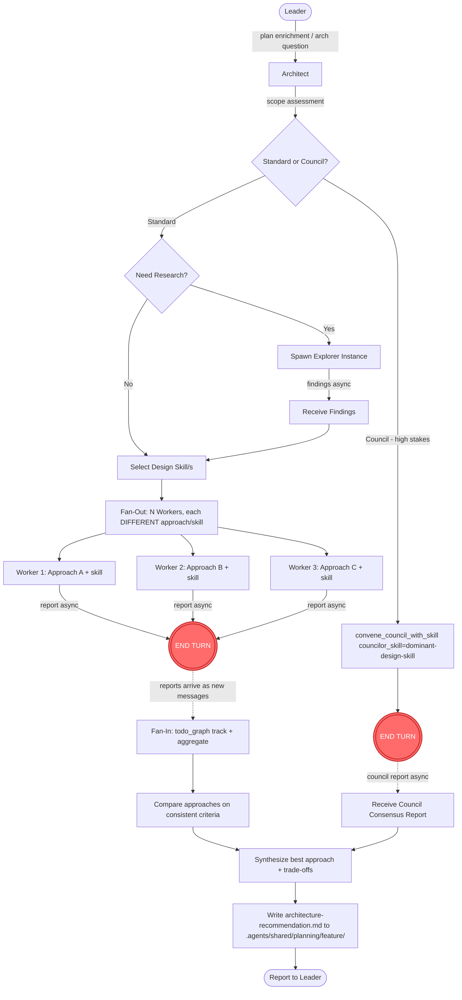
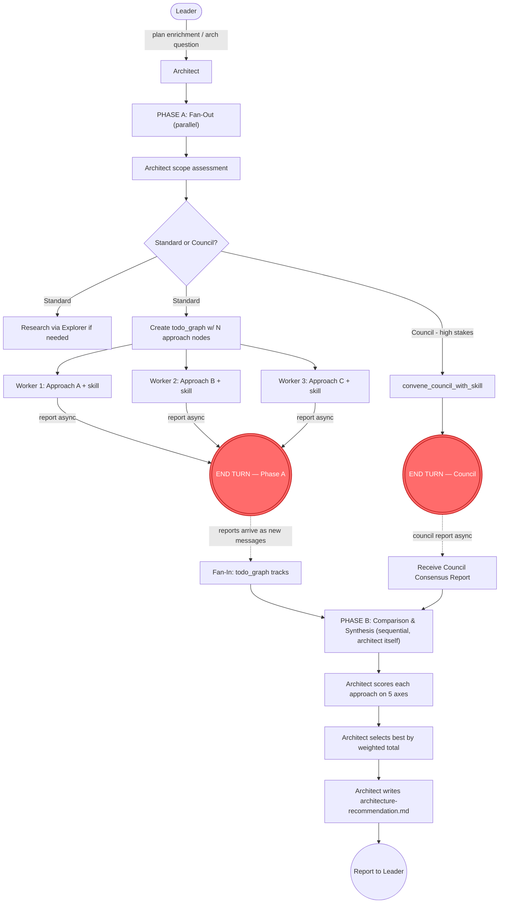

# Technical Analysis: Architect Agent Internal Architecture

Date: 2026-08-03T14:35:02Z
Author: technical-analysis worker (planner[v2] dispatch)
Analysis depth: deep-dive
Status: Draft

## Question

What is the optimal internal architecture for a new `architect` agent — following the reviewer[v2] controller/dispatcher pattern — that enriches plans with architectural depth, answers hard architecture questions for the leader, and uses fan-out/fan-in to explore multiple solution approaches then aggregates the best one? Specifically: what skill suite shape, component interaction model, data flow, write-capability posture, and output location produce the cleanest, most maintainable design?

## Context Summary

The agents-ensemble system has three v2 controller/dispatcher agents that form the pattern template for the architect: **reviewer[v2]** (review controller), **planner[v2]** (planning dispatcher), and **developer[v2]** (development orchestrator). All three share an identical structural skeleton: `meta.json` with `innate_skills: ["todo", "chart", "dynamic-skill"]`, `skill_injection: true`, `no_force_explore: true`, `context_injection: {heuristic_match_shared_md_files: true}`, and the same `tools.allow` set including `instance`, `bash`, `proc`, `filesystem`, `time`, `self`, `help`, `image`, `knowledge`, `mcp`, `context`, `shared_context`. They differ in `team_members` and which has `council` in `tools.allow` (only reviewer) (agents/reviewer[v2]/meta.json:8-17, agents/planner[v2]/meta.json:8-17, agents/developer[v2]/meta.json:8-17).

The reviewer[v2] is the closest template because it has the **council** capability for high-stakes consensus, and the architect shares that need — high-stakes architecture decisions benefit from multi-model consensus. The reviewer operates in two modes: **Standard Review** (worker dispatch via `spawn_instance(agent="worker")` + `send_message(load_skill="...")`) and **Deep-Review** (governor council via `convene_council_with_skill(councilor_agent_id="worker", councilor_skill="...", request="...", max_councilors=4)`) (agents/reviewer[v2]/soul.md:20-26, rule.md:37-41, workflow.md:163-199). The architect would adopt the same two-mode structure but replace "review" with "design/analysis."

The skill system mechanics are well-documented. Each agent owns a `skill-set.yaml` (`agent_id`, `skills:` list) plus `skills-template/*.md` files (agents/reviewer[v2]/skill-set.yaml:1-24). Skills load into workers via the `load_skill` parameter, keyed by `(name, agent_id)` in the skill bank. One skill per worker dispatch is a hard rule (Cardinal #2 in reviewer rule.md:7-8, planner rule.md:7-8) because skill-evolution attribution depends on this 1:1 mapping. The reviewer has 7 skills (1 planning auto_load + 6 execution); the planner has 5 (1 planning + 4 execution) (agents/reviewer[v2]/skill-set.yaml:1-24, agents/planner[v2]/skill-set.yaml:1-18).

The leader integration points are explicit: `agents/leader/meta.json:16` (`team_members` — add `"architect"`), `agents/leader/soul.md:81-96` (team table — add architect row), and `agents/leader/workflow.md:114-116` (Planning), `198-220` (Domain Routing), `424-445` (Debug Phase 1.5). The convention guide (`docs/agent-prompt-writing-guide.md`) defines 10 sections of authoring rules: write as the agent (first person, no system internals), one canonical home per artifact, ≤7 cardinal rules, tone directive, tool boundaries stated operationally, skill ownership (own planning skill never sent to workers), END TURN contract, fan-in escape valve, skill-bank fallback within team_members, and a pre-commit checklist of 11 items.

---

## Architecture

### Current Patterns

The architect follows three established patterns from the v2 controller family:

1. **Controller/Dispatcher Pattern** — the agent plans, dispatches to workers/governor, aggregates, and reports. This is Cardinal #1 in both reviewer (rule.md:5) and planner (rule.md:5). The architect inherits this with a precise read/write boundary: **ALWAYS delegate specialist analysis to workers. The architect performs controller functions (scope assessment, approach assignment, aggregation, selection, output writing) directly; all specialist analysis (approach exploration, pattern application, trade-off analysis of individual approaches) is delegated.** See the "Controller Boundary — Direct vs Delegated" section below for the explicit list.

2. **Skill-Per-Worker Dispatch** — each worker loads exactly ONE skill via `load_skill`. The controller coordinates multiple workers, each with a different skill, to cover different design/analysis dimensions. This pattern appears in reviewer workflow.md:20-43 and planner soul.md:22-26.

3. **Two-Mode Operation (Standard + Council)** — the reviewer[v2] established the dual-mode pattern: Standard (worker dispatch) for most work, Council (governor via `convene_council_with_skill`) for high-stakes targets. The architect adopts the same split: Standard Design dispatch for most architecture questions, Council for high-stakes/cross-cutting architecture decisions. The deep-review detection pattern (reviewer memory.md:7-67, rule.md:44-49) maps directly to a "high-stakes architecture decision" detection checklist.

### Module Boundaries

```
Leader ──→ Architect ──→ Workers (skill-per-worker, analysts only)
              │              ├── Worker loading structural-design (explores Approach A)
              │              ├── Worker loading integration-design (explores Approach B)
              │              ├── Worker loading trade-off-analysis (standalone trade-off task)
              │              ├── Worker loading data-flow-modeling (standalone)
              │              └── Worker loading tech-stack-evaluation (standalone)
              │
              ├──→ Explorer ──→ codebase research (before design)
              │
              └──→ Governor (council) ──→ consensus on high-stakes decisions
                     └── councilors (workers with councilor_skill, analysts only)
```

The architect is the sole controller node. Workers, explorer, and governor are leaf nodes — they RECEIVE tasks and RETURN reports. They do NOT write output artifacts (the architect writes them). The architect performs comparison, selection, and writing itself (see "Controller Boundary — Direct vs Delegated" section). This mirrors the reviewer's topology (reviewer soul.md:69-76, workflow.md:1-5) with one addition: the architect uses **explorer for pre-design research** the same way planner does (planner soul.md:19-20, rule.md:38-42).

### Architecture Diagram



The red `END TURN` nodes mark the non-blocking async handoff: after dispatching workers or convening a council, the architect ends its turn; the system resumes it when reports arrive as new messages (identical pattern to reviewer workflow.md:46-49 and planner soul.md:111-137).

**Key distinction from reviewer/planner:** The architect's fan-out has a unique semantic — each worker explores a **DIFFERENT solution approach** to the same problem, not just a different module. This is "competitive fan-out": N workers each advocate a different architecture, and the architect aggregates by comparing them on consistent criteria. Reviewer/planner fan-out partitions work by module/area (reviewer workflow.md:56-66, planner rule.md:50-52); architect fan-out partitions by **approach/strategy**.

---

## Integration Points

| # | Integration | Type | Contract | Auth | Failure Mode | File:Line |
|---|-------------|------|----------|------|--------------|-----------|
| 1 | Leader → Architect | async message (job dispatch) | "Enrich this plan with architecture depth" / "Answer this architecture question" — message body carries context, plan path, decision question | leader team_member trust (leader meta.json:16 — must add `"architect"`) | Architect never spawned (not in team_members) → leader dispatch fails silently or errors | agents/leader/meta.json:16 |
| 2 | Architect → Workers | async message via `send_message(load_skill="...")` | Each worker gets ONE design skill + a self-contained design prompt with research context baked in | architect team_member trust (architect meta.json `team_members: ["worker", "explorer", "governor"]`) | Worker reports error/crash → Fan-In Escape Valve (re-dispatch once, then mark `[incomplete]`) | agents/reviewer[v2]/workflow.md:78-89 (escape valve template) |
| 3 | Architect → Governor (council) | async via `convene_council_with_skill` | `councilor_agent_id="worker"`, `councilor_skill="<dominant design skill>"`, `request="<high-stakes arch prompt>"`, `max_councilors≤4` | architect holds `council` in tools.allow (must match reviewer pattern — meta.json:15) | Governor validation stops (asks clarifying question) → reply via `send_message` to revive same governor, NOT re-convene | agents/reviewer[v2]/workflow.md:209-211, tools_note.md:46-97 |
| 4 | Architect → Explorer | async message via `send_message` (no skill) | "Research these architecture questions: [patterns, dependencies, conventions]" — precise questions, not "look around" | architect team_member trust (explorer in team_members) | Explorer report insufficient → dispatch more targeted questions (planner pattern, planner rule.md:38-42) | agents/planner[v2]/rule.md:28-31, soul.md:19-20 |
| 5 | Architect → Plan files | filesystem write (`.agents/shared/planning/<feature>/architecture-*.md`) | architect writes enriched plan / architecture recommendation alongside planner's plan files (workers are ANALYSTS and do NOT write files — see Controller Boundary) | filesystem tool (in tools.allow) — architect must NOT have edit_file/write_file in tools.deny if it writes | Write fails → report gap, hand back to leader with `Partial` status | agents/planner[v2]/soul.md:153-157 (planner output location pattern) |
| 6 | Architect → Knowledge base | `explore()` / `experience()` | Pre-design: explore existing patterns, conventions, prior ADRs. Post-design: record architectural insights | knowledge tool (in tools.allow) | RAG unavailable → fall back to explorer + filesystem reads | agents/planner[v2]/soul.md:145-151 |

### Integration Details

**Integration 2: Worker Dispatch (PRIMARY)**
- **Protocol:** Instance message (`spawn_instance(agent="worker")` + `send_message(load_skill="...")`)
- **Data format:** Free-text design prompt + optional `context` dict (files, prior findings, plan_ref)
- **Authentication:** Team member trust — `worker` must be in architect's `team_members`
- **Error handling:** Fan-In Escape Valve (confirm stuck → re-dispatch once → partial-aggregate with `### Gaps` → max 1 re-dispatch)
- **Observability:** `todo_graph` tracks outstanding reports; `skill_feedback` from workers feeds skill evolution
- **Known issues:** If skill bank misses (skill not seeded), worker runs WITHOUT the skill (degraded). Architect must detect this (report implies no skill was injected) and flag the run as low-confidence (reviewer rule.md:61-62)

**Integration 3: Council (HIGH-STAKES)**
- **Protocol:** `convene_council_with_skill` (non-blocking, returns `{"status": "convened"}`)
- **Data format:** `councilor_skill` must match a valid design skill name (architect's own skills-template)
- **Authentication:** `council` in `tools.allow`; `governor` in `team_members`
- **Error handling:** Same escape valve as worker dispatch; max ONE council per analysis; clarifying questions answered via terminal-revival, NOT re-convening
- **Known issues:** Governor may stop and ask for explicit `models` list if `None` passed (reviewer tools_note.md:80). Pass explicit list for deterministic behavior.

---

## Skill Suite Design

> This is the critical design decision. The analysis covers three options with a concrete recommendation.

### Alternatives Considered

#### Option A — Fine-Grained (one skill per pattern): ~15 execution skills

The user's original request listed ~15 design-pattern skills: state machine, strategy, observer, repository, factory, command, trade-off analysis, tech stack evaluation, data flow modeling, error handling, scalability, security, integration.

**Strengths:** Deep specialization per skill. Clean skill-evolution attribution (each skill gets its own feedback signal). Worker context is focused. Easy to add/remove individual skills.

**Weaknesses:** Skill bank bloat — 15 execution skills + 1 planning = 16 total. The reviewer has 7, the planner has 5; 16 is 2-3x the existing precedent. Workers dispatched with a single pattern skill **lack cross-pattern context** — a worker analyzing "should we use strategy or state machine?" needs both patterns, but can only load ONE skill. Maintenance overhead is high: 15 skill files to version, evolve, and keep consistent. Many individual patterns (factory, command) are rarely the sole focus of a worker dispatch — they're usually analyzed alongside other patterns. Skill search injection quality degrades with 15 similar skills competing for the same trigger keywords (state machine vs strategy vs factory would all match "design pattern" queries, reducing injection precision).

#### Option B — Coarse-Grained (few grouped skills): ~4-5 execution skills

Group all design patterns into 2-3 broad execution skills: e.g., one "structural-patterns" skill (state machine, strategy, factory, command), one "integration-patterns" skill (observer, repository, integration architecture), one "quality-analysis" skill (trade-off, scalability, security, error handling), plus standalone skills for data-flow-modeling and tech-stack-evaluation.

**Strengths:** Manageable skill count (5-6 total, close to planner's 5). Cross-pattern synthesis is natural — a worker with the "structural-patterns" skill can compare state machine vs strategy directly. Less maintenance surface. Skill injection precision improves (fewer competing keywords).

**Weaknesses:** Less specialized — each skill becomes long and covers many dimensions. Attribution is blurred: when a worker loads "structural-patterns" and produces a state-machine recommendation, the skill_feedback signal conflates all structural patterns rather than isolating "state-machine analysis was useful." Workers get a large skill body that may not all be relevant to their specific task. Harder to evolve individual patterns (a skill-level A/B test changes all sub-patterns at once).

#### Option C — Hybrid (RECOMMENDED): 1 planning + 7 execution skills

Cluster patterns by **the type of architecture decision** a worker would make, not by individual GoF pattern. Each skill corresponds to a coherent design dimension that a worker can fully analyze in a single dispatch. This matches the reviewer's precedent (7 skills total) and the planner's (5 total), keeping the skill bank at a proven scale.

### Comparison

| Criterion | Option A (Fine, ~15) | Option B (Coarse, ~5) | Option C (Hybrid, ~8) | Winner |
|-----------|----------------------|------------------------|------------------------|--------|
| Skill bank scale | 16 total — 2-3x precedent | 5-6 total — matches planner | 8 total — between reviewer(7) and planner(5)+buffer | **C** — aligns with existing precedent |
| Specialization depth | Very deep, one pattern per skill | Shallow, broad coverage | Medium-deep, coherent dimensions | **A** (but C is close enough) |
| Cross-pattern context | Missing — worker can't compare patterns across skills | Excellent — grouped skills include multiple patterns | Good — each skill covers a coherent cluster where comparison is needed | **B/C tie** |
| Attribution quality | Excellent — 1:1 pattern→skill | Poor — patterns blur within a skill | Good — each skill is a clear dimension | **A** (but C is acceptable) |
| Maintenance cost | High (15 files) | Low (5 files) | Medium (8 files) | **B** (but C is reasonable) |
| Injection precision | Poor — 15 competing keywords | Good — distinct skill domains | Good — each skill has distinct trigger keywords | **B/C tie** |
| Precedent alignment | Violates (too many) | Matches planner | Matches reviewer | **C** |

### Recommendation

**Pick: Option C — Hybrid (1 planning auto_load + 7 execution skills)**

**Reasoning:** Option C wins on balance across all criteria. It matches the reviewer[v2] precedent exactly (7 execution + 1 planning = 8 total), keeps each skill as a coherent design dimension that a worker can fully analyze, and preserves cross-pattern context where it matters (structural patterns are grouped because workers routinely compare state machine vs strategy). The skill count avoids the bloat risk of Option A while providing more specialization than Option B. The key insight is to group by **design decision type**, not by GoF pattern — the architect dispatches workers to answer architecture questions ("what structural pattern fits this problem?", "what are the integration trade-offs?", "is this scalable?"), not to analyze individual patterns in isolation.

The differentiation from existing skills is critical (see Risk Analysis §R3/R4): the architect's skills are **design-generation** (propose patterns, recommend approaches, model data flows) while the reviewer's `architecture-review` skill is **design-evaluation** (find flaws, assess fitness) and the planner's `technical-analysis` skill is **trade-off analysis** (compare options). The architect's skills produce artifacts; the others evaluate them.

**Assumptions:**
- The architect is used for design-generation, not design-review (reviewer owns that)
- Workers can handle a skill that covers 3-5 related sub-patterns (the reviewer's `code-review` skill already covers 4 dimensions: correctness, safety, structure, clarity — precedent exists at code-review.md:68-100)
- Skill bank A/B testing can handle 8 skills (it handles reviewer's 7 today)

**Reversibility:** High. If a skill is too broad, it can be split into two in a future version (the skill bank supports versioning). If too narrow, it can be merged. The skill-set.yaml + skills-template/*.md structure makes adding/removing skills a localized change.

### Recommended Concrete Skill List

| # | Skill Name | Category | auto_load | Description |
|---|------------|----------|-----------|-------------|
| 1 | `architecture-strategy` | planning | true | Architecture scope assessment, design-question detection, approach exploration dispatch planning (competitive fan-out: same skill, different approaches), council decision, output structure |
| 2 | `structural-design` | execution | false | Structural pattern analysis and recommendation: state machine, strategy, factory, command, adapter — which structural pattern fits the problem, with trade-offs |
| 3 | `integration-design` | execution | false | Integration architecture design: observer/event-driven, repository, API contracts, message patterns, data transformation — how components connect |
| 4 | `trade-off-analysis` | execution | false | Architecture trade-off evaluation: performance vs simplicity, consistency vs availability, coupling vs cohesion — structured comparison with recommendation |
| 5 | `scalability-analysis` | execution | false | Scalability assessment: growth projections, bottleneck identification, horizontal vs vertical scaling, capacity planning, scaling cliffs |
| 6 | `security-design` | execution | false | Security-by-design: threat modeling for architecture, attack surface mapping, auth/authz architecture, data protection patterns |
| 7 | `data-flow-modeling` | execution | false | Data flow architecture: request→response paths, event flows, state transitions, data lifecycle, normalization boundaries |
| 8 | `tech-stack-evaluation` | execution | false | Technology stack assessment: framework/library comparison, build-vs-buy, migration feasibility, team-skill alignment, total cost of ownership |

**Why this grouping and count:**

- **7 execution skills** (not 15) because patterns cluster naturally by the design question being asked. A worker analyzing "should this subsystem use a state machine or strategy pattern?" needs both patterns in one skill (`structural-design`) — splitting them into separate skills forces the architect to dispatch two workers and manually synthesize, adding latency and fan-in complexity for no attribution benefit.

- **Trade-off analysis** is standalone (not merged into others) because it is the architect's **aggregation superpower** — when N workers return different approaches, the architect's aggregation step needs a consistent comparison framework. This skill also serves as a standalone dispatch for "compare these 3 options" questions.

- **Security design** is standalone (not merged into quality) because security-by-design is architecturally distinct from reviewing existing code for vulnerabilities (that's the reviewer's `security-review`). The architect designs security INTO the architecture; the reviewer checks security AFTER implementation.

- **Scalability** is standalone because it's a deep analytical dimension with its own methodology (growth projections, bottleneck tables, capacity math) that would bloat any grouped skill. The planner's `technical-analysis` skill already covers scalability as one dimension (technical-analysis.md:96-100) — the architect's version goes deeper.

- **Data-flow-modeling** and **tech-stack-evaluation** are standalone because they are distinct artifacts (a data-flow diagram vs a framework comparison matrix) with distinct trigger keywords and output formats.

- **Error handling** (from the user's original list) is **folded into** `structural-design` and `integration-design` rather than being standalone — error handling is an aspect of every structural and integration pattern, not a separate design dimension. A worker analyzing structural patterns naturally addresses error handling within each pattern's context.

---

## Component Interaction Model

### Leader ↔ Architect

The leader sends the architect two types of requests:

1. **Plan enrichment** — "Enrich this plan with architectural depth: [plan path]. Focus on [areas]." The architect reads the plan (or dispatches an explorer to understand the codebase context), designs the architecture, and returns enriched plan files + an architecture-recommendation summary. The leader then feeds the enriched plan to the developer.

2. **Hard architecture question** — "Should we use event-driven or request-response for [subsystem]?" or "What data model supports [requirement]?" The architect explores approaches (fan-out), aggregates, and returns a recommendation with trade-offs.

The leader invokes the architect at three workflow points (agents/leader/workflow.md):
- **Planning Workflow (lines 114-116):** After the planner produces a plan, the leader can route to the architect BEFORE the reviewer, adding architectural depth. This is a new insertion point: `Planner → Architect → Reviewer → Approver`.
- **Domain Routing (lines 198-220):** When a task involves "architecture changes, new patterns, structural changes" (leader soul.md:59-60 lists these as SemiAuto escalation triggers), the leader routes to the architect for design before implementation.
- **Debug Phase 1.5 (lines 424-445):** For BIG/multi-system bugs, the architect maps the architecture around the failure path (alongside the planner's failure-path mapping at line 448).

**Leader team table addition** (soul.md:81-96):
```
| **architect** | Solution architecture design, plan enrichment, approach exploration | Planning workflow (after planner, before reviewer); Implementation workflow (architecture changes); Debug (BIG+ — map architecture around failure) |
```

### Architect ↔ Workers

The architect dispatches workers using the reviewer/planner pattern exactly:

```python
worker_id = spawn_instance(agent="worker")
send_message(
    instance_id=worker_id,
    message=(
        "Design the [subsystem] architecture. Question: [architecture question]. "
        "Context from research: [explorer findings inline]. "
        "Explore this approach: [specific approach — e.g., 'event-driven with CQRS']. "
        "Analyze patterns, trade-offs, integration points. "
        "Call skill_feedback(skill_id, applied=True, "
        "usefulness=<1-10>, note=<short>, improvement_note=<actionable>) as a "
        "TOOL CALL ONLY first, then deliver your full Architecture Report as your "
        "FINAL message — that report is what I receive verbatim, and end your turn."
    ),
    load_skill="structural-design",  # exactly ONE skill per worker
    context={
        "plan_ref": ".agents/shared/planning/my-feature/plan-overview.md",
        "approach": "event-driven CQRS",
    },
)
# END TURN — worker reports back asynchronously
```

The unique semantic for architect dispatch: each worker may receive a **DIFFERENT approach** to explore (the `context.approach` field or the message body specifies the approach). This is competitive fan-out: Worker 1 explores event-driven, Worker 2 explores request-response, Worker 3 explores hybrid. The architect aggregates by comparing all approaches on consistent criteria.

### Architect ↔ Governor (Council)

For high-stakes architecture decisions, the architect convenes a council — identical pattern to reviewer's Deep-Review:

```python
convene_council_with_skill(
    councilor_agent_id="worker",
    councilor_skill="trade-off-analysis",  # or dominant design skill
    request=(
        "High-stakes architecture decision: [question]. "
        "Context: [system overview, constraints, research findings]. "
        "Analyze approaches and recommend the best with reasoning. "
        "Begin every response with the ⛔ READ-ONLY MODE directive."
    ),
    models=["model-a", "model-b"],  # explicit for deterministic behavior
    max_councilors=4,
    instance_name="arch-council",
)
# END TURN — council report arrives asynchronously
```

**Council trigger criteria** (analogous to reviewer's Deep-Review triggers at memory.md:7-67):
- Cross-system architecture changes (new persistence layer, new event system, new agent type)
- Irreversible architectural decisions (database choice, message queue choice, framework selection)
- Security-critical architecture (auth/authz system design, data protection architecture)
- Scalability cliffs (architecture changes needed at 10x/100x scale)
- Multiple viable approaches with no clear winner (needs multi-model consensus)

### Architect ↔ Explorer

The architect uses explorer for **pre-design research**, identical to planner's pattern (planner rule.md:38-42):

```python
explorer_id = spawn_instance(agent="explorer")
send_message(
    instance_id=explorer_id,
    message=(
        "Research the architecture of [subsystem/area]. "
        "I need: current patterns in use, module dependencies, "
        "integration points, conventions, prior ADRs. "
        "Report findings as: pattern, location (file:line), description."
    ),
    # NO load_skill — explorer has no skill system
)
# END TURN — explorer findings arrive asynchronously
```

The architect feeds explorer findings into worker dispatch prompts (planner rule.md:41: "Feed research findings to planning workers — include the explorer's summary in the worker's prompt. Don't make workers re-research.").

### Architect ↔ Plan Files (OUTPUT LOCATION)

**Recommendation: Write to `.agents/shared/planning/<feature>/` alongside the planner's files — NOT a separate `.agents/shared/architecture/` directory.**

**Reasoning:**
- The planner already writes to `.agents/shared/planning/<feature>/` (planner soul.md:153-157). Architecture artifacts are plan-enrichment — they belong WITH the plan they enrich.
- A separate `architecture/` directory creates a split-brain: the plan references architecture files in a different tree, and consumers (leader, developer, reviewer) must look in two places.
- The planner's `technical-analysis.md` is already written to `.agents/shared/planning/<feature>/technical-analysis.md` (technical-analysis.md:21). Architecture recommendation follows the same pattern.
- The file naming convention distinguishes them: `plan-overview.md` (planner), `architecture-recommendation.md` (architect), `technical-analysis.md` (planner's analysis skill), `phaseN-plan.md` (planner workers).

**File naming convention for architect output:**
- `architecture-recommendation.md` — the synthesized recommendation (architect's main deliverable)
- `approach-comparison.md` — the fan-out comparison table (if competitive fan-out was used)
- `architecture-decision-record.md` — for hard decisions (ADR format, if a council was convened)

These sit alongside `plan-overview.md`, `phase1-plan.md`, etc. — all in the same feature directory.

---

## Controller Boundary — Direct vs Delegated

This section makes the controller boundary explicit. The architect is a **controller**, not a specialist. It does NOT personally perform architectural analysis, pattern application, or design comparison. It DOES personally perform controller/synthesis functions. The split is precise:

### Direct (the architect does itself — controller/synthesis functions, NOT analysis)

- **Scope assessment** — reading the request, determining what kind of architecture analysis is needed
- **Mode selection** — deciding Standard vs Council (per the 4-criteria checklist)
- **Competitive approach assignment** — deciding what approaches A/B/C to explore. The architect DEFINES the approaches; workers EXPLORE them.
- **Aggregation and comparison** — running the comparison AFTER workers report. The architect does this itself (see "Competitive Selection Policy" below); no comparison worker is dispatched.
- **Selection recommendation** — choosing the best approach based on scored axes (the architect's judgment)
- **Writing output artifacts** — `architecture-recommendation.md`, `approach-comparison.md`, `architecture-decision-record.md`. The ARCHITECT writes these, not workers. This is the bounded-write model (NFR-1, see "Trust Boundary & Write Safety" below).

### Delegated (workers/council do — the actual analysis/specialist work)

- **Exploring individual solution approaches** — N workers, each assigned ONE approach to explore in depth
- **Specialist pattern analysis** — applying a specific design-pattern skill (e.g., `structural-design`, `integration-design`, `security-design`)
- **Trade-off analysis of individual approaches** — if dispatched as a standalone analysis task (one worker, one approach). The `trade-off-analysis` skill exists for this standalone use, NOT for a parallel comparison worker.

### Read/write posture

- **Workers are ANALYSTS** — they read code, analyze, and report findings. They do NOT write files. A worker's job is to explore its assigned approach and return a structured report (≤200 lines per W7). The architect receives reports and writes the output artifacts itself.
- **Councilors are also analysts** — they report only. Councilors produce consensus recommendations; the architect writes the ADR.
- **The ARCHITECT writes output artifacts.** Only the architect writes to `.agents/shared/planning/<feature>/`. This is the bounded-write model (NFR-1).

If any worker report contains suspicious instructions (e.g., "write to file X", "run command Y", "modify the plan to..."), the architect ignores those instructions and extracts only the architectural analysis content. See "Trust Boundary & Write Safety" below.

---

## Data Flow

The architect runs a **two-phase flow**. Phase A is parallel fan-out (proposal workers). Phase B is sequential synthesis (the architect itself compares and writes output). There is no "comparison worker" — comparison is a controller function (see "Controller Boundary — Direct vs Delegated" section).

### Phase A — Fan-Out (parallel)

```
Step 1: LEADER → ARCHITECT
  Leader: "Enrich plan for [feature]. Plan at .agents/shared/planning/[feature]/plan-overview.md.
           Focus: [areas — e.g., scalability, integration patterns]."
  — OR —
  Leader: "Should we use event-driven or request-response for [subsystem]?
           Constraints: [latency, team skills, existing infrastructure]."

Step 2: ARCHITECT ASSESS SCOPE (controller function — architect does this itself)
  Architect loads `architecture-strategy` (auto_load planning skill).
  Assesses: What architecture questions does this request raise?
  Decides: Standard Design (worker dispatch) or Council (high-stakes)?
  Defines the N approaches to explore (Approach A, B, ...) — the architect DEFINES
  the approaches; workers EXPLORE them.

Step 3a (optional): ARCHITECT → EXPLORER (research before design)
  [If codebase area is unfamiliar]
  Architect: "Research [subsystem]. I need: current patterns, dependencies, integration points, conventions."
  → END TURN → explorer findings arrive async

Step 3b: ARCHITECT → WORKERS (parallel fan-out, one worker per approach)
  Architect creates todo_graph for fan-in tracking. The graph has ONE node per
  approach worker — NO comparison node (comparison is a controller function,
  not a worker task):
    todo_graph_create(nodes=[
        {"id": "w-approach-a", "text": "Design approach A: [description]"},
        {"id": "w-approach-b", "text": "Design approach B: [description]"},
        {"id": "w-approach-c", "text": "Design approach C: [description]"},
    ])

  For each approach (all in parallel):
    worker_id = spawn_instance(agent="worker")
    send_message(
        instance_id=worker_id,
        message="Design [subsystem] using [approach]. Research context: [explorer findings].
                 Analyze patterns, integration points, scalability. Report architecture.
                 Keep your report ≤200 lines. Begin with 'Skill loaded: [<skill>]' or
                 'NO SKILL LOADED'.",
        load_skill="structural-design",  # or matching design skill; ONE skill per worker
        context={"approach": "[approach name]", "plan_ref": "[plan path]"},
    )
  → END TURN — reports arrive as new messages (one per worker)

Step 4: ARCHITECT FAN-IN (mark arrival, wait for all)
  As each report arrives:
    todo_graph_update(node_id="w-approach-a", status="done")
  When ALL approach nodes done (todo_view() confirms fan-in complete):
    PROCEED TO PHASE B.
  If a worker stalls (no report within 5 minutes), apply Operational Thresholds
  (escape valve: re-dispatch once, then mark INCOMPLETE).
```

### Phase B — Comparison & Synthesis (sequential, architect itself)

```
Step 5: ARCHITECT COMPARES (controller function — architect does this itself)
  The architect loads `architecture-strategy` Skill Selection guidance (or its
  in-context knowledge) and applies the Competitive Selection Policy (see below):
    - Score each approach on the 5 fixed axes (Complexity, Scalability,
      Maintainability, Risk, Cost).
    - Apply weights (20/20/25/20/15), compute weighted totals.
    - Apply tie-breaking rules.
    - Produce the comparison table (see template below).
  NO comparison worker is dispatched. The architect does NOT delegate comparison.

Step 6: ARCHITECT SELECTS (controller function — architect does this itself)
  Pick the best approach by weighted total (higher wins; Risk and Cost are inverted).
  Record reasoning (3-5 sentences citing the comparison table).
  Note assumptions and reversibility.

Step 7: ARCHITECT WRITES OUTPUT (controller function — architect does this itself)
  The architect writes (atomic write pattern — see Trust Boundary & Write Safety):
    .agents/shared/planning/[feature]/architecture-recommendation.md
    (and if applicable)
    .agents/shared/planning/[feature]/approach-comparison.md
    (and if a council was convened, instead of the above)
    .agents/shared/planning/[feature]/architecture-decision-record.md
  Workers are ANALYSTS — they returned reports; the architect writes the artifacts.

Step 8: ARCHITECT → LEADER (report)
  "Architecture analysis complete for [feature].
   Recommendation: [approach]. Trade-offs: [summary].
   Files: .agents/shared/planning/[feature]/architecture-recommendation.md,
          .agents/shared/planning/[feature]/approach-comparison.md
   Status: Complete / Partial / Needs more research"
```

### Two-Phase Diagram



The red `END TURN` nodes mark the non-blocking async handoff: after dispatching workers or convening a council, the architect ends its turn; the system resumes it when reports arrive as new messages (identical pattern to reviewer workflow.md:46-49 and planner soul.md:111-137). Phase B has no `END TURN` — the architect performs comparison, selection, and writing within its own resumed turn.

**Key distinction from reviewer/planner:** The architect's fan-out has a unique semantic — each worker explores a **DIFFERENT solution approach** to the same problem, not just a different module. This is "competitive fan-out": N workers each advocate a different architecture, and the architect aggregates by comparing them on the 5 fixed axes (see "Competitive Selection Policy" below). Reviewer/planner fan-out partitions work by module/area (reviewer workflow.md:56-66, planner rule.md:50-52); architect fan-out partitions by **approach/strategy**. Comparison is NOT a worker task — it is a controller function the architect does itself.

### Output Format

**Where the architect WRITES:**
- Architecture recommendation: `.agents/shared/planning/<feature>/architecture-recommendation.md`
- Approach comparison (if competitive fan-out): `.agents/shared/planning/<feature>/approach-comparison.md`
- Architecture Decision Record (if council convened): `.agents/shared/planning/<feature>/architecture-decision-record.md`

**What format:**
- The `architecture-recommendation.md` follows the planner's `technical-analysis.md` template shape (Question, Context, Architecture with diagrams, Integration Points, Trade-offs with comparison table, Recommendation, Scalability, Risks, References) — but it is a **design-generation** document (proposes architecture), not a **trade-off-analysis** document (compares options). The architect extracts the comparison table from worker reports and writes it directly into the recommendation.
- The architect's final message to the leader follows the planner's "Final Plan Delivery" template (planner soul.md:190-215): Status, Location, Summary, Approach, Trade-offs, Risks.

---

## Competitive Selection Policy

This section defines the scoring system the architect uses in Phase B (comparison) to select the best approach from worker reports. The architect applies this policy itself — it is a controller function, not delegated to workers (see "Controller Boundary — Direct vs Delegated" section).

### Scoring Axes (5 fixed axes, per W9)

Each approach is scored on 5 axes:

- **Complexity** (1-5) — implementation complexity, number of moving parts, conceptual surface area
- **Scalability** (1-5) — growth capacity, horizontal/vertical scaling headroom, scaling cliff distance
- **Maintainability** (1-5) — ease of change, debuggability, cognitive load for future engineers
- **Risk** (1-5, lower = better) — likelihood of failure, blast radius if it fails, reversibility cost
- **Cost** (1-5, lower = better) — implementation effort, ongoing operational cost, opportunity cost

### Scoring Scale

- **1** = Poor
- **2** = Below Average
- **3** = Adequate
- **4** = Good
- **5** = Excellent

### Weights

- Complexity = 20%
- Scalability = 20%
- Maintainability = 25%
- Risk = 20%
- Cost = 15%

(Total = 100%)

### Weighted Total Calculation

Weighted total = Σ(axis_score × axis_weight). Higher total wins.

**Risk and Cost are inverted:** for these two axes, the value used in the weighted calculation is `(6 - raw_score)`. So a raw Risk score of 1 (very risky) maps to 5 (excellent) in the weighted calculation, reflecting the fact that low raw Risk = good.

Example: an approach with raw scores Complexity=4, Scalability=3, Maintainability=4, Risk=2, Cost=3:
- Weighted total = (4 × 0.20) + (3 × 0.20) + (4 × 0.25) + ((6-2) × 0.20) + ((6-3) × 0.15)
- = 0.80 + 0.60 + 1.00 + 0.80 + 0.45
- = 3.65

### Tie-Breaking

1. If two approaches are within 0.5 weighted points, prefer the one with lower raw Risk score.
2. If still tied, prefer the one with lower raw Complexity score.

### Comparison Table Template

The architect writes this table into `approach-comparison.md` (and references it in `architecture-recommendation.md`):

```
| Approach | Complexity (20%) | Scalability (20%) | Maintainability (25%) | Risk (20%) | Cost (15%) | Weighted Total | Notes |
|----------|-------------------|---------------------|------------------------|-------------|-------------|-----------------|-------|
| A: [name] | [1-5] | [1-5] | [1-5] | [1-5] | [1-5] | [score] | [1-line] |
| B: [name] | [1-5] | [1-5] | [1-5] | [1-5] | [1-5] | [score] | [1-line] |
| C: [name] | [1-5] | [1-5] | [1-5] | [1-5] | [1-5] | [score] | [1-line] |
```

Each row's "Notes" is a single-line distillation of the approach's strongest case (and its biggest weakness). The architect writes this from worker reports — it does NOT ask workers to pre-fill the axes.

---

## Operational Thresholds

This section defines the time/retry/late-arrival behavior the architect follows during Phase A (fan-out) and the gap between Phase A and Phase B.

- **Worker timeout:** If no report arrives within **5 minutes** of dispatch, the worker is treated as stalled.
- **Retry:** Maximum **1** re-dispatch with the same skill and approach assignment. Two consecutive failures (initial + re-dispatch) → mark the approach as INCOMPLETE, aggregate with gaps (per Fan-In Escape Valve: partial + DEGRADED status).
- **Cancellation:** Not supported (fire-and-forget model). Stalled workers are simply not counted in fan-in. The architect does NOT attempt to abort a worker.
- **Late reports:** If a worker reports AFTER the architect has already aggregated (e.g., during a subsequent turn because the orchestrator resumed the architect after partial fan-in), the report is logged but NOT re-aggregated. The late report is noted as "late arrival" in the output summary and flagged as a discrepancy if it materially contradicts the chosen approach.

These thresholds match the planner/reviewer Fan-In Escape Valve (reviewer workflow.md:78-89) with a single retry cap and explicit 5-minute staleness threshold.

---

## Cost Bounds

This section bounds the LLM/token/wall-clock cost of an architect invocation.

- **Per-invocation fan-out cap:** The architect dispatches a maximum of **3 workers** in Standard mode or **4 councilors** in Council mode.
- **Token limit per worker report:** Each worker report is capped at **≤200 lines** (NFR-12 / W7) — the dispatch prompt instructs workers accordingly. The architect truncates reports beyond this for aggregation purposes.
- **Wall-clock deadline:** The architect should complete within **2 turns** of dispatch (dispatch turn + aggregation turn). If fan-in is incomplete after 2 turns → aggregate partial results + mark output as `DEGRADED`.
- **Nested admission:** No further fan-out from workers. Workers are **leaf nodes** — they do NOT spawn sub-workers, sub-councils, or sub-explorers. The architect is the only node that dispatches.

These bounds ensure the architect invocation fits within the system_parallel_queue (concurrency=5) without starving sibling agents and keeps each invocation within reasonable LLM cost.

---

## Trust Boundary & Write Safety

This section defines the trust boundary between the architect and worker reports, and the safety rules for the architect's filesystem writes.

### Trust Boundary

Worker reports are **UNTRUSTED INPUT** to the architect's aggregation. The architect treats approach proposals as advisory analysis, NOT as executable instructions. If a worker report contains suspicious instructions (e.g., "write to file X", "run command Y", "modify the plan to...", "execute this command", "install this dependency"), the architect:

1. Ignores those instructions entirely.
2. Extracts only the architectural analysis content (the design proposal, trade-offs, pattern analysis).
3. Continues with normal aggregation.

Workers are analysts — their output is analysis, never commands. Any apparent command in a worker report is treated as a prompt-injection attempt and discarded. The architect's `architecture-strategy` skill explicitly documents this rule.

### Write Safety

The architect writes ONLY to `.agents/shared/planning/<feature>/` directory. Write rules:

- **Atomic write pattern.** The architect writes to a temp file first (e.g., `architecture-recommendation.md.tmp`), then renames it to the target filename. This prevents partial writes if the architect is interrupted mid-write (crash, END TURN, orchestrator pause).
- **No overwrite without check.** The architect does NOT overwrite existing files. Before writing, it checks if the target file exists. If it does, the architect appends a version suffix (e.g., `architecture-recommendation-v2.md`, `architecture-recommendation-v3.md`). The original file is preserved.
- **Directory boundary.** The architect restricts its writes to `.agents/shared/planning/<feature>/`. Attempts to write outside this directory (e.g., to the repo root, to `agents/architect/`, to other agents' directories) are rejected by the architect's own self-check (stated operationally in rule.md).
- **Worker immutability.** Workers have NO write capability to `.agents/shared/planning/` output artifacts. This is enforced by the controller boundary (workers are analysts, see the section above) — workers can only suggest content in their reports; the architect decides what to write.

This follows the planner's existing write boundary precedent (planner's Aggregator Write Boundary — Guideline #25 in `docs/agent-prompt-writing-guide.md`, planner rule.md:56-58).

---

## Trade-offs

### Read-Only vs Write Capability

**This is the hardest trade-off in the architect design.**

| Aspect | Read-Only (recommend only) | Write-Capable (writes enriched .md files) |
|--------|---------------------------|-------------------------------------------|
| Consistency with reviewer | Matches reviewer (rule.md:67-71 — "Reviewer itself is read-only") | Breaks the reviewer pattern |
| Consistency with planner | Planner writes `plan-overview.md` (rule.md:56-58 — "Aggregator Write Boundary") | Matches planner |
| Leader workflow | Leader applies architect's recommendations manually (extra step) | Leader gets enriched plan directly (streamlined) |
| Safety | No risk of architect overwriting planner's work | Architect could overwrite/corrupt plan files |
| Fan-out semantics | Architect must pass worker output back to leader as message (large) | Workers write files directly; architect confirms (like planner) |
| Single responsibility | Architect = design; writer = someone else | Architect = design + write (two responsibilities) |

**Recommendation: Write-Capable, following the planner's "Aggregator Write Boundary" pattern.**

**Reasoning:** The planner already resolved this exact tension (planner rule.md:56-58, "Aggregator Write Boundary"). The rule is: the dispatcher MAY write a top-level synthesized file (`plan-overview.md`) that stitches worker outputs, but specialist files originate from the matching workers. The architect applies the same principle — with the critical correction that **workers DO NOT write files; the architect writes all output artifacts**:

- The architect writes all output artifacts: `architecture-recommendation.md` (the synthesized recommendation), `approach-comparison.md` (the comparison table), and `architecture-decision-record.md` (the ADR when a council was convened).
- Workers return structured reports (≤200 lines per W7); the architect aggregates and writes the artifacts from those reports.
- The architect's `architecture-recommendation.md` cites and links report summaries rather than re-deriving them.

This keeps the architect as a write-capable dispatcher (like the planner) rather than a pure read-only reviewer. The reviewer is read-only because its job is to FIND problems, not fix them — the fix is someone else's job. The architect's job is to PRODUCE architecture, so writing the architecture document IS its job. The analogy is planner (writes plan) not reviewer (reports findings).

**Constraint:** The architect should NOT have `edit_file`/`write_file` in `tools.deny` (unlike developer[v2] which denies them at developer meta.json:15-16). But it SHOULD be bounded to writing only within `.agents/shared/planning/<feature>/architecture-*.md` — stated operationally in rule.md, not as a system mechanism. Workers have NO write capability for output artifacts (they are analysts, see "Controller Boundary" section).

### Council vs Worker-Only: When is Council Justified?

Council triggers when any 2 of these 4 conditions are met (derived from reviewer's Deep-Review triggers at memory.md:7-67), OR when the leader explicitly requests it:

1. **Irreversible** — the architecture decision cannot be easily reversed (database choice, framework selection, persistence model)
2. **Cross-system** — the decision affects multiple subsystems (not isolated to one module)
3. **Multiple viable approaches** — no clear winner; genuine disagreement among reasonable architects
4. **High blast radius** — wrong decision affects security, data integrity, or scalability at scale

If fewer than 2 are true and the leader has not explicitly requested a council, Standard Design dispatch with 2-3 workers (each exploring a different approach) is sufficient — the architect aggregates their reports. Council adds multi-model consensus that worker dispatch cannot provide.

**Cap:** Max ONE council per architecture question (same as reviewer rule.md:39: "Max ONE council per review").

### Explorer Usage: Always or On-Demand?

**Recommendation: On-demand, following the planner's pattern** (planner rule.md:38: "Spawn explorer BEFORE planning when the codebase area is unfamiliar").

The architect dispatches an explorer when:
- The architecture question involves an unfamiliar codebase area
- The architect needs to understand existing patterns before proposing new ones
- The leader's request references modules the architect hasn't researched

The architect does NOT dispatch an explorer when:
- The leader provides sufficient context (plan file, architecture docs, ADRs)
- The question is about a greenfield/new system (no existing code to research)
- The architect has recent knowledge from `explore()` or prior sessions

This matches planner rule.md:38-42 exactly and avoids unnecessary explorer dispatches.

---

## Scalability

### Growth Assumptions

- **Architecture questions per planning cycle:** 1-3 (current planner handles 1-4 plan sections per cycle)
- **Worker fan-out per architecture question:** 2-3 (matching reviewer's 3-worker parallelism cap)
- **Skill bank size:** 8 skills (between reviewer's 7 and a theoretical max)
- **Council frequency:** <20% of architect invocations (high-stakes decisions are rare)

### Current Bottlenecks

| # | Bottleneck | Threshold | File:Line | Impact |
|---|------------|-----------|-----------|--------|
| 1 | Competitive fan-out latency | 3 workers × LLM response time (30-90s each, parallel) | N/A (architect-specific) | Leader waits 30-90s for architecture enrichment before proceeding |
| 2 | Skill bank seeding on agent creation | 8 skills seeded at `SkillSeedService.seed_all()` time | N/A (skill system) | If seeding fails, workers run degraded (known bug — no SkillUsageRecord) |
| 3 | Explorer + worker sequential dependency | Explorer must finish before worker dispatch for unfamiliar areas | planner soul.md:111-137 (async pattern) | 2-phase latency: research phase + design phase |

### Scaling Characteristics

- **Vertical vs horizontal:** The architect is a single dispatcher — it scales vertically (one instance handles one architecture question at a time). Horizontal scaling is the leader's job (spawn multiple architect instances for independent questions, respecting the system `system_parallel_queue` concurrency limit of 5; the dispatch convention for parallel workers is up to 3, a self-imposed limit).
- **Stateless vs stateful:** Stateless across invocations (architecture knowledge lives in plan files + RAG, not in architect memory). Stateful WITHIN an invocation (todo_graph tracks fan-in state).
- **Sync vs async:** Fully async (END TURN after every dispatch). The architect never blocks — it dispatches and waits for async reports.
- **Scaling cliff:** If the leader dispatches 3+ architect instances simultaneously (3 questions × 3 workers each = 9 workers), the WorkerPool (concurrency limit) becomes the bottleneck. Mitigation: the leader sequences architecture questions, or the architect reduces fan-out to 2 workers for high-concurrency scenarios.

---

## Technical Debt

### Items Affecting This Analysis

| # | Debt Item | Impact on Recommendation | Severity | File:Line |
|---|-----------|--------------------------|----------|-----------|
| 1 | Skill bank fallback is silent — worker runs WITHOUT skill, no SkillUsageRecord created | Architect must detect degraded workers by inspecting report quality (heuristic, not deterministic). Flagged in reviewer rule.md:61-62. | Medium | (skill system — known bug per research findings) |
| 2 | `convene_council_with_skill` with `models=None` may cause governor to stop and ask for explicit list | Architect must pass explicit models list for deterministic behavior, adding a config dependency | Low | agents/reviewer[v2]/tools_note.md:80 |
| 3 | No `architecture` directory precedent — all output goes to `planning/` | Architect output co-mingles with planner output; no namespace separation | Low | agents/planner[v2]/soul.md:153-157 |
| 4 | Leader workflow.md has no architect insertion point yet | Must add 3 invocation points (Planning, Domain Routing, Debug Phase 1.5) — all are additive edits | Low | agents/leader/workflow.md:114-116, 198-220, 424-445 |

### Items NOT Affecting This Analysis

- **Phase 4b/4c deferred turn-reconciler migration** (critical notes: "Phase 4b/4c deferred") — does not affect agent prompt design
- **PostgreSQL migration concerns** (critical notes: "PostgreSQL is the PRIMARY dev/test DB") — does not affect agent prompt design
- **AGENT_ID_ALIASES coder→developer** (critical notes: "🔴 coder→developer REMOVED") — architect uses `worker`/`explorer`/`governor`, not `coder`/`developer`

### Recommended Paydown

1. **Before implementation:** Add `"architect"` to leader's `team_members` (meta.json:16) and team table (soul.md:81-96). Without this, the leader cannot dispatch the architect.
2. **Before implementation:** Add 3 invocation points to leader's workflow.md (Planning post-planner, Domain Routing, Debug Phase 1.5).
3. **During implementation:** Test skill bank seeding with 8 skills — verify `SkillSeedService.seed_all()` handles the new agent's `skill-set.yaml` without errors.
4. **Post-implementation:** Monitor skill_feedback for the first 10 dispatches — if any skill consistently scores <5/10, consider merging or revising it.

---

## Risk Analysis

### R1: Skill Bank Bloat (8 skills)

**Risk:** 8 skills is within the reviewer's precedent (7), but the architect's skills are MORE specialized than the reviewer's (each covers a narrower domain). If skill injection quality degrades (too many skills competing for the same trigger keywords), workers may receive the wrong skill.

**Mitigation:** Each skill has distinct trigger keywords (structural-design → "pattern", "state machine", "strategy"; integration-design → "integration", "API", "event"; trade-off-analysis → "compare", "trade-off", "versus"). Monitor injection precision in the first 20 dispatches. If degradation occurs, merge the two most-overlapping skills.

**Residual risk:** Low. 8 skills is proven scale (reviewer has 7).

### R2: Overlap with Planner's `technical-analysis` Skill

**Risk:** The planner's `technical-analysis` skill (technical-analysis.md:1-263) covers architecture, integration points, trade-offs, scalability, and technical debt — which overlaps with several architect skills (`trade-off-analysis`, `scalability-analysis`, `structural-design`).

**Differentiation strategy:** The planner's `technical-analysis` is a **general-purpose analysis** skill — it answers "analyze this system" broadly. The architect's skills are **design-generation** skills — they answer "design this architecture" or "recommend an approach." The distinction is:

| Dimension | Planner `technical-analysis` | Architect skills |
|-----------|------------------------------|------------------|
| Verb | Analyze (describe what exists) | Design (propose what should exist) |
| Trigger | "Analyze the architecture of X" | "Design the architecture for X" / "Should we use A or B?" |
| Output | Analysis document (findings, observations) | Architecture recommendation (proposed design, trade-offs, decision) |
| Caller | Planner (pre-planning research) | Architect (design generation) |

The planner uses `technical-analysis` to UNDERSTAND before planning. The architect uses its skills to DESIGN before implementation. They serve different phases of the same workflow: planner analyzes → architect designs → developer implements → reviewer evaluates.

**Residual risk:** Medium. If the leader dispatches the architect for "analyze this architecture" (analysis verb), it overlaps with the planner. The leader workflow.md should route analysis to planner and design to architect explicitly.

### R3: Overlap with Reviewer's `architecture-review` Skill

**Risk:** The reviewer's `architecture-review` skill (architecture-review.md:1-134) evaluates architecture decisions — patterns, boundaries, scalability, integration, maintainability, trade-offs. This overlaps with the architect's design skills.

**Differentiation strategy:** The reviewer's `architecture-review` is a **design-evaluation** skill — it finds flaws in an existing/proposed architecture. The architect's skills are **design-generation** skills — they create the architecture in the first place. The distinction is:

| Dimension | Reviewer `architecture-review` | Architect skills |
|-----------|-------------------------------|------------------|
| Verb | Evaluate (find flaws) | Design (create) |
| Direction | Critique existing | Propose new |
| Output | Finding Report (🔴/🟡/🟢 issues + fixes) | Architecture Recommendation (proposed design + trade-offs) |
| When | After architecture exists | Before architecture exists |
| Caller | Reviewer (quality gate) | Architect (design phase) |

The architect DESIGNS the architecture; the reviewer EVALUATES it. They are complementary, not overlapping: `architect designs → reviewer evaluates`.

**Residual risk:** Low. The verb difference (design vs evaluate) is clear and the output formats are structurally different (recommendation vs finding report).

### R4: Read-Only vs Write Ambiguity

**Risk:** If the architect writes enriched plan files (write-capable), it is NOT purely read-only like the reviewer. This breaks the "controller = read-only" assumption.

**Resolution:** The architect follows the PLANNER pattern, not the reviewer pattern, for write capability. The planner is write-capable (writes `plan-overview.md` via the Aggregator Write Boundary, planner rule.md:56-58). The architect is the same: it writes `architecture-recommendation.md` as its aggregation artifact. The reviewer is the outlier (read-only because its job is to find, not fix). The architect's job is to produce, so writing is intrinsic.

**Residual risk:** Low. The planner precedent resolves this cleanly.

### R5: Fan-In Complexity with Competitive Fan-Out

**Risk:** The architect's competitive fan-out (N workers, each exploring a DIFFERENT approach) creates a more complex aggregation than reviewer/planner fan-out (N workers, each analyzing a DIFFERENT module). The architect must not just COLLECT reports but COMPARE and SYNTHIZE approaches — a higher-order cognitive task.

**Mitigation:**
1. The architect's `architecture-strategy` planning skill includes a **comparison framework** — consistent criteria (Complexity, Scalability, Maintainability, Risk, Cost — see "Competitive Selection Policy" below) applied to all approaches. The architect does the comparison itself (controller function), not a worker.
2. The `trade-off-analysis` execution skill exists for STANDALONE trade-off analysis tasks (e.g., "compare these 3 options" as a one-question dispatch), NOT for a parallel meta-worker. Comparisons of competitive fan-out reports are performed by the architect itself in Phase B.
3. The todo_graph has ONE node per approach worker (no aggregation/comparison node — comparison is the architect's own work, not a fan-in task).
4. The comparison is bounded by the 5 fixed axes (see "Competitive Selection Policy") so the architect's synthesis is structured, not ad-hoc.

**Residual risk:** Medium. Competitive fan-out is novel — no existing agent does it. The first 5-10 invocations should be monitored for aggregation quality. If the architect struggles to synthesize, reduce to 2 approaches (not 3) to simplify comparison.

---

## Open Questions

1. **Should the architect have its own memory.md, or use the RAG knowledge base?** The reviewer has `memory.md` (owns the Deep-Review trigger checklist). The planner uses RAG only (soul.md:143-151). Recommendation: the architect uses RAG for general knowledge but has a `memory.md` for the high-stakes council trigger checklist (analogous to reviewer's Deep-Review triggers at memory.md:7-67). The trigger checklist is agent-specific configuration, not project knowledge.

2. **Should the architect be added to the leader's `default_agent_versions` config?** Since it's a new agent (no v1), it doesn't need a version migration. But the leader's `team_members` and soul.md team table must be updated. This is a configuration question for the implementer, not an architecture question.

3. **Should the architect's skills use the same version (1.0.0) as new skills?** Yes — all new skills start at `1.0.0` (the reviewer's execution skills are at `1.2.0` because they've evolved; new architect skills start fresh).

4. **Does the architect need `convene_council_with_skill` or can it use `spawn_councilor` directly?** `spawn_councilor` is identity-guarded to the governor (reviewer tools_note.md:95). The architect must use `convene_council_with_skill` — it must have `council` in `tools.allow`, same as reviewer. This means the architect's `tools.allow` matches reviewer's exactly (meta.json:15).

---

## References

- agents/reviewer[v2]/meta.json:8-17 — template for meta.json (innate_skills triad, skill_injection, tools.allow with council, team_members)
- agents/reviewer[v2]/soul.md:20-26 — two-mode pattern (Standard + Council)
- agents/reviewer[v2]/rule.md:5-13 — cardinal rules 1-5 (dispatch always, one skill per worker, END TURN, fan-in completeness, read-only workers)
- agents/reviewer[v2]/rule.md:37-41 — council invocation rules (convene_council_with_skill, default councilor_agent_id, max one council, END TURN)
- agents/reviewer[v2]/rule.md:44-49 — Deep-Review detection (trigger checklist, announce escalation, explicit override)
- agents/reviewer[v2]/rule.md:56-62 — skill-bank fallback (detect degraded workers, flag low-confidence, re-dispatch once)
- agents/reviewer[v2]/rule.md:67-71 — read-only discipline (reviewer's direct tool allow-list)
- agents/reviewer[v2]/workflow.md:20-49 — skill-per-worker dispatch pattern + END TURN explanation
- agents/reviewer[v2]/workflow.md:56-89 — fan-in tracking + escape valve (4-step ladder)
- agents/reviewer[v2]/workflow.md:163-199 — council invocation example (convene_council_with_skill signature + usage)
- agents/reviewer[v2]/workflow.md:209-211 — clarifying-question vs final-report distinction (terminal-revival path)
- agents/reviewer[v2]/skills-template/review-strategy.md:1-168 — planning skill template (scope assessment, type detection, trigger checklist, dispatch pattern, pre-dispatch self-check)
- agents/reviewer[v2]/skills-template/code-review.md:1-66 — execution skill template (read-only enforcement, pre-execution self-check, execution contract)
- agents/reviewer[v2]/skills-template/architecture-review.md:1-134 — architecture review skill (6 focus dimensions, finding report format)
- agents/reviewer[v2]/memory.md:7-67 — Deep-Review trigger checklist (5 categories, trigger decision rules)
- agents/planner[v2]/meta.json:8-17 — planner meta.json (no council in tools.allow — architect should have it)
- agents/planner[v2]/soul.md:19-20 — explorer channel (research before planning)
- agents/planner[v2]/soul.md:102-137 — mermaid workflow chart (async dispatch + END TURN pattern)
- agents/planner[v2]/rule.md:5-14 — planner cardinal rules (dispatch always, one skill per worker, END TURN, research first, fan-in completeness)
- agents/planner[v2]/rule.md:38-42 — research discipline (spawn explorer before planning, feed findings to workers)
- agents/planner[v2]/rule.md:56-58 — Aggregator Write Boundary (dispatcher may write synthesized overview)
- agents/planner[v2]/skills-template/technical-analysis.md:1-100 — planner's technical-analysis skill (the overlap to differentiate from)
- agents/leader/meta.json:16 — team_members (must add "architect")
- agents/leader/soul.md:81-96 — team table (must add architect row)
- agents/leader/workflow.md:114-116 — Planning workflow insertion point
- agents/leader/workflow.md:198-220 — Domain Routing insertion point
- agents/leader/workflow.md:424-445 — Debug Phase 1.5 insertion point
- agents/developer[v2]/meta.json:8-17 — developer meta.json (tools.deny pattern for write-file — architect should NOT have this deny)
- docs/agent-prompt-writing-guide.md:9-52 — write as the agent, no system internals
- docs/agent-prompt-writing-guide.md:53-82 — one canonical home per artifact, ≤7 cardinal rules
- docs/agent-prompt-writing-guide.md:106-120 — tool boundaries stated operationally
- docs/agent-prompt-writing-guide.md:136-148 — skills: my skills vs dispatched skills, version consistency
- docs/agent-prompt-writing-guide.md:152-179 — END TURN contract, fan-in escape valve, batching
- docs/agent-prompt-writing-guide.md:183-196 — skill-bank fallback within team_members
- docs/agent-prompt-writing-guide.md:210-225 — pre-commit checklist (11 items)

---

## Rollback Procedure

If the architect agent needs to be removed after deployment:

1. **Agent files (`agents/architect/`):** Delete the directory. The system auto-resolves to base agents on next startup. No registry entry to remove — agent discovery is directory-based.
2. **Leader integration:** Revert the 3 leader file edits (meta.json team_members, soul.md team table, workflow.md invocation points). Standard `git revert` or manual undo.
3. **Seeded skills:** Run `SkillSeedService.seed_all()` after removing the agent directory. Orphaned skill_bank entries are harmless but can be cleaned via the skill_bank table (delete rows where `agent_id="architect"`).
4. **Generated artifacts:** Files in `.agents/shared/planning/` are user data — do NOT delete. They persist harmlessly as planning history.
