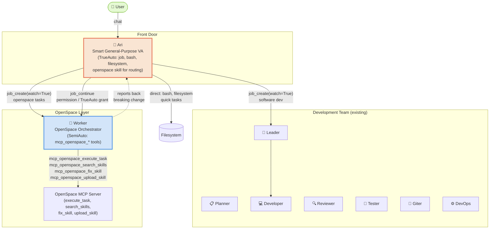

> ⚠️ Note: OpenSpace references in these planning docs are obsolete. Worker has been migrated to the native dynamic-skill system. Kept for architectural context.

# Plan Overview: Ari & Worker Agents

## Objective

Add two new agents to the agents-ensemble system: **Ari** (she/her) — a smart, friendly, general-purpose virtual assistant that combines direct task execution with job-based delegation, and **Worker** — a specialist OpenSpace MCP tool orchestrator. Together they form a user-facing front door (Ari, TrueAuto) with a specialized OpenSpace gateway (Worker, SemiAuto).

## Scope Assessment

**MEDIUM**

- **2 new agents** (11 new files): `ari/` (6 files) and `worker/` (5 files) directories
- **3 new test files**: comprehensive unit tests for each agent + cross-agent integration tests
- **0 modified existing files** — leader's `meta.json` is NOT changed (Decision D7: tool topology separation prevents circular dispatch)
- **No code changes** — agents are filesystem-defined; the registry auto-discovers new directories
- Estimated effort: 1 developer session, ~4-6 hours

### Justification
Agent definitions are pure markdown + JSON (no Python changes needed). The system auto-discovers any non-skip directory under `agents/`. The complexity is in getting the `meta.json` tool permissions, `innate_skills`, autonomy model, and prompt files right, plus writing high-quality tests.

---

## Context

- **Project**: agents-ensemble (`/Users/nguyenminhkha/All/Code/opensource-projects/agents-ensemble`)
- **Agent definition location**: `agents/{agent_id}/` with `meta.json`, `soul.md`, `rule.md`, `workflow.md`, optionally `user.md`
- **Auto-discovery**: `daemon/registry.py:AgentRegistry.discover()` scans `agents/` dir, skipping only `_trash`, `_baby_template`, `_prompt_system`, `_inner_soul`
- **Key existing patterns**: Jober (job orchestration), Leader (TrueAuto/SemiAuto autonomy, coordination + team delegation), DevOps (specialist agent test suite), Gaia (user-facing agent), Explorer (rag-only)

---

## Phase Index

| Phase | Name | Objective | Dependencies | Coupling | Est. Time |
|-------|------|-----------|-------------|----------|-----------|
| 1 | Worker Agent | Create the OpenSpace MCP orchestrator agent (4 files + tests), SemiAuto autonomy | None — OpenSpace MCP integration already complete | independent | 2h |
| 2 | Ari Agent | Create the general-purpose smart VA / jober-hybrid agent (6 files + tests), TrueAuto autonomy | Phase 1 (Ari dispatches to `worker` via `job_create`) | loose | 2.5h |
| 3 | Integration & Wiring | Cross-agent tests, end-to-end validation, escalation flow verification | Phase 1 + Phase 2 | tight | 1h |

### Coupling Assessment

| Phase Pair | Coupling | Reasoning |
|------------|----------|-----------|
| 1 → 2 | **loose** | Ari dispatches to `worker` via `job_create` — but Phase 2 only needs the agent *ID* to exist in the registry, not the full implementation. Could be built in parallel if agent IDs are agreed upfront. |
| 2 → 3 | **tight** | Integration tests verify Ari → Worker and Ari → Leader job dispatch flows, including the permission-escalation flow. Requires both agents fully built. |
| 1 → 3 | **tight** | Same — integration tests need Worker fully operational. |

**Recommended sequence**: Phase 1 → Phase 2 → Phase 3 (sequential). Total ~5.5h.

---

## Architecture Overview

### How the Flow Works

| Trigger | Flow | Example |
|---------|------|---------|
| Quick small task (< 5 steps) | User → Ari → (direct bash/filesystem) → User | "What's in package.json?" |
| Software development | User → Ari → `job_create(agent_id="leader", message="...", watch=True)` → Leader → team → `[JOB_EVENT]` → Ari → User | "Add a login page to my app" |
| OpenSpace task (no breaking) | User → Ari → `job_create(agent_id="worker", message="...", watch=True)` → Worker → `mcp_openspace_execute_task` → `[JOB_EVENT]` → Ari → User | "Extract emails from these PDFs" |
| OpenSpace task (breaking change) | User → Ari → `job_create(...)` → Worker detects breaking → reports back → Ari evaluates → `job_continue(worker_job_id, "Approved. TrueAuto.")` → Worker executes → `[JOB_EVENT]` → Ari → User | "Overwrite /data/output/ with processed results" |

### Autonomy Model

| Agent | Default Mode | Behavior |
|-------|-------------|----------|
| **Ari** | **TrueAuto** | Makes ALL decisions autonomously. Smart about planning, trade-offs, solutions. ONLY escalates to user for very important / breaking things. Handles Worker permission requests autonomously (approve safe ones via `job_continue`, relay critical ones to user). |
| **Worker** | **SemiAuto** | Executes tasks autonomously BUT must request permission for breaking/dangerous changes. Reports back requesting advice, then waits for Ari's `job_continue` response. Can be elevated to TrueAuto by Ari for safe tasks. |

---

## Key Design Decisions

> Full rationale in `decisions.md`

| # | Decision | Rationale |
|---|----------|-----------|
| D1 | **Ari is a jober-hybrid, not a pure jober** | She has direct `bash` + `filesystem` tools for quick tasks, PLUS `job` tools for delegation. The existing jober is dispatch-only. |
| D2 | **Worker is NOT a jober** | Worker receives jobs and executes them via OpenSpace tools directly. It doesn't create sub-jobs. |
| D3 | **No team_members for either agent** | Neither agent has `instance` tools. Both dispatch/receive via `job_create`, which doesn't check team_members. team_members is omitted entirely. |
| D4 | **Worker uses explicit `mcp_openspace_*` tool listing** | OpenSpace innate skill is instructional-only. Tools must be explicitly in `tools.allow`. |
| D5 | **Ari includes `openspace` innate skill** | So she understands OpenSpace capabilities when deciding whether to dispatch to Worker, but she does NOT have the actual `mcp_openspace_*` tools (only Worker does). |
| D6 | **Phase 1 = Worker, Phase 2 = Ari** | Worker is simpler and dependency-free. Ari dispatches to Worker via job_create. |
| D7 | **Leader team_members unchanged** | Tool topology separation (Leader has `instance` tools, Ari has `job` tools) prevents circular dispatch. No changes to existing agents. |
| D8 | **Neither agent has `instance` tools** | Job-only dispatch/receive. No spawn_instance, no send_message, no team_members needed. |
| D11 | **Autonomy model: Ari TrueAuto, Worker SemiAuto** | Ari is the smart autonomous decision-maker. Worker checks for breaking changes and escalates via job_continue. Mirrors Leader → Developer pattern through job tools. |

---

## Risks & Mitigations

| Risk | Impact | Probability | Mitigation |
|------|--------|-------------|------------|
| **Ari tool permission conflict** — jober pattern has no `bash`/`filesystem`, Ari needs both + `job`. Could confuse the agent about when to do vs. delegate. | Medium | Medium | Clear workflow.md triage rules: "≤5 steps + no delegation = do directly; else job_create". Explicit decision tree in rule.md. |
| **OpenSpace tools not installed** — `openspace-ai` package may be missing in test/dev environment | Low | Medium | Worker's soul.md and rule.md handle `ModuleNotFoundError` gracefully. Tests mock MCP tools rather than requiring real OpenSpace. |
| **Circular dispatch** — if leader can dispatch to Ari and Ari dispatches to leader | High | Low | **Decision D7**: Tool topology separation — Leader has `instance` tools (gated by team_members), Ari has `job` tools (unconstrained). Different mechanisms, no bidirectional path. |
| **Agent ID collisions** — `ari` or `worker` might conflict with existing IDs | High | Very Low | Verified: no existing agent named `ari` or `worker`. Not in SKIP_DIRS or alias map. |
| **Watch timing race condition** — known job-system gotcha (per project critical notes) | Medium | Low | Use `job_create(watch=True)` atomic pattern in all workflow examples. Follow jober's established pattern exactly. |
| **Ari prompt too long** — combining job-orchestration skill + coordination + bash + openspace could bloat the system prompt | Medium | Medium | Keep soul/rule/workflow focused. Openspace skill is instructional-only (compact). Job-orchestration skill is already concise. |
| **Escalation flow complexity** — the Ari → Worker → permission → job_continue flow adds interaction complexity | Medium | Medium | Clear workflow.md Mode 3 with the full job_continue flow documented. rule.md has explicit escalation handling rule. |
| **TrueAuto over-eagerness** — Ari might make decisions the user would want input on | Medium | Medium | Clear rule.md definition of "very important / breaking things". Ari is smart about the threshold. |

---

## Success Criteria

- [ ] `agents/worker/` directory exists with `meta.json`, `soul.md`, `rule.md`, `workflow.md`
- [ ] `agents/ari/` directory exists with `meta.json`, `soul.md`, `rule.md`, `workflow.md`, `user.md`
- [ ] Both agents auto-discovered by `AgentRegistry.discover()` (not in SKIP_DIRS)
- [ ] Worker `meta.json` has explicit `mcp_openspace_*` tools in `tools.allow`, no `team_members`
- [ ] Ari `meta.json` has `job-orchestration` innate skill + `job` tool category + `bash`/`filesystem`, no `team_members`, no `instance` tools
- [ ] Neither agent has `instance` tools or `team_members`
- [ ] Worker soul.md/rule.md encode SemiAuto autonomy (breaking-change detection)
- [ ] Ari soul.md/rule.md encode TrueAuto autonomy + Worker escalation handling
- [ ] All new unit tests pass: `tests/unit/test_worker_agent.py`, `tests/unit/test_ari_agent.py`
- [ ] Existing tests still pass (0 regressions)
- [ ] Worker OpenSpace skill loads correctly in prompt composition
- [ ] Ari job-orchestration skill loads correctly in prompt composition

---

## Tracking

- **Created**: 2026-07-09
- **Last Updated**: 2026-07-09 (review feedback: smart personality, autonomy model, remove spawn_instance)
- **Status**: draft
