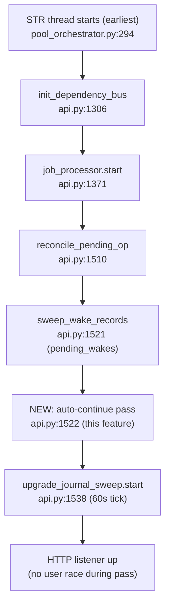

# Architecture Recommendation: auto-continue-running-after-restart

- **Date:** 2026-10-04T05:55Z
- **Branch / commit:** `feature/auto-continue-running-after-restart` @ `6303ba44` (working tree confirmed on-branch)
- **Mode:** Standard Design — Council checklist: only (c) multiple-viable-approaches met; (a) reversible, (b) additive/read-only-consuming, (d) contained by never-wedge envelope. 1 of 4 → no council.
- **Analysts:** 3 workers (competitive/area fan-out, one skill each): `data-flow-design` ×2 (CAS+AC4; boot-order+selection), `trade-off-analysis` ×1 (kill-switch+migration). All anchors re-grepped at `6303ba44`; the architect independently verified the three highest-severity findings in source before writing this file.
- **Verdict:** **Architecture VALIDATED — planner's choices stand on all 7 focus areas — with 2 imperative corrections (Δ1, Δ2) and 5 hardening deltas the developer MUST apply.** The defect class the plan under-modeled is *delay/stranding on the success path*, not double-fire; double-fire is structurally locked out and now fully verified.

---

## Focus 1 — Durable CAS composition

### Options
- **A (plan D2, "a′"):** selection → `_has_checkpoint` → `_schedule_explicit_handle_resume` → stamp only on `{"status":"resuming"}` via single-statement CAS `UPDATE task SET auto_continued_at=:boot_epoch WHERE id=:id AND status='running' AND (auto_continued_at IS NULL OR auto_continued_at < :boot_epoch)`; predicate *style* mirrors the claim-guard's folded-statement convention. **RECOMMENDED — keep verbatim.**
- **B:** fold the CAS into `claim_pending_task`'s atomic SQL. **REJECTED.**

### Recommendation
Keep Option A. Do not touch the claim-guard.

### Rationale (verified)
- `claim_pending_task` sits at `repository.py:1934` (plan's ":1733+" is stale — Δ6); the per-instance guard `instance_id NOT IN (SELECT instance_id FROM task WHERE status='running')` lives inside the atomic UPDATE…RETURNING at ~`:2230-2310` with the pinned anti-starvation comment. It is the **generic consumer-side claim** for every task type (`task_processor.py:1797`), not wake-specific. Folding the CAS in would (i) violate R5's do-not-touch constraint on a load-bearing, test-pinned guard; (ii) still require caller-side handling — "schedule an async resume" cannot live inside a sync SQL statement, so a′'s shape is needed regardless; (iii) stamp non-candidates or force boot-epoch plumbing into every worker poll. Inherit the *style*, never edit the claim.
- **`boot_epoch` is a DB-clock sentinel, not host wall-clock:** `capture_boot_epoch` reads PG `now()` / SQLite `CURRENT_TIMESTAMP` (`boot_epoch.py:95-133`; captured once at `api.py:412`; first-capture-wins). Stamps and comparisons share one clock → no cross-host skew exposure. Backward DB-clock step is **fail-closed**: new epoch ≤ old stamp → CAS declines → skip (a miss caught by StaleTaskRecovery), never a double-continue.
- **What `< :boot_epoch` buys over `IS NULL`:** per-epoch re-arm. `IS NULL` would permanently exclude a still-RUNNING orphan after the first stamp — frozen until STR on every subsequent boot (strictly worse for the restart-storm scenario this feature exists for). Same-second double boot (SQLite `CURRENT_TIMESTAMP` is second-granularity) shares an epoch → second boot skips → safe (STR owns); PG microsecond `now()` makes the collision practically impossible. Two simultaneously-live daemons on one DB are out-of-contract (port bind).
- **STR race (boot pass vs StaleTaskRecovery):** benign *while the epoch holds*. The amnesty clamp exists in BOTH selectors — `find_stale_running_tasks` (~`repository.py:3155-3162`, startup) and `find_cancellable_tasks` (`:4469-4500`, periodic; the 60s loop passes `boot_epoch` too, `stale_task_recovery.py:405-408`; interval 60s `:26`, `DEFAULT_MAX_RETRIES=3` `:28`). The pass runs seconds after boot, far inside the 10-minute clamp → STR cannot force-cancel in the selection→schedule window. **The exception is `boot_epoch=None`** (capture failure): the clamp vanishes and the just-started 60s loop may reap a >10-min-stale orphan mid-pass → resume scheduled against a CANCELLED work_id → two *sequential* drivers (ExecutionGate serializes) = one wasted duplicate continuation. Avoidable → Δ2.
- **Stamp semantics, pinned ADR-040-style:** the timestamp **asserts** "a resume was scheduled in epoch X against this row while it was `status='running'`". It does **NOT assert** the turn started, progressed, or completed (the schedule is fire-and-forget `asyncio.create_task`). Recovery ladder — every mode lands in automatic retry or STR, none is silent-permanent: *no checkpoint* → skip, no stamp, next boot retries (`_has_checkpoint`, `instance_messaging.py:1437-1451`); permanent no-checkpoint → STR re-injects (`:4270-4279`); *schedule refused* (incl. in-process `already_resuming`, `manager.py:~10988-10998`) → no stamp (already encoded in phase2-plan T2.3); *CAS lost* (rowcount 0) → log, never re-stamp; *schedule-then-death* → stamp absent → next boot re-schedules (safe: `astream(None)` continues from the advanced checkpoint, `instance_messaging.py:4245-4249`); *stamped then mid-turn death* → next epoch re-matches via `<` → re-continues from checkpoint.
- **One-shot loss window (task question, answered):** YES, acceptable — the a′ residual gap (die between schedule-return and stamp) re-schedules next boot, and re-continuation is idempotent at the checkpoint level. Manual-resume + STR is adequate recovery *for that gap*. The plan's recovery story has a **different, larger hole it did not analyze** — see Focus 3 (Δ1).

### Plan deltas
- **Δ2 (🔴, merges Worker C's imperative):** `phase2-plan.md` T2.2 step (2) — on `boot_epoch is None`, **SKIP the pass with a WARNING** (STR amnesty semantics stay coherent; the mid-pass STR reap race is killed). Do NOT "proceed with `datetime.now(timezone.utc)`": that fallback is timezone-**aware** while the entire comparison frame is naive-UTC (`_to_naive_utc` `boot_epoch.py:88,114,136`; `now_utc_naive()` `timestamps.py:51`; `_default_created_at_naive_utc` `models.py:273`; amnesty comment `repository.py:3155-3156`) — an aware stamp silently corrupts epoch comparisons on SQLite (lexicographic ISO with `+00:00`) and errors on PG TIMESTAMP. If any fallback timestamp is ever retained anywhere in the pass, it MUST be `now_utc_naive()`.
- **Δ6 (🟡):** re-pin `claim_pending_task` → `repository.py:1934`, guard block → ~`:2230-2310`; note SQLite same-second epoch sharing in the CAS docstring.
- Cross-ref Δ1 (success-path terminalizer — the gap a′ does not cover).

---

## Focus 2 — Boot ordering

### Options
- **A (plan D3):** insert at `api.py:1522` — after `sweep_wake_records` (`:1521`), before `upgrade_journal_sweep.start()` (`:1538`), inside the existing envelope try as its own inner try/except. **RECOMMENDED — adopt verbatim.**
- **B:** before the wake sweep / inside STR / after listener-up — all rejected by the plan; worker evidence confirms each rejection.

### Recommendation
Adopt the `:1522` slot. The phase2-plan T2.3/T2.4/T2.6 envelope (per-candidate try → sweep-level try → lifespan inner try, `asyncio.to_thread` for sync hops) is already correctly specified — validated, no delta needed beyond wording.

### Rationale (verified)
- **After `init_dependency_bus` (`api.py:1306`): required and sufficient.** For a non-WC RUNNING parent, the bus re-arms only FIRED-but-unenqueued child→parent wakes (`_recover_fired_unsent`, `enqueued_at IS NULL`); child reports otherwise land as PENDING Task rows behind the claim-guard. The bus never resumes a RUNNING non-WC parent → **no redundant-resume risk**. (Anchor drift: the bus helpers are at `_warm_cache :1804`, `_recover_fired_unsent :1839`, `_sweep_orphan_watchers :1896` — NOT inside the plan-cited `:1499-1560`, which covers only `start()` → Δ6.)
- **Before STR's reap window: guaranteed by the amnesty clamp, not by "STR runs later".** Correction to the plan narrative (Δ6): the STR thread is the **earliest** boot subsystem (`pool_orchestrator.py:264-294`, before `init_dependency_bus`) and is already running at `:1522`. The structural guard is the `boot_epoch` amnesty (`repository.py:3161` startup path, `:4501` periodic path). While the epoch holds, the selection→schedule window has zero STR interference; after the threshold, a continued turn is either terminal (invisible to STR's `status='running'` predicate) or heartbeating (alive) — the miss case is exactly STR's designed job (retry task = checkpoint continuation).
- **Interleaving with the wake sweep (same instance): clean.** The wake's `enqueue_message` (`upgrade_journal_sweep.py:1092-1093`) creates MessageQueue **READY** (`instance_messaging.py:1777`) + Task **PENDING** (`:1904`) in one transaction, with **no instance.status mutation** for a RUNNING instance (the `status_change` event fires only on an actual change, `:2204-2208`). No second RUNNING task is created → the one-running-turn-per-instance invariant (a convention enforced atomically by the claim-guard SQL, `repository.py:2230-2294`) is not at risk; the pass bypasses the claim path entirely (resume, not claim).
- **Critical AC4 survival detail:** the wake's message row is READY — **outside** `_schedule_explicit_handle_resume`'s stale-message kill set (PENDING/PROCESSING/RETRYING, `manager.py:11000-11010`) — so the pass's cleanup cannot eat the wake. The FM-1 PROCESS_REPORT/COMPLETION_REPORT exemption is irrelevant to this shape.
- **HTTP listener is NOT up during the pass** — uvicorn accepts nothing until the lifespan startup yields. This is *stronger* than the plan's "user messages queue behind": there is no user-driver race window at all during the pass.
- **Post-slot actors:** the periodic `upgrade_journal_sweep` tick's late wake is just another `enqueue_message` behind the guard (FIFO, no re-delivery loop); `job_processor.start` (`:1371`) workers claim PENDING tasks — blocked by the guard for candidates, irrelevant to selection (a DB read).

### Plan deltas
- Δ6 wording fixes only (STR "runs earlier (5c)" → "STR thread starts at `pool_orchestrator.py:294`, earliest; the `boot_epoch` amnesty at `repository.py:3161/:4501` is the structural guard"; dependency_bus helper anchors as above).
- Add to R4: "If the resumed turn dies after schedule but before heartbeat, STR's periodic reap (after epoch+threshold) reaps via `force_cancel_and_schedule_retry` — correct fallback, no double-resume."

---

## Focus 3 — AC4 double-fire proof

### Options
- **A:** accept plan D3/D4 as-is. **Rejected by evidence** — the lock-out holds but the success-path delivery mechanism as narrated is wrong.
- **B:** accept with Δ1 (success-path terminalizer). **RECOMMENDED.**
- **C:** accept STR-mediated recovery and rewrite AC4/D6 language to say so. Rejected (budget burn contradicts D6's intent; ~10-min wake delay contradicts AC4's deterministic-FIFO framing).

### Recommendation
The structural double-fire lock-out is **verified end-to-end**: continue-in-place + placement AFTER the wake sweep + claim-guard + ExecutionGate + READY-message survival ⇒ **no ordering produces two simultaneous drivers while amnesty+epoch hold.** But ship Δ1, because on the success path the wake lands FIFO-behind only at STR reap (~boot+10 min) without it.

### Rationale (verified)
- **Wake delivery path:** `sweep_wake_records` → `manager.enqueue_message(priority=2)` → READY message + PENDING task → TaskProcessor claims via `claim_pending_task` (`task_processor.py:1797`). Vocabulary reconciled: the JobProcessor lane claims JobItems in QUEUED admission state; messages create **no JobItem** ("No JobItem row is ever created for a message") — two disjoint vocabularies, no contradiction with "job_processor claims QUEUED only".
- **Failure path — correct as planned:** `_resume_processing_background`'s error handler runs `fail_task` by work_id (`manager.py:11735-11746`); `WHERE status='running'` matches the orphan → row FAILED → guard opens → wake claims FIFO (PROCESS_REPORT tier first, then `created_at ASC`, claim docstring `:1984-1989`) → delivers to the now-ERROR instance via standard revival machinery. Correct.
- **Success path — the hole (architect-verified in source):** `manager.py:11666-11697` removed `complete_task` from the resume path and assigns the task-row lifecycle to "the WorkerPool re-claim path", whose documented lifecycle **presupposes a PAUSED entry state** (Pause: RUNNING→PAUSED; Resume: PAUSED→PENDING via `_resume_cascade_db_sync`; WorkerPool: PENDING→RUNNING via claim; Worker: →COMPLETED/FAILED). A crash-orphaned RUNNING row never reaches PENDING (D4 forbids the pass from writing task status), so **nothing ever terminalizes it on success**. Verified consequences: the claim-guard stays closed → the pending wake **cannot claim at turn completion** (AC4's FIFO mechanism never fires); `has_instance_busy` stays True (blocks `job_continue`); F10 drift repair can't help (needs a terminal JobItem, `job_recovery_service.py:961-966`). STR becomes the de-facto terminalizer at boot+10 min — with `retry_count` burn (contradicts D6) and a ~10-min wake delay. Compounding: **resume-driven turns write no heartbeats** (heartbeat writers are per-worker-thread, `worker_pool.py:61-97`; zero heartbeat writes on the manager resume path — verified) → a *healthy* continued turn longer than 10 min is stale-beat-reaped MID-TURN; the zombie holds the ExecutionGate while the retry child waits, then re-drives from the advanced checkpoint. Consistent (no corruption), but duplicated and budget-burning — R4's "a continued turn is either terminal or genuinely stuck" premise is **false for long turns**.
- **Interleaving matrix (instance targeted by both passes):** (1) WS→CP: wake blocked, zero double-turn ✅; (2) CP→late-WS tick mid-turn: same guard block, wake marked delivered at enqueue, no re-delivery ✅; (3) WS→CP→turn fails: `fail_task` opens guard, wake delivers once, revives ERROR instance ✅; (4) WS→CP→turn succeeds: guard frozen → STR reap ~+10 min → wake+retry FIFO, wake first ✅-but-delayed ⚠️ (fixed by Δ1); (5) turn still running at +10 min: STR mid-flight reap, zombie holds gate, retry re-drives from advanced checkpoint — serialized ⚠️ (documented by Δ3); (6) epoch=None STR-reap mid-pass: two sequential drivers, bounded duplication 🔴 (fixed by Δ2). **The defect class is delay/freeze, not double-fire.**
- **Terminal-instance wake:** wake claim → dispatch drives a fresh turn; if the instance row is terminal, `_prepare_enqueued_message`'s revival reactivates it (`instance_messaging.py:1958-1975`) — **correct and already-handled**. PAUSED: enqueue writes rows but deliberately does not flip PAUSED (`:1950-1955`) → the wake is **deferred until manual resume, not rejected** — correct. The arm-notify wake does not route through dependency watchers (journal-file wake → `enqueue_message`), so watcher re-registration is not load-bearing here (UNVERIFIED as a distinct code site; WC parents are bus-owned per D14 and unaffected). Attestation: wake priority=2 ≠ 1 → no fresh-episode reset (`:1984-2040`) — D8 holds.

### Plan deltas
- **Δ1 (🔴):** add an explicit success-path terminalizer for the orphan row: in `_resume_processing_background`'s success branch (after `_process_resume_finalize`), call `complete_task` by work_id — the repository's `WHERE status='running'` guard (`repository.py:2803,2948`) makes it a **no-op for cascade/worker-owned shapes** (cascade rows are PENDING by then) and terminalizes **exactly the direct-resume orphan**. This is why the in-source race concern ("completing here would race the re-claim and flip a PENDING task") does not apply: the status guard is load-bearing and must be asserted in tests. `manager.py` is already in the plan's touch table (PG column-ensure); the "no changes to" list does not cover it. **M13 pinning test must assert the guard OPENS after a successful continued turn** — as specified, it would pass vacuously on success-path fixtures.
- **Δ3 (🟡):** document/own the no-heartbeat window: plan text must state continued turns are STR-reapable at boot+10 min, that reap = checkpoint-continuation retry (survives), and that `retry_count` burn applies to >10-min turns (explicit D6 exception). Optional mitigation: stamp `last_heartbeat_at` in the CAS transaction (buys exactly one threshold window). Rewrite AC4/R1 language: guard release mechanism = `fail_task` (failure) / Δ1 terminalizer (success) — **not** "turn completion" in general.
- Carry Δ2, Δ6.

---

## Focus 4 — Kill-switch default

### Options
- **A (plan D13): default ON** — env-direct `ENSEMBLE_AUTO_CONTINUE_RUNNING_ON_RESTART`, `!= "0"` disables, per-boot read, mirrors `ENSEMBLE_POST_RESTART_ARM_NOTIFY`. **RECOMMENDED.**
- **B: default OFF** (R15 snapshot precedent). Rejected.

### Five-axis comparison
| Approach | Complexity | Scalability | Maintainability | Risk | Cost | Verdict |
|---|---|---|---|---|---|---|
| A: ON | Low (one-liner env gate, mirrors `upgrade_journal.py:886-896` verbatim) | Low-impact (one boot read; one-shot pass) | **High** (family-consistent; env-direct is the verified house style — `config.py:1625-1634` carries the "no kill-switch on ServicesConfig" HARD POLICY twice) | **Bounded** (fail-closed CAS + never-wedge envelope; worst case token-class; avoids the measured status-quo damage) | Zero infra; tokens on spurious continues only | **RECOMMENDED (4.00)** |
| B: OFF | Low | Low-impact | Medium (silent no-op on fresh installs for a user-mandated behavior; third semantics in the family) | **Keeps shipping the bug** (33 alive-recovery lines / 0 auto-resumes; instance frozen through 32 restarts → f1-DEAD + manual delete) | Continued operational waste | Rejected (3.40) |

### Rationale (verified)
- **Worst case with a correct CAS is token-class and bounded.** Replay semantics verified: silent resume → `graph_input=None` ("Pure checkpoint resume", `instance_messaging.py:4266-4269`) → `astream(None)` (`:4499`) continues from the **last committed checkpoint** — committed nodes and their tool side-effects are NOT re-executed. (i) Duplicate concurrent drivers: serialized by the per-instance ExecutionGate lock (`execution_gate.py:108-150`), and the pass runs pre-listener so no user-driver race exists. (ii) Mission-effectively-done: one bounded turn terminating via the standard path. (iii) N spurious continuations: tokens only, once per epoch, observed worst N≤33.
- **Residual side-effect risk is NOT new:** an UNCOMMITTED mid-flight node re-runs on resume with its partial tool effects — the standing exposure of every checkpoint-continuation consumer today (STR retries, cascade-resume, answer-gate). This feature adds no new member to that class; idempotency of mid-flight tool effects is a pre-existing tool-authoring concern. (Caveat: the exact upstream node-boundary semantics are contract-cited, not repo-proven → E2E step-6 audit assertion, see Open Questions.)
- **Rollback-safety story:** runtime disable without restart is **impossible and correctly so** — the pass fires once at boot reading env at entry; opt-out takes effect at the next boot, exactly when the behavior next fires (arm-notify's ARM side has the same granularity; its per-tick read differs only because its sweep is periodic). Mid-boot escape from a continue storm: the storm is bounded (N scheduled once, pre-listener); restart with `=0` → pass short-circuits (`skipped_kill_switch`) and **already-continued instances are unaffected** (no selection runs; STR never consults `auto_continued_at` — its predicate is `COALESCE(last_heartbeat_at, started_at) < threshold`, `repository.py:3155-3181`). If the emergency restart itself kills a continued turn mid-flight, STR picks it up at boot+10 min.
- **R15 default-OFF is a false sibling:** different surface (per-project metadata toggle vs env-direct) and different semantics (snapshot changes behavior for NEW spawns; this feature only continues PRE-restart-interrupted work — no new behavior for anything that wasn't already mid-flight).

### Plan deltas
- None beyond Δ2 (the epoch fallback lives in the same T2.2 step). D13's cites all verified exact.

---

## Focus 5 — Migration + release safety

### Options
- **A (plan):** SQLite migration file + PG `_ensure_postgres_columns` entry + SQLModel field, `last_heartbeat_at` precedent. **RECOMMENDED — verified end-to-end.**
- Alternatives (instance-level column, wake-journal substrates) already rejected in D2/D5; no new contender surfaced.

### Rationale (verified)
- **Dual-driver mechanics:** SQLite runner is SQLite-only (`runner.py:721`), ordered + checksummed ledger (`schema_migrations`, SHA-256 `:67-68`; pending = dir − ledger `:307-314`; transactional per docstring `:170`); the docstring **mandates** the PG ensure companion (`:705-710`). PG: `_ensure_postgres_columns` at `manager.py:5834` (precedent entry `:6020`, `ADD COLUMN IF NOT EXISTS`, safe every boot). Fresh PG gets the column via `create_all` from the model (`:702-705`). Boot order: SQLite migrations (`manager.py:585`) → PG ensure (`:602`) → any task query. Consistency requirement (already in plan, pinned by T1.x tests): model field + .sql + PG entry must land in the SAME release — a missing one is a loud `AttributeError` at the first `_row_to_task` (`repository.py:2754` docstring), fail-loud by design.
- **ADR-035 rollback_safe — old binary tolerates the new column: VERIFIED at code level.** Nullable, no default, no backfill (correct initial state = NULL; contrast `last_heartbeat_at`, which needed a startup backfill). `select(Task)` emits explicit model columns (never `SELECT *`); the raw `SELECT * FROM task` sites (`repository.py:2906, 3019, 4409, 4664, 4872, 4925`) all feed `_row_to_task`, which maps **by column name** — an extra trailing column is unreferenced and harmless to old and new code. Inserts are constructor-based explicit-column. The ledger tolerates a newer applied row under an old binary (no checksum re-verification of applied rows). **Rollback requires NO DOWN migration** — presence-only is tolerated; the plan's DOWN statement is for full feature removal only.
- **Git topology (verified):** `merge-base(feature, latest)` = `cf8efbef` = `latest` tip (local and `origin/latest`) → the feature sits directly on latest tip, **no rebase needed**; its only unique commit is `6303ba44` (the plan). `v0.16.12` = `f1549f6f` already tagged and contained in latest → **this feature's migration rides v0.16.13+** (first bump after merge); the migration ledger is per-install, so the staged v0.16.12 payload is untouched.
- **Pure ADD COLUMN:** single `ALTER TABLE task ADD COLUMN` per driver; no data migration, no backfill, no destructive op; touches none of the boot destructive-legacy-drop hazards.

### Plan deltas
- Δ2 only (stamp format must match the next boot's DB-clock epoch format — same T2.2 step). D17 (no index) consistent across all three drivers.

---

## Focus 6 — Shared-worktree hazard → MUST plan delta

### Options
- **A: dedicated git worktree for the implementation + E2E lanes.** **RECOMMENDED (MUST).**
- **B: work on the shared main checkout** (`feature/...` checked out there today). Rejected — concurrent commissions switch the shared checkout's branch mid-flight (the hazard that motivated this focus area; observed residue already present in the working tree).

### Recommendation / rationale (evidence)
- `agents/developer/rule.md:164` — "Assigned wt_path? cd into the worktree before any git op; **never commit on the main checkout**." `agents/giter/workflow.md:77-83` (Worktree Mode) — sibling worktrees live at `../<repo>-wt-<slug>/` with a KV claim protocol; documented trap: "daemon in worktree hits prod defaults (export env explicitly)".
- **MUST plan delta (Δ7):** the implementation and demo-E2E lanes run in a dedicated worktree `../ensemble-src-wt-auto-continue` with:
  1. **A fresh uv venv inside the worktree**, gated by `python -c "import daemon; print(daemon.__file__)"` resolving INSIDE the worktree before any test run — the editable-install trap: a venv inherited from the main checkout resolves `daemon` to the main checkout path, silently testing the wrong tree.
  2. **Explicit env exports** for any daemon run from the worktree (prod-defaults trap above). DB pinning must override a `POSTGRES_*` **part** (e.g. `POSTGRES_PORT`), not `POSTGRES_URL` — the checkpointer honors `POSTGRES_URL` but repositories read `POSTGRES_*` parts only (F-DR1-2 split-brain, `daemon/persistence.py:79-89` vs `daemon/repositories/factory.py:189-198`); a part override moves BOTH.
  3. The demo E2E (port 7979, `~/agents-ensemble-demo/`) itself targets the demo install, not the worktree — evidence bundle captured under the worktree's plan dir.

---

## Focus 7 — Selection semantics

### Options (per sub-question)
- Predicate shape: plan predicate + hardening (**recommended**) vs plan-as-written.
- >1 RUNNING tasks per instance: **log-and-skip the instance** (recommended) vs resume-newest vs raise.
- Boot concurrency: **stagger 5 resumes / 2 s** (recommended) vs unbounded v1 vs semaphore cap.

### Rationale (verified)
- **Task-status vocabulary:** `find_paused_or_cancellable_turn` (`repository.py:743-839`) matches `status IN ('paused','running')` AND `task_type IN ('process_message','process_report')`; the pass narrows to `status='running'` (D7). Mid-flight death leaves `task.status='running'` (no auto-transaction on death; heartbeat goes stale but the row stays RUNNING).
- **"No live graph" at pass time:** trivially true after process death (`_graph_tasks` is a fresh in-memory dict). Between `job_processor.start` (`:1371`) and the pass, the claim-guard blocks PENDING claims for candidate instances → no graph task can appear for them; belt-and-braces = `_schedule_explicit_handle_resume`'s own dedup (`manager.py:10988-10998`) → `already_resuming` → benign skip, no stamp (already encoded in phase2-plan T2.3/T2.5 — validated).
- **Cosmetic-status instances** (instance row RUNNING, last task terminal): excluded naturally by the task-status join — D11 validated with zero extra machinery; stuck-RUNNING instance rows remain Pattern-f1/operator domain, correctly out of scope.
- **>1 RUNNING tasks per instance:** the invariant is convention enforced by the claim-guard SQL, not a DB constraint — bug residue could violate it. `find_paused_or_cancellable_turn`'s count-then-select RAISES on >1 (`repository.py:825-832`) — the pass must NOT reuse that pattern (a raise aborts the boot for unrelated candidates). Recommended: single SELECT; if 2 rows for one instance → WARNING with both task_ids + **skip the instance** (no-resume protects the graph; STR later reaps both via `force_cancel_and_schedule_retry` and the retry claims cleanly).
- **Predicate hardening:** spell out the complete instance-status exclusion set — `status NOT IN ('paused','terminated','completed','error','failed','waiting_children')` (not just "PAUSED/terminal/WC") — and add `cancel_requested=False` so an in-flight STR cancel can't double-pick the same task.
- **Boot concurrency / LLM stampede:** verified throttle inventory — ExecutionGate is per-instance only (`execution_gate.py:108-150`); `WORKER_POOL_SIZE=5` / `CHAT_WORKER_POOL_SIZE=2` (`constants.py:70/:78`) bound **claim** pools, not graph execution; the GII throttle is per-turn (`graph.py:65-72`); LLM failover is per-turn. The only real cross-instance bound is the supervisor proxy's RPM/TPM. Worst observed N=33 → 33 concurrent `astream` LLM calls within the first seconds of boot; cost = N × P99 first-token latency added to boot completion + N × token spend; 429s trip the failover path. **Stagger at 5 candidates per 2 s** (≈14 s total at N=33; a single `await asyncio.sleep(2)` every 5 candidates; no ExecutionGate coupling, no reach into private `_resume_processing_background` — a semaphore that bounds only *scheduling* is a no-op for execution, and bounding execution requires touching the private primitive). Add pass metrics (`auto_continue_boot_pass_resumes_total{route_outcome="boot_continue"}` counter + `auto_continue_boot_pass_duration_seconds` histogram) for empirical grounding.
- `boot_epoch` for the pass: use `get_boot_epoch()` / the pass-entry snapshot consistently (per-daemon-process constant, `boot_epoch.py`).

### Plan deltas
- **Δ4 (🟡):** predicate hardening (complete exclusion set + `cancel_requested=False`) and the >1-candidate log-and-skip defense (module docstring + WARNING; explicitly NOT the count-then-select pattern).
- **Δ5 (🟡):** stagger 5/2 s + pass metrics (modifies D10 — the loop stays sequential; this adds cadence). Flip condition: if the proxy is shown to absorb 33 concurrent calls without 429s, drop the stagger and keep the metrics.

---

## Consolidated MUST-apply plan deltas (developer checklist)

| # | Sev | Delta | Where |
|---|-----|-------|-------|
| Δ1 | 🔴 | Success-path terminalizer for the orphan row: `complete_task` by work_id in `_resume_processing_background`'s success branch, relying on the `WHERE status='running'` guard (no-op for cascade/worker shapes). M13 must assert the guard OPENS after a successful continued turn. | phase2/phase3 plans; `manager.py` touch entry |
| Δ2 | 🔴 | Epoch-None → **skip pass + WARNING** (never host wall-clock; kills the STR mid-pass reap race). Any retained fallback timestamp MUST be `now_utc_naive()` (T2.2's `datetime.now(timezone.utc)` is aware — frame is naive-UTC). | `phase2-plan.md` T2.2 step (2) |
| Δ3 | 🟡 | Document the no-heartbeat window (continued turns STR-reapable at boot+10 min; reap = checkpoint retry; `retry_count` burn = explicit D6 exception for >10-min turns); optionally stamp `last_heartbeat_at` in the CAS txn. Rewrite AC4/R1 guard-release language (`fail_task` \| Δ1 terminalizer — not "turn completion"). | decisions.md D4/D6, risk-register R1/R4, phase3 M13 |
| Δ4 | 🟡 | Selection hardening: full instance-status exclusion set + `cancel_requested=False`; >1 RUNNING tasks per instance → log+skip (never the raising count-then-select pattern). | phase1-plan (predicate), module docstring |
| Δ5 | 🟡 | Stagger 5 resumes / 2 s + pass metrics (counter + histogram). | phase2-plan T2.3/T2.4; modifies D10 |
| Δ6 | 🟡 | Anchor hygiene: `claim_pending_task` `:1934` (guard ~`:2230-2310`); bus helpers `_warm_cache :1804` / `_recover_fired_unsent :1839` / `_sweep_orphan_watchers :1896`; STR wording (thread starts earliest at `pool_orchestrator.py:294`; amnesty `repository.py:3161/:4501` is the guard); SQLite same-second epoch note. | plan-overview, decisions.md D3/D12, risk-register R4/R11 |
| Δ7 | 🔴 | Dedicated worktree `../ensemble-src-wt-auto-continue` + fresh uv venv + `import daemon` resolution gate + explicit env/`POSTGRES_*`-part DB pinning for the implementation + E2E lanes. | NEW plan delta (plan-overview §implementation lane) |

## Decisions pending (leader/developer ratification)

1. **Δ1 terminalizer** — touches the shared `_resume_processing_background` success branch (a path cascade-resume also drives). Evidence says the `status='running'` guard makes it a surgical no-op for other shapes; ratify or explicitly accept STR-mediated success-path recovery with the AC4/D6 language rewrite (Option C, not recommended).
2. **Δ5 stagger cadence** — adopt 5/2 s, or explicitly accept unbounded v1 with metrics only (flip condition stated).
3. **Optional `last_heartbeat_at` stamp in the CAS transaction** (Δ3 mitigation) — buys one threshold window; adopt or document-only.

## Open questions

1. **Upstream `astream(None)` node-boundary semantics** are contract-cited (LangGraph commits at node boundaries), not repo-proven against the pinned version — the demo E2E's step-6 audit should assert no already-executed tool call re-fires.
2. **Watcher re-registration on revival** — UNVERIFIED as a distinct code site; not load-bearing for arm-notify wakes (they route via `enqueue_message`, not dependency watchers). Revisit only if the E2E exercises WC-parent revival.
3. **Δ1 flip condition (now closed by architect verification):** a hidden owner that terminalizes RUNNING rows of COMPLETED instances would downgrade Δ1 to documentation — searched all `complete_task` sites in `daemon/`; none fits the direct-resume orphan shape (all require a PENDING claim or a terminal JobItem).

## Confidence

**High.** The recommendation flips only if: (a) the CAS is wrong (re-continuation every boot / selection catching non-interrupted tasks) — then Δ-fix-first and reconsider the default-ON; (b) a mid-flight node class with destructive non-idempotent tool effects is shown to commonly sit at the interruption point (pre-existing class, but ON widens frequency); (c) demo-E2E turns routinely exceed 10 min — then Δ3 escalates from 🟡 to 🔴 (mid-turn STR reap becomes the dominant behavior, and the Δ3 heartbeat stamp becomes mandatory).

## Boot-ordering diagram (verified anchors)

