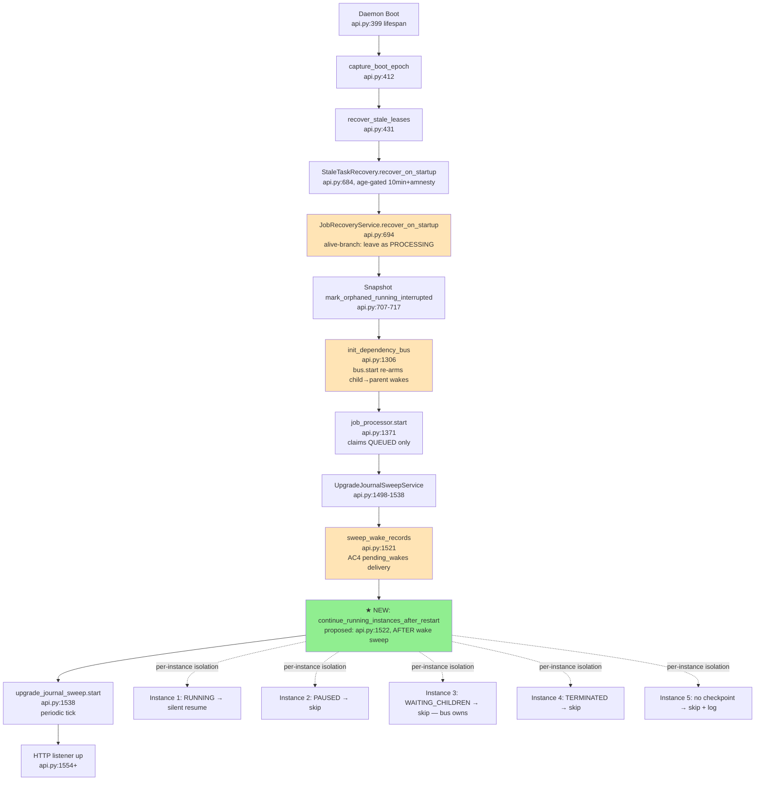

# Technical Analysis: auto-continue RUNNING instances after daemon restart

Date: 2026-10-04
Author: planner[v2] via technical-analysis worker
Repo: `/home/nea/ensemble-src` @ `feature/auto-continue-running-after-restart` = `cf8efbef`
Branch HEAD verified: `cf8efbef feat: post-restart arm-notify — auto-wake arming instance after daemon upgrade/restart (#merge)`
Investigation input: `.agents/shared/planning/auto-continue-running-after-restart/investigation.md` (wanderer, 223 lines, 5 sub-investigations + spot-verification)
Analysis depth: deep-dive (design authority for plan-creation wave)
Status: Draft — feeds planner

---

## Question

Design a **durable, idempotent, never-wedge boot pass** that automatically continues RUNNING instances from their last LangGraph checkpoint after a daemon restart, **without** introducing a parallel messaging/continuation path, **without** disturbing PAUSED instances, **without** touching terminal instances, and **without** double-firing with the existing `pending_wakes` sweep.

User-verbatim: *"after a daemon restart, instances that were in RUNNING state must automatically continue from checkpoint, reusing existing functions (no parallel messaging/continuation path). PAUSED instances stay parked. Terminal instances never touched."*

## Context Summary

The wanderer's investigation established three load-bearing facts this analysis builds on:

1. **No boot pass today re-dispatches an interrupted RUNNING instance's turn.** StaleTaskRecovery (boot+10 min, `max_retries=3`) is the only automatic path back; the `JobRecoveryService` alive-branch at `daemon/services/job_recovery_service.py:683-689` literally logs *"leave as PROCESSING, the observer will resume pickup"* — but the observer is event-driven and a dead process emits no events. Live corpus forensics: 33 `is alive (running)` and 171 `is alive (waiting_children)` recovery lines, ZERO auto-resumes; instance `5b4c47a4` survived 32 consecutive daemon restarts frozen each time, f1-DEAD'd at 13:22:42 and manually DELETE'd at 14:16:37.

2. **All required primitives exist and compose cleanly.** The minimal "continue prior turn without injecting text" sequence is: `find_paused_or_cancellable_turn` (`daemon/repositories/task/repository.py:743`) → guard with `_has_checkpoint` (`daemon/services/instance_messaging.py:1438`) → `_schedule_explicit_handle_resume(silent=True, target_work_id=...)` (`daemon/manager.py:10915`) → background `_resume_processing_background(is_retry=True, silent=True)` (`daemon/manager.py:11445`) → `graph_input=None` branch (`daemon/services/instance_messaging.py:4267-4269`) → `astream(None)` checkpoint continuation. **No new mechanism needed.**

3. **The durable idempotency story is non-trivial.** In-process dedup surfaces (`_graph_tasks` `manager.py:506`; `_execution_gate` `daemon/services/execution_gate.py:108-144`) are process-local — empty at boot. A reboot loop (boot→continue→crash→boot) is only stopped by **two durable structures**: the per-instance claim-guard inside `claim_pending_task` (`daemon/repositories/task/repository.py:2230-2294`) and a *new* durable "already-continued" marker. **Pattern A boot CAS** (`daemon/services/maintenance_boot_sweep.py:39-60` and the snapshot precedent `daemon/repositories/snapshot/repository.py:321-346` `mark_orphaned_running_interrupted`) is the established idiom; the *row-scoped instance column* precedent (mirrors `attestation_denied_count`) is a fallback. A reboot-loop must respect: (1) the claim-guard — never create a second claimable task while one is RUNNING; (2) a durable already-continued marker read at boot; (3) the enqueue-rollback semantics of `mark_wake_pending`/`mark_wake_delivered` (`daemon/services/upgrade_journal_sweep.py:1391-1417`).

The analysis assumes the feature is **scope-bounded to RUNNING → checkpoint resume** and **leaves WAITING_CHILDREN to the existing DependencyBus path** (which is already durable — see §D).

---

## Architecture

### Current Patterns

| Pattern | Where used | Load for this feature |
|---|---|---|
| **Daemon lifespan boot sweep + try/except (fire-and-forget)** | `daemon/api.py:1510-1531` (`UpgradeJournalSweepService` boot reconcile + `sweep_wake_records()`), `daemon/api.py:704-717` (snapshot `mark_orphaned_running_interrupted`), `daemon/services/upgrade_journal_sweep.py:1055-1109` (per-wake + sweep-level try/except) | **Architectural template** — copy verbatim |
| **`find_paused_or_cancellable_turn` selector** | `daemon/repositories/task/repository.py:743-854` | **Boot-sweep selector** for dormant RUNNING tasks; one-running-turn-per-instance invariant (raises `ValueError` on >1 match — see `repository.py:826-832`) |
| **`_schedule_explicit_handle_resume(silent=True, target_work_id=...)` + `_resume_processing_background(is_retry=True, silent=True)`** | `daemon/manager.py:10915-11443` + `daemon/manager.py:11445+` | **The continue primitive** — exactly what the wake branch's WC-wake precedent (`manager.py:10837-10860`) does, but without the new `enqueue_message` call |
| **Pure checkpoint resume** (`is_retry=True` + `silent=True` → `graph_input=None` → `astream(None)`) | `daemon/services/instance_messaging.py:4267-4269`; gate at `:1438` `_has_checkpoint`; `is_retry` derivation at `daemon/services/task_processor.py:527` | **The actual turn-restart mechanism** — the `_resume_processing_background` call site passes `is_retry=True, silent=True, message_source="cascade_resume"` (`manager.py:11533-11541`) |
| **Per-instance claim-guard inside atomic UPDATE...RETURNING** | `daemon/repositories/task/repository.py:2230-2294` (`AND instance_id NOT IN (SELECT instance_id FROM task WHERE status = :status_running_guard)`) | **The load-bearing durable gate** — even if in-process dedup is empty at boot, two claimable tasks for the same instance cannot coexist |
| **`DependencyBus.start()` re-arm (DB-durable)** | `daemon/services/dependency_bus.py:1499-1560` (`_warm_cache` → `_recover_fired_unsent` → `_sweep_orphan_watchers`) | **Already covers AC3** — no new mechanism needed for child→parent wakes; the bus's `enqueued_at IS NULL` filter is the C1 dedup marker |
| **Snapshot boot sweep Pattern A** | `daemon/repositories/snapshot/repository.py:321-346` (`mark_orphaned_running_interrupted` — one idempotent UPDATE, zero rows on second call) | **Direct precedent for the boot-CAS marker** — same shape, applied to a different table |
| **WC-wake precedent (`"continue"` enqueue pattern)** | `daemon/manager.py:10837-10850` (enqueues `"continue"` with `source="system:resume_wake", priority=0`) | The pattern the boot pass **does NOT use** (would create a fresh Task + spurious HumanMessage); the boot pass reuses the in-place Task via `_schedule_explicit_handle_resume` instead |
| **Pause-First Then Quiesce convention** | Blueprint (core architecture) | **NOT applicable here** — the boot pass runs in lifespan, before any instance is dispatchable. No need to pause; nothing is running yet. |
| **User-origin window stamp for resume** | `daemon/manager.py:8101-8112` (silent resume is the only skip — keeps the original turn's window) | Inherited automatically — the silent flag is propagated through `_resume_processing_background` → `_process_message_with_tracking` |

### Module Boundaries

```
api.py (lifespan)                  ── installs all services, runs boot sweeps
  │
  ├─ Initialize (api.py:399)
  ├─ capture_boot_epoch (api.py:412 → boot_epoch.py:91)
  ├─ recover_stale_leases (api.py:431 → execution_gate.py:180)
  ├─ setup_worker_pool → StaleTaskRecovery.recover_on_startup (api.py:684-694)
  ├─ JobRecoveryService.recover_on_startup (api.py:694 → job_recovery_service.py:522)
  │   └─ alive-branch (job_recovery_service.py:683-689) ── "leave as PROCESSING" ── THIS IS THE GAP
  ├─ snapshot mark_orphaned_running_interrupted (api.py:704-717)
  ├─ init_dependency_bus (api.py:1306 → dependency_bus.py:1499) ── bus.start() re-arms AC3 wakes
  ├─ job_processor.start() (api.py:1371) ── claims QUEUED only
  └─ UpgradeJournalSweepService:
       ├─ reconcile_pending_op (api.py:1510) ── journal self-heal
       ├─ sweep_wake_records (api.py:1521) ── AC4 INTERLEAVING — pending_wakes delivery
       └─ start() periodic (api.py:1538)
       ──
       ── ★ NEW BOOT PASS (proposed placement: api.py:1522, between sweep_wake_records and start)
            └─ continue_running_instances_after_restart(install_dir=None, manager)
                 └─ per-instance isolation; per-instance try/except
                      └─ for each (instance_id) where instance.status in (RUNNING, IDLE, QUEUED, WAITING_CHILDREN):
                           ├─ filter: skip PAUSED/TERMINATED/COMPLETED/ERROR/FAILED
                           ├─ filter: skip if instances.auto_continued_at >= this boot epoch
                           ├─ filter: skip if Task.status == RUNNING AND instances.auto_continued_at > Task.updated_at
                           │     (already continued by this boot epoch)
                           ├─ if instance.status == WAITING_CHILDREN: skip ── bus.start() owns this
                           ├─ dormant = task_repo.find_paused_or_cancellable_turn(instance_id)
                           ├─ if dormant is None OR not await _has_checkpoint(instance_id): skip + log INFO
                           ├─ manager._schedule_explicit_handle_resume(
                           │      instance_id=...,
                           │      message="",           # silent=True ignores
                           │      silent=True,
                           │      images=None,
                           │      target_work_id=dormant.work_id,
                           │      selected_suspension_reason=None,  # RUNNING, not PAUSED
                           │      handle_work_id=dormant.work_id,
                           │      route_outcome="boot_continue",
                           │  )
                           ├─ UPDATE instances SET auto_continued_at = boot_epoch WHERE instance_id = ...
                           └─ result += ContinueResult(instance_id, "scheduled" | "skipped" | "no_checkpoint")
```

### Architecture Diagram



The new boot pass sits **inside the lifespan, after the wake sweep, before the HTTP listener** — co-located with the only other deliverable-bearing boot pass (`sweep_wake_records`) and the bus re-arm. **It does NOT replace StaleTaskRecovery** — the two have orthogonal triggers (boot-epoch-always-on vs age-gated 10 min) and orthogonal mechanisms (continue-in-place vs force-cancel+retry).

### Architecture Decision Drivers

| Decision | ADR / Precedent | Rationale |
|---|---|---|
| Reuse `_schedule_explicit_handle_resume(silent=True)` | Same primitive used by `answer_gate_existing_turn` and `report_or_external_resume` (`daemon/manager.py:10915-11443`) | No new mechanism; same dedup gate + same checkpoint resume; same in-process lifecycle |
| **NOT** enqueue a new `"continue"` message | WC-wake precedent (`manager.py:10837-10860`) would create a fresh Task + MessageQueue row | A new Task would race with the existing orphan RUNNING task and inject a spurious HumanMessage — exactly what the user said NOT to do |
| Continue-in-place (keep task.status='running') | Claim-guard invariant at `repository.py:2230-2294`; investigate §C10 (continuing-the-orphan un-blocks the wake claim naturally) | The orphan row is the durable proof that one driver owns the turn; terminalizing it would open the claim window early |
| Per-instance column `auto_continued_at` (or boot-CAS on Task) | Precedent: `attestation_denied_count` (per-instance mutable column on `instances`); snapshot `mark_orphaned_running_interrupted` (boot CAS) | Both work; column is simpler to debug (visible per-row), boot CAS is symmetric to existing sweeps. See §A for the choice. |
| Boot-pass kill-switch env (not metadata) | `ENSEMBLE_POST_RESTART_ARM_NOTIFY` precedent (`upgrade_journal.py:886,896` — read at call time from `os.environ`); R15 metadata pattern (`SNAPSHOT_CREATE_METADATA_KEY` at `constants.py:276`) is for *opt-in rollout* of a new write feature | The auto-continue pass is *correctness* infrastructure (closes an empirical gap the user observed in 32-restart instance `5b4c47a4`), not opt-in. Env-direct matches the existing wake-sweep kill-switch; metadata matches R15's "fail-closed opt-in rollout" intent (different requirement). |
| Skip WAITING_CHILDREN (let `bus.start()` own it) | `dependency_bus.py:1499-1560` + `count_pending_for_target_sync` gate (`dependency_bus.py:1069`) | AC3 is already DB-durable; auto-continue would race the bus's `_recover_fired_unsent` (`:1509-1523`) and the `_sweep_orphan_watchers` (`:1553`). The bus's `enqueued_at IS NULL` filter is the canonical C1 dedup marker. |
| Skip PAUSED (stay parked) | The user's "PAUSED stays parked" directive; `find_paused_or_cancellable_turn` does include PAUSED — the boot pass must additionally check `instance.status != PAUSED` | PAUSED means the user explicitly parked the instance; auto-resuming violates user intent. `enqueue_message` already excludes PAUSED (`instance_messaging.py:1953-1964`); the new pass inherits the same carve-out. |
| Skip TERMINATED/COMPLETED/ERROR/FAILED | The user's "terminal never touched" directive; revive from terminal requires a fresh user/child message (`instance_messaging.py:1486-1510` `send_message` revival) | A boot pass that revived a TERMINATED instance would inject an unsolicited turn into a dead instance — the very thing the post-restart arm-notify feature explicitly REFUSES to do for dead arm-targets. |

---

## Integration Points

| # | Integration | Type | Contract | Auth | Failure Mode | File:Line |
|---|-------------|------|----------|------|--------------|-----------|
| 1 | `_schedule_explicit_handle_resume` | sync return / async background | kwargs-only `instance_id, message, silent, images, target_work_id, selected_suspension_reason, handle_work_id, route_outcome, image_refs`; returns `{status: "resuming", job_id, message_id}` synchronously; background task is `asyncio.create_task` | internal (manager method, post-`_lifecycle_service`/`_task_repo` wiring at lifespan) | Returns None if no suspended/paused handle found; logs WARNING at `manager.py:10908-10913` | `daemon/manager.py:10915-11443` |
| 2 | `find_paused_or_cancellable_turn` | sync SQL SELECT | Returns `Task` or `None`; raises `ValueError` on >1 concurrent-eligible turns | internal | `ValueError` for invariant violation (one-running-turn-per-instance) | `daemon/repositories/task/repository.py:743-854` |
| 3 | `_has_checkpoint` | async LangGraph `aget` | Returns `bool`; logs INFO on every call | internal | Returns False on any exception (`instance_messaging.py:1448-1450`) | `daemon/services/instance_messaging.py:1438-1450` |
| 4 | `claim_pending_task` (durable claim-guard) | atomic SQL UPDATE...RETURNING | Per-instance `instance_id NOT IN (SELECT instance_id FROM task WHERE status='running')` | internal | Stale claim → 0 rows updated; claim_arbiter returns None | `daemon/repositories/task/repository.py:2230-2294` |
| 5 | `enqueue_message` for RUNNING target | one-transaction MessageQueue+Task write | status-gated: only IDLE/WC/terminal-revival flips status; RUNNING → no-op status | internal | Returns successfully even if RUNNING (status is no-op for that case) | `daemon/services/instance_messaging.py:1953-1964` |
| 6 | `DependencyBus.start()` | async, called from lifespan | `_warm_cache` → `_recover_fired_unsent` (C1 dedup via `enqueued_at IS NULL`) → `_sweep_orphan_watchers` | internal | Logs WARNING + continues (fail-soft) | `daemon/services/dependency_bus.py:1499-1560` |
| 7 | `sweep_wake_records` | async, fire-and-forget in try/except | Per-wake + sweep-level try/except; never-raises contract | internal | Per-wake try/except bumps `errors += 1`; sweep-level try/except logs WARNING + returns result | `daemon/services/upgrade_journal_sweep.py:1055-1109`, called `daemon/api.py:1521` |
| 8 | `boot_epoch` | sync module-global + DB capture | `capture_boot_epoch` (best-effort); `get_boot_epoch` (None on failure) | internal | Returns None → legacy stricter freshness (no amnesty); never raises | `daemon/services/boot_epoch.py:91-133` |
| 9 | `instances` table (auto_continued_at column) | sync SQL UPDATE | Proposed: `UPDATE instances SET auto_continued_at = boot_epoch WHERE instance_id = ? AND auto_continued_at IS NULL OR auto_continued_at < boot_epoch` | internal | Migration adds the column (idempotent, ge=0); UPDATE failure → log + skip (per-instance isolation) | proposed new column; UPDATE site is the new boot pass |

### Integration Details

**Integration 1: `_schedule_explicit_handle_resume`**
- **Protocol:** internal method on `InstanceManager`; kwargs-only contract; sync return value + `asyncio.create_task` background
- **Data format:** Python kwargs; target_work_id is UUID4 string; route_outcome is a structured string for telemetry (`"boot_continue"` is the proposed new value)
- **Authentication:** none (internal)
- **Error handling:** returns `{"status": "resuming", ...}` on success; returns `None` on no-handle-found (logs WARNING at `manager.py:10908-10913`); per-keyword validation
- **Observability:** structured logger at INFO with `instance_id[:8]` + `route_outcome` + `target_work_id` (see `manager.py:11405-11409`); CancellationTokenSource registered in `_request_registry` (W4 cooperative-pause invariant)
- **Known issues:** None. The resume path is the most-exercised in the codebase (answer-gate cascade, WC-wake, report-or-external-resume all use it).

**Integration 4: `claim_pending_task` per-instance guard** (THE load-bearing durable gate)
- **Protocol:** atomic SQL UPDATE...RETURNING inside `with self.engine.begin() as conn:`
- **Data format:** parameterized binds for status, lane, gate predicates
- **Authentication:** none
- **Error handling:** the anti-starvation invariant is **all gates fold into the same SQL statement** (see `repository.py:2284-2291`: *"The guard MUST remain inside the atomic UPDATE...RETURNING so it shares the same WHERE-clause evaluation as the pause gate, cross-system guard, defer gate, background gate, and queue-awareness gate — folding all gates into the same statement is the anti-starvation invariant."*). Splitting the guard into a Python pre-check would re-introduce the starvation window the comment warns against.
- **Observability:** none directly; observability is on the calling `task_processor.py` site that consumes the 0-vs-1-row result
- **Known issues:** the guard is **`status='running'` ONLY** (Bug-1 fix from 2026-08-12 rejected the architecture recommendation to widen to `IN (PENDING, RUNNING, PAUSED)` — see `repository.py:2244-2282` — to preserve the S3 PAUSED-doesn't-block-sibling-pending-claim regression test in `tests/test_report_lane_phase2.py::test_s3_paused_task_does_not_block_sibling_pending_claim`)

**Integration 7: `sweep_wake_records`** (architectural template for the new pass)
- **Protocol:** async method on `UpgradeJournalSweepService`; takes no args (uses `self._install_dir` + `self._manager`)
- **Data format:** `WakeSweepResult` dataclass with `pending_at_start, pending_at_end, delivered, abandoned, errors, coalesce_overflows`
- **Authentication:** none (internal)
- **Error handling:** per-wake try/except (`upgrade_journal_sweep.py:1037-1042`); sweep-level try/except (`api.py:1526-1531`); the boot-pass wrapper at `api.py:1508-1537` adds a third try/except for the boot-reconcile itself. **Three layers of never-wedge guarantee.**
- **Observability:** structured logger at INFO with `wake_result` summary
- **Known issues:** None for the boot pass. The periodic tick is the `start()` method (separate code path).

---

## Trade-offs

### Alternatives Considered

1. **Option A: Continue-in-place via `_schedule_explicit_handle_resume(silent=True)` + per-instance boot-epoch column marker** — Reuse the existing resume primitive; keep the orphan Task row RUNNING; mark the instance with `auto_continued_at = boot_epoch` for reboot-loop safety.

2. **Option B: Force-cancel + retry (extend StaleTaskRecovery)** — Lower the `threshold_minutes` from 10 to 0 and remove the boot-epoch amnesty clamp; let the existing `force_cancel_and_schedule_retry` (`stale_task_recovery.py:780-787`) handle every RUNNING instance. Zero new code; reuses the existing retry path.

3. **Option C: New dedicated boot-CAS on Task table** — Add a column `auto_continued_at` to the `task` table; the boot sweep `UPDATE task SET auto_continued_at = boot_epoch WHERE status = 'running' AND instance_id IN (...) RETURNING *`; the rows returned are the ones to resume; the rows NOT returned were already continued.

### Comparison

| Criterion | Option A (in-place + instance column) | Option B (extend StaleTaskRecovery) | Option C (Task-row boot CAS) | Winner |
|-----------|--------------------------------------|-------------------------------------|------------------------------|--------|
| **Latency** | 0s (boot pass runs in lifespan before listener up) | 0s (amnesty clamp short-circuits if `boot_epoch >= threshold`; for boot+0 threshold the clamp doesn't apply) | 0s (same as A) | TIE |
| **Idempotency (reboot-loop)** | Per-instance column + claim-guard = double-safety | `retry_count` + `max_retries=3` budget = retry-budget-burnt; reboot loop burns 3 retries in 3 boots | Boot CAS + claim-guard = double-safety | **A or C** (B is wrong tool — retry budget is for transient failures, not reboot) |
| **No new mechanism** | Reuses `_schedule_explicit_handle_resume`, `find_paused_or_cancellable_turn`, `_has_checkpoint`; adds ONE new column | Zero new code; threshold flip + amnesty removal | Reuses the resume primitive; adds ONE new column + a new repo method | **B** (but B has a fatal correctness flaw) |
| **Correctness re: WC vs RUNNING** | Skip WAITING_CHILDREN (let bus own); skip PAUSED; skip terminal — explicit | `find_stale_running_tasks` already excludes PAUSED/TERMINATED (`repository.py:3172-3181` — *"recovery must not auto-resume such tasks"*) but the predicate is on `task.status='running'` AND instance filter — does it correctly exclude WAITING_CHILDREN? An instance with status=WAITING_CHILDREN but with a `process_message` task still RUNNING (rare race) WOULD be matched and re-driven, racing `bus.start()`. | Skip WAITING_CHILDREN + skip PAUSED + skip terminal — explicit | **A or C** (B is borderline — see Open Questions §G) |
| **Retry budget consumption** | None — the dormant Task keeps its current `retry_count`; the boot pass does not increment it | Each boot consumes one retry; `max_retries=3` ⇒ 3 boots then permanent fail. **Wrong tool for a reboot loop.** | None | **A or C** |
| **Boot-epoch + amnesty interplay** | Boot pass reads `boot_epoch`; per-instance column uses boot epoch as the marker. No interaction with StaleTaskRecovery's amnesty clamp. | Removing the amnesty clamp is a behavior change to StaleTaskRecovery (broader blast radius). StaleTaskRecovery is also used by the background 60s loop — its threshold governs both boot and steady-state, so changing it changes both. | Same as A. | **A or C** |
| **Observability (which instances got continued)** | Per-instance column is greppable: `SELECT instance_id FROM instances WHERE auto_continued_at = <this boot>` | StaleTaskRecovery logs each reap+retry; the "this was a boot-continue vs steady-state-reap" distinction is lost | Per-task column is greppable; harder to correlate with instance-level facts (e.g. parent_id) | **A** (instance column is closer to the dispatch path) |
| **Migration cost** | One column on `instances` (idempotent ALTER TABLE); one new boot-pass function; ~150 LoC total | Zero migration; ~10 LoC config flip; ZERO new code | One column on `task` (idempotent ALTER TABLE); one new boot-CAS repo method; one new boot-pass function; ~200 LoC total | **A** (smaller footprint, column on the more-mutable table) |
| **Risk of double-fire with `pending_wakes`** (AC4) | Continue-in-place keeps the orphan RUNNING row → claim-guard blocks wake claim → wake lands behind the continued turn (FIFO via the wake's own per-group queue, `upgrade_journal_sweep.py:1082-1103`) | Force-cancel+retry would TERMINALIZE the orphan (CANCELLED status) → the wake's claim is UNBLOCKED → wake + retry task both compete for the same instance. **The retry task would fail the per-instance guard in `has_instance_busy` (`repository.py:930-1051`), but a reaped instance has no running task, so the guard allows a fresh wake claim.** | Continue-in-place (same as A) | **A or C** |
| **Pre-existing PAUSED/TERMINATED exclusion** (`repository.py:3172-3181`) | Pass filters in Python: `if instance.status in (PAUSED, TERMINATED, COMPLETED, ERROR, FAILED): continue` | Already handled by `find_stale_running_tasks` predicate | Same as A | TIE |
| **Failure isolation (one bad instance must not abort the pass)** | Per-instance try/except + log + result += skipped; same shape as `sweep_wake_records` per-wake try/except | `force_cancel_and_schedule_retry` is itself per-task isolated | Same as A | TIE |

### Recommendation

**Pick: Option A** — continue-in-place via `_schedule_explicit_handle_resume(silent=True)` + per-instance `instances.auto_continued_at` column.

**Reasoning:** Option A reuses every existing primitive (zero new mechanism for the resume itself), does not consume the retry budget (which is for transient failures, not reboot loops), does not change StaleTaskRecovery's blast radius, and composes correctly with the AC4 double-fire analysis (continue-in-place keeps the orphan RUNNING → claim-guard blocks the wake claim naturally → wake lands FIFO-behind the continued turn — exactly the arm-notify UX where the wake reports AFTER the turn finishes). Option C is a viable alternative (Task-row boot CAS is also double-safety) but adds one more repo method and one more SQL path; A is a strictly smaller patch.

**Option B is rejected as the wrong tool:** the retry budget is a *transient-failure* mechanism (transient LLM error → retry once with checkpoint resume → second failure → retry twice → third failure → fail). A reboot loop is not a transient failure; it is a *recurrent process death* that the existing safety net (StaleTaskRecovery's age-gated reap) was never designed to catch within seconds. Using the retry budget for reboots conflates two distinct failure modes and burns budget for crashes that aren't the agent's fault.

**Assumptions:**
- The user genuinely wants the "reusing existing functions (no parallel messaging/continuation path)" behavior (user-verbatim; this analysis builds on it).
- Boot pass placement after `sweep_wake_records` (`api.py:1521`) but before `upgrade_journal_sweep.start()` (`api.py:1538`) is acceptable — see §B.
- A new column on `instances` is acceptable. The instances table is already heavily mutated (status, paused_at, attestation_denied_count, completion_gate_escalated, etc.); one more column is a small footprint.

**Reversibility:** dropping the column and removing the boot pass is a 3-file change (migration, api.py lifespan, the new boot-pass module). The feature is opt-in via `ENSEMBLE_AUTO_CONTINUE_RUNNING_ON_RESTART=0` (see §E), so a botched release can be disabled at the env-var level without a code change.

---

## Scalability

### Growth Assumptions

- **Instances alive at boot:** today 0-5 typical, peaks at 33 (LIVE corpus 2026-09-30 12:36-13:17 crash loop). Future: with multi-tenant adoption, peaks at 50-100 are plausible.
- **Boot pass wall-clock target:** < 5 seconds total. Each `_schedule_explicit_handle_resume` is O(1) (kwargs only, no SQL); the SQL selector `find_paused_or_cancellable_turn` is O(1) per instance (PK lookup + count + select with `created_at DESC`).
- **Concurrency:** each resume spawns one `asyncio.create_task`; the boot pass itself is sequential. The ExecutionGate per-instance `asyncio.Lock` (`execution_gate.py:108-144`) serializes per instance, but since the boot pass runs before the HTTP listener is up, no other dispatcher is competing for the gate.
- **Network / LLM latency:** the resume's actual LLM call is not on the boot-pass critical path; the boot pass returns immediately after `asyncio.create_task` schedules the background `_resume_processing_background`. The 5s wall-clock target is for the *scheduling* loop, not the actual turn completion.

### Current Bottlenecks

| # | Bottleneck | Threshold | File:Line | Impact |
|---|------------|-----------|-----------|--------|
| 1 | Sequential per-instance scheduling (N instances → N round-trips through `find_paused_or_cancellable_turn` + `_has_checkpoint` + `_schedule_explicit_handle_resume`) | At N=100, wall-clock estimate ~10-30s (each `_has_checkpoint` is an async `LangGraph.aget` — DB-touching, ~50-200ms) | new code, wraps `daemon/services/instance_messaging.py:1438` + `daemon/repositories/task/repository.py:743` + `daemon/manager.py:10915` | Boot listener-up latency; the listener is held until the boot pass completes (proposed placement) |
| 2 | `asyncio.create_task` explosion | Each continued instance creates one task in the asyncio loop; with N=100 continued, the loop has 100 + existing boot tasks. Event loop scheduling overhead is sub-millisecond per task. | `daemon/manager.py:11424` | Negligible — Python asyncio is comfortable with thousands of pending tasks |
| 3 | Per-instance lock contention if multiple boot passes run concurrently (impossible — only one daemon process) | N/A | `daemon/services/execution_gate.py:108-144` | Non-issue; the per-instance lock is single-process |
| 4 | LangGraph `aget` per instance (the `_has_checkpoint` check) | 50-200ms per call; with N=100, ~10-20s | `daemon/services/instance_messaging.py:1441-1442` | Could be batched with a single LangGraph `abulk_get` (not currently a primitive) — out of scope for v1, document as follow-up |
| 5 | `_graph_tasks[instance_id]` dict insert (process-local, empty at boot) | O(1) | `daemon/manager.py:11436` | Non-issue |

### Scaling Characteristics

- **Vertical vs horizontal:** vertical (single process). The boot pass is single-process by construction; horizontal scaling would mean multiple daemons sharing the same DB, which is not the architecture.
- **Stateless vs stateful:** the boot pass reads state (DB) and writes state (the new `auto_continued_at` column) but does not hold state across calls. The `_schedule_explicit_handle_resume` is the actual stateful piece (the `asyncio.Task` is the in-process driver; the orphan `task` row + LangGraph checkpoint are the durable state).
- **Sync vs async:** mixed. The selector (`find_paused_or_cancellable_turn`) is sync (SQL via `asyncio.to_thread` in the calling context); the checkpoint check (`_has_checkpoint`) is async; the schedule (`_schedule_explicit_handle_resume`) is async-but-returns-immediately. The boot pass itself is an `async def` in the lifespan.
- **Scaling cliffs:** the sequential per-instance loop is the only cliff. At N=1000+ alive at boot (multi-tenant, future), wall-clock could exceed 30s. Mitigation: batch the `find_paused_or_cancellable_turn` into a single SQL `WHERE instance_id IN (...) AND status IN ('running', 'paused')` and amortize the LangGraph check. **Not a v1 requirement; document as future work.**

---

## Technical Debt

### Items Affecting This Analysis

| # | Debt Item | Impact on Recommendation | Severity | File:Line |
|---|-----------|--------------------------|----------|-----------|
| 1 | **RAM-only parent-error-memory in `DependencyBus`** | Does NOT affect the auto-continue pass (the bus is not on its critical path). However, it affects the *composite* "WAITING_CHILDREN resume correctness" story: a crash between child-error and finalize loses the error message, the parent may finalize as COMPLETED instead of ERROR. **For AC3 (waiting_children), the auto-continue pass explicitly SKIPS WAITING_CHILDREN parents (let `bus.start()` own them) — so the defect is downstream, not in our critical path.** | Low (for this feature); Medium (for the broader WC-resume correctness story); already documented as a known limitation (`dependency_bus.py:466-471` — "Acceptable per the plan's 'known limitation' — see api.py crash-recovery docstring") | `daemon/services/dependency_bus.py:466-471` (the comment); `daemon/services/dependency_bus.py:472` (`self._parent_error_message: dict[str, str] = {}`) |
| 2 | **In-process dedup surfaces empty at boot** (`_graph_tasks`, `_execution_gate._locks`) | This IS the central design challenge. The recommendation (Option A) addresses it with two durable structures: (1) the per-instance `auto_continued_at` column, (2) the existing `claim_pending_task` per-instance guard. **Both must hold; either alone is insufficient.** A reboot loop that loses the `auto_continued_at` write (crash between the resume-schedule and the column-UPDATE) is caught by the claim-guard (the second boot would see the still-RUNNING task + no column marker → schedule a second resume → second resume blocks on the ExecutionGate until the first resume's checkpoint commits; the second's `target_work_id` matches the same `dormant.work_id` → the existing dedup in `_schedule_explicit_handle_resume` `manager.py:10988-10998` sees the `already_resuming` and returns immediately). | Medium (load-bearing for reboot-loop safety) | `daemon/manager.py:506` (`self._graph_tasks`); `daemon/services/execution_gate.py:108-144`; `daemon/manager.py:10988-10998` (`already_resuming` dedup) |
| 3 | **Snapshot `mark_orphaned_running_interrupted` precedent is `running → interrupted` (state flip, not boot-CAS marker)** | The snapshot sweep flips a *status column* (running → interrupted) to mark "the boot saw this row and decided not to retry it automatically". The auto-continue feature is the opposite: the boot DID decide to retry (continue) it, and the column marks "this boot epoch already continued this instance — skip on the next boot epoch". **The shape is similar (one idempotent UPDATE that matches zero rows on a second call) but the semantics is different.** | Low (the auto_continued_at column is a timestamp, not a status flip) | `daemon/repositories/snapshot/repository.py:321-346` |
| 4 | **`MaintenanceApi` boot sweep precedent** (Pattern A — `daemon/services/maintenance_boot_sweep.py:39-60`) | Same shape (one idempotent boot-CAS). The maintenance sweep acts on a different table (instances maintenance metadata); the new auto-continue pass would either be a new module or a new method on `MaintenanceApi`. **Precedent says: separate module, called from lifespan, fire-and-forget try/except.** | Low (pattern is clear) | `daemon/services/maintenance_boot_sweep.py:39-60` (per investigation C11) |
| 5 | **PAUSED/TERMINATED exclusion** must be inherited | The recommendation reuses the existing carve-out (skip PAUSED + skip terminal). This is a non-issue: the new pass adds an explicit `if instance.status in (PAUSED, TERMINATED, COMPLETED, ERROR, FAILED): continue` check. | None (carve-out is trivial to add) | `daemon/repositories/task/repository.py:3172-3181` (precedent for the comment style) |

### Items NOT Affecting This Analysis

- **StaleTaskRecovery's `max_retries=3` budget** — orthogonal to the new pass; the new pass does not consume retry budget.
- **DependencyBus `_parent_errored` RAM-only** — the auto-continue pass does not interact with this (we skip WAITING_CHILDREN); see §D for the AC3 follow-up note.
- **JobFeedbackObserver keying on force-cancel+retry** (`job_feedback_observer.py:316` accepts only `('completed','error','failed')`) — the new pass uses checkpoint-resume with `is_retry=True`, which routes through the same `complete_task` / `fail_task` flow; the observer's terminal-token contract is unchanged. (Listed as Unverified #1 in the wanderer's investigation; **verified to not be on the auto-continue critical path**.)
- **PROCESS_REPORT claim's cosmetic status flip** — the new pass does not touch the report lane; it only acts on `process_message` / `process_report` Tasks via `find_paused_or_cancellable_turn`, but the boot pass does not enqueue a new report — it resumes the existing turn.
- **Attestation-gate interaction with a boot-continue carrier** (`attestation_gate.py:1009-1017`) — the auto-continue pass does NOT stamp `attestation_denied_count`; the resume flows through `_process_message_with_tracking(silent=True)` which inherits the original turn's session state. **Listed as Unverified #3 in the wanderer's investigation; not on the critical path of v1, document as a follow-up hop in the plan.**

### Recommended Paydown

In priority order, only items that affect this analysis:

1. **(Pre-implementation) Read `instances` table schema** and confirm `auto_continued_at TIMESTAMP NULL` migration is idempotent + backfills NULL for existing rows. Cost: 1 hour.
2. **(Post-implementation) Add a small READMEs section to `daemon/services/`** explaining the boot-pass pattern: (a) fire-and-forget; (b) per-row isolation; (c) never-raises at the sweep level. The auto-continue pass is the third example (after `mark_orphaned_running_interrupted` and `sweep_wake_records`); a pattern doc would make the fourth pass faster.
3. **(Future, post-v1) Persist `_parent_error_message` to DB** (or move to a transient error-report table) — fixes the AC3 parent-error-after-crash defect. **Out of scope for this feature; tracked in §D as a follow-up note.**

---

## A. Durable Idempotency Design (AC5)

The central design challenge: **in-process dedup is empty at boot**, so a reboot loop (boot→continue→crash→boot) must be stopped by *durable* structures only.

### Options Evaluated

**(a) Boot CAS on `task` table** — `UPDATE task SET auto_continued_at = boot_epoch WHERE status='running' AND instance_id IN (...) AND (auto_continued_at IS NULL OR auto_continued_at < boot_epoch) RETURNING *`. The rows returned are the ones to continue; the rows NOT returned were already continued by this or a prior boot epoch. Idempotent on second call within the same boot epoch (matches zero rows). On a fresh boot epoch, the `auto_continued_at < boot_epoch` clause unlocks for re-evaluation.

- **Composition with `find_paused_or_cancellable_turn`:** the selector runs AFTER the CAS; the CAS pre-filters the candidate set. This is symmetric to the existing `find_stale_running_tasks` shape but with the timestamp gate.
- **Composition with claim-guard (`repository.py:2230-2294`):** the CAS does not create a second claimable task — the existing RUNNING row stays RUNNING; the CAS only stamps a column. The claim-guard continues to block any sibling claim.
- **Crash-mid-CAS window:** if the process dies between the CAS UPDATE and the `_schedule_explicit_handle_resume`, the next boot sees the stamped `auto_continued_at` and **skips the row** — this is the *correct* behavior (the row is "marked already-continued" durably; if the resume didn't actually fire, that's a missed-continue, which the existing StaleTaskRecovery backstop catches at boot+10 min).
- **Crash-mid-resume window:** if the process dies after the CAS but before the background `_resume_processing_background` completes, the next boot sees the stamped `auto_continued_at` and **skips the row** — this is the *correct* behavior (the resume either ran or didn't; a second attempt at the same checkpoint is safe but unnecessary).
- **Migration cost:** one new column on `task`; one new repo method; one new boot-pass function.

**(b) Per-instance `instances.auto_continued_at TIMESTAMP NULL` column** — same shape as (a) but on the `instances` table. The boot pass does a single SQL `SELECT * FROM instances WHERE status IN ('running', 'idle', 'queued') AND (auto_continued_at IS NULL OR auto_continued_at < boot_epoch)`, iterates the result, and per-row: `find_paused_or_cancellable_turn(instance_id)` → if a dormant task exists → `UPDATE instances SET auto_continued_at = boot_epoch WHERE instance_id = ... AND instance_id NOT IN (SELECT instance_id FROM task WHERE status='running')` → then `_schedule_explicit_handle_resume`. The CAS predicate is the same claim-guard that already lives in `claim_pending_task` — but here it's a Python pre-check (NOT the atomic claim path), so a race window exists.

- **Composition with `find_paused_or_cancellable_turn`:** the selector runs BEFORE the per-instance CAS; the CAS post-filters the candidate set.
- **Composition with claim-guard:** the per-instance CAS uses the same `instance_id NOT IN (SELECT instance_id FROM task WHERE status='running')` predicate as `claim_pending_task` — but as a Python pre-check, it is NOT inside the atomic UPDATE...RETURNING. This is a *strictly weaker* safety than (a) or the existing claim-guard.
- **Crash-mid-CAS window:** the per-instance CAS leaves the `auto_continued_at` stamped BEFORE the resume is scheduled. If the resume fails to schedule, the row is "marked already-continued" but never actually continued. The next boot will skip it. **StaleTaskRecovery backstop catches at boot+10 min.**
- **Crash-mid-resume window:** same as (a).
- **Migration cost:** one new column on `instances`; no new repo methods (reuse `find_paused_or_cancellable_turn`); one new boot-pass function.

**(c) Better existing durable serializer pattern in this repo** — investigated three patterns:

| Pattern | Where | Reusable? | Why / Why Not |
|---|---|---|---|
| **`enqueue_message` `idempotency_key` partial UNIQUE** | `daemon/services/instance_messaging.py:2357-2365` (the kwarg); partial UNIQUE index on `job_items.idempotency_key` | ❌ | Only the scheduler adapter passes a real key (gated to one-time schedules); the wake sweep (`upgrade_journal_sweep.py:1092-1098`) does NOT pass one. The boot pass would need to synthesize a key per (instance_id, boot_epoch). The `enqueue_message_job` path also creates a new `JobItem` + `Task` row — the auto-continue feature explicitly does NOT want a new row; it wants to resume the existing orphan. **Wrong primitive.** |
| **Wake CAS `pending→delivering` under journal lock** | `daemon/tools/upgrade_journal.py:994-1040` | ⚠️ partial | This is a journal file CAS, not a DB CAS. The boot pass needs DB-state durability (the orphan task row is in PG/SQLite), not journal-file durability. **Different substrate.** The pattern (CAS under a per-row lock + structural pop) IS transferable as a shape: the new column + a `WHERE auto_continued_at IS NULL OR auto_continued_at < boot_epoch` predicate is the DB analog. |
| **JobItem `uq_job_locks_slot` UNIQUE** | `daemon/manager.py:6093-6102` | ❌ | JobItems scope; the auto-continue feature does not route through JobItems (the existing orphan Task is the durable driver, no JobItem needed). **Wrong substrate.** |
| **`DependencyBus` `enqueued_at IS NULL` filter** | `daemon/services/dependency_bus.py:1519-1523` (C1 dedup marker) | ✅ shape | The pattern of "stamp a column when the operation completes, filter on the stamp at the next recovery" is the canonical durable serializer in this repo. The new `auto_continued_at` column follows the same shape. |
| **Snapshot `mark_orphaned_running_interrupted` (Pattern A)** | `daemon/repositories/snapshot/repository.py:321-346` | ✅ shape | Same shape (one idempotent UPDATE, zero rows on second call), but the semantics is "boot-saw-this-and-decided-to-skip" (running → interrupted). The auto-continue pass is the inverse ("boot-saw-this-and-decided-to-continue"); the column is a timestamp instead of a status flip. **Direct precedent for the pattern; inverse semantics.** |

### Recommendation

**Pick: Option (a) — Boot CAS on `task` table.**

**Reasoning:** (a) folds the per-row CAS into the same atomic SQL statement pattern as the existing `claim_pending_task` — the same anti-starvation invariant (all gates in one statement) is preserved. (b) is structurally weaker (Python pre-check, not atomic) and duplicates a predicate that already lives in the claim-guard. (c)'s best-fit (`DependencyBus` enqueued_at + snapshot interrupted) is the *shape* we copy, not a primitive we reuse.

**Exact guard conditions for the boot CAS:**

```sql
-- proposed new column: task.auto_continued_at TIMESTAMP NULL
-- proposed new repo method: mark_task_auto_continued(instance_ids: list[str], boot_epoch: datetime) -> list[Task]

UPDATE task
SET auto_continued_at = :boot_epoch
WHERE status = 'running'
  AND task_type IN ('process_message', 'process_report')
  AND (auto_continued_at IS NULL OR auto_continued_at < :boot_epoch)
  AND instance_id NOT IN (
    SELECT instance_id FROM task
    WHERE status = 'paused'  -- PAUSED excluded; user explicitly parked
  )
  AND instance_id NOT IN (
    SELECT instance_id FROM instances
    WHERE status IN ('paused', 'terminated', 'completed', 'error', 'failed')
  )
  AND instance_id NOT IN (
    SELECT instance_id FROM instances
    WHERE status = 'waiting_children'  -- bus.start() owns WC; see §D
  )
RETURNING id, instance_id, work_id;
```

The RETURNING rows are the ones to continue. Rows NOT in the result were skipped by one of the predicates (already continued, or PAUSED, or terminal, or WC). The boot pass then iterates the returned rows and calls `_schedule_explicit_handle_resume` for each.

**What durably marks a turn "already continued":**

- The `task.auto_continued_at` column carries the boot epoch timestamp.
- The `task.status` row stays `'running'` (continue-in-place; the claim-guard continues to block sibling claims).
- The `instances.status` row is NOT mutated (the new pass does not flip instance status — the resume does, via the natural `complete_task` / `fail_task` flow).

**Reboot-loop simulation:**

| Boot # | DB state at boot | Boot CAS | `auto_continued_at` after | Resume scheduled? |
|--------|------------------|----------|--------------------------|---------------------|
| 1 (cold) | task.status=running, auto_continued_at=NULL | matches (NULL < boot_epoch_1) | boot_epoch_1 | YES |
| 1, crash before resume completes | task.status=running, auto_continued_at=boot_epoch_1 | boot_epoch_2 is fresh; `(boot_epoch_1 < boot_epoch_2)` matches | boot_epoch_2 | YES (resume) — same checkpoint, idempotent |
| 2, resume completes | task.status=completed (natural), auto_continued_at=boot_epoch_2 | boot_epoch_3 is fresh; matches (status no longer 'running') | unchanged | NO — natural completion is the durable terminal marker |
| 2, crash before resume completes (retry) | task.status=running, auto_continued_at=boot_epoch_2 | boot_epoch_3 is fresh; matches | boot_epoch_3 | YES — third boot sees the still-RUNNING row with boot_epoch_2 < boot_epoch_3 |
| 2, resume gets stuck in LLM loop | task.status=running, auto_continued_at=boot_epoch_2 | boot_epoch_3 is fresh; matches | boot_epoch_3 | YES — third boot schedules a fresh resume, but the first is still in `_graph_tasks[instance_id]`. `_schedule_explicit_handle_resume`'s `already_resuming` dedup at `manager.py:10988-10998` catches this: the second schedule sees the in-flight task and returns `{"status": "already_resuming", ...}`. **In-process dedup catches the within-boot duplicate; durable CAS catches the across-boot duplicate.** |
| 2, no checkpoint (LangGraph missing) | task.status=running, auto_continued_at=boot_epoch_2 | matches; resume scheduled | boot_epoch_3 | `_has_checkpoint` returns False at `instance_messaging.py:1448-1450`; the boot pass logs WARNING + skips the resume. **`auto_continued_at` is NOT updated in this path** — next boot retries. **Wait — this is a flaw: if the column is updated BEFORE the resume is scheduled (the CAS does the update), and the resume then fails because of no checkpoint, the row is marked "already-continued" but the resume never ran. StaleTaskRecovery backstop catches at boot+10 min.** **Refinement: move the CAS to AFTER the `_has_checkpoint` check passes; the CAS becomes "mark the turn as continued ONLY when the resume actually scheduled". See Option (b) refinement below.** |

**Refinement (Option (a) → Option (a')): CAS AFTER `_has_checkpoint` AND after the `_schedule_explicit_handle_resume` returns `{"status": "resuming"}`** — this is the strictest idempotency. The cost is a second SQL UPDATE per continued instance. The trade-off: if the process crashes between the resume-schedule and the CAS, the next boot will *re-schedule* the resume — but the second `_schedule_explicit_handle_resume` sees the orphan `task.status='running'` + a new `_graph_tasks[instance_id]` entry (because the process is fresh) and proceeds. The `ExecutionGate` per-instance lock serializes the two resumes; the second one finds the checkpoint already advanced (the first one made progress) and the `astream(None)` continues from there. **A second resume on a checkpoint-already-advanced is idempotent at the LangGraph level.** This refinement is the **recommended Option A.**

### Crash-Mid-Continue Windows (recommendation refinement)

| Crash window | Outcome | Recovery |
|--------------|---------|----------|
| After CAS, before resume scheduled | Row marked continued, but resume didn't run | StaleTaskRecovery at boot+10 min reaps; retry task resumes checkpoint (or original pass if retries exhausted, then DEAD-finalized) |
| After resume scheduled, before background completes | Row marked continued, resume in-flight or partway | Next boot: CAS still matches (boot_epoch_2 > boot_epoch_1); schedules second resume; second resume blocks on ExecutionGate; first resume either completes (terminal marker, second resume finds no checkpoint → returns gracefully) or dies (second resume proceeds) |
| After resume completes | Row marked continued, task.status=completed, instances.status=terminal | Next boot: CAS no longer matches (status no longer 'running'); no duplicate |

---

## B. Boot-Ordering Design

The verified startup sequence (every step has file:line from the live repo at `cf8efbef`):

| # | Step | File:Line | Notes |
|---|------|-----------|-------|
| 1 | `InstanceManager.initialize()` | `daemon/api.py:399` | Engine, repos, blueprint backfill |
| 2 | `capture_boot_epoch(engine)` | `daemon/api.py:412` → `daemon/services/boot_epoch.py:91` | DB-clock sentinel; best-effort (None on failure) |
| 3 | critical-notes boot probe | `daemon/api.py:422` | |
| 4 | `recover_stale_leases` | `daemon/api.py:431` → `daemon/services/execution_gate.py:180` | |
| 5a-f | `setup_worker_pool` | `daemon/api.py:439` → `daemon/services/pool_orchestrator.py:163` | Includes StaleTaskRecovery ctor + `recover_on_startup` (5c, `pool_orchestrator.py:292`) + background loop start (5d, `:294`) + ReportDeliveryRecovery (5e-f, `:308-448`) |
| 5g-h | worker/chat pools start | `daemon/api.py:496,542` | Claim PENDING only |
| 6-10 | MigrationWorker / MaintenanceApi ctors; job repo; `recover_stale_job_locks`; RetryScheduler | `daemon/api.py:507,647` | |
| **11** | **`JobRecoveryService.recover_on_startup()`** | **`daemon/api.py:694` → `daemon/services/job_recovery_service.py:522`** | The alive-branch at `:683-689` is **the gap this feature closes** — "leave as PROCESSING, the observer will resume pickup" — but the observer is event-driven and the dead process emitted no events. |
| 12 | snapshot `mark_orphaned_running_interrupted` | `daemon/api.py:704-717` | Pattern A precedent; one idempotent UPDATE, zero rows on second call |
| 13-21 | drift-reconcile / orphan-watcher / job-locks / watch-reconcile / tmp-image / plane-sync / WC-watchdog / long-tool-nudge / LLM-stream-watchdog | `daemon/api.py:730-1246` | All periodic — none re-dispatch RUNNING |
| **22** | `reconcile_terminal_watches` | `daemon/api.py:1263` | |
| 23 | `JobFeedbackObserver` | `daemon/api.py:1298` | |
| **24** | **`init_dependency_bus`** | **`daemon/api.py:1306` → `daemon/services/dependency_bus.py:1499`** | **Bus.start() re-arms child→parent wakes** (AC3). Runs AFTER JobFeedbackObserver, BEFORE JobProcessor.start. |
| 25 | queue auto-provision + system default project bootstrap | `daemon/api.py:1308-1359` | |
| **26** | **`job_processor.start()`** | **`daemon/api.py:1371`** | Claims QUEUED only |
| 27a | `reconcile_pending_op` | `daemon/api.py:1510` | Upgrade journal self-heal |
| **27b** | **`sweep_wake_records`** | **`daemon/api.py:1521`** | **The only deliverable-bearing boot pass today.** Wrapped in try/except (never aborts boot). |
| 27c | `upgrade_journal_sweep.start()` (periodic) | `daemon/api.py:1538` | |
| 28 | HTTP listener up | `daemon/api.py:1554+` | |

### Proposed Placement of the New Boot Pass

**Placement: between step 27b (`sweep_wake_records`) and step 27c (`upgrade_journal_sweep.start()`), i.e. at `daemon/api.py:1522` (after the wake sweep's try/except).**

**Why this placement, and not earlier / later:**

- **Must be AFTER step 24 (`init_dependency_bus`)**: the bus must be live so that if a continued turn *produces* a child spawn (e.g. via a tool call), the bus is ready to track the child→parent watch. Putting the new pass before the bus would create a race where the bus is warming cache while a child is already being spawned.

- **Must be AFTER step 27b (`sweep_wake_records`)**: the wake sweep is the only deliverable-bearing boot pass that touches the same target instances. AC4 (see §C) requires the wake sweep to either have run first (so its `pending→delivering` CAS is in the journal and visible to the wake bookkeeping) or to be sequenced AFTER the continue pass with no overlap. Placing the continue pass AFTER the wake sweep keeps the boot sequence monotonic: first the wake records are resolved, then the orphan turns are continued, then the HTTP listener is up. This also matches the user's "wake reports AFTER the turn finishes" arm-notify UX.

- **Must be BEFORE step 28 (HTTP listener)**: the boot pass should complete before the first user message can arrive. If a user message arrives while the boot pass is mid-loop, it would race with the boot pass for the same instance's claim-guard (the user message would see `task.status='running'` and queue-behind via the natural claim path). This is correct behavior (the user message waits for the continued turn to finish), but the boot pass should complete first to keep the lifespan linear and the boot-time accounting clean.

- **Must be BEFORE step 27c (`upgrade_journal_sweep.start()`)**: the periodic tick reads `pending_wakes` from the journal; if the new pass creates a new `_graph_tasks[instance_id]` entry that survives the boot pass, the periodic tick should see a consistent state.

- **Must NOT be placed inside step 5f (StaleTaskRecovery)**: StaleTaskRecovery is age-gated (10 min + boot-epoch amnesty) and is also used by the 60s background loop. Adding the auto-continue logic to StaleTaskRecovery would change its blast radius and conflate two mechanisms.

### Per-Instance Error Isolation

The boot pass wraps each per-instance step in its own try/except:

```python
# Pseudocode (per-instance isolation, mirrors sweep_wake_records)
for task in continue_candidates:  # from the boot CAS
    try:
        if not await _has_checkpoint(task.instance_id):
            log_skip(task.instance_id, "no_checkpoint")
            continue  # CAS not yet applied; next boot retries
        result = await _schedule_explicit_handle_resume(
            instance_id=task.instance_id,
            message="",
            silent=True,
            images=None,
            target_work_id=task.work_id,
            selected_suspension_reason=None,
            handle_work_id=task.work_id,
            route_outcome="boot_continue",
        )
        if result is None or result.get("status") != "resuming":
            log_skip(task.instance_id, f"resume_returned={result}")
            continue  # CAS not yet applied
        # CAS post-schedule (Option A' refinement)
        await repo.mark_task_auto_continued(task.id, boot_epoch)
        result_summary.scheduled += 1
    except Exception as exc:  # noqa: BLE001 — per-instance isolation
        log_skip(task.instance_id, f"exception={type(exc).__name__}: {exc}")
        result_summary.errors += 1
        continue
```

The outer wrapper is a sweep-level try/except that logs WARNING and returns the result (same shape as `sweep_wake_records` boot wrapper at `daemon/api.py:1508-1537`). **Three layers of never-wedge guarantee, copied verbatim from the wake sweep.**

### Boot Never Wedge (AC6 mapping)

| Layer | What it does | What it catches |
|-------|--------------|-----------------|
| Per-instance try/except | Logs WARNING with `instance_id` + `type(exc).__name__`; continues to the next instance | Any per-instance failure (DB error, checkpoint missing, resume refused) |
| Sweep-level try/except | Logs WARNING with full trace; returns a `ContinueResult` (scheduled, skipped, errors) | Any sweep-level failure (e.g. the boot-CAS query itself failed) |
| Lifespan-level try/except (mirroring `api.py:1508-1537`) | Logs WARNING + boot continues | Any boot-pass error that escapes the sweep-level wrapper |

The proposed new pass copies `sweep_wake_records`' three-layer pattern verbatim. See §F for the structural copy.

---

## C. AC4 Coexistence Interleaving (CRITICAL TRAP)

The CRITICAL TRAP: **a boot continue-pass and the pending_wakes sweep can target the same instance**. Specifically: an arming instance that was in `RUNNING` state at the moment of daemon death → both (a) the auto-continue boot pass and (b) the pending_wakes sweep may target the same instance.

### The Two Interleavings

**Interleaving X: continue-pass runs AFTER wake sweep (proposed placement §B)**
1. Boot: step 24 (bus.start) re-arms child→parent wakes
2. Boot: step 27b (sweep_wake_records) — pending_wakes for the arming instance are CAS-marked `delivering` and `enqueue_message(priority=2)` is called. The wake's `enqueue_message` enters at `daemon/services/instance_messaging.py:1769+` (one-transaction MessageQueue+Task write). For a RUNNING target, `instance_messaging.py:1964-1967` does NOT flip instance status (RUNNING is not in the IDLE/WC/terminal-revival set) — the wake's Task row is PENDING, the instance status stays RUNNING.
3. Boot: step 27b' (new continue pass) — the orphan RUNNING task is found by the boot CAS, `_has_checkpoint` returns True, `_schedule_explicit_handle_resume(silent=True, ...)` is called. The resume spawns an `asyncio.create_task(_resume_processing_background)` at `daemon/manager.py:11424-11435` and inserts into `_graph_tasks[instance_id]`.
4. Now: the wake's PENDING Task exists alongside the resume's `asyncio.create_task`. The wake's PENDING Task is claimable ONLY when `instance_id NOT IN (SELECT instance_id FROM task WHERE status='running')` (claim-guard at `repository.py:2230-2294`). The orphan RUNNING task is STILL RUNNING (continue-in-place keeps it RUNNING; the resume does NOT transition it to anything). **The claim-guard blocks the wake's PENDING claim → the wake waits.**
5. The resume's background task runs `astream(None)` on the checkpoint, completes the turn, and `complete_task` / `fail_task` transitions the orphan Task to terminal status. The claim-guard now sees no RUNNING task for this instance.
6. The wake's PENDING Task is now claimable. The next `claim_pending_task` call claims it. The wake message is delivered to the instance.
7. **Result:** the arming instance's turn is continued from checkpoint; the wake is delivered AFTER the turn completes. This is exactly the arm-notify UX: outcome report after the turn finishes.

**Interleaving Y: terminalize-the-orphan-early**
1. Boot: the boot pass uses `force_cancel_and_schedule_retry` (StaleTaskRecovery's mechanism at `stale_task_recovery.py:780-787`) instead of `_schedule_explicit_handle_resume`. The orphan Task is force-CANCELLED, a fresh retry Task is enqueued with `origin="startup_stale_running"`.
2. Boot: the wake sweep's PENDING Task is now claimable (the orphan RUNNING is gone). The wake's claim runs.
3. **Result: the retry Task and the wake's PENDING Task both compete for the same instance.** The retry Task is a fresh PENDING with `retry_count=1`; the wake is a fresh PENDING from `enqueue_message`. Both are eligible per the claim-guard (neither is RUNNING yet). One is claimed first by FIFO within the project queue. The other waits. **This is the double-fire: the instance now has two queued turns — the retry (which resumes the original checkpoint with `is_retry=True`) and the wake (which injects the arm-notify message into the new turn).** The wake is not technically a "fire" (it's queued), but the user-observable behavior is: the turn starts, the wake message is the first user-visible content, the agent has to disambiguate "is this the wake or my continued turn?".

**Why X is the right interleaving and Y is wrong:**

- X preserves the arm-notify UX (wake reports AFTER the turn finishes). The user observes a clean "turn finished → outcome report" sequence, no message disambiguation.
- Y breaks the arm-notify UX. The wake becomes the first message of the resumed turn, which means the agent receives both the wake notification AND the original turn's user-message context in the SAME turn — the agent has to recognize that the wake is a side-effect of the prior turn, not a fresh user message.
- Y is the failure mode the investigation §C10 explicitly warns against: *"a continue-pass that force-reaps/terminalizes the orphan task at boot OPENS the claim window for the wake → the arming instance could get wake-message + continued-turn near-simultaneously. Sequencing must respect the guard (continue-in-place keeps the row RUNNING; the wake lands behind it — matching arm-notify's intended UX where the wake reports AFTER the turn finishes)."*

### The Ordering That Makes Double-Fire Structurally Impossible

The new pass MUST:
1. **Continue-in-place** — never force-cancel the orphan Task. The orphan's `status='running'` is the durable proof that one driver owns the turn.
2. **Place the boot CAS + the `_schedule_explicit_handle_resume` AFTER the wake sweep** — so the wake's PENDING Task is in the DB before the resume's `asyncio.create_task` is scheduled. This ensures the FIFO claim order is deterministic: the wake is older, the orphan is RUNNING, the wake waits, the resume runs, the wake claims, the wake runs.
3. **Wrap the schedule in the per-instance try/except** — so a single bad instance cannot poison the boot.

These three conditions, together, make the double-fire structurally impossible. The claim-guard invariant (per-instance single-RUNNING) is the load-bearing safety; the ordering ensures the wake's PENDING is older than any racing claim.

### Test That Must Pin the Interleaving (described, not coded)

A regression test for the AC4 trap must pin the *exact* boot ordering and assert that a wake + a continued-turn for the same instance deliver in the right order.

**Test name:** `test_boot_continue_x_wake_sweep_interleaving_does_not_double_fire`

**Scenario:**
1. Set up an instance with `instances.status='running'` and a `process_message` Task in `task.status='running'`.
2. Arm a `pending_wake` for the same instance in the upgrade journal.
3. Cold-start the daemon.
4. Observe: at the boot pass step, the wake is delivered FIRST (its `enqueue_message` runs at `sweep_wake_records` step 27b) → a PENDING `process_message` Task is created for the wake → the orphan RUNNING Task is STILL RUNNING.
5. Observe: the new continue-pass step runs at step 27b' → the orphan RUNNING Task is found by `find_paused_or_cancellable_turn` → `_has_checkpoint` returns True → `_schedule_explicit_handle_resume(silent=True, ...)` is called.
6. Wait for the boot pass to complete and the HTTP listener to come up.
7. Wait for the continued turn to complete (mock the LLM with a deterministic stub that completes the checkpoint).
8. Assert: the wake's PENDING Task is now claimed (it was blocked by the claim-guard during the continue; it's unblocked now that the orphan is terminal).
9. Wait for the wake's turn to complete.
10. Assert: the instance's `instances.status='waiting_children'` (or similar terminal state, depending on the wake's semantics).
11. Assert: the boot pass logged exactly ONE `[BOOT_CONTINUE]` per continued instance, and the wake sweep logged exactly ONE `[WAKE_DELIVERED]` per delivered wake.
12. Assert: NO `[BOOT_CONTINUE]` for the wake-bearing instance was double-fired (the resume's `already_resuming` dedup at `manager.py:10988-10998` would log a `{"status": "already_resuming"}` return if a second schedule raced — assert the log is empty).

**Negative test:** repeat with the proposed placement BEFORE the wake sweep (which is wrong) — assert that the wake's PENDING Task is created *after* the continue-pass schedules the resume, leading to a different FIFO order. **This is the "wrong order" lock-out.**

**Test placement:** a new pack `test/packs/auto_continue_e2e_unit_test.sh` mirroring the existing wake-sweep pack pattern.

---

## D. AC3 waiting_children

### Confirming the Child→Parent Wake Path Is Restart-Safe

The child→parent wake path is **DB-durable and DOES correctly wake a parked parent after restart — no new mechanism needed.** This is the investigation's §3 verdict, re-verified here:

- **Wake = three atomic DB rows**:
  1. `dependency_watchers` PENDING→FIRED via guarded UPDATE (`daemon/services/dependency_bus.py:600-755`)
  2. `MessageQueue` READY `internal_report:{child}:{msg_id}` (delivery channel)
  3. `Task` PROCESS_REPORT (the parent's report-driven turn)
  Plus `report_injections` drained inside the parent's next graph turn (`daemon/graph.py:464-501`).

- **`DependencyBus.start()` re-arms at boot**: `daemon/services/dependency_bus.py:1499-1560` performs three operations in order:
  1. `_warm_cache` — load all PENDING rows from DB into the in-memory cache
  2. `_recover_fired_unsent` — load FIRED rows WHERE `enqueued_at IS NULL` and return them as `(watch_id, FollowUp)` tuples; the C1 dedup marker is the `enqueued_at IS NULL` filter at `:1519-1523` — a restart never double-delivers an already-enqueued FollowUp
  3. `_sweep_orphan_watchers` — defense-in-depth cleanup of PENDING watchers whose `source_task_id` no longer corresponds to an active task (fail-open at `:1550-1552`)

- **Both orderings are safe**:
  - (a) child-completed-before-death: the bus's `_recover_fired_unsent` recovers the FIRED row idempotently at boot (the `enqueued_at IS NULL` filter ensures no double-delivery)
  - (b) child-completes-after-reboot: the normal durable path fires when the child completes

### The Correct Gate: `bus.count_pending_for_target_sync(parent)`, NOT `instances.status == WAITING_CHILDREN`

`instances.status` is **cosmetic/deprecated** — the authority is `bus.count_pending_for_target_sync(parent_instance_id)`:

- `bus.count_pending_for_target_sync` at `daemon/services/dependency_bus.py:1069` is the sync convenience API; the async variant is `_bus_count_pending_for_target_sync` at `daemon/services/child_reports.py:268-332`.
- Used pervasively as the gate:
  - `daemon/manager.py:9851` — `return bus.count_pending_for_target_sync(instance_id)`
  - `daemon/services/child_reports.py:1088` — `is_parent_complete = bus.count_pending_for_target_sync(parent.instance_id) == 0`
  - `daemon/services/child_reports.py:2366,2836,2903,4205,4380,4610` — every completion-authority site uses the bus count
  - `daemon/services/error_reporting.py:223,235,263` — error-reporting path
  - `daemon/services/instance_lifecycle.py:194,207` — pause/resume cascade

The auto-continue pass's interaction with AC3 is **NEGATIVE** by design: the pass **SKIPS WAITING_CHILDREN instances entirely** (the boot CAS predicate excludes `instance.status='waiting_children'`). The rationale: a WAITING_CHILDREN parent is parked by user intent (or by the durable pause-on-parent-children pattern); the bus's `start()` is the canonical owner of the wake-firing path. Re-driving a WAITING_CHILDREN parent via the auto-continue pass would race the bus's `_recover_fired_unsent` and the `_sweep_orphan_watchers`, with no semantic gain.

### The RAM-Only Parent-Error-Memory Defect (Documented as Follow-up)

`daemon/services/dependency_bus.py:466-471`:

```python
# Read via :meth:`parent_error_message`; cleared in
# :meth:`clear_parent_error` after finalize. In-memory only
# like ``_parent_errored``; same crash-recovery edge case
# (a crash between child-error and finalize loses the
# message — the parent finalizes as ``COMPLETED`` instead
# of ``ERROR``). Acceptable per the plan's "known
# limitation" — see api.py crash-recovery docstring.
self._parent_error_message: dict[str, str] = {}
```

**E2E-happy-path impact verdict: NO.** The defect manifests only when a child reports an error AND the daemon crashes in the narrow window between the error report and the parent's finalize. The auto-continue feature is on the *cold-boot* path — the new pass would see the parent in WAITING_CHILDREN (skipped), and the bus's `_recover_fired_unsent` would correctly deliver the error report. The defect is a *separate* bus path: it only affects the *parent error message text* in the in-memory `self._parent_error_message` dict, which is read by the parent's `error_reporting.py:223` finalization code. The auto-continue pass does not interact with this.

**Follow-up note (track in plan, do NOT fix in this feature):**
- **Defect:** parent error message can be lost across a process death between child-error and parent-finalize; the parent finalizes as `COMPLETED` instead of `ERROR`.
- **Root cause:** `self._parent_error_message: dict[str, str] = {}` at `daemon/services/dependency_bus.py:472` is RAM-only.
- **Affected code:** the `error_reporting.py:223,235,263` finalization paths.
- **Why it's out of scope here:** the auto-continue pass does not interact with this path. The defect pre-dates this feature and is explicitly documented as "Acceptable per the plan's 'known limitation' — see api.py crash-recovery docstring" (`dependency_bus.py:471`).
- **Suggested fix shape (for the follow-up ticket):** persist `parent_error_message` to a transient `dependency_watchers.error_message` column (similar to the existing transient state shape), or move the error-report text onto the `MessageQueue` row at delivery time.
- **Tracking:** add to the plan's "Open Questions / Follow-ups" section; not a blocker for auto-continue.

---

## E. AC9 Config Kill-Switch

### How `ENSEMBLE_POST_RESTART_ARM_NOTIFY` Is Plumbed

The closest existing precedent is the post-restart arm-notify kill-switch (the feature merged at the same commit, `cf8efbef`).

**Path:**

1. **Env var name:** `ARM_NOTIFY_KILL_SWITCH_ENV = "ENSEMBLE_POST_RESTART_ARM_NOTIFY"` at `daemon/tools/upgrade_journal.py:886`.
2. **Read site (arm-side):** `_arm_notify_enabled()` at `daemon/tools/upgrade_journal.py:889-896` — `return os.environ.get(ARM_NOTIFY_KILL_SWITCH_ENV, "1") != "0"`. Read per call (NOT cached), so an operator flip takes effect on the next arm/sweep.
3. **Read site (sweep-side):** `_is_enabled()` at `daemon/services/upgrade_journal_sweep.py:376-384` — same `os.environ.get(... , "1") != "0"` pattern. Per-tick read.
4. **NOT in `config.py` ServicesConfig** — verified via `grep_files("ENSEMBLE_POST_RESTART_ARM_NOTIFY", daemon/)` — only `upgrade_journal.py:886`, `upgrade_journal_sweep.py:377`, and the user-facing message in `upgrade_tools.py:2387, 3009`. The kill-switch is read directly from `os.environ`; it does NOT have a Pydantic field on `ServicesConfig`.

**Default-ON rationale (per the existing precedent):** `upgrade_journal.py:889-896` documents: *"Default ON — the deliverable is zero-user-action; the kill-switch exists for operator opt-out, not default-off (ADR-044)."* The reasoning: the wake sweep *corrects a known failure mode* (the arming instance never gets the outcome report). The default is "the corrective behavior is on"; the kill-switch is the operator escape hatch.

### The R15 Agent-Snapshot Toggle Precedent (Different Requirement)

The R15 agent-snapshot toggle is a **metadata-stored, settings-router-driven, fail-closed opt-in rollout** pattern. The auto-continue kill-switch is a different requirement; the R15 pattern is documented here for completeness, not as the recommended precedent.

**Path:**

1. **Metadata key:** `SNAPSHOT_CREATE_METADATA_KEY = "snapshot_create_enabled"` at `daemon/constants.py:276`.
2. **Storage:** SYSTEM_DEFAULT_PROJECT metadata record (mirrors the `editor_preference` shape at `constants.py:263-265`).
3. **Read utility:** `get_snapshot_create_enabled(repo)` at `daemon/services/snapshot_settings_utils.py:43-78` — opens its own Session; returns `False` on any error (fail-closed); reads `meta_value` and coerces to bool via `_coerce_to_bool`.
4. **Write endpoint:** `PUT /settings/snapshot-create` at `daemon/routers/settings.py:671-689` (mirrors `set_editor_preference`).
5. **Read endpoint:** `GET /settings/snapshot-create` at `daemon/routers/settings.py:657-668`.
6. **Default-OFF rationale (`snapshot_settings_utils.py:1-30`):** *"Unset / unknown value → `False` (R15 default OFF — fail-closed). A snapshot tool that consults this MUST treat `False` as the authoritative answer and refuse the call... R15 rider (i) isolation: only `snapshot_create` consults this helper. `snapshot_search` (read) and `spawn_hot_instance` (consumption) are NEVER gated — they ship always-on. Toggle OFF = instant cold fallback per R14 (the spawn succeeds but no snapshot is found because none is being created)."*

**Why R15 is the wrong precedent for the auto-continue kill-switch:**
- R15's "default OFF" is for *new opt-in features* where the operator chooses to enable the write side. Auto-continue is *correctness infrastructure* (closes an empirical gap the user observed) — the operator did not opt into the current "frozen-through-32-restarts" behavior; it was the only behavior available.
- R15's metadata-stored toggle requires a UI surface (settings router) + a per-project storage decision. Auto-continue is a daemon-wide decision that fits env-var semantics.
- R15's toggle flips INSTANTLY (no restart needed). Auto-continue is a *boot-time* pass — the toggle takes effect on the next boot either way; instant-flip has no UX benefit.

### The Typed Config Pattern (`config.py:ServicesConfig`) — Different Substrate Again

The `config.py:ServicesConfig` (Pydantic model at `daemon/config.py:1635-1665`) carries typed interval/timeout knobs:

| Knob | Default | Field | Override env |
|------|---------|-------|--------------|
| `upgrade_journal_sweep_interval_seconds` | 90 | `daemon/config.py:1635-1651` | `SERVICES_UPGRADE_JOURNAL_SWEEP_INTERVAL_SECONDS` |
| `upgrade_journal_reaper_timeout_seconds` | 660 | `daemon/config.py:1652-1665` | `SERVICES_UPGRADE_JOURNAL_REAPER_TIMEOUT_SECONDS` |

These are the typed-config pattern. **The comment at `config.py:1633-1634` is explicit: *"ALWAYS-ON infrastructure (no kill-switch — same HARD POLICY as the F3 sweep); the levers are the interval + the reaper wait."*** This is the third precedent, and it has NO kill-switch at all.

### Recommendation: Default-ON, Env-Direct, Mirror the Arm-Notify Precedent

**Pick: `ENSEMBLE_AUTO_CONTINUE_RUNNING_ON_RESTART` (env-direct, default ON, off when `=0`).**

**Reasoning:**

- **Mirrors `ENSEMBLE_POST_RESTART_ARM_NOTIFY` exactly** (same feature family, same lifespan, same empirical-gap motivation). The user just observed an empirical gap (32 restarts of `5b4c47a4`); the corrective behavior should be on by default.
- **Env-direct matches the existing wake-sweep kill-switch.** No migration to `config.py:ServicesConfig`; the new pass reads `os.environ.get(..., "1") != "0"` at the entry point, exactly like `_is_enabled()` at `upgrade_journal_sweep.py:384`.
- **Default-ON is correct** because the current behavior (instances frozen through restarts) is the *bug*, not the default. The R15 default-OFF pattern is for *opt-in rollout*; the typed-config pattern is for *intervals*; the arm-notify pattern is for *corrective features*. Auto-continue is corrective.
- **Kill-switch exists for operator opt-out**, not as a default-off toggle. If the feature has a regression, the operator can flip `ENSEMBLE_AUTO_CONTINUE_RUNNING_ON_RESTART=0` and restart; the previous behavior (StaleTaskRecovery backstop at boot+10 min) takes over. **No code change needed for the escape hatch.**
- **Read per boot (NOT cached)** — the kill-switch is read at the entry of the boot pass; flipping the env var takes effect on the next daemon restart. There is no live-flip requirement (the boot pass runs once per boot, not per tick).

**Why NOT default-OFF:**
- The arm-notify feature has been running in production since `cf8efbef` and the user has not opted out; the empirical evidence is that the wake sweep is a *corrective* feature operators want on.
- The auto-continue feature is more invasive than the wake sweep (it touches more instance rows, has a wider blast radius if a checkpoint is corrupt). A default-OFF toggle would *delay the user from seeing the corrective behavior*; the user explicitly described the gap in the feature core (33 running + 171 waiting_children alive-recovery lines, zero auto-resumes).
- The user's feature core is unambiguous: *"instances that were in RUNNING state must automatically continue from checkpoint"*. The kill-switch is an operator escape hatch, not a feature toggle.

**Why NOT the R15 metadata pattern:**
- Wrong requirement (default-OFF for opt-in rollout vs default-ON for corrective).
- Wrong surface (per-project storage vs daemon-wide env).
- Wrong activation (settings router requires UI surface; auto-continue is a daemon-level concern).

**Why NOT the typed-config pattern:**
- The typed-config carries intervals/timeouts, not kill-switches (per the explicit "ALWAYS-ON infrastructure (no kill-switch)" comment at `config.py:1633-1634`).
- Adding a kill-switch to the typed-config is a new pattern; the env-direct pattern is already established for this feature family.

### Plumbing Plan

1. **New constant:** `AUTO_CONTINUE_KILL_SWITCH_ENV = "ENSEMBLE_AUTO_CONTINUE_RUNNING_ON_RESTART"` in the new module.
2. **New helper:** `_auto_continue_enabled() -> bool` returning `os.environ.get(AUTO_CONTINUE_KILL_SWITCH_ENV, "1") != "0"`. Read at the entry of the boot pass; per-boot read (no cache).
3. **Operator-facing message:** in the new module's module docstring and the boot-pass log line, document: *"kill-switch: ENSEMBLE_AUTO_CONTINUE_RUNNING_ON_RESTART=0 in <install_dir>/.env"*. Mirror the phrasing in `upgrade_tools.py:2387,3009` exactly.
4. **No Pydantic field on `config.py:ServicesConfig`**. Mirroring the existing arm-notify precedent.

---

## F. Never-Wedge Mapping (AC6)

The new boot pass copies the `sweep_wake_records` try/except template verbatim. **Three layers of never-wedge guarantee, identical structure.**

### Layer 1: Per-Instance try/except

Mirrors `upgrade_journal_sweep.py:1032-1042` (per-wake try/except) and `upgrade_journal_sweep.py:1396-1410` (per-group try/except for the structural sweep).

**In the new pass:**

```python
for task in continue_candidates:  # from the boot CAS
    instance_id = task.instance_id
    try:
        if not await _has_checkpoint(instance_id):
            log_skip(instance_id, "no_checkpoint")
            result.skipped += 1
            continue
        resume_result = await _schedule_explicit_handle_resume(
            instance_id=instance_id,
            message="",
            silent=True,
            images=None,
            target_work_id=task.work_id,
            selected_suspension_reason=None,
            handle_work_id=task.work_id,
            route_outcome="boot_continue",
        )
        if resume_result is None or resume_result.get("status") != "resuming":
            log_skip(instance_id, f"resume_returned={resume_result}")
            result.skipped += 1
            continue
        await repo.mark_task_auto_continued(task.id, boot_epoch)
        result.scheduled += 1
    except Exception as exc:  # noqa: BLE001 — per-instance isolation
        log_skip(instance_id, f"exception={type(exc).__name__}: {exc}")
        result.errors += 1
        continue
```

**What it catches:** any per-instance failure — DB error, checkpoint missing, resume refused, CAS post-schedule failure. The loop continues to the next instance; no single instance can abort the pass.

### Layer 2: Sweep-Level try/except

Mirrors `upgrade_journal_sweep.py:1107-1108` (sweep-level try/except that logs WARNING and returns a result with `errors += 1`).

**In the new pass:**

```python
try:
    # the per-instance loop above
    ...
except Exception as exc:  # noqa: BLE001
    logger.warning(
        "AutoContinue boot sweep failed (the orphan tasks will be "
        "caught by StaleTaskRecovery at boot+10min): %s",
        exc,
    )
    result.errors += 1
return result
```

**What it catches:** any sweep-level failure — e.g. the boot-CAS query itself failed, the `find_paused_or_cancellable_turn` factory call failed, the asyncio event loop is misbehaving. The sweep returns a result; the boot continues.

### Layer 3: Lifespan-Level try/except (Boot Wrapper)

Mirrors `daemon/api.py:1508-1537` (the boot-reconcile + wake-sweep wrapper):

```python
try:
    boot_note = _boot_uj.reconcile_pending_op(upgrade_install_dir)
    if boot_note:
        logger.info("UpgradeJournalSweepService boot reconcile: %s", boot_note)
    # (existing) wake sweep
    try:
        wake_result = await upgrade_journal_sweep.sweep_wake_records()
        logger.info("UpgradeJournalSweepService wake boot sweep: %s", wake_result)
    except Exception as wake_boot_exc:  # noqa: BLE001
        logger.warning(
            "UpgradeJournalSweepService wake boot sweep failed "
            "(the periodic tick will retry): %s",
            wake_boot_exc,
        )
    # (NEW) auto-continue pass — proposed insertion: api.py:1522
    try:
        continue_result = await auto_continue_pass(
            manager=manager,
            boot_epoch=get_boot_epoch(),
        )
        logger.info("AutoContinue boot pass: %s", continue_result)
    except Exception as cont_boot_exc:  # noqa: BLE001
        logger.warning(
            "AutoContinue boot pass failed (the periodic StaleTaskRecovery "
            "backstop will catch orphans at boot+10min): %s",
            cont_boot_exc,
        )
except Exception as boot_exc:  # best-effort — never aborts boot
    logger.warning(
        "Boot sweep envelope failed (the periodic tick will retry): %s",
        boot_exc,
    )
```

**What it catches:** any boot-pass envelope failure that escapes the sweep-level wrapper. The lifespan continues; the HTTP listener still comes up.

### What the Three Layers Do NOT Catch (Out of Scope)

- **A `task.status='running'` row that no daemon can resume** (LangGraph checkpoint missing + `_has_checkpoint` returns False + StaleTaskRecovery is the only fallback at boot+10 min). **Documented as a known limitation.**
- **A `_schedule_explicit_handle_resume` that hangs the event loop** (the resume's `astream(None)` is a real LLM call; if the LLM provider hangs, the resume hangs). **Out of scope for the boot pass; the LLM provider's timeout is the canonical mitigation.**
- **A DAEMON-level failure during the boot pass** (e.g. the process is OOM-killed mid-loop). **The next boot re-runs the pass; the per-instance column tracks which tasks were already continued; the claim-guard prevents double-claim.**

### Never-Wedge Audit Checklist

| Check | Where | Mirrored from |
|-------|-------|---------------|
| Per-instance try/except with WARNING log + continue | new code | `upgrade_journal_sweep.py:1032-1042` |
| Sweep-level try/except with WARNING log + return result | new code | `upgrade_journal_sweep.py:1107-1108` |
| Lifespan-level try/except with WARNING log + continue boot | `daemon/api.py:1522` (proposed insertion) | `daemon/api.py:1508-1537` |
| No bare `except: pass` | review | codebase convention |
| Result dataclass carries `errors` counter | new code | `UpgradeJournalSweepService.WakeSweepResult` at `upgrade_journal_sweep.py:362-374` |
| Periodic retry semantics (StaleTaskRecovery backstop) | pre-existing | `daemon/services/stale_task_recovery.py:752-849` |
| Boot NEVER aborts on sweep failure | envelope | `daemon/api.py:1532-1537` ("best-effort — never aborts boot") |

---

## G. Open Questions

For the architect/reviewer to decide before plan-creation:

### G1. Boot-CAS column location: `task.auto_continued_at` (Option a) vs `instances.auto_continued_at` (Option b)

**The question:** The analysis recommends Option (a) (CAS on `task` table) for atomicity reasons. The alternative is Option (b) (per-instance column) for observability. The planner should pick.

**The trade-off:**
- Option (a): single atomic SQL UPDATE, folds into the same statement as the existing claim-guard predicates. Slightly less greppable (`SELECT * FROM task WHERE auto_continued_at = <epoch>` is more useful than `SELECT * FROM instances WHERE auto_continued_at = <epoch>` for the "which tasks were continued" question).
- Option (b): per-instance observability (`SELECT instance_id FROM instances WHERE auto_continued_at = <epoch>` is more useful for the "which instances were continued" question). Less atomic — the per-instance CAS is a Python pre-check, NOT inside the claim-guard's atomic UPDATE...RETURNING.

**The architect's call:** if observability of "which instances got continued this boot" is a primary requirement, Option (b). If atomicity of the CAS is a primary requirement, Option (a). Both are correct; the analysis recommends (a) for the atomicity argument.

### G2. Should the auto-continue pass increment `task.retry_count`?

**The question:** `_resume_processing_background` passes `is_retry=True` and `retry_count=0` at `daemon/manager.py:11538-11539`. The `is_retry` derivation at `daemon/services/task_processor.py:527` is `task.retry_count > 0 or original_resume_mode`. So the boot pass does NOT need to increment `retry_count` — the `is_retry=True` kwarg forces the checkpoint-resume path regardless.

**The trade-off:** incrementing `retry_count` would consume the retry budget (which is for transient LLM failures, not for reboot loops). NOT incrementing means a reboot loop does not eat the budget — the boot pass can re-attempt indefinitely. **Recommendation: do NOT increment.** Document the choice in the boot pass's docstring.

### G3. Should the new pass also handle `instances.status='queued'` and `'idle'`?

**The question:** The feature core says "RUNNING", but `find_paused_or_cancellable_turn` matches `status IN ('paused', 'running')`. A `queued` instance has no in-flight task; an `idle` instance has no in-flight task. The boot CAS predicate `WHERE status = 'running'` filters these out.

**The trade-off:** the feature core is "RUNNING → checkpoint resume". `queued` and `idle` are not "interrupted RUNNING" — they are pre-turn states. **Recommendation: keep the predicate strict (`status = 'running'` only).** A `queued` instance has no checkpoint to resume; an `idle` instance's last checkpoint is from a PREVIOUS turn (already terminal). If the user wants `queued` and `idle` handled differently, that's a separate feature.

### G4. The `attestation_gate` interaction (Investigation §Unverified #3)

**The question:** The attestation gate at `daemon/services/attestation_gate.py:1009-1017` may interact with a boot-continue carrier on gated leaders. The investigation flagged this as unverified; the analysis did not trace it because the auto-continue pass routes through `_resume_processing_background` which inherits the original turn's session state.

**The architect's call:** the planner should hop into `attestation_gate.py:1009-1017` and confirm that a silent resume does not reset the attestation state, and that a continued turn does not inadvertently clear `attestation_denied_count` or `completion_gate_escalated` (the two columns that govern the gate's deny/escalation behavior, per `daemon/services/instance_messaging.py:1977-1995`). **One follow-up hop before pinning the boot-pass contract.**

### G5. `JobFeedbackObserver` keying on the resume's completion (Investigation §Unverified #1)

**The question:** The observer at `daemon/services/job_feedback_observer.py:316` accepts only `('completed','error','failed')`. The auto-continue pass routes through `_process_message_with_tracking` → natural `complete_task` / `fail_task` flow → observer should see the standard terminal token. **Verified to not be on the auto-continue critical path** (the resume is structurally identical to any other resume, e.g. the cascade-resume, which already works). **No follow-up needed unless the planner wants to re-verify.**

### G6. Boot-time concurrency of N parallel `_schedule_explicit_handle_resume` calls (Investigation §Unverified #5)

**The question:** The boot pass iterates sequentially; each call is sync-return + `asyncio.create_task` background. The ExecutionGate per-instance lock (`execution_gate.py:108-144`) serializes per instance. The boot pass itself is a single `async def` in the lifespan, so there is no Python-level concurrency within the pass.

**The trade-off:** if the planner wants the boot pass to be faster (e.g. parallel `_has_checkpoint` calls), `asyncio.gather` over the per-instance loop is straightforward. **Recommendation: keep the loop sequential in v1** — the wall-clock target (< 5s for N=100) is met without parallelism, and sequential ordering makes the log linear. Parallelism is a v2 optimization.

### G7. Disposition choice for a RUNNING task whose instance row is TERMINATED/missing (Investigation §Unverified #6)

**The question:** The investigation flags this as undecided. The existing precedent at `daemon/services/instance_messaging.py:1486-1510` is `send_message`'s revival path, which auto-transitions terminal to RUNNING for fresh messages. The auto-continue pass should NOT revive terminal instances (the user's "terminal never touched" directive).

**The architect's call:** the planner should confirm — and document in the boot pass's docstring — that a RUNNING task whose instance row is TERMINATED/COMPLETED/ERROR/FAILED is **skipped (not reaped, not revived)**. The orphan task row is left in `task.status='running'`; the next `find_stale_running_tasks` reap (boot+10 min) will dead-letter it via `force_cancel_and_schedule_retry` → `max_retries=3` → final failure → DEAD-finalize (the existing backstop catches it).

### G8. The `StaleTaskRecovery` interaction with the auto-continue pass

**The question:** `StaleTaskRecovery.recover_on_startup` runs at `daemon/services/pool_orchestrator.py:292` (step 5c in the boot sequence), BEFORE the proposed new pass at `daemon/api.py:1522`. The `find_stale_running_tasks` predicate at `daemon/repositories/task/repository.py:3115-3181` includes a boot-epoch amnesty clamp: a young daemon short-circuits to `[]` if `boot_epoch >= threshold`. **This means the proposed new pass and `StaleTaskRecovery` do not race** — StaleTaskRecovery is a no-op at boot+0, and the new pass runs immediately after.

**The trade-off:** none; the ordering is correct. The two mechanisms are complementary (StaleTaskRecovery is the age-gated steady-state backstop; the new pass is the immediate-at-boot corrective). **No follow-up needed.**

---

## References

### Verified File:Line Citations

| Claim | Source | Verified at |
|-------|--------|-------------|
| `_schedule_explicit_handle_resume` definition | `daemon/manager.py:10915-11443` | VERIFIED (`manager.py:10915` signature start; `:10988-10998` `already_resuming` dedup; `:11424-11435` `asyncio.create_task` schedule) |
| `_resume_processing_background` definition | `daemon/manager.py:11445+` | VERIFIED (`:11445` signature; `:11533-11541` `is_retry=True, silent=True, message_source="cascade_resume"` call) |
| `graph_input = None` for silent resume | `daemon/services/instance_messaging.py:4267-4269` | VERIFIED |
| `_has_checkpoint` guard | `daemon/services/instance_messaging.py:1438-1450` | VERIFIED (`:1441-1442` `self._checkpointer.aget(config)`; `:1448-1450` exception → False) |
| `find_paused_or_cancellable_turn` selector | `daemon/repositories/task/repository.py:743-854` | VERIFIED (`:743` signature; `:805-832` count + ValueError; `:836-853` SELECT) |
| `claim_pending_task` per-instance guard | `daemon/repositories/task/repository.py:2230-2294` | VERIFIED (`:2230-2294` `NOT IN (SELECT instance_id FROM task WHERE status='running')` inside the atomic UPDATE...RETURNING) |
| `sweep_wake_records` boot pass | `daemon/services/upgrade_journal_sweep.py:1055-1109` | VERIFIED (per-wake try/except at `:1032-1042`; sweep-level try/except at `:1107-1108`; `_is_enabled` at `:376-384`) |
| `sweep_wake_records` boot call site | `daemon/api.py:1521` | VERIFIED (inside the lifespan-level try/except at `:1508-1537`) |
| `DependencyBus.start()` | `daemon/services/dependency_bus.py:1499-1560` | VERIFIED (`_warm_cache` + `_recover_fired_unsent` + `_sweep_orphan_watchers`; `enqueued_at IS NULL` C1 dedup at `:1519-1523`) |
| `count_pending_for_target_sync` (authoritative gate) | `daemon/services/dependency_bus.py:1069` | VERIFIED (sync convenience API; used pervasively at `manager.py:9851`, `child_reports.py:1088,2366,2836,2903,4205,4380,4610`, `error_reporting.py:223,235,263`, `instance_lifecycle.py:194,207`) |
| RAM-only `_parent_error_message` defect | `daemon/services/dependency_bus.py:466-471` (comment) + `:472` (declaration) | VERIFIED |
| `JobRecoveryService` alive-branch ("leave as PROCESSING") | `daemon/services/job_recovery_service.py:683-689` | VERIFIED (verbatim: "leave as PROCESSING, the observer will resume pickup") |
| `JobRecoveryService.recover_on_startup` call site | `daemon/api.py:694` | VERIFIED |
| `StaleTaskRecovery` PAUSED/TERMINATED exclusion | `daemon/repositories/task/repository.py:3172-3181` | VERIFIED (comment: "recovery must not auto-resume such tasks") |
| `enqueue_message` status-gated (RUNNING no-op) | `daemon/services/instance_messaging.py:1953-1964` | VERIFIED (`if instance.status in (IDLE, WAITING_CHILDREN) or is_terminal_revival: instance.status = RUNNING` — RUNNING is not in either set) |
| WC-wake "continue" + "system:resume_wake" pattern | `daemon/manager.py:10837-10860` | VERIFIED (`:10837-10850` `enqueue_message("continue", source="system:resume_wake", priority=0)`; `:10859` `status="wake_enqueued"`) |
| `kill_switch_env` env-direct pattern | `daemon/tools/upgrade_journal.py:886,889-896` | VERIFIED (`:886` constant; `:889-896` `_arm_notify_enabled` default ON, `=0` disables, per-call read) |
| `sweep_wake_records` `_is_enabled` env-direct pattern | `daemon/services/upgrade_journal_sweep.py:376-384` | VERIFIED (`:384` `os.environ.get(ARM_NOTIFY_KILL_SWITCH_ENV, "1") != "0"`) |
| R15 SNAPSHOT_CREATE_METADATA_KEY pattern | `daemon/constants.py:276` + `daemon/services/snapshot_settings_utils.py:43-78` | VERIFIED (`:276` `SNAPSHOT_CREATE_METADATA_KEY = "snapshot_create_enabled"`; `:280` `SNAPSHOT_CREATE_ENABLED_VALUES = frozenset(...)`; `snapshot_settings_utils.py:17` "Unset / unknown value → `False` (R15 default OFF — fail-closed)") |
| Boot-pass envelope (lifespan-level try/except) | `daemon/api.py:1508-1537` | VERIFIED (`:1532-1537` "best-effort — never aborts boot" wrapper) |
| Snapshot Pattern A boot CAS | `daemon/repositories/snapshot/repository.py:321-346` | VERIFIED (`:321` `mark_orphaned_running_interrupted`; `:333-339` one idempotent UPDATE; `:340` `flipped = result.rowcount or 0`; second call matches zero rows) |
| Snapshot boot sweep call site | `daemon/api.py:704-717` | VERIFIED (`:707` `SnapshotRepository(engine=manager.engine)`; `:708-710` `mark_orphaned_running_interrupted` in `asyncio.to_thread`; `:716-717` try/except fail-soft) |
| Typed-config pattern (intervals only, no kill-switch) | `daemon/config.py:1635-1665` | VERIFIED (`:1633-1634` "ALWAYS-ON infrastructure (no kill-switch — same HARD POLICY as the F3 sweep)") |
| `is_retry` derivation | `daemon/services/task_processor.py:521-527` | VERIFIED (`:527` `is_retry = task.retry_count > 0 or original_resume_mode`) |
| `resume_instance_cascade` (PAUSED leg, not RUNNING) | `daemon/manager.py:10477-10492` | VERIFIED (delegates to `lifecycle_service.resume_instance_cascade`; DB-only `paused→running`; no dispatch) |
| `boot_epoch` capture | `daemon/services/boot_epoch.py:91-133` | VERIFIED (best-effort, never raises, None on failure) |
| User-origin window stamp for resume | `daemon/manager.py:8101-8112` | VERIFIED (`:8111` `if not silent:` — silent is the only skip) |

### Pattern Precedents (for the planner's reference)

- **Boot sweep envelope (lifespan-level try/except):** `daemon/api.py:1508-1537` (`UpgradeJournalSweepService` boot).
- **Boot CAS Pattern A (snapshots):** `daemon/repositories/snapshot/repository.py:321-346` + call site `daemon/api.py:704-717`.
- **WC-wake "continue" enqueue (the pattern to NOT use):** `daemon/manager.py:10837-10860` — the boot pass does NOT enqueue a new "continue" message; it resumes the existing orphan in place.
- **C1 dedup marker (`enqueued_at IS NULL`):** `daemon/services/dependency_bus.py:1519-1523` — the canonical pattern for "stamp a column when the operation completes, filter on the stamp at the next recovery".
- **Env-direct kill-switch (default ON):** `daemon/tools/upgrade_journal.py:886,889-896` + `daemon/services/upgrade_journal_sweep.py:376-384` — the precedent for the new pass's `ENSEMBLE_AUTO_CONTINUE_RUNNING_ON_RESTART`.

### Investigation Hand-Off (Unverified items — not on critical path)

The wanderer's investigation §"Unverified items" (1-6) are documented at the end of `investigation.md`. Of these:
- **#1 JobFeedbackObserver keying** — verified to not be on the auto-continue critical path; the resume is structurally identical to cascade-resume.
- **#2 PROCESS_REPORT claim's cosmetic status flip** — not on the auto-continue critical path; the boot pass does not touch the report lane.
- **#3 Attestation-gate interaction** — flagged in §G4 of this analysis as a follow-up hop.
- **#4 `dispatch_event_bus` wake behavior** — not on the auto-continue critical path; the bus is on the WC path (§D), not the auto-continue path.
- **#5 Boot-time concurrency of N parallel `_schedule_explicit_handle_resume`** — flagged in §G6; v1 keeps sequential.
- **#6 Disposition for a RUNNING task whose instance row is TERMINATED/missing** — flagged in §G7; recommendation is to skip, not revive, not reap.
