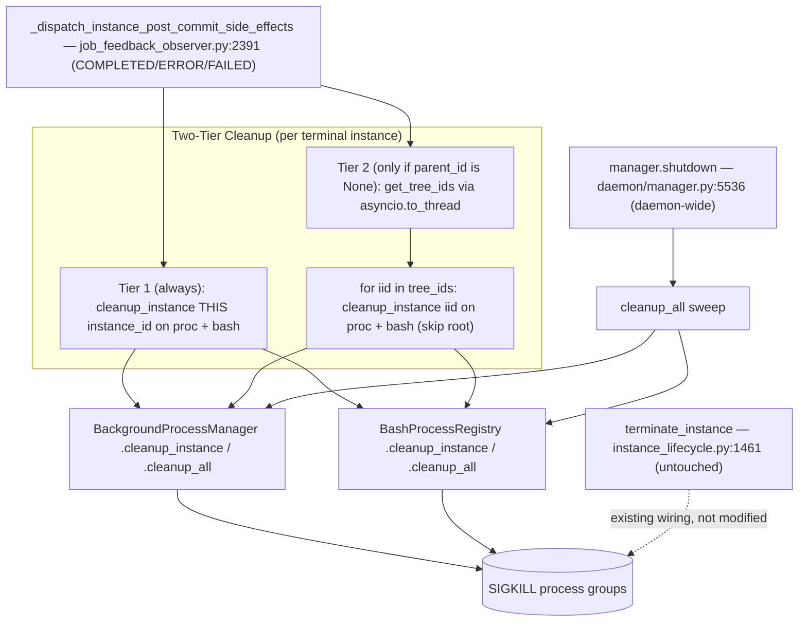

# Plan Overview: Auto-Kill Background Processes on Root Instance Completion

> **Revision 2 (2026-07-18)** — addresses plan review: C1, C2, C3, C4, C5, M2, M3, M5. See [decisions.md](./decisions.md) D10-D12 for new decisions.

## Objective

When a terminal transition occurs, automatically kill background processes spawned by the proc tool and the bash tool:
- **Per instance:** on ANY terminal transition (COMPLETED, ERROR, FAILED, TERMINATED), clean up THAT instance's own processes immediately (Tier 1).
- **Per tree:** when a ROOT instance (parent_id is None) terminates, additionally sweep all descendant instances' processes (Tier 2).
- **On daemon shutdown:** kill ALL tracked processes across all instances.

Ship proc auto-kill first (Phase 1), then bash auto-kill + CancelledError leak fix (Phase 2), then integration tests (Phase 3). **All phases strictly sequential** (D12).

## Scope Assessment

**MEDIUM.** Justification:
- Touches ~7 files across 3 phases
- Purely in-memory process management — NO DB schema, NO migrations, NO new API surface
- Reuses existing primitives (`cleanup_instance`, `get_tree_ids`, `_dispatch_instance_post_commit_side_effects`)
- New code is concentrated: one new small registry class + a tool wrapper + ~6 call-site additions + tests
- 3 terminal paths converge on 1 dispatcher, so the hook surface is narrow
- Bounded by 100-instance limit (registry size is trivial)

## Context

- **Project:** agents-ensemble
- **Working Directory:** `/Users/nguenminhkha/All/Code/opensource-projects/agents-ensemble`
- **Pre-existing cleanup:** `terminate_instance` (instance_lifecycle.py:1461) already does proc cleanup and cascades to children. This plan adds cleanup for the **other three** terminal paths + daemon shutdown + bash tool coverage + CancelledError leak fix.

## Verified Facts (from investigation + opencode + grep spot-check)

| Fact | Location | Status |
|------|----------|--------|
| `BackgroundProcessManager.cleanup_instance(iid)` idempotent, atomic bucket pop | proc_tools.py:997-1085 | ✓ |
| `get_background_process_manager()` singleton accessor | proc_tools.py:1261 | ✓ |
| Processes keyed by individual instance_id (not root) | proc_tools.py:205 | ✓ |
| `get_tree_ids(root_id)` includes root + all descendants; **SYNC method** | repository.py:246 (InstanceRepository) | ✓ (wrap in to_thread) |
| `_dispatch_instance_post_commit_side_effects` receives `instance_id` + `parent_id` | job_feedback_observer.py:2391 | ✓ |
| `JobFeedbackObserver` has NO `self.repository`; has `self._instance_manager` | job_feedback_observer.py | ✓ (M3) |
| Repo access: `self._instance_manager._instance_repository.get_tree_ids(...)` | instance_lifecycle.py:1836 pattern | ✓ |
| `manager.py` path is **`daemon/manager.py`** (NOT services/) | daemon/manager.py | ✓ (C2) |
| `terminate_instance` is the ONLY path with proc cleanup today | instance_lifecycle.py:1461 | ✓ |
| `cleanup_all()` does NOT exist — must be added | proc_tools.py | ✓ (gap) |
| bash `proc.pid` registered nowhere, local-only | bash.py:143/152 | ✓ (gap) |
| `_kill_process` only called on TimeoutError; awaits internally | bash.py:47, 175 | ✓ (C1 leak) |
| `CancelledError` inherits BaseException (not caught by `except Exception`) | bash.py:209 | ✓ (C1 leak) |
| `_make_workdir_aware` wrapper exists, mirror for instance_id | instance.py:406-483 | ✓ (C3 pattern) |
| `create_instance_tools(manager, current_instance_id, ...)` | instance.py:547 | ✓ (instance_id in scope) |
| `manager.shutdown()` does NO proc cleanup | daemon/manager.py:5536 | ✓ (gap) |

## Phase Index

| Phase | Name | Objective | Dependencies | Coupling | Est. Time |
|-------|------|-----------|-------------|----------|-----------|
| 1 | Proc Auto-Kill | Add `cleanup_all()`. Wire two-tier proc cleanup (Tier 1 always + Tier 2 root-gated) into post-commit dispatcher + `manager.shutdown()`. Reuses existing primitive. | None | — | 3-4h |
| 2 | Bash PID Registry + CancelledError Fix | New `BashProcessRegistry`; `_make_instance_id_aware` wrapper; eager PGID capture; fix CancelledError leak (both await points); wire bash into same hook points. | Phase 1 merged | tight (same lines/functions) | 5-6h |
| 3 | Integration Tests & Edge Cases | End-to-end tests: two-tier cleanup, child-then-root ordering, daemon shutdown, cancellation mid-bash, nohup grandchildren, best-effort isolation. | Phase 1, Phase 2 | tight | 3-4h |

**Total estimate: 11-14 hours**

### Coupling Assessment

| Pair | Coupling | Rationale |
|------|----------|-----------|
| Phase 1 → Phase 2 | **tight** | Phase 1 and Phase 2 edit the SAME LINES of the SAME FUNCTIONS (`shutdown()` step list; `_dispatch_instance_post_commit_side_effects` two-tier block). Phase 2 ADDS adjacent lines to Phase 1's code. Merge conflicts guaranteed if parallelized. |
| Phase 2 → Phase 3 | **tight** | Phase 3 exercises both registries together. Tests need both Phase 1 and Phase 2 code to exist. Must wait for Phase 2 to merge. |

**Scheduling (M2):** Phase 1 → (merge) → Phase 2 → (merge) → Phase 3. **Strictly sequential. No parallel work, no pipeline overlap.** See D12.

## Architecture (Target State)

## Risks & Mitigations

| Risk | Impact | Likelihood | Mitigation |
|------|--------|-----------|------------|
| Tier 2 tree sweep kills a sibling's processes prematurely | HIGH | LOW | Tier 2 is strictly gated on `parent_id is None` (root only). A child completing does NOT trigger Tier 2 — it only runs Tier 1 for itself. Sibling procs untouched until the root finalizes. |
| `get_tree_ids` NameError (C4) | MED | ELIMINATED | `tree_ids` initialized to `[]` OUTSIDE the try block. If get_tree_ids raises, Tier 2 loop is a no-op. |
| `get_tree_ids` blocks event loop (M3) | MED | ELIMINATED | `get_tree_ids` is SYNC → wrapped in `asyncio.to_thread()`. |
| `get_tree_ids` race: descendant spawns process after sweep starts | MED | LOW | Best-effort by design. The descendant itself will run Tier 1 when IT finalizes. Also `cleanup_instance` is idempotent. |
| `cleanup_all()` on shutdown kills processes that in-flight tasks still need | MED | MED | Call `cleanup_all()` early in shutdown BEFORE worker pool/event bus teardown. Processes are background (best-effort by definition). Document as intentional. |
| CancelledError fix changes cancellation propagation | HIGH | LOW | The fix cleans up (kill + unregister) then `raise`s CancelledError. Cancellation still propagates — only difference is the subprocess dies. Test thoroughly with pause/cancel flows (Phase 3). |
| `_kill_process` re-raises CancelledError (sticky cancellation, Python 3.11+) | HIGH | MED | Call `task.uncancel()` before `_kill_process` in the CancelledError handler. Belt-and-suspenders: `asyncio.shield(_kill_process(...))`. See D11. |
| `instance_id` not threaded to bash (C3) | HIGH | ELIMINATED | New `_make_instance_id_aware` wrapper mirrors `_make_workdir_aware`. `current_instance_id` already in scope at `create_instance_tools` (instance.py:547). See D10. |
| PGID capture race: process exits between spawn and `os.getpgid` | LOW | MED | Capture PGID synchronously immediately after spawn, before any await. Fall back to `pgid = proc.pid` (start_new_session=True guarantees PGID==PID). See D4. |
| Orphaned nohup grandchildren survive (re-parented to init) | LOW | MED | `start_new_session=True` puts them in the process group, so `killpg` reaches them. Truly detached (`setsid`-in-child) orphans are a known limitation — document. |
| Double cleanup (terminate cascade + finalize) | NONE | HIGH | Both tiers idempotent (atomic bucket pop). Double fire is a benign no-op. |
| `@tool` decorator exposes `instance_id` to LLM | MED | LOW | Add `instance_id` kwarg with `=None` default; verify `@tool` doesn't auto-expose it. If it does, override `args_schema` to exclude. See D10. |

## Key Decisions

See **[decisions.md](./decisions.md)** for full rationale. Summary:

- **D1:** New `BashProcessRegistry` singleton with `_entries: dict[str, list[BashProcessEntry]]` (not extending `BackgroundProcessManager`; field naming M5).
- **D2/D3:** Two-tier cleanup in `_dispatch_instance_post_commit_side_effects` — Tier 1 always (self), Tier 2 root-gated (descendants). Repo via `self._instance_manager._instance_repository` + `to_thread` (M3).
- **D4/D5:** Bash registry stores `BashProcessEntry(pid, pgid)` captured at spawn; register always, unregister only after explicit `_kill_process`.
- **D10:** `_make_instance_id_aware` wrapper mirrors `_make_workdir_aware`; `instance_id` kwarg hidden from LLM (C3).
- **D11:** CancelledError fix covers BOTH await points (spawn + wait_for); `proc=None` sentinel; `uncancel()` + `shield()` in handler (C1).
- **D12:** Phases strictly sequential (M2).

## Success Criteria

- [ ] ANY instance completing (COMPLETED) kills its OWN proc and bash processes immediately (Tier 1).
- [ ] A root instance completing also kills all descendant instances' proc and bash processes (Tier 2).
- [ ] A root instance erroring (ERROR/FAILED) runs Tier 1 + Tier 2.
- [ ] A root instance being terminated (TERMINATED) continues to work via existing `terminate_instance` cascade (no regression).
- [ ] Daemon shutdown (`manager.shutdown()`) kills ALL tracked processes across all instances.
- [ ] Child instance completion does NOT kill sibling processes (Tier 1 only for the child; Tier 2 skipped).
- [ ] bash tool CancelledError (pause/cancel at either await point) no longer leaks the subprocess.
- [ ] All cleanup is best-effort: failures log a WARNING and never block terminal transition or shutdown.
- [ ] All existing tests pass (no regressions in pause/resume/cancel flows).
- [ ] New tests cover: Tier 1 self-cleanup, Tier 2 root sweep, daemon shutdown sweep, cancellation-mid-bash (both await points), no-op-when-empty.

## Tracking

- **Created:** 2026-07-18
- **Last Updated:** 2026-07-18 (Rev 2 — review feedback)
- **Status:** draft (revised)
- **Investigation source:** Wanderer agent investigation + opencode code spot-check + grep verification (all facts verified)
