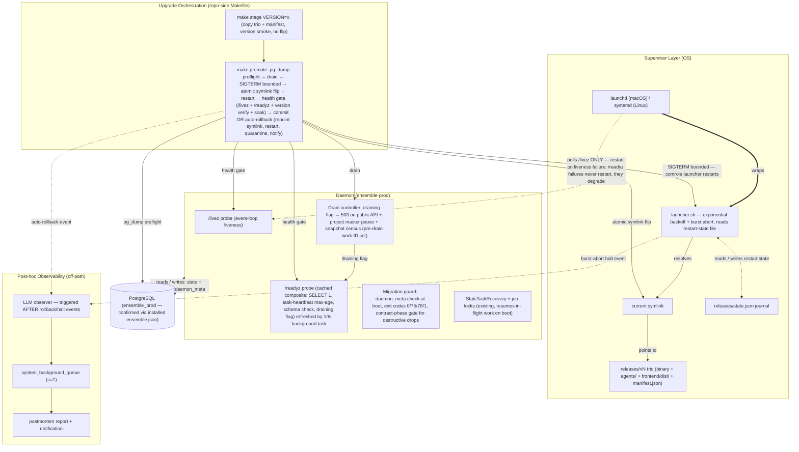

# Auto-Restart / Auto-Upgrade System — Plan Overview

- **Date:** 2026-08-15 · **Amended:** 2026-08-15 (post-review APPROVE-WITH-NOTES, 0 critical / 8 major / 7 minor — findings M1–M8, m1–m8 incorporated; see `decisions.md` ADR-011…013)
- **Status:** PLANNING ONLY — no implementation. Review verdict: APPROVE-WITH-NOTES; all codebase claims independently CONFIRMED by the reviewer.
- **Method:** Architect council (2 councilors: `agentic` + `coding`, skill: `resilience-design`), verified against the tree at v0.10.4 (`005610fe`) and the live prod install dir. Governor: `dde006dc-9438-423a-8480-429d2672412c`.
- **Companion docs:** `decisions.md` (ADR log), `architecture-recommendation.md` (5-axis comparison + recommendation)

---

## 1. Goal & Scope

Give the daemon production-grade crash recovery and safe self-upgrades:

1. External watchdog auto-restart (crash-loop protected)
2. Liveness/readiness health checks with concrete probes and thresholds
3. Atomic release switching (`releases/` + `current` symlink) integrated with `make install`
4. Auto-rollback with anti-flapping
5. Drain-before-upgrade on existing queue-pause infrastructure
6. Guarded DB migrations with a defined downgrade behavior

**Hard requirement:** no LLM in the critical recovery path. Recovery is a deterministic, pure-code control loop. LLM appears only as an off-path, post-hoc observer (§4.6).

**Environment:** single-host, single-binary deployment. macOS prod host today (launchd available), potential Linux deploy (systemd). No k8s. Dev flow (`./dev.sh`, `ensemble_dev`) must not break.

---

## 2. Ground-Truth Corrections (verified — these change the design)

The task framing assumed several things the code contradicts. Both councilors found these **independently**; the reviewer independently **confirmed all claims**, with one size correction (C3: trio is ~55 MB, not 90–150 MB).

| # | Stated assumption | Reality (file:line) | Design consequence |
|---|---|---|---|
| C1 | "6-step graceful shutdown, bounded by `SHUTDOWN_TIMEOUT_S=300`" | Shutdown is 9 steps (`daemon/api.py:807-859`), and `SHUTDOWN_TIMEOUT_S` (`daemon/constants.py:33`) is **dead code — zero consumers**. `daemon/__main__.py:48-54` runs uvicorn without `timeout_graceful_shutdown`. | **Bounded graceful shutdown does not exist today.** A hung shutdown hangs forever. Phase 1 must wire `timeout_graceful_shutdown` — nothing else can rely on graceful stop until then. |
| C2 | "Migrations = ordered checksummed SQL, transactional" | The migration runner is a **deliberate NO-OP on PostgreSQL** (`daemon/migrations/runner.py:458-489`). PG schema comes from `SQLModel.metadata.create_all()` + `EnsembleManager._ensure_postgres_columns` (`daemon/manager.py:446-500`). There is **no schema-version marker**; `schema_migrations` does not describe prod PG state. | The migration guard cannot reuse `schema_migrations`. It needs a new `daemon_meta` table (§4.5). |
| C3 | "Single-file binary releases" | A release payload is **binary + `agents/` + `frontend/dist/` (~55 MB confirmed)** — `make install` re-copies all three (`Makefile:168-175, 186-190`). Today's `.bak` backup preserves the binary alone → **rollback today is version skew** (old binary + new prompts/frontend). Prod dir already shows hand-rolled rollback attempts (3 `.bak` files + `ensemble-prod-recover`). | Releases must be **full-payload trios**, not bare binaries (§4.3). The operator is already compensating manually for this gap. |
| C4 | "Additive/expand-contract migrations" (hard req #7) | **Violated by the codebase today**: boot path runs destructive drops unconditionally — `_ensure_postgres_drop_legacy_columns()` / `_ensure_postgres_drop_admission_legacy()` (`daemon/manager.py:478-500`). | Auto-rollback is **unsafe across any release that drops columns** until the drops move behind a contract-phase gate (§4.5, Risk R1 — load-bearing, not cosmetic). |
| C5 | (implicit) supervisor exists | **No supervisor exists at all** (no ensemble plist; manual `make start`/`start.sh`). Greenfield. | Supervisor choice is unconstrained (§4.1). |
| C6 | Two-level queue pausing | Master pause is enforced at **three** layers: poll skip (`daemon/services/job_processor.py:635-667`), claim-time (`daemon/services/job_queue_service.py:2970-2980`), sync-trigger (`:3815-3840`); plus HTTP endpoints (`daemon/routers/projects.py:447-500, 569, 614`). | Master pause is robust for **stopping dispatch** — but see C7: it does not block public entry points. |
| C7 | Master pause = drain | Master pause stops job **dispatch** only. Public entry points (Job/message creation APIs, `send_message` revive/spawn) keep creating work during a "drain". | Drain needs a dedicated **draining flag on the public API surface** (§4.4) — master pause alone is insufficient. |
| C8 *(review pass)* | Drain 503 middleware covers all intake | **External source adapters bypass HTTP middleware entirely** — Telegram/Discord/Slack/Scheduler enqueue **in-process** via `daemon/sources/registry.py:873`, so the census never empties under external traffic. | Drain census uses a **pre-drain work-ID snapshot** (ADR-013); adapter intake pause is best-effort secondary. |

---

## 3. Architecture Summary

### 3.1 Component Diagram



### 3.2 Component → Codebase Mapping (reuse over rebuild)

| Component | Maps onto (real files/services) | New? |
|---|---|---|
| Supervisor | launchd plist / systemd unit (new artifacts); wraps existing binary launch | New config, no code |
| Launcher (`launcher.sh`) | replaces `start.sh` role for prod; reads `.env` (works around `run_app.py:14,31` env-from-binary-dir subtlety); performs the M2 journal sweep before resolving `current` | New script |
| Health checker | new `/livez` + `/readyz` routes beside existing `/health` (`daemon/api.py:1486-1524`); background composite-refresher task pattern mirrors existing periodic tasks (`daemon/api.py:440`); queue-freshness = max-age over `Task.last_heartbeat_at` (`daemon/repositories/task/models.py:214`) | New routes, small |
| Release manager | Makefile targets + repo-side scripts; journal at `INSTALL_DIR/releases/state.json`; per-release `manifest.json` staged from Phase 2 (ADR-004); reuses `make pyinstaller` unchanged | New targets |
| Drain controller | wraps `job_queue_mgmt_service.py:495-528` (pause/resume) + `routers/projects.py` master-pause endpoints; draining middleware mirrors the existing `WritePauseGuard` router pattern (15 router files); census via `repositories/job_queue/repository.py:528` (`count_active_jobs_by_project`) + `task/repository.py:523` (`has_instance_busy`) against a **pre-drain work-ID snapshot** (ADR-013) | New service, thin |
| Migration guard | new `daemon_meta` table written in `manager.py` boot before any `_ensure_*` (constrained by `daemon/manager.py:446-500` reality, per C2); exit-code contract in `__main__.py` | New, small |
| LLM observer | enqueues on `system_background_queue` (c=1, existing); notifications via existing `NotificationBroadcaster`; history via project-history tooling | New, thin |
| Crash recovery of in-flight work | **already exists**: job locks + `LockManager`, `StaleTaskRecovery` startup sweeps, LangGraph node-boundary checkpoints | Reused as-is |

---

## 4. Component Specifications

### 4.1 Supervisor + Launcher (watchdog)

**Decision (ADR-001/002):** launchd primary (macOS native, PID-1 immortal), systemd unit generated for Linux deploy; **supervisord rejected** (userspace process mortality reintroduces "who watches the watchdog", plus a Python dependency layer on a PyInstaller product).

**Division of labor:**

| Concern | Owner |
|---|---|
| Start at boot, SIGTERM stop, restart-on-nonzero-exit, fixed 10s throttle | Supervisor (launchd `KeepAlive`/`ThrottleInterval` or systemd `Restart=on-failure`) |
| Exponential backoff (e.g. 10s → 20s → 40s → … capped) | Launcher script (launchd has no exponential; putting it in the launcher keeps behavior identical on systemd) |
| Burst abort: >5 restarts within 10 min → halt, stay down, notify | Launcher (crash-loop protection) |
| Restart policy source | `/livez` ONLY. **Never restart on readiness failure** — restarting a healthy process because its DB is down is the classic crash-loop anti-pattern. |

**Exit-code contract (ADR-010, amended):** `0` = clean stop (supervisor may restart per its own at-boot policy); `75` = **boot-time temporary failure** (PG unreachable at boot — EX_TEMPFAIL; launcher backs off capped and does **not** decrement the burst budget — ADR-011); `78` = configuration/schema refusal (boot found DB newer than binary can safely run, or fatal config) — **supervisor must NOT loop on 78**; `1` = crash (restart with backoff). Additionally, **the burst budget resets after sustained uptime** (≥10 min continuous → counter to zero — ADR-011), so flaky-crash sequences don't accumulate into a false abort.

**Supervisor-agnostic portability:** the *contract* is (a) the launcher script, (b) `/livez` + `/readyz` semantics, (c) the exit-code table. Swapping launchd→systemd is a config-file change; a future k8s migration maps the same endpoints onto liveness/readiness probes 1:1.

**Env subtlety (verified):** `run_app.py:14` loads `.env` from the *binary's* directory, and `run_app.py:31` only sets *unset* vars. The launcher must `cd INSTALL_DIR` and export `.env` itself so `config.yaml`, `.env`, and `data/` (which stay **outside** `releases/`) resolve correctly regardless of which release the symlink points at. **Invariant (m6):** a release directory must **never** contain an `.env` — a stale per-release `.env` would silently shadow the canonical one because `run_app.py:14` loads from the binary's dir. `make stage` explicitly excludes it. launchd also has no shell/TTY — all paths in the plist must be absolute.

**Canonical port (M6):** the Makefile's existing port sed is **already silently broken** — `Makefile:181` seds `${PORT:-8079}` but `daemon/config.yaml:50` defaults to **8088**, and prod actually runs **8088** (the sed no-ops against the real default). Phase 1 folds the fix in: launcher + plist pin the canonical health URL to **8088**, the broken sed is fixed or removed. **8088 is treated as canonical pending user confirmation** — OQ1 remains open, with this evidence strengthening the 8088 case.

### 4.2 Health Checker

**Decision (ADR-003):** add `/livez` + `/readyz`; keep `/health` as the human-facing enriched endpoint (today's `/health` returns `status="healthy"` unconditionally — it cannot gate anything).

| Probe | Checks | Cost | Consumer / action |
|---|---|---|---|
| `/livez` | Event loop answers (handler runs); optional 5s heartbeat-staleness check (catches live-but-starved) | O(1) | Supervisor/launcher → restart. Poll every 5–10s. |
| `/readyz` | **Cached composite**, refreshed by a 10s background task: `SELECT 1` on PG (500ms timeout), **queue-freshness = max-age over `Task.last_heartbeat_at`** (`repositories/task/models.py:214`; see M7 note), critical bus-started flags, schema check, draining flag | Handler = O(1) memory read | `make promote` health gate → rollback decision; LB/clients → back off. **Never restarts.** |
| `/health` (existing, enriched) | Human detail + degraded-reason list | Moderate | Dashboard/human only |

**M7 note (queue-freshness signal):** there is **no job-processor heartbeat today** (zero refs in `job_processor.py`). The design defines the readiness component as **max-age over `Task.last_heartbeat_at`** (existing column, `models.py:214`), computed inside the 10s background refresher, with "no active tasks = fresh" as the empty-case. **Verify-at-implementation:** if the column's stamping cadence proves too sparse to distinguish "processing" from "stalled," fall back to a NEW lightweight heartbeat timestamp maintained by the job-processor poll loop (small Phase-1 addition) — flagged in §10.

**Requirement #3 mapping (M8):** *"N consecutive failures → action"* is realized as — **`/livez` failures → launcher backoff + burst-budget restart (the restart action)**; **`/readyz` failures → never a restart** — degrade (503 + banner) + notify, and, within the post-upgrade window only, **auto-rollback** (ADR-005).

The readiness cache pattern is what keeps probes cheap (constraint: no DB-heavy queries per probe — the DB is touched once per 10s in the background, not per request).

`/readyz` returns `draining: true` + `Retry-After` while drain mode is active (§4.4), so an upgrade in progress is *communicated*, not guessed from timeouts.

### 4.3 Release Manager (atomic version switching)

**Decision (ADR-004):** full-payload release trios under `INSTALL_DIR/releases/`:

```
INSTALL_DIR/
├── releases/
│   ├── v0.10.5/            # binary + agents/ + frontend/dist/ + manifest.json  (~55 MB)
│   ├── v0.10.4/
│   ├── state.json           # upgrade journal (atomic write)
│   └── rollback.lock        # serialize rollback vs. promote (owner PID + heartbeat; stale-breakable)
├── current -> releases/v0.10.5   # symlink; flipped via rename(2) — atomic on macOS+Linux
├── config.yaml, .env, data/      # OUTSIDE releases/ — survive every flip; NEVER inside a release dir (m6)
└── launcher.sh, ensemble.plist
```

- **Why trios, not bare binaries:** rollback must restore the *coherent* payload — old binary + new `agents/` prompts is version skew (correction C3; the operator's hand-kept `ensemble-prod-recover` is evidence this is already needed).
- **Release manifest (M5, from Phase 2 onward):** each staged release carries `manifest.json` — `binary_version`, `known_schema_gen`, `contains_contract_phase` (destructive drops?), `rollback_safe` (derived boolean), trio checksums. This is what makes the Phase-3 rollback gate implementable **without** waiting for `daemon_meta` (Phase 5): auto-rollback targets the previous release only if its manifest says `rollback_safe: true`; otherwise halt-for-human + notify.
- **Symlink flip via `rename(2)`** is atomic: a crash mid-flip leaves old-or-new, never a missing target. The launcher reads `current`/journal fresh on every exec.
- **Journal (`state.json`)**: current version, previous version, in-flight transaction state (with started-at timestamp), rollback counters, quarantined versions. Atomic-write discipline (temp + rename).
- **Journal sweep — the orphaned-transaction owner (M2, ADR-012):** at **launcher start, before resolving `current`**, the launcher reads the journal: if a transaction is `in-flight` and older than the rollback window (10 min), the launcher **executes the rollback itself** (repoint `current` to `previous`, restart, notify) — or, if the flip never happened, clears the transaction and continues. This guarantees no stuck promote leaves the daemon degraded forever, and it runs even when the daemon itself is the thing that died. The daemon performs the same sweep at boot as belt-and-braces; the version-independent stuck-drain marker (§4.4) is released alongside.
- **Retention & eviction (m7):** keep 3 releases (~165 MB). **Eviction order: oldest release that is neither `current` nor the journal's `previous`** — the rollback target is pinned and can never be evicted out from under a pending rollback. If the previous release is somehow missing anyway (manual deletion), auto-rollback halts-for-human + notifies instead of flipping into nothing.
- **`rollback.lock` recovery (m7):** the lock records owner PID + a refreshed heartbeat timestamp; a lock whose heartbeat is stale (>5 min) is safe to break. Promote/rollback acquire it with a bounded wait, never block forever on a dead owner.
- **Post-flip version verify** closes the "flip succeeded but old process still running" race.

### 4.4 Drain Controller (drain-before-upgrade)

**Decision (ADR-006 + ADR-013):**

1. **Block new work** — a dedicated `draining` flag on the **public API surface**: public entry points (Job/message creation, `send_message` spawn/revive) return `503 + Retry-After`. Implemented as middleware mirroring the existing `WritePauseGuard` router pattern. **Do NOT reuse `pause_writes`** — `WriteGuardSession` consults the write-pause guard for *internal* sessions too (`daemon/manager.py:368-371`), and a long API-surface drain would starve in-flight job finalization (Risk R2).
2. **Drain existing work** — set `job_queue_paused` master pause per project (all three enforcement layers, per C6) + poll the in-flight census (`count_active_jobs_by_project`, `job_queue/repository.py:528`; `has_instance_busy`, `task/repository.py:523`) with a **bounded wait, default 120s**. **No per-instance `pause_instance_cascade` in the automated path** — instance cascades risk tripping the known Task↔JobItem reconciliation gap on resume; per-instance clean quiesce is an operator-requested option only.
3. **External-source intake (M4, ADR-013):** source adapters (Telegram/Discord/Slack/Scheduler) enqueue **in-process** (`daemon/sources/registry.py:873`) and never traverse the HTTP drain middleware — so the census can never empty under live external traffic. **Primary fix: the census is taken against a pre-drain work-ID snapshot** — drain is complete when every work ID present at drain-start is terminal; arrivals *after* the snapshot are simply interrupted at stop and resume from checkpoints post-upgrade (exactly the courtesy-framing recovery). **Secondary (best-effort):** adapters that can cheaply defer intake during drain (poll-based Telegram/Slack) do so via the existing adapter-supervisor pause; Discord gateway buffering is not worth building — snapshot census covers it.
4. **Stuck-marker recovery** — the drain state is recorded in a boot-readable marker whose format is **version-independent**, so a rolled-back older binary can also release it. Boot checks for the marker and unpauses master-paused projects if an orchestrator died mid-upgrade.

**Key reframing (council consensus, reviewer-endorsed):** **drain is a courtesy, not correctness.** Job locks, LangGraph node-boundary checkpoints, and `StaleTaskRecovery` already make a hard kill recoverable — in-flight turns freeze at the last committed node boundary and resume on boot. This removes most drain-timeout stress: when the bounded wait expires, the upgrade **proceeds** with graceful stop rather than blocking.

### 4.5 Migration Guard

**Decision (ADR-007):** given correction C2 (SQL migration runner no-ops on PG; no version marker), the guard is built on a new tiny table, not `schema_migrations`:

- **`daemon_meta`**: `binary_version`, `schema_gen` (monotonic integer the daemon bumps when it introduces a new schema generation), `contract_phases_applied` (list). Written **before** any `_ensure_*` runs at boot.
- **Boot-time check:** if DB `schema_gen` > the binary's known max gen (**downgrade case**):
  - No contract phase was applied on the newer version → **warn + proceed** (expanded-only schema is backward-compatible);
  - A contract phase (destructive drop) ran → **refuse to boot, exit 78** with an operator-facing message ("restore from snapshot or upgrade the binary").
- **Contract-phase gating (load-bearing, Risk R1):** the existing unconditional destructive drops (`manager.py:478-500`) move behind a gate that runs **only after the new version passes its health gate** — post-soak, in the promote flow, not at every boot. Until a release's contract phase has run, rolling back across it is *blocked* and the journal escalates to a human.
- **Rollback gating at Phase 3 (M5):** the manifest's `rollback_safe` flag (§4.3) enforces the block until `daemon_meta` lands in Phase 5 — same rule, two enforcement layers, no Phase-3 dependency on Phase-5 state.
- **Pre-upgrade snapshot:** `pg_dump` taken by the orchestrator (`make promote` preflight) with its own timeout and skip option; retention 2. **Prod DB confirmed PostgreSQL** (installed `ensemble.json`, reviewer-verified) — pg_dump form is settled (OQ6 resolved).
- **Policy going forward:** additive/expand-contract only — new columns via `_ensure_postgres_columns()` (PG-correct path), drops deferred to a contract phase gated on health.

### 4.6 LLM Observer (strictly off-path)

**Decision (ADR-008):** LLM participates **never** in restart/rollback/health decisions. It observes:

- Journal transitions (`state.json` history), daemon log tail, `daemon_meta` transitions.
- **Triggered only after terminal events** — rollback executed, burst abort, repeated failed gates — and only **after `/readyz` is green**.
- Enqueued on `system_background_queue` (c=1 — the never-urgent lane); a low-frequency launchd agent retries the enqueue if the daemon is down. **That same agent doubles as the watchdog-watcher (m3):** it checks `/livez` and notifies if the daemon has been absent >10 min (covers supervisor misconfiguration — e.g. an unloaded plist).
- **Outputs:** postmortem markdown, project-history entry, SSE notification via the existing `NotificationBroadcaster`; repeat-signature detection (same exit signature ≥2×) → critical note.

### 4.7 PM v0.10.4 Bug Assessment (asked explicitly)

**Would the health checks have caught "PM binds with zero `plane_*` tools"? No.** It is a capability regression, not a liveness/readiness failure — PM was up, DB reachable, queues processing.

Root-cause hypothesis (councilor `agentic`, **unverified at the exact spawn-time binding site**): `daemon/tools/plane_tools.py` declares a category with zero `@tool`s; `plane_*` dynamic renames fall outside both category expansion and `mcp_`-prefix dynamic expansion (`daemon/tools/instance.py:289-296`, `mcp_service.py:746-756, 954-963`); the `tool_count==0` signal already logs at `mcp_service.py:551`.

**Fix-class adopted:** a **capability smoke test in the upgrade health gate** (not `/readyz`): post-promote, assert "declared `mcp_full_access` namespaces ⇒ non-empty resolved tool surface" (~30–60s, once per upgrade). Optionally as a steady-state invariant: an MCP server with env configured but `tool_count==0` fails a readiness component (fail-closed on config). This is Phase 5 scope.

---

## 5. `make install` Integration

**Decision (ADR-009):** the Makefile gains `stage` / `promote` / `rollback`; `install` becomes an alias for `stage` + `promote` (back-compat for muscle memory).

```
make pyinstaller                          # unchanged
make stage  VERSION=x                     # copy trio + manifest.json into releases/x/, run --version smoke test, NO flip
make promote VERSION=x                    # the gated upgrade (below)
make rollback                             # manual repoint + restart (seconds)
```

**`make promote` sequence (end-state; phase annotations per §7):**

1. Preflight: `pg_dump` snapshot (timeout + skip option), verify staged release + manifest exists + version smoke passed
2. **[drain — ships Phase 4]**: set draining flag → master pause → snapshot census poll (bounded, default 120s) → proceed on timeout
3. Stop: **SIGTERM + bounded wait** (replaces `kill -9` at `Makefile:106` — the single most damaging line today; the dead `SHUTDOWN_TIMEOUT_S` finally gets a consumer via uvicorn `timeout_graceful_shutdown`); SIGKILL only as last resort (recovery-equivalent to a crash, which the system now handles)
4. Flip: atomic `current` symlink rename → restart via launcher (launcher journal sweep runs first, §4.3)
5. Health gate: `/livez` answers ≤60s → `/readyz` green ≤120–180s → **version verify** → 300s stability soak
6. Commit or auto-rollback: gate pass → journal commit (+ optionally schedule contract phase, §4.5); gate fail → **manifest gate first** (previous release `rollback_safe: true`?) → repoint `current` to previous → restart → notify → quarantine failed version → cooldown (10 min) → max rollbacks (3/24h, then halt-for-human — ADR-005). Manifest says unsafe / previous evicted → **halt-for-human + notify** (never a blind flip).

**Phase note (M3):** the drain step (2) ships in **Phase 4**; **Phase 3 promotes drain-free** — bounded SIGTERM stop only, with in-flight work resuming from node-boundary checkpoints (safe under the courtesy framing). No ordering contradiction: the flip/gate/rollback machinery never *depends* on drain.

**`ensure-latest` decoupling:** `make build` keeps `ensure-latest` for interactive dev; release staging installs **what was built** — `stage` takes an explicit `VERSION` and fails if not at that tag.

**Port fix (M6):** folded into Phase 1 — the Makefile's broken sed (`Makefile:181` targets `${PORT:-8079}` while `config.yaml:50` defaults 8088 and prod runs 8088) is fixed or removed; launcher + plist pin **8088** as canonical pending user confirmation (OQ1).

**Dev flow untouched:** `./dev.sh` (port 8079, `ensemble_dev`, runs from source) never touches `releases/` or the launcher — releases + launcher are prod-only.

---

## 6. Failure Scenario Matrix

| Scenario | Detection | Action | Recovery | User sees |
|---|---|---|---|---|
| **Crash loop** | Launcher restart-state budget (>5 restarts/10 min) | Abort burst, stay down, notify | Auto-rollback if journal shows recent upgrade; else stay-down + await operator | Brief outage; clear "halted"/"rolled back" notification, not silent flapping |
| **Crash loop × DB-down-at-boot (M1 interaction)** | Boot exits **75** (PG unreachable at boot) — distinct from exit 1 | Launcher backs off (capped, e.g. ≤60s) **without decrementing the burst budget**; one-time notify | PG returns → next boot proceeds → budget resets after ≥10 min sustained uptime | Delayed startup through a PG outage; daemon comes back when PG does — **never permanently down after PG recovers** |
| **Failed migration at boot** | Boot exits ≠0 (crash) or 78 (refuse) | Supervisor restarts w/ backoff (exit 1) or does NOT loop (exit 78) | Additive case: previous release runs fine on expanded schema (seconds). Contract-phase case: rollback **refuses**; human restores `pg_dump` | Explicit refuse message w/ restore instructions — never silent data-risk |
| **Health-check timeout post-upgrade** | Promote gate: `/readyz` not green within 120–180s, or soak failure | Manifest gate → flip back to previous + restart + notify + quarantine + cooldown + rollback counters | Previous release resumes; in-flight work resumes from checkpoints | Seconds-to-minutes outage, then "upgrade failed → rolled back to vX" |
| **Orchestrator (promote) dies mid-upgrade — orphaned txn (M2)** | **Launcher-start journal sweep**: in-flight txn older than 10-min rollback window (daemon boot sweeps too) | Launcher executes the rollback (or clears a pre-flip txn) + notify + escalate | Daemon never runs degraded-forever on a stuck transaction; `current` resolves to a committed release | Possibly one extra restart cycle; notification explains the auto-rollback |
| **Watchdog (supervisor) dies** | launchd/systemd are PID-1 children of init — death not a real scenario; **supervisor *misconfiguration*** (unloaded plist, typo) → daemon absent | **Watchdog-watcher agent** (low-freq launchd agent, §4.6) detects daemon absent >10 min → notify with hint | Operator reloads/fixes plist | Notification "daemon absent 10+ min — check launchd config" instead of silent nothing |
| **Symlink flip mid-crash** | Atomic `rename(2)` + launcher reads `current`/journal fresh per exec + post-flip version verify | Old-or-new, never missing | Version verify catches "flip ok, old process running" | At worst one restart cycle |
| **DB down at boot** | Daemon detects PG unreachable during boot connection step → exits **75** | **Launcher-driven capped backoff** (no unplanned in-process retry loop — m5); budget untouched | PG returns → successful boot | Delayed startup, then normal; no crash-loop thrash |
| **DB down while running** | `/readyz` 503 (cached `SELECT 1` fails) | **No restart** — readiness never restarts (ADR-003) | DB returns → composite refresher flips ready | Degraded UI banner; jobs wait; process stays up |
| **Partial drain timeout** | Snapshot census not empty at bounded wait | Proceed with graceful stop anyway (drain = courtesy, §4.4) | In-flight turns freeze at node-boundary checkpoints; `StaleTaskRecovery` + `recover_stale_job_locks` resume on boot | Upgrade proceeds; affected jobs resume mid-turn |
| **External traffic during drain (M4)** | Census taken against **pre-drain work-ID snapshot** (adapters enqueue in-process, bypass 503) | Post-snapshot arrivals are interrupted at stop, resume from checkpoints; best-effort adapter intake pause where supported | Same checkpoint recovery as any stop | No message loss; late external messages resume post-upgrade |
| **Orchestrator dies mid-upgrade (stuck drain marker)** | Boot-time marker check | New binary releases marker, unpauses master-paused projects | Marker format version-independent → a rolled-back **older** binary can also release it | Queues un-stuck automatically on next boot |
| **Auto-rollback's own failure (m7)** | Previous release evicted (should be impossible — eviction pins `previous`) or stale `rollback.lock` | Lock stale >5 min → safe break; previous missing → **halt-for-human + notify** | Manual `make rollback` or restore-from-snapshot path with clear message | Explicit "cannot auto-rollback safely" notification — never a blind flip |
| **Shutdown hang** | `timeout_graceful_shutdown` bound (new in Phase 1) | Bounded exit; SIGKILL last resort | Equivalent-to-crash recovery (checkpoints) | One restart cycle, never an infinite hang |

---

## 7. Phased Implementation Plan

Each phase is independently shippable. **Phase 1 = "never stays down"** (crash → auto-restart in seconds, loop-safe incl. the DB-down-at-boot case, bounded shutdown, real probes, canonical port fixed).

| Phase | Contents | Effort | Standalone value |
|---|---|---|---|
| **1. Never stays down** | `/livez` + `/readyz` (cached composite; queue-freshness via `Task.last_heartbeat_at`, verify cadence — M7); bounded SIGTERM shutdown (`timeout_graceful_shutdown` — fixes C1); `launcher.sh` w/ backoff + burst abort + exit-code mapping **0/75/78/1 (ADR-011)**; launchd plist; **port fix: pin 8088, fix/remove broken Makefile sed (M6)**; watchdog-watcher agent (m3) | ~2–3 days | Crash → auto-restart in seconds, loop-safe, PG-outage-safe; hung shutdown impossible |
| **2. Release layout** | `releases/<ver>/` trios + `manifest.json` per release (**M5** — from this phase on) + `current` symlink + `state.json` journal + `rollback.lock` (PID+heartbeat, stale-breakable); `make stage` / `make rollback` (manual); retention with `previous`-pinned eviction; retire `.bak` scheme; **staging never writes `.env` into a release dir (m6)** | ~2 days | Real, seconds-fast manual rollback of a coherent payload |
| **3. Health-gated flip (drain-free — M3)** | `make promote` (preflight → **SIGTERM bounded → flip → gate → commit/rollback**; drain step deferred to Phase 4); auto-rollback + quarantine + cooldown + counters; **rollback gated on previous manifest `rollback_safe` (M5)**; launcher journal sweep (M2/ADR-012); notify | ~3–4 days | One-command safe upgrades with automatic rollback |
| **4. Drain controller + contract-phase gate** | In-daemon draining flag + 503 middleware; master-pause orchestration + **snapshot census (ADR-013)** + adapter best-effort intake pause; stuck-marker release; **move destructive drops behind health-gated contract phase (R1)**; drain steps slot into `make promote` | ~2–3 days | Zero-work-loss upgrades; rollback becomes safe across drop-releases |
| **5. Migration guard + capability smoke test** | `daemon_meta` + boot check + exit 78 downgrade policy; `pg_dump` preflight; `mcp_full_access` tool-surface smoke test in gate (PM-bug class); manifest gate superseded by `daemon_meta` | ~2–3 days | Downgrade safety + catches capability regressions like v0.10.4 |
| **6. LLM observer** | Post-hoc postmortems on `system_background_queue`; notification + history integration; repeat-signature detection | ~1–2 days | Automated root-cause narratives, zero recovery-path risk |

**Dependency notes:** Phase 3's rollback promise is enforced via the **Phase-2 manifest** (no Phase-5 dependency — M5). Phase 3 promotes **drain-free** (safe under courtesy framing); Phase 4 inserts drain (M3). Phase 4's contract-phase gate (R1) is what makes rollback *fully* safe across drop-releases; until then the manifest blocks rollback across such releases.

---

## 8. Risks

- 🔴 **R1 — Destructive boot-time drops break rollback today** (`manager.py:478-500`, correction C4). Resolution: contract-phase gate (Phase 4) + manifest `rollback_safe` block (Phase 2/3). Load-bearing, not cosmetic.
- 🔴 **R2 — `pause_writes` reuse hazard**: `WriteGuardSession` consults the write-pause guard for internal sessions (`daemon/manager.py:368-371`). Mitigation: dedicated `draining` flag (ADR-006). Verify `WriteGuardSession` internal-session semantics before Phase 4.
- 🟡 **R3 — launchd environment differences**: no shell/TTY; absolute paths; `.env` handling per §4.1 + never-in-release-dir invariant (m6).
- 🟡 **R4 — Drain × Task↔JobItem reconciliation gap** (known project issue): automated drain avoids per-instance cascades entirely.
- 🟡 **R5 — `pg_dump` cost** on large DBs: own timeout + skip option; retention 2.
- 🟡 **R9 (M4) — External adapters bypass drain middleware**: mitigated by snapshot census (ADR-013); residual risk = post-snapshot arrivals are interrupted (recoverable, but not drained) — accepted under courtesy framing.
- 🟢 **R6 — macOS quarantine xattr** on staged binaries: clear in staging script.
- 🟢 **R7 — `ensure-latest` reproducibility**: solved by explicit-VERSION staging; needs user sign-off.
- 🟢 **R8 — Single-host shared fate**: host outage out of scope — this design protects against *process* death, not host death.

---

## 9. Open Questions (for the user)

1. **Canonical prod port** — evidence now **strongly favors 8088** (config default + actual prod runtime agree; only the broken sed disagrees — M6). Confirm 8088 so launcher/plist health URLs can be finalized (Phase 1).
2. **Rollback soak window X** — council recommends ~10 min; semantic bugs (PM-style) may not surface in *any* boot-time soak — the capability smoke test (Phase 5) is the actual mitigation.
3. **Notify channel** for rollback/halt events — reuse `NotificationBroadcaster` (SSE, daemon-must-be-up) vs. add an external webhook (works when daemon is down)?
4. **Capability-probe failure policy** — boot-refuse (hard, fail-closed) vs. degraded-banner (soft)? Council leans hard for gate-time, soft for steady-state.
5. **Max auto-rollbacks** — 3/24h (council default) vs. 1-then-halt (more conservative)?
6. ~~Confirm prod DB backend~~ — **RESOLVED (m4):** installed `ensemble.json` selects PostgreSQL; pg_dump form settled.
7. **Retire `ensemble-prod-recover`?** The journal's previous-release pointer subsumes it.
8. **`ensure-latest` demotion sign-off** — release builds install what was built; interactive dev keeps the current behavior.

---

## 10. Unverified Items (honesty ledger — updated post-review)

- Exact spawn-time site where the empty `plane` allow-set materializes (PM bug; hypothesis in §4.7).
- uvicorn's internal SIGTERM bound behavior (verify when wiring `timeout_graceful_shutdown`).
- `Task.last_heartbeat_at` **stamping cadence** (M7): sufficient to distinguish processing vs. stalled? If not, add a lightweight job-processor heartbeat in Phase 1 (fallback defined in §4.2).
- `WriteGuardSession` internal-session semantics (`manager.py:368-371`) — verify before Phase 4 (R2).

**Resolved by review (m4):** all five reserved-queue concurrency values exist in code (`job_queue_mgmt_service.py:62-68`); prod `ensemble.json` = PostgreSQL. Removed from this ledger.
