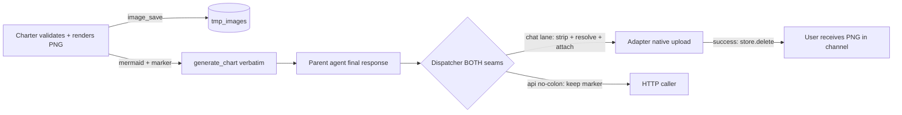

# Chart-Image-Delivery — Plan Overview

**Date:** 2026-10-04 (revised R2 — architecture fold-in, revision loop 2 of 3)
**Commission:** `chart-image-delivery` on branch `feature/chart-image-delivery` (base `latest` @ `cf8efbeff9d932a6d01d7cbb2411836057e7b099`), repo `/home/nea/ensemble-src`, project `agents-ensemble`
**Synthesized by:** planner[v2] from four plan-creation worker outputs (A `6b312cbf`, B `798d2451`, C `8ef85540`, D `e074b8e8`), revised per the architectural review
**Status:** Draft R2 — all 22 amendments from `architecture-recommendation.md` folded into phase plans + decisions (reviewer R1–R9 + optionals applied)

> **Precedence:** `architecture-recommendation.md` §3 governs over phase-plan prose on conflict.

> This overview indexes and synthesizes the worker-authored plans. Phase detail, task lists, and acceptance criteria live in the per-phase files; cross-cutting contracts live in `decisions.md` (Phase A sections LOCKED except two reviewer-ordered corrections; §phase-b-r2-addendum-* and §phase-d-* records appended in R2).

---

## Mission

When an agent generates a Mermaid chart for a user on a chat channel, the user must receive the **rendered PNG in the channel** (Discord first; Slack + Telegram same mechanism) instead of a wall of Mermaid code.

**Primary acceptance (the user story):** *A Discord user asks the agent for a workflow chart → the agent calls `generate_chart()` → the user receives the rendered PNG as a Discord attachment with the (marker-stripped) explanation text — verified via the **real-astream-lane e2e** (`phaseD-plan.md` Group 7: `test_astream_discord_user_receives_png`, driving `instance_messaging.py:4506-4566`/`:4815-4834`, NOT a mocked dispatcher seam) AND a manual real-platform smoke.*

## User Directives (fixed constraints — do not re-litigate)

| # | Directive | Where operationalized |
|---|-----------|----------------------|
| D1 | Charter MAY self-install its render toolchain (install-opendesign pattern): idempotent, fenced — NO Docker, NO system packages, Node/nvm user-space | phaseA-plan §4 — **hybrid executor** (amdt #18): ari/commissioner deploy-step pre-warm + charter flock-guarded self-heal + `install-mermaid-cli.lib.sh` 4-signal READINESS_PROBE (amdt #17) |
| D2 | LOCAL headless render is FINAL; external render services OFF the table | decisions.md §D2; local mmdc+puppeteer+chromium only |
| D3 | tmp_images substrate ONLY; `feature="chart-render"`, `retention_class="normal"`; sweep code-verified | decisions.md §D3 (hourly / 30-day / always-on / protected-exempt, cited) |
| D4 | Per-platform NATIVE delivery; internal transport generic/source-agnostic; verify CURRENT platform docs at impl | phaseB-plan (both-seam extraction + 3 adapters); §phase-b-doc-verification |

## Architecture (the whole feature in one flow — R2-amended)



Charter renders the PNG **at validation time** (sandboxed: `securityLevel:strict`, `htmlLabels:false`, directive sanitizer, `ulimit -v` + `timeout 60` — amdt #15) and persists via `image_save`; it appends the canonical marker `<!-- ens-img:chart-render:<32-hex> -->` (LOCKED regex `^<!-- ens-img:chart-render:[a-f0-9]{32} -->$`, decisions.md §marker) only after a valid `image_save` result (amdt #19). `generate_chart` passes through verbatim (chart_tools.py:525 — unchanged). **Extraction runs at BOTH dispatch seams** (`dispatch_message` AND `dispatch_completed`) as the LAST transform before `OutgoingMessage`, after the no-colon skip + adapter lookup (arch-rec §1 pin — the R1 fix; chat finals normally ride the progressive lane). API-origin (no-colon) sources keep the marker verbatim (30-day GET); internal colon-sources return at the adapter lookup. Resolution uses `store.open_full` with a **provenance gate** (`feature == "chart-render"`, amdt #13) and per-id isolation + first-occurrence dedupe (#2/#3). The HTML-comment marker is **NOT invisible** — it renders literally on all three clients; the dispatcher strip + the near-miss strip-only sweeper (#14) are what keep it out of user eyes. Adapters deliver natively (Discord `files=[…]` atomic first unit; Telegram `sendPhoto`/`sendDocument` multipart with 4xx non-transient classification; Slack single `files_upload_v2` with missing_scope classified BEFORE breaker recording + per-token capability flag) with multi-image order-preserving, no silent drops, WARN-on-drop (#6/#7). **Successful chat delivery deletes the store entry** (amdt #22 ADOPTED). **Every failure rung degrades to text-only Mermaid delivery.**

## Phase Map (R2)

| Phase | Objective | Plan file (size) | Restart/Promote |
|-------|-----------|------------------|-----------------|
| **A** | Render+capture, marker contract, D1 install skill + lib.sh probe, hybrid executor, security pins; +R6 ari pre-warm ownership (context.md + ari/workflow.md) | `phaseA-plan.md` (538 ln; T17–T24 appended) | **NO** (10 files, all agent-prompt/bash) |
| **B** | Delivery: **both-seam extraction**, provenance gate, breaker guardrails, multi-image, empty-content guard, store.delete-after-upload, logging redaction, sweeper | `phaseB-plan.md` (1202 ln) | **YES + promote** (daemon code) |
| **C** | Agent guidance: chart-skill "Chat Delivery" + cardinal refs in **20** chart-capable agents (verified list) | `phaseC-plan.md` (285 ln) | **NO** |
| **D** | Consolidation: **24-pin audit (PRESERVATION vs FEATURE classes, D.0 pre-baseline gate)**, **8 e2e groups incl. real-astream Group 7 + store.delete Group 8**, version 0.16.12→0.16.13, CHANGELOG, release report w/ adopted-items ledger | `phaseD-plan.md` (430 ln) | Gates release cut + promote |

**Sequencing (unchanged, arch-rec Focus 6 confirmed):** A ∥ C → B → D. Instance budget ≤ 3 concurrent holds.

## Key Decisions (pointers — full text in decisions.md, 866 ln)

- **§marker** (LOCKED) — canonical marker; malformed markers ignored; near-miss sweeper (#14) strips-but-never-extracts.
- **§phase-b-r2-addendum-1** — **BOTH-SEAM extraction pin (NON-NEGOTIABLE, arch-rec §1 verbatim)**; images populated at dispatcher.py:170 AND :243, never registry.py:980; once-only structural via `_progressive_sent_sources`.
- **R3 in-place correction ledger (approver iteration-001)** — decisions.md :286 + :292-299 (single-seam residue in §phase-b-outgoing-extension + §phase-b-marker-extraction) corrected to the both-seam rule; recorded in addendum-1's Supersedes line.
- **§phase-b-r2-addendum-2/3/4** — invisibility-claim correction (reviewer-ordered in-place edit at :95), logging contract (`bytes_b64` repr-redacted; `image_id[:8]`+size+MIME only), provenance gate + optional 24h freshness.
- **§phase-b-r2-addendum-5/6** — MANDATORY breaker guardrails (Slack classify-before-record + capability flag; Telegram 4xx non-transient).
- **§phase-b-r2-addendum-9** — amendment #22 ADOPTED: `store.delete` after successful chat upload (API path keeps 30-day GET).
- **§phase-d-test-matrix** — 24 pins split PRESERVATION/FEATURE; pin #6 INVERTED (both-seam); pin #24 Ari pre-warm; content-addressable greps throughout.
- **§phase-d-adopted-items / §phase-d-deferred-items** — adopted ledger (store.delete) + 4 deferred items + ACCEPTED RESIDUAL stale-real-id (~1–3%, revisit trigger: strip-rate >10% post-Phase-C or user report).
- Reviewer-ordered in-place corrections at decisions.md **:95** (marker not invisible) and **:321** (both-seam prose) — recorded as exceptions to append-only in the addenda.

## USER ACTION ITEMS (operator-side, non-blocking for ship)

1. **Slack `files:write` scope** — grant + reinstall (api.slack.com/apps → OAuth & Permissions → Bot Token Scopes → `files:write` → save → reinstall → restart daemon if needed). Until granted: capability-flagged text-only with WARN-once per channel and **zero API calls** once flagged. Parity: Discord 403 WARN-once (F8).
2. **Restart + promote** required for Phase B daemon code (one restart + one promote for the feature). Post-deploy: `tools/audit-chart-image-delivery.sh` against live daemon.
3. **Ari pre-warm** is now an owned Phase A deliverable (deploy-step expectation in `.agents/shared/context.md` + ari commissioning workflow) — pin #24 asserts it.

## Implementation Notes / Reconciliations (R2 state)

1. ~~Phase B code-sketch vs pin #5~~ — **RESOLVED by arch-rec §1 / R1**: both-seam extraction adopted verbatim; the old completed-only sketch and its defect-pinning acceptance test are gone (replaced by `test_progressive_lane_extracts_and_strips` + `test_progressive_then_completed_no_double_send`).
2. **Shared file `agents/_prompt_system/innate-skills/chart/skill.md`** — A's marker-preservation paragraph + C's Chat Delivery section land coordinated (A-then-C or one commit); pins are content-addressable greps (line numbers removed — both phases insert content).
3. ~~Pre-baseline acceptance unsatisfiable~~ — **RESOLVED by R5**: pins classified PRESERVATION vs FEATURE; D.0 gate runs preservation-only on clean `latest` pre-merge.
4. **Doc verification at impl time (D4)** — Discord/Telegram/Slack API signatures remain verify-tasks (phaseB tasks; slack-setup.md refs corrected to YAML :17-61 / table :69-82).
5. **Real-lane testing (R8)** — Group 7 drives the real astream → progressive dispatch path; mock-seam tests remain as unit-layer coverage only.
6. **Aggregator hygiene fix (disclosed):** `phaseD-plan.md:108` test-name typo `test_reamstream_…` → `test_astream_…` (name-only; siblings already `test_astream_*`).

## Test Strategy (consolidated, R2)

Per-phase suites (A: 18 cases incl. probe/sanitizer/security-pin/ulimit + chart-tools regressions; B: both-seam extraction units + capability-guardrail tests + multi-image + empty-content + store.delete; C: prompt-audit checklist over the 20-agent verified list) composed and gated by Phase D's **24-pin audit** (PRESERVATION/FEATURE split, D.0 pre-baseline) and **8 e2e groups** (incl. degraded paths, provenance mismatch, ordering, real-astream Group 7, store.delete Group 8, out-of-scope SHA tripwire) + manual real-platform smokes (Discord always-on; Slack gated on scope; Telegram gated on bot).

## Top Cross-Phase Risks (R2)

| Risk | Mitigation |
|------|------------|
| Marker stripped/mutated by parent LLM | A's skill paragraph + C's do-not-strip guidance + near-miss sweeper; strip-rate monitored, >10% triggers stale-id revisit |
| Stale-real-id wrong image (~1–3%) | ACCEPTED RESIDUAL — ledgered with revisit trigger (arch-rec §6 pending #2) |
| Slack scope absent at deploy | Capability flag: zero API calls once flagged, WARN-once, text fallback; breaker protected (R3) |
| Toolchain cold/false-cold | 4-signal probe (not `command -v`); ari pre-warm deploy step; flock self-heal; chromium download never rides the 600s budget |
| Progressive/completed double-send | Structural once-only via `_progressive_sent_sources`; pinned by `test_progressive_then_completed_no_double_send` |
| Payload in logs | `bytes_b64` repr-redacted; logging contract pinned across dispatcher + 3 adapters |

## Deliverable Index (R2)

```
.agents/shared/planning/chart-image-delivery/
├── plan-overview.md                  ← this file (synthesis; planner-authored)
├── architecture-recommendation.md    ← 22 amendments; §3 GOVERNS on conflict
├── decisions.md                      ← 866 ln: locked contracts + §phase-b-r2-addendum-1..16 + §phase-d R2 records
├── phaseA-plan.md                    ← 538 ln, Draft R2 (amdt #15-#19, R6, T17-T24)
├── phaseB-plan.md                    ← 1202 ln, Draft R2 (R1 both-seam, R2-R4, R7, amdt #2-#14)
├── phaseC-plan.md                    ← 285 ln, Draft R2 (20 agents, greps, pin labels)
└── phaseD-plan.md                    ← 430 ln, Draft R2 (24 pins/8 groups, D.0, astream e2e, ledgers)
```
