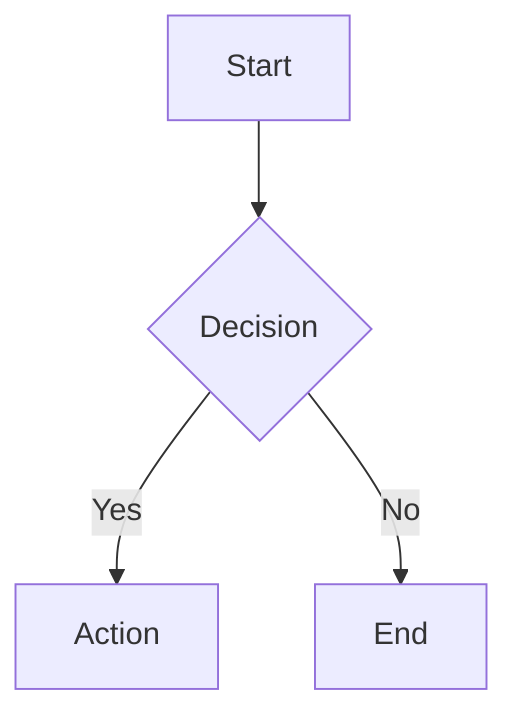
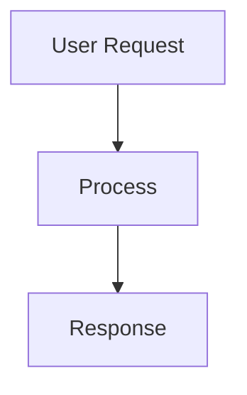

# Phase 1: Charter Agent + Chart Innate Skill + Backend Wiring

## Objective

Create the "charter" agent that generates and validates Mermaid diagrams, create the "chart" innate skill that teaches other agents how to request diagrams from charter, update all relevant agents' `team_members` lists so charter is spawnable, register the chart skill's tool-category mapping so agents receiving the chart skill get instance tools auto-granted, and update all test files that hardcode expected `innate_skills` and `team_members` values.

## Coupling

- **Depends on**: None (root phase)
- **Coupling type**: independent (no other phase)
- **Shared files with other phases**: None (Phase 2 is frontend-only)
- **Shared APIs/interfaces**: The convention that agents output ` ```mermaid ` fenced code blocks (established by chart skill.md) is consumed by Phase 2's frontend rendering, but this is a loose convention not a code dependency
- **Why this coupling**: Backend agent infrastructure and frontend rendering are entirely separate codebases

## Context

- Agent definition system: filesystem-based discovery via `daemon/registry.py`, agents defined in `agents/{agent_id}/` directories with `meta.json` + markdown files
- Innate skills: centralized in `agents/_prompt_system/innate-skills/{skill_name}/skill.md`, loaded by `load_agent_skills()` in `daemon/loader.py`
- Tool categories: `INNATE_SKILL_TOOL_CATEGORIES` in `daemon/tools/instance.py:52-54` maps innate skills → tool categories (currently only `opencode → external_opencode`)
- Team membership: `_check_team_membership()` in `daemon/tools/instance.py:232-308`, deny-by-default, checks `team_members` array in caller's `meta.json`
- **CRITICAL (C1)**: Target agents (developer, planner, reviewer, tidier, approver, tester) do NOT have `"instance"` in their `tools.allow` lists. They have `["bash", "filesystem", "time", "self", "help", "knowledge", "mcp", "context"]`. The chart skill tells them to use `spawn_instance`, which requires the `"instance"` tool category. The `INNATE_SKILL_TOOL_CATEGORIES` mapping auto-grants tool categories when a skill is present — we MUST add `"chart": ["instance"]` so these agents can actually spawn charter.
- **BLOCKING (B1)**: Two test files use exact `==` assertions on `innate_skills` and `team_members` arrays. These assertions will hard-fail after meta.json changes. Both test files MUST be updated in the same phase.

### Agents with `innate_skills: ["opencode"]` (get charter in team_members + chart skill):
1. `agents/developer/meta.json` — color: accent-cyan, tools: includes "time"
2. `agents/planner/meta.json` — color: accent-indigo, tools: includes "time"
3. `agents/reviewer/meta.json` — color: accent-rose, tools: includes "time"
4. `agents/tidier/meta.json` — color: accent-purple, tools: includes "time"
5. `agents/approver/meta.json` — color: accent-emerald, tools: includes "time"
6. `agents/tester/meta.json` — color: accent-green, tools: includes "time"

**Note 3 — "time" tool**: All 6 reference agents above have `"time"` in their `tools.allow`. Charter should also include `"time"` for consistency (and it's harmless — charter may reference timestamps in error messages or logging).

### Giter decision (W3):
**Giter does NOT get charter or chart skill.** Giter lacks the opencode skill (`innate_skills: []`), focuses on git operations which rarely need diagrams. Leader can still spawn charter directly if needed for a git workflow visualization.

### Leader's current team_members:
`["planner", "developer", "reviewer", "tidier", "approver", "tester", "giter", "devops", "explorer"]`

## Tasks

| # | Task | Details | Key Files |
|---|------|---------|-----------|
| 1 | Create charter agent directory structure | Create `agents/charter/` with meta.json, soul.md, workflow.md, rule.md | `agents/charter/` (new) |
| 2 | Write charter `meta.json` | id=charter, name=Charter, color=accent-blue (C3 fix), no_force_explore=true (W5), tools=[bash, filesystem, **time** (Note 3), self, help, knowledge, mcp, context], team_members=[] | `agents/charter/meta.json` |
| 3 | Write charter `soul.md` | Identity as a diagram specialist. Generates Mermaid syntax. Validates output. Core principle: never return unvalidated diagrams. | `agents/charter/soul.md` |
| 4 | Write charter `rule.md` | Must validate all output via mmdc before returning. Must choose appropriate diagram type. Must include diagram in ` ```mermaid ` fenced block. Must use per-instance temp files (C4 fix). | `agents/charter/rule.md` |
| 5 | Write charter `workflow.md` | Step 0: Check npx/mmdc availability (S4) → Step 1: Understand request → Step 2: Explore context if needed → Step 3: Generate Mermaid → Step 4: Validate via mmdc using mktemp (C4 fix) → Step 5: Fix & re-validate if errors → Step 6: Return validated diagram | `agents/charter/workflow.md` |
| 6 | Create chart innate skill | Create `agents/_prompt_system/innate-skills/chart/skill.md` teaching agents: what charter does, how to spawn it, when to request diagrams, the ` ```mermaid ` output format | `agents/_prompt_system/innate-skills/chart/skill.md` |
| 7 | **[C1 FIX] Add chart→instance tool mapping** | Add `"chart": ["instance"]` to `INNATE_SKILL_TOOL_CATEGORIES` dict in daemon/tools/instance.py. This auto-grants instance tools when chart skill is present. | `daemon/tools/instance.py` (line 52-54) |
| 8 | Add "charter" to leader's team_members | Add "charter" to the team_members array | `agents/leader/meta.json` |
| 9 | Add "charter" to opencode agents' team_members + chart skill | Add "charter" to team_members AND "chart" to innate_skills for: developer, planner, reviewer, tidier, approver, tester | 6 × `agents/{agent}/meta.json` |
| 10 | **[B1 FIX] Update test_innate_skills_refactoring.py** | Update hardcoded `innate_skills` assertions for developer, reviewer, tester, planner, tidier, approver to include "chart" | `tests/test_innate_skills_refactoring.py` |
| 11 | **[B1 FIX] Update test_spawn_team_members.py** | Update hardcoded `team_members` assertions for leader, developer (and others) to include "charter" | `tests/test_spawn_team_members.py` |

## Key Files

### New Files (Create)
- `agents/charter/meta.json` — Agent definition (id, name, description, tools, team_members, color, no_force_explore)
- `agents/charter/soul.md` — Charter's identity and core principles
- `agents/charter/rule.md` — Hard constraints (validate before return, per-instance temp files)
- `agents/charter/workflow.md` — Step-by-step diagram generation workflow
- `agents/_prompt_system/innate-skills/chart/skill.md` — Teaches agents how to use charter

### Modified Files (Edit)
- `daemon/tools/instance.py` — **[C1 FIX]** Add `"chart": ["instance"]` to `INNATE_SKILL_TOOL_CATEGORIES`
- `agents/leader/meta.json` — Add "charter" to team_members
- `agents/developer/meta.json` — Add "charter" to team_members, "chart" to innate_skills
- `agents/planner/meta.json` — Add "charter" to team_members, "chart" to innate_skills
- `agents/reviewer/meta.json` — Add "charter" to team_members, "chart" to innate_skills
- `agents/tidier/meta.json` — Add "charter" to team_members, "chart" to innate_skills
- `agents/approver/meta.json` — Add "charter" to team_members, "chart" to innate_skills
- `agents/tester/meta.json` — Add "charter" to team_members, "chart" to innate_skills
- **`tests/test_innate_skills_refactoring.py`** — **[B1 FIX]** Update expected innate_skills assertions
- **`tests/test_spawn_team_members.py`** — **[B1 FIX]** Update expected team_members assertions

### Files to Review (No Change)
- `daemon/registry.py` — No change needed (auto-discovers new agents)
- `daemon/loader.py` — No change needed (auto-loads innate skills from `_prompt_system/innate-skills/`)

## Detailed Task Specs

### Task 1-5: Charter Agent Files

#### `agents/charter/meta.json`
```json
{
  "id": "charter",
  "name": "Charter",
  "description": "Generates and validates Mermaid diagrams (flowcharts, sequence diagrams, class diagrams, etc.)",
  "icon": "📊",
  "color": "accent-blue",
  "version": "1.0.0",
  "no_force_explore": true,
  "innate_skills": [],
  "tools": {
    "allow": ["bash", "filesystem", "time", "self", "help", "knowledge", "mcp", "context"]
  },
  "team_members": []
}
```

**Design rationale:**
- **No `opencode` skill**: Charter doesn't write/modify code — it generates text (Mermaid syntax). Giving it opencode would add ~200 lines of prompt bloat for no benefit. It reads context via knowledge/context tools and outputs validated Mermaid.
- **`color: accent-blue`** (C3 fix): `accent-emerald` is already used by approver. `accent-blue` (#3b82f6) is defined in the frontend palette (`agent-switcher.component.ts:14`) and is not used by any existing agent. (Note 2: `accent-blue` is used as a SCSS color variable in schedule-card and other non-agent components, but no agent uses it — so no agent-color collision.)
- **`no_force_explore: true`** (W5): Charter's workflow includes optional context-gathering (explore when diagramming existing code). Forced explore adds unnecessary latency when charter is just generating a diagram from a description. Charter can explore manually when needed.
- **`"time"` in tools.allow** (Note 3): All 6 reference agents (developer, planner, reviewer, tidier, approver, tester) include `"time"` in their tools.allow. Charter includes it for consistency — harmless and may be useful for timestamped error messages or logging.
- **`bash` tool**: Needed to run `npx -y @mermaid-js/mermaid-cli` for validation and `mktemp` for safe temp files
- **`filesystem` tool**: Needed to write temp `.mmd` files for validation (mmdc reads from file or stdin)
- **Empty `team_members`**: Charter is a leaf agent — it doesn't spawn other agents

#### `agents/charter/soul.md` — Key sections:
```markdown
# Who I Am

I am a diagram specialist. I transform concepts, architectures, processes, and relationships into clear, valid Mermaid diagrams. I do NOT guess — I validate every diagram before returning it.

I am part of **ensemble**, a multi-agent system.

## My Expertise

I can create:
- **Flowcharts** — process flows, decision trees, algorithms
- **Sequence diagrams** — interactions between components/services/agents
- **Class diagrams** — object models, entity relationships
- **State diagrams** — state machines, lifecycle transitions
- **ER diagrams** — database schemas, data models
- **Gantt charts** — timelines, project schedules
- **Mind maps** — concept hierarchies, brainstorm structures
- **C4 diagrams** — system architecture (context, container, component)

## My Principle

**Never return an unvalidated diagram.** I always run syntax validation before returning my output. If validation fails, I fix and re-validate until it passes. If validation tooling is unavailable, I return the diagram with a clear warning.
```

#### `agents/charter/rule.md` — Key sections:
```markdown
# Rules

## Must

- **VALIDATE all Mermaid output** before returning — use `npx -y @mermaid-js/mermaid-cli` to check syntax
- **USE per-instance temp files** — never hardcode `/tmp/charter_validate.mmd`. Use `mktemp` to create unique temp files: `TMPFILE=$(mktemp /tmp/charter_XXXXXX.mmd)`. This prevents race conditions when multiple charter instances run concurrently.
- **CHECK if npx/mmdc is available** at the start of validation — if not, return the diagram with a warning that validation was skipped
- **Choose the appropriate diagram type** based on what the user needs to visualize (see workflow)
- **Return diagrams in ` ```mermaid ` fenced code blocks** so they render properly in the chat UI
- **Keep diagrams readable** — avoid overcrowding, use subgraphs for large diagrams
- **Use explore() / knowledge tools** to understand the codebase before diagramming architecture

## Never

- **Never return a diagram without validating it first** (unless validation tooling is unavailable — then warn)
- **Never use hardcoded temp file paths** — always use `mktemp` or instance-id-based naming
- **Never invent relationships or flows** that aren't supported by the request or codebase
- **Never include HTML in Mermaid labels** (causes rendering issues)
```

#### `agents/charter/workflow.md` — Key sections:
```markdown
# Workflow

## Step 0: Check Validation Tooling Availability (S4)

Before starting, check if validation will be possible:
```bash
command -v npx >/dev/null 2>&1 && echo "npx available" || echo "npx NOT available"
```
If npx is not available, note this — you will return diagrams with a validation-skipped warning.

## Step 1: Understand the Request

Identify:
- What needs to be visualized (process flow, architecture, data model, etc.)
- The scope (entire system, specific module, specific interaction)
- Available context (is this from code? from a description? from a plan?)

## Step 2: Gather Context (if needed)

If diagramming existing code/architecture:
```
explore(query="What is the architecture of X?")
```
Or read relevant files to understand structure.

## Step 3: Select Diagram Type

| Need | Diagram Type | Mermaid Keyword |
|------|-------------|-----------------|
| Process/decision flow | Flowchart | `flowchart TD` or `flowchart LR` |
| Service interactions | Sequence | `sequenceDiagram` |
| Object relationships | Class | `classDiagram` |
| State transitions | State | `stateDiagram-v2` |
| Database schema | ER | `erDiagram` |
| Timeline/schedule | Gantt | `gantt` |
| Concept hierarchy | Mindmap | `mindmap` |

## Step 4: Generate Mermaid

Write the Mermaid syntax. Follow best practices:
- Use clear, descriptive node names
- Keep labels concise
- Use subgraphs for grouping in large diagrams
- Use appropriate shapes (diamonds for decisions, etc.)

## Step 5: Validate (C4 fix — per-instance temp files)

Create a unique temp file and validate:
```bash
# Create per-instance temp file (prevents race conditions)
TMPFILE=$(mktemp /tmp/charter_XXXXXX.mmd)
```
Write the Mermaid content to `$TMPFILE`, then:
```bash
# Validate via mermaid-cli
npx -y @mermaid-js/mermaid-cli -i $TMPFILE -o /tmp/charter_validate_output.svg 2>&1
```

**If npx is not available** (Step 0 check failed): Skip validation, return the diagram with a warning:
> ⚠️ Validation skipped — npx/mermaid-cli not available in this environment. Diagram may contain syntax errors.

If validation fails, read the error, fix the syntax, and re-validate (max 3 attempts).

**Clean up temp files after validation:**
```bash
rm -f $TMPFILE /tmp/charter_validate_output.svg
```

## Step 6: Return

Return the validated diagram in a ```mermaid fenced block:



Include a brief explanation of what the diagram shows.
```

### Task 6: Chart Innate Skill

#### `agents/_prompt_system/innate-skills/chart/skill.md`

```markdown
# Chart Skill

Generate Mermaid diagrams by delegating to the **charter** agent. The charter agent produces validated, render-ready Mermaid syntax for flowcharts, sequence diagrams, class diagrams, and more.

## When to Use Charter

Request a diagram when you need to visualize:
- **Architecture** — component relationships, service interactions, data flow
- **Process** — workflow steps, decision trees, algorithm logic
- **State** — state machines, lifecycle transitions
- **Data models** — entity relationships, class hierarchies
- **Timelines** — project schedules, task dependencies

## How to Request a Diagram

### Step 1: Spawn charter

```
spawn_instance(
    agent_id="charter",
    instance_name="diagram-architecture"
)
```

### Step 2: Send the request

```
send_message(
    instance_id="<charter_instance_id>",
    message="Create a flowchart showing the authentication flow: user login → validate credentials → generate JWT → return token. Include error paths."
)
```

### Step 3: Receive validated diagram

Charter returns Mermaid syntax in a ```mermaid fenced code block. This syntax is validated and will render correctly in the UI.

### Step 4: Integrate into your response

Include the charter's diagram output directly in your response. The ```mermaid block will render as a visual diagram in the chat interface.

## Output Format

Mermaid diagrams use fenced code blocks with the `mermaid` language tag:

~~~

~~~

## Best Practices

- **Be specific** in your request — describe what to visualize, the scope, and the level of detail
- **Provide context** — if diagramming code, tell charter what to explore
- **One diagram per request** — keep requests focused
- **Don't hand-edit** charter's output — if changes are needed, ask charter to regenerate
```

### Task 7: [C1 FIX] Register chart→instance Tool Category Mapping

**File**: `daemon/tools/instance.py` (lines 52-54)

**Current code**:
```python
INNATE_SKILL_TOOL_CATEGORIES: dict[str, list[str]] = {
    "opencode": ["external_opencode"],
}
```

**Updated code**:
```python
INNATE_SKILL_TOOL_CATEGORIES: dict[str, list[str]] = {
    "opencode": ["external_opencode"],
    "chart": ["instance"],
}
```

**Why this is critical**: The chart skill tells agents to use `spawn_instance` and `send_message`, which are in the `"instance"` tool category. However, the target agents (developer, planner, reviewer, tidier, approver, tester) have `tools.allow: ["bash", "filesystem", "time", "self", "help", "knowledge", "mcp", "context"]` — **`"instance"` is NOT in their allow list**. Without this mapping, agents with the chart skill would get the instructional prompt but would be unable to actually call `spawn_instance`. The `expand_allow_for_innate_skills()` function (instance.py:57-87) merges these categories into the agent's allow list automatically.

### Tasks 8-9: meta.json Updates

#### `agents/leader/meta.json` — team_members:
Change from:
```json
"team_members": ["planner", "developer", "reviewer", "tidier", "approver", "tester", "giter", "devops", "explorer"]
```
To:
```json
"team_members": ["planner", "developer", "reviewer", "tidier", "approver", "tester", "giter", "devops", "explorer", "charter"]
```

#### For each of: developer, planner, reviewer, tidier, approver, tester

**meta.json — team_members:**
Change `"team_members": ["explorer"]` → `"team_members": ["explorer", "charter"]`

**meta.json — innate_skills:**
- developer: `"innate_skills": ["opencode"]` → `"innate_skills": ["opencode", "chart"]`
- planner: `"innate_skills": ["opencode"]` → `"innate_skills": ["opencode", "chart"]`
- reviewer: `"innate_skills": ["opencode"]` → `"innate_skills": ["opencode", "chart"]`
- tidier: `"innate_skills": ["opencode"]` → `"innate_skills": ["opencode", "chart"]`
- approver: `"innate_skills": ["opencode"]` → `"innate_skills": ["opencode", "chart"]`
- tester: `"innate_skills": ["opencode", "test-pack"]` → `"innate_skills": ["opencode", "chart", "test-pack"]`

### Task 10: [B1 FIX] Update test_innate_skills_refactoring.py

**File**: `tests/test_innate_skills_refactoring.py`

**Problem**: Lines 57-67 hardcode exact `innate_skills` arrays in `test_cases`. After adding "chart" to 6 agents' innate_skills, these `==` assertions fail.

**Changes needed**:

Line 58: `("developer", ["opencode"], "OpenCode-Skill"),` → `("developer", ["opencode", "chart"], "OpenCode-Skill"),`

Line 59: `("reviewer", ["opencode"], "OpenCode-Skill"),` → `("reviewer", ["opencode", "chart"], "OpenCode-Skill"),`

Line 60: `("tester", ["opencode", "test-pack"], "OpenCode-Skill"),` → `("tester", ["opencode", "chart", "test-pack"], "OpenCode-Skill"),`

Line 61: `("tester", ["opencode", "test-pack"], "Test Pack Skill"),` → `("tester", ["opencode", "chart", "test-pack"], "Test Pack Skill"),`

Line 62: `("planner", ["opencode"], "OpenCode-Skill"),` → `("planner", ["opencode", "chart"], "OpenCode-Skill"),`

Line 63: `("tidier", ["opencode"], "OpenCode-Skill"),` → `("tidier", ["opencode", "chart"], "OpenCode-Skill"),`

Line 64: `("approver", ["opencode"], "OpenCode-Skill"),` → `("approver", ["opencode", "chart"], "OpenCode-Skill"),`

Line 97: `assert tester_meta.innate_skills == ["opencode", "test-pack"]` → `assert tester_meta.innate_skills == ["opencode", "chart", "test-pack"]`

**Also**: Add assertions that "chart" skill content ("Chart Skill") appears in prompts for these agents. The `expected_skill_content` column in `test_cases` checks for a single skill marker — consider adding a separate loop or extending the test to verify both "OpenCode-Skill" AND "Chart Skill" appear in the prompt. At minimum, update line 73's assertion will now verify the expanded arrays pass.

### Task 11: [B1 FIX] Update test_spawn_team_members.py

**File**: `tests/test_spawn_team_members.py`

**Problem**: Several tests hardcode expected `team_members` arrays. After adding "charter" to leader and the 6 opencode agents, these assertions fail.

**Changes needed**:

**Line 158-161** (`test_valid_spawn_leader_can_spawn_each_team_member`): The `expected_team` list iterates over leader's team_members to verify each can be spawned. Add "charter" to this list:
```python
expected_team = [
    "planner", "developer", "reviewer", "tidier",
    "approver", "tester", "giter", "devops",
    "charter",  # NEW: charter added to leader's team_members
]
```
(Also add "explorer" if not already there — verify current test state.)

**Line 224-247** (`test_invalid_spawn_developer_cannot_spawn_non_team_targets`): This test asserts that developer's team_members is exactly `["explorer"]` and the error message shows `Allowed team members: ['explorer']`. After adding "charter" to developer's team_members:
- Line 240: `f"developer (team_members=['explorer']) should reject "` → update comment to reflect `['explorer', 'charter']`
- Line 244: `assert "Allowed team members: ['explorer']" in result` → `assert "Allowed team members: ['explorer', 'charter']" in result` (note: the sorted display format from `_check_team_membership` line 302 uses `sorted(allowed_canonical)` — so the order may be `['charter', 'explorer']` alphabetically)

**Line 253-269** (`test_restricted_team_members_rejects_non_team_spawns`): Same pattern for tester. After adding "charter" to tester's team_members:
- Line 268: `assert "Allowed team members: ['explorer']" in result` → update to include 'charter' in the expected allowed list

**IMPORTANT — sorted display format**: The `_check_team_membership()` function (line 302) uses `sorted(allowed_canonical)` for the error message display. With both "charter" and "explorer" in the list, the sorted output will be `['charter', 'explorer']` (alphabetical). Verify the exact format in assertions.

## Constraints

- Charter agent must validate ALL output — never return raw LLM-generated Mermaid without syntax checking (unless tooling unavailable — then warn)
- Charter must use per-instance temp files (`mktemp`) for validation — never hardcoded paths (C4 fix)
- Charter does NOT get opencode skill (unnecessary for text generation)
- Charter is a leaf agent (empty team_members — it spawns nothing)
- The `npx -y @mermaid-js/mermaid-cli` command requires Node.js + Chromium (puppeteer) in the environment. This is a runtime dependency, not a code change.
- `accent-blue` color class exists in frontend colorMap (`agent-switcher.component.ts:14`, value #3b82f6) and is not used by any existing agent (used as SCSS variable in non-agent components, but no agent-color collision)
- Giter does NOT get charter or chart skill (W3 — no opencode skill, git ops rarely need diagrams)
- ALL test assertions that hardcode `innate_skills` or `team_members` arrays must be updated in the same phase (B1 fix)

## Deliverables

- [ ] `agents/charter/meta.json` created (color=accent-blue, no_force_explore=true, time in tools.allow)
- [ ] `agents/charter/soul.md` created
- [ ] `agents/charter/rule.md` created (includes per-instance temp file rule)
- [ ] `agents/charter/workflow.md` created (includes npx availability check, mktemp usage)
- [ ] `agents/_prompt_system/innate-skills/chart/skill.md` created
- [ ] **`daemon/tools/instance.py` updated** — `"chart": ["instance"]` added to `INNATE_SKILL_TOOL_CATEGORIES` (C1 fix)
- [ ] `agents/leader/meta.json` updated (charter in team_members)
- [ ] `agents/developer/meta.json` updated (charter in team_members, chart in innate_skills)
- [ ] `agents/planner/meta.json` updated (charter in team_members, chart in innate_skills)
- [ ] `agents/reviewer/meta.json` updated (charter in team_members, chart in innate_skills)
- [ ] `agents/tidier/meta.json` updated (charter in team_members, chart in innate_skills)
- [ ] `agents/approver/meta.json` updated (charter in team_members, chart in innate_skills)
- [ ] `agents/tester/meta.json` updated (charter in team_members, chart in innate_skills)
- [ ] **`tests/test_innate_skills_refactoring.py` updated** — innate_skills assertions updated for 6 agents (B1 fix)
- [ ] **`tests/test_spawn_team_members.py` updated** — team_members assertions updated for leader + agents (B1 fix)
- [ ] Charter agent discovered by registry on daemon restart
- [ ] Leader can spawn charter successfully
- [ ] Agents with chart skill can spawn_instance charter (instance tools auto-granted via C1 fix)
- [ ] All existing tests pass after changes
