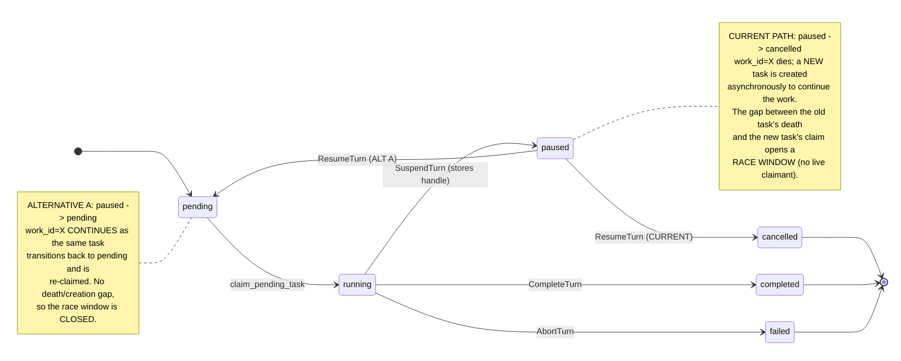

# Architecture Recommendation: Job/Task State Model & Concurrency Gate

**Date:** 2026-08-12
**Status:** Architecture Review (READ-ONLY)
**Instance IDs:** architect-worker-state-model (339677a5), architect-worker-concurrency-gate (8ba10cd1), architect-worker-resume-turn (fd0b2399)

---

## Executive Summary

The concurrency leak (FIFO job running while deferred job starts concurrently on the same instance) has **two contributing factors, not one root cause**:

1. **Primary (🔴): Predicate divergence at the claim chokepoint.** The `claim_pending_task` SQL guard uses the narrowest of all 7 "is this instance busy?" predicates (`status='running'` only), while every other gate uses `PENDING+RUNNING+PAUSED`. A PENDING FIFO task does not block a deferred candidate from being claimed — the instance appears idle to the claim path even when work is queued.

2. **Amplifier (🟡): ResumeTurn cancel-and-recreate window.** The resume path transitions `PAUSED → CANCELLED` and creates a new task asynchronously out-of-band. During the gap (T2–T4), the instance has zero inflight tasks — widening the race window the predicate divergence already opens.

The architecture is **structurally sound but misaligned** — not broken. The 3-table model (Task primary, JobItem queue proxy, MessageQueue audit trail) is well-designed with a single-chip UUID linkage contract. The fix is **convergence, not rewrite**: one canonical busy predicate folded into the atomic claim SQL, plus eventual migration of ResumeTurn to a direct PAUSED→PENDING transition.

---

## 1. Root Cause Classification

### Verdict: Structural misalignment, not an implementation bug

The system accumulated 7 independent "is this instance busy?" predicates organically. Each was correct for its original purpose, but they were never unified. The defect is that the **narrowest** predicate (`claim_pending_task`: RUNNING only) sits at the single most critical chokepoint — the claim path that decides whether to start work.

| Root Cause Factor | Severity | Classification | Mechanism |
|---|---|---|---|
| **Predicate divergence at claim** | 🔴 Critical | Structural misalignment | `claim_pending_task` checks `status='running'` only; PENDING/PAUSED tasks are invisible. Two tasks can be claimed for the same instance. |
| **ResumeTurn race window** | 🟡 Significant | Design debt (workaround, not intent) | PAUSED→CANCELLED + async new-task creation leaves a gap where no task is active. Amplifies the predicate divergence. |
| **Multi-queue blind spots** | 🟡 Significant | Structural — queue-level locking is per-queue, not per-instance | Queue locks (uq_job_locks_slot) serialize within a queue but never observe other queues targeting the same instance. |
| **stamp_message_id silent failure** | 🟡 Significant | Implementation gap | Post-commit JSONB stamp failure silently leaves JobItem without message_id, breaking the cross-system guard. |

---

## 2. State Model Mapping

### Creation Path Matrix (per job type)

| Job Type | message_queue row? | task row? | job_queue_items row? | Shared UUID? | Entry Point |
|---|---|---|---|---|---|
| **message** (public HTTP) | ✅ Always | ✅ PENDING | ✅ QUEUED | `JobItem.job_id == Task.work_id` | `enqueue_message_job` |
| **message** (internal) | ✅ Always | ✅ PENDING | ❌ No JobItem | None | `enqueue_message` |
| **task** (public HTTP) | ✅ Created later by JobProcessor | ✅ PENDING | ✅ QUEUED | `JobItem.job_id == Task.work_id` | `JobQueueService.enqueue` |
| **process_report** | ✅ Always | ✅ PENDING | ❌ No JobItem | None (Task carries message_id) | `child_reports._process_child_completion_db_sync` |
| **send_report** | ✅ Always | ✅ PENDING | ❌ No JobItem | None | `error_reporting._emit_terminal_via_bus` |
| **cleanup** | ❌ | ✅ PENDING | ❌ No JobItem | None | Internal only |

### Key Finding: The `message` type IS structurally different

The `message` public path (`enqueue_message_job`) is the **only path that creates all three rows** (MessageQueue + Task + JobItem). This is by design under JAFP (Job-as-Front-Primitive): the shared UUID linkage (`JobItem.job_id == Task.work_id`) is mint-locked at creation.

However, the internal `message` path (`enqueue_message`) creates only MessageQueue + Task — **no JobItem**. This asymmetry means internal agent-to-agent messages bypass the queue admission layer entirely, relying on `claim_pending_task`'s per-instance guard for serialization.

**This asymmetry is contained, not broken.** The linkage contract is enforced by passing one UUID down both write paths. The real complexity driver is not the 3-table asymmetry but the **predicate divergence** — different code paths check different status subsets to decide "is this instance busy?"

### Table Relationship Model

```
message_queue (audit) ←── message_id ── task (work unit / dispatch primitive)
                                          │ work_id (shared UUID)
                                          ▼
                              job_queue_items (queue ticket / proxy)
                                          │ instance_id
                                          ▼
                                    instance (execution state)
```

**Hierarchy:** Task is primary. JobItem is a queue proxy (mirror of Task for queue-level admission). MessageQueue is an independent audit trail (durable message record, updated by a separate pipeline). They are NOT peers.

---

## 3. Concurrency Gate Analysis

### The 7 Predicates (confirmed against source)

| # | Predicate | Location | Status Set Checked | Scope |
|---|---|---|---|---|
| 1 | `has_inflight_task` | task/repository.py:436 | PENDING + RUNNING | instance |
| 2 | `has_active_non_deferred_work` | task/repository.py:1955 | PENDING + RUNNING + PAUSED | project |
| 3 | `has_active_non_background_work` | task/repository.py:2186 | PENDING + RUNNING + PAUSED | system-wide |
| 4 | `claim_pending_task` guard | task/repository.py:872 | **RUNNING ONLY** | instance |
| 5 | `_has_live_work` (zombie reaper) | job_queue_service.py:1418 | PENDING + RUNNING + PAUSED (via 2-probe approximation) | instance |
| 6 | `_is_idle` (maintenance) | maintenance.py:250 | PENDING + RUNNING + PAUSED | system |
| 7 | `find_zombie_instances` | instance/repository.py:905 | PENDING + RUNNING + PAUSED | system |

**The leak:** Predicate #4 (`claim_pending_task`) is the **only predicate consulted on every claim**, and it uses the narrowest status set (`status='running'`). When a FIFO task is PENDING (not yet claimed), a deferred candidate arriving on a different queue passes the guard because no RUNNING task exists yet.

### Queue-Level Locking: Insufficient

Queue-level locking (`uq_job_locks_slot`) serializes within a queue but **never across queues**. An instance receives work from 5 reserved queues (fifo, parallel c=5, kb, defer, background c=1). A FIFO lock and a defer lock are independent — they don't observe each other. **Queue is the wrong abstraction for instance-level concurrency control.**

`ExecutionGateService` (in-process `asyncio.Lock` per instance) IS the correct abstraction but operates downstream of the claim — it serializes `graph.astream` calls, not task claiming. Two tasks can both be claimed before the gate serializes their execution, by which point the second task occupies a LangGraph thread on state owned by the first.

---

## 4. ResumeTurn: Cancel-and-Recreate Analysis

### Verdict: Workaround, not intentional design

Direct evidence: `manager.py:6629` documents the Phase 3 redesign intent as "Resume: task PAUSED → PENDING (direct re-claim)." The actual code at `turn_transitions.py:285` writes `new_status: "cancelled"`. The implementation was never migrated to match the documented intent — this is Phase 4b/4c deferred work.

### The Race Window (T2–T4)

```
T0  Task: PAUSED                    → has_inflight_task: FALSE (PAUSED not counted)
T1  Instance: PAUSED → RUNNING      → (instance-side update, task table unchanged)
T2  ResumeTurn: PAUSED → CANCELLED  → has_inflight_task: FALSE (CANCELLED not counted) ← WINDOW OPENS
T3  enqueue_message → new task      → has_inflight_task: FALSE (new task not yet PENDING)
T4  WorkerPool claim → RUNNING      → has_inflight_task: TRUE ← WINDOW CLOSES
```

Between T2 and T4, the instance has no inflight task. Any job arriving during this window sees the instance as idle.

### Task Lifecycle State Diagram



### Crash Recovery Gap

If the system crashes between T2 (cancel) and T4 (new task running), the instance is in RUNNING state with a CANCELLED task and no PENDING successor. `stale_task_recovery.py` sweeps stale RUNNING tasks, not CANCELLED. `_finalize_job_db_sync` reconciles orphaned tasks with terminal JobItems but won't fire for a missing successor task. **There is no recovery path for this intermediate state.**

---

## 5. Approach Comparison

| Approach | Complexity | Scalability | Maintainability | Risk | Cost | Recommendation |
|---|---|---|---|---|---|---|
| **A: Single Canonical Predicate** | Low — one new method + fold into claim SQL | High — no extra DB round-trip; folded into existing atomic claim | **Highest** — eliminates drift; one definition everywhere | Low — additive, proven pattern (mirrors defer/background gates) | Low — single EXISTS subquery | **✅ RECOMMENDED** |
| B: DB-Level Mutex (advisory lock) | Medium — advisory lock plumbing + cleanup paths | High — cross-process safe by construction | Low — two systems-of-truth (predicate + lock) | Medium — advisory locks invisible to is_busy checks; deadlock risk | Medium — extra round-trip per claim | Not recommended |
| C: Expand claim guard only | **Lowest** — one-line EXISTS addition | Medium — fixes one path, leaks at other call sites | Low — divergence persists elsewhere | Medium — partial fix | Lowest | Insufficient alone |
| D: Queue Unification | Highest — deep rewrite of 5 queue types, defer/background semantics | Highest — eliminates multi-queue leak | Low — 10+ files, breaks tier-0/1/2/3 semantics | High — defer/background lane semantics lost | High — large migration | Too expensive for minimal fix |

**Winner: Approach A (Single Canonical Predicate).** Wins decisively on Maintainability (the heaviest axis at 25%) and Complexity. The pattern is proven — the existing defer gate (task/repository.py:986-1000) and background gate (1028-1042) already use the same `AND NOT EXISTS` SQL pattern folded into `claim_pending_task`'s atomic UPDATE-WHERE.

### Alternative Comparison for ResumeTurn

| Path | Mechanism | Race Window | Risks | Recommendation |
|---|---|---|---|---|
| **C: Current (Cancel + Recreate)** | PAUSED→CANCELLED + new task async | **YES** (T2–T4) | Bus watcher orphan risk; crash recovery gap | Migrate away (Phase 4b/4c) |
| **A: Direct PAUSED→PENDING** | WorkerPool re-claims same row | **NONE** — atomic single-row transition | LangGraph checkpoint reload under same work_id; message_queue status must be valid | **✅ RECOMMENDED** (matches documented intent) |
| B: PAUSED→RUNNING + checkpoint reload | Skip claim path | High — bypasses queue serialization | Loses queue ordering; bypasses per-instance guard | Not recommended |

---

## 6. Recommendations

### Minimal Fix (eliminates the leak NOW)

**One chokepoint, additive change:**

1. **Add `TaskRepository.has_instance_busy(instance_id) -> bool`** returning `PENDING OR RUNNING OR PAUSED` (mirrors `_LIVE_TASK_STATES_FOR_ZOMBIE_SCAN` at instance/repository.py:905).

2. **Fold it into `claim_pending_task`'s atomic SQL** as an `AND NOT EXISTS (SELECT 1 FROM task t_inst WHERE t_inst.instance_id = :instance_id AND t_inst.status IN ('pending','running','paused'))` clause — same shape as the existing defer gate (task/repository.py:986-1000) and background gate (1028-1042).

3. **Replace `has_inflight_task` at critical call sites:**
   - `daemon/api.py:1189` (should-I-block check)
   - `daemon/tools/job_queue.py:874` (should-I-block check)
   - `daemon/services/job_queue_service.py:1418` (`_has_live_work` — eliminate 2-probe TOCTOU)
   
   Keep `has_inflight_task` ONLY where the narrow "is a Task actively driving astream right now?" semantics are correct (e.g., report-task recovery check at api.py:1148).

**This closes the leak on every dispatch path with one SQL subquery + one new method.** No rewrite, no schema change, no migration.

### Secondary Fix (eliminates the amplifier)

4. **Migrate ResumeTurn from PAUSED→CANCELLED to PAUSED→PENDING** (Phase 4b/4c). This closes the T2–T4 race window by keeping the same task row active throughout the pause/resume cycle. The LangGraph checkpoint reloads under the same `work_id`, matching the documented design intent.

### Ideal Architecture (north star)

A single `InstanceConcurrency` service:
- `await gate.acquire(instance_id, lease_holder)` returns a context manager
- (a) atomically checks `has_instance_busy` + INSERTs a row into `instance_execution_leases` keyed on `instance_id` UNIQUE
- (b) yields
- (c) DELETEs on release
- Every dispatcher routes through this gate
- Queue-level locks remain for queue-policy (FIFO order, concurrency=5 for parallel) but never serve as the concurrency gate
- `JobLockManager` becomes a thin "queue ordering" helper, not a concurrency primitive

---

## 7. Trade-offs

| Trade-off | Decision Rationale |
|---|---|
| **One predicate vs many** | A single canonical predicate trades local specificity for global consistency. The existing defer/background predicates remain (they answer different questions: "is there non-deferred work?" vs "is the instance busy?"). The canonical predicate replaces the inconsistent `has_inflight_task` usages, not all predicates. |
| **PAUSED→PENDING vs cancel+recreate** | Direct transition reuses the same task row, closing the race window. Risk: LangGraph checkpoint replay must handle the same work_id (proven pattern per the pause/resume design). Benefit: eliminates 3 crash-recovery edge cases. |
| **Minimal fix vs ideal architecture** | The minimal fix (canonical predicate) plugs the leak immediately. The ideal architecture (instance leases) is the north star but requires schema changes and dispatcher refactoring — defer until the minimal fix is validated. |

---

## 8. Risks

- 🔴 **Critical: `claim_pending_task` per-instance guard uses `status='running'` only** — the narrowest of all 7 predicates. This is the leak. *(ref: task/repository.py:872, lines 882-889)*
- 🟡 **Significant: ResumeTurn PAUSED→CANCELLED creates a T2–T4 race window** where the instance has no inflight task. Amplifies the predicate divergence. *(ref: turn_transitions.py:285, instance_lifecycle.py:3941-3962)*
- 🟡 **Significant: No crash recovery for "cancelled-but-no-new-task"** intermediate state during resume. `stale_task_recovery` does not sweep CANCELLED tasks. *(ref: stale_task_recovery.py:25-32)*
- 🟡 **Significant: `_has_live_work` uses a 2-probe TOCTOU approximation** (has_inflight_task + get_by_instance PAUSED scan). Should be one query. *(ref: job_queue_service.py:1486-1514)*
- 🟡 **Significant: `stamp_message_id` failure is silent** — JobItem exists without message_id, breaking the cross-system guard in claim_pending_task. *(ref: instance_messaging.py:1648)*
- 🟡 **Significant: Bus watcher orphan risk on PAUSED→CANCELLED** — if `_notify_bus_of_cancel_and_retry` is not invoked in the resume path, the parent stays in `waiting_children` forever. *(ref: dependency_bus.py:1636-1641)*
- 🟢 **Minor: `ExecutionGateService` scope is single-process** — correct for its purpose (in-process serialization) but insufficient for cross-process instance-level safety. Complementary to, not a replacement for, `has_instance_busy`. *(ref: execution_gate.py:13-48)*
- 🟢 **Minor: Phase 4b/4c migration incomplete** — `_status_write_guard` permanently enabled only on new call sites; legacy paths still write status mirror directly. Tracked, non-blocking. *(ref: task/repository.py:2126)*

---

## 9. Decisions Pending

1. **Canonical predicate status set: should PAUSED count as "busy"?**
   - If YES (recommended): a paused instance cannot receive new work. This is the safe default — prevents the concurrency leak. Risk: if pause is used for long-running operations, the instance is blocked until resume completes.
   - If NO: a paused instance can receive new work, deferring the pause semantics to the caller. This re-opens the leak.

2. **ResumeTurn migration timing: now or Phase 4b/4c?**
   - The minimal fix (canonical predicate) closes the primary leak regardless of ResumeTurn. The ResumeTurn migration closes the amplifier. If the team wants belt-and-suspenders, migrate both now. If resource-constrained, the minimal fix alone is sufficient for the documented bug.

3. **Should `has_inflight_task` be deprecated entirely?**
   - It has a legitimate narrow use case ("is a Task actively driving astream?"). Recommend renaming to `is_task_driving_astream` for clarity, and replacing all "should I block?" call sites with `has_instance_busy`.

---

## 10. Open Questions

1. **Exact reproduction scenario:** Was the observed bug a PENDING fifo task + deferred candidate, or a PAUSED fifo task + deferred candidate? Both are plausible; the fix covers both, but the reproduction matters for regression testing.

2. **`_notify_bus_of_cancel_and_retry` invocation path:** Is it triggered in the ResumeTurn resume path? Worker C could not confirm from the code read. If not, the bus watcher orphan risk is higher than assessed.

3. **`enqueue_message(source="cascade_resume")` transaction boundary:** Does it run inside the same transaction as the ResumeTurn commit? If yes, the T2–T4 window is smaller (only the claim latency). If no, the window is larger (includes message queue + task creation latency).

4. **Full inventory of `has_inflight_task` call sites:** Worker B confirmed 2 critical sites (api.py:1189, tools/job_queue.py:874). A repo-wide grep is needed for complete coverage.

---

## Confidence Level

**High.** All three workers independently confirmed the predicate divergence at `claim_pending_task` as the primary leak, using different analytical approaches (data-flow tracing, trade-off comparison, failure-mode analysis). The ResumeTurn race window was confirmed as an amplifier, not the root cause. The recommended fix uses a proven SQL pattern already in the codebase (defer/background gates).

**Assumption that would flip the recommendation:** If LangGraph checkpoint replay fails under a direct PAUSED→PENDING transition (i.e., re-claiming the same work_id causes a checkpoint corruption), then the cancel-and-recreate pattern is load-bearing and must be preserved. This would elevate the canonical predicate fix to the sole remedy and defer the ResumeTurn migration indefinitely.
