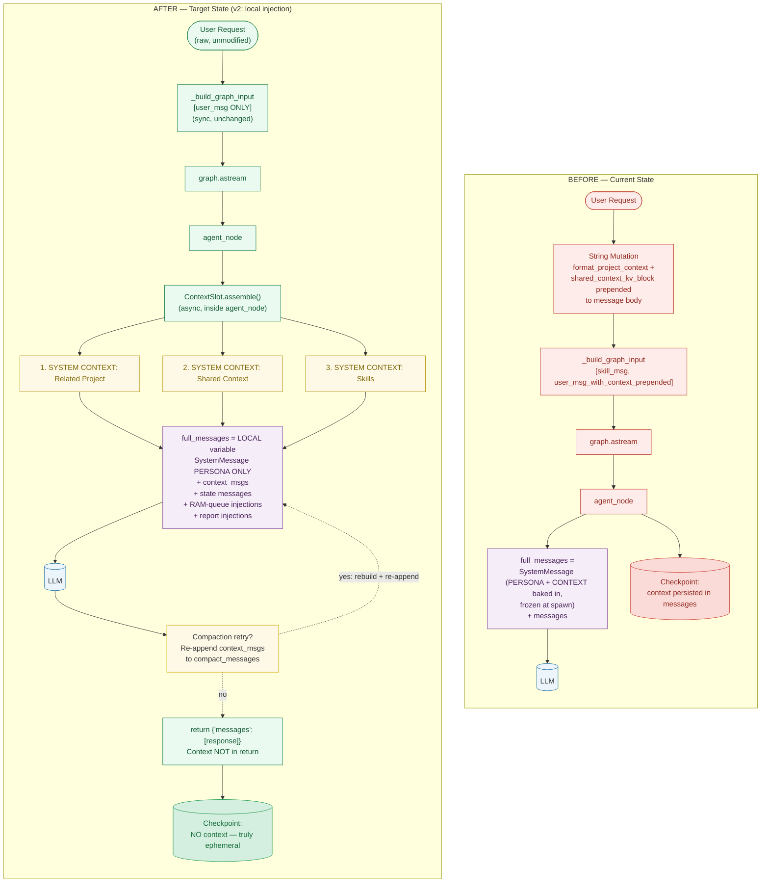
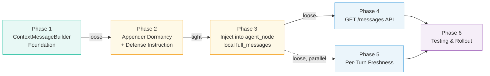
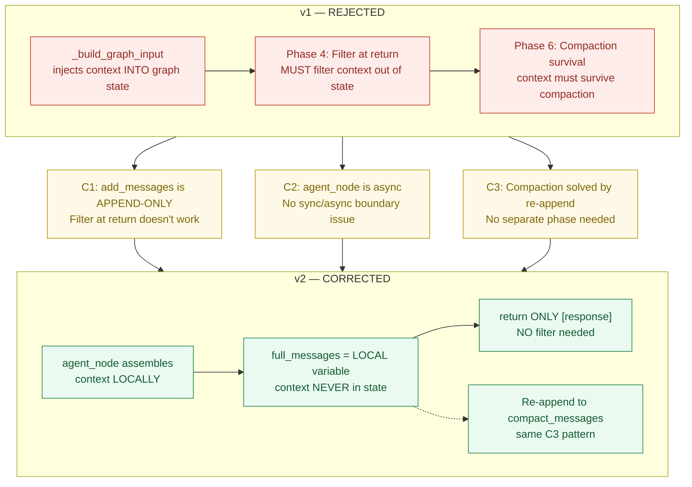

# Context Injection Restructure — Architecture Diagram (v2)

## Before vs After Flow

## Phase Dependency Graph (v2 — 6 phases)

## What Changed from v1 (Reviewer Corrections)

## Key Differences Summary

| Aspect | BEFORE | AFTER (v2) |
|--------|--------|------------|
| Context location | Baked into SystemMessage (frozen at spawn) | Local `full_messages` inside `agent_node` (ephemeral) |
| Freshness | Stale until instance respawn | Fresh every turn |
| Checkpoint | Context persisted in messages | Context NEVER in checkpoint (truly ephemeral) |
| Graph input | Mutated user message + skill msg | Clean user message only |
| Skill injection | Separate `[System Inject]` message | `[SYSTEM CONTEXT: Skills]` via ContextSlot |
| GET /messages | Context hidden in system prompt | Context rebuilt on-demand as synthetic messages |
| Compaction | Context in system prompt | Context re-appended to `compact_messages` (C3 pattern) |
| Filter needed? | N/A | NO — context never enters state |
| `_build_graph_input` | Changed in v1 | UNCHANGED in v2 |
