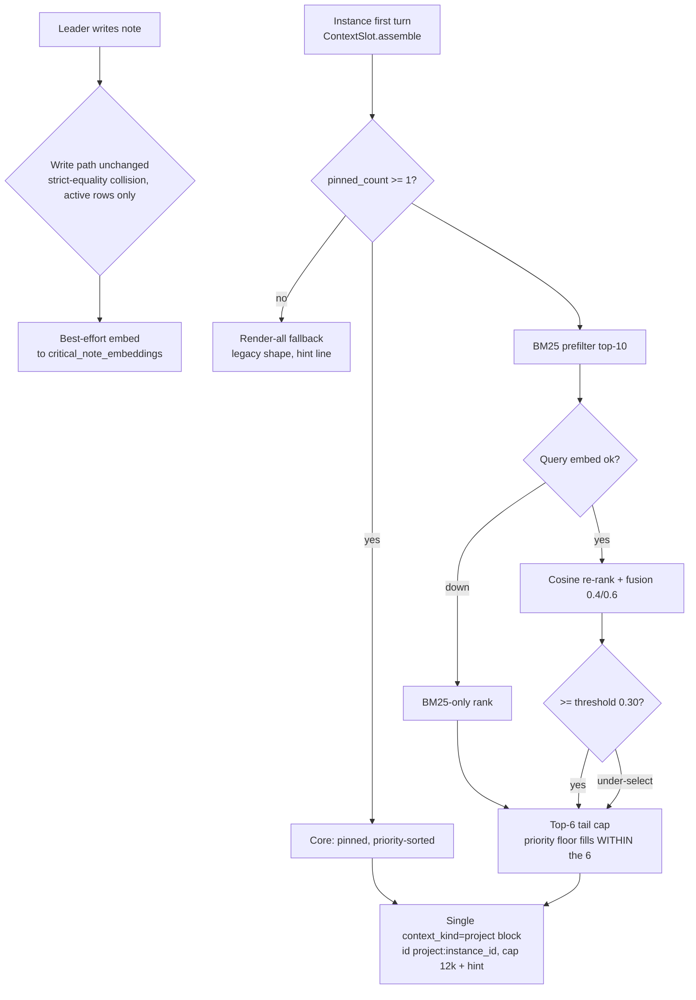

# Architecture Recommendation — Critical-Notes Retrieval & Maintenance Redesign

**v2.1 — 2026-09-15 (current).** Approver iteration-002 amendment, targeted only: (1) D3/§4.5 prompt-section reference forms corrected to the guide's **Convention v2** — same-agent `See <Section Name>`, cross-agent `See <agent>'s <Section Name>`; bare file refs AND the `file.md → Section` arrow form are forbidden (verified directly in `docs/agent-prompt-writing-guide.md:91-108`; gate: `tests/unit/tools/test_prompt_section_reference_integrity.py`); (2) §4.3 R25 scope tightened — the implementation work is plumbing `instance_id` into `build_project_context_message` (`context_messages.py:146-211`, call site `:1599`), not `_stable_id_for`. No other sections changed.

**v2 — 2026-09-15.** supersedes v1 (same path, in-place update as directed; v1 recoverable from git history).

### Revision note (v1 → v2)

- **Decisions D1–D4 locked by user ruling** and folded as RESOLVED (full ADRs: `decisions.md`): D1 Option B confirmed · D2 pinned-only core · D3 agent-managed curation + NEW concise prompt-guide workstream (section "Critical Notes Management" in the leader's tools_note surface, Phase 1) · D4 **always-on, config knobs only, no new `ENSEMBLE_*` env flag** (rollback = redeploy previous build) — the v1 kill-switch `ENSEMBLE_CRITICAL_NOTES_TIERED` is **withdrawn**.
- **All 19 reviewer conditions integrated**, tagged inline as `[#N]` (Phase-1 gate: #1–#4, #11, #15, #24, #25 · Phase-2 gate: #5, #8, #9, #12, #13, #18, #19, #22 · unconditional: #6, #7, #10, #20).
- Corrections: "never collapses below today" overstated sentence fixed to ladder-relative [#8]; C2 "≤4-semaphore" wording fixed to design-time mitigation, not existing machinery; Phase-3 gate renamed from reserved env flag to reserved config knob.
- Analyst instances (v1 fan-out, unchanged): `88aa0a13` (A heuristic) · `942801ca` (B fusion) · `8ce1f94c` (C quick-LLM) · `e895a936` (D foundation). Branch `feature/critical-notes-retrieval`, base `9db17e7d`.

---

## 1. Problem statement

The `critical_notes` table grew to a live store of ~31–40 entries (cap already raised 30→50 on 2026-09-10). `_format_critical_notes_section` (`daemon/services/context_messages.py:399-434`) renders **all entries, full text, newest-first, untruncated** into the single `[SYSTEM CONTEXT: Related Project]` message injected into every project instance's **first turn** — leader and all spawned children. That message is `context_kind=project`: permanently non-selectable, preserved verbatim, hoisted forever under the three-bucket compaction contract (`daemon/compaction.py:129-146, 191-214`), and its tokens count toward the compaction threshold numerator forever (`compaction.py:2125-2130`). Worst case ≈ 50 × (200-char summary + unbounded reference) ≈ 100k+ chars (~25–30k tokens) of permanent context pressure, growing with the store. Maintenance surface is zero: no staleness, no supersession, no aging; "superseded by…" is free text; the dead `projects.critical_notes` JSON column was never dropped.

User intent: a small **core/essential tier that always loads**; the rest loaded via **heuristic / vector-compare / quick-LLM**; **improved maintenance** — with curation performed by **agents** (D3), no user-in-chat curation round.

## 2. Resolved decisions (see `decisions.md` for full ADRs)

| ID | Decision | Owner |
|---|---|---|
| D1 | **Option B locked**: pinned core (≤8) + BM25/embedding fusion tail (top-6, 0.4/0.6 @ 0.30, top-2 floor, 12k budget, hint line), first-turn-frozen; C2 LLM stage deferred Phase 3 behind reserved **config** knob | user |
| D2 | **Pinned-only core**; `priority=critical` → ranking boost + pin suggestion, never auto-load | user |
| D3 | **Agent-managed curation**; leader curates during normal operation; NEW concise prompt-guide workstream: section "Critical Notes Management" in the leader's tools_note surface (Phase 1) | user |
| D4 | **Always-on; config knobs only; NO new env flag**; `_resolve_*` helper plumbing; boot line = INFO log; rollback = redeploy previous build | user |
| R19 | Render re-sorting scoped to **injected block only**; `project_cn_list` order unchanged; strike-through/staleness = maintenance (list) surfaces | leader |
| R20 | Collision scan (`_find_near_duplicate_entry`) excludes superseded rows | leader |
| R25 | Injected message carries stable construction-time id **`project:{instance_id}`** (option (a) adopted) | architect |

## 3. Design invariants (non-negotiable)

1. Three-bucket compaction contract for `context_kind=project` messages untouched — one block, hoisted, non-selectable.
2. **Write path keeps strict normalized-equality collision detection** (`daemon/tools/critical_notes.py:55-80`, 2026-09-10 hijack fix). Retrieval-side similarity is a different surface and allowed; nothing in this design can WRITE/merge/supersede a note. Every write/pin/supersede/archive is leader-explicit via the tool layer.
3. Leader-only write access (only `agents/leader/meta.json` allows `critical_notes`).
4. First-turn injection gating preserved (`project_injected` stamp, `instance_messaging.py:2829-2929`): selection runs once, frozen in the checkpoint for the session's life; revive reuses it.
5. Reuse over new build: `_bm25_score` fusion (BlueprintMatcher precedent, `config.py:2237-2239`), `_do_embed_call` (`skill_embedding_service.py:163-201`), `keyword_extraction` recipe, `ContextSlot.assemble` seam (`graph.py:6560-6573`), heuristic matcher shape (`context_injection.py`).
6. **Always-on activation with config-layer tuning (D4)** — the `ENSEMBLE_*` env family is NOT extended. Config booleans get explicit `_resolve_*` helpers in `load_config` to avoid the pydantic-settings init-kwarg > env inversion trap (mirror `_resolve_compaction_model`). Migrations ordered + checksummed, PG primary / SQLite compatible; graceful degradation at every stage. Rollback = **redeploy previous build** (§7).
7. Message-id invariant honored: every persisted HumanMessage carries a stable construction-time id (R25).

## 4. Recommended architecture (D1 — locked)

Foundation D + retrieval B; C2 reserved as Phase-3 plug-in.

### 4.1 Tier model (D2)

- **Core tier = pinned rows only** (`pinned=TRUE`, explicit leader action). Cap `core_cap = 8`; pinning beyond 8 → REJECT naming demotion candidates (reject-don't-evict; never auto-evict).
- `priority=critical` at write time → **pin suggestion surfaced to the leader** (in-band, via the tool response / housekeeping block) + **ranking boost and floor priority** in tail selection. Never auto-loaded.
- Store cap stays 50; core is a subset.

### 4.2 Retrieval pipeline (first turn only, frozen thereafter)

- **Query source [#12]:** the instance's **first-turn user message text** — i.e., the `user_query` plumbed to `ContextSlot.assemble` (extracted via `_extract_last_user_text`, `graph.py:6561`), truncated to `query_max_chars = 2000` for the embedding call (recipe parity, `keyword_extraction.py:392`). For spawned children this IS the dispatch prompt (task-shaped). Single source; no per-turn re-extraction (frozen). Empty/whitespace query edge → skip ranking; inject core + floor only, note in telemetry. **Cost implication:** ≤ ~500 embed input tokens per instance first turn (~$0.00001); BM25 tokenization over 2,000 chars is trivial CPU.
- **Write time (best-effort, fail-open):** embed `summary + reference[:800]` via `_do_embed_call` into new side table `critical_note_embeddings(note_id FK CASCADE, embedding, model, dims, minted_at)`. **Storage wording is dialect-neutral [#6]:** a JSON float array stored via the existing cross-driver `JSONBType` adapter (PG JSONB / SQLite TEXT-JSON) — same adapter the skill embeddings use. Embedding failure never blocks the note insert; the note ranks BM25-only until backfilled.
- **First turn** (`assemble_context_messages` first-turn branch, `context_messages.py:1542-1599`): existing `list_critical_notes` read + one JOIN-able embeddings SELECT; pinned → always; tail = BM25 top-10 → cosine re-rank (query embedding **cached per instance**, one 150–300ms call, never per-turn) → fusion ≥ 0.30 → top-6; under-selection → floor = top-2 by priority→recency. **Floor is WITHIN the cap, not additive:** the tail cap stays 6 total — the floor guarantees the top-2-priority active notes are INSIDE the 6 slots when fusion under-selects; it never extends the tail to 8. (Wording amended per Phase-2 review — the v2.0 phrasing "top-6 tail + top-2 floor" read additive.)
- **Budget:** core ≤8 · tail ≤6 · notes-section hard cap **12,000 chars** · `reference` bounded per §4.4. Worst-case injected notes budget ≈ 12k chars ≈ 3k tokens vs today's 25–30k (**~10×**), no longer growing with the store.
- **Pin-backfill gating [#8]:** per project, tiered rendering activates only when `pinned_count ≥ 1`; otherwise the project falls back to render-all (legacy shape + hint line) until the leader pins something. Boot INFO line: `[CriticalNotes] tiered=true projects_with_pins=N/M total_pinned=K`. Activation checklist item in §7.
- **Hint line (always when notes are dropped):** `(N additional notes not shown — use project_cn_list for the full view)`.

### 4.3 Injection shape, message id, and render scoping (R19, R25)

- **Single combined `[SYSTEM CONTEXT: Related Project]` block retained.** No second context-kind value; hoisting semantics unchanged. Tail freezes at first turn (checkpoint/revive reuse); mid-session additions remain invisible (preserved legacy semantic, documented).
- **Message id (R25, option (a) adopted):** the block carries stable construction-time id **`project:{instance_id}`**. The implementation work is **plumbing `instance_id` into `build_project_context_message`** (`context_messages.py:146-211`; first-turn call site `:1599`) so the builder mints the id at construction time — whether `_stable_id_for("project", …)` already stamps an id is a §9 verification question, not the implementation surface. Rationale: honors the foundational Message-id invariant — id-less persisted HumanMessages break FE merge ordering via the moving-checkpoint-ts fallback (`persistence.py:527-528`) and drop `MessageTapSlot` metadata. Per-instance determinism is revive-safe (same instance → same id) and collision-free under first-turn-frozen semantics. (Option (b) — documenting accumulate-on-revive — rejected: it ratifies a known wart.)
- **Render ordering scoped to the injected block only (R19):** pinned entries priority-sorted (critical→high→medium, recency within tier) followed by tail entries in fusion-score order. **`project_cn_list` output order stays `created_at` DESC** — tool surface unchanged. Superseded strike-through (`~~summary~~ ✅ superseded by {id}`) and staleness marks (`⚠️ last reviewed N days ago`) render in the **list/housekeeping surfaces** (maintenance features); the injected block stays clean (sorted content + hint line only).

### 4.4 Tool layer: bounds, collision scope, supersession guards

- **Reference bound, dual enforcement with precedence [#11]:** `_MAX_REFERENCE_LEN = 500` (mirrors `_MAX_SUMMARY_LEN = 200`, `critical_notes.py:40`). **Write side (authoritative):** tool REJECTs `reference` > 500 on add/update. **Injection side (defensive backstop):** any note reaching the renderer with `reference` > 500 — legacy pre-bound rows or non-tool paths — is truncated to 500 with suffix `… (truncated — project_cn_list for full text)`. Precedence rule: reject-first; truncation exists only for data that predates or bypasses the bound, never as an alternative to rejection. `detail_ref` (new, unbounded) is NEVER injected — reachable via `project_cn_list` and the router detail path (`routers/projects.py:92-107`) only.
- **Collision scope (R20):** `_find_near_duplicate_entry` scans **active rows only** (`WHERE superseded_by_id IS NULL`). Superseded rows are invisible to duplicate-rejects. Verbatim re-add after supersede inserts fresh (explicit supersede → later re-add = implicit un-supersede, visible in list). Strict normalized-equality semantics otherwise byte-identical.
- **New leader-only tools:** `project_cn_pin(entry_id, pinned)` (cap-8 REJECT with demotion candidates on the 9th pin) · `project_cn_supersede(old_id, new_id)`. **Cycle guards [#24]:** reject `old_id == new_id`; reject a SUPERSEDED row acting as superseder (`old.superseded_by_id IS NOT NULL` → refuse); both ids must be same-project. Supersede bumps `last_reviewed_at`. `project_cn_remove` refuses when another row's `superseded_by_id` targets it unless `cascade=True`. Any leader write sets `last_reviewed_at = now`.

### 4.5 Maintenance lifecycle (D3 — agent-managed)

Derived state (no stored status enum): `ACTIVE` · `PINNED` (`pinned AND NOT superseded`) · `SUPERSEDED` (`superseded_by_id IS NOT NULL` — hidden from injection, struck-through in list) · `STALE` (orthogonal: `last_reviewed_at` > `stale_days = 90` — marked in list, never auto-actioned).

- **Curation ownership [#22 — resolved by D3]:** the **leader agent** curates during normal operation — no user-in-chat round, no dedicated human session. The initial ~40-note tiering rides the LLM-assisted *proposal* (grouped by priority + operational relevance; `ACTIVATED v0.12.9`-style notes are prime supersede/archive candidates) surfaced **in-band to the leader**, confirmed via pin/supersede tools in ordinary operation.
- **Archive-candidate list:** stale set, sorted priority→oldest, surfaced to the leader as a proposal-only housekeeping block; confirmed via supersede/remove. Never auto-applied.
- **D3 prompt-guide workstream (ships Phase 1):** concise section titled **Critical Notes Management** at canonical home `agents/leader/tools_note.md` (the leader's tool-guidance surface), authored per `docs/agent-prompt-writing-guide.md` (first-person agent POV; no system internals/`daemon/` paths; one canonical home, others link). **Cross-references inside the section follow the guide's Convention v2: same-agent `See <Section Name>` · cross-agent `See <agent>'s <Section Name>` — bare file refs and the `file.md → Section` arrow form are both forbidden** (repo-wide closure-grep gate, `tests/unit/tools/test_prompt_section_reference_integrity.py`). Must teach — tightly: (1) pin discipline: core ≤8, core = always-relevant contracts/traps, NOT incident narration; (2) supersede-don't-re-add; (3) keep `reference` ≤500 (detail goes to `detail_ref` via list reads); (4) refresh `last_reviewed_at` when re-affirming a note; (5) propose archive for activated restart-pending / stale notes. Existing tool-layer guidance bloat gets trimmed in the same pass — the section replaces verbosity, not adds to it.

### 4.6 Failure modes & degradation ladder (severity-ordered; deduped across analysts)

- 🟡 **Retrieval miss of a critical tail note** (worst case). Stacked mitigations: core tier always loads (and render-all fallback when pins absent, §4.2); critical-priority ranking boost + top-2 floor; fusion threshold 0.30; hint line + `project_cn_list` recovery; per-first-turn telemetry.
- 🟡 **Embedding endpoint down.** Ladder: vector stage skips → BM25-only rank → priority floor. **Ladder-relative statement (corrected per [#8]):** degradation never blocks dispatch and never produces an empty block, but the degraded floor (top-N by priority) is **narrower in coverage than today's render-all** — coverage loss is possible and bounded, recoverable via the hint line and `project_cn_list`; projects without pins use render-all outright. This replaces v1's overstated "never collapses below today's behavior."
- 🟡 **Mid-session additions invisible (freeze).** Preserved legacy contract; documented.
- 🟡 **Compaction interplay.** Block stays non-selectable/hoisted; ~10× smaller numerator is the win; mis-pick ceiling bounded at 12k chars; no LLM in the shipped path means no confident-wrong class.
- 🟢 **Embeddings backfill window [#9]:** backfill is (a) an explicit one-shot maintenance command (`WHERE embedding IS NULL`, idempotent, ~50 × 300ms ≈ 15s) plus (b) lazy mint-on-read capped at `mint_cap_per_read = 10` per first-turn read — a bounded window, no boot stampede, no sentinel needed given idempotence. Documented choice (vs sentinel-gating) per reviewer option.
- 🟢 **Distinct degradation telemetry [#10]:** every ladder rung logs a **distinct** line under one canonical prefix — `[CriticalNotes:Degraded] stage=vector_rank reason=embed_unavailable` / `stage=query_embed reason=timeout` / `stage=floor reason=under_selection` — separate from the routine `[CriticalNotes] selected=N total=M floor_applied=bool instance=X` INFO line, so ops can alert on the prefix alone.
- 🟢 Migration hazards: dual-driver DDL split (§5, [#1]); SQLite `DROP COLUMN` ≥3.35 feature-detect [#3]; restart-required activation (frozen PyInstaller prod lineage).
- 🟢 (Phase 3 only, if C2 activates) confident wrong LLM selection hoisted forever — the reason it is deferred; activation prerequisites in §8.

### 4.7 Config knobs (D4, #15, #18 — always-on; the `ENSEMBLE_*` family is NOT extended)

Plumbing shape [#15]: `config.yaml` → `critical_notes:` block → pydantic model on `load_config` with **explicit `_resolve_*` helpers** for every boolean (init-kwarg > env inversion trap; mirror `_resolve_compaction_model`). Boot INFO state line (visibility, not a switch): `[CriticalNotes] tiered=true core_cap=8 tail_cap=6 char_cap=12000`.

**Gated-surface enumeration [#18] — what the knobs tune (defaults):**

| Knob (`critical_notes.`) | Default | Tunes |
|---|---|---|
| `tiered` | `true` | feature shape: tiered load vs render-all fallback shape for pin-bearing projects (always-on; not a runtime kill-switch) |
| `core_cap` | `8` | max pinned notes; 9th pin REJECTs with demotion candidates |
| `tail_cap` | `6` | max selected tail notes per first turn |
| `section_char_cap` | `12000` | hard char cap on the notes section of the injected block |
| `fusion_bm25_weight` / `fusion_vector_weight` | `0.4` / `0.6` | fusion weights (BlueprintMatcher parity) |
| `fusion_threshold` | `0.30` | minimum fusion score for tail selection |
| `floor_count` | `2` | priority floor size when fusion under-selects |
| `reference_max` | `500` | tool-reject bound + injection truncation bound [#11] |
| `query_max_chars` | `2000` | query truncation for embed/BM25 input [#12] |
| `stale_days` | `90` | staleness horizon for STALE marking + archive candidates |
| `mint_cap_per_read` | `10` | lazy embedding mint cap per first-turn read [#9] |
| `llm_select` | `false` | **reserved Phase-3 knob** (C2 stage; ships false/unimplemented until Phase 3) |

**Rollback story (D4):** no runtime flag exists to flip; rollback = **redeploy the previous build**. State this in the release notes for both PRs.

### 4.8 Cost & latency

| Operation | Cost / latency |
|---|---|
| Note write (leader, rare) | +1 best-effort embed ≈ 250ms, ~$0.000004 |
| First-turn selection | 1 cached query embed 150–300ms (~$0.00001, ≤~500 input tokens [#12]) + BM25/cosine <6ms + 2 SELECTs |
| Turn 2+ | zero (frozen block) |
| One-time backfill | ~15s embeddings + leader's in-operation tiering confirm (D3) |
| Worst-case injected notes budget | ~12k chars (~3k tokens) vs 25–30k today |
| **Fan-out latency line [#13]** | N concurrently spawned children issue N first-turn embed calls — **parallel, not serialized** (one per instance, cached thereafter, zero per-turn). Each child's first-token latency shifts by ~one embed RTT (150–300ms); the ceiling is the embedding endpoint's concurrency/rate limit. Soak watch: first-token latency delta under a ≥10-child fan-out; if the endpoint rate-limits, degradation ladder (§4.6) applies per instance. |

## 5. Schema delta + migration sketch

### 5.1 `critical_notes` additive columns

| Column | Type | Default | Notes |
|---|---|---|---|
| `pinned` | BOOLEAN | FALSE NOT NULL | leader explicit pin |
| `pinned_at` / `pinned_by` | TEXT | NULL | audit |
| `superseded_by_id` | TEXT | NULL | FK-self; permanent until explicit remove |
| `last_reviewed_at` | TEXT | `= created_at` at backfill, NOT NULL | staleness numerator; any leader write sets now |
| `detail_ref` | TEXT | NULL | unbounded detail; NEVER injected; list/router reads only |

New table `critical_note_embeddings` via `create_all` (new-table-only; no hot-table DDL, no ordered SQL migration needed). Storage dialect-neutral per §4.2 [#6].

### 5.2 Migration 1 — `20260915_120000_critical_notes_lifecycle.sql`

**DDL split [#1]:** the `.sql` files carry **plain `ADD COLUMN` statements** (no `IF NOT EXISTS`) — idempotency comes from the ordered + checksummed migration ledger (single-application guarantee). **`IF NOT EXISTS` variants live ONLY in the PG `_ensure_postgres_columns` mirror** (`manager.py:4978-5013` pattern), which covers PG databases whose lineage is `create_all`-shaped rather than migration-shaped.

- UP: five plain `ADD COLUMN` statements; then `UPDATE critical_notes SET last_reviewed_at = created_at WHERE last_reviewed_at IS NULL` — **explicit NULL-guard makes the backfill idempotent and preserves any value set between DDL and backfill [#7]**; then two partial indexes: `ix_critical_notes_pinned ON critical_notes(project_id, pinned) WHERE pinned = TRUE` and `ix_critical_notes_superseded_by_id ON critical_notes(superseded_by_id) WHERE superseded_by_id IS NOT NULL`.
- **PG index mirror [#5]:** partial indexes with `WHERE` clauses are not expressible via SQLModel/`create_all`; the `_ensure_postgres_columns` mirror additionally issues `CREATE INDEX IF NOT EXISTS … WHERE …` for both, so both PG lineages (migration-run and create_all) converge on the same indexes. SQLite receives them from the `.sql` via the runner.
- DOWN: symmetric drop of columns + indexes.
- **Dual-surface model update, same commit [#4]:** SQLModel fields (`models.py:145-159`) + `to_dict()` keys (`:161-173`) + the Pydantic/router response surfaces (`routers/projects.py` note payloads) land in the SAME commit as the migration — no window where the wire shape and the storage shape disagree.

### 5.3 Migration 2 — `20260915_120001_drop_projects_critical_notes_json.sql`

**PG drop path is explicit (not re-scoped) [#2]:** UP = `ALTER TABLE projects DROP COLUMN critical_notes;` — PG has supported `DROP COLUMN` since forever; this executes unconditionally on PG. **SQLite version feature-detect [#3]:** the migration declares a driver precondition evaluated before execution — parse `SELECT sqlite_version()`, semver-compare against **3.35.0**; on older SQLite the runner records a skip marker in the ledger (so the migration never re-fires) and logs a WARN that the harmless dead column is retained. Mechanism lives runner-side as a declared precondition on the migration record (implementation may inline the check; the contract is: skip-with-ledger-marker, never fail boot, never re-fire). DOWN = `ALTER TABLE projects ADD COLUMN critical_notes JSON DEFAULT '[]'` (PG; SQLite re-add gated on the same precondition).

### 5.4 Backfills

- **Embeddings [#9]:** explicit one-shot maintenance command (idempotent `WHERE embedding IS NULL`, ~15s) + lazy mint ≤10/read. LLM calls never live inside SQL migrations.
- **Tiers (D3):** LLM-assisted proposal surfaced in-band to the leader; confirmed via tools during normal operation. Nothing auto-applies.

## 6. Decisions — all RESOLVED

v1's three Decisions-Pending are closed: criticals⇒core → **D2 pinned-only** (user); backfill ownership → **D3 agent-managed** (user); Phase-3 go/no-go → post-soak telemetry review (§7 Phase 3 exit). ADRs in `decisions.md`.

## 7. Phased rollout (always-on per D4)

| Phase | Contents | Activation | Gate |
|---|---|---|---|
| **1 — Foundation + curation guide** | Migrations 1+2 (§5, all Phase-1 conditions); pin/supersede tools with cycle guards + cap-8 REJECT + R20 collision scope; `reference ≤500` dual enforcement [#11]; `detail_ref`; **D3 workstream: "Critical Notes Management" concise section in the leader's tools_note surface + tool-guidance de-bloat**; config knobs + `_resolve_*` plumbing + boot INFO line [#15]; priority-sorted injected render (R19); strike-through/staleness in list surfaces; tier proposal surfaced to leader. Injection still renders all non-superseded (bounded references alone cut worst case ~100k→~35k chars) | restart-required; **always-on, no flag**; rollback = redeploy previous build (state in release notes) | Reviewer Phase-1 set: #1 #2 #3 #4 #11 #15 #24 #25 — all addressed above |
| **2 — Compute selection (B)** | `critical_note_embeddings` + write-time embed; cached query embed (#12 source); BM25→fusion→top-6 + floor; 12k budget; degradation ladder + `[CriticalNotes:Degraded]` telemetry [#10]; hint line; pin-backfill gating `pinned_count ≥ 1` + boot `pinned_count` line [#8]; embeddings backfill window [#9]; fan-out soak watch [#13] | restart-required; always-on; rollback = redeploy previous build | Reviewer Phase-2 set: #5 #8 #9 #12 #13 #18 #19 #22 — all addressed above |
| **3 — Optional LLM stage (C2)** | Quick-LLM select over the Phase-2 shortlist behind reserved `critical_notes.llm_select` knob (default false); ~15s timeout via recipe `timeout_s`; id-intersection guard; critical floor outside LLM authority; cap 12; **bounded-concurrency selection as a design-time mitigation to build (not existing machinery)**; own degradation line | post-soak decision; exit criteria: floor_applied rate, hint-follow-up (`project_cn_list`) rate, degraded-prefix frequency from Phase-2 telemetry | — |

**Activation checklist (Phase 2):** (1) boot line shows `projects_with_pins ≥ 1` for the target project — else the project stays on render-all fallback by design [#8]; (2) `[CriticalNotes:Degraded]` absent in a clean-window sample; (3) first-token latency delta under a small fan-out within the §4.8 bound; (4) embedding backfill command completed (or lazy-mint observed topping out ≤10/read).

**Backward compat:** in-flight sessions keep checkpointed blocks (freeze semantics); new instances take the new path; rollback at any boundary = previous build redeploy (D4).

## 8. Phase-3 (C2) activation prerequisites — deferred design notes

C2 = B + a final LLM stage selecting among the BM25/embed shortlist (worker C analysis, `8ce1f94c`). If activated: `model_keywords` reused (no new model knob); JSON id-array output with intersection guard (parse failure / >50% unknown ids / >12 ids → total failure → Phase-2 ladder); empty selection legal only for the non-critical pool; **bounded concurrency for parallel child launches is a mitigation to design then — v1's "≤4-semaphore" wording referred to a proposed cap, not importable machinery (corrected)**; the confident-wrong-pick risk (hoisted forever) is why this stage ships only after Phase-2 soak proves the compute ladder insufficient.

## 9. Open verification items (implementation-phase)

- `_bm25_score` import-reuse: per-call safety of signature/IDF state (worker B).
- Tail-block merge timing into the persistent first-turn message and child-instance embedding-cache independence (worker B).
- Live priority distribution (critical count → floor sizing) and leader-only exclusivity re-grep across all metas (workers C, D).
- SQLite version floor on legacy dev machines (drives whether Migration 2's skip branch ever fires) (worker D).
- R25: confirm whether `_stable_id_for("project", …)` already stamps an id; the implementation surface regardless is the `instance_id` plumbing into `build_project_context_message` (`context_messages.py:146-211`, call site `:1599`).
- Ambient-KV per-turn `_fetch_project_payload` full-notes fetch used only for `project.name` (`context_messages.py:1488-1494`) — orthogonal waste, queued for a tidy pass (worker C, 🟢).
- D3 guide authoring: check the leader's tools_note surface inventory to place the Critical Notes Management section without duplicating existing tool guidance (one-home rule); verify every cross-reference written into the section resolves to a real heading and contains no file tokens (Convention v2 closure check).

## 10. Evidence index

Verified by the v1 analyst fan-out against base `9db17e7d`: `daemon/repositories/project/models.py:145-173` · `daemon/repositories/project/repository.py:1456-1580` · `daemon/tools/critical_notes.py:39-268` · `daemon/services/context_messages.py:85-110, 146-211, 399-434, 1337-1599, 1473, 1488-1494` · `daemon/services/instance_messaging.py:2829-2929` · `daemon/services/context_injection.py:79-121, 812-953` · `daemon/services/skill_search_service.py:182, 383-456` · `daemon/services/skill_embedding_service.py:163-201` · `daemon/services/keyword_extraction.py:33, 327-431` · `daemon/compaction.py:129-146, 191-214, 2125-2130` · `daemon/graph.py:6560-6573` · `daemon/config.py:149-157, 1662-1713, 2237-2239` · `daemon/manager.py:4978-5013` · `daemon/persistence.py:527-528` · `daemon/services/message_tap.py` · `daemon/migrations/` conventions · `docs/agent-prompt-writing-guide.md:91-108` (Convention v2 reference forms, read directly for v2.1) · `agents/leader/tools_note.md` (section inventory).
