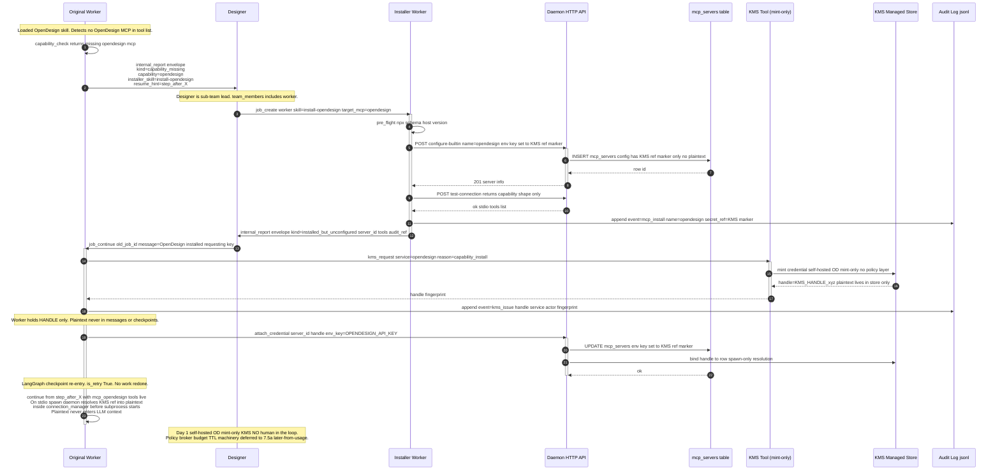

# Designer Agent — Integration Architecture & Workflows

**Status:** RATIFIED 2026-09-26 — six decisions folded (D1–D6 below); amendments applied where they supersede the original recommendations. Ready for implementation planning. Docs-only effort; no implementation in this document.
**Date:** 2026-09-26 (original recommendation + same-day ratification fold-in)
**Base:** worktree `feature/designer-agent-design` @ `e67e5cd8` (branch of `latest`)
**Method:** Standard Design — 4 skill-equipped worker analyses (structural-design, data-flow-design, trade-off-analysis ×2 reports, resilience-design) + 3 read-only wanderer survey passes + architect grounding + **user ratification of six decisions (authoritative where amending)**.
**Constraint drivers:** AGENT-FIRST (machine-consumable artifacts, agent-to-agent communication primary); SELF-PROVISIONING SUB-TEAM TOOLING + KMS (general patterns, OpenDesign as first instance).

---

## 1. Context

The ensemble daemon has 37+ registered agents and **no UI/UX design owner**. The gap is load-bearing: tester defers visual-quality issues to a "design review" that has no owner (`.agents/tester/RESULTS/2026-09-09-mermaid-chart-ui.md:117`; `.agents/shared/planning/parallel-chunked-compaction/architecture-recommendation.md:147`). The project ships an Angular 21 frontend with **12 routed pages** (`frontend/src/app/pages/`: blueprint, chat, home, instance-detail, instances, jobs, plan, schedules, settings, skill-bank, skills, workspace).

This document designs the integration of a new **`designer`** agent: its anatomy, model wiring, three operating workflows, visual operating mode, image comparator, image-artifact substrate, and the self-provisioning sub-team tooling pattern (self-hosted OpenDesign MCP as first instance) with a mint-only KMS.

---

## 2. Ratified Decisions at a Glance

| # | Decision | RATIFIED outcome (amendment noted) | Was recommended as |
|---|----------|-----------------------------------|--------------------|
| D1 | Agent anatomy | **AMENDED — craft-class hybrid (like coder), NOT fence-limited.** Expert designer + sub-team lead over workers; works directly AND shards to skill workers (parallel/pipeline/load-share). Write boundary = **C+ BROAD** (project files incl. docs dir, design dir). "No app-code implementation" = **soul-level convention (judgment), not a deny-list.** | fence-limited specialist with `deny: [edit_file, write_file]` |
| D2 | Model | **NEW DECISION — `llm_model: "vision"`**; generalize `caller_model_overrides` into the spawn service chain so any sub-team lead can override child models; operative config change = add `vision` to the **daemon-global** `allowed_models` + restart (intent "worker allowlist", mechanism exact). | (pool `coding2:coding` — superseded) |
| D3 | Reuse + improve | **tmp_images store = canonical image substrate** (provenance tags, agent-facing save/list/get tools, protected retention class for design baselines); **OpenDesign-as-MCP** for design-phase render (zero new plumbing); two genuine builds: capture tool (**verify OD `agent-browser` skill adoption first — may close the gap for free**) + comparator facade. | new `DesignImageStore` + daemon Playwright pool |
| D4 | Comparator | **Build day-1, parallel with capture (zero code dependency).** `compare_images(a, b, criteria?)` → structured findings; **paths-in** via path→data-URI bridge; vision model; separate specialist agent with a "judge against criteria" soul. | same placement, timing was post-GAP-1 |
| D5 | KMS | **SIMPLIFIED — mint-only KMS-Lite.** No policy layer (no allowlist/budget/TTL sweeps); hard-coded sane defaults; **self-hosted OpenDesign — no third-party keys day 1**, auto-installed via the bootstrap flow. Keeps: handles-not-secrets, `__KMS_REF__` injection at the MCP stdio seam, minimal audit line per issue. Broker/policy/TTL machinery → "later, from real usage" (§7.5a). | full KMS with policy store + brokered third-party path |
| D6 | Spec front-matter | **Option B — exactly ONE hard rule: pinned spec SHA.** Every conformance verdict must reference an immutable spec version. All other front-matter = advisory, lint warnings only. | front-matter discipline with unfunded enforcement gap |

---

## 3. Decision 1 — Agent Anatomy (RATIFIED-AMENDED: craft-class hybrid)

### 3.1 Wiring: two proven templates, staged

| | Template | Mechanics | Verdict |
|---|---|---|---|
| **A** | Team-phase member (architect pattern) | `"designer"` added to `agents/leader/meta.json` `team_members` (14→15); leader dispatches `spawn_instance` + `send_message(load_skill, context)`; async report-back revives leader turn | **v1 — adopted** |
| **B** | Tool-backed facade (charter pattern) | `"design": ["designer"]` entry in `TOOL_REQUIRED_AGENTS` (`daemon/tools/_auth.py:35-40`); `create_design_tools()` factory (modeled on `chart_tools.py:374`); blocking `invoke_agent_and_wait` (600 s, never-raise); reuse-by-discovery via `invoked_as_tool` stamp (`chart_tools.py:67-145`) | **v2 — designed, deferred** |

Staging rationale unchanged: conformance/self-provisioning are multi-turn conversations (persistent team-member instances beat 600 s blocking calls); no facade precedent carries two channels; the facade composes later with one registry entry + one tool module.

### 3.2 Craft-class identity (ratified)

Designer is **CRAFT-class, like `coder`**: an expert who works directly AND shards load to skill-carrying workers (`coder` precedent: "implements directly, and opportunistically offloads clean bulk partitions to workers" — `agents/coder/meta.json`). Sub-team lead responsibilities (D5 bootstrap flow) ride on top. **No technical write fence**: write boundary is **C+ BROAD** — project files including docs dir, design dir, project files. "No app-code implementation" is a **soul-level convention enforced by judgment and the conformance-review social contract**, not a `tools.deny` entry — designer may touch any project file, and *chooses* not to implement app code (that is developer's lane), escalating genuine implementation needs instead.

```
agents/designer/
├── meta.json        # mandatory — draft below
├── soul.md          # ~80 lines: identity + THE judgment rule — "I design and review; implementation belongs to developer.
│                    #   I may read/annotate any project file; I do not land app-code changes." (soul-level, not deny-list)
├── rule.md          # ~40 lines: validate spec vs brief acceptance criteria; NEEDS MORE INFO on thin briefs (charter/rule.md:12 precedent);
│                    #   never claim pixel fidelity for text mockups; sharding discipline (what partitions go to workers)
├── workflow.md      # ~100 lines: brief → enumerate acceptance criteria → (gap? NEEDS MORE INFO) → work directly or shard →
│                    #   spec sections (IA → components → tokens → a11y → wireframe → tradeoffs) → self-review → return
└── tools_note.md    # ~60 lines: tool semantics; image substrate conventions (tmp_images provenance tags); sub-team dispatch discipline
```

### 3.3 `meta.json` draft (ratified shape)

```json
{
  "id": "designer",
  "name": "Designer",
  "description": "Expert UI/UX designer and sub-team lead — works directly and shards to skill workers; agent-first specs, conformance reviews, and design-system stewardship",
  "icon": "🎨", "color": "accent-pink", "version": "1.0.0",
  "llm_model": "vision",
  "innate_skills": ["dynamic-skill", "todo"],
  "skill_injection": true,
  "no_force_explore": true,
  "recursion_limit_multiplier": 7,
  "tools": {
    "allow": ["bash", "proc", "filesystem", "time", "self", "help",
               "image", "knowledge", "mcp", "context", "shared_meta_kv",
               "instance", "service", "midflight", "dynamic-skill"]
  },
  "context_injection": { "heuristic_match_shared_md_files": true },
  "team_members": ["worker"]
}
```

- **No `deny` key** — C+ BROAD write access per ratification (coder-shaped allow list + `image` + `mcp` + `dynamic-skill`).
- **`llm_model: "vision"`** — see §3.4.
- **`team_members: ["worker"]`** — sub-team lead spawn authority (installer + original workers, D5). Charter/image-reader access rides tool-category implication (`_auth.py:144-146`), not team membership.
- **`skill_injection: true`** — designer IS the pattern worker AND shards skill work (WCAG, tokens, component libraries).
- **`instance` in allow** — sub-team lead requires `spawn_instance`/`send_message`/`job_continue`.

### 3.4 Model wiring (D2 — new ratified decision)

- **Designer itself:** `llm_model: "vision"` — a single named model slot, not a weighted pool (supersedes the original pool recommendation).
- **Generalize `caller_model_overrides`:** today a caller→agent model-override map exists inside the knowledge tool path (`daemon/tools/knowledge_tools.py:723-790`). Verified plan: **move the map lookup into the spawn service chain** (`daemon/services/instance_lifecycle.py:1780-1829`) so ANY sub-team lead can override its children's models (designer→worker = `vision`), inheriting the existing validation/notice/persistence/restore machinery for free.
- **Precedence chain (document; enforce at the spawn seam):**
  `model_tier` > spawn `model=` > parent-map (`caller_model_overrides`) > `llm_models` pool > `llm_model` > global default.
- **`allowed_models` reconciliation (intent preserved, mechanism exact):** the user intent was "add vision to worker's allowlist" — verified reality: `allowed_models` is **daemon-GLOBAL config** (`config.yaml:82` / env `OPENAI_SELECTABLE_MODELS`, exact-match, currently `agentic,coding,coding2`), not per-worker. **Operative change: add a global `vision` entry + daemon restart.**
- 🔴 **Silent-fallback risk if omitted:** `spawn_instance(model=…)`/overrides resolve to the default model *silently* when the target is not in the global `allowed_models` — if `vision` is missing from the list, designer and its workers quietly lose vision capability with no error. The global entry + restart is a hard prerequisite, not a nicety.

### 3.5 Constraints that shaped the design (all verified)

| Constraint | Site | Impact |
|---|---|---|
| One-shot boot discovery | `registry.py:536-571` | dir must land before restart; hot-add impossible |
| Child cap 50 / instance | `config.py:546` | designer's sub-team fits comfortably |
| LLM concurrency 10 daemon-wide | `config.py:549` | each live designer/worker instance consumes a slot |
| Invoke semaphore = `max(1, WORKER_POOL_SIZE-1)` = 4 | `utils.py:591-603` | all blocking tool-facade calls (charter, image-reader, comparator) share 4 slots |
| Project workdir confinement | `image_tools.py:429-444` | image reads via `explain_image` confined to project workdir |
| Revive semantics | `instance_messaging.py:1486-1510`; revive-once guard `instance.py:2976-3004` | COMPLETED revives are FREE; ERROR/FAILED revives consume a one-revive budget |
| PAUSED rejects agent-tool sends | `instance.py:2998-3004` | resume lane is `job_continue`, not `send_message` (§7.3) |

---

## 4. Decision 2 — Workflows & Artifacts (unchanged by ratification except D6 front-matter rule)

### 4.1 Mockup format verdict (the crux)

**LLM agents cannot author pixels.** Text-native, agent-parseable forms, layered by fidelity/cost:

| Form | Use | Verifiability |
|---|---|---|
| Markdown spec + acceptance criteria | Contract of record | Agent-parsed both directions (universal in `planning/`) |
| Mermaid via `generate_chart` → charter | Flows, states, navigation | Syntax-validated by charter; renders in chat UI |
| ASCII wireframe (fenced block) | Layout, placement | Cheap; developer implements |
| HTML/SVG fragment developer renders | Machine-verifiable visual form | Playwright capture → tmp_images substrate (D3) → comparator (D4) |

**Default rule:** markdown spec + ASCII wireframe + optional mermaid; HTML fragment when pixel-intent justifies the capture cost.

### 4.2 Artifact storage (agent-first: fixed filenames, blind-citable)

- **`.agents/shared/design/{feature}/` — REJECTED** (new namespace; breaks the 142-dir shape). **`planning/{feature}/design/` — ADOPTED.**
- **Image binaries (screenshots, baselines, captures) → tmp_images store (D3 canonical substrate)** with provenance tags; **text mockups (`.asc`, `.mmd`, `.html` source) → `planning/{feature}/design/mockups/`** as before.
- **Design tokens canonical at `frontend/design-tokens/`** (never `.agents/shared/` — dual-write rejection); read-only mirror: `docs/design-system.md`.

| Filename | Producer → Consumer | Purpose |
|---|---|---|
| `design-spec.md` | designer → developer + tester | component-by-component spec + pack-mapped ACs (§4.4) |
| `mockups/` (text forms) | designer → developer | wireframes, mermaid source, HTML fragments |
| `design-review.md` | designer (conformance) → leader | findings per component, `conformance_iter` tagged, **must cite `pinned_spec_sha` (D6 hard rule)** |
| `ux-audit.md` | designer (flow b) → developer | P0/P1/P2 findings + token/page blast radius |
| `decisions.md` | designer + leader → all | incremental amendment log |
| `install-audit.jsonl` | installer/KMS actors → all | append-only environment-mutation audit (§7.4) |

### 4.3 The three workflows

**(a) Feature flow — spec → implement → conform**
- **Entry:** leader Implementation workflow routes "primary artifact is UI/UX" to designer before developer (`agents/leader/workflow.md:242-252`); trivial cosmetic edits skip designer (`:258-262`).
- **Dispatch:** `spawn_instance("designer")` + `send_message(context={files, notes, plan_ref, conventions})`; enqueue lane (`instance.py:2946-2951`) — leader ends turn, report revives.
- **Conformance review (dual channel):** (1) code reading — designer reads Angular components (read-only judgment per soul rule); (2) visual proof — captures land in the tmp_images substrate; designer inspects via `explain_image(path)` (text-out) or pixels-at-dispatch (`invoke_agent_and_wait(images=…)` → per-turn vision routing, `graph.py:7573-7595`; daemon-global `model_vision`, fail-fast 400 if unset). Day-1 comparator (D4) consumes the same substrate paths.
- **Loop budget:** 3 conformance iterations (mirrors `leader/workflow.md:316-319`), then escalate to leader with remaining diffs.
- **States:** `draft → approved(spec-frozen, pinned_spec_sha) → implemented → conformance{passed | fail-looped(n≤3)} → escalated`. **Every conformance verdict references the immutable `pinned_spec_sha` (D6).**

**(b) UX-fix flow — complaint → audit → spec → developer**
- **Entry:** leader Debug workflow Phase 1.5 classifies UI/UX → designer (`leader/workflow.md:459-466`).
- **Screenshot channel (two-channel gotcha — verified):** clipboard `tmpimg://` refs convert to **text descriptions** on the chat path (pixels cleared — `daemon/routers/messages.py:269`; `tmp_image_converter.py:128`); direct base64 `images=[data_uri]` reaches vision routing. Leader relays conversion text inline + the ref/path; designer re-digests via `explain_image`. `tmp_images` is public-by-obscurity (`conventions.md:16-19`).
- **Skip rule:** unambiguous text-only fixes go straight to developer. **Output:** `ux-audit.md` → spec handoff → developer implements.

**(c) Design-system maintenance flow**
- **Triggers:** tester visual-drift failure → leader conformance loop; designer-initiated audit at phase boundaries/on request (no daemon cron — noted gap); pre-release sweep before merge to `latest`.
- **Propagation:** scoped change spec naming changed tokens + importing page files; regression expectations as pack-mapped requirements; styles ride the `styles.scss`/`app.scss` import chain.
- **States:** `detect → token-spec → pages-impl(developer) → regression(tester) → shipped | rollback`.

### 4.4 Structured spec skeleton (D6: ONE hard rule)

Agents parse reliably today: markdown fixed headers + tables + checkbox lists; pack-mapped ACs reuse the `ensure.md` `Validation:` convention verbatim.

**Hard rule (D6):** `pinned_spec_sha` — set at `status: approved`; **every conformance verdict must reference it**. All other front-matter (component schema, criteria format, naming) = **advisory, lint warnings only**.

```markdown
---
spec_id: feature/<slug>-design
status: draft|approved|implemented|conforming-passed|conforming-failed-loop<n>
pinned_spec_sha: <git SHA at status=approved>   # THE hard rule (D6)
owners: {spec: designer-*, implement: developer-*, check: tester-*}     # advisory
---
# <Feature> — Design Spec
## Component-by-component guidance        # advisory structure
### <Component>
- Purpose / behavior / states / a11y; wireframe path
## Acceptance criteria (pack-mapped)
- [ ] AC-A1: <observable behavior>
      Validation: pack frontend_playwright_sweep_a; static: grep <pattern>
## Token/style references (flow c)
## Traceability
| Spec § | Implementation file | AC | Conformance check |
```

### 4.5 In-flight state exposure & handoff contract (agent-first)

- **Primary: `shared_meta_kv`** — keys `design.<task-id>.{phase, artifact_path, pinned_spec_sha, conformance_iter, heartbeat_at}`; phase transitions + ≤15 min heartbeat. Secondary: `decisions.md`.
- **Per-edge handoff** (self-contained; inline slice = decision-relevant subset; paths by reference): leader→designer brief (task_id, phase, pinned_spec_sha on re-conformance, escalation_path); designer→developer (task_id, pinned_spec_sha, AC IDs in scope, token_change_set, blast_radius, do_not_touch); developer→designer (commit_sha, diff_stat, pages_changed, conformance_iter, capture paths); designer→tester (pack_list AC→PACKS.md, regression_pages); tester→designer (pack_name, page_url, capture path, failed AC ID).

---

## 5. Decision 3 — Visual Operating Mode + Image Substrate (RATIFIED: reuse + improve)

**VERDICT (stands): vision-first NOT viable as an autonomous loop today — text-first with vision assist as the interim operating mode.** Vision routing is per-message and passive (`graph.py:7589`); the pipeline acquires no visual artifact on its own. The ratified D3 changes **how the gaps close** — reuse first, build second:

### 5.1 tmp_images store → canonical image substrate (ratified)

The existing tmp_images store (`daemon/services/tmp_image_store.py`; 1 GiB/30-day, `<data_dir>/tmp_images/`) becomes the **canonical image substrate** — NOT a new DesignImageStore. Upgrades (all reuse-shape):
- **Provenance tags:** `{feature, page, version, source_agent}` sidecar metadata per image (verified store facts to design against: sidecar schema; extensionless-tolerant magic-byte reads; **data-dir/workdir deployment caveat** — the store lives in data_dir while `explain_image` local reads are workdir-confined, so a **path→data-URI bridge** is required for agent access; 404-gated listing semantics).
- **Agent-facing tools:** `image_save / image_list / image_get` (path-addressable, provenance-queryable).
- **Protected retention class:** design baselines are **never swept mid-project** — a retention class distinct from the 30-day clipboard sweep.

### 5.2 OpenDesign-as-MCP for design-phase render (ratified)

Design-phase rendering (mockup → visual) rides **OpenDesign as a BUILT-IN MCP** through the existing `mcp_servers` mechanism — zero new render plumbing (closes GAP-4 by reuse). Self-hosted OD installs via the D5 bootstrap flow.

### 5.3 Gap list (amended by ratification)

| # | Gap | Status after D3/D4 ratification |
|---|-----|----------------------------------|
| GAP-1 | Screenshot capture of the running app | **Build = capture tool, BUT FIRST verify OD `agent-browser` skill adoption once self-hosted OD is installed** (wanderer: agent-browser is an OD-shipped skill — the `agents/developer/rule.md:79-84` lore may materialize for free). May close the gap with zero daemon code. |
| GAP-2 | Persistent image store | **RESOLVED-BY-D3** — tmp_images substrate with provenance + protected retention class (§5.1). |
| GAP-3 | Agent-to-agent image passing on `send_message` | Mitigated operationally by path-references + substrate + pixels-at-dispatch; param extension still open (§10). |
| GAP-4 | Mockup→image render pipeline | **RESOLVED-BY-D3** — OpenDesign-as-MCP (§5.2). |
| GAP-5 | Image-diff tooling | Green — vision-model semantic judgment via comparator (D4); pixel-diff stays net-new-if-ever. |

**Interim mode (unchanged):** designer reads Angular templates/CSS text-first; vision assist on user screenshots (base64 dispatch) and captures (substrate paths → `explain_image` text-out, or pixels-at-dispatch). Text-out is agent-first by construction.

---

## 6. Decision 4 — Image Comparator (RATIFIED: day-1, parallel with capture)

**Placement (stands): separate specialist agent `image-comparator` behind a `compare_images(image_a, image_b, criteria?)` tool facade** — the system's established specialist shape; dedicated evolvable "judge against criteria" soul (vs repurposing image-reader's generic "describe" soul); charter's reuse-by-discovery adoptable verbatim for refinement turns.

**Timing (amended): build day-1 in parallel with the capture work — zero code dependency between them.** Until capture (or agent-browser adoption) lands, the comparator serves user-supplied pairs and OD-rendered mockup-vs-capture pairs that exist on the substrate.

**I/O contract:**
- **Paths-in:** both images addressed as substrate/workdir paths; the facade runs the **path→data-URI bridge** (§5.1) and passes `images=[a, b]` in one vision call (multi-image per message is tested: `instance_messaging.py:113-128`; `test_vision_routing.py::TestMultipleImages`).
- **Out: structured findings — never an image:** per-criterion pass/fail, severity (`critical|major|minor|nit`), evidence lines, verdict (`pass|fail|conditional_pass`), summary. Report-pipeline delivery = first-class citable artifact.
- Requires `model_vision` configured + `vision` in global `allowed_models` (D2).

**Five-axis record (why agent over tool/skill):** A=4.00 / C=3.60 / B=2.20 — maintainability (dedicated soul) and risk (proven spawn pattern) dominate; flip conditions recorded for A→C consolidation (semaphore saturation >10/day; image-reader `comparison_mode`; native proxy multi-image).

---

## 7. Decision 5 — Self-Provisioning Sub-Team Tooling + KMS-Lite

### 7.1 Capability detection (fail fast, before main work)

Skill manifest front-matter on dynamic skills that need external capabilities:
```yaml
requires:
  mcp: [opendesign]
  tools: [bash]
  env: [OPEN_DESIGN_LICENSE]
```
Pre-flight `capability_check(capability_id)` is the first instruction of the skill body — before any LLM turn: (1) `mcp_servers` lookup (`models.py:12-33`, `is_active=true`); (2) `tools.allow`; (3) env presence. Miss → escalation envelope.

### 7.2 Escalation contract (agent-first, exact schema)

Worker → designer via the `internal_report:{iid}:{mid}` child-report lane, `Result:`-prefixed JSON:
```json
{"kind":"capability_missing|installed_but_unconfigured|policy_denied",
 "capability":"opendesign", "installer_skill":"install-opendesign",
 "detection_evidence":"pre_flight: mcp_servers.query(name=opendesign) -> None",
 "blocker_scope":"this_turn|this_task", "resume_hint":"step_after_X",
 "policy_denied_reason":null, "ts":"ISO-8601"}
```
Day 1 (mint-only, self-hosted): `capability_missing` → spawn installer; `installed_but_unconfigured` → mint key + resume. The `policy_denied` kind **remains in the schema** (forward-compatible) but cannot fire until the policy layer exists (§7.5a).

### 7.3 Installer pairing + re-entry lane

- **Registry:** `capabilities.yaml` co-located with `dynamic-skill` (per-MCP entry: `installer_skill`, `builtin_mcp_class`, `schema_version`, `requires_secret`, `kms_service_id`).
- **Re-entry lane: `job_continue(old_job_id, message)`** (`daemon/tools/job_queue.py:411-441,567-578`) — checkpoint reuse verified ("instance retains its conversation context from the original job"); COMPLETED revives budget-free; PAUSED workers reject agent-tool `send_message`, so `job_continue` is the correct resume primitive. Resume message: `capability_id`, `status`, `tools_now_available`, `resume_from=step_after_X`; re-entry re-runs the single-lookup pre-flight and continues — no state replay.

### 7.4 Safety rails + audit (KMS-Lite scope)

- **Idempotency:** `idempotency_key = sha256(name + schema_version + sorted(config))` in `mcp_servers.instance_metadata`; GET-then-create/update; schema-version mismatch → refuse.
- **Rollback:** `prev_config_snapshot` 7 d; uninstall = STOP then DELETE. Install surface routes through `BuiltinServerDefinition` + HTTP API only — no generic `bash install` in workers.
- **Audit (day-1 minimal per D5):** one line per issue in `planning/{feature}/install-audit.jsonl` — `{"ts","event":"mcp_install|kms_issue","name","actor","parent","secret_ref"(handle only),"idempotency_key","trace_id"}`. Growth path (atomic temp+`mv` + torn-write scan per upgrade-journal template; actor-stamped diffs; SHA-256 tamper-evidence) retained in §7.5a.

### 7.5 KMS-Lite (RATIFIED: mint-only, no policy layer)

**Day-1 scope:**
- **Mint-only:** `kms_request(service, reason) → {handle, fingerprint}`. The system MINTS credentials for **self-hosted OpenDesign** (no third-party keys day 1 — OD Cloud brokering deferred, §7.5a). **No policy layer:** no allowlist, no budget caps, no TTL sweeps — hard-coded sane defaults.
- **Kept from the original design (all load-bearing):**
  - **Handles-not-secrets:** agents hold `{handle, fingerprint}` only; plaintext never transits LLM prompts, messages, checkpoints, logs, or child-report envelopes.
  - **`__KMS_REF__` injection at the MCP stdio seam (exact lines verified):** `McpStdioConfig.env` (`daemon/mcp/config.py:190-201`) passes as-is to the subprocess (`connection_manager.py:206-210`) — `KMSResolver` substitutes markers → plaintext in-RAM immediately before `StdioServerParameters(...)`, plaintext reaching only the subprocess env. HTTP/SSE headers at `:260` same treatment. **DB stores MCP env RAW today** (`redact_secrets()` at `routers/mcp_servers.py:57-111` is presentation-only) — markers + one-time migration of raw rows are a correctness requirement.
  - **Fail-closed build requirement:** the store is a hardened evolution of `CredentialManager` (`daemon/sources/credentials.py`, Fernet, `SYSTEM_ENCRYPTION_KEY`) — **no key ⇒ refuse to issue** (never the current fail-soft plaintext fallback at `:75-97`). Repo-wide there is zero vault/rotation/TTL infra; Fernet is the only reuse.
  - **Minimal audit line per issue** (§7.4). Handle↔server binding fails closed.
- **Home (verified):** `infra` tool category (`daemon/tools/infra.py`; `_tool_registry.py:552`; 9 tools / 3 tables — JSONB substrate has zero secret-awareness, so KMS data does NOT ride `infra_assets`); devops already carries `infra` in `tools.allow`.

**§7.5a — Later, from real usage (explicitly deferred, not designed away):** policy store (service allowlist, budget caps, TTL/scoping) + `policy_denied` activation; third-party brokering (OD Cloud) under one-time human policy approval (`ensemble policy set …`); `kms_rotate`/`kms_revoke`/`kms_audit` surfaces; SSE secret/credential event kinds; full audit atomicity template; DEK-wrap key-rotation story.

**Bootstrap flow (Mermaid — day-1 mint-only shape; strict subset of the worker-validated diagram, re-trimmed at ratification):**



---

## 8. Consolidated Risk Register (post-ratification)

**Retired by ratification:**
- ~~designer write-boundary tension~~ — resolved by D1 (C+ BROAD, soul-level convention; no deny-list).
- ~~stale `design-spec.md` silent-approval~~ — killed by D6 hard rule (`pinned_spec_sha` referenced by every conformance verdict).
- ~~GAP-2 persistent image store~~ — resolved by D3 (tmp_images substrate, protected retention class).

**Active:**
- 🔴 **`allowed_models` silent fallback (D2)** — `vision` MUST be added to the daemon-global `allowed_models` (`config.yaml:82` / `OPENAI_SELECTABLE_MODELS`) + daemon restart, or model overrides silently resolve to default and the designer/workers quietly lose vision.
- 🔴 **KMS plaintext leak via post-resolution persist** — safe only if marker→plaintext substitution is in-RAM at spawn AND no path re-serializes into `mcp_servers.config`. Mitigation: unit test asserting `StdioServerParameters.env` is plaintext while the stored config retains the marker. **No logging redaction filter exists repo-wide (zero `logging.Filter` hits)** — a secret reaching a log line propagates as-is; KMS-Lite must add a redaction filter or guarantee no secret-bearing format strings.
- 🔴 **MCP config stores env RAW today** (`redact_secrets()` presentation-only) — the OD install row must be marker-based from day 1; one-time migration for any pre-existing raw rows.
- 🔴 **Fail-soft `CredentialManager`** — KMS-Lite store must be fail-closed (no key ⇒ refuse, never plaintext fallback).
- 🔴 **`POST /agents` permissive-default trap** — hand-author `agents/designer/`; API-created agents carry no tools/deny fields.
- 🟡 **Invoke-semaphore / concurrency drain** — 4 invoke slots shared by charter/explorer/image-reader/comparator + LLM concurrency 10 daemon-wide; heavy parallel design fan-out queues (comparator A→C consolidation path recorded if saturation is observed).
- 🟡 **Clipboard channel delivers descriptions, not pixels** (`messages.py:269`; `tmp_image_converter.py:128`) — UX-fix flow relays refs/paths explicitly.
- 🟡 **Capture-tool build gated on verification** — before building, verify OD `agent-browser` skill adoption post-install (may close GAP-1 for free; wanderer: it is an OD-shipped skill).
- 🟡 **No daemon cron for designer-initiated audits** — upkeep depends on leader/user triggers.
- 🟡 **Vision-model judgment variability** — comparator criteria pinned in its soul.md; pixel-perfect vs semantic-equivalent divergence across model versions.
- 🟡 **Boot-time discovery + restart coupling** — designer dir, `vision` allowlist entry, and OD builtin registration all land at the same restart window.
- 🟢 Recursion cycles avoided (`team_members: ["worker"]` only; chart/image via category implication); schema-version drift refused; `model_vision` unset ⇒ fail-fast 400 + `Unverified-visual` fallback tagging.

---

## 9. Decisions Pending

**None — all six decisions ratified 2026-09-26.** Formerly-pending items resolved: anatomy v1 (D1, amended craft-class), designer write boundary (D1 — C+ BROAD, soul-level), model wiring (D2), GAP-1/2 build order (D3 — substrate reuse + capture-verify-first + comparator parallel), comparator timing (D4 — day-1), KMS scope (D5 — mint-only lite), spec front-matter enforcement (D6 — pinned-SHA hard rule, rest advisory lint).

## 10. Open Questions (genuinely open)

- **Near-term verification (D3):** does self-hosted OD's `agent-browser` skill actually deliver app screenshot capture once installed? (Gates the capture-tool build.)
- Path→data-URI bridge design against the verified store facts (data-dir/workdir deployment caveat; extensionless magic-byte reads; 404-gated listing).
- Does `send_message` gain an `images` param (GAP-3), or do substrate paths + pixels-at-dispatch suffice permanently?
- KMS-Lite root-key custody on the live host (`SYSTEM_ENCRYPTION_KEY` hardening: file permissions, age, OS keychain) — zero vault infra exists.
- One-time migration design for raw secrets already persisted in `mcp_servers.config.env` rows.
- `job_continue` resume-message envelope — ratify the `[resume]` shape as a convention.
- Designer-initiated audit cadence without a daemon cron.
- Comparator A→C consolidation triggers (kept on record; not day-1).

## 11. Evidence Index

- **Worker A** (structural-design): anatomy, wiring templates, anti-patterns — `agents/*`, `_auth.py`, `registry.py`, `loader.py`, `chart_tools.py`, `utils.py`.
- **Worker B** (data-flow-design): 3 workflows, spec skeleton, KV contract, handoff edges, failure paths — `leader/workflow.md`, `instance.py`, `ensure.md`, `clipboard-image-chat/` precedent.
- **Worker C** (trade-off-analysis, 2 reports): vision verdict + gap list; comparator 5-axis matrix + output contract — `graph.py`, `image_tools.py`, `test_vision_routing.py`, `tmp_image_converter.py`.
- **Worker D** (resilience-design): capability detection, escalation schema, capabilities.yaml, `job_continue` re-entry, safety rails, KMS design, validated Mermaid — `mcp_server/models.py`, `connection_manager.py`, `job_queue.py`, `child_reports.py`.
- **Wanderer pass 1**: roster/wiring, tool-facade templates, design-gap evidence, artifact-store precedent, frontend census (12 pages), constraint caps.
- **Wanderer pass 2**: pixels-at-dispatch, two-channel clipboard gotcha, workdir-as-image-shelf, tester-Playwright capture precedent, comparator tool-facade bottom line, no-diff-tooling fact, `agent-browser` = OD-shipped skill.
- **Wanderer pass 3**: `infra` category depth (9 tools / 3 tables / zero secret-awareness), `CredentialManager` Fernet primitive (fail-soft), MCP env seam exact lines + DB-stores-RAW, `EXECUTOR_ENV_ALLOWLIST` precedent, audit templates, no logging redaction, SSE enum gap, zero vault infra, key-bearing env inventory; store-fact detail (sidecar schema, magic-byte reads, deployment caveat, 404-gated listing); `caller_model_overrides` verified sketch (`knowledge_tools.py:723-790` → `instance_lifecycle.py:1780-1829`).
- **User ratification (2026-09-26)**: six decisions D1–D6 — authoritative where amending (D1 craft-class, D2 model, D3 reuse-first, D4 day-1 timing, D5 KMS-Lite, D6 pinned-SHA hard rule).
- **Architect verifications (2026-09-26)**: `infra` category exists (`_tool_registry.py:552`); devops `tools.allow` includes `infra`; planning census (142); Mermaid validated via `npx @mermaid-js/mermaid-cli` (day-1 trim is a strict subset of the validated syntax).
