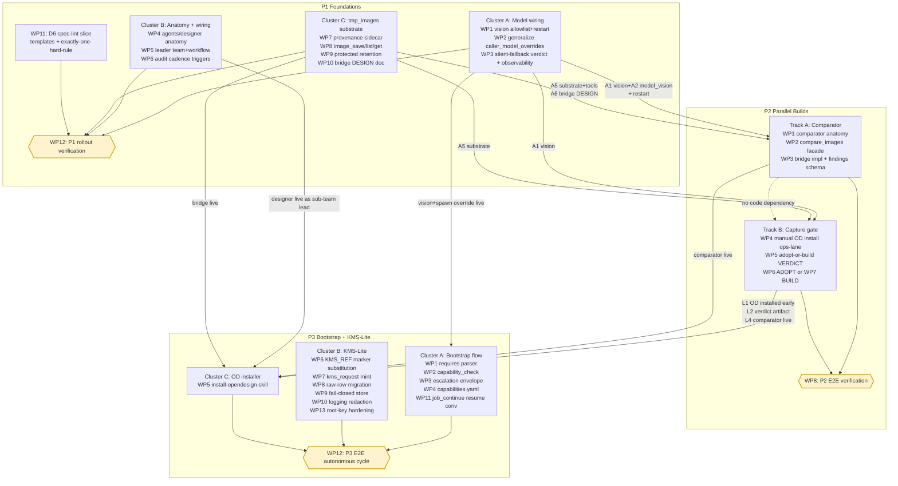

# Plan Overview: Designer Agent Implementation

- **Date:** 2026-09-26
- **Status:** Draft (synthesis of wave-1 phase plans; ready for dispatcher review).
- **Method:** Two-wave parallel-by-phase dispatch (3 phase workers in parallel with pinned inter-phase contracts, then this synthesis worker); contracts were frozen BEFORE drafting to prevent drift.
- **Source of truth:** `.agents/shared/planning/designer-agent/architecture-recommendation.md` (ratified 2026-09-26; **D1–D6 LOCKED — never re-opened by this plan**, cross-referenced only).
- **Worktree:** `feature/designer-agent-design` @ `e67e5cd85f052896cb80bf22ba03d575f339e025` (branch of `latest`); docs-only effort.
- **Companion docs (this implementation):**
  - `architecture-recommendation.md` — architecture, ratified 2026-09-26.
  - `phase1-foundations.md` (363 lines, 12 WPs) — P1 deliverables + LEAVES-BEHIND contract.
  - `phase2-parallel-builds.md` (395 lines, 8 WPs) — P2 Track A ∥ Track B + LEAVES-BEHIND contract.
  - `phase3-bootstrap-kms-lite.md` (442 lines, 13 WPs) — P3 clusters A/B/C + LEAVES-BEHIND contract.
  - `decisions.md` — plan-time decision register (placement/phasing/sequencing only; arch-decisions stay in arch doc).
  - `bridge-design.md` — P1-WP10 deliverable (path→data-URI bridge DESIGN doc; P2-WP3 implements against it).
  - `templates/design-spec.md`, `templates/design-review.md` — P1-WP11 deliverables (D6 ONE-hard-rule templates).
  - `verdicts/` — gate-artifact subdirectory; canonical path for `capture-adopt-or-build.md` (P2-WP5) + future gate artifacts.
- **Hard constraints (worktree-scoped, per dispatcher):** docs-only markdown; NO `git add/commit/push/merge`; NO daemon/test boot, NO venv/uv, NO DB/network access from the worktree (ambient `POSTGRES_*` live-probe trap — 3 prior incidents); read-only inspection allowed; D1–D6 never contradicted; the three phase files are NEVER edited by this synthesis (mismatches land in §4 "Contract reconciliation" below).

---

## 1. Objectives

### 1.1 Overall objective (testable)

Designer agent ships, the agent can spawn its own installers, and a worker encountering a missing capability autonomously escalates through designer → installer → KMS-mint → resume with **no human in the loop and no plaintext secret ever transiting an LLM prompt, message, checkpoint, log, or audit line** (arch doc §1, §2 D5, §7).

### 1.2 Per-phase objectives (testable, one sentence each)

| Phase | Objective | Source |
|-------|-----------|--------|
| **P1 Foundations** | After one planned restart, the daemon has a registered `designer` agent resolving to the `vision` model with non-silent resolution evidence, any sub-team lead can override child models through the generalized spawn chain, and the tmp_images substrate exposes provenance-tagged, retention-protected images to agents through `image_save`/`image_list`/`image_get` — with a bridge design ready for P2's comparator. | P1 §1 (line 42) |
| **P2 Parallel Builds** | A real-screenshot pair produces a structured comparator findings artifact on the substrate, AND the capture adopt-or-build verdict artifact exists with evidence from the installed OD instance. | P2 §1 (line 18) |
| **P3 Bootstrap + KMS-Lite** | A worker that detects a missing/unconfigured capability can autonomously escalate to designer, trigger the right installer skill, complete the install via the daemon HTTP API (with secrets flowing only through KMS markers), mint a credential via KMS-Lite, and resume its original job via `job_continue` with all new MCP tools live — with no human in the loop and no plaintext secret ever transiting an LLM prompt, message, checkpoint, log, or audit line. | P3 §1 (line 35) |

---

## 2. Phase Map

| Phase | File | Scope (clusters) | WP count | Exit criterion (1-line summary) | Status |
|-------|------|------------------|----------|------------------------------------|--------|
| **P1 Foundations** | `phase1-foundations.md` | Cluster A — Model wiring (`vision` allowlist + spawn-chain override + observability); Cluster B — Anatomy + leader wiring + audit cadence; Cluster C — tmp_images substrate (provenance + agent tools + protected retention + bridge DESIGN); Cross-cutting — D6 spec-lint slice + rollout verification | **12** | All of 12a–12h pass on a single post-restart daemon; `decisions.md` PD-1..PD-4 resolved-or-deferred; bridge-design + templates on disk. | pending (planned) |
| **P2 Parallel Builds** | `phase2-parallel-builds.md` | Track A — Comparator (anatomy + facade + bridge impl + findings schema); Track B — Capture gate (early manual OD install + adopt-or-build verdict + ADOPT or BUILD branch); WP8 — E2E rollout proof | **8** | `compare_images` facade live on real-screenshot pair with full schema; D6 `pinned_spec_sha` proven; capture verdict artifact complete; branch landed or dispatcher-flagged deferral recorded; monitoring triggers recorded; leaves-behind contract L1–L5 satisfied. | pending (planned) |
| **P3 Bootstrap + KMS-Lite** | `phase3-bootstrap-kms-lite.md` | Cluster A — Bootstrap flow (`requires:` parser + `capability_check` + escalation envelope + `capabilities.yaml` + `[resume]` convention); Cluster B — KMS-Lite (`__KMS_REF__` marker + `kms_request` mint + raw-row migration + fail-closed store + logging redaction + root-key hardening); Cluster C — `install-opendesign` skill (first user of the installer pattern) | **13** | First fully-autonomous self-install + mint + resume cycle passes (the §7 Mermaid, no human); audit lines for `mcp_install` + `kms_issue`; stored config markers only; fail-closed proof on absent key; plaintext-never-in-context proof; WP1–WP11 tests green; WP13 decided; cross-phase R5/R6 from P1 green. | pending (planned) |
| **P4 Overview + Decisions** | `plan-overview.md` (this file) + `decisions.md` | Synthesis + plan-time decision register (placement/phasing/sequencing only); does NOT touch implementation. | n/a | Synthesis files exist on disk; PD register complete; contract reconciliation record exists; risk carry-over indexed; §10 triage indexed; drift corrections logged. | IN PROGRESS (this delivery) |

**Critical-path summary:** P1-WP1 (vision allowlist) → P1-WP4 (anatomy) → P1-WP5 (leader wiring) → restart window → P1-WP12 (P1 verification) ∥ P2-WP1 (comparator) → P2-WP2 (facade) → P2-WP3 (bridge impl) → P2-WP8 (P2 e2e) ∥ P3-WP1 (parser) → P3-WP6 (markers) → P3-WP7 (mint) → P3-WP9 (fail-closed) → P3-WP5 (install skill) → P3-WP12 (autonomous cycle).

---

## 3. Dependency Graph

### 3.1 Cluster-level Mermaid flowchart

### 3.2 WP adjacency table (machine-parseable: `WP → depends-on`)

| WP | depends-on | Phase | Source |
|----|------------|-------|--------|
| P1-WP1 | none | P1 | P1 §3 (gate for WP4-registration, WP12) |
| P1-WP2 | P1-WP1 | P1 | P1 §3 |
| P1-WP3 | P1-WP2 | P1 | P1 §3 |
| P1-WP4 | P1-WP1 | P1 | P1 §3 (registration ordering) |
| P1-WP5 | P1-WP4 | P1 | P1 §3 |
| P1-WP6 | P1-WP4, P1-WP5 | P1 | P1 §3 |
| P1-WP7 | none | P1 | P1 §3 |
| P1-WP8 | P1-WP7 | P1 | P1 §3 |
| P1-WP9 | P1-WP7 | P1 | P1 §3 |
| P1-WP10 | P1-WP7 | P1 | P1 §3 |
| P1-WP11 | none | P1 | P1 §3 |
| P1-WP12 | P1-WP1..WP11 | P1 | P1 §3 |
| P2-WP1 | P1 (A1, A2) | P2 | P2 §5.0 |
| P2-WP2 | P2-WP1 | P2 | P2 §5.0 |
| P2-WP3 | P2-WP2, P1 (A5, A6) | P2 | P2 §5.0 |
| P2-WP4 | ops lane only | P2 | P2 §5.0 (Track B start) |
| P2-WP5 | P2-WP4 | P2 | P2 §5.0 (GATE) |
| P2-WP6 | P2-WP5 (verdict=adopt), P1 (A5) | P2 | P2 §5.0 (conditional) |
| P2-WP7 | P2-WP5 (verdict=build), P1 (A5) | P2 | P2 §5.0 (conditional) |
| P2-WP8 | P2-WP3, P2-WP4 (+WP6/WP7 when available) | P2 | P2 §5.0 (convergence) |
| P3-WP1 | P1 (designer live), P2 (OD available) | P3 | P3 §2 |
| P3-WP2 | P3-WP1 | P3 | P3 §2 |
| P3-WP3 | P3-WP2 | P3 | P3 §2 |
| P3-WP4 | P3-WP2 | P3 | P3 §2 |
| P3-WP5 | P3-WP1, P3-WP2, P3-WP4, P2 (OD builtin class) | P3 | P3 §2 |
| P3-WP6 | P3-WP4 (capabilities.yaml), P1 (MCP infra live) | P3 | P3 §2 |
| P3-WP7 | P3-WP6 | P3 | P3 §2 |
| P3-WP8 | P3-WP7 | P3 | P3 §2 |
| P3-WP9 | P3-WP7 | P3 | P3 §2 |
| P3-WP10 | P3-WP6, P3-WP7 | P3 | P3 §2 |
| P3-WP11 | P3-WP5 | P3 | P3 §2 |
| P3-WP12 | P3-WP1..WP11 | P3 | P3 §2 |
| P3-WP13 | P3-WP9 | P3 | P3 §2 |

**Cross-phase sequence gates (enforced at phase start):**

1. **P1-WP1 → all** — `vision` in daemon-global `allowed_models` + daemon restart done. Without this, P1-WP3 silent-fallback risk fires; P2 comparator + P3 installer workers cannot resolve `vision` and silently lose vision capability (arch §8 🔴 R1).
2. **P2-WP5 → P2-WP6 | P2-WP7** — adopt-or-build VERDICT gates the capture branch (mutually exclusive; no build code until verdict).
3. **P3-WP12 entry** — dispatcher enforces the cross-phase MAY-ASSUME list (P3 §0); P3 verifies P1's R5/R6 acceptance criteria are green before WP12 integration test (P3 §6 row 8, PR7).

---

## 4. Cross-Phase Contract Consistency Check

The plan-creation contract surfaces are: **P1 LEAVES BEHIND ↔ P2 MAY ASSUME** and **P2 LEAVES BEHIND ↔ P3 MAY ASSUME**. The synthesis verifies each pair by ID and surfaces any asymmetry in the "Contract reconciliation" subsection. **No phase file is edited.**

### 4.1 P1 LEAVES-BEHIND ↔ P2 MAY-ASSUME matrix

| # | P1 LEAVES BEHIND (P1 §0, lines 30-36) | P2 MAY ASSUME (P2 §3.1, A1-A6) | Verdict |
|---|----------------------------------------|----------------------------------|---------|
| 1 | `vision` live in daemon-global `allowed_models` + documented restart protocol | A1: `vision` in `allowed_models` + restart done | ✅ MATCH |
| 2 | `caller_model_overrides` generalized into the spawn chain; precedence chain documented + enforced | A3: `caller_model_overrides` generalized; precedence `model_tier > model= > parent-map > pool > llm_model > default` | ✅ MATCH |
| 3 | `agents/designer/` anatomy live (meta.json §3.3 verbatim; soul/rule/workflow/tools_note §3.2) + leader team/workflow wiring | A4: `agents/designer/` live (craft-class sub-team lead) | ✅ MATCH |
| 4 | tmp_images substrate upgrades: provenance sidecar + `image_save` / `image_list` / `image_get` + protected retention class — AND path→data-URI bridge DESIGN doc | A5: tmp_images substrate with provenance + tools + protected retention; A6: path→data-URI bridge DESIGN done | ✅ MATCH |
| 5 | Phase-1 spec-lint slice: `design-spec.md` front-matter + `design-review.md` must-cite-`pinned_spec_sha` + exactly ONE hard check (D6) | (consumed by P2 §8 "Cross-Cutting" — D6 application to WP3 findings schema + WP5 verdict + WP8 e2e) | ✅ MATCH (consumer-side documented in P2 §8) |
| 6 | Spawn-time model observability: spawn log carries resolved `model` + `source` (P1-WP3) | (consumed by P2 §5.1 "P2 MAY ASSUME from P1" implicit row; P2 reads the signal via AC-3 pre-WP check) | ✅ MATCH (informational; no break) |

### 4.2 P2 LEAVES-BEHIND ↔ P3 MAY-ASSUME matrix

| # | P2 LEAVES BEHIND (P2 §3.2, L1-L5) | P3 MAY ASSUME (P3 §0) | Verdict |
|---|------------------------------------|------------------------|---------|
| 1 | Self-hosted OpenDesign installed (early, manual/ops lane) + install-evidence notes (host shape, MCP registration values, credential handling) | "self-hosted OpenDesign MCP already installed EARLY via the manual/ops lane (P2's early-deliverable posture)" | ✅ MATCH |
| 2 | Adopt-or-build VERDICT artifact at `.agents/shared/planning/designer-agent/implementation-plan/verdicts/capture-adopt-or-build.md` | "the capture adopt-or-build verdict artifact exists" | ✅ MATCH |
| 3 | Capture tool **if built**, already wired into the substrate (`image_save` + provenance tags) | (no direct cross-reference; P3 rides if-built as-is) | ✅ MATCH (implicit; P3 doesn't need a capture if P2 built one) |
| 4 | Comparator live: `image-comparator` agent + `compare_images` facade + findings schema (incl. `pinned_spec_sha`) + A→C monitoring triggers | "OD builtin class available for `configure-builtin` reuse" + comparator live implicit via "OD builtin class" | ✅ MATCH |
| 5 | `verdicts/` directory convention under `implementation-plan/` | (P3 reuses for its own gate artifacts; convention established) | ✅ MATCH |

### 4.3 P1 LEAVES-BEHIND ↔ P3 MAY-ASSUME matrix

| # | P1 LEAVES BEHIND | P3 MAY ASSUME (from P1) | Verdict |
|---|------------------|--------------------------|---------|
| 1 | `vision` live + restart protocol | "`vision` model added to daemon-global `allowed_models` + restart landed" | ✅ MATCH |
| 2 | `caller_model_overrides` generalized | "spawn-chain model override generalized in `daemon/services/instance_lifecycle.py:1780-1829`" | ✅ MATCH |
| 3 | `agents/designer/` anatomy live + leader wiring | "designer live as craft-class sub-team lead with `team_members: ['worker']` (no change)" | ✅ MATCH |
| 4 | tmp_images substrate upgrades + bridge DESIGN | "tmp_images substrate with provenance tags + path→data-URI bridge live" | ✅ MATCH |

### 4.4 Contract reconciliation (gaps, asymmetries, drift)

**Verdict: NO CONTRACT GAPS FOUND.** All P1 LEAVES-BEHIND items have a corresponding P2 MAY-ASSUME entry; all P2 LEAVES-BEHIND items have a corresponding P3 MAY-ASSUME entry; the cross-references are symmetric and the wording is consistent (modulo the dispatcher-flagged ambiguities below, which are NOT contract breaks):

1. **P1 MAY-ASSUME `model_vision` deployment step (PD-2)** — P1-WP1 task 3 makes `model_vision` part of the same restart window. P2's A2 ("`model_vision` configured (daemon-global; fail-fast 400 if unset)") depends on this. **No gap; PD-2 is the plan-time formalization.** Tracked in `decisions.md` PD-2.
2. **P2 LEAVES-BEHIND "if built" qualifier (L3)** — capture tool existence is conditional on the WP5 verdict. P3 implicitly handles the absent case (P3 doesn't read a capture tool; it triggers an installer via the bootstrap flow). **No gap; conditional deliverable is a known shape, not a contract break.**
3. **P3 §0 omits "comparator live" from its MAY-ASSUME list, while P2 §3.2 L4 LEAVES IT BEHIND** — P3 does NOT depend on comparator functionality; the bootstrap flow + KMS mint + resume are independent of the comparator. **No gap; P3 doesn't need to read L4.** Cross-reference preserved for traceability.

**Drift surfaced by P2 ground-truth spot-checks (P2 §4):** see §8 "Known Drift Corrections" — these are documentation drift against `e67e5cd8`, NOT contract breaks.

---

## 5. Risk Carry-Over

The arch doc §8 risk register is consolidated here with explicit phase/WP mapping. **Each 🔴 risk has a primary mitigation WP + acceptance-test surface; phase exit requires that acceptance to be green.** Phase-internal risks (PR1–PR8 from P3 §13) are added with a phase marker.

### 5.1 Top-10 consolidated risks (severity × mitigation owner WP)

| # | Risk | Severity | Source | Owner WP | Acceptance-test surface | Phase-internal risk (where applicable) |
|---|------|----------|--------|----------|--------------------------|----------------------------------------|
| 1 | **R1 — `allowed_models` silent fallback (D2)** — model overrides silently resolve to default when target ∉ `allowed_models`; designer/workers quietly lose vision | 🔴 HIGH | arch §8 R1 | **P1-WP1** (entry + restart) + **P1-WP3** (observability) + **P2-WP3** (facade init fails LOUD) | P1-WP1 AC-1 (grep-verifiable `vision` in config/env) + P1-WP12 12b (non-silent vision resolution) + P2-WP3 AC-5 (facade init fail-loud) + P3 §6 row 8 (cross-phase re-check) | — |
| 2 | **R2 — KMS plaintext leak via post-resolution persist** — safe only if marker→plaintext substitution is in-RAM at spawn AND no path re-serializes into `mcp_servers.config` | 🔴 HIGH | arch §8 R2 | **P3-WP6** (marker substitution) + **P3-WP5** (writes markers day 1) + **P3-WP10** (logging scrub) | P3-WP6: spawn-time plaintext vs. DB-row marker; round-trip-update-must-re-read test (arch §8 named test) | — |
| 3 | **R3 — MCP config stores env RAW today** (`redact_secrets` presentation-only) — pre-existing raw rows need migration; new OD install row must be marker-based from day 1 | 🔴 HIGH | arch §8 R3 | **P3-WP8** (one-time raw-row migration) + **P3-WP5** (new installs marker-based) + **P2-WP4** (record any operator-managed credentials for migration input) | P3-WP8: pre-count vs. post-count of plaintext env rows = 0; P3 §6 row 3 (stored config markers only) | — |
| 4 | **R4 — Fail-soft `CredentialManager`** (no key ⇒ plaintext fallback at `daemon/sources/credentials.py:75-97`) — must evolve to fail-closed | 🔴 HIGH | arch §8 R4 | **P3-WP9** (fail-closed evolution) + **P3-WP7** (mint primitive never sees plaintext path) | P3-WP9: key-absent refusal + no plaintext write + no audit leak; P3 §6 row 4 | — |
| 5 | **R5 — `POST /agents` permissive-default trap** — API-created agents carry no tools/deny fields | 🔴 HIGH | arch §8 R5 | **P1-WP4** (hand-author mandate) | P1-WP4 AC-1 (no `POST /agents` in delivery path) + P1-WP12 12a (registration evidence) | — |
| 6 | **R6 — Zero logging redaction repo-wide** — no `logging.Filter` exists; a secret reaching a log line propagates as-is | 🔴 HIGH | arch §8 R6 | **P3-WP10** (logging filter + format-string audit) + **P3-WP6** (markers are safe in logs by construction) | P3-WP10: integration test with injected plaintext + static grep audit; P3 §6 row 5 (checkpoint/log scan zero matches) | — |
| 7 | **R7 — Invoke-semaphore / concurrency drain** — 4 invoke slots shared (charter/explorer/image-reader/comparator) + LLM concurrency 10 daemon-wide; heavy parallel design fan-out queues | 🟡 MEDIUM | arch §8 R7 (🟡) | **P2-WP2** (monitoring triggers T1–T3 + A→C escape valve) + **P2-WP8** (serial compares day-1) | P2-WP2 AC-5 (monitoring triggers recorded in tool docstring + `design.comparator.monitor` KV key) | — |
| 8 | **R8 — Capture-tool build gated on OD `agent-browser` verification** — before building, verify the OD-shipped skill delivers capture (may close GAP-1 for free) | 🟡 MEDIUM | arch §8 R8 (🟡) | **P2-WP5** (adopt-or-build GATE — decides before any build code) | P2-WP5 AC-1..AC-6 (verdict artifact populated; branch named) | — |
| 9 | **PR6 — WP8 migration atomicity** — touches existing `mcp_servers.config` rows in-place; if interrupted mid-run, partial state | 🔴 HIGH (phase-internal) | P3 §13 PR6 | **P3-WP8** (per-row `BEGIN/COMMIT` transaction; on error the row is untouched; idempotency + audit lines ensure re-run is safe) | P3-WP8 acceptance (fresh-migrate + idempotent-rerun + mixed-rows tests) | P3 §13 PR6 |
| 10 | **PR7 — P3 cannot proceed if P1 hasn't shipped** — cross-phase R5 + R6 from P1 must be green before WP12 e2e | 🟡 MEDIUM (phase-internal) | P3 §13 PR7 | **P3 §6 row 8** (cross-phase read-only check at WP12 entry) + dispatcher enforcement of cross-phase MAY-ASSUME list | P3 §6 row 8 | P3 §13 PR7 |

**Risk table legend:** Rows 1–6 are the four arch §8 🔴 risks **mapped to their primary WPs** per the dispatcher's risk-carry-over requirement. Rows 7–8 are 🟡 arch §8 risks with explicit phase-WP mitigation. Rows 9–10 are phase-internal risks (P3 §13) flagged by the dispatcher as "top phase-internal risks each worker added."

**Risk carry-over summary by phase:**

| Phase | 🔴 owned | 🟡 notable | Phase-internal |
|-------|----------|-------------|----------------|
| P1 | R5 (POST /agents), R1-partial (allowlist entry) | Restart coupling, clipboard channel, no daemon cron | GT-1 anchor drift, GT-2/GT-3 silent-fallback nuances |
| P2 | R1-precondition (facade fail-loud), R8-adjacent (raw-key discipline) | R7 semaphore drain (monitoring triggers), vision-judgment variability, restart coupling | O-1 verdict artifact path, O-2 registry category key, O-3 ops-lane availability |
| P3 | R2 (plaintext leak), R3 (raw rows), R4 (fail-soft), R6 (logging redaction) — all four 🔴 KMS risks per dispatcher | None new | PR1 WP13a scope creep, PR2 install-skill location, PR3 marker collisions, PR4 self-reference test, PR5 resume envelope drift, PR6 migration atomicity, PR7 cross-phase gate, PR8 audit retention |

---

## 6. Cross-Cutting

### 6.1 D6 spec front-matter lint — pinned_spec_sha is the ONE hard rule

**Per arch doc §2 D6 + §4.4:** `pinned_spec_sha` is the single hard rule. Every conformance verdict must reference an immutable spec version. All other front-matter (component schema, criteria format, naming, owners) = advisory, lint warnings only. Per-phase slices:

| Phase | Slice | Index / location |
|-------|-------|-------------------|
| P1 | `templates/design-spec.md` + `templates/design-review.md` (must-cite-`pinned_spec_sha`); lint tooling spec with exactly ONE hard check + advisory warnings; anti-creep note (any new hard lint ⇒ `decisions.md` ADR) | **P1-WP11** (P1 §3 row P1-WP11; tasks 1-4) |
| P2 | Findings schema (`pinned_spec_sha` field on comparator output); WP5 verdict artifact carries spec/decision SHAs; WP8 e2e proves the rule end-to-end with non-null SHA on spec-play run | **P2 §8 Cross-Cutting** + **P2-WP3** (findings schema, task 3) + **P2-WP5** (artifact D6 note) + **P2-WP8** (AC-2: spec-play run with non-null SHA) |
| P3 | Distinction drawn: D6's hard rule applies to SPEC front-matter (design-spec.md); `requires:` is CAPABILITY front-matter (skill-set.yaml) enforced at capability-side pre-flight (`capability_check`), NOT at spec-conformance-verdict time. The two never collide. | **P3 §7 Cross-Cutting** (lint philosophy statement) |

**Anti-creep rule:** adding any new hard lint check requires a `decisions.md` ADR (D6 discipline) — recorded as a P1-WP11 task 4 note and reinforced by the P3 §7 lint philosophy statement.

### 6.2 Consolidated §10 open-question triage (arch doc §10)

| # | Arch §10 OQ | Verdict | Owning WP / phase | Source phase file |
|---|-------------|---------|--------------------|--------------------|
| 1 | Near-term verification: does self-hosted OD's `agent-browser` skill actually deliver app screenshot capture once installed? (gates capture-tool build, GAP-1) | **P2-WP5 OWNS producing the answer** (gate WP; operational criteria C1–C5 turn it into a decided artifact) | **P2-WP5** | P2 §9 |
| 2 | Path→data-URI bridge design against verified store facts (data-dir/workdir caveat; extensionless magic-byte reads; 404-gated listing) | **P1-WP10 (design)** + **P2-WP3 (impl)** — split arbitrated here: design at P1-WP10, impl at P2-WP3. P3 §0 / P1 §0 / P2 §3.1 A6 all consistent. | **P1-WP10** + **P2-WP3** | P1 §0, P1 §9, P2 §3.1 A6, P3 §10 |
| 3 | Does `send_message` gain an `images` param (GAP-3), or do substrate paths + pixels-at-dispatch suffice permanently? | **OUT OF SCOPE day-1** — operational mitigation (substrate paths + pixels-at-dispatch) stands. Revisit trigger: comparator/UX-flow friction evidence. | n/a (dispatcher decision) | P1 §10 + P2 §9 + P3 §10 (all flag as not-day-1) |
| 4 | KMS-Lite root-key custody on live host (`SYSTEM_ENCRYPTION_KEY` hardening: file perms, age, OS keychain) — zero vault infra exists | **P3-WP13a (lightweight file hardening) — landing WP** | **P3-WP13** | P3 §9 OQ-1 |
| 5 | One-time migration design for raw secrets already persisted in `mcp_servers.config.env` rows | **P3-WP8 (landing WP)** — cannot be deferred (day-1 installs are marker-based but pre-existing rows stay raw without it) | **P3-WP8** | P3 §9 OQ-2 |
| 6 | `job_continue` resume-message envelope — ratify the `[resume]` shape as a convention | **P3-WP11 (landing WP)** — comment-level + cross-skill-body documentation; `job_continue` itself unchanged | **P3-WP11** | P3 §9 OQ-3 |
| 7 | Designer-initiated audit cadence without a daemon cron | **P1-WP6** (trigger web: tester drift, phase boundaries, on-request, pre-release) — daemon-cron self-scheduling **explicitly out-of-scope** with revisit trigger recorded | **P1-WP6** | P1 §9 OQ-2, P1 §7 Deferred |
| 8 | Comparator A→C consolidation triggers (semaphore saturation >10/day; image-reader `comparison_mode`; native proxy multi-image) | **P2-WP2 records them as monitoring triggers (T1/T2/T3); explicitly NOT day-1 work** — execution deferred until a trigger fires | **P2-WP2** | P2 §5.0 P2-WP2 monitoring triggers section + P2 §9 |

### 6.3 Rollout / verification rollup — phase exit proofs

Each phase carries a single load-bearing rollout proof, machine-checkable, executed as a phase-exit gate:

| Phase | Phase-exit proof | Verification method | Pass threshold | Source |
|-------|-------------------|---------------------|----------------|--------|
| **P1** | Designer spawns on `vision` + tmp_images store round-trip with provenance tags + protected retention | All of 12a–12h pass on a single post-restart daemon | 12a–12h green; no partial credit on 12b (non-silent resolution is THE phase gate) | P1 §6 (line 322-323) + P1 §3 P1-WP12 |
| **P2** | First E2E compare on real screenshots + capture adopt-or-build VERDICT artifact + branch landed | Findings artifact from real-screenshot pair w/ provenance tags + non-null `pinned_spec_sha` on spec-play run; verdict artifact complete; branch WP6/WP7 landed or dispatcher-flagged deferral; monitoring triggers recorded | 7 §10 exit criteria all green | P2 §10 (lines 369-376) + P2 §5.0 P2-WP8 |
| **P3** | First fully-autonomous self-install + mint + resume cycle (the §7 Mermaid, no human) | Integration test: worker skill body → escalation envelope → designer spawns installer → installer calls `/configure-builtin` → worker resumes via `job_continue` → mcp_opendesign tools live | All 6 swimlane steps complete in one test run; no human invocation; worker holds only `{handle, fingerprint}`; mcp_opendesign tool list populated | P3 §6 row 1 + P3 §12 rollout sequence |

**Cross-phase cumulative gate:** by P3 §6 row 8, **P3 exit also requires P1's R5/R6 acceptance criteria green** (read-only check). This is a sequencing gate — P3 cannot proceed if P1 hasn't shipped R5 (hand-authored `agents/designer/`) or R6 (`vision` in `allowed_models`).

---

## 7. File Index (this implementation, all docs-only)

| Path | Purpose | Status | Producer WP |
|------|---------|--------|-------------|
| `architecture-recommendation.md` | Architecture + ratified D1–D6 + §8 risks + §10 OQs + §11 evidence | **EXISTS** (input; LOCKED) | architect (upstream) |
| `phase1-foundations.md` | P1 plan (12 WPs, clusters A/B/C + cross-cutting) | **EXISTS** (input) | plan-creation worker (wave-1) |
| `phase2-parallel-builds.md` | P2 plan (8 WPs, Track A ∥ Track B + WP8 E2E) | **EXISTS** (input) | plan-creation worker (wave-1) |
| `phase3-bootstrap-kms-lite.md` | P3 plan (13 WPs, clusters A/B/C) | **EXISTS** (input) | plan-creation worker (wave-1) |
| **`plan-overview.md`** | **This synthesis (top-level)** | **CREATED (wave-2 synthesis)** | this synthesis worker |
| **`decisions.md`** | **Plan-time decision register (placement/phasing/sequencing)** | **CREATED (wave-2 synthesis)** | this synthesis worker |
| `bridge-design.md` | Path→data-URI bridge DESIGN doc (P1-WP10 deliverable) | PLANNED (P1-WP10 task 1) | P1-WP10 |
| `templates/design-spec.md` | D6 spec template (front-matter skeleton arch §4.4) | PLANNED (P1-WP11 task 1) | P1-WP11 |
| `templates/design-review.md` | D6 review template (must-cite-`pinned_spec_sha`) | PLANNED (P1-WP11 task 2) | P1-WP11 |
| `verdicts/` (subdir) | Gate-artifact directory convention; canonical path for `capture-adopt-or-build.md` (P2-WP5); reused by P3 for its gate artifacts | PLANNED (P2-WP5 establishes) | P2-WP5 + P3 reuse |

**Implementation files (NOT created by this docs-only effort; planned homes only):** see each phase file's detailed WP sections for the file:line touchpoints.

---

## 8. Known Drift Corrections

Drift is documentation drift against `e67e5cd8` spotted during ground-truth spot-checks (P1 GT-1..GT-4, P2 G1..G9, P3 §11 spot-verifications). **These are NOT contract breaks**; they are corrections implementers must apply against the current tree, not the cited line numbers.

| # | Drift | Arch doc citation | Verified reality (per phase file GT/§) | Phase |
|---|-------|-------------------|-----------------------------------------|-------|
| 1 | PAUSED-rejects-agent-tool-send file path | arch §3.5 (`instance.py:2998-3004`) | `daemon/tools/instance.py:2998-3004` (grep-verified; P3 file uses `daemon/instance.py` at one site but the verified location is `daemon/tools/instance.py`) | **P3** |
| 2 | `invoked_as_tool` stamp site | arch §3.1 (chart_tools.py:67-145) | Mechanism confirmed at `chart_tools.py:67-145`; **stamp site actually at `instance_lifecycle.py:1963-1964`** — implementer reads the current stamp site, not the chart_tools docstring (which still cites `:1798-1799`) | **P2** (P2 §4 G3) |
| 3 | Multi-image per message test | arch §6 (`instance_messaging.py:113-128`; `test_vision_routing.py::TestMultipleImages`) | Mechanism confirmed at `instance_messaging.py:113-128`; **test name is `test_multiple_images_in_one_message` at `tests/unit/test_vision_routing.py:275`** (TestEdgeCases class, line 253); class name differs from arch citation | **P2** (P2 §4 G6) |
| 4 | MCP HTTP/SSE header treatment line | arch §7.5 (`daemon/mcp/config.py:260`) | Implementation file lives at `daemon/mcp/config.py`; **exact line `:260` may drift** — verify at implement (P3 §11 spot-verification list) | **P3** (P3 §11) |
| 5 | Leader `workflow.md` anchors as "routes" | arch §4.3 + §4.3b (multiple "leader routes UI/UX to designer" phrasings) | Verified reality (P1 GT-1): **the three anchors `:242-252`, `:258-262`, `:459-466` are INSERTION/EDIT POINTS, not existing routes** — no UI/UX/designer routing exists anywhere in `agents/leader/workflow.md` today; P1-WP5 authors new routing blocks at those anchors | **P1** (P1 §2 GT-1; tracked in `decisions.md` PD-4) |

**Why synthesis rather than bundling of drift:** each phase file records its drift findings in its own §2 (P1) / §4 (P2) / §11 (P3). This top-level index surfaces them in one place so a downstream implementer can cross-reference without reading all three phase files.

---

## 9. Open Items for the Dispatcher (carried forward from phase files)

These are the open items the phase workers themselves flagged for dispatcher attention. **None block this synthesis; they block the implementation dispatch.**

| # | Item | Source | Needed by |
|---|------|--------|-----------|
| O-1 | Confirm the verdict-artifact path choice: `implementation-plan/verdicts/capture-adopt-or-build.md` (canonical; P2 §3.2 L5 establishes `verdicts/` convention). Marked **CONFIRMED-by-default** by P2 worker. | P2 §12 O-1 | Before P2 dispatch |
| O-2 | Confirm registry category key: P2 specifies `"design": ["image-comparator"]` per arch pattern; implementer may rename if a narrower key fits, provided `_auth.py` MUST-match rule holds (P2-WP2 AC-1). | P2 §12 O-2 | Before P2-WP2 |
| O-3 | Ops-lane availability + host access for P2-WP4 (manual OD install) — the only WP outside the daemon/agents lane. Flagged as an external dependency. | P2 §12 O-3 | Before Track B start |
| O-4 | Bridge DESIGN-vs-IMPL split confirmed: P1-WP10 designs, P2-WP3 implements. The two files agree on the contract (this synthesis §4.4 verification). | this synthesis | None (recorded) |
| O-5 | §10 GAP-3 `send_message images=` param confirmed OUT OF SCOPE day-1 per dispatcher instruction; revisit trigger recorded. | this synthesis + dispatcher | None (recorded) |

---

*End of plan-overview.md.*