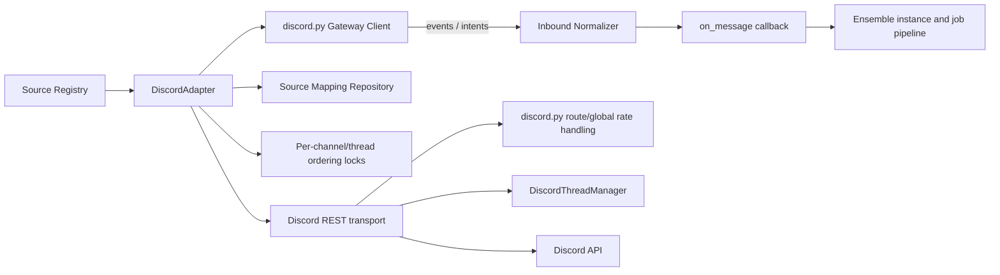

# Technical Analysis: Discord Source Adapter

Date: 2026-08-11
Author: planner[v2] via technical-analysis worker
Analysis depth: deep-dive
Status: Ready for Review

## Question

How should a Discord Gateway source adapter be integrated into ensemble's pluggable `MessageSourceAdapter` architecture, including library choice, dynamic rate limiting, Gateway lifecycle, threads, formatting, identity mapping, permissions, resilience, and scaling?

## Context Summary

Ensemble already has a pluggable source boundary: `MessageSourceAdapter` in `daemon/sources/base.py:53-130` receives a `SourceConfig` and message callback, and exposes `start()`, `stop()`, `send(OutgoingMessage) -> bool`, and `health_check() -> bool`. Registration is currently an if/elif dispatch in `daemon/sources/registry.py:339-426`. Telegram demonstrates a compact adapter with centralized API resilience, per-chat ordering, and artifact stripping; Slack demonstrates a multi-module SDK-backed WebSocket adapter with per-channel ordering, thread lifecycle management, and database-backed outbound routing.

Discord is closer to Slack Socket Mode than Telegram polling: a long-lived Gateway WebSocket receives events while REST calls send messages and perform channel/thread operations. Discord adds protocol-specific session state (identify, heartbeat, sequence numbers, resume), privileged intents, dynamic HTTP route buckets, guild/shard scaling, and thread auto-archival. The design should therefore preserve the existing source contract while isolating Discord protocol complexity behind a dedicated adapter package.

Observed facts below are based on the supplied research findings. Recommendations are design judgments and should be validated against the selected discord.py version and Discord API policy before implementation.

## Architecture

### Current Patterns

- **Adapter ABC / callback boundary** — `MessageSourceAdapter` (`daemon/sources/base.py:53-130`).
- **Registry dispatch** — source construction is selected in `daemon/sources/registry.py:339-426`; add a `source_type == "discord"` branch.
- **SDK-backed source integration** — Telegram uses aiohttp and Slack uses SlackBolt/AsyncApp plus `AsyncSocketModeHandler`; using a maintained Discord SDK follows precedent.
- **Centralized transport resilience** — Telegram `_api_call()` performs circuit-breaker admission, retries, exponential backoff, and success/failure recording (`daemon/sources/adapters/telegram.py`).
- **Bounded ordering locks** — Telegram uses per-chat OrderedDict/LRU locks (1,000); Slack uses per-channel OrderedDict/LRU locks (100).
- **Database-backed outbound correlation** — Slack `send()` resolves `source_id` + external user ID through `source_repo.get_instance_mapping(...)`, then routes using mapping metadata.
- **Dedicated thread lifecycle component** — Slack `ThreadManager` applies TTL, LRU eviction, and termination cleanup.

### Module Boundaries

```text
Source Registry
      |
      v
DiscordAdapter (MessageSourceAdapter)
   |        |             |
Gateway   Discord REST   Correlation / ordering
Client    (discord.py)    (DB mapping + locks)
   |        |             |
Discord events   Discord API       Source repository
      |
Normalize inbound -> on_message callback -> instance/job pipeline

Outbound message -> mapping lookup -> channel/thread target -> REST send
```

`DiscordAdapter` should own source lifecycle and normalization, while discord.py owns protocol mechanics. REST-specific policy belongs in a small `rate_limiter.py`/transport seam only where it cannot be delegated to the SDK. Thread target resolution belongs in `thread_manager.py` or a narrow thread service, not in the registry or generic source layer.

### Architecture Diagram (deep-dive only)



The Gateway is inbound and stateful; REST is outbound and request/response oriented. They share adapter lifecycle and health state but should not share a single blocking error path. A Gateway outage should trigger reconnect/resume logic, while a REST outage should use circuit breaking and return `False` from `send()` after bounded failure handling.

## Integration Points

| # | Integration | Type | Contract | Auth | Failure Mode | File:Line |
|---|-------------|------|----------|------|--------------|-----------|
| 1 | Source registry | sync construction | `SourceConfig` -> adapter | internal config | unsupported type/config error | `daemon/sources/registry.py:339-426` |
| 2 | Adapter lifecycle manager | async lifecycle | `start/stop/health_check` | internal | startup failure or unhealthy source | `daemon/sources/base.py:53-130` |
| 3 | Discord Gateway | async WebSocket | Gateway events, opcodes, sequence/session state | bot token + intents | disconnect, invalid session, heartbeat timeout | Discord API contract; adapter package |
| 4 | Discord REST API | async HTTPS | message/channel/thread JSON | bot token | dynamic route/global limits, 4xx/5xx | Discord API contract; adapter package |
| 5 | Source repository | async DB lookup | `(source_id, external_user_id)` -> mapping metadata | daemon authorization | missing/stale target mapping | Slack adapter pattern |
| 6 | Ensemble callback | async callback | normalized inbound message | internal | callback failure / retry policy | `MessageSourceAdapter` contract |

### Integration Details

**Integration 1: Discord Gateway**
- **Protocol:** WebSocket Gateway.
- **Data format:** Discord Gateway JSON events and opcodes.
- **Authentication:** Bot token during identify/resume.
- **Error handling:** Delegate heartbeat, sequence tracking, reconnect, and resume to discord.py; explicitly observe invalid-session and fatal authentication failures.
- **Observability:** Log connection state, shard, event type, session resume attempts, heartbeat latency, and disconnect reason without logging tokens or message content by default.
- **Known issues:** Privileged intents must be declared in code and enabled in the Discord developer portal; missing `MESSAGE_CONTENT` can produce events without usable content.

**Integration 2: Discord REST API**
- **Protocol:** HTTPS REST through discord.py.
- **Data format:** JSON; Discord markdown is accepted in message content.
- **Authentication:** Bot token.
- **Error handling:** Let discord.py handle route buckets and global limits; add adapter-level bounded retries/circuit breaker for transient failures not safely retried by the SDK. Do not blindly retry non-idempotent sends without an idempotency/deduplication policy.
- **Observability:** Record status class, route category, retry-after, and circuit state; avoid treating expected 429 handling as an application error.
- **Known issues:** Dynamic bucket assignment means static Slack-style tier tables are insufficient.

**Integration 3: Source mapping repository**
- **Protocol:** Database repository lookup, analogous to Slack.
- **Data format:** External ID plus mapping metadata (guild/channel/thread IDs).
- **Authentication:** Existing instance/source authorization rules.
- **Error handling:** Missing mapping returns `False`/a structured send failure and logs a safe diagnostic; stale targets should be invalidated or surfaced for remapping.
- **Observability:** Include source ID, normalized external ID, and target type in structured logs.

## Trade-offs

### Alternatives Considered

1. **Option A: discord.py-backed adapter** — use discord.py for Gateway, heartbeat, reconnect/resume, REST serialization, and dynamic rate limits; keep ensemble normalization and routing in the adapter.
2. **Option B: Custom WebSocket + HTTP client** — implement Gateway protocol and REST transport directly with aiohttp/websockets and local rate-limit/session machinery.
3. **Option C: Hybrid protocol ownership** — use discord.py for Gateway and models, but add a separately instrumented/custom REST rate-limit and transport layer.

### Comparison

| Criterion | Option A | Option B | Option C | Winner |
|---|---|---|---|---|
| Performance | Good; SDK overhead is normally negligible versus network latency | Potentially leanest, but tuning is application responsibility | Good, with extra boundary overhead | A/C tie |
| Complexity | Lowest; protocol edge cases delegated | Highest; heartbeat, resume, opcodes, buckets, and API changes are owned locally | Medium-high; two transport ownership models | A |
| Maintainability | Best alignment with existing SDK precedent and upstream fixes | Poorer; Discord protocol maintenance becomes daemon debt | Mixed; custom REST seam requires ongoing compatibility work | A |
| Team skills | Familiar async SDK pattern from Slack | Requires specialized Gateway expertise | Requires both SDK and custom HTTP expertise | A |
| Time-to-implement | Fastest | Slowest | Medium | A |
| Cost (infra / license) | Open-source dependency and memory footprint | Fewer dependencies, higher engineering cost | Highest operational/code cost | A for total cost |
| Protocol correctness | Strong if version pinned and tested | Risk of subtle resume/heartbeat bugs | Strong Gateway, custom REST risk | A |

### Recommendation

**Pick: Option A — discord.py-backed adapter, with narrow adapter-level policy seams.**

**Reasoning:** discord.py matches the existing SDK-backed Slack pattern and removes the highest-risk protocol work: Gateway opcodes, heartbeat scheduling, sequence tracking, reconnect, and resume. It also already understands Discord's dynamic REST route buckets and global rate limits, which are materially different from Slack's static tiers. The adapter should still add ensemble-specific circuit-breaker integration, bounded send failure handling, ordering locks, mapping lookup, metrics, and duplicate-send safeguards. A custom client only wins on dependency footprint and theoretical control, not on the dominant correctness and maintenance risks.

**Assumptions:** discord.py remains compatible with the project's Python/asyncio versions; bot-token deployment is acceptable; the adapter can access the SDK's lifecycle and HTTP error information; Discord's privileged intents are approved for the deployment's guilds.

**Reversibility:** High at the source boundary if all Discord-specific types remain inside `daemon/sources/adapters/discord/`. A future custom transport can implement the same adapter contract, but outbound request semantics and Gateway session state should not leak into generic source code.

## Scalability

### Growth Assumptions

- Users: one-to-many Discord users and channels per ensemble instance; exact target depends on deployment.
- Data: mappings grow with `(guild, channel, thread/user)` targets and should remain indexed by source and external ID.
- Traffic: bursty inbound Gateway events, with outbound traffic constrained by Discord's global and per-route limits.
- Connectivity: one Gateway session per shard, not one connection per channel or instance.
- Guilds: shard when the bot's guild count and Discord session-start limits require it; do not preemptively implement custom sharding in the first adapter unless deployment scope demands it.

### Current Bottlenecks

| # | Bottleneck | Threshold | File:Line | Impact |
|---|---|---|---|---|
| 1 | Discord REST route/global limits | API bucket or global 50 req/s budget exhausted | Discord API contract | Delayed or rejected outbound sends |
| 2 | Per-channel/thread ordering lock cardinality | Bounded LRU capacity reached | Telegram precedent: `MAX_CHAT_LOCKS=1000` — Discord MUST match at `MAX_CHANNEL_LOCKS=1000` (see RD-4 in requirements); Slack uses 100, but Discord inherits Telegram's larger value because guilds commonly span thousands of channels | Eviction can permit later lock recreation; correctness requires queue/correlation safeguards |
| 3 | Gateway event processing | Callback work slower than event arrival | `MessageSourceAdapter` callback contract | Backlog, increased latency, memory pressure |
| 4 | Mapping lookup and database throughput | High outbound fan-out | Slack `send()` routing pattern | Sends cannot resolve targets quickly or reliably |
| 5 | Shard/session-start limits | Guild count exceeds one-session practical capacity | Discord Gateway contract | Reconnect storms or delayed shard startup |

### Scaling Characteristics

- **Vertical vs horizontal:** Gateway sessions are stateful and should be owned by a designated adapter instance/shard; horizontal scaling requires explicit event ownership, sharding, and duplicate-delivery coordination. REST sending can scale more easily but remains globally rate constrained.
- **Stateless vs stateful:** Gateway session ID, sequence number, heartbeat state, and resume URL are stateful. Mapping data is durable DB state; lock/thread caches are bounded process state.
- **Sync vs async:** Gateway event handling and REST calls are asynchronous. Normalize quickly and hand off to the ensemble callback rather than performing long model/job work inside the Gateway event handler.
- **Scaling cliffs:** shard requirements, Discord session-start rate limits, global REST saturation, and an unbounded per-channel/thread cache are the primary cliffs. Add shard-aware metrics and bounded caches before large-guild deployment.

## Technical Debt

### Items Affecting This Analysis

| # | Debt Item | Impact on Recommendation | Severity | File:Line |
|---|---|---|---|---|
| 1 | Registry is if/elif rather than a declarative plugin registry | Requires a manual Discord branch and tests; does not block adapter design | Low | `daemon/sources/registry.py:339-426` |
| 2 | Generic adapter contract does not expose Gateway/session health semantics | `health_check()` must define a Discord-specific policy without changing the base API | Medium | `daemon/sources/base.py:53-130` |
| 3 | Slack routing metadata is platform-specific | Discord mapping metadata must establish a parallel, documented schema rather than reusing Slack keys | Medium | Slack adapter `send()` pattern |
| 4 | Lock-cache capacities are platform-specific constants | Discord thread/channel cardinality may require a configurable bounded cache and better queue semantics | Medium | Telegram/Slack adapter patterns |
| 5 | Retry semantics for non-idempotent outbound sends are not established by the generic contract | A reconnect or timeout can produce ambiguous send outcome and duplicate messages | High | `MessageSourceAdapter.send()` contract; Discord REST integration |

### Items NOT Affecting This Analysis

Telegram's HTML artifact stripping and HTTP polling implementation do not determine Discord Gateway ownership. Slack Block Kit rendering is not required because Discord accepts markdown natively, though shared normalization concepts remain relevant.

### Recommended Paydown

1. Define and test an outbound deduplication/idempotency policy for ambiguous Discord sends.
2. Document a generic health interpretation: Gateway connected and recent heartbeat/dispatch activity, with REST health checked separately or on demand.
3. Add source-adapter conformance tests covering lifecycle, mapping failures, ordering, and `send()` return behavior.
4. Make cache sizes and mention/intents policy explicit in `SourceConfig` rather than hard-coded platform constants.

## Discord-Specific Design Recommendations

### Rate Limiting Design

Rely on discord.py's internal HTTP route buckets and global limiter as the source of truth. Do not copy Slack's `SlackTieredRateLimiter`, because Discord buckets are dynamic and communicated through response headers. Add a thin `DiscordRateLimiter` only for adapter-level coordination that the SDK cannot provide (for example, limiting concurrent outbound sends, exposing metrics, or applying a conservative application budget). Gateway event limits and REST send limits must be treated separately; a local semaphore must never override `retry_after` handling. Circuit breaker failures should count sustained transport/API failures, not ordinary SDK-managed 429 waits.

### Gateway Lifecycle

`start()` creates/starts a discord.py client with configured intents and registers the event handlers. `on_ready`/equivalent marks the Gateway healthy only after authentication and initial readiness. Heartbeats, sequence tracking, reconnect, and resume should remain SDK-owned. `stop()` must close the client and prevent reconnect scheduling, then release locks, thread caches, and callbacks. `health_check()` should report authenticated Gateway readiness plus a recent heartbeat/connection state; it should not issue an unnecessary REST message. Invalid token, disallowed intents, and invalid session conditions need distinct fatal versus retryable classifications. Reconnect with resume where supported; fall back to fresh identify when the session is non-resumable, with jittered backoff and no tight reconnect loop.

### Thread Management

Use a `DiscordThreadManager`, but model a thread as a channel-like target rather than assuming Slack's timestamp-thread semantics. Store guild ID, parent channel ID, thread ID, archive state, and last-seen time. Resolve archived/locked threads according to policy: either reopen where permissions allow, route to the parent channel, or fail visibly; never silently create a new thread unless configured. Apply bounded LRU/TTL cleanup, with Discord-specific archive durations (1h, 24h, 3d, 1w) and the 1,000-message operational limit represented as metadata/policy. This component is justified because archive and permission behavior is more complex than treating every channel as an opaque ID.

### Message Formatting

Use Discord markdown as the outbound baseline: normalize ensemble markdown, strip unsupported LLM artifact tags using the existing conceptual pattern, and enforce Discord content/embed/attachment limits. No Slack `blocks.py` equivalent is required initially. Incoming messages should normalize mentions, markdown, embeds, attachments, author, guild, channel, and thread metadata into the common inbound model; preserve raw IDs and URLs even when plaintext is produced. A small formatter module becomes worthwhile only when link/mention escaping, length splitting, or embeds require reusable logic.

### External User ID Scheme

Use the canonical, deterministic, namespace-typed IDs defined in the requirements. Discord Snowflake IDs are 17–19 digit integers; the guild ID serves as the namespace for server channels/threads, while a `dm:` prefix distinguishes DMs from guild channel IDs.

**Canonical formats (binding, must match `DISCORD_ID_PATTERN` regex):**

- `dm:{user_id}` — DM channel; the Snowflake user ID of the recipient.
- `{guild_id}:{channel_id}` — guild text channel; both IDs are Discord Snowflakes.
- `{guild_id}:{parent_channel_id}:{thread_id}` — thread target; the parent ID is included to avoid ambiguity when a guild has threads with the same numeric ID across channels.

The full validation regex is `^(dm:\d{17,19}|\d{17,19}:\d{17,19}(:\d{17,19})?)$` and is the single source of truth for ID validation. The parser MUST reject any ID that does not match.

**Auxiliary identifiers (for metadata only, NOT used as routing keys in `external_user_id`):**

- `Guild:{guild_id}` — guild/server context for routing metadata when the conversation is guild-scoped.
- `User:{guild_id_or_dm}:{user_id}` — author identity in metadata, when the mapping represents a user rather than a delivery target. This is metadata-only; outbound routing always uses one of the canonical three forms.

Prefer the canonical channel/thread forms for outbound routing because Discord sends to channels. Keep guild and user IDs in mapping metadata (under `metadata["discord"]["guild_id"]` / `metadata["discord"]["user_id"]`) even when the external key is a channel target. The DM scheme uses a single user ID because Discord opens a 1:1 DM channel on first contact, and the channel ID is implicit from the recipient user ID at the API layer.

This scheme deliberately differs from Slack's `DM:{ws}:{user}` style. Discord IDs use compact numeric-only forms for channel/thread (no separate workspace namespace because the guild ID is the namespace), and use a `dm:` prefix for DMs to prevent DM IDs from being confused with guild channel IDs (both are 17–19 digit integers in isolation).

### Directory Structure Recommendation

Use a package, not a single file:

```text
daemon/sources/adapters/discord/
├── __init__.py
├── adapter.py          # MessageSourceAdapter lifecycle and normalization
├── rate_limiter.py     # optional application semaphore/metrics seam
├── thread_manager.py   # archive/thread target policy and bounded cache
└── formatting.py       # only Discord-specific normalization/splitting
```

The package is warranted by Gateway lifecycle, thread archival, and identity/formatting policy. Keep the rate limiter deliberately thin so it does not duplicate discord.py's HTTP implementation.

### Intents and Permissions

Configuration should explicitly declare requested intents, with safe defaults. `GUILD_MESSAGES` and `DIRECT_MESSAGES` are needed for message events in their respective contexts; `MESSAGE_CONTENT` is privileged and should be opt-in, documented, and validated against the Developer Portal configuration. Also configure allowed guilds/channels, mention-gating, send-message/embed/thread permissions, and whether attachment/embed metadata is accepted. Fail startup clearly when required privileged intents are configured but unavailable rather than running apparently healthy with empty content.

## Risks and Mitigations

| Risk | Mitigation |
|---|---|
| SDK API/version drift | Pin a compatible discord.py version, isolate imports, and add adapter conformance/integration tests. |
| Missing privileged intents yields empty content | Validate intent configuration at startup and expose a health diagnostic. FAIL-CLOSED: if `MESSAGE_CONTENT` is requested but not granted, `start()` raises with a clear error (see RD-2 in requirements). |
| Duplicate sends after timeout/reconnect | Use an outbound message/deduplication key where possible; document ambiguous outcome handling and avoid blind retries. |
| Gateway reconnect storm | SDK resume support, jittered backoff, fatal/retryable classification, and reconnect metrics. |
| REST global or route saturation | Delegate to SDK bucket handling; add bounded concurrency and retry-after metrics. |
| Thread auto-archive or permission changes | ThreadManager tracks archive state and applies explicit reopen/fallback/fail policy. Archived threads are routed to the parent channel (see RD-3 in requirements). |
| Lock/cache memory growth | OrderedDict/LRU plus TTL and configurable bounds; metrics for evictions. `MAX_CHANNEL_LOCKS=1000` (see RD-4 in requirements). |
| Shard/session-start limits | Start with one client for small deployments; add shard-aware ownership and session scheduling before large guild scale. Sharding is deferred to v2 (see RD-1 in requirements). |
| Unauthorized guild/channel access | Allowlist scope in config and fail closed on mapping/permission errors. |
| Callback backlog blocks Gateway | Keep event handler lightweight and enqueue normalized messages to the existing async pipeline. |
| **discord.py Python 3.13 incompatibility** | **GO/NO-GO precondition for Phase 1.** discord.py Python 3.13 compatibility MUST be validated as a Phase 1 precondition before any other implementation work begins. If discord.py is incompatible with Python 3.13, fall back to `py-cord` (a maintained discord.py fork with broader version support). If both discord.py and py-cord fail, ESCALATE to the Leader and do not begin adapter implementation. This is a hard gate, not a soft risk. |

## Open Questions

The following items were resolved by the Leader and are no longer open (see `Resolved Decisions` table in requirements.md for full decision text and impact):

| # | Open Question | Resolution | Status |
|---|---------------|------------|--------|
| 1 | What minimum Discord guild/channel scale must the first release support, and is sharding required immediately? | **Deferred to v2.** v1 ships with a single Gateway client. Sharding is added only when measured guild count crosses the session-start threshold. | RESOLVED (RD-1) |
| 2 | Should missing `MESSAGE_CONTENT` be a startup error or allow metadata-only operation? | **FAIL-CLOSED.** If the intent is configured but not granted, `start()` MUST log a clear error and raise. No silent empty messages. | RESOLVED (RD-2) |
| 3 | What is the canonical outbound idempotency key and duplicate behavior across all source adapters? | (not addressed by this decision batch — remains open) | OPEN — design-level open question, not blocking implementation. Documented as a known limitation in `plan-overview.md` (Out of Scope). |
| 4 | Should archived threads be reopened, redirected to the parent channel, or treated as terminal targets? | **Route to parent channel.** When a thread is archived, `send()` rewrites the target to the parent channel; the original thread ID is preserved in metadata. Reopening is not attempted automatically. | RESOLVED (RD-3) |
| 5 | Which Discord entities are valid mapping targets in the first release: guild channels, threads, DMs, or user-level mappings? | **Three canonical forms defined by the plan.** DM (`dm:{user_id}`), guild channel (`{guild_id}:{channel_id}`), and thread (`{guild_id}:{parent_channel_id}:{thread_id}`). User-level mappings are out of scope for v1. See `plan-overview.md` § External User ID Scheme. | RESOLVED |
| 6 | Should mention-gating default on for guild channels, as Slack commonly does, and how should bot mentions be normalized? | **Default ON.** `channel_require_mention` defaults to `True` in `SourceConfig.config`; DMs skip the mention check. Bot mentions are matched on `<@{bot_user_id}>` and `<@!{bot_user_id}>` (nickname form). See `phase1-plan.md` Configuration Model and `phase2-plan.md` Task 3. | RESOLVED |
| 7 | `MAX_CHANNEL_LOCKS` capacity for per-channel ordering locks | `MAX_CHANNEL_LOCKS=1000` with LRU eviction, matching Telegram's `MAX_CHAT_LOCKS` precedent | RESOLVED (RD-4) |

## References

- `daemon/sources/base.py:53-130` — `MessageSourceAdapter` contract.
- `daemon/sources/registry.py:339-426` — source-type registry dispatch.
- `daemon/sources/adapters/telegram.py` — aiohttp API, circuit breaker/retry, artifact stripping, and per-chat ordering patterns.
- `daemon/sources/adapters/slack/adapter.py` — AsyncApp/Socket Mode lifecycle and outbound routing.
- `daemon/sources/adapters/slack/rate_limiter.py` — static Slack tier limiter, intentionally not copied for Discord.
- `daemon/sources/adapters/slack/thread_manager.py` — TTL/LRU thread lifecycle precedent.
- `daemon/sources/rate_limiter.py` — shared token-bucket resilience utility.
- `daemon/sources/circuit_breaker.py` — shared circuit-breaker utility (`failure_threshold=5`, `recovery_timeout=60.0`).
- Discord Gateway and HTTP API contracts — opcodes, intents, session resume, heartbeat, dynamic route buckets, global limits, thread archival, and permissions.
