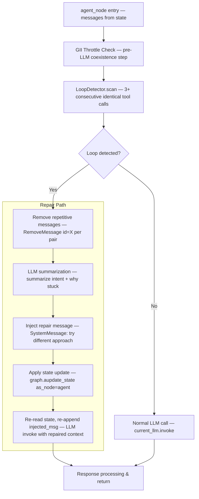
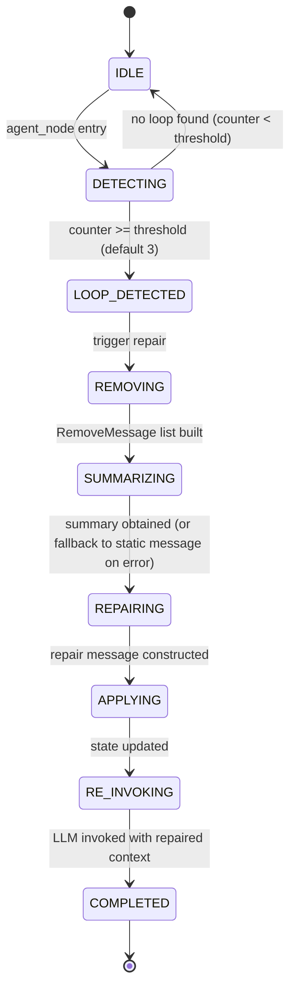

# Plan Overview: General Hallucination Loop Breaker

## Objective

Build a general hallucination-loop detection and repair system that detects when an agent makes **3+ consecutive tool calls with the same parameters** for ANY tool, then **breaks the loop at the LLM level** by removing repetitive messages, summarizing what happened via an LLM call, and injecting a repair message — effectively resetting the LLM's context to escape the hallucination.

## Scope Assessment

**LARGE** — Multiple modules (graph.py, manager.py, compaction.py, config.py, instance_lifecycle.py), new detection logic, LLM-based message repair reusing compaction patterns, and 5 cleanup paths to synchronize. Estimated 1-2 days of focused development.

## Context

- **Project**: agents-ensemble
- **Working Directory**: `/Users/nguyenminhkha/All/Code/opensource-projects/agents-ensemble`
- **Primary DB**: PostgreSQL (dual SQLite/PG support required for new state)

## Background & Problem

The current solution (`ToolThrottleSlot` in graph.py:112-146) only handles `get_instance_info` with escalating sleep delays. It does NOT:
1. Detect loops for arbitrary tools (only `get_instance_info`)
2. Break the hallucination at the LLM level (just sleeps)
3. Address the root cause: stale KV cache in the LLM provider

**Key insight**: Even injecting a message doesn't help if the LLM's KV cache is stale — it will continue hallucinating. We must **compact/repair the message list** so the LLM gets a fresh context window, which also triggers a fresh KV cache at the provider level.

## Architecture

### Detection Algorithm

A **LoopDetector** scans the message tail for consecutive identical tool calls:

1. Walk backwards from `messages[-1]`
2. Group messages into (AIMessage with tool_calls + matching ToolMessages) units
3. For each unit, compute a **signature**: `tool_name + sorted(args_dict)`
4. Count consecutive units with the **same signature**
5. If count >= threshold (default 3) → loop detected
6. Handles parallel tool calls: multiple tool calls in one AIMessage are grouped; the "signature" is the sorted set of all (name, args) pairs in that AIMessage

### Repair Flow (Message-Level)

**Step-by-step message repair:**

1. **Identify the loop tail**: Find consecutive (AIMessage+ToolMessage) units with identical tool signatures
2. **Build removal list**: `RemoveMessage(id=X)` for each message in the repetitive tail (keep at most 1 instance as evidence)
3. **LLM Summarization**: Call LLM with a focused prompt summarizing what the agent was doing and why it got stuck
4. **Construct repair message**: `SystemMessage` with fresh UUID (`f"repair-{uuid4()}"`) containing the summary + instruction to try a different approach
5. **Apply via `graph.aupdate_state`**: `[RemoveMessage(...) * N, repair_SystemMessage]` with `as_node='agent'`
6. **Re-read state**: `await graph.aget_state(thread_config)`, rebuild `full_messages`, re-append `injected_msg` if present
7. **Re-invoke LLM**: `current_llm.invoke(full_messages)` with the repaired, compacted context

## Phase Index

| Phase | Name | Objective | Dependencies | Coupling | Est. Time |
|-------|------|-----------|-------------|----------|-----------|
| 1 | Detection System | LoopDetector + LoopBreakerSlot + config + InstanceManager state | None | — | 4-5h |
| 2 | Message Repair Engine | LoopRepairer class (removal + LLM summary + repair message + state update) | Phase 1 | loose | 4-5h |
| 3 | Integration & Cleanup | Wire into agent_node + build_instance_graph + 5 cleanup paths + GII coexistence + tests | Phase 1, Phase 2 | tight | 4-5h |

### Coupling Assessment

| Coupling | Meaning | Scheduling |
|----------|---------|------------|
| **Phase 1 → Phase 2 (loose)** | Phase 2 uses Phase 1's `LoopDetector` class and `LoopBreakerSlot` interface. No shared file mutations — Phase 2 imports the class. | Can pipeline (Phase 2 can start once Phase 1's interfaces are defined, before full impl) |
| **Phase 2 → Phase 3 (tight)** | Phase 3 wires Phase 2's `LoopRepairer` into `agent_node` — same function body, same file. Phase 3 also touches the same graph.py/manager.py/instance_lifecycle.py files Phase 1 touched. | Must run sequential — wait for Phase 1+2 review |

## Risks & Mitigations

| Risk | Impact | Mitigation |
|------|--------|------------|
| **False positive loop detection** — legitimate repeated tool calls (e.g., polling a resource that changes) trigger unnecessary repair | high | Configurable threshold (default 3). Keep 1 instance of the repetitive call as evidence. Repair message is non-destructive (agent can continue if it was legitimate). Add exclude-list config for known polling tools. |
| **LLM summarization call fails** — the repair LLM call itself errors out | medium | Fallback to static repair message ("You appear to be in a loop. Try a different approach.") without summary. Log the error. |
| **LLM summarization call hangs** — the repair LLM call blocks indefinitely, freezing `agent_node` | **high** | Wrap in `asyncio.wait_for(timeout=summarization_timeout_seconds)`. Default 30s, configurable via `LoopBreakerConfig.summarization_timeout_seconds`. On timeout, use static truncation fallback instead of LLM summary. Repair still completes — only the summary quality degrades. |
| **`aupdate_state` race condition** — state update conflicts with concurrent graph execution | high | The repair runs synchronously inside `agent_node` before the LLM call — same task, same event loop. No concurrent access. Follow the exact pattern of reactive compaction (graph.py:899-958). |
| **injected_msg lost during repair** — repair removes messages but forgets to re-append the injected message | medium | Mirror the C3 fix pattern (graph.py:944-950): after state update + re-read, re-append `injected_msg` to `full_messages`. |
| **Recursion in repair** — the repair LLM call itself triggers another loop detection | low | Repair LLM calls use a separate prompt path (not tool-calling). Detection only scans for tool-call patterns, not plain LLM summaries. |
| **Memory leak if state not cleaned** — `_loop_counters` dict grows unbounded | medium | Replicate all 5 cleanup paths exactly as `_gii_throttle` does (see Phase 3). |
| **`should_continue` ghost-promise/nudge cycles** — these are NOT tool-call loops and won't be caught by tool-signature detection | medium | Phase 1 detects tool-call loops only. Ghost-promise/nudge cycle breaking is a **deferred follow-up** (documented in decisions.md). The repair mechanism (Phase 2) is general enough to be extended later. |
| **AddMessage ID collision on repair message** — reusing an existing ID replaces instead of appends | high | Always use fresh UUID: `f"repair-{uuid4()}"`. Never reuse message IDs. |

## Success Criteria

- [ ] 3+ consecutive identical tool calls (any tool) triggers repair
- [ ] Repetitive messages removed from state via `RemoveMessage`
- [ ] LLM summarization produces a focused summary of the loop
- [ ] Repair `SystemMessage` injected with fresh UUID
- [ ] State updated via `graph.aupdate_state(as_node='agent')`
- [ ] LLM re-invoked with repaired context
- [ ] Existing `get_instance_info` throttle coexists (not broken)
- [ ] All 5 cleanup paths clean up `_loop_counters`
- [ ] Config in `config.py` (threshold, enable/disable, excluded tools, max_repairs, summarization_timeout)
- [ ] Tests pass with mock-based pattern (InjectionSlot/ToolThrottleSlot style)
- [ ] PostgreSQL + SQLite both work for any new state

## Tracking

- **Created**: 2026-07-17
- **Last Updated**: 2026-07-17
- **Status**: draft
