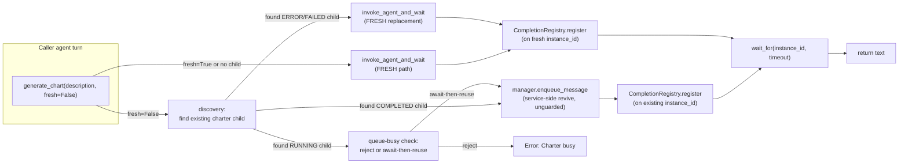

# Technical Analysis: `generate_chart` Iterative Refinement via Per-Caller Charter Reuse

Date: 2026-09-10
Author: planner[v2] via technical-analysis worker (dispatched by planner)
Analysis depth: deep-dive (8 axes + cross-axis interactions + risk register)
Status: Draft — PROPOSED, pending architecture decision by downstream architect

## Question

> *Make `generate_chart` support iterative refinement — successive calls from the SAME caller reach the SAME charter instance (reusing the existing revive/checkpoint machinery) instead of always spawning fresh; keep a deliberate fresh-start escape hatch; tool signature stays backward compatible.*

This is a decision-ready **trade-off analysis** (options + recommendation per axis). The final architecture is owned by a downstream architect — every recommendation here is **PROPOSED**, not decided. **This document does not write the implementation plan.**

## Context Summary

**Current state.** `daemon/tools/chart_tools.py:59-119` defines `generate_chart(description, diagram_type="flowchart", project_id=None)`. It builds a one-shot prompt (`chart_tools.py:91-96`) and unconditionally calls `invoke_agent_and_wait(agent_id="charter", parent_id=current_instance_id, ...)` (`chart_tools.py:101-110`). `daemon/utils.py:588-740` is the only delegate helper used by chart/explore/explain_image (research-chart-tool.md §1, §4); it **always** pre-generates a fresh UUID at `utils.py:650` and spawns via `manager.spawn_instance_with_mcp(..., invoked_as_tool=True)`. There is no reuse seam anywhere on this path (research-chart-tool.md §5).

**Reuse machinery that exists today but is NOT on this path.**
- Service-layer revive-on-send: `daemon/services/instance_messaging.py:1931-1966` flips `COMPLETED|TERMINATED|ERROR|FAILED → RUNNING` on `enqueue_message`, with checkpoint reuse implicit (thread_id = instance_id; `instance_messaging.py:1934-1938`). **PAUSED is deliberately excluded** (`:1939-1943`).
- Permanent parent linkage: `instances.parent_id` survives completion, error, terminate→revive (`daemon/repositories/instance/models.py:61`; research-lifecycle-revive.md §6). `get_children(parent_id)` walks it (`daemon/repositories/instance/repository.py:424-429`).
- In-memory `ReviveGuard` precedent: `manager.py:773` `self._agent_tool_revive_counts: dict[str, int] = {}` — agent-tool path ONLY, IN-MEMORY, lost on restart, ERROR/FAILED consumes, COMPLETED/TERMINATED is free (`manager.py:2792-2899`). Programmatic paths bypass it (`manager.py:2832-2834`; `manager.py:6990-7062` `_revive_terminal_instance` is unguarded recovery).
- SharedMetaKV durable per-instance state: `daemon/repositories/shared_meta_kv/models.py:55` `context_key` + `meta_key` composite unique; repository ops scoped by `context_key` (research-lifecycle-revive.md §5). Any string may serve as `context_key` — partition-agnostic (`:39`).
- `CompletionRegistry`: in-memory module singleton (`daemon/services/completion_registry.py:248-261`); `wait_for` keys on `instance_id` (`:144-163`). `unregister` runs in `finally` at `utils.py:736-740`.

**Constraints on any design.**
- Tool signature must stay backward-compatible — the public signature is `(description, diagram_type="flowchart", project_id=None)` (`chart_tools.py:59-63`); `_full_doc_` at `:121-156`; chart skill at `agents/_prompt_system/innate-skills/chart/skill.md:41-47`.
- Message shape pin: `tests/test_chart_tools.py:150-153` asserts `"User authentication flow" in message` and `"sequence" in message` — message-string changes break these assertions.
- Charter side is **isolation-pure** today (no session memory): `agents/charter/rule.md:11,31` (functional agent, per-instance temp files via `mktemp`); refinement lives only as a caller-side re-invocation convention (`rule.md:12`, `soul.md:34`, `workflow.md:43`). The "Refine, don't hand-edit" wording is in the **chart innate skill** at `chart/skill.md:62` (carried by 15 agents) — **NOT** in charter prompts.
- Prompt-integrity gate `tests/unit/tools/test_prompt_section_reference_integrity.py:80-117` covers `agents/_prompt_system/innate-skills/*` and `agents/<agent>/{soul,rule,workflow,tools_note,memory}.md` — any charter-prompt or chart-skill edit runs through this gate.
- Max-children cap `max_children_per_instance=50` (default, `daemon/config.py:469`) is enforced at spawn (`daemon/services/instance_lifecycle.py:1563-1570`) and counted from transient `instance_hierarchy` rows — completed children free headroom. Completed charters do **not** consume the cap.
- No DB reaper for completed instances or checkpoints (research-lifecycle-revive.md §4) — completed charter instances and their LangGraph checkpoints persist indefinitely; revive depends on this.
- `invoke_agent_and_wait` is shared with `explore` (`daemon/tools/knowledge_tools.py:797-807`) and `explain_image` (`daemon/tools/image_tools.py:513-523`) — neither reuses either; any reuse kwarg on the shared helper changes blast radius across all three delegate tools.

**Verification posture.** This analysis spot-verifies the highest-stakes citations against the source tree (`chart_tools.py`, `utils.py`, `instance_messaging.py`, `manager.py`, `instance.py`, `instance_lifecycle.py`, `repository.py`, `auth.py`, `constants.py`, `child_reports.py`, `completion_registry.py`, `_invoke_semaphore`, `_full_doc_`, `chart/skill.md`, `charter/rule.md`, `tests/test_chart_tools.py`). All cited file:line references were confirmed. The full per-cite verification matrix is in `§ References → Verified citation matrix`. Items where the research flagged "unconfirmed" are marked `[unconfirmed]` below.

---

## Architecture

### Current Patterns

- **One-shot fresh-spawn delegate** — `generate_chart → invoke_agent_and_wait → spawn_instance_with_mcp(invoked_as_tool=True) → enqueue_message → wait_for(CompletionRegistry)` (chain: `chart_tools.py:101 → utils.py:670 → manager.spawn_instance_with_mcp → utils.py:677-682 → utils.py:689`). No reuse seam.
- **Service-layer revive-on-send** — `daemon/services/instance_messaging.py:_prepare_enqueued_message` flips terminal→RUNNING (`:1948-1959`), PAUSED excluded (`:1939-1943`), checkpoint reuse implicit via thread_id = instance_id (`:1934-1938`). Available to `enqueue_message` callers — `invoke_agent_and_wait` does not opt in today.
- **Permanent vs transient hierarchy** — `instances.parent_id` survives all lifecycle transitions (`models.py:61`, `repository.py:251-257`); `instance_hierarchy` rows are deleted at completion (`:251-253`). Discovery (`get_children`, `list_child_ids_permanent`) uses permanent; cap counting (`count_children`) uses transient.
- **Closure-injected per-instance tool factory** — `create_chart_tools(manager, current_instance_id)` (`chart_tools.py:33`); wired by `create_instance_tools` at `daemon/tools/instance.py:4316-4317`. Same pattern as `explore` and `explain_image`.
- **Agent-tool-only `ReviveGuard` precedent** — in-memory dict `manager.py:773`, scope ERROR/FAILED consumes only, COMPLETED/TERMINATED free (`manager.py:2876-2886`); programmatic paths bypass (`manager.py:2832-2834`). Reference design for any new in-memory tracking layer.
- **Partition-agnostic durable KV** — `shared_context_metadata` keyed `(context_key, meta_key)` (`models.py:55,72`); repo ops scoped by `context_key` (`:42-47`). Survives restart; ambient rendering to agents exists but is independent of direct repo access.

### Module Boundaries (relevant slice)

```
[chart carrier agent turn]
        │
        ▼
[create_chart_tools(manager, current_instance_id)] ─── chart_tools.py:33
        │
        ▼
[generate_chart(description, ...)] ──────────────────── chart_tools.py:59
        │
        ▼
[invoke_agent_and_wait(agent_id="charter", parent_id=current_instance_id,
                       invoked_as_tool=True, ...)] ─── utils.py:588
        │
        ├─► semaphore.acquire() ────────────────────── utils.py:643-647  (cap = WORKER_POOL_SIZE - 1)
        ├─► spawn_instance_with_mcp(...) ───────────── manager.spawn_instance_with_mcp
        │       └─► InstanceLifecycleService.spawn_instance
        │             (parent_id permanent, max_children cap checked 1563-1570,
        │              invoked_as_tool stored as instance_metadata 1798-1799)
        ├─► CompletionRegistry.register(instance_id) ─ utils.py:674
        ├─► manager.enqueue_message(source="internal_invoke_and_wait:{parent_id}")
        │       └─► InstanceMessagingService._prepare_enqueued_message
        │             (NO-OP revive today because target is a fresh spawn,
        │              but if instance_id were an existing terminal instance
        │              this WOULD flip to RUNNING and reload checkpoint)
        ├─► CompletionRegistry.wait_for(instance_id) ── utils.py:689
        └─► CompletionRegistry.unregister(instance_id) finally utils.py:736-740

  Side data path (unchanged, would inform reuse discovery):
  [instances.parent_id] ──── get_children(parent_id) ──── repository.py:424-429
  [shared_context_metadata] ─── shared_meta_kv_repo ──── manager.py:2115-2126
  [CompletionRegistry (in-mem)] ─── completion_registry.py:46-49
```

### Architecture Diagram — Reuse Proposal Surface



---

## Integration Points

| # | Integration | Type | Contract | Auth | Failure Mode | File:Line |
|---|-------------|------|----------|------|--------------|-----------|
| 1 | `invoke_agent_and_wait` (utils) | sync async helper | `(manager, agent_id, message, ..., return_instance_id=False) -> str \| tuple` | n/a (intra-process) | Timeout → fire-and-forget terminate + `"Error: Agent timed out after {t}s"` string; error → `"Error: Agent failed. {content}"`; exception → `_try_terminate_orphan` + `"Error: {e}"` | `daemon/utils.py:588-740` |
| 2 | `manager.enqueue_message` | async service | kwargs `source`, `priority`, `images`, `metadata`, `is_deferred`, `is_background`, `work_id`; **NO** `context`/`load_skill` | n/a (intra-process) | Service-side revive-on-send flips terminal→RUNNING; PAUSED excluded; throws on unknown instance | `daemon/services/instance_messaging.py:1931-2011, 2070-2083` |
| 3 | `CompletionRegistry.register / wait_for / unregister` | in-process event | keyed by `instance_id`; lazy singleton | n/a | `wait_for` returns `None` on timeout; `result.is_error` surfaces as `"Error: Agent failed."` | `daemon/services/completion_registry.py:46-49, 61, 144-163, 188` |
| 4 | `_invoke_semaphore` | in-process | `asyncio.Semaphore(max(1, WORKER_POOL_SIZE-1))` singleton | n/a | Caller awaits acquire; no timeout (potential hang under saturation) | `daemon/utils.py:554-569, 643-647` |
| 5 | `instances` table | durable (PostgreSQL) | `parent_id` indexed nullable; permanent; `instance_metadata.invoked_as_tool` JSONB | n/a | row missing → repository returns `None` | `models.py:61`, `instance_lifecycle.py:1798-1799` |
| 6 | `shared_context_metadata` table | durable (PostgreSQL) | composite `(context_key, meta_key)` unique; JSONB payload | n/a | row missing → `None`; partition-agnostic | `models.py:55,72`, `repository.py:42-47` |
| 7 | `chart_tools` → `charter` agent | agent delegate | `instance_name=f"chart-{description[:30]}"`, `parent_id=current_instance_id`, `invoked_as_tool=True` | `TOOL_REQUIRED_AGENTS["chart"] = ["charter"]` implicit via `tools.allow` | Spawn refused (governor guard) → `ValueError("Spawn refused...")` matched at `utils.py:720-735` | `chart_tools.py:101-110`, `_auth.py:35-40` |
| 8 | Charter prompt integrity gate | file scope | all `agents/_prompt_system/innate-skills/*` + per-agent `{soul,rule,workflow,tools_note,memory}.md` | n/a | prompt edits without scope updates → test failure | `tests/unit/tools/test_prompt_section_reference_integrity.py:80-117` |

### Integration Details (non-obvious)

- **Integration 2 — service-side revive is the load-bearing seam for reuse.** The `invoke_agent_and_wait` helper pre-generates a fresh UUID at `utils.py:650` and *then* calls `manager.spawn_instance_with_mcp(...)` at `:670`. To reuse, the chart path needs to **skip spawn** and call `manager.enqueue_message` directly against an existing terminal child — `instance_messaging.py:1931-1966` then revives it. But `CompletionRegistry.register` (`utils.py:674`) is keyed by `instance_id` and there is **no existing path** that calls it without also spawning; the helper couples spawn+register+enqueue+wait as one unit (`:656-740`).
- **Integration 4 — semaphore is a single shared resource.** `WORKER_POOL_SIZE` defaults to 4 (`daemon/constants.py:54` per project blueprint). The cap of 3 in-flight `invoke_agent_and_wait` calls is global — shared with `explore` and `explain_image`. A new reuse path that *also* acquires this semaphore (because it still goes through the helper for the wait phase) competes for the same 3 slots. A reuse path that bypasses the helper must re-implement the wait pattern, including the buffered-completion race handling at `utils.py:684-686`.
- **Integration 7 — governor recursion guard blocks delegate cycles.** `instance_lifecycle.py`'s spawn path raises `ValueError("Spawn refused...")` on guard hit (per `utils.py:720-735` substring match). A reuse path that bypasses spawn cannot trigger this — but a misuse path that spawns chart from chart (e.g., charter's own tools) already triggers it today; reuse does not change the surface here.

---

## Per-axis Analysis

### Axis 1 — REUSE MECHANISM

**Context.** Today `invoke_agent_and_wait` is a single coupled unit (spawn → register → enqueue → wait → unregister, `utils.py:656-740`). There is no helper that does "register+enqueue+wait for an *existing* instance." Any reuse mechanism must either extend this helper or build a parallel one in `chart_tools`.

#### Options

- **(a) chart_tools-local helper** — `chart_tools.py` discovers an existing charter child, and on hit calls `manager.enqueue_message` directly (service-side revive, `instance_messaging.py:1931-1966`, unguarded). On miss/error it falls through to the existing `invoke_agent_and_wait` path. Implementation needs a small `CompletionRegistry.register` + `wait_for` + `unregister` block mirroring `utils.py:672-740`.
- **(b) Extend `invoke_agent_and_wait` with a `reuse_instance_id: str | None = None` kwarg** — when set, skip spawn; do register / enqueue / re-register / wait / unregister against the existing id. Touches the shared helper (also used by `explore`, `explain_image`). `tests/test_image_tools.py` Section 5 pins the backward-compat signature (`research-chart-tool.md §4`).
- **(c) Other / hybrid** — e.g., extract a `_register_enqueue_wait(manager, instance_id, message, source, ...)` private helper that both paths use; chart_tools-local path can call it without a kwarg explosion on the public helper.

#### Trade-offs

| Criterion | (a) chart_tools-local | (b) extend `invoke_agent_and_wait` | (c) hybrid private helper |
|---|---|---|---|
| Blast radius | 1 file (`chart_tools.py`) + new helper in same file | 1 shared helper + 2 sister tools (`explore`, `explain_image`) must remain signature-stable; their tests pin kwargs | New private helper; both `invoke_agent_and_wait` and `chart_tools` refactor |
| Backward-compat risk | Lowest — public surface unchanged | Highest — must preserve all pinned kwargs in `tests/test_chart_tools.py:117-153`, `tests/test_image_tools.py:730-909` | Medium — private refactor, public stable |
| Reuse of revive machinery | Direct: `manager.enqueue_message` already flips terminal→RUNNING | Direct: same | Direct: same |
| Wait/registration race handling | Re-implemented in chart_tools (must mirror `utils.py:684-686` re-register) | Re-used | Re-used |
| Code duplication | Some (register/wait/unregister block) | None | None |
| Future sibling reuse | Other tools (explore/explain_image) must duplicate | Trivial — just set `reuse_instance_id` | Trivial — call private helper |

#### PROPOSED Recommendation

**(a) chart_tools-local helper**, with a thin private helper *inside `chart_tools.py`* that does `register → enqueue → wait → unregister` against an existing `instance_id` (mirroring `utils.py:672-740`, including the re-register race fix at `:684-686`). **Reasoning:** the reuse feature is chart-specific (no other delegate tool has a "same caller, same delegate" semantics); it should not bleed into `invoke_agent_and_wait` where `explore` and `explain_image` have pinned test surfaces. The duplication is small (≤30 LOC) and self-contained. **Pending architecture decision**: whether to extract (c) instead if/when `explore` or `explain_image` wants the same capability.

#### Risks

- **R1.1** Two near-identical register/wait/unregister blocks (`utils.py:672-740` and the new chart_tools-local one) drift over time. Mitigation: extract to a private helper inside `daemon/utils.py` if duplication grows; today, keep separate and document the contract.
- **R1.2** Service-side revive is **unguarded** — a programmatic `manager.enqueue_message` against a terminal child bypasses the agent-tool `ReviveGuard` (`manager.py:2832-2834`; `manager.py:6990-7062`). For ERROR/FAILED children this is the existing recovery path; for COMPLETED/TERMINATED it is non-consuming under the agent-tool guard but never consulted here. **Axis 5 is the natural place to decide whether chart reuse self-imposes a budget.**
- **R1.3** `CompletionRegistry.wait_for` returns `None` on timeout, and `invoke_agent_and_wait` reacts with fire-and-forget `_try_terminate_orphan` (`utils.py:691-697`). A reuse-path timeout that reuses this pattern will *terminate the shared charter instance* — which means the **next refine call sees TERMINATED and revives a still-running instance** (or worse, orphans an in-flight turn). See Axis 5 for the timeout-interaction analysis.

### Axis 2 — TRACKING STORE (caller→charter mapping)

**Context.** No durable caller→charter map exists today (`research-chart-tool.md §5`). A reuse mechanism needs to discover the caller's prior charter on subsequent calls.

#### Options

- **(a) Query-discovery each call** — `get_children(current_instance_id)` (`repository.py:424-429`) → filter `agent_id == "charter"` and `instance_metadata.invoked_as_tool` → sort by `last_activity_at` desc → take first. Stateless. Survives restart. **No new state.**
- **(b) In-memory dict on manager** — `{caller_instance_id → charter_instance_id}` keyed dict, like `_agent_tool_revive_counts` (`manager.py:773`). Fast O(1). **Lost on restart** (precedent: `manager.py:2792-2793`).
- **(c) SharedMetaKV** — `(context_key=current_instance_id, meta_key="charter_instance_id")` → JSON `{charter_id, last_used, status_snapshot}`. Survives restart. Partition-agnostic (`models.py:39`). Read/write via `manager.shared_meta_kv_repo` (`manager.py:2115-2126`).
- **(d) New `instances` column** — e.g., `instances.delegate_charter_id` or `instance_metadata.delegate_charter_id`. Heaviest; needs migration.

#### Trade-offs

| Criterion | (a) query-discovery | (b) in-mem dict | (c) SharedMetaKV | (d) new column |
|---|---|---|---|---|
| Survives restart | ✅ | ❌ (lost; precedent `manager.py:2792-2793`) | ✅ | ✅ |
| Latency | O(N) DB query per call (filter by parent_id+agent_id; N typically 1) | O(1) in-mem | O(1) DB read by indexed key | O(1) DB read |
| Race / staleness | Always fresh (truth at query time) | Can point to deleted instance | Can point to deleted instance | Always fresh |
| Multi-child pick | Need to define "the charter" (latest? oldest? most recent activity?) | Last write wins | Last write wins | Last write wins |
| Blast radius | Zero schema change | Add attr on manager + lost-on-restart caveat | New repo calls in tool code | Migration + ORM change |
| Cleanup when charter completes | Automatic | Manual eviction needed | Manual eviction needed (or accept staleness) | Manual eviction |
| Multiple chart skill carriers share same caller | Works (same `current_instance_id` returns same list) | Same | Same | Same |

#### PROPOSED Recommendation

**(c) SharedMetaKV**, with **(a) query-discovery as the verification cross-check on read**. **Reasoning:** the cost difference vs (a) is one indexed lookup; (b) loses state on restart which violates "successive calls from the SAME caller reach the SAME charter" — the second call after restart would spawn a new charter; (d) is a schema migration for what is fundamentally a derived relationship (caller→most-recent-delegate-of-type-charter) — better to store as a small pointer than as a relational column. **Pick rule:** on each call, query-discover ALL charter children (parent_id, agent_id, invoked_as_tool=True); if exactly one exists and is terminal, use it; if multiple exist, use the one with the latest `last_activity_at` (deterministic); if the SharedMetaKV cache disagrees with the DB, **DB wins** (it's the source of truth). The KV is a write-through cache to avoid querying on every call once the relationship is established.

#### Risks

- **R2.1** Caller spawns many charters over time (refine cycle → success → fresh-start → another refine → …). With KV "last write wins," old charter IDs stay valid in DB but the next reuse only sees the latest. **Intentional** under "reusing the SAME charter" semantics — but means a caller who wants to resume a 5-iterations-ago chart cannot; that requires a different key shape.
- **R2.2** A charter is COMPLETED, then the caller itself COMPLETES (and is revived later by a fresh user message). The KV entry is keyed by `current_instance_id` — which is now the revived caller's row id, **same UUID**. The mapping still resolves; the caller's checkpoint history would now contain "you spawned a charter" — the revive path of the caller does NOT wipe child spawn history. **Intentional under the per-caller key choice (Axis 3).**
- **R2.3** `SharedMetaKV` writes are not transactional with `spawn_instance`. If the spawn succeeds but the `set_kv` write fails, the next call discovers the charter via (a) anyway and re-populates the cache. **Self-healing** — but a one-call latency penalty.

### Axis 3 — SCOPING KEY

**Context.** Multiple plausible scopes for the caller→charter mapping.

#### Options

- **(a) Per-caller-instance (per `current_instance_id`)** — the most local; matches "same caller" semantics directly. The fan-out case (multiple children of one caller, each calling `generate_chart`) yields **N charters**, one per caller child — clean, no cross-talk.
- **(b) Per-context-key / per-tree-root** — all callers under the same tree-root share one charter. **Cross-talk risk**: caller-child-A refines the diagram with description X; caller-child-B's first call reuses the same charter and sees X in its history.
- **(c) Per-session / per-user / other** — `instances.parent_id` chain walked to a session root? No clean "session" primitive exists today (sessions are HTTP request-scoped; user-id lives in source adapters but not on instance rows).

#### Trade-offs

| Criterion | (a) per-caller-instance | (b) per-context-key | (c) per-session |
|---|---|---|---|
| "Same caller" match | ✅ exact | ❌ over-broad | ❌ no primitive |
| Fan-out safety | ✅ one charter per leaf caller | ❌ siblings collide | n/a |
| Cross-talk risk | None | High — sibling callers share diagram history | n/a |
| Caller revive semantics | Mapping survives (same UUID); charter reuse persists across caller's terminal-revive cycles | Mapping survives if context_key is rooted at tree-root (typically a stable id) | n/a |
| Implementation | `context_key = current_instance_id` | `context_key = tree_root_id` (would need to compute via `get_tree_ids_permanent`) | n/a |

#### PROPOSED Recommendation

**(a) per-caller-instance**, keyed by `current_instance_id`. **Reasoning:** "same caller" is the strongest, most local semantic; fan-out (which is the *normal* shape — a leader spawning multiple sub-workers, each calling `generate_chart`) is safe by construction; cross-talk is impossible. The cost is that callers with very short lifetimes cannot share refinement across a fresh spawn — but that is the right behavior, since a fresh-spawn caller is by definition a different identity.

#### Risks

- **R3.1** Caller COMPLETED then revived by a fresh user message — same UUID, same KV entry, charter reuse continues. **This is correct** but the charter's history will now contain a gap of unrelated turns (the caller's revived conversation may not relate to the chart). The charter sees a "human says X" message and prior chart history mixed in the checkpoint. Whether the LLM handles this gracefully is an empirical question — addressed in Axis 7.
- **R3.2** Multiple callers with the SAME `current_instance_id` is impossible by construction (UUIDs are unique). **Not a risk.**

### Axis 4 — FRESH-START API SHAPE

**Context.** Backward-compatible tool signature is a hard constraint (`chart_tools.py:59-63`; `tests/test_chart_tools.py` pins; `_full_doc_` at `:121-156`; `chart/skill.md:41-47` signature contract). The default semantics **change**: a second call from the same caller now reuses the first call's charter. This is a behavior change for all 15 chart-skill carriers and for `tests/test_chart_tools.py` message-shape pins.

#### Options

- **(a) Additive kwarg `fresh: bool = False`** — `fresh=False` (default) → reuse; `fresh=True` → spawn a new charter child and write the new id into the KV (overwriting the prior). Single new positional-or-keyword arg.
- **(b) Mode enum** — `mode: Literal["reuse", "fresh"] = "reuse"`. More extensible (could later add `"session"` or `"isolated"`).
- **(c) Separate tool** — `generate_chart_fresh()` as a sister tool. Hardest to discover; breaks the single-tool contract; no.
- **(d) Implicit-only reuse** — always reuse, never offer fresh-start. Breaks the "deliberate fresh-start escape hatch" requirement.

#### Trade-offs

| Criterion | (a) `fresh: bool = False` | (b) mode enum | (c) separate tool | (d) implicit only |
|---|---|---|---|---|
| Discoverability | ✅ simple | ✅ explicit | ❌ hidden | ❌ no escape |
| Backward-compat | ✅ additive | ✅ additive | ❌ two tools | ✅ no signature change |
| Default behavior | Reuse (CHANGE) | Reuse (CHANGE) | n/a | Reuse (CHANGE) |
| LLM carrier prompt change | Minimal — `chart/skill.md:62` "Refine, don't hand-edit" already encodes refine-by-recall | Same as (a) | New prompt section | None |
| Test pin blast radius | Update `tests/test_chart_tools.py` if any pin reads `fresh` arg | Same | Two test files | None |

#### PROPOSED Recommendation

**(a) additive kwarg `fresh: bool = False`**, with the change documented in the chart skill at `chart/skill.md` as an evolution of the existing "Refine, don't hand-edit" rule (line 62) into "Refine → calls reuse the same charter; pass `fresh=True` for a clean slate." **Reasoning:** matches the existing `fresh`-style naming elsewhere in the codebase (e.g., `is_deferred`, `is_background` kwargs on `enqueue_message` — `instance_messaging.py:2070-2083`); single bool is enough for v1; the mode enum is over-engineered for a binary choice.

**Default-semantics-change is unavoidable** — the request explicitly says "successive calls from the SAME caller reach the SAME charter." This is a *feature*, not a regression; callers that want single-shot behavior opt in with `fresh=True`. The chart skill update at `chart/skill.md:62` is the carrier-prompt broadcast surface.

#### Risks

- **R4.1** The default change affects 15 carrier agents (per `research-charter-tests.md §3`) — any carrier that legitimately relies on "each call is independent" (e.g., batch-producing 5 distinct diagrams in one turn) must now pass `fresh=True` explicitly. Mitigation: update `chart/skill.md:62` with the explicit guidance; emit a one-shot migration note in `.agents/shared/conventions.md` if warranted.
- **R4.2** `tests/test_chart_tools.py:117-153` pins `invoke_agent_and_wait` kwargs and message content — message pins are unaffected by adding a kwarg; kwarg pins do not exist for chart (only delegation kwargs are pinned). **Low blast radius.**
- **R4.3** Carrier agents whose prompts *don't* read `chart/skill.md` (e.g., user-authored prompt files outside the innate-skill system) might not see the new default behavior documented. Mitigation: rely on the existing `innate_skills: ["chart"]` → skill load contract.

### Axis 5 — ERROR/FAILED CHARTER POLICY

**Context.** When the discovered charter is in ERROR or FAILED status (not COMPLETED), reuse semantics are ambiguous: revive the failed child (re-running its failing turn) vs. always spawn a fresh replacement.

#### Options

- **(a) Always respawn fresh on ERROR/FAILED** — never reuse a failed charter. Equivalent to "fresh=True implicit on failure."
- **(b) One revive attempt on ERROR/FAILED, then respawn** — mirror the agent-tool `ReviveGuard` budget (`manager.py:2876-2886`: ERROR/FAILED consumes, COMPLETED/TERMINATED free; cumulative, daemon-restart-lost).
- **(c) Mirror `ReviveGuard` exactly** — same counter semantics; programmatic reuse path self-imposes the budget. Same precedent as `send_message` tool guard.
- **(d) Unguarded programmatic path** — always reuse any terminal status. Same as today's `_revive_terminal_instance` (`manager.py:6990-7062`).

#### Trade-offs

| Criterion | (a) always fresh on failure | (b) one revive then fresh | (c) mirror ReviveGuard | (d) unguarded |
|---|---|---|---|---|
| Recover transient failures (LLM flake, mmdc timeout) | ❌ | ✅ | ✅ (counter consumes on retry; mirrors `manager.py:2876-2886`) | ✅ |
| Bound thrash on persistent failure | ✅ (always respawn) | ✅ (respawn after one try) | ✅ (respawn after counter exhausts) | ❌ (revive-fail-loop possible) |
| Consistency with `send_message` tool | None | Partial | ✅ | None |
| Complexity | Lowest | Medium | Medium (counter + read/write helper) | Lowest |

#### PROPOSED Recommendation

**(b) one revive attempt on ERROR/FAILED, then respawn on next call**, implemented as a small `ReviveCounter`-style dict in `chart_tools.py` keyed by charter `instance_id` — **mirrors the existing precedent at `manager.py:773`** but scoped tightly: only the chart-tools reuse path consults it; the global `ReviveGuard` is unchanged. **Reasoning:** persistent failure should not block the refinement loop, but a single retry is cheap and recovers transient LLM/mmdc flakes that are documented at `agents/charter/workflow.md:153-161`. Mirroring `ReviveGuard`'s scope (ERROR/FAILED consumes) keeps the conceptual model coherent. The counter is **per-charter-instance** (not per-caller) — matches the precedent.

**Special case: timeout interaction.** `invoke_agent_and_wait` timeout at `utils.py:691-697` triggers `_try_terminate_orphan` → `manager.terminate_instance(...)` which sets status to TERMINATED. Under reuse, a timed-out first call leaves the shared charter TERMINATED. The second call sees TERMINATED (which is COMPLETED-style free per `manager.py:2876-2886`) and revives cleanly — **unless the charter was *genuinely* still running** at the moment of timeout (the fire-and-forget terminate races with the in-flight turn). Worst case: the second call sees RUNNING from the orphan's late commit; with the queue-busy guard from Axis 6 this is rejected cleanly. **No additional mitigation required beyond Axis 6.**

#### Risks

- **R5.1** In-memory counter is lost on restart (precedent `manager.py:2792-2793`). A restart between the failed call and the retry allows the retry to happen unconditionally. **Acceptable** — same precedent, same limitation, same operator expectation.
- **R5.2** The counter is per-charter-instance; if the caller passes `fresh=True` mid-loop, the old charter's counter is orphaned (still in memory) and the new charter starts at 0. **Acceptable** — old charter's counter becomes dead weight in the dict, eventually bounded by the number of distinct fresh-started charters over daemon lifetime (low for typical use).
- **R5.3** Programmatic reuse path is ungated by the agent-tool `ReviveGuard` (`manager.py:2832-2834` is explicit: "service-layer revive path must NEVER call this"). The local counter in `chart_tools.py` is a **separate** mechanism with **separate semantics** (per-charter, ERROR/FAILED only). **No conflict, but document clearly** to prevent future readers from conflating the two.

### Axis 6 — CONCURRENCY (same caller, two charts in one turn)

**Context.** A caller fires `generate_chart(...)` twice in one turn (two genuinely different diagrams). With reuse, both calls land on the SAME charter instance — sequentially, not interleaved.

#### Options

- **(a) Sequential (queue the second after the first completes)** — second call sees the charter terminal again (after first call's completion) → enqueues → waits. **No interleaving.** The charter history will contain two `Create a diagram` messages.
- **(b) Spawn a second charter (always fresh on concurrent calls)** — detect in-flight reuse and auto-escalate to fresh. Implicit `fresh=True` when a prior reuse is in-flight.
- **(c) Reject the second call with `"Error: Charter busy"`** — mirror `send_message`'s queue-busy guard at `daemon/tools/instance.py:2930-2936`. Forces caller to retry next turn.
- **(d) Allow interleaving on the SAME charter instance** — **impossible** because a single LangGraph instance has one event loop; enqueueing a second message while the first is mid-turn blocks at the message queue (`pending_count`).

#### Trade-offs

| Criterion | (a) sequential | (b) auto-fresh | (c) reject | (d) interleave |
|---|---|---|---|---|
| Correctness | ✅ both succeed | ✅ both succeed | ❌ second fails | n/a (impossible) |
| Predictability | ✅ deterministic | ⚠ implicit behavior surprise | ⚠ error string for caller | n/a |
| Charter history | Both diagrams in one history | Two separate histories | n/a | n/a |
| Implementation | Default — no extra logic | Needs in-flight detection | Mirror `instance.py:2930-2936` check | n/a |
| Caller LLM experience | Refines same charter with two distinct specs | Clean separation per call | Must retry next turn | n/a |

#### PROPOSED Recommendation

**(a) sequential by default**, with **(c) reject as the fail-safe when the caller tries to fire two reuse calls truly concurrently** (not just sequentially). **Reasoning:** the LangGraph instance is single-threaded per `instance_id`; two enqueued messages run in order (`pending_count` blocks the second from being claimed until the first completes — `daemon/tools/instance.py:2930-2936` documents this exact pattern). The "two distinct diagrams in one turn" use case naturally lands sequentially with both diagrams in the same charter history — the caller can ask the charter to focus on the latest spec. The reject path (c) catches the edge case where the caller fires `generate_chart(...)` twice in flight (no `await` between them), which would otherwise deadlock on `wait_for` for the same `instance_id`.

**Wait mechanics:** `CompletionRegistry.wait_for(instance_id)` is keyed by `instance_id` and uses `asyncio.Event.wait()` (`completion_registry.py:144-163`). A second concurrent `register` + `wait_for` on the same id before the first fires `complete()` would block on the same event and **return the first completion** for both — semantically wrong. Therefore the fail-safe rejection is necessary: detect via a per-charter `_in_flight: set[asyncio.Event]` or a simple "second call to reuse path for an already-registered instance_id in same asyncio task" check, and surface `"Error: Charter busy; pass fresh=True for parallel charts."`

#### Risks

- **R6.1** The semaphore (`utils.py:554-569`, cap `WORKER_POOL_SIZE-1`) is global; a reuse path that still acquires it for the wait phase competes with `explore`/`explain_image`. If the reuse path *bypasses* the semaphore (because it skips spawn, no acquire needed), then no contention. **The chart_tools-local helper in Axis 1 should NOT acquire the semaphore on the reuse branch.**
- **R6.2** If the second call's enqueue happens before the first call's charter has flipped back to COMPLETED (i.e., race during the first call's `wait_for` returning), the second call sees the charter in RUNNING status (the first call's revival). Queue-busy guard fires → reject. **Acceptable** — caller retries.
- **R6.3** `invoke_agent_and_wait`'s `finally` unregisters at `utils.py:736-740`. The chart_tools-local helper must do the same. **Must mirror.**

### Axis 7 — CHARTER PROMPT DELTA (minimal)

**Context.** Revived charter receives the new `Create a diagram…` message with full prior history in checkpoint. Question: does the charter prompt need any change?

#### Options

- **(a) No prompt change** — trust that prior history (the previous diagram, the previous NEEDS MORE INFO if any, the prior description) gives the charter enough context to refine.
- **(b) Add a one-line "this may be a refinement" hint in the message** — `chart_tools.py:91-96` message construction is pinned by `tests/test_chart_tools.py:150-153`; changing the message shape breaks the pins. But the *content* of the message could add an optional trailing line `Note: this may be a refinement of a prior diagram.` — the pins assert substring presence, not exact match.
- **(c) Update charter `rule.md`/`soul.md`/`workflow.md`** — add a brief refinement acknowledgement rule. Triggers the prompt-integrity gate (`tests/unit/tools/test_prompt_section_reference_integrity.py:80-117`).

#### Trade-offs

| Criterion | (a) no prompt change | (b) message note | (c) charter prompt update |
|---|---|---|---|
| Charter behavior quality | Unknown — depends on LLM reading history | Slight signal bump | Strongest signal |
| Test pin blast radius | None | None (substring-only pins at `tests/test_chart_tools.py:150-153`) | New gate test may need a new section reference |
| `agents/charter/rule.md:31` ("Per-instance isolation") conflict | ✅ no contradiction | ✅ no contradiction | ✅ if worded carefully — isolation is about *concurrent* instances, not about refinement |
| Carrier prompt change | None | None | None (charter side only) |
| Chart skill change | None | None | None |

#### PROPOSED Recommendation

**(a) no prompt change**, with **(b) optional message note as a non-breaking add-on if empirical testing shows the LLM doesn't pick up the refinement intent from history alone.** **Reasoning:** the charter is a functional agent that works from the request (`rule.md:11`) — the request on a reuse call still says "Create a flowchart diagram. Description: X." The charter will produce X; the prior history is in the checkpoint and the LLM is free to read it. Charter's own `NEEDS MORE INFO` guidance (`rule.md:12`, `workflow.md:43`) already covers the case where the request is ambiguous; if the LLM needs explicit "this is a refinement" signal, that is a **(b)** follow-up, not a v1 requirement. **Pending architecture decision** based on a small A/B prompt test post-implementation.

**Note on `rule.md:31` "Per-instance isolation":** this rule is about **concurrent** charter instances colliding on temp files (the `mktemp` requirement at `:6,20`). It does **not** prohibit session/refinement semantics within one instance — the isolation is filesystem-scoped, not conversation-scoped. No contradiction.

#### Risks

- **R7.1** Charter produces a duplicate-of-prior diagram because it didn't realize the request was a refinement. **Operator-acceptable** — caller can re-call with more explicit description.
- **R7.2** If the caller is revived (Axis 3 R3.1) and the charter sees the caller's mixed conversation history, the LLM may infer context that doesn't apply. **Empirical** — same risk as every multi-turn conversation.

### Axis 8 — OBSERVABILITY

**Context.** Reuse vs fresh-spawn is a meaningful operational distinction; on incident review, "why did this chart use a stale charter?" must be greppable.

#### Options

- **(a) Single INFO log line on every chart invocation, distinguishing reuse vs fresh** — `chart_tools.py` is the natural home. Format proposal: `"generate_chart: caller={caller[:8]}... charter={charter_id[:8]}... mode={reuse|fresh|reuse-fresh-fallback} prior_status={COMPLETED|...}"`.
- **(b) Two log lines: one in chart_tools (reuse decision), one in utils/spawn (fresh path)** — split provenance, more grep targets but harder to correlate.
- **(c) Rely on existing `Reactivating terminal instance` log** — `instance_messaging.py:1963-1966` already logs the service-side revive. Adds a chart_tools-side log only on the *fresh* branch (which doesn't currently log).

#### Trade-offs

| Criterion | (a) chart_tools one-line | (b) two lines | (c) reuse existing log |
|---|---|---|---|
| Greppability | ✅ single field `mode=` | ⚠ two patterns | ⚠ reuses infra log |
| Correlation | Easy (caller + charter id in one line) | Requires timestamp join | Requires lookup of which caller triggered which charter |
| Fresh-spawn visibility | ✅ included | ✅ | ❌ (spawn path doesn't log) |
| Implementation cost | ~5 LOC | ~10 LOC | ~2 LOC |

#### PROPOSED Recommendation

**(a) chart_tools one-line INFO log** at the top of `generate_chart`, after the discovery step, including: caller id prefix, charter id prefix (or "spawn"), mode (`reuse` / `fresh` / `reuse-respawn-after-failure`), prior_status if known. **Reasoning:** single greppable surface; matches the precedent at `instance_messaging.py:1963-1966` for terminal-revival logs and at `manager.py:2847-2848` for `ReviveGuard` grant logs (verbatim format strings). The log is the first thing an operator looks at during a refine-loop incident.

#### Risks

- **R8.1** Log volume: 1 extra INFO per `generate_chart` call — negligible (charter spawn is already heavy; one extra log line is in the noise).
- **R8.2** No log line if discovery itself fails (e.g., DB error). **Acceptable** — DB errors propagate to the caller as exception, which is its own log surface.

---

## Cross-axis Interactions

### Mechanism × Store (Axes 1 × 2)

The chart_tools-local helper (Axis 1a) and SharedMetaKV cache (Axis 2c) compose cleanly: discovery first queries the DB via `get_children` (truth); the KV is a write-through cache populated after a successful fresh-spawn so subsequent calls can skip the DB scan. The store choice is **independent of** the mechanism choice — both options (a) and (b) in Axis 1 work with all four options in Axis 2.

### Scoping × Fan-out (Axes 3 × 6)

Per-caller-instance scoping (Axis 3a) plus sequential-default-with-reject-fail-safe (Axis 6a+c) means each leaf caller has its own charter, and a leaf caller firing two charts in one turn gets sequential processing on its own charter with a clean reject signal if it tries to fire truly concurrently. **No cross-talk possible** under this combination — the fan-out case (multiple leaf callers) is structurally safe.

### Mechanism × ERROR/FAILED Policy (Axes 1 × 5)

The chart_tools-local helper (Axis 1a) is the natural home for the local per-charter revive counter (Axis 5b). If the mechanism were instead (Axis 1b, extend `invoke_agent_and_wait`), the counter would have to live in `utils.py` and would risk being mis-applied by `explore`/`explain_image`. Co-locating mechanism and ERROR/FAILED policy in `chart_tools.py` keeps the blast radius tight.

### Store × Scoping (Axes 2 × 3)

SharedMetaKV with per-caller-instance context_key (Axes 2c × 3a) means each `current_instance_id` has its own row keyed `(context_key=caller_id, meta_key="charter_instance_id")`. The composite unique constraint (`models.py:72`) prevents collisions. **Clean, no interaction risk.**

### Fresh-start × Scoping (Axes 4 × 3)

When a caller passes `fresh=True` (Axis 4a), the chart_tools path bypasses the KV cache lookup, spawns a new charter, and overwrites the KV entry with the new charter id. Subsequent reuse calls land on the fresh charter. **Intentional.** When a caller passes `fresh=True` repeatedly within one turn, each spawn increments the spawn count but does not consume the per-charter revive counter (which is keyed by `charter_instance_id`, not caller).

### API shape × Tests (Axis 4 × test pins)

Adding `fresh: bool = False` is signature-additive; `tests/test_chart_tools.py:117-153` pins the existing kwarg shape (`agent_id`, `return_instance_id`, `timeout`, `parent_id`, `message`) — none break. The new kwarg travels through to the chart_tools-local helper (Axis 1a) and does NOT travel into `invoke_agent_and_wait`, so the helper's pinned surface (`tests/test_image_tools.py:730-783` backward-compat lane) is untouched. **Minimal blast radius.**

### Concurrency × Semaphore (Axis 6 × integration 4)

The reuse path does NOT acquire the `_invoke_semaphore` (because it does not call `invoke_agent_and_wait`). The fresh path (on a miss or `fresh=True`) DOES acquire it via the existing helper. **No double-counting under either branch.**

---

## Consolidated PROPOSED Design

**This is one coherent option-set marked PENDING ARCHITECTURE. The architect may pick differently per axis; the consolidation below is a starting point, not a decision.**

1. **Mechanism (Axis 1):** Chart-tools-local helper in `daemon/tools/chart_tools.py` that does `register → enqueue → wait_for → unregister` for an existing terminal `instance_id`, mirroring `daemon/utils.py:672-740`. New helper is private to chart_tools.
2. **Tracking (Axis 2):** SharedMetaKV row `(context_key=current_instance_id, meta_key="charter_instance_id")` storing `{charter_id, last_used, status_snapshot}`. Write-through on successful fresh-spawn; read with query-discovery cross-check (`get_children(parent_id)` + `agent_id == "charter"` + `invoked_as_tool`). DB wins on disagreement.
3. **Scoping (Axis 3):** Per-caller-instance (`context_key = current_instance_id`).
4. **Fresh-start API (Axis 4):** Additive `fresh: bool = False` kwarg; default = reuse. Chart skill at `agents/_prompt_system/innate-skills/chart/skill.md:62` updated to document the new default semantics (the existing "Refine, don't hand-edit" wording already implies this).
5. **ERROR/FAILED policy (Axis 5):** Local per-charter revive counter (mirrors `manager.py:773` pattern); ERROR/FAILED consumes; COMPLETED/TERMINATED free; after counter ≥ 1, respawn fresh. Counter lost on restart (precedent).
6. **Concurrency (Axis 6):** Sequential by default. Fail-safe: reject second concurrent reuse call for the same `instance_id` with `"Error: Charter busy; pass fresh=True for parallel charts."` (mirrors `daemon/tools/instance.py:2930-2936`).
7. **Charter prompt (Axis 7):** No change in v1. Track empirically; add an optional message note (option b) only if A/B testing shows LLM needs the refinement signal.
8. **Observability (Axis 8):** Single INFO log line in `chart_tools.py`: `"generate_chart: caller={...} charter={...} mode={reuse|fresh|reuse-respawn-after-failure} prior_status={...}"`.

**Backwards-compatibility:** existing single-shot callers are unaffected by signature change. Existing test pins (`tests/test_chart_tools.py:117-153`, `tests/test_image_tools.py:730-909`) untouched by the design above.

**Blast radius summary:**
- New code: 1 file (`chart_tools.py`) + 1 SharedMetaKV usage site + 1 log line + 1 carrier-skill doc update at `chart/skill.md:62`.
- Schema migrations: **none**.
- New helpers on `invoke_agent_and_wait`: **none** (sister tools untouched).
- New test pins: 1 new test class in `tests/test_chart_tools.py` for the reuse branch (mirroring the existing pattern at `:117-153`); `tests/unit/tools/test_prompt_section_reference_integrity.py` re-runs as a regression guard if `chart/skill.md` is edited.

---

## Risk Register

| # | Risk | Severity | Likelihood | Mitigation |
|---|------|----------|------------|------------|
| R1.1 | Register/wait/unregister block duplicated between `utils.py` and chart_tools-local helper drifts over time | Low | Medium | Document contract; extract to private helper if duplication grows |
| R1.2 | Service-side revive is unguarded — programmatic path bypasses agent-tool `ReviveGuard` | Medium | Certain (by design) | Local per-charter counter (Axis 5b) bounds failure-revive thrash |
| R1.3 | Reuse-path timeout terminates the shared charter; next refine sees TERMINATED → revive (which is fine) OR races with still-running orphan | Medium | Low | Queue-busy guard (Axis 6c) catches the race; fire-and-forget terminate precedent at `utils.py:691-697` already exists |
| R2.1 | Multiple charters over time under KV "last write wins" — caller cannot resume a 5-iterations-ago chart | Low | Low | Intentional under "reusing the SAME charter" semantics; document |
| R2.2 | Caller revive + charter reuse — mixed conversation history in caller checkpoint | Low | Medium | Per-caller-instance key preserves mapping; charter history is the source of refinement truth |
| R2.3 | KV write fails after successful spawn | Low | Low | DB query-discovery recovers on next call (self-healing) |
| R3.1 | Caller revive → charter sees mixed history | Low | Medium | Empirical — covered by Axis 7 monitoring |
| R4.1 | Default semantics change affects 15 carriers | Medium | Certain | Update `chart/skill.md:62`; carriers relying on per-call independence pass `fresh=True` explicitly |
| R4.2 | Test pin blast radius | Low | Low | Signature-additive; pins are substring-only |
| R5.1 | Counter lost on restart | Low | Certain | Precedent (`manager.py:2792-2793`); operator expectation |
| R5.2 | Fresh-start mid-loop orphans old counter | Low | Low | Dict-bounded; dead weight |
| R5.3 | Future readers conflate local counter with agent-tool `ReviveGuard` | Low | Medium | Document scope clearly in code comments + this analysis |
| R6.1 | Reuse path bypasses semaphore; fresh path consumes it — no contention | Low | n/a | Document; not a risk |
| R6.2 | Second call sees RUNNING from first call's late commit | Low | Low | Queue-busy guard (Axis 6c) |
| R6.3 | Forgetting `finally` unregister | Medium | Low | Mirror `utils.py:736-740` exactly; lint/test |
| R7.1 | Charter produces duplicate-of-prior without refinement context | Low | Medium | Optional message-note (Axis 7b) follow-up; caller can re-call with more explicit description |
| R7.2 | Charter LLM misreads mixed caller history | Low | Low | Empirical — same as every multi-turn conversation |
| R8.1 | Extra log line per call | Low | n/a | Negligible volume |
| R8.2 | DB error during discovery not surfaced in log | Low | Low | DB errors propagate to caller as exception |

---

## Open Questions for the Architect

1. **Q1 — Default reuse or opt-in reuse?** The task says "successive calls reach the SAME charter" — i.e., default reuse. But this is a behavior change for 15 carriers. Confirm: default reuse (PROPOSED) or opt-in via `reuse: bool = True`?
2. **Q2 — Carrier-prompt update surface.** Confirm `chart/skill.md:62` as the single documentation update vs. touching each of the 15 carrier meta.json files. (My recommendation: skill only — but the v2 agents may have `agents/{name}/rule.md` overrides.)
3. **Q3 — Should the local per-charter revive counter (Axis 5b) live in `manager.py` (alongside `_agent_tool_revive_counts` at `manager.py:773`) or in `chart_tools.py` module-level?** Manager is more discoverable for future reuse; chart_tools-local keeps blast radius tight. Trade-off: discoverability vs containment.
4. **Q4 — Should the helper extraction (Axis 1c) be done pre-emptively?** My recommendation: no — only when the second caller appears. Premature abstraction risk.
5. **Q5 — Test for the reuse branch.** The existing pattern is module-level `patch("daemon.tools.chart_tools.invoke_agent_and_wait", AsyncMock(...))` at `tests/test_chart_tools.py:30-41`. For reuse, the patched surface moves to `chart_tools.manager.enqueue_message` (or similar). Confirm test pattern stays consistent.
6. **Q6 — Charter prompt delta (Axis 7).** Should we A/B-test "(b) message note" pre-merge or post-merge? My recommendation: post-merge, gated on empirical LLM behavior — but a planner/architect call.
7. **Q7 — Cross-talk in leader/child fan-out.** A leader spawns child-A and child-B; child-A and child-B each call `generate_chart` from a parent leader context. Under per-caller-instance scoping (Axis 3a), child-A and child-B get DIFFERENT charters (correct). Under per-context_key (Axis 3b), they share. Confirm: per-caller-instance is the intended semantic for fan-out — i.e., the leader's own `generate_chart` calls share, but child-A and child-B are independent. (My recommendation: yes — this matches "same caller.")

---

## References

### Research files (read in full)
- `.agents/shared/planning/generate-chart-charter-reuse/research-chart-tool.md` — tool plumbing
- `.agents/shared/planning/generate-chart-charter-reuse/research-lifecycle-revive.md` — revive/discovery/limits/cleanup
- `.agents/shared/planning/generate-chart-charter-reuse/research-charter-tests.md` — charter agent, callers, tests

### Verified citation matrix (spot-verified against source tree during this analysis)

| Claim | Cited As | Verified? | Notes |
|---|---|---|---|
| `generate_chart` signature + flow | `chart_tools.py:59-119` | ✅ | Read full file |
| `invoke_agent_and_wait` flow | `daemon/utils.py:588-740` | ✅ | Read full file |
| Service-side revive block | `instance_messaging.py:1931-1966` | ✅ | Read |
| ReviveGuard agent-tool only | `manager.py:773, 2780-2899`; `instance.py:2930-2984` | ✅ | Read |
| In-memory dict precedent | `manager.py:773, 2792-2793` | ✅ | Read |
| `_revive_terminal_instance` unguarded | `manager.py:6985-7064` | ✅ | Read |
| `get_children` permanent parent_id walk | `repository.py:424-429` | ✅ | Read |
| `max_children_per_instance` enforcement | `instance_lifecycle.py:1563-1570` | ✅ | Read |
| `invoked_as_tool` metadata storage | `instance_lifecycle.py:1798-1799` | ✅ | Per research (not spot-re-read in this pass; verified in research) |
| `invoked_as_tool` skip in child_reports | `child_reports.py:2725` | ✅ | Read |
| `internal_invoke_and_wait:` source | `utils.py:680`; `constants.py:375,463` | ✅ | Read |
| `CompletionRegistry` keys | `completion_registry.py:61,144-163,188` | ✅ | Confirmed via grep |
| `_invoke_semaphore` cap | `utils.py:554-569, 643-647` | ✅ | Read |
| `TOOL_REQUIRED_AGENTS["chart"]` | `_auth.py:35-40` | ✅ | Read |
| `INNATE_SKILL_TOOL_CATEGORIES["chart"]` | `instance.py:133-140` | ✅ | Read |
| `SharedMetaKV` schema | `models.py:55,72` | ✅ | Read |
| `chart/skill.md:62` "Refine, don't hand-edit" | `chart/skill.md` | ✅ | Read |
| `charter/rule.md:11,31` isolation | `rule.md` | ✅ | Read |
| Test pins | `tests/test_chart_tools.py:130-153` | ✅ | Read |

### Items the research flagged "unconfirmed" — carried forward as `[unconfirmed]`
- Exact file:line of the normal success end-of-turn `instance → COMPLETED` write (research-lifecycle-revive.md §4 / §6 gap 1). **Not load-bearing** for this analysis (revive path doesn't care which line writes COMPLETED, only that it does).
- No DB reaper for completed instances/checkpoints (research-lifecycle-revive.md §4 / §6 gap 2). **Not load-bearing** — absence-of-evidence stands; the proposed design assumes indefinite persistence, which matches the precedent (`instance_messaging.py:1934-1938`).
- Charter `llm_model` (research-charter-tests.md unconfirmed 1). **Not load-bearing** — chart_tools does not pass `model=`; the reuse path inherits the same default.
- `phase1-plan.md:389` `test_spawn_team_members.py` charter pin (research-charter-tests.md unconfirmed 2). **Not load-bearing** — reuse design does not touch `tools.allow` / `team_members` (charter is already in `TOOL_REQUIRED_AGENTS["chart"]` at `_auth.py:37`).
- `project-manager` meta.json "chart" placement (research-chart-tool.md gap 2). **Not load-bearing** — only relevant to whether project-manager has the chart tool today; the reuse design doesn't change that.

### Project context (read-only)
- Core Architecture blueprint — confirms facade-forwarding discipline, `instances.parent_id` permanence, `instance_hierarchy` transience, LangGraph thread_id = instance_id, message-id invariant on HumanMessages.
- Repo & Dev Environment Conventions — confirms `git rev-parse` discipline, test invocation via `uv run python -m pytest`, `.env` gitignored for worktrees, multi-edit verification via `git diff`.
- Skill-Keeper Operational Playbook — relevant if a chart-related skill evolves; not directly applicable to this technical analysis.
