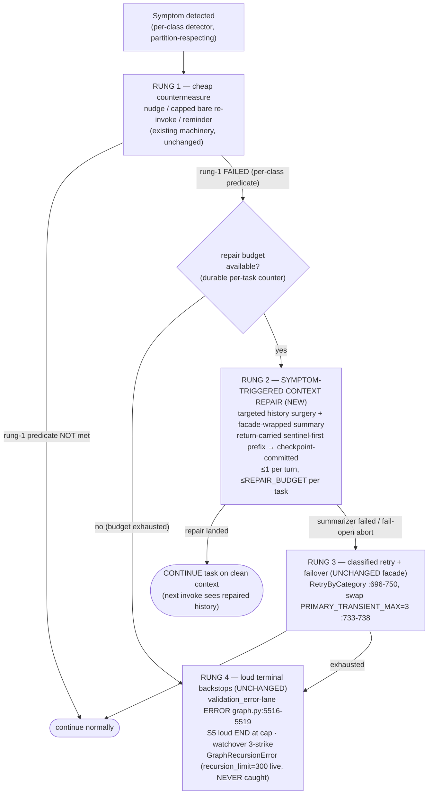

# Technical Analysis: Hallucination-Recovery Ladder (Symptom-Triggered Context Repair)

Date: 2026-09-13
Author: planner[v2] via technical-analysis worker
Analysis depth: deep-dive
Status: Draft — for architect enrichment (see decisions.md OPEN QUESTIONS)

**Observed git state (verified before writing):**
- Branch: `plan/hallucination-recovery-ladder`
- HEAD: `0acd3afae2d7f25e8c15d44f7802c4f23f5975b1` (short `0acd3afa`)
- Working tree: clean at analysis start.
- All anchors below were verified at this HEAD unless explicitly marked otherwise. Anchor drift is chronic in this repo (see §Anchors and Known Stale Claims); SYMBOL NAMES are pinned everywhere — re-verify line numbers at implementation time.

---

## Question

> When ANY hallucination-class symptom occurs (not just empty): escalate CHEAP-FIRST — (1) nudge/quick-fix; (2) if unresolved → symptom-triggered context repair ("trigger compaction": strip degenerate evidence from history + summarize what was attempted → CONTINUE the task); (3) the existing guard/retry/failover/terminal ladder remains the final backstop. The LOOP BREAKER already implements detect→history-surgery→continue for repeated identical toolcalls — GENERALIZE it, do NOT design a parallel duplicate.

Sub-questions DQ1–DQ5 (escalation state machine; repair mechanism; cost controls; state/telemetry/kill-switches; phasing) are answered in the sections below, each an anchored section as mandated.

---

## Context Summary

The daemon ships 22 catalogued hallucination-protection mechanisms (`docs/hallucination-protection.md` §1 table; note: that doc's inline anchors were pinned at `383fc24f` and have drifted — see §Anchors). The empty-response-guard program (merged `f8ada495`, restart-pending) closed the empty-content hole with a review-approved "Option 4 Layered Minimal" design: **S1** typed `EmptyLLMResponseError` raised inside the retry scope (`validate_llm_response` called at `daemon/llm_error_classifier.py:916`, inside `_run_with_classification` `:907`), **S5** derived trailing-degenerate re-invoke caps (`EMPTY_DEGENERATE_REINVOKE_CAP=3`, `daemon/graph.py:2620`; counter `_count_trailing_degenerate_ai_messages` `daemon/graph.py:2651-2666` — zero stored state), L1–L13 exemption table, and non-gating `[LLM-EMPTY]` streak telemetry (`daemon/graph.py:5552-5577`).

The remaining gap this ladder addresses: every shipped recovery lane either **re-invokes on the SAME degenerate context** (S1 transient retries re-send the poisoned history; truncated responses retry verbatim; ghost-promise bare re-invokes are explicitly uncapped, `daemon/graph.py:2538-2541`), or — in the one case where history surgery already exists (loop breaker) — the repair is **transient** (in-memory filter only; restart/revive replays the original degenerate history and the RAM repair budget resets). The ladder's thesis: a **symptom-triggered context repair rung** (strip degenerate evidence + summarize what was attempted → continue) slots between cheap countermeasures (nudge/re-invoke) and the existing retry/failover/terminal backstops — generalized from the loop breaker, not duplicated beside it.

Key verified facts this analysis builds on (ground truth, HEAD `0acd3afa`, spot-verified where marked ✔):

1. ✔ Loop-breaker repair is TRANSIENT: `RemoveMessage` sentinels are ID-carriers never fed to state (`daemon/graph.py:1291-1310`, `:1413-1420`, `:1519-1525`); restart/revive replays ORIGINAL degenerate history; RAM budget resets. `LoopRepairer.repair` is at `daemon/graph.py:1320` (class `LoopRepairer` body starts `:1291`).
2. ✔ Durable mid-turn rewrite precedent: compaction's return-carried sentinel recipe — `build_sentinel_replacement` (`daemon/compaction.py:427-507`, verified: sentinel `RemoveMessage(REMOVE_ALL_MESSAGES)` MUST be element 0 `:451-457`; tail keeps ORIGINAL ids `:448`; hoisted `context_kind` + unanswered notes `:444-450`). The ONLY durable mid-turn carrier is the node's own return (return-carried sentinel-first prefix); `aupdate_state`-only mid-flight persists are SUPERSEDED (canary `test_compact_executor_revive_brick_e2e.py:1746`).
3. ✔ `max_repairs=3` is RAM-only (`daemon/manager.py:754`, `:3898-3927`); exhaustion = WARN + continue with ORIGINAL messages (`daemon/graph.py:1857-1864`, verified) — an escalation hole. Counter auto-resets after a clean detection turn (`daemon/graph.py:1848-1855`, verified).
4. `recursion_limit` live=300 (`config.yaml:105`; constant default 100, `daemon/constants.py`); `GraphRecursionError` is NEVER caught — it is the terminal backstop of record.
5. ✔ Partition-by-shape is clean: S5's `_is_degenerate_ai_message` excludes `tool_calls` (`daemon/graph.py:2634-2635`, verified); S1 exempts first-empty-after-tool (`daemon/response_validation.py:371-372`/`:386-389`); `LoopDetector` breaks its walk on plain AIMessages (`daemon/graph.py:1110-1113`, verified); watchover-denied batches excluded (`:1066-1102`) — 3-strike termination is watchover's, this ladder must not steal it.
6. Repair summarizer timeout 120s (`daemon/config.py:1755`).
7. Zero compaction call sites in the loop-breaker path — the symptom-triggered repair rung is genuinely NEW machinery, not a reroute.
8. Language-check/watchover/attestation nudges are durable APPENDS (no rewrite); only compaction rewrites history durably today.
9. NO joint loop-breaker × empty-guard integration test exists (verified by absence; must be created by any implementation).
10. ⚠️ **Correction to the research buffer (the "important finding"):** the ground-truth buffer's symbol correction — "`wrap_langchain_failover` DOES NOT EXIST at this HEAD" — is **contradicted by direct observation at `0acd3afa`**: `def wrap_langchain_failover` EXISTS at `daemon/services/llm_failover.py:617` with live prod callers (`daemon/compaction.py:3383`, `:3395`; referenced in docstrings `compaction.py:67`, `:2875`). Both symbols exist and compose: `wrap_langchain_failover` (llm_failover.py:617, builds `ChatFailoverBinding` `:490`) → `invoke()` → `classify_llm_errors` (`llm_error_classifier.py:890`) → `_run_with_classification` (`:907`) → `validate_llm_response(result, input_messages=messages)` at `:916` (docs cite `:911` — stale). Design docs should keep BOTH names with distinct roles: `wrap_langchain_failover` = secondary-surface HA wrapper; `classify_llm_errors`/`_run_with_classification` = retry-scope validation entry on the agent path.

---

## Design Overview

**One engine, per-class presets, one durable budget, one telemetry surface.** Generalize `LoopRepairer` into a symptom-repair engine that, per hallucination class, (a) selects a surgical evidence window from history, (b) produces a "what was attempted" repair summary via a facade-wrapped summarizer, (c) emits a return-carried sentinel-first prefix (`[RemoveMessage(REMOVE_ALL_MESSAGES), *hoisted-injected, *repair-doc, *retained-tail-with-original-ids]` — the `build_sentinel_replacement` shape, `compaction.py:427-507`) so the repair is CHECKPOINT-COMMITTED, and (d) consumes a single durable per-task repair budget. Escalation is cheap-first per class: nudge/quick-fix → repair → (existing) retry/failover → loud terminal. Kill-switched default-ON with byte-identical OFF routing, mirroring the empty-guard convention (`adr-0001-dropped-empty-content-check.md` consequences block).

Non-goals (explicit): do not touch watchover 3-strike termination; do not duplicate the CLE reactive-compaction shape; do not modify S1 raise-in-retry-scope, S5 cap semantics, or L1–L13 exemptions; no FE work (noted: FE has no SSE error-event renderer — all LLM-failure classes render silent empty transcripts; pre-existing gap, relevant only if the ladder surfaces via SSE).

---

## Observed Runtime Landscape (where the rungs must live)

### Middleware order inside `agent_node` (ground truth, HEAD `0acd3afa`)

GII throttle `:5158-5171` → context-injection drain `:4724-4922` → report-injection build `:5032-5125` → **LOOP BREAKER** `:5186` → post-repair re-append `:5217-5230` → 95% precall compaction hook `:5277` → LLM invoke `:5298-5301` (S1 raise inside retry scope) → CLE handler `:5302-5398` → `[LLM-EMPTY]` streak telemetry `:5552-5577` → final return assembly `:5612-5638` (superseded-persist caution `:5618`). Post-node: `should_continue` `:2499-2609` → edges `:8029-8034`/`:8065-8074` → nudge node → end-candidate → language_check `:8010-8048` → attestation gate `:2947-2957` → END. Every re-entry (tools `:7913`, nudge `:7929`, watchover-deny, language reminder, attestation deny) re-runs the full in-agent middleware chain (same finding, `docs/hallucination-protection.md` §8.1).

### Symptom handler table (trigger → recovery today → caps → persistence → gap)

| # | Class (symbol) | Trigger / detection | Recovery today | Cap | Persistence | Gap |
|---|---|---|---|---|---|---|
| 1 | Repeated identical toolcalls — `LoopDetector` `graph.py:977`, signature `:1002-1022`, scan `:1024-1180` (threshold 3, `:1131`; `LOOP_BREAKER_DEFAULT_THRESHOLD=3` `config.py:75`) | ≥3 consecutive identical (name,args) | `LoopRepairer.repair` `graph.py:1320`: removal builder `:1477-1501` + in-memory filter `:1504-1556` + LLM summary + fresh-UUID SystemMessage + re-append | `max_repairs=3` RAM (`manager.py:754`) | **TRANSIENT** (in-memory filter only) | Not durable; budget resets; exhaustion = WARN+continue `:1857-1864`; summarizer bypasses facade (§DQ2-f) |
| 2 | Empty-as-entire-answer — S1 `validate_llm_response` (`response_validation.py:396`; raise `:466-475`, `EmptyLLMResponseError` `:26` ⊂ `LLMResponseValidationError`) | turn-window `:380-393`; nudge-nearest → raise (§8.1 nudge allowance) | nudge (`NUDGE_MESSAGE` stamped `graph.py:2727-2744`; router row-5 `:2603-2607`) → 2nd empty raises INSIDE retry scope (`llm_error_classifier.py:907/:916`) → transient retry → failover → loud ERROR (`graph.py:5516-5519`) | transient_max / `PRIMARY_TRANSIENT_MAX=3` (`llm_error_classifier.py:505,:733-738`) | none (derived) | Retries re-send SAME poisoned context — repair rung belongs here, but facade owns the loop (see DQ1) |
| 3 | Reasoning-only / think-tag-only — S5 helpers `_is_degenerate_ai_message` `graph.py:2623-2648` + `_count_trailing_degenerate_ai_messages` `:2651-2666` | router rows `:2566-2572`/`:2587-2594` | re-invoke under derived cap → loud END at cap | `EMPTY_DEGENERATE_REINVOKE_CAP=3` `:2620` | DERIVED (zero-state) | Covered; repair optional (see enrollment) |
| 4 | Ghost promise (`:`-ending) — detect `graph.py:2596-2601` | content ends with `":"` | BARE re-invoke (`return "agent"` `:2601`); per-occurrence WARN `:2600`, NO counter | **UNCAPPED** (`:2538-2541`) | none | GAP — cheapest new enrollment; evades S5 (`:2629-2630`) and S1 (`response_validation.py:408-411`); only backstop = recursion_limit=300 |
| 5 | Wrong language — `create_language_check_node` `graph.py:2783`/`:2799` | language mismatch | reminder `:2774-2777`, `LANGUAGE_CHECK_MAX_RETRIES=2` `:2780`, then FAIL-OPEN `:2833-2837` | 2 (checkpoint-persisted `graph.py:2456-2459` ✔) | checkpoint fields | Covered at rung-1; no repair needed |
| 6 | Truncated (`finish_reason=length`) — `response_validation.py:452-457`; `_is_truncated_response` `:478-495` (missing metadata fails OPEN) | validation | RETRY-ONLY, same context | transient budget | none | GAP — textbook repair case; truncated partial is actively harmful evidence |
| 7 | Malformed tool calls — `response_validation.py:459-464` | validation | retry lane only | transient budget | none | Minor gap; detector exists, repair optional |
| 8 | Bare-JSON provider body — `ThinkingChatOpenAI._create_chat_result` guard `graph.py:2044-2065` → `MalformedLLMResponseError` | type defect | TRANSIENT member (`llm_error_classifier.py:402-418`/`:466`) → retry/failover | transient budget | none | Covered (provider-failure framing); out of ladder scope |
| 9 | CLE — `graph.py:5302`; handler `:5345-5394` | context length exceeded | reactive compaction (surgery+CONTINUE) | compaction gates | durable via return-carried (BUT persist `:5396-5398` is the SUPERSEDED `aupdate_state` shape — pre-existing open defect, do NOT replicate) | Already a rung-2 shape; fix its persist defect separately |
| 10 | (candidate) Repeated identical FINAL answers, non-tool | **undetected**: `LoopDetector` breaks on plain AIMessages `:1110-1113`; `should_continue` ENDs on truthy content `:2609`; S5 counts only degenerate empties | none | recursion_limit only | — | Needs new detector; watchover-adjacent, design carefully |
| 11 | (candidate) Tool storms with drifting params | **undetected**: exact-signature chain breaks (`:1002-1022`) | none | recursion_limit only | — | Needs drift/no-progress signature (= empty-guard Phase-2 item 5) |
| 12 | (candidate) Schema/format violations | **undetected** (no generic validator) | malformed-tool-call retry lane only | — | — | Needs validator design |
| 13 | (candidate) Stuck-without-progress | **undetected** | none | recursion_limit only | — | Needs progress metric |

Existing analog outside the turn layer: `ReportRepairConfig` factor-5 ultra-short-final guard (`daemon/config.py:1759-1805`, LLM re-composition, report layer) — a rung-2 analog; not generalized here (different layer, report-excluded agents list), but cited as precedent that surgery+recompose is an accepted pattern in this codebase.

### Lanes (for cost accounting)

`TRANSIENT_EXCEPTIONS` `daemon/llm_error_classifier.py:433-476` (`LLMResponseValidationError` `:459` covers `EmptyLLMResponseError`; `MalformedLLMResponseError` `:466`); `RetryByCategory` `:696-750` (transient_max=N → N−1 retries); swap at `PRIMARY_TRANSIENT_MAX=3` (`:505`, `:733-738`); `FailoverController` `:526`. **Lane name-match debt:** `daemon/services/message_processing_errors.py:112-165` matches literal class NAMES; `EmptyLLMResponseError` explicitly listed `:139`; any NEW `LLMResponseValidationError` subclass MUST be added or silently misroutes to `execution_error` (`:165`).

---

## DQ1 — Escalation State Machine

### DQ1-a State granularity: per-turn derived + per-task durable budget

Three precedents coexist today: (i) S5 — derived-from-tail, zero state, implicitly restart-surviving (`graph.py:2651-2666`, verified); (ii) loop breaker — RAM counter with clean-turn auto-reset (`graph.py:1848-1855`, verified); (iii) language check — checkpoint-persisted GraphState fields (`graph.py:2456-2459`, verified: `language_check_retry`/`language_check_count` declared with an explicit "Persisted in checkpoints so retries survive across resumed graph executions" comment).

**Decision:** per-turn symptom counting stays DERIVED-from-history wherever the symptom leaves evidence in the message tail (S5 pattern — preferred, zero state); the loop-breaker-style RAM streak is acceptable only for classes whose evidence is REMOVED by the repair itself (post-repair the tail no longer shows the symptom — derivation self-clears, which is correct); the per-task **repair budget is DURABLE** (checkpoint-persisted GraphState field, language-check pattern), because the leader's ladder requirements make checkpoint-committed repair + durable budget mandatory and because RAM-only budgets are the confirmed defect (restart → reset → deterministic re-trip). Per-symptom-class WARN streaks ([LLM-EMPTY]-style) stay RAM/telemetry-only (DQ4).

This means: NOT purely per-turn, NOT purely per-symptom-streak — a two-axis scheme (per-turn derived detection + per-task durable repair budget). Rationale per axis in decisions.md ADR-0004.

### DQ1-b "Nudge failed" predicates per class

"Rung-1 failed" must be a mechanically checkable predicate, not a vibe:

| Class | Rung 1 | "Rung-1 failed" predicate |
|---|---|---|
| empty (S1) | nudge once per tool boundary + §8.1 once-per-window allowance (`response_validation.py:380-393`; `graph.py:2603-2607`) | The S1 raise itself (`EmptyLLMResponseError` at `llm_error_classifier.py:916`) — i.e. nudge-nearest in the turn window. This is already shipped semantics; the ladder adds NO new predicate. |
| degenerate (S5) | bare re-invoke | trailing degenerate count ≥ `EMPTY_DEGENERATE_REINVOKE_CAP=3` (`graph.py:2651-2666` + `:2620`) — derived, already shipped |
| ghost-promise | bare re-invoke (today) | NEW derived trailing ghost-promise count ≥ cap (proposed `GHOST_PROMISE_REINVOKE_CAP=3`, mirroring S5 helpers; detector `graph.py:2596-2601` exists) |
| truncated | facade transient retry | S1-lane truncation raise recurs after retries — same raise-recurrence predicate as S1 (`response_validation.py:452-457` raises `LLMResponseValidationError` in retry scope) |
| loop (toolcalls) | (none — detection threshold IS the gate) | `LoopDetector.detect` ≥3 consecutive identical signatures (`graph.py:1131`) |
| language | reminder ×2 | `language_check_count` ≥ `LANGUAGE_CHECK_MAX_RETRIES=2` → EXISTING fail-open `:2833-2837`; ladder does NOT interpose repair (enrolled: never) |

### DQ1-c Rung order and where repair slots (per class)

The conceptual ladder — cheap-first, repair between nudge-failure and backstop-exhaustion:



**Per-class mechanical placement.** The conceptual slot ("between nudge-failure and retry exhaustion") lands in different PHYSICAL places depending on where the class is detected, because the facade (`classify_llm_errors` → `_run_with_classification` → `validate_llm_response` `:907/:916`) owns the retry loop for raise-lane classes, while router-detected classes re-enter via `should_continue`:

| Class | Repair trigger point (mechanical) | Relationship to shipped guard ladder |
|---|---|---|
| loop (toolcalls) | Pre-LLM middleware slot, exactly where the loop breaker sits today (`graph.py:5186`), re-entry paths all pass through it | Repair IS the existing rung; ladder changes only durability/budget/summarizer (DQ2). Exhaustion converts WARN+continue → loud escalation (DQ3). |
| ghost-promise | Router: at derived cap, `should_continue` routes to a repair-flagged re-entry INSTEAD of bare `"agent"` (`:2601` today) | Inserted BETWEEN the bare re-invoke (rung 1) and recursion_limit (backstop). No facade contact. |
| degenerate (S5) | Router: at S5 cap, OPTIONALLY route to repair instead of loud END | Shipped S5 loud END is the approved terminal; repair-before-END is a phase-3 option (open question OQ4) — do NOT re-open approved semantics in phase 1-2. |
| empty (S1) | **Pre-terminal (phase-2 recommendation):** after the shipped ladder exhausts (raise → retries → failover) and BEFORE the loud ERROR is surfaced (`graph.py:5516-5519`), intercept ONCE, perform repair, re-enter; symptom-persist-after-repair → loud ERROR fires. A shallow facade hook (repair on 2nd raise, replacing retries 2-3) is DEFERRED (OQ1) — it saves ≤2 poisoned re-sends but touches the review-approved raise-in-retry-scope contract. | Does NOT regress S1 raise-in-retry-scope, S5 caps, or L1-L13: with kill-switch OFF, or with repair budget exhausted, the terminal path is byte-identical to shipped. The poisoned-context waste is bounded (≤ `PRIMARY_TRANSIENT_MAX−1` extra calls) and accepted in phase 2. |
| truncated | Same as S1 (raises in retry scope via `LLMResponseValidationError`) → pre-terminal placement | Same contract analysis as S1. |

**Why this reconciles without regression (the explicit Option-4 contract audit):**

1. **S1 raise-in-retry-scope** (`llm_error_classifier.py:907/:916`): untouched. Repair is a node/router-level state transformation on a LATER superstep (or pre-terminal), never inside the retry try-block. The raise, its classification as TRANSIENT (`:459`), and the retry→failover→ERROR chain run exactly as shipped.
2. **S5 derived caps** (`graph.py:2620`, `:2651-2666`): untouched in phase 1-2; optional repair-at-cap is phase-3 behind its own sub-flag, default OFF.
3. **L1–L13 exemptions**: repair detectors consume the same turn-window/spoke logic where applicable; the surgery itself PRESERVES L6 structurally (hoisted `context_kind` blocks + unanswered bare-flag notes are re-emitted in the sentinel prefix, mirroring `build_sentinel_replacement` `:444-450`); L8 (watchover) is out of scope by construction (repair never fires on watchover-denied batches, `graph.py:1066-1102` exclusion respected); L1 (done-speaking trailing empty) never triggers repair because S1's spoke-suppression means no raise → no rung-1 failure → no rung 2.
4. **Kill-switch OFF = byte-identical routing**: the ladder is strictly ADDITIVE code paths gated before any behavior: if `ENSEMBLE_SYMPTOM_REPAIR_LADDER=0`, every router branch keeps its shipped return value and the middleware slot is a no-op pass-through. `[LLM-EMPTY]` telemetry stays by design (adr-0001 W1 KEEP precedent).

---

## DQ2 — Repair Mechanism

### DQ2-a Unified engine, per-class surgical presets

**Decision: ONE generalized repair engine (evolve `LoopRepairer` → `SymptomRepairEngine`-shaped component at the same middleware slot), with a per-class PRESET TABLE.** Each preset declares: evidence-window selector (which messages are degenerate evidence), summary-prompt fragment (what was attempted, per class), retention set (what must survive verbatim), and post-repair routing (continue). Rationale: one persistence carrier (return-carried prefix), one budget counter, one telemetry surface, one summarizer facade wrap; per-class variation is confined to data, not control flow. A per-class parallel-mechanism design would duplicate the sentinel/persistence/budget/telemetry machinery N times — the exact parallel-duplicate the user vision forbids.

### DQ2-b Targeted surgery vs full `compact_state` vs hybrid

| Option | What | Verdict |
|---|---|---|
| Full `compact_state` (`compaction.py:2062-2066`) | Run the whole compaction engine force=True on symptom | **Rejected as default.** Gates refuse exactly the cases repair must handle: 60s dedup `:2098` blocks a second repair within a minute; min-messages `:2198-2208` blocks short histories; `force=True` bypasses ONLY threshold (`:2071-2080`, `:2222-2227`, verified in docstring). Cost is disproportionate (batched 20-group × concurrency-3 + serial merge, `:2800-2861`). It also discards surgical precision — non-degenerate evidence in the window would be summarized away. |
| Targeted history surgery (generalized `LoopRepairer`) | Strip the per-class evidence window; summarize; sentinel-prefix the remainder | **Adopted as default.** Reuses `build_sentinel_replacement` shape (`:427-507`) with a class-scoped retention set and a repair-doc (fresh UUID, id convention `repair-{instance_id}-{seq}`, distinct from `compaction-global-{instance}-{seq}` `graph.py:5320-5322`). Small histories → 1 summarizer LLM call (under chunk threshold `:2814-2829`). |
| Hybrid escape hatch | If degenerate evidence spans a large share of history (or total tokens > bulk threshold), delegate to `compact_state` force=True (accepting its gates) | **Phase-3 option only**, telemetry-gated (OQ6). Not needed for the enrolled classes: their evidence windows are small tails by construction. |

Divergence to document explicitly: repair does NOT inherit compaction's dedup/min-messages gates (deliberate — symptom repair must fire twice within 60s in pathological cases; bounded instead by the repair budget ≤1/turn, ≤3/task). This is a real behavioral divergence from `compaction.py:2098/:2198-2208` and must be called out in the spec and tests.

### DQ2-c Per-class repair matrix (class × mechanism × durability × why)

| Class | Rung-2 mechanism | Surgery scope | Durability | Why |
|---|---|---|---|---|
| Repeated identical toolcalls | Convert existing `LoopRepairer` surgery to return-carried sentinel (removal builder `graph.py:1477-1501` output feeds the prefix, not the in-memory filter `:1504-1556`) | Looping toolcall units (AIMessage+ToolMessages folded `:1105-1113`) + repair summary; retain rest verbatim ORIGINAL ids | **Durable (phase-1)** | The template. Transient repair is the confirmed defect (restart replays degenerate history, RAM budget resets); leader requires checkpoint-committed repair. |
| Ghost-promise | Strip trailing ghost-promise AIMessage(s) at derived cap + summary of attempted work | Tail window from last non-ghost boundary | Durable (same carrier) | Cheapest new enrollment; today uncapped (`:2538-2541`), only recursion_limit=300 bounds it. |
| Empty (S1), post-ladder | Strip the empty AIMessages in the turn window (zero-information payloads) + summary; keep tool results | Turn window only (post-nudge) | Durable (same carrier) | The ladder thesis applied to the shipped guard, without touching the facade. |
| Truncated | Drop the truncated partial AIMessage + summary; PRESERVE the partial text as an excerpt inside the repair doc (it may contain real user-facing content — silent loss is a data-loss risk, OQ3) | Single message + summary | Durable (same carrier) | Textbook case: retry-on-same-context re-sends the harmful partial; the repair both cleans and preserves. |
| Degenerate (S5) | Phase-3 option: drop degenerate tail (no summarizer call needed — nothing to summarize) or keep loud END | Tail window | Durable | Marginal value over shipped loud END; only if telemetry shows recovery-after-END would help. |
| Malformed tool calls | Drop malformed AIMessage + immediate re-invoke (no summary needed) | Single message | Durable | Detector exists (`response_validation.py:459-464`); cheap, low-priority. |
| Tool storms (drifting) / stuck-without-progress | NONE until detectors exist (drift/no-progress signature = empty-guard Phase-2 item 5) | — | — | Cannot repair what cannot be detected; recursion_limit bounds burn meanwhile. |
| CLE | NONE — already a rung-2 shape (`graph.py:5345-5394`) | — | — | Do not duplicate; fix its superseded persist shape (`:5396-5398`) as a separate defect. |

### DQ2-d Durability: the ONLY carrier is return-carried

Hard constraint (a): mid-turn durable persistence is RETURN-CARRIED ONLY — the node's own return emits `[RemoveMessage(REMOVE_ALL_MESSAGES), *post-channel…]` so the task commit lands atomically (canary `test_compact_executor_revive_brick_e2e.py:1746`; `TestMidSuperstepPersistCanary`; `build_sentinel_replacement` docstring `compaction.py:427-457`, verified). Constraint (b): leader requirements mandate CHECKPOINT-COMMITTED repair + DURABLE repair-budget counter — the analysis verdict is that BOTH land in **phase-1 for the loop-breaker class only** (the one class with existing surgery machinery — lowest-risk carrier), not phased later. Rationale: shipping a NEW repair rung transient-first would reproduce the exact restart-replay defect this program exists to close, on day one, for the new classes; the durable carrier is the risky part and it should be proven on the one class whose detection is battle-tested before new classes ride it. Constraint (c): the `/compact` executor (`compact_executor.py:520`) is pause-first out-of-frame and NOT reusable mid-turn — confirmed; the engine must NOT call it. Constraint (d): `LoopRepairer`'s summarizer BYPASSES the facade — verified at `graph.py:1642-1677`: `clean_llm_config` `:1642` → bare `ThinkingChatOpenAI` `:1643` → `llm.invoke` in `asyncio.to_thread` `:1649-1651` → `wait_for` `:1662` → STATIC fallback string `:1632-1636` on timeout or ANY exception (`:1666-1677`). Empty/degenerate repair summaries neither retry nor fail over — they silently degrade (a degenerate summary is itself a hallucination-adjacent artifact injected into history). Compaction's summarizer IS facade-wrapped (`compaction.py:3383`/`:3395` via `wrap_langchain_failover`, `llm_failover.py:617`) — the repair engine must match that (ADR-0006). Note this folds empty-guard Phase-2 deferred item "raw-SDK mirrors: LoopRepairer" INTO this program (DQ5).

### DQ2-e Repair-doc content contract

The repair summary/doc is itself injected context and must obey house rules: construction-time stable `id=` (message-id invariant — `serialize_message` fallback is read-side only and cannot heal checkpointed messages), `context_kind`-style stamping so three-bucket partitioning treats it as non-selectable hoisted context (mirroring compaction-doc handling, `graph.py:5320-5322`), and content pinned to VERBATIM excerpts (tool names/args) rather than free-form narrative — the summarizer is an LLM and the doc must not become a new hallucination vector (risk R4).

---

## DQ3 — Cost Controls

### DQ3-a Budgets

| Control | Value | Home | Notes |
|---|---|---|---|
| Repair-per-turn latch | ≤1 | RAM (superstep-scoped) | Prevents multi-repair oscillation within one turn; reset at turn boundary. |
| Repair budget per task | `REPAIR_BUDGET=3` (proposed; mirrors `max_repairs=3` `manager.py:754` semantics) | **DURABLE** GraphState field (language-check pattern `graph.py:2456-2459`) | Survives restart/revive; NOT auto-reset by clean turns initially (OQ5: loop breaker auto-resets after a clean detection turn `graph.py:1848-1855` — durable-budget reset policy needs an architect ruling). |
| Loop-breaker `max_repairs` | 3 | RAM (existing) | Becomes the per-TURN expression of the same budget; durable counter is authoritative across restarts. |
| `EMPTY_DEGENERATE_REINVOKE_CAP` | 3 (`graph.py:2620`; yaml `limits.empty_degenerate_reinvoke_cap`, restart-required) | derived | Unchanged; repair-at-cap is phase-3 optional (OQ4). |
| `PRIMARY_TRANSIENT_MAX` | 3 (`llm_error_classifier.py:505,:733-738`) | facade | Unchanged. In phase-2 pre-terminal placement, ≤2 extra poisoned-context retries are accepted as the price of not touching the facade (OQ1 quantifies the alternative). |
| `GRAPH_RECURSION_LIMIT` | 300 live (`config.yaml:105`; constant default 100) | graph | Terminal backstop of record; `GraphRecursionError` NEVER caught — stays that way. Repair budget (≤3 summarizer calls + ≤3 continued runs) consumes far fewer calls than 300; the hard ceiling remains the last-resort invariant. |
| Summarizer timeout | 120s (`config.py:1755`) | config | Kept; wall-clock-capped via facade (`wall_clock_cap_s` param, `llm_failover.py:620-624`). |

### DQ3-b Closing the exhaustion hole (mandatory)

Today: `repair_count >= max_repairs` → WARN + **continue with ORIGINAL messages** (`graph.py:1857-1864`, verified). Continuing with the original (degenerate) history deterministically re-trips the detector — the model never sees the WARN (it is log-only), so this is pure burn. **Decision:** exhaustion escalates — route to the loud terminal backstop for that class (loop class: loud END with `[SYMPTOM] … phase=terminal reason=repair-budget-exhausted` telemetry), not silent continuation. With the ladder kill-switch OFF, the shipped WARN+continue is preserved byte-identically (the hole closes only under the flag). ADR-0005.

### DQ3-c What happens when the repair summarizer itself returns empty/degenerate

Facade-covered path (post-ADR-0006): `EmptyLLMResponseError` raises inside the summarizer's retry scope (`llm_error_classifier.py:916` semantics) → bounded retry → failover swap → if still failing, the wrap raises → the repair engine's except-path treats repair as ABORTED with `abort_policy=fail_open`: repair skipped, budget NOT consumed (no surgery happened), fall through to the next rung (retry/failover/terminal), loud `[SYMPTOM] … phase=repair action=abort reason=summarizer-failed` telemetry. NEVER wedge the turn; NEVER silently inject the static fallback summary as today (`graph.py:1632-1636`). The static truncation fallback is retained ONLY as last-resort-with-telemetry, or removed — architect's call (OQ-embedded in ADR-0006). If a persist seam call refuses (`persist_compaction_result` returns False on fail_open refusal, `_compaction_persist_seam.py:84-90`) the return value MUST be checked and treated as abort — same discipline as the compaction seam contract.

### DQ3-d Compaction cost profile (why repair must NOT just call compact_state)

1 LLM call under chunk threshold (`compaction.py:2814-2829`); else batches of 20 (`:2846-2861`) parallel-bounded `chunk_concurrency=3` (`config.py:925-933`) + SERIAL merge (`:2800-2805`) under `operation_budget_s`. Gates in order: 60s dedup `:2098` → three-bucket `:2112-2114` → all-injected skip `:2169-2191` → min-messages `:2198-2208` → threshold `:2233-2240`; `force=True` bypasses ONLY threshold (`:2222-2227`). Skip paths return stamped EMPTY replacements (anti-refire) `:2139-2160`. Targeted repair with a small evidence window = 1 summarizer call, well under this envelope; this asymmetry is the core DQ2-b verdict.

### DQ3-e Worst-case LLM-call burn per incident (bounded ladder)

| Scenario | Call accounting (phase-2 shape) |
|---|---|
| Continuous-empty provider, S1 class | nudge (1) + 2nd-empty raise → retries ≤ transient_max−1 (2) + failover attempts (provider-config'd) + pre-terminal repair (1 summarizer + its own bounded retries) + post-repair invoke (1) → terminal ERROR. Bounded by facade budgets + repair budget ≤3 + recursion_limit=300. |
| Ghost-promise storm | cap (3 bare re-invokes) + repair (1) + continued run → normal or terminal. Was: unbounded (`:2538-2541`) to 300. |
| Loop storm | detections until budget 3 + repair summaries ≤3 → escalation at exhaustion. Was: infinite WARN+continue cycles within one graph run; still bounded by recursion_limit. |
| Summarizer continuous-empty | summarizer's own facade retries (≤ transient budget) → fail-open abort → next rung. The repair rung cannot itself become an empty-loop. |

---

## DQ4 — State, Telemetry, Kill-Switches

### DQ4-a State home summary

| State | Home | Precedent |
|---|---|---|
| Per-turn symptom counts (degenerate, ghost, empty-in-window) | DERIVED from message tail (zero stored) | S5 `graph.py:2651-2666` |
| Repair-per-turn latch | RAM, superstep-scoped | loop-breaker slot RAM pattern |
| Repair budget per task | DURABLE GraphState field | language-check `graph.py:2456-2459` (explicit "persisted so retries survive" comment) |
| Per-class WARN streaks (observability) | RAM manager-side, non-gating | `[LLM-EMPTY]` streak `graph.py:5552-5577`; manager streak demoted-to-WARN was an explicit Option-4 decision (architecture-recommendation §5 Option 4 row 1) |
| Repair provenance | The repair doc ITSELF in checkpointed history (its presence in the tail self-clears derived detectors and survives restart — the durable evidence that repair happened) | compaction-doc id pattern `graph.py:5320-5322` |

Unified with `[LLM-EMPTY]` streak telemetry: the streak lines continue during transition; new classes emit the same shape. Empty-guard Phase-2 item "(4) manager streak → persistent observability metric (RAM-vs-instance-row decision)" is folded INTO this program's phase-2 (one decision for all symptom streaks, not two).

### DQ4-b Unified symptom-event telemetry surface (operator grep line)

```
[SYMPTOM] class=<loop|empty|degenerate|ghost|truncated|schema|stuck> phase=<detect|rung1|repair|repair_abort|retry|failover|terminal> action=<fired|skipped|abort|escalate> budget=<used>/<cap> instance=<short> turn=<task_id> detail=<one-liner>
```

- Existing lines remain during transition: `[LOOP BREAKER]` (`graph.py:1842-1868`), `[LLM-EMPTY]` (`:5552-5577`), `[LLM-HA]` (`:877`); the `[SYMPTOM]` line is emitted alongside (not instead) until soak, then consolidation is a phase-3 cleanup.
- Kill-switch OFF keeps telemetry (adr-0001 precedent: telemetry exemption is intentional — W1 leader decision KEEP; OFF-mode storms must stay visible during an OFF soak).
- Ghost-promise today has a per-occurrence WARN `:2600` with NO counter — the new derived counter upgrades this to counted telemetry for free.

### DQ4-c Kill-switch convention

- Master: `ENSEMBLE_SYMPTOM_REPAIR_LADDER` — default ON, restart-pending; **OFF = byte-identical routing** (every new branch gated before behavior; golden-routing pins in tests) **+ telemetry stays**.
- Per-class sub-flags (enrollment granularity, each defaulting per its phase): `ENSEMBLE_REPAIR_LOOP_DURABLE` (phase-1), `ENSEMBLE_REPAIR_GHOST_PROMISE` (phase-2), `ENSEMBLE_REPAIR_EMPTY_POST_LADDER` (phase-2), `ENSEMBLE_REPAIR_TRUNCATED` (phase-2/3), phase-3 candidates default OFF until soaked.
- Resolver convention: explicit `_resolve_*` in `load_config` (mirroring `_resolve_proactive_enabled` `config.py:2409-` and `_resolve_compaction_model`); invalid values → `ValueError` at boot; empty-string safe. pydantic-settings init-kwarg > env inversion trap applies to any new `CompactionConfig`-style booleans (blueprint warning).

---

## DQ5-PRE — Phasing Implications

### Recommended minimal-safe phase-1 cut

**Scope: loop-breaker class ONLY — durability conversion, no behavior change to detection or thresholds.**
1. Convert `LoopRepairer` surgery output from in-memory filter (`graph.py:1504-1556`) to the return-carried sentinel-first prefix at the node-return assembly (`:5612-5638` region; superseded-persist caution `:5618`) — checkpoint-committed repair.
2. Add durable per-task repair budget (GraphState field) consumed by the loop rung; keep RAM `max_repairs` as the per-turn expression.
3. Route the repair summarizer through the facade (`wrap_langchain_failover`, `llm_failover.py:617`) with fail-open abort — folds empty-guard Phase-2 item (3) "raw-SDK mirrors: LoopRepairer" into this phase.
4. Exhaustion → loud escalation (close the `:1857-1864` hole), under the flag.
5. **Create the missing joint loop-breaker × empty-guard integration test** (same commit discipline as the feature; see Test-Critical Invariants #1).

Why durable-first (not transient-first): the carrier is the risky part; prove it on the battle-tested detection before any new class rides it; a transient new rung would ship the restart-replay defect by construction. Why no new classes in phase-1: every new class adds detector-FP risk ON TOP of carrier risk; sequence them.

### Phase 2

- Ghost-promise: derived counter + cap + repair-at-cap (router-level placement — mechanically clean, no facade contact).
- Empty (S1) post-ladder repair: pre-terminal, once, budget-gated (ADR-0003; OQ1 rules on the facade-hook alternative).
- Truncated: pre-terminal like S1, with partial-text preservation in the repair doc (OQ3).
- Telemetry unification decision (manager streak → persistent metric, folded empty-guard item (4)).

### Phase 3

- Tool storms with drifting params + stuck-without-progress — BOTH gated on the no-progress/drift signature (empty-guard Phase-2 item (5) "LoopDetector no-progress signature" is the same work item — same program).
- Schema/format violations (needs generic validator design).
- Degenerate-tail surgery at S5 cap (only if soak shows value; OQ4).
- Bulk delegation to `compact_state` (hybrid escape hatch; OQ6).

### Reconciliation with empty-response-guard Phase-2 deferred list (verbatim items)

| Deferred item (architecture-recommendation.md §9) | Same program or separate | Disposition |
|---|---|---|
| (1) exhaustion-signal promotion `validation_error` → `max_retries_exceeded` in `CRITICAL_ERROR_TYPES` | **Separate workstream, same umbrella**, sequence AFTER ladder phase-2 | The pre-terminal repair rung changes when `validation_error` terminals occur (fewer, later); promoting severity first would need re-measurement after the ladder lands. |
| (2) provider-health circuit (Option-3 core), only-if-telemetry-shows-storms | **Separate**, telemetry-gated | The ladder's `[SYMPTOM]` surface is exactly the evidence collector the circuit decision awaits. |
| (3) raw-SDK mirrors: skill-embedding ×2; LoopRepairer; WatchoverEvaluator stays fail-closed | **LoopRepairer = SAME program (phase-1, ADR-0006).** skill-embedding = separate (different subsystem, own fallback). WatchoverEvaluator = out of scope for both (fail-closed by design). | Fold-in. |
| (4) manager streak → persistent observability metric | **Same program (phase-2, DQ4-a)** | One RAM-vs-instance-row decision for all symptom streaks. |
| (5) LoopDetector no-progress signature (+ meta.json scan, load-balancer empty-signal, compaction partial-summary hierarchy) | **Same program for the no-progress signature (phase-3 prerequisite).** meta.json scan / load-balancer / partial-summary = separate cleanups. | Fold-in for item 5 proper. |

Verdict: ONE umbrella program ("hallucination-recovery") with shared engine/telemetry/budget; three deferred items are literally the same work as ladder phases 1/2/3 and must not be duplicated.

---

## Enrollment Recommendations

| Candidate class | Enroll? | Phase | Rationale (anchored) |
|---|---|---|---|
| Repeated identical FINAL answers (non-tool) | **Later (phase-3)** — detector design first | 3 | Structurally invisible today: `LoopDetector` breaks on plain AIMessages (`graph.py:1110-1113`, verified); `should_continue` ENDs on truthy content (`:2609`); S5 counts only degenerate empties. Needs a non-tool signature; FP risk high (legitimate repeated answers exist: confirmations, status echoes). Adjacent to watchover's 3-strike termination mandate — partition discipline required (must not steal watchover's role, ground truth #5). |
| Tool storms with drifting params | **Later (phase-3)** | 3 | Exact-signature chain breaks on any param drift (`graph.py:1002-1022`); only recursion_limit=300 bounds the burn. Requires the drift/no-progress signature (empty-guard item 5). Repair value uncertain until detector FP profile is known. |
| Schema/format violations | **Later (phase-3)** | 3 | No generic validator exists; malformed-tool-call lane (`response_validation.py:459-464`) already retries. A generic validator is a NEW detection surface with its own L1-L13-style exemption analysis; enroll only with detector+presets designed. |
| Stuck-without-progress | **Later (phase-3)** | 3 | No detector; same prerequisite signature as tool storms. Highest design risk (what is "progress"?) — needs its own mini-analysis before enrollment. |
| Ghost-promise (already-detected, uncapped) | **NOW (phase-2)** | 2 | Cheapest real gap: detection exists (`graph.py:2596-2601`), cap machinery pattern exists (S5 helpers), placement is router-level (no facade contact). Converts an UNBOUNDED burn (`:2538-2541`) into cap→repair→backstop. |
| Truncated | **NOW (phase-2)** | 2 | Detector exists and raises in retry scope (`response_validation.py:452-457`, `:478-495`); retry-on-same-context is provably wasteful for a deterministic truncation pattern; repair both cleans and preserves the partial. Pre-terminal placement reuses the S1 mechanism. |
| Loop (toolcalls) durability | **NOW (phase-1)** | 1 | The generalization target itself. |
| Never | wrong-language (covered, fail-open `:2833-2837`); CLE (already rung-2, `:5345-5394` — separate persist-defect fix); bare-JSON body (provider-failure framing, transient lane); watchover-denied classes (3-strike is watchover's); GII throttle storms (own escalating backoff, mechanism #10) | — | Partition respect + no duplication. |

---

## Partition-Invariant Compliance List

Any implementation MUST hold all of:

1. **P-1 S5 shape partition:** `_is_degenerate_ai_message` excludes `tool_calls` (`graph.py:2634-2635`, verified) — repair detectors must never count tool-call-bearing messages into non-tool classes, and vice versa.
2. **P-2 S1 tool-result exemption:** first-empty-after-tool passes (`response_validation.py:371-372`/`:386-389`) — the repair rung consumes only POST-rung-1-failure signals; it must not fire on the nudge's designed input.
3. **P-3 LoopDetector walk purity:** plain-AI break at `graph.py:1110-1113` (verified) — new detectors are SEPARATE walks; do not weaken the tool-call chain walk.
4. **P-4 Watchover exclusivity:** watchover-denied batches excluded (`:1066-1102`); 3-strike termination remains watchover's (`:7888-7896` per §8.1 diagram, drifted anchor — pin symbol `watchover_terminate_node`) — repair never fires on denied batches and never terminates for watchover-adjacent classes.
5. **P-5 L6 injection preservation:** surgery re-emits hoisted `context_kind` blocks + unanswered bare-flag notes in the sentinel prefix (`build_sentinel_replacement` `:444-450` shape); nudge/context HumanMessages stay invisible to boundary detection.
6. **P-6 Sentinel element-0:** `RemoveMessage(REMOVE_ALL_MESSAGES)` MUST be element 0 (`compaction.py:451-457`, verified) — anything before it is discarded by the reducer.
7. **P-7 Original-id tail:** retained messages keep ORIGINAL ids (upsert-in-place semantics, `:448`, `compaction.py` docstring `:438-443`); the repair doc gets a fresh construction-time `id=` (message-id invariant).
8. **P-8 Unit folding:** stripped toolcall AIMessages take their ToolMessages with them (evidence/loop units folded via `tool_call_id` matching, `graph.py:1105-1113` region) — never orphan a ToolMessage.
9. **P-9 No counter theft:** repair consumes ONLY its own budget; S1 turn-window, S5 derived counts, transient/failover counters, language counters are untouched by repair execution.
10. **P-10 No mid-flight `aupdate_state`:** the ONLY durable carrier is the node return prefix (canary `test_compact_executor_revive_brick_e2e.py:1746`); CLE's superseded shape (`graph.py:5396-5398`) must NOT be replicated; `checkpoint_ns` empty-snapshot trap (`graph.py:4382`/`:5312`/`:5345` — L2/CLE `aget_state` reads with node-stamped config) must be avoided — thread-id-only reads (`_compaction_persist_seam.py:139`).
11. **P-11 Kill-switch byte-identity:** OFF → shipped routing byte-identical (both S1 raise and S5 caps untouched); telemetry stays.
12. **P-12 Lane name-match:** any NEW `LLMResponseValidationError` subclass must be added to `daemon/services/message_processing_errors.py:112-165` or it silently misroutes to `execution_error` (`:165`).

---

## Test-Critical Invariants

1. **T-1 (MISSING today — mandatory):** Joint loop-breaker × empty-guard integration test: loop-prone tool storm DURING a continuous-empty provider episode → bounded repairs, bounded S5/S1 behavior, no interference (repair does not reset S5 derivation; S5 cap does not consume repair budget), loud terminal with correct `class=` attribution. Verified absent (ground truth #9).
2. **T-2 Durability:** restart/revive after repair → NO re-trip (degenerate window gone from checkpoint; derived detectors self-clear); repair budget persists across restart (anti-test for the TRANSIENT defect, ground truth #1); budget NOT reset by an intervening clean turn unless OQ5 rules so.
3. **T-3 Return-carried correctness:** sentinel element-0 (P-6); repaired history upserts with original ids; NO `aupdate_state`-only mid-turn persist anywhere in the new path (P-10); canary-mirrors of `TestMidSuperstepPersistCanary` for the repair carrier.
4. **T-4 Tool-pairing:** post-surgery, every retained ToolMessage still pairs with its issuing AIMessage (P-8); repair doc idempotent under re-compaction (convergent seed shape, `compaction.py:466-472`).
5. **T-5 Summarizer degeneracy:** empty/degenerate summarizer output → facade retry → failover → fail-open abort → next rung; NEVER the silent static fallback of today (`graph.py:1632-1636`); `[SYMPTOM] … repair_abort` line asserted.
6. **T-6 Exhaustion escalation:** budget exhausted → loud terminal (anti-test for WARN+continue `graph.py:1857-1864`), and OFF-flag → shipped WARN+continue preserved.
7. **T-7 Partition pins:** per-class detector truth tables including the cross-partition negatives (tool-call message never counted by ghost/degenerate detectors; watchover-denied batch never triggers repair).
8. **T-8 Kill-switch golden routing:** OFF → byte-identical (the empty-guard test pattern: pin shipped behavior BEFORE flipping anything; grep-pin the single-caller invariants where they exist, e.g. `_is_empty_content` one-prod-caller pin precedent).
9. **T-9 Burn-count assertions:** ghost storm ≤ cap+repair+1 LLM calls (vs ~300 today); empty pre-terminal ladder total ≤ shipped-total + repair(1); loop storm ≤ budget(3)+detections.
10. **T-10 Placement pins:** S1 raise still inside retry scope (`llm_error_classifier.py:907/:916` untouched — source-level pin, since AsyncMock+getsource substring assertions are the established seam style per the facade-forwarding discipline); S5 cap semantics unchanged.
11. **T-11 Repair-doc invariants:** construction-time id present; non-selectable/hoisted partition treatment; verbatim-excerpt pinning (no free-form narrative acceptance).
12. **T-12 Persist-refusal handling:** `persist_compaction_result`-style False return (fail_open refusal, `_compaction_persist_seam.py:84-90`) → treated as abort, budget not consumed, loud telemetry.
13. **T-13 Test runner discipline:** all via `uv run python -m pytest` from worktree root (repo convention).

---

## Trade-offs (summary; full ADR form in decisions.md)

| Decision axis | Chosen | Main alternative | Deciding factor |
|---|---|---|---|
| Unified vs per-class repair | Unified engine + per-class presets | Per-class parallel mechanisms | No duplicate sentinel/persistence/budget machinery; user mandate "generalize, do NOT duplicate" |
| Durable vs transient (phase-1) | Durable for loop class first | Transient-first for everything | Leader requirement; transient-first ships the restart-replay defect by construction |
| Repair placement vs shipped guard | Router-level at-cap (ghost/S5-class); pre-terminal once (S1/truncated) | Inside facade retry loop | Preserves review-approved Option-4 contracts; poisoned-retry waste ≤2 calls accepted (OQ1) |
| Targeted surgery vs full compact | Targeted; bulk-delegation phase-3 | compact_state force=True | Gates refuse exactly the needed cases (`:2098`/`:2198-2208`); cost asymmetry (DQ3-d) |
| Escalation-state home | Derived-per-turn + ONE durable per-task budget | All-RAM / all-durable | Restart-survival where it matters (budget), zero-state where history self-documents (counts) |

## Scalability note

Cost is per-incident and bounded (DQ3-e); durable state adds ONE integer per task (budget) + one doc message per repair — negligible checkpoint growth. The scaling cliff is detector coverage, not throughput: each new class adds FP surface that must be soaked; the phase ordering is the scalability strategy.

## Technical Debt Affecting This Analysis

| # | Debt | Impact | Severity |
|---|---|---|---|
| 1 | Loop-repair TRANSIENT + RAM budget (ground truth #1/#3) | The defect this program closes; phase-1 target | High |
| 2 | `LoopRepairer` facade bypass (`graph.py:1642-1677`, verified) | Degenerate summaries silently degrade; folded into phase-1 (ADR-0006) | High |
| 3 | Lane name-match list `message_processing_errors.py:112-165` | Any new subclass must be registered (P-12) | Medium |
| 4 | CLE superseded persist shape (`graph.py:5396-5398`) + checkpoint_ns empty-snapshot trap (`:4382`/`:5312`/`:5345`) | Must NOT be replicated (P-10); CLE fix is separate | Medium (out of scope) |
| 5 | FE: no SSE error-event renderer (silent empty transcript for ALL failure classes) | If ladder terminals surface via SSE they are invisible in FE; pre-existing, flagged in critical notes; out of scope here | Medium (adjacent) |
| 6 | Chronic anchor drift (docs pinned at `383fc24f`; `validate_llm_response` call `:911`→`:916` observed) | Pin symbols, re-verify lines at implementation | Low (process) |
| 7 | Ghost-promise uncapped (`:2538-2541`) + no counter (`:2600`) | The phase-2 gap | High (in scope) |
| 8 | 'unknown_compaction_type' claim | STALE at this HEAD (not found — ground truth caveat) — recorded here so nobody chases it | Low (stale claim) |

## Risks

- **R1 — Hottest-path surgery:** converting the loop repair to return-carried touches the `agent_node` return assembly (`:5612-5638`, caution `:5618`) shared with L2 compaction durability; regression blast radius includes proactive compaction. Mitigation: canary mirrors (T-3), golden-routing pins (T-8), phase-1 confined to loop class.
- **R2 — checkpoint_ns trap:** any `aget_state` in the repair path with node-stamped config reads an EMPTY snapshot (`:4382`/`:5312`/`:5345`). Mitigation: thread-id-only reads (`_compaction_persist_seam.py:139`).
- **R3 — Repair-storm interplay:** repair docs and compaction docs interleaving; convergent re-detection. Mitigation: distinct id namespaces (`repair-` vs `compaction-global-`), derived detectors self-clear on repaired tails (T-2), budget cap.
- **R4 — Summarizer-as-hallucination-vector:** the repair doc is LLM-written context injected into history. Mitigation: verbatim-excerpt pinning (DQ2-e), facade coverage (R-fallback loud, not silent), T-11.
- **R5 — Truncated-class data loss:** dropping the partial AIMessage can lose real user-facing content. Mitigation: preserve partial text inside the repair doc (OQ3 ruling required).
- **R6 — Ghost-promise FP:** legitimate colon-ending content (code blocks, lists) could be capped/stripped. Mitigation: conservative detector (shipped `:2596-2601` shape), cap-before-surgery ordering, FP soak before default-ON enrollment (OQ2).
- **R7 — Contract regression pressure:** the S1 facade-hook alternative (repair before retries) is tempting post-incident; it re-opens the review-approved raise-in-retry-scope contract. Mitigation: ADR-0003 defers it behind OQ1 with explicit preconditions.

## Open Questions

Consolidated in `decisions.md` §OPEN QUESTIONS (OQ1 placement/facade-hook; OQ2 ghost FP profile; OQ3 truncated partial preservation; OQ4 S5-at-cap repair vs loud END; OQ5 durable-budget reset policy; OQ6 bulk-delegation threshold; OQ7 telemetry line + FE SSE renderer gap).

## References

- `docs/hallucination-protection.md` — 22-mechanism inventory; §6.3 decision matrix (`:456-467`); §7 seams (`:560-578`, incl. corrected secondary-surface coverage); §8.1 middleware pipeline; **anchors pinned at `383fc24f`, drifted vs `0acd3afa`** (LoopDetector `:966`→`:977`; L2 `:4014`→`:4173`; CLE `:5133`→`:5302`; §8.2 self-flags this class of drift).
- `.agents/shared/planning/empty-response-guard/architecture-recommendation.md` — Option 4 (§5, `:105-115`); L1–L13 (§6, `:117-135`); §8.1 nudge-allowance synthesis (`:157-163`); Phase-2 deferred (§9, `:176-181`); test strategy (§10).
- `.agents/shared/planning/empty-response-guard/adr-0001-dropped-empty-content-check.md` — three latent defects (hypothesis); kill-switch OFF = byte-identical ROUTING, telemetry stays (W1 KEEP).
- Ground truth (verification wanderer, HEAD `0acd3afa`) + Research Buffers A/B (explorer, HIGH confidence) — symptom table, lane facts, compaction engine facts; the one buffer correction recorded in Context Summary item 10.
- Direct verifications this session (✔ items): `graph.py:1105-1118`, `:1845-1868`, `:1638-1680`, `:2618-2670`, `:2452-2462`; `compaction.py:427-460`; `llm_error_classifier.py:885-920`; `llm_failover.py:615-625`; `grep` confirmations of `wrap_langchain_failover` (`llm_failover.py:617`; callers `compaction.py:3383/:3395`).
