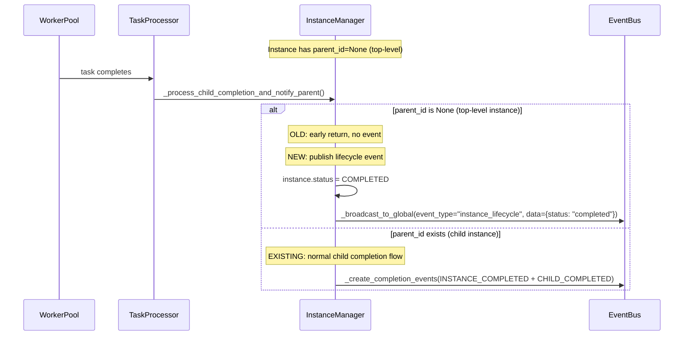
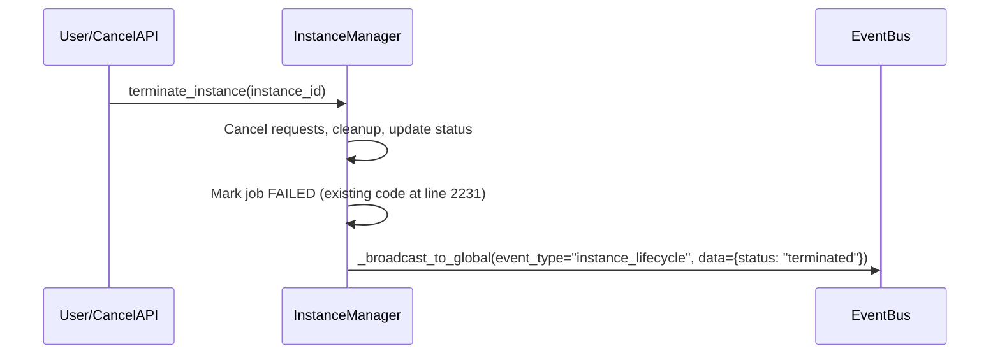
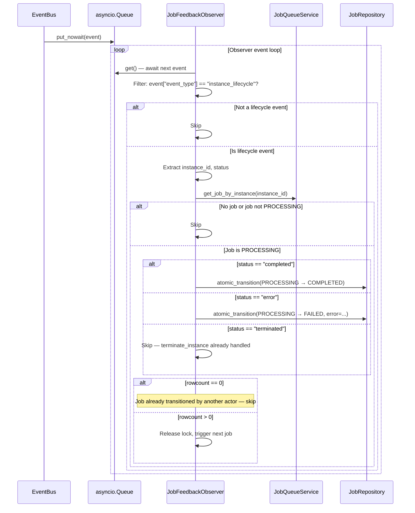
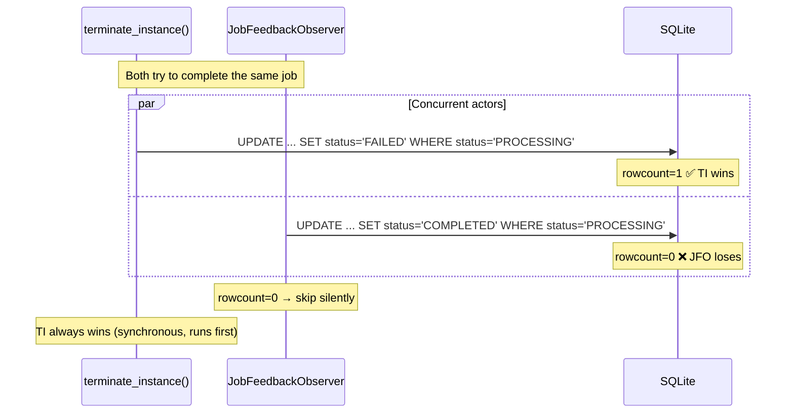
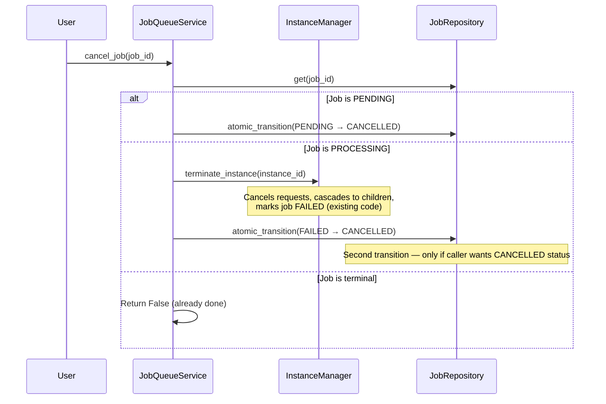

# Phase 2: Integration — Task↔Job Feedback Loop

## Objective

**Implement the primary job completion mechanism.** Currently, there is NO path for successful job completion — `_complete_job_for_instance()` is dead code (never called), and `terminate_instance()` always marks jobs as FAILED. This phase:

1. **Adds instance lifecycle event publishing** for top-level instances (C1, C2-NEW)
2. **Implements `JobFeedbackObserver`** that receives these events and completes jobs (C3, C3-NEW)
3. **Adds simplified startup recovery** for orphaned PROCESSING jobs
4. **Implements cancellation cascade** using existing `terminate_instance()` (C2)

**Key insight:** The tasks system (`TimeoutMonitor`, `StaleTaskRecovery`) already handles execution-level timeout, crash recovery, and retry. The job system observes these results rather than duplicating them.

## Coupling

- **Depends on**: Phase 1 (State Machine, Persistent Locks, `atomic_transition()`)
- **Coupling type**: tight
- **Shared files with other phases**: `job_state_machine.py`, `job_queue_service.py`, `manager.py`
- **Why this coupling**: The observer calls `complete_job()` / `fail_job()` which use `atomic_transition()` from Phase 1. Startup recovery uses persistent locks from Phase 1. New event publishing code in `manager.py` works with Phase 1's state machine.

## Context: Verified Codebase Gaps

### Gap 1: No Event for Top-Level Instances (C1)

At `daemon/manager.py:1730`, `_process_child_completion_and_notify_parent()` returns early for instances without `parent_id`:

```python
if instance.parent_id is None:
    logger.debug(f"Instance {instance_id[:8]}... has no parent, skipping completion check")
    return  # ← Job instances hit this and NO event is published
```

`INSTANCE_COMPLETED` is only published for **child instances** (those spawned by other agents). Job instances are top-level — they have `parent_id=None`.

### Gap 2: No Error/Termination Events (C2-NEW)

`terminate_instance()` at `daemon/manager.py:2210-2250` does NOT publish any EventBus event. The observer would miss:
- Instance termination (user cancel, error, forced shutdown)
- Instance errors during processing

**Missing EventKind value:** `INSTANCE_LIFECYCLE` (single event kind with `status` field for `completed`, `terminated`, `error`) does not exist. See ADR-010 for design rationale.

### Gap 3: Dead Completion Code (C3)

`_complete_job_for_instance()` at `daemon/manager.py:575-610` is **never called** from anywhere. The only job completion in production is `terminate_instance()` at `daemon/manager.py:2240` which always calls `complete_job_sync(success=False)`. **There is no successful completion path.**

### Gap 4: No `cancel_instance()` Method (C2)

Phase 2's cancellation cascade needs `cancel_instance()`, but only `cancel_instance_requests()` exists (cancels active LLM requests, doesn't stop tasks). The proper approach is to use existing `terminate_instance()`.

### Gap 5: Wrong EventBus Event Field (C3-NEW)

EventBus events use `event_type` field (not `kind`):

```python
event = {"instance_id": str, "event_type": str, "event_id": str|None, "data": dict|None}
```

## Tasks

### Task 1: Add Instance Lifecycle Events for Top-Level Instances

**This is NEW functionality, not observation of existing behavior.** Currently, top-level instances complete silently with no event.

| # | Sub-task | Details | Key Files |
|---|----------|---------|-----------|
| 1.1 | Add `INSTANCE_LIFECYCLE` EventKind | New event kind for top-level instance status changes: `instance_lifecycle`. Single event kind with a `status` field (`completed`, `terminated`, `error`) rather than separate kinds per status. See ADR-010 for rationale. | `daemon/repositories/event/models.py` |
| 1.2 | Add `_publish_instance_lifecycle_event()` to InstanceManager | New method that publishes instance lifecycle events for top-level instances (parent_id=None). Called after instance status transitions. | `daemon/manager.py` |
| 1.3 | Hook into instance completion paths | Call `_publish_instance_lifecycle_event()` in: (a) `_process_child_completion_and_notify_parent()` for instances with `parent_id=None`, (b) `terminate_instance()` after marking instance terminated, (c) error handlers in task processing. | `daemon/manager.py` |
| 1.4 | Fix the parent_id early return | In `_process_child_completion_and_notify_parent()`, instead of early return when `parent_id is None`, still publish lifecycle event for the instance itself. | `daemon/manager.py` |
| 1.5 | Event data schema | Event payload: `{"instance_id": str, "status": str, "error": str|None, "parent_id": str|None}`. Status values: `completed`, `terminated`, `error`. | `daemon/manager.py` |

**Event publishing flow for top-level instances:**



**Event publishing for termination:**



### Task 2: JobFeedbackObserver Service

**This IS the primary job completion mechanism.** The observer receives instance lifecycle events and calls `complete_job()`.

| # | Sub-task | Details | Key Files |
|---|----------|---------|-----------|
| 2.1 | Create `JobFeedbackObserver` | Service that subscribes to EventBus via `subscribe_all()` and processes instance lifecycle events. | `daemon/services/job_feedback_observer.py` (NEW) |
| 2.2 | Subscribe to EventBus | Call `event_bus.subscribe_all("job_feedback_observer")` to receive all events. Returns `asyncio.Queue`. | `daemon/services/job_feedback_observer.py` (NEW) |
| 2.3 | Filter for lifecycle events | **Filter on `event["event_type"]`** (not `kind`). Match `"instance_lifecycle"` events. Also handle `"instance_completed"` (child instances with jobs). | `daemon/services/job_feedback_observer.py` (NEW) |
| 2.4 | Map instance status → job action | `status=completed` → `complete_job(success=True)`, `status=terminated` → skip (already handled by `terminate_instance`), `status=error` → `complete_job(success=False)`. | `daemon/services/job_feedback_observer.py` (NEW) |
| 2.5 | Instance → Job lookup | Use `job_queue_service.get_job_by_instance(instance_id)` to find the job. Skip if no job or job not in PROCESSING state. | `daemon/services/job_feedback_observer.py` (NEW) |
| 2.6 | Call `complete_job()` via `atomic_transition()` | Use the Phase 1 state machine's `atomic_transition()` for PROCESSING→COMPLETED or PROCESSING→FAILED. `rowcount=0` means job already transitioned — skip silently. | `daemon/services/job_feedback_observer.py` (NEW) |
| 2.7 | Health monitoring | Periodic log: count events processed, last event timestamp. If no events in `observer_health_check_interval_seconds` (default 300s), log warning. Not a crash detector — just observability. | `daemon/services/job_feedback_observer.py` (NEW) |
| 2.8 | Wire into daemon lifecycle | Start observer in `api.py` lifespan, stop on shutdown (unsubscribe). | `daemon/api.py` |

**Observer event processing flow:**



**Race condition handling:**



> **Why `terminate_instance()` always wins:** Although `terminate_instance()` is `async def`, it calls `complete_job_sync()` (a synchronous method) which runs the `UPDATE` immediately within the same coroutine step — before the coroutine yields control. The observer processes events asynchronously from an `asyncio.Queue`, so it cannot observe or act on the event until the current coroutine step completes. The observer's `atomic_transition()` gets `rowcount=0` and skips.

### Task 3: Simplified Startup Recovery

| # | Sub-task | Details | Key Files |
|---|----------|---------|-----------|
| 3.1 | Create `JobRecoveryService` | Service with `recover_on_startup()` method. Checks if PROCESSING jobs' instances are still alive. | `daemon/services/job_recovery_service.py` (NEW) |
| 3.2 | Query all PROCESSING jobs | `find_processing_jobs()` returns all jobs with `status = 'PROCESSING'`. | `daemon/repositories/job_queue/repository.py` |
| 3.3 | Check instance liveness | For each PROCESSING job, check if `instance_id` exists via `instance_repo.get(instance_id)`. If not found or terminal status (`completed`, `terminated`, `error`), job is orphaned. | `daemon/services/job_recovery_service.py` (NEW) |
| 3.4 | Mark orphaned jobs as FAILED | `atomic_transition(PROCESSING → FAILED, error="Recovered: instance no longer active")`. Release lock. | `daemon/services/job_recovery_service.py` (NEW) |
| 3.5 | Leave alive jobs as PROCESSING | If instance is alive (`running`, `idle`, `waiting_children`), the observer will handle completion naturally. | `daemon/services/job_recovery_service.py` (NEW) |
| 3.6 | Wire into startup sequence | Call `recover_on_startup()` in `api.py` AFTER database initialization, BEFORE starting observer and processor. | `daemon/api.py` |

**Startup recovery flow:**

```mermaid
sequenceDiagram
    participant API as Daemon Startup
    participant Recovery as JobRecoveryService
    participant Repo as JobRepository
    participant Lock as LockManager
    participant IR as InstanceRepository
    participant JFO as JobFeedbackObserver
    participant JP as JobProcessor
    
    API->>Recovery: recover_on_startup()
    Recovery->>Repo: find_processing_jobs()
    Repo-->>Recovery: [job1, job2, job3]
    
    for each job:
        Recovery->>IR: get(instance_id)
        
        alt Instance not found or terminal
            IR-->>Recovery: None or terminal status
            Recovery->>Repo: atomic_transition(PROCESSING → FAILED)
            Recovery->>Lock: release_by_instance(instance_id)
        else Instance alive
            IR-->>Recovery: Instance (running/idle/waiting)
            Note over Recovery: Leave as PROCESSING
        end
    end
    
    API->>JFO: start() (observer begins)
    API->>JP: start() (processor begins)
```

### Task 4: Cancellation Cascade

**Uses existing `terminate_instance()`, not a new `cancel_instance()` method.**

| # | Sub-task | Details | Key Files |
|---|----------|---------|-----------|
| 4.1 | Update `cancel_job()` to call `terminate_instance()` | When cancelling a PROCESSING job: call `instance_manager.terminate_instance(job.instance_id)`. `terminate_instance()` already handles: cascading to children, cancelling active requests, releasing locks, marking job FAILED. | `daemon/services/job_queue_service.py` |
| 4.2 | Handle the terminate→FAILED path | `terminate_instance()` always marks jobs as FAILED. For cancellation, the caller may want CANCELLED status. Solution: after `terminate_instance()`, `atomic_transition(FAILED → CANCELLED)` if the user requested cancel. This is a second transition — safe because `atomic_transition()` checks status. | `daemon/services/job_queue_service.py` |
| 4.3 | **Brief FAILED→CANCELLED window** | Between `terminate_instance()` marking FAILED and the subsequent `atomic_transition(FAILED→CANCELLED)`, the observer may see the job as FAILED. This is safe: the observer skips `terminated` status events (they're already handled), and the `FAILED→CANCELLED` transition will succeed because the observer never acts on terminated instances. The observer only acts on `completed` and `error` lifecycle events. | — |
| 4.4 | Skip if instance already terminated | Before calling `terminate_instance()`, check if instance is still alive. If already terminated, just mark job CANCELLED directly. | `daemon/services/job_queue_service.py` |

**Cancellation cascade flow:**



> **Design choice (C2):** Using `terminate_instance()` instead of creating a new `cancel_instance()` method because:
> - `terminate_instance()` already handles cascading to children, cancelling requests, releasing locks, and marking jobs
> - A new `cancel_instance()` would duplicate most of `terminate_instance()` logic
> - The FAILED→CANCELLED second transition is cheap and safe via `atomic_transition()`

### Task 5: Cleanup Dead Code

| # | Sub-task | Details | Key Files |
|---|----------|---------|-----------|
| 5.1 | Remove `_complete_job_for_instance()` | This method at `daemon/manager.py:575-610` is dead code (never called). Remove it to avoid confusion — the observer replaces its intended functionality. | `daemon/manager.py` |
| 5.2 | Verify no other dead code references | Search for any references to `_complete_job_for_instance` in tests or other files. Update or remove. | Tests, other files |

## Key Files

| File | Role |
|------|------|
| `daemon/services/job_feedback_observer.py` (NEW) | Subscribes to EventBus, propagates instance completion to job |
| `daemon/services/job_recovery_service.py` (NEW) | Startup recovery for orphaned PROCESSING jobs |
| `daemon/manager.py` | **Modified**: adds `_publish_instance_lifecycle_event()`, fixes parent_id early return |
| `daemon/repositories/event/models.py` | **Modified**: adds `INSTANCE_LIFECYCLE` EventKind |
| `daemon/services/job_state_machine.py` | Used by `complete_job()` / `fail_job()` |
| `daemon/repositories/job_queue/repository.py` | `find_processing_jobs()`, `atomic_transition()` |
| `daemon/services/job_queue_service.py` | `cancel_job()` updated with cascade |
| `daemon/api.py` | Wire observer + recovery into lifecycle |

## Constraints

- **Observer must be idempotent.** `atomic_transition()` with `rowcount` check. Skip if job already transitioned.
- **Observer filter uses `event_type` field.** NOT `kind`. EventBus events have `{"event_type": str, ...}`.
- **`terminate_instance()` always wins races.** Although `async def`, it calls `complete_job_sync()` synchronously within the coroutine step — before the async observer can process the queued event.
- **No job-level timeout.** Tasks handle timeout via `TimeoutMonitor`.
- **No job-level heartbeat.** Tasks track activity via `started_at`.
- **All state transitions use `atomic_transition()`.**
- **Recovery runs once at startup.** Not a continuous process.
- **Observer health is logging-only.** No auto-restart — if observer dies, startup recovery catches orphaned jobs on next restart.

## What Was Removed from Original Phase 2

| Removed Component | Reason |
|-------------------|--------|
| `JobTimeoutMonitor` | Tasks have `TimeoutMonitor` (ADR-009) |
| Job-level heartbeat | Tasks track activity via `started_at` |
| `max_duration_seconds` field | No job-level timeout needed |
| Mandatory default timeout | Tasks enforce wall-clock limits |
| `cancel_instance()` (new method) | Use existing `terminate_instance()` instead |

## Deliverables

- [ ] `INSTANCE_LIFECYCLE` EventKind added to enum
- [ ] `_publish_instance_lifecycle_event()` method in InstanceManager
- [ ] Top-level instances publish lifecycle events on completion/termination/error
- [ ] `JobFeedbackObserver` subscribing to EventBus via `subscribe_all()`
- [ ] Observer filters on `event_type == "instance_lifecycle"` (not `kind`)
- [ ] Observer calls `complete_job()` for completed instances
- [ ] Observer skips terminated instances (handled by `terminate_instance`)
- [ ] Observer handles errors (calls `fail_job()`)
- [ ] Observer health monitoring (periodic logging)
- [ ] Simplified `JobRecoveryService` for startup orphan recovery
- [ ] Cancellation cascade via existing `terminate_instance()`
- [ ] Correct startup ordering: recovery → observer → processor
- [ ] Dead `_complete_job_for_instance()` code removed from manager.py
- [ ] All existing tests pass
- [ ] Tests for feedback observer, event publishing, and recovery scenarios
