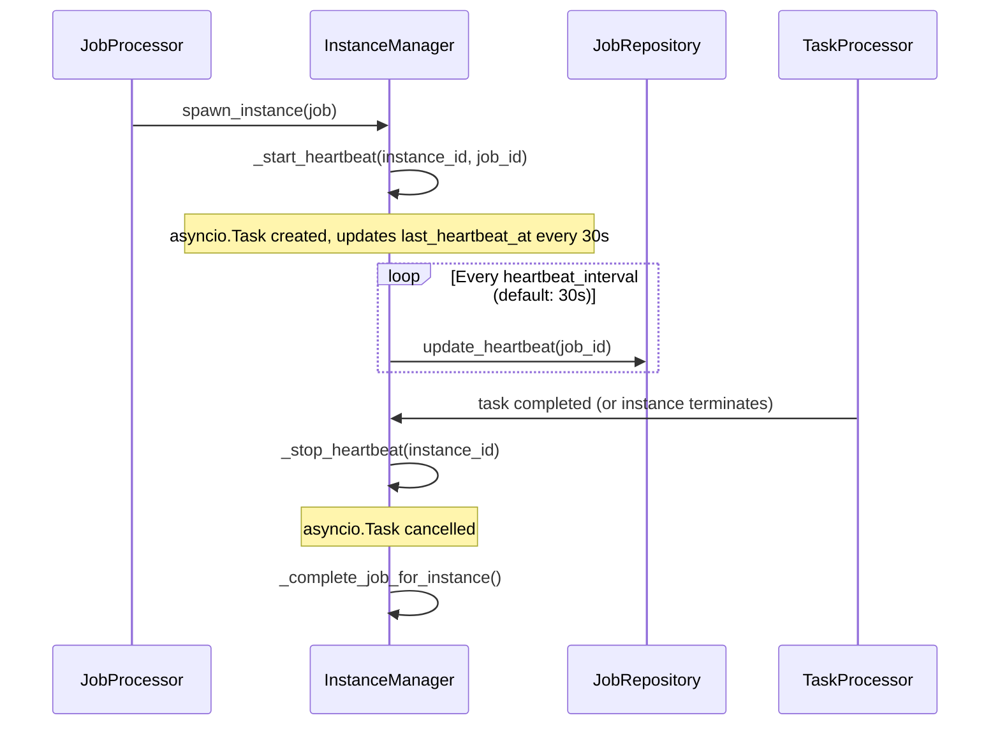

# Phase 2: Reliability — Job Timeout & Crash Recovery

## Objective

Add configurable job timeouts with heartbeat monitoring and implement automatic recovery for PROCESSING jobs orphaned by worker crashes. Together these ensure no job can run forever and no job stays stuck in PROCESSING after a daemon restart.

## Coupling

- **Depends on**: Phase 1 (State Machine, Persistent Locks, new model fields)
- **Coupling type**: tight
- **Shared files with other phases**: `models.py` (uses `started_at` [existing], `max_duration_seconds`, `last_heartbeat_at` from Phase 1), `job_state_machine.py` (adds TIMED_OUT transition), `job_queue_service.py` (adds timeout/recovery methods)
- **Why this coupling**: Timeout adds a new state (`TIMED_OUT`) to the state machine and uses fields from Phase 1. Recovery depends on persistent locks to identify orphaned lock holders.
- **Note on Phase 3 dependency**: TIMED_OUT is a **terminal state** without Phase 3. Phase 3 adds the exit paths (TIMED_OUT→PENDING, TIMED_OUT→DEAD_LETTER). Phase 3 should follow Phase 2 so timed-out jobs aren't stuck forever.

## Context

Phase 1 delivered the formal state machine, persistent locks, `max_duration_seconds`, `last_heartbeat_at` fields on JobItem, `default_timeout_minutes` on JobQueue, and `JobSystemConfig`. The `started_at` field already existed on JobItem and is set by `start_job_atomic()`.

This phase activates those fields and adds two new background services: a `JobTimeoutMonitor` that periodically checks for expired jobs, and a `JobRecoveryService` that runs at startup to clean up orphaned PROCESSING jobs.

## Tasks

### Task 1: Job Timeout Monitor

| # | Sub-task | Details | Key Files |
|---|----------|---------|-----------|
| 1.1 | Create `JobTimeoutMonitor` service | Background async loop that periodically queries PROCESSING jobs where `started_at + max_duration_seconds < now()`. | `daemon/services/job_timeout_monitor.py` (NEW) |
| 1.2 | Implement timeout check | Query: `SELECT * FROM job_queue_items WHERE status = 'PROCESSING' AND max_duration_seconds IS NOT NULL AND datetime(started_at, '+' \|\| max_duration_seconds \|\| ' seconds') < datetime('now')`. Use configurable check interval (default: 30s). | `daemon/services/job_timeout_monitor.py` (NEW) |
| 1.3 | Handle timed-out jobs — **cancel instance FIRST** | For each timed-out job: (1) **cancel associated instance via InstanceManager FIRST**, (2) wait for instance completion callback (which calls `complete_job()`), (3) if callback doesn't fire within grace period, use `atomic_transition(PROCESSING → TIMED_OUT)` with lock release, (4) log event. | `daemon/services/job_timeout_monitor.py` (NEW) |
| 1.4 | Add `find_timed_out_jobs()` to repository | New repository method for the timeout query. | `daemon/repositories/job_queue/repository.py` |
| 1.5 | Register TIMED_OUT in state machine | Add `(PROCESSING, TIMED_OUT): "timeout"` transition. | `daemon/services/job_state_machine.py` |
| 1.6 | Wire into daemon lifecycle | Start `JobTimeoutMonitor` in `api.py` lifespan, stop on shutdown. | `daemon/api.py` |

> **C2 fix:** The original plan had the order wrong — transitioning state FIRST then cancelling instance. This causes a race: `terminate_instance()` internally checks `job.status == "PROCESSING"` and calls `complete_job_sync()` → `fail_job()`, which would raise because the job is already TIMED_OUT.
>
> **Corrected order:** Cancel the instance FIRST. Instance termination triggers the normal completion callback (`_complete_job_for_instance()`), which calls `complete_job()`. If the instance terminates normally (returns error), `fail_job()` transitions PROCESSING→FAILED (valid). If the instance doesn't terminate within the grace period, the monitor falls through to a direct TIMED_OUT transition.
>
> The completion callback and `fail_job()` must be updated to handle the case where the job has already been transitioned (idempotent — if already TIMED_OUT, skip). This is a minor change to `complete_job()`.

**Timeout sequence diagram (corrected):**

```mermaid
sequenceDiagram
    participant Monitor as JobTimeoutMonitor
    participant Repo as JobRepository
    participant IM as InstanceManager
    participant SM as StateMachine
    participant Lock as LockManager
    
    loop Every check_interval (default: 30s)
        Monitor->>Repo: find_timed_out_jobs()
        Repo-->>Monitor: [job1, ...]
        
        for each timed-out job:
            Monitor->>IM: cancel_instance(instance_id, graceful=True)
            
            alt Instance terminates within grace period
                IM->>IM: _complete_job_for_instance(success=False)
                Note over IM: Calls fail_job() → PROCESSING→FAILED
                Note over Monitor: Job is now FAILED (not TIMED_OUT)
                Note over Monitor: Phase 3's retry engine handles it
            else Instance doesn't terminate
                Monitor->>Monitor: Grace period expired
                Monitor->>Repo: atomic_transition(PROCESSING → TIMED_OUT)
                Note over Repo: UPDATE WHERE status='PROCESSING', rowcount check
                Monitor->>Lock: release_by_instance(instance_id)
                Monitor->>IM: force_terminate(instance_id)
                Monitor->>Monitor: log timeout event
            end
        end
    end
```

**Idempotent `complete_job()` / `fail_job()` requirement:**

```python
# In JobRepository — uses atomic_transition from Phase 1:
def complete_job_atomic(self, job_id: str, success: bool, error: str = None):
    """Atomic job completion — handles concurrent transitions gracefully."""
    new_status = JobStatus.COMPLETED.value if success else JobStatus.FAILED.value
    updates = {}
    if not success:
        updates['error_message'] = error
        updates['failed_at'] = datetime.now(UTC).isoformat()
    
    # atomic_transition handles the WHERE status='PROCESSING' check
    # If rowcount=0, the job was already transitioned by another actor (timeout, cancel)
    try:
        self.atomic_transition(job_id, JobStatus.PROCESSING.value, new_status, **updates)
    except InvalidTransitionError:
        # Job already moved to TIMED_OUT/CANCELLED/DEAD_LETTER — that's fine
        logger.warning(f"Job {job_id} no longer PROCESSING, skipping completion")
        return None
    return self.get(job_id)
```

### Task 2: Heartbeat Mechanism

| # | Sub-task | Details | Key Files |
|---|----------|---------|-----------|
| 2.1 | **Heartbeat timer ownership in InstanceManager** | When JobProcessor spawns an instance for a job, InstanceManager creates an `asyncio.Task` that updates `last_heartbeat_at` every `heartbeat_interval_seconds` (from `JobSystemConfig`). The task is stored on the instance context and cancelled when the instance completes or is terminated. | `daemon/manager.py` |
| 2.2 | Add `_start_heartbeat()` method to InstanceManager | `async def _start_heartbeat(self, instance_id: str, job_id: str)` — creates periodic `asyncio.create_task()` that calls `job_repo.update_heartbeat(job_id)` every N seconds. | `daemon/manager.py` |
| 2.3 | Add `_stop_heartbeat()` method to InstanceManager | `def _stop_heartbeat(self, instance_id: str)` — cancels the heartbeat task. Called in `_complete_job_for_instance()` and `terminate_instance()`. | `daemon/manager.py` |
| 2.4 | Add `update_heartbeat()` to JobRepository | Simple `UPDATE job_queue_items SET last_heartbeat_at = ? WHERE job_id = ?`. | `daemon/repositories/job_queue/repository.py` |
| 2.5 | Detect stale heartbeats | In timeout monitor, also check: `status = 'PROCESSING' AND last_heartbeat_at IS NOT NULL AND datetime(last_heartbeat_at, '+' \|\| (2 * heartbeat_interval) \|\| ' seconds') < datetime('now')`. This catches hung jobs even if `max_duration_seconds` is not set. | `daemon/services/job_timeout_monitor.py` (NEW) |

> **W2 fix:** Heartbeat ownership is now explicitly specified. InstanceManager owns the heartbeat timer lifecycle. It spawns a background `asyncio.Task` on job start and cancels it on completion/termination. Changes are scoped to `daemon/manager.py`.

**Heartbeat flow (corrected):**



### Task 3: PROCESSING Job Crash Recovery

| # | Sub-task | Details | Key Files |
|---|----------|---------|-----------|
| 3.1 | Create `JobRecoveryService` | Service with `recover_on_startup()` method that finds orphaned PROCESSING jobs. | `daemon/services/job_recovery_service.py` (NEW) |
| 3.2 | Implement startup recovery | Query all PROCESSING jobs. For each: check if instance still exists and is active. If not, transition to FAILED with error "Recovered: orphaned PROCESSING job". Release lock. | `daemon/services/job_recovery_service.py` (NEW) |
| 3.3 | Add `find_processing_jobs()` to repository | New method to list all jobs with status=PROCESSING. | `daemon/repositories/job_queue/repository.py` |
| 3.4 | Instance status check | Use InstanceManager to verify if instance is still alive. If instance not found or terminated, job is orphaned. | `daemon/services/job_recovery_service.py` (NEW) |
| 3.5 | Wire into startup sequence | Call `recover_on_startup()` in `api.py` lifespan, AFTER database initialization but BEFORE starting JobProcessor. | `daemon/api.py` |
| 3.6 | Log recovery events | Audit log each recovered job with original status, recovery action, timestamp. | `daemon/services/job_recovery_service.py` (NEW) |

> **Note:** Recovered jobs transition to FAILED (not TIMED_OUT). Once Phase 3 is implemented, these will be eligible for auto-retry. Without Phase 3, they stay at FAILED (same as current behavior for manually-failed jobs).

**Startup recovery sequence:**

```mermaid
sequenceDiagram
    participant API as Daemon Startup
    participant Recovery as JobRecoveryService
    participant Repo as JobRepository
    participant Lock as LockManager
    participant IM as InstanceManager
    participant JP as JobProcessor
    
    API->>Recovery: recover_on_startup()
    Recovery->>Repo: find_processing_jobs()
    Repo-->>Recovery: [job1, job2, job3]
    
    for each job:
        Recovery->>IM: is_instance_alive(instance_id)?
        
        alt Instance alive
            IM-->>Recovery: true
            Note over Recovery: Leave job as PROCESSING
            Recovery->>Recovery: Start heartbeat for job
        else Instance dead or missing
            IM-->>Recovery: false
            Recovery->>Repo: atomic_transition(job_id, PROCESSING → FAILED, error="Recovered: orphaned")
            Recovery->>Lock: release_by_instance(instance_id)
            Recovery->>Recovery: log recovery event
        end
    end
    
    API->>JP: start() (only after recovery completes)
```

### Task 4: Integration & Configuration

| # | Sub-task | Details | Key Files |
|---|----------|---------|-----------|
| 4.1 | Set timeout on enqueue — **mandatory default** | When creating a job, resolve `max_duration_seconds` from: (1) explicit parameter in `JobCreateRequest`, (2) `queue.default_timeout_minutes * 60`, (3) **`JobSystemConfig.default_job_timeout_minutes * 60` (mandatory default: 60 min)**. The fallback chain ALWAYS produces a concrete value — no job is created without a timeout. To disable timeout for a specific job, the caller must explicitly set `max_duration_seconds = -1` (documented escape hatch). | `daemon/services/job_queue_service.py` |
| 4.2 | Update API schemas | Add optional `max_duration_seconds` to `JobCreateRequest`. Document that omitting it uses the default (60 min). | `daemon/routers/jobs.py` |
| 4.3 | Startup ordering | Ensure correct startup sequence: DB init → migration → lock reconciliation → job recovery → timeout monitor → retry scheduler (Phase 3) → job processor. | `daemon/api.py` |

> **Issue 2 fix:** The original plan allowed `max_duration_seconds = None` which meant no timeout — the exact problem the plan claims to solve. The resolution chain now **always** produces a concrete timeout value. The config default (`default_job_timeout_minutes: 60`) is mandatory, not optional. An explicit `-1` escape hatch exists for operators who truly want no timeout, but it requires deliberate action.

## Key Files

| File | Role |
|------|------|
| `daemon/services/job_timeout_monitor.py` (NEW) | Periodic timeout check |
| `daemon/services/job_recovery_service.py` (NEW) | Startup crash recovery for PROCESSING jobs |
| `daemon/services/job_state_machine.py` | Add TIMED_OUT state |
| `daemon/repositories/job_queue/repository.py` | `find_timed_out_jobs()`, `find_processing_jobs()`, `update_heartbeat()` |
| `daemon/services/job_queue_service.py` | Set timeout on enqueue; idempotent `complete_job()` |
| `daemon/manager.py` | Heartbeat timer lifecycle (`_start_heartbeat`, `_stop_heartbeat`) |
| `daemon/routers/jobs.py` | API schema update |
| `daemon/api.py` | Wire recovery + timeout monitor into lifecycle |

## Constraints

- **Timeout monitor must be lightweight.** Don't scan all jobs every interval — use indexed queries on `status + started_at`.
- **Recovery runs once at startup.** Not a continuous process — it's a one-shot cleanup before the processor starts.
- **Heartbeat interval must be tunable.** High-frequency heartbeats can cause SQLite contention. Default 30s is conservative.
- **Canceling instances on timeout must be graceful.** Cancel instance FIRST (per C2 fix). Try graceful cancel, force-kill after grace period (default: 30s).
- **`complete_job()` must be idempotent.** Uses `atomic_transition()` — if the job was already transitioned by another actor (timeout, cancel), the WHERE clause matches 0 rows and the transition is silently skipped.
- **All state transitions use `atomic_transition()`.** Timeout transitions, recovery transitions, and completion callbacks all go through the same atomic SQL pattern. No read-then-write.

## Deliverables

- [ ] `JobTimeoutMonitor` running as background task
- [ ] Heartbeat timer owned by InstanceManager (spawned on job start, cancelled on completion)
- [ ] TIMED_OUT state in state machine
- [ ] `JobRecoveryService` with startup recovery
- [ ] Queue-level default timeout configuration (field added in Phase 1, activated here)
- [ ] Mandatory default timeout — no job created without a concrete `max_duration_seconds` value
- [ ] Correct startup ordering in `api.py`
- [ ] Idempotent `complete_job()` / `fail_job()` methods
- [ ] Tests for timeout, heartbeat, and recovery scenarios
