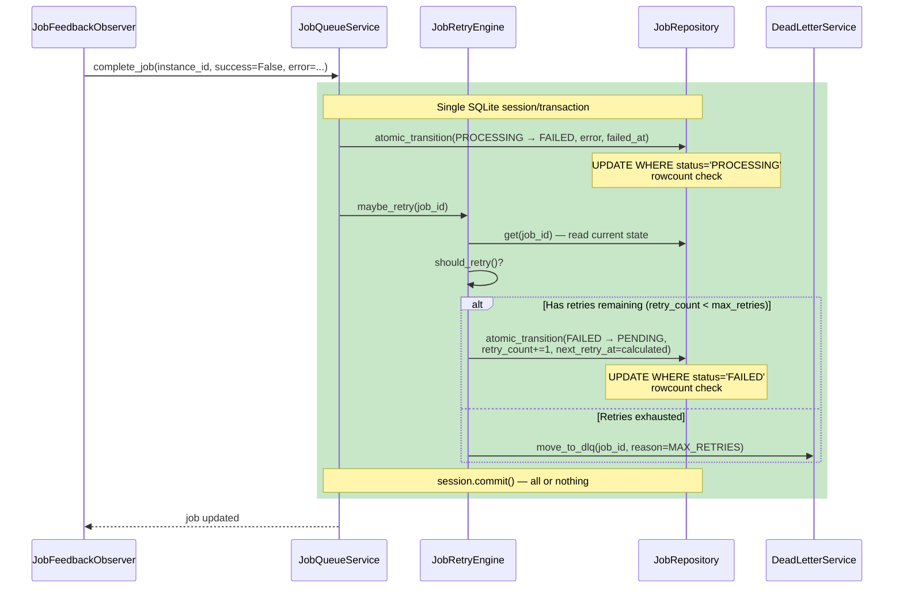

# Phase 3: Resilience — Dead-Letter Queue & Auto-Retry

## Objective

Implement a dead-letter queue (DLQ) for jobs that fail permanently and an automatic retry engine with exponential backoff for transient failures. Jobs that exhaust retries land in the DLQ for manual inspection/replay instead of piling up in FAILED state.

**Auto-retry is an internal-only mechanism** that transitions the same job in-place (FAILED→PENDING). The existing manual `POST /api/jobs/{job_id}/retry` API remains unchanged — it creates a new job with a new `job_id`. See ADR-007 for full rationale.

## Coupling

- **Depends on**: Phase 1 (State Machine, `retry_count`, `max_retries`, `failed_at`, `next_retry_at` fields)
- **Coupling type**: loose
- **Shared files with other phases**: `models.py` (adds DEAD_LETTER status, uses fields from Phase 1), `job_state_machine.py` (adds DEAD_LETTER transitions), `job_queue_service.py` (adds retry/DLQ methods)
- **Why this coupling**: DLQ adds a new state and a new table. Retry uses `retry_count`/`max_retries`/`next_retry_at` fields from Phase 1. Phase 2's feedback mechanism feeds failures into the retry engine, but Phase 3 only depends on Phase 1's fields and state machine.

## Context

Phase 1 added `retry_count`, `max_retries`, `failed_at`, `next_retry_at` fields to JobItem and `default_max_retries` to JobQueue. Phase 2 added the feedback loop that ensures instance completion/failure propagates to job COMPLETED/FAILED. This phase activates retry fields with automatic retry logic and adds a DLQ table for jobs that can't be retried.

**Failure sources that feed into retry:**
- Instance error (Phase 2's feedback observer marks job FAILED)
- Startup recovery (Phase 2's JobRecoveryService marks orphaned jobs FAILED)
- Instance termination (Phase 2's terminate_instance marks job FAILED)
- Cancellation cascade (Phase 2's cancel_job marks job FAILED then CANCELLED)

## Tasks

### Task 1: Dead-Letter Queue Model & Repository

| # | Sub-task | Details | Key Files |
|---|----------|---------|-----------|
| 1.1 | Create `DeadLetterItem` model | New SQLModel: `dlq_id` (PK), `job_id` (unique, not FK — original job row stays in `job_queue_items`), `original_job_data` (JSON blob), `error_message`, `retry_count`, `failed_at`, `moved_to_dlq_at`, `reason` (enum: MAX_RETRIES, MANUAL). | `daemon/repositories/job_queue/models.py` |
| 1.2 | Create `DeadLetterRepository` | CRUD for DLQ items: `enqueue()`, `get()`, `list()`, `delete()`, `cleanup_by_age()`. | `daemon/repositories/job_queue/dead_letter_repository.py` (NEW) |
| 1.3 | Add DLQ state to state machine | Add transitions: `(FAILED, DEAD_LETTER)`, `(DEAD_LETTER, PENDING)` (replay). | `daemon/services/job_state_machine.py` |
| 1.4 | Implement `move_to_dlq()` — **single transaction** | In a **single SQLite session**: (1) `INSERT INTO dead_letter_items` (copy of job data), (2) `UPDATE job_queue_items SET status='DEAD_LETTER' WHERE job_id=? AND status='FAILED'` with rowcount check, (3) `session.commit()`. | `daemon/services/dead_letter_service.py` (NEW) |
| 1.5 | Add migration | New `dead_letter_items` table in `daemon/migrations/versions/`. Follow MigrationRunner convention. | `daemon/migrations/versions/` |

**Dead-letter item schema:**

```python
class DeadLetterItem(SQLModel, table=True):
    __tablename__ = "dead_letter_items"
    dlq_id: str = Field(default_factory=lambda: str(uuid4()), primary_key=True)
    job_id: str = Field(index=True, unique=True)
    agent_id: str
    agent_dir: str
    message: str
    source: str
    project_id: str = Field(index=True)
    queue_id: str = Field(index=True)
    priority: int
    error_message: str
    retry_count: int = Field(default=0)
    failed_at: str
    moved_to_dlq_at: str = Field(default_factory=lambda: datetime.now(UTC).isoformat())
    reason: str  # MAX_RETRIES, MANUAL
    metadata: Optional[dict] = Field(default=None, sa_column=Column(Text))
```

### Task 2: Automatic Retry Engine

| # | Sub-task | Details | Key Files |
|---|----------|---------|-----------|
| 2.1 | Create `JobRetryEngine` service | Core retry logic: calculate backoff, increment retry_count, transition to PENDING. | `daemon/services/job_retry_engine.py` (NEW) |
| 2.2 | Implement exponential backoff | Formula: `delay = min(base_seconds * 2^retry_count + jitter, max_seconds)`. Default: base=60s, max=3600s (1 hour). Set `next_retry_at = failed_at + delay`. | `daemon/services/job_retry_engine.py` (NEW) |
| 2.3 | Add `should_retry()` logic | Returns True if: `retry_count < max_retries`. Uses `max_retries` from job → queue default → `JobSystemConfig.default_max_retries`. Hard cap at 100 to prevent runaway. | `daemon/services/job_retry_engine.py` (NEW) |
| 2.4 | Retry via **single atomic transaction** | `maybe_retry()` executes in a **single SQLite session**: (1) `atomic_transition(FAILED → PENDING, retry_count+=1, next_retry_at=calculated)` if retries remain; or (2) `move_to_dlq()` if exhausted. | `daemon/services/job_retry_engine.py` (NEW) |
| 2.5 | `find_retryable_jobs()` method | Repository query: `status = 'FAILED' AND next_retry_at IS NOT NULL AND next_retry_at <= datetime('now')`. | `daemon/repositories/job_queue/repository.py` |
| 2.6 | Integrate into completion path | When job fails (from feedback observer, recovery, or termination), call `JobRetryEngine.maybe_retry()`. | `daemon/services/job_queue_service.py` |

**Retry flow diagram (single-transaction):**



### Task 3: Retry Scheduler

| # | Sub-task | Details | Key Files |
|---|----------|---------|-----------|
| 3.1 | Create `RetryScheduler` | Background async loop checking `find_retryable_jobs()`. Default interval: 60s. | `daemon/services/retry_scheduler.py` (NEW) |
| 3.2 | Trigger job processor | On finding retryable jobs, call `trigger_next_job(project_id)` to wake the processor. | `daemon/services/retry_scheduler.py` (NEW) |
| 3.3 | Wire into lifecycle | Start RetryScheduler alongside JobProcessor in api.py. | `daemon/api.py` |

### Task 4: DLQ API Endpoints

| # | Sub-task | Details | Key Files |
|---|----------|---------|-----------|
| 4.1 | List DLQ items | `GET /projects/{id}/dlq` with filters: project_id, queue_id, reason, date range, limit. | `daemon/routers/dlq.py` (NEW) |
| 4.2 | Get DLQ item detail | `GET /projects/{id}/dlq/{dlq_id}` with full job data. | `daemon/routers/dlq.py` (NEW) |
| 4.3 | Replay DLQ item | `POST /projects/{id}/dlq/{dlq_id}/replay` — atomically: (1) update job status DEAD_LETTER→PENDING, reset `retry_count=0`, (2) delete DLQ item, (3) trigger next job. | `daemon/routers/dlq.py` (NEW) |
| 4.4 | Delete DLQ item | `DELETE /projects/{id}/dlq/{dlq_id}` — permanent removal of DLQ record only. | `daemon/routers/dlq.py` (NEW) |
| 4.5 | DLQ cleanup | `DELETE /projects/{id}/dlq` — bulk delete by age or reason. | `daemon/routers/dlq.py` (NEW) |

## Key Files

| File | Role |
|------|------|
| `daemon/repositories/job_queue/models.py` | `DeadLetterItem` model, DEAD_LETTER status |
| `daemon/repositories/job_queue/dead_letter_repository.py` (NEW) | DLQ persistence layer with atomic replay |
| `daemon/services/job_state_machine.py` | DEAD_LETTER transitions |
| `daemon/services/job_retry_engine.py` (NEW) | Backoff calculation, retry decision |
| `daemon/services/dead_letter_service.py` (NEW) | Move-to-DLQ logic |
| `daemon/services/retry_scheduler.py` (NEW) | Background retry scheduling |
| `daemon/services/job_queue_service.py` | Integrates retry on job completion |
| `daemon/routers/dlq.py` (NEW) | DLQ API endpoints |
| `daemon/api.py` | Wire RetryScheduler |

## Constraints

- **Backoff must be configurable.** Base, max, and multiplier tunable via `JobSystemConfig`.
- **DLQ replay must reset retry_count.** Replayed jobs start fresh with retry_count=0.
- **DLQ bulk cleanup must be safe.** Only delete by explicit criteria (age, reason).
- **No infinite retry loops.** Hard cap at 100 retries even if `max_retries = None`.
- **Manual retry API unchanged.** `POST /api/jobs/{job_id}/retry` still creates a new job.
- **All multi-step operations are single-transaction.** Auto-retry is one atomic UPDATE. `move_to_dlq()` is one session commit.
- **All state transitions use `atomic_transition()`.**

## Deliverables

- [ ] `DeadLetterItem` model and `DeadLetterRepository` (with atomic replay)
- [ ] DEAD_LETTER state in state machine
- [ ] `JobRetryEngine` with exponential backoff (in-place transitions)
- [ ] `RetryScheduler` background service
- [ ] DLQ API endpoints (list, get, replay, delete, cleanup)
- [ ] `move_to_dlq()` called when retries exhausted
- [ ] Configurable backoff via `JobSystemConfig`
- [ ] Tests for retry logic and DLQ operations
