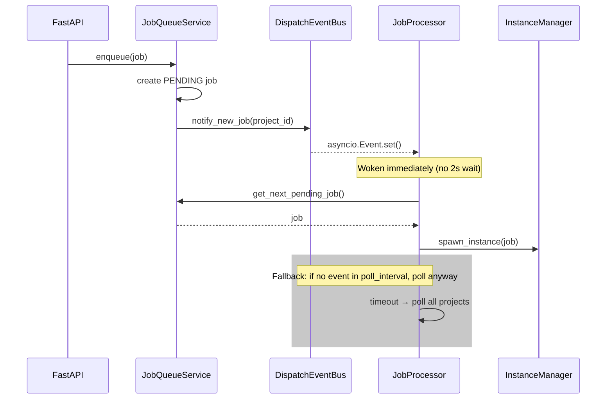
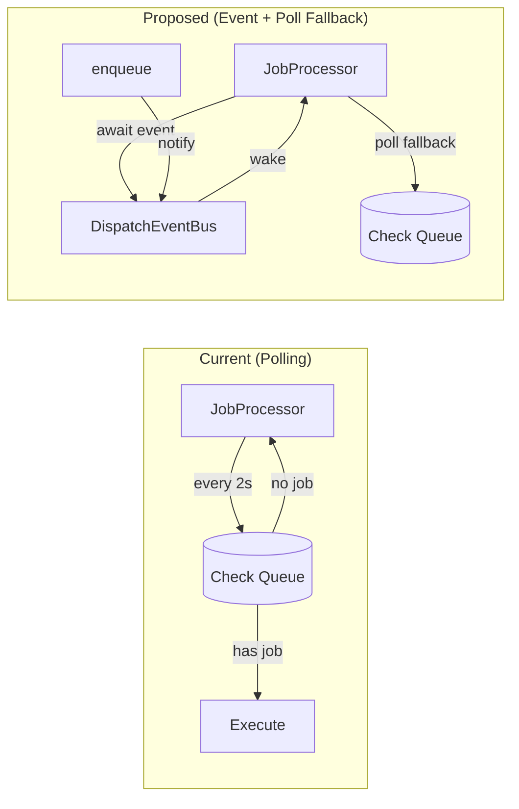
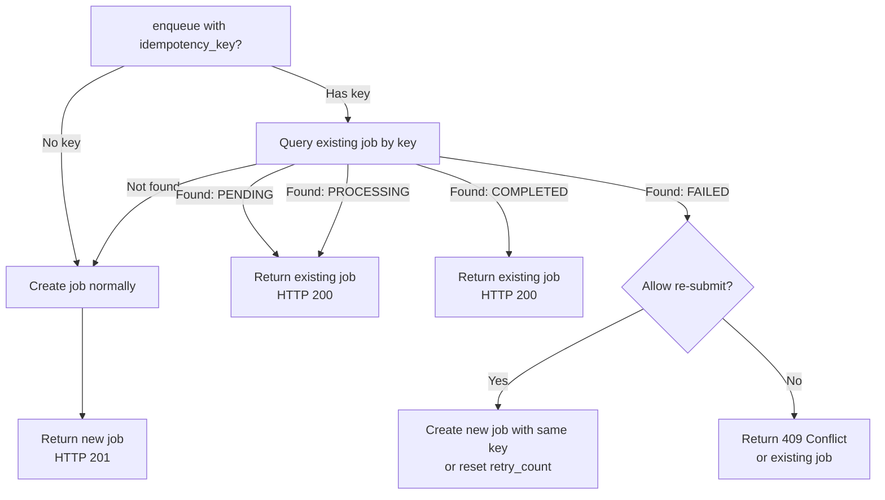

# Phase 4: Performance — Event-Driven Dispatch & Idempotency

## Objective

Replace the 2-second polling loop with event-driven job dispatch for sub-100ms pickup latency, and add idempotency keys to prevent duplicate job submissions. These improvements address latency and data integrity without changing the core processing pipeline.

## Coupling

- **Depends on**: Phase 1 (State Machine, `idempotency_key` field on JobItem)
- **Coupling type**: loose
- **Shared files with other phases**: `job_processor.py` (major refactor of dispatch mechanism), `job_queue_service.py` (adds idempotency check on enqueue)
- **Why this coupling**: Event dispatch uses the state machine API to detect transitions but doesn't add states. Idempotency uses the `idempotency_key` field from Phase 1. Both are self-contained features.

## Context

Phase 1 added the `idempotency_key` field to JobItem and the partial unique index. The state machine is in place. This phase swaps the polling mechanism for event-driven dispatch and activates the idempotency key for deduplication.

> **Pre-existing infrastructure note:** The project has an existing `EventBus` (`daemon/services/event_bus.py`) for SSE checkpoint delivery at the TASK level. The new `DispatchEventBus` operates at the JOB level — they serve different purposes and do not interact. See plan-overview.md "Pre-existing Infrastructure" section.

## Tasks

### Task 1: Event-Driven Job Dispatch

| # | Sub-task | Details | Key Files |
|---|----------|---------|-----------|
| 1.1 | Create `DispatchEventBus` | Simple in-process event bus using `asyncio.Event` per project. Methods: `notify_new_job(project_id)`, `wait_for_job(project_id, timeout)`. | `daemon/services/dispatch_event_bus.py` (NEW) |
| 1.2 | Fire event on enqueue | When `enqueue()` creates a PENDING job, call `dispatch_bus.notify_new_job(project_id)` to wake the processor. | `daemon/services/job_queue_service.py` |
| 1.3 | Fire event on retry | When `RetryScheduler` makes a job retryable, also fire dispatch event. | `daemon/services/retry_scheduler.py` |
| 1.4 | Fire event on queue resume | When a paused queue is resumed, fire dispatch event for that project. | `daemon/services/job_queue_mgmt_service.py` |
| 1.5 | Refactor `JobProcessor._process_loop` | Replace pure polling with: `await asyncio.wait_for(dispatch_bus.wait_for_job(project_id), timeout=poll_interval)`. Falls back to polling on timeout — maintains backward compatibility. | `daemon/services/job_processor.py` |
| 1.6 | Wire into api.py | Create `DispatchEventBus` instance and pass to JobProcessor, JobQueueService, JobQueueMgmtService. | `daemon/api.py` |

**Event-driven dispatch flow:**

**Architecture comparison:**

### Task 2: Idempotent Job Enqueue

| # | Sub-task | Details | Key Files |
|---|----------|---------|-----------|
| 2.1 | Add idempotency check in `enqueue()` | Before creating job: if `idempotency_key` is set, query for existing job with same key. If found and non-terminal, return existing job (HTTP 200). If found and terminal, optionally reject or create new. | `daemon/services/job_queue_service.py` |
| 2.2 | ~~Unique index~~ Already in Phase 1 migration | Partial unique index `idx_job_idempotency` was added in Phase 1 migration. No additional migration needed. | — |
| 2.3 | API schema update | Add optional `idempotency_key` to `JobCreateRequest`. If provided, response is 200 (existing) or 201 (new). | `daemon/routers/jobs.py` |
| 2.4 | Repository method | `find_by_idempotency_key(key) -> Optional[JobItem]`. | `daemon/repositories/job_queue/repository.py` |
| 2.5 | Key generation guidance | If client doesn't provide key, no dedup (backward compatible). Document recommended key format: `{source}:{external_id}:{timestamp}` or similar. | `docs/` or API docs |

**Idempotency decision flow:**

### Task 3: Configuration & Polish

| # | Sub-task | Details | Key Files |
|---|----------|---------|-----------|
| 3.1 | Event dispatch toggle | Add `event_dispatch_enabled: bool = True` to `JobSystemConfig`. When False, falls back to pure polling (for debugging). | `daemon/config.py` |
| 3.2 | Idempotency TTL | Consider: should idempotency keys expire? Add `idempotency_key_ttl_hours: int = 24` config. Jobs older than TTL with same key are treated as new. | `daemon/config.py` |
| 3.3 | Metrics/observability hooks | Add simple counters: `jobs_dispatched_immediately` (event-driven), `jobs_dispatched_polling` (fallback). Expose via logging. | `daemon/services/job_processor.py` |

## Key Files

| File | Role |
|------|------|
| `daemon/services/dispatch_event_bus.py` (NEW) | In-process event notification for job dispatch |
| `daemon/services/job_processor.py` | Refactored to use event-driven wakeup |
| `daemon/services/job_queue_service.py` | Event notification on enqueue + idempotency check |
| `daemon/repositories/job_queue/repository.py` | `find_by_idempotency_key()` |
| `daemon/routers/jobs.py` | `idempotency_key` in API schema, response status codes |
| `daemon/api.py` | Wire DispatchEventBus |

## Constraints

- **Polling must remain as fallback.** Event-driven dispatch is best-effort. If signals are missed, the poll cycle (configurable, default 2s) catches stragglers.
- **Backward compatible.** Clients that don't send `idempotency_key` work exactly as before.
- **No external dependencies.** `DispatchEventBus` is purely in-process using `asyncio.Event`. No Redis, no message broker.
- **SQLite-friendly.** Partial unique index requires SQLite 3.8+ (available in any modern Python).

## Deliverables

- [ ] `DispatchEventBus` with per-project `asyncio.Event` signaling
- [ ] JobProcessor wakes on enqueue events (sub-100ms latency)
- [ ] Polling fallback maintained (configurable interval)
- [ ] Idempotency key check on enqueue
- [ ] Partial unique index on `idempotency_key`
- [ ] API response distinguishes 201 (new) vs 200 (existing)
- [ ] `event_dispatch_enabled` config toggle
- [ ] Tests for event dispatch and idempotency scenarios
