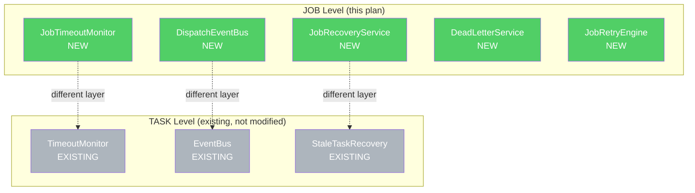
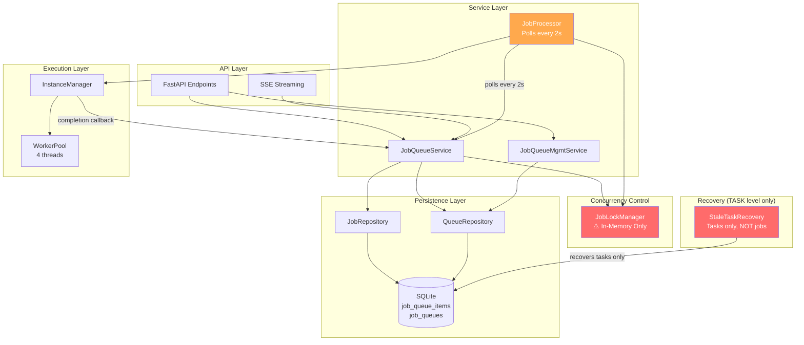
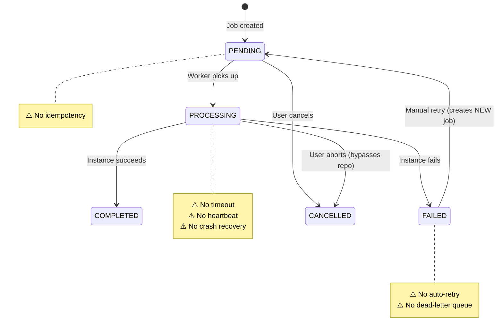
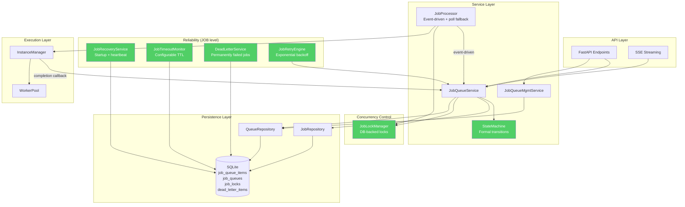
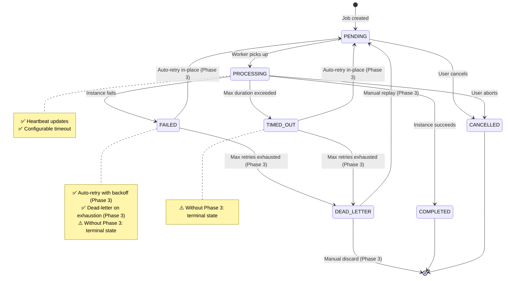

# Plan Overview: Job System Improvements

## Executive Summary

The agents-ensemble job system is a SQLite-backed polling queue with in-memory locks, no timeout mechanism, and no automatic recovery for crashed workers. This plan delivers 8 improvements across 4 phases — starting with critical reliability (timeouts, crash recovery, persistent locks) and progressing to operational quality (dead-letter queue, retry with backoff, event-driven dispatch, state machine, idempotency).

**API backward compatibility:** The manual `POST /api/jobs/{job_id}/retry` endpoint remains unchanged (creates a new job with a new `job_id`). The new auto-retry mechanism is an internal-only path that transitions the same job in-place. This is the only intentional behavioral change — see [ADR-007](decisions.md#adr-007-auto-retry-same-job-vs-new-job).

## Scope Assessment

**LARGE** — 8 distinct improvements touching 15+ files across services, repositories, models, config, and routers. Multiple cross-cutting concerns (state machine underpins everything; event-driven dispatch affects processor architecture). Estimated 3-4 focused days of work.

## Pre-existing Infrastructure

The project already has TASK-level services that the new JOB-level components parallel. These are **not modified** by this plan but are important context:

| Component | File | Scope | What It Does |
|-----------|------|-------|-------------|
| `TimeoutMonitor` | `daemon/services/timeout_monitor.py` | **TASK** | Cancels a `CancellationToken` after a timeout for a single task. Thread-based, per-task. |
| `EventBus` | `daemon/services/event_bus.py` | **TASK** | Checkpoint-based event delivery for SSE streaming of instance messages. DB + `asyncio.Queue` hybrid. |
| `StaleTaskRecovery` | `daemon/services/stale_task_recovery.py` | **TASK** | Finds stale RUNNING tasks, requests cancellation, schedules retry. Thread-based daemon. |

**Key distinction:** These operate at the **task** level (messages within an instance). The new components (`JobTimeoutMonitor`, `JobRecoveryService`, `DispatchEventBus`) operate at the **job** level (the outer work unit that spawns instances). They do NOT replace or duplicate the existing components — they complement them at a different layer.



## Current State Analysis

### Architecture (As-Is)



### Current State Machine (Ad-Hoc)



### Known Code Issue: `cancel_job()` Repository Bypass

The repository's `cancel_job()` only allows `PENDING → CANCELLED` (checks `WHERE status = 'PENDING'`). However, the service layer's `cancel_job()` bypasses this for `PROCESSING` jobs — it calls `self._repository.update()` directly to set `status = CANCELLED`. This means PROCESSING→CANCELLED is a valid system transition but the repository doesn't enforce it. **Phase 1 will fix this** by making the repository aware of both paths through the state machine.

### Critical Gaps

| # | Gap | Impact | Root Cause |
|---|-----|--------|------------|
| 1 | No job timeout | Jobs run forever | No max_duration field, no heartbeat, no mandatory default |
| 2 | PROCESSING jobs orphaned on crash | Jobs stuck permanently | No startup recovery for jobs |
| 3 | In-memory locks | Queue capacity lost on restart | `JobLockManager` uses dict, no DB backing |
| 4 | No dead-letter queue | Failed jobs pile up | No DLQ concept |
| 5 | Manual retry only | Operator burden | No `max_retries`, no backoff |
| 6 | 2s polling latency | Slow dispatch | No event-driven wakeup |
| 7 | Ad-hoc state validation | Easy to miss transitions | No formal state machine |
| 8 | No enqueue idempotency | Duplicate jobs | No idempotency key |

## Target Architecture (To-Be)



### Proposed State Machine (Formal)



## Phase Index

| Phase | Name | Objective | Dependencies | Coupling | Est. Time |
|-------|------|-----------|-------------|----------|-----------|
| 1 | **Foundation: State Machine & Persistent Locks** | Formalize state machine; persist locks to DB; add all new model fields | None | — | 6-8h |
| 2 | **Reliability: Timeout & Recovery** | Job timeout with heartbeat; PROCESSING job crash recovery | Phase 1 | tight | 6-8h |
| 3 | **Resilience: Dead-Letter Queue & Auto-Retry** | DLQ for permanently failed jobs; automatic retry with exponential backoff | Phase 1, Phase 2 | moderate | 5-7h |
| 4 | **Performance: Event-Driven Dispatch & Idempotency** | Replace 2s polling with event-driven wakeup; idempotent enqueue | Phase 1 | loose | 4-6h |

### Coupling Assessment

| From → To | Coupling | Reasoning |
|-----------|----------|-----------|
| Phase 1 → Phase 2 | **tight** | Timeout adds TIMED_OUT state and heartbeat fields to the state machine from Phase 1. Recovery depends on persistent locks from Phase 1. |
| Phase 1 → Phase 3 | **loose** | DLQ adds DEAD_LETTER state to state machine (interface only). Retry uses existing state machine and fields from Phase 1. Can be developed with Phase 1 interfaces only. |
| Phase 1 → Phase 4 | **loose** | Event-driven dispatch replaces polling in JobProcessor. Idempotency adds field to JobItem. Both use state machine API but don't extend it. |
| Phase 2 → Phase 3 | **moderate** | Phase 3 adds TIMED_OUT exit paths (TIMED_OUT→PENDING, TIMED_OUT→DEAD_LETTER). Without Phase 3, TIMED_OUT is a terminal state. Phase 3 should follow Phase 2 so that timed-out jobs can be retried or moved to DLQ. |
| Phase 3 ↔ Phase 4 | **independent** | Completely different concerns. |

### Scheduling Recommendation

```
Phase 1 (foundation)
  │
  ├──→ Phase 2 (sequential, tight coupling)
  │      │
  │      └──→ Phase 3 (after Phase 2, moderate coupling — TIMED_OUT exit paths)
  │
  └──→ Phase 4 (loose coupling, can run parallel with Phase 2+3)

Phase 4 is the only phase that can parallel with Phase 2.
Phase 3 should wait for Phase 2 due to TIMED_OUT dependency.
```

## Design Principle: Atomic State Transitions

Every state transition in this system is subject to concurrent access from multiple actors — timeout monitors, instance completion callbacks, manual API cancellations, startup recovery, and retry schedulers. A read-then-write pattern (read current state, validate, then write new state in a separate step) creates a TOCTOU race: between the read and the write, another actor can change the state.

**All state transitions MUST use the atomic SQL pattern:**

```python
def atomic_transition(session, job_id: str, from_status: str, to_status: str, **updates):
    """Single-statement atomic state transition.
    
    - Validates expected current state via WHERE clause
    - Applies new state + additional fields in one statement
    - Verifies success via rowcount (0 = stale state, raise InvalidTransitionError)
    - No read-then-write gap — the database is the source of truth
    """
    stmt = update(JobItem).where(
        JobItem.job_id == job_id,
        JobItem.status == from_status
    ).values(status=to_status, **updates)
    result = session.exec(stmt)
    session.commit()
    if result.rowcount == 0:
        raise InvalidTransitionError(
            f"Job {job_id} not in expected state {from_status} "
            f"(concurrent modification or already transitioned)"
        )
    return True
```

**Multi-table operations** (e.g., `move_to_dlq()` updating both `job_queue_items` and `dead_letter_items`) must wrap all statements in a **single SQLite session/transaction** so they commit or rollback atomically.

This principle applies to all phases. The existing `start_job_atomic()` method already follows this pattern — every new transition method must follow it too.

## Risks & Mitigations

| Risk | Impact | Likelihood | Mitigation |
|------|--------|------------|------------|
| Concurrent state transitions (TOCTOU races) | High | High | All transitions use atomic SQL pattern (UPDATE…WHERE status=X). See "Design Principle: Atomic State Transitions" above. |
| SQLite write contention under heartbeat load | Medium | Medium | Batch heartbeat updates; use configurable interval (default 30s); WAL mode already enabled |
| State machine too restrictive for future states | Low | Low | Use extensible enum + transition registry; not a fixed FSM library |
| Migration breaks existing PROCESSING jobs | High | Low | Startup recovery runs BEFORE processor starts; recovery handles pre-migration states |
| Event-driven dispatch introduces race conditions | Medium | Medium | Keep polling as fallback; use asyncio.Event for wakeup signal; atomic state transitions unchanged |
| DLQ table grows unbounded | Low | Medium | Add TTL-based cleanup; expose DELETE endpoint for manual cleanup |
| Timeout → instance cancel race condition | High | Low | Cancel instance FIRST, then transition state. See Phase 2 for detailed flow. |
| Auto-retry model breaks API consumers | Medium | Low | Manual retry API unchanged (new job, new ID). Auto-retry is internal-only. See ADR-007. |

## Success Criteria

- [ ] Jobs time out after configurable duration (mandatory default: 60 minutes — no job can run forever)
- [ ] Worker crash leaves no orphaned PROCESSING jobs after startup recovery
- [ ] Locks survive daemon restart
- [ ] Failed jobs auto-retry with exponential backoff up to configurable max
- [ ] Permanently failed jobs land in dead-letter queue, queryable via API
- [ ] Job pickup latency < 100ms (vs current 2s floor)
- [ ] Duplicate job submissions with same idempotency key return existing job
- [ ] State transitions are validated through formal state machine
- [ ] All existing tests pass; new features have test coverage
- [ ] Manual retry API (`POST /api/jobs/{job_id}/retry`) unchanged — returns new job ID

## Files Affected (Summary)

| Category | Files |
|----------|-------|
| **Models** | `daemon/repositories/job_queue/models.py` |
| **Repository** | `daemon/repositories/job_queue/repository.py` |
| **Services** | `daemon/services/job_queue_service.py`, `daemon/services/job_processor.py`, `daemon/services/job_lock_manager.py`, `daemon/manager.py` |
| **New Services** | `daemon/services/job_state_machine.py`, `daemon/services/job_timeout_monitor.py`, `daemon/services/job_recovery_service.py`, `daemon/services/dead_letter_service.py`, `daemon/services/job_retry_engine.py`, `daemon/services/retry_scheduler.py`, `daemon/services/dispatch_event_bus.py` |
| **New Repository** | `daemon/repositories/job_queue/lock_repository.py`, `daemon/repositories/job_queue/dead_letter_repository.py` |
| **Config** | `daemon/config.py` |
| **API** | `daemon/routers/jobs.py`, `daemon/routers/queues.py`, `daemon/routers/dlq.py` (NEW) |
| **Init** | `daemon/api.py` |
| **Migrations** | `migrations/versions/` (new migration files) |

## Tracking

- Created: 2026-04-08
- Last Updated: 2026-04-08
- Status: revised (v3)
