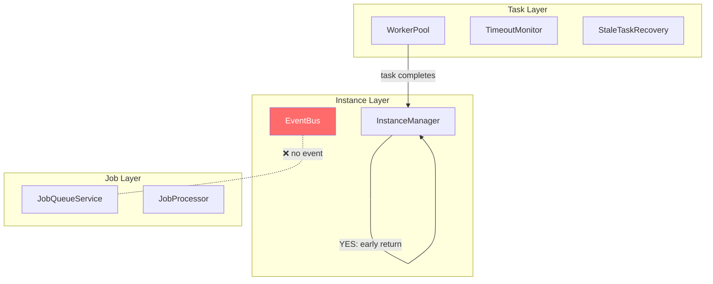
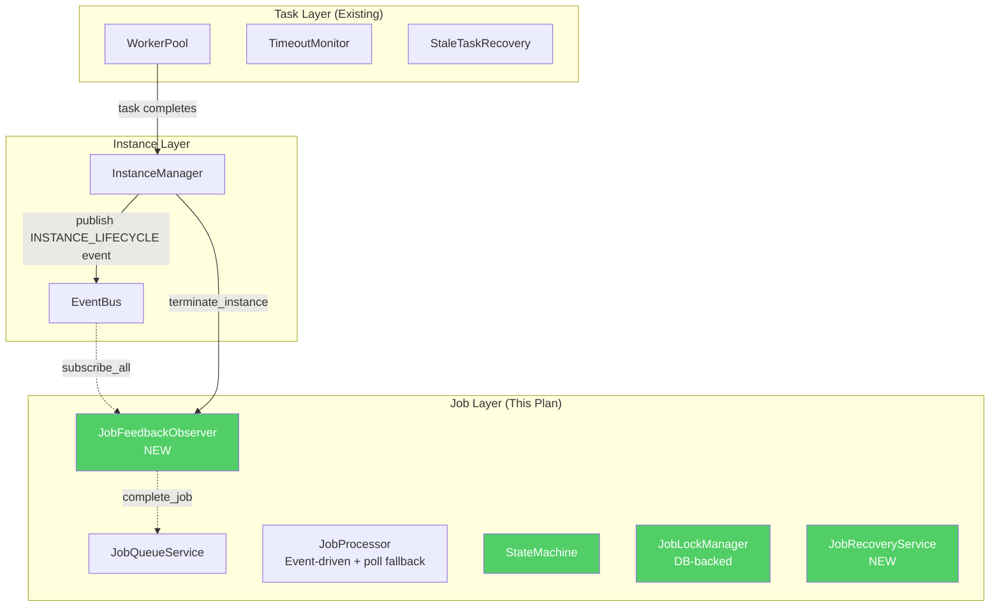
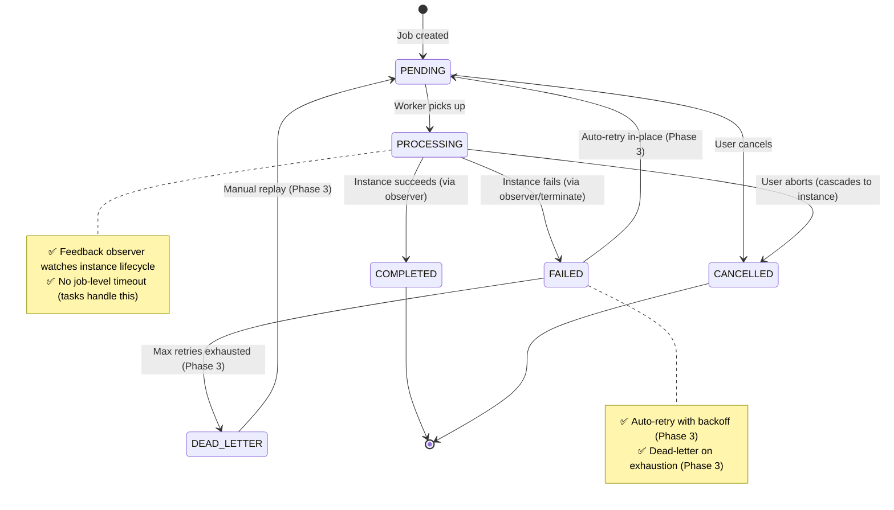

# Plan Overview: Job System Improvements (Revised v5)

## Executive Summary

The agents-ensemble job system has a critical architectural gap: **task completion does not propagate to job completion**. Jobs stay `PROCESSING` forever because `_complete_job_for_instance()` exists but is dead code (never called), and there is no EventBus event published for top-level instances completing.

This plan fixes the gap by (a) adding instance lifecycle event publishing for top-level instances, (b) implementing a `JobFeedbackObserver` that receives these events and calls job completion, (c) implementing simplified startup recovery and cancellation cascade.

**Key insight:** The tasks system (`TimeoutMonitor`, `StaleTaskRecovery`) already handles execution-level timeout, crash recovery, and retry. The job system observes these results rather than duplicating them.

**API backward compatibility:** All existing APIs remain unchanged.

## Scope Assessment

**LARGE** — Touching 15+ files across services, repositories, models, config, and routers. Requires new instance lifecycle event publishing in InstanceManager. Estimated 3-4 focused days of work.

## The Core Problem (Verified)

```
Current (Broken):
Worker → TaskProcessor → _process_child_completion_and_notify_parent()
                                               ↓
                              if instance.parent_id is None:  ← Job instances!
                                  return  ← EARLY RETURN, no event published
                                               ↓
                              Job stays PROCESSING forever ❌
```

**Three compounding gaps:**

1. **No event for top-level instances**: `_process_child_completion_and_notify_parent()` only creates `INSTANCE_COMPLETED` events for child instances. Job instances have `parent_id=None` and get an early return.
2. **`_complete_job_for_instance()` is dead code**: Defined at `daemon/manager.py:575` but never called from anywhere in the codebase.
3. **`terminate_instance()` always marks FAILED**: At `daemon/manager.py:2240`, calls `complete_job_sync(success=False)`. There is no successful completion path.

## Pre-existing Infrastructure (Task Level — Not Modified)

| Component | File | What It Does |
|-----------|------|-------------|
| `TimeoutMonitor` | `daemon/services/timeout_monitor.py` | Cancels task after timeout (5 min default) |
| `StaleTaskRecovery` | `daemon/services/stale_task_recovery.py` | Finds stale RUNNING tasks, requests cancel, schedules retry |
| `EventBus` | `daemon/services/event_bus.py` | Publishes events via `_broadcast_to_global` |
| `CancellationToken` | `daemon/services/cancellation.py` | Propagates cancellation through LangGraph execution |

## Architecture: As-Is vs To-Be

### As-Is Architecture (Broken)



### To-Be Architecture (With Feedback Loop)



## EventBus Event Structure (Verified)

The EventBus broadcasts events via `_broadcast_to_global()` with this structure:

```python
event = {
    "instance_id": str,      # Always present
    "event_type": str,       # Always present — NOT "kind"
    "event_id": str|None,    # Optional
    "data": dict|None,       # Optional
}
```

**Important:** Event field is `event_type`, not `kind`. The observer must filter on `event["event_type"]`.

**Existing EventKind enum** (`daemon/repositories/event/models.py:13-23`):
- `INSTANCE_COMPLETED` — published for child instances only
- `CHILD_COMPLETED` — published for parent
- `CHILD_FAILED` — published for parent
- `ERROR`, `PROCESSING_COMPLETED`, `PROCESSING_FAILED`, etc.
- **New EventKind (added by this plan):**
- `INSTANCE_LIFECYCLE` — published for top-level instances (parent_id=None) with a `status` field: `completed`, `terminated`, `error`

> **Design choice:** Single `INSTANCE_LIFECYCLE` event kind with a `status` field rather than separate `INSTANCE_TERMINATED`/`INSTANCE_ERROR` kinds — simpler to implement and subscribe to. See ADR-010.

## Phase Index

| Phase | Name | Objective | Dependencies | Coupling | Est. Time |
|-------|------|-----------|-------------|----------|-----------|
| 1 | **Foundation: State Machine & Persistent Locks** | Formalize state machine; persist locks to DB; add all new model fields | None | — | 6-8h |
| 2 | **Integration: Task↔Job Feedback Loop** | Add instance lifecycle events for top-level instances; implement feedback observer; startup recovery; cancellation cascade | Phase 1 | tight | 7-9h |
| 3 | **Resilience: Dead-Letter Queue & Auto-Retry** | DLQ for permanently failed jobs; automatic retry with exponential backoff | Phase 1 | loose | 5-7h |
| 4 | **Performance: Event-Driven Dispatch & Idempotency** | Replace 2s polling with event-driven wakeup; idempotent enqueue | Phase 1 | loose | 4-6h |

### Coupling Assessment

| From → To | Coupling | Reasoning |
|-----------|----------|-----------|
| Phase 1 → Phase 2 | **tight** | Phase 2 uses `atomic_transition()`, persistent locks, and state machine from Phase 1. Phase 2 also adds new functionality to `manager.py` that interacts with Phase 1's state machine. |
| Phase 1 → Phase 3 | **loose** | DLQ adds DEAD_LETTER state (interface only). Retry uses fields from Phase 1 but doesn't extend state machine. |
| Phase 1 → Phase 4 | **loose** | Event dispatch replaces polling. Idempotency adds field. Both use state machine API but don't extend it. |
| Phase 2 → Phase 3 | **moderate** | Phase 2's feedback mechanism feeds failures into Phase 3's retry engine. Phase 3 only depends on Phase 1's fields and state machine. |
| Phase 3 ↔ Phase 4 | **independent** | Completely different concerns. |

### Scheduling Recommendation

```
Phase 1 (foundation)
  │
  ├──→ Phase 2 (sequential, tight coupling)
  │
  ├──→ Phase 3 (loose — can start after Phase 1)
  │
  └──→ Phase 4 (loose — can start after Phase 1, parallel with Phase 2+3)
```

## Proposed State Machine (Formal)



> **No TIMED_OUT state.** Tasks already handle timeout via `TimeoutMonitor`. Job-level timeout is unnecessary (see ADR-009).

## Race Condition Handling

Multiple actors can try to complete the same job simultaneously:

| Actor | Trigger | Method |
|-------|---------|--------|
| `terminate_instance()` | User cancel / error | `complete_job_sync(success=False)` |
| `JobFeedbackObserver` | Instance completes naturally | `complete_job(success=True/False)` |
| `JobRecoveryService` | Startup recovery | `complete_job(success=False)` |

**Resolution:** All paths go through `atomic_transition()` with `WHERE status = 'PROCESSING'`. First writer wins; others get `rowcount=0` and skip. This is the same pattern as Phase 1's `atomic_transition()`.

**Ordering guarantee:** `terminate_instance()` always wins because it calls `complete_job_sync()` (synchronous) within the same coroutine step, before yielding control. The observer processes events asynchronously from a queue. If `terminate_instance()` transitions the job first, the observer's `atomic_transition()` gets `rowcount=0` and skips.

## Design Principle: Atomic State Transitions

Every state transition uses the `atomic_transition()` pattern from Phase 1:

```python
def atomic_transition(session, job_id, from_status, to_status, **updates):
    stmt = update(JobItem).where(
        JobItem.job_id == job_id,
        JobItem.status == from_status
    ).values(status=to_status, **updates)
    result = session.exec(stmt)
    session.commit()
    if result.rowcount == 0:
        raise InvalidTransitionError(...)
```

**All state transitions in all phases MUST use this pattern.** No read-then-write.

## Risks & Mitigations

| Risk | Impact | Mitigation |
|------|--------|------------|
| Observer loop dies silently | Jobs stuck until restart | Add health check: periodic log + metrics counter. If no events processed in N minutes, log warning. |
| `terminate_instance()` races with observer | Double completion attempt | `atomic_transition()` with rowcount check. First writer wins. |
| EventBus queue overflow drops events | Jobs stay PROCESSING | Startup recovery catches orphaned jobs. Polling fallback in Phase 4. |
| Instance lifecycle events missing for some paths | Jobs stuck | Audit all instance status transition paths in manager.py. Add events to each. |
| No successful completion path exists yet | Phase 2 is NEW functionality, not observation | Phase 2 explicitly creates the completion path. |

## Success Criteria

- [ ] Jobs complete when their associated instance completes (no stuck PROCESSING jobs)
- [ ] Jobs fail when their associated instance errors or is terminated
- [ ] Worker crash leaves no orphaned PROCESSING jobs after startup recovery
- [ ] Locks survive daemon restart
- [ ] `cancel_job()` cascades to instance (using existing `terminate_instance()`)
- [ ] Failed jobs auto-retry with exponential backoff (Phase 3)
- [ ] Permanently failed jobs land in dead-letter queue (Phase 3)
- [ ] Job pickup latency < 100ms (Phase 4)
- [ ] Duplicate submissions with same idempotency key return existing job (Phase 4)
- [ ] State transitions validated through formal state machine
- [ ] All existing tests pass; new features have test coverage

## Tracking

- Created: 2026-04-08
- Last Updated: 2026-04-18
- Status: revised (v5 — codebase-verified)
- Change Summary (v5): Fixed 5 critical codebase mismatches (C1, C2, C3, C2-NEW, C3-NEW). Phase 2 now explicitly creates the instance→job feedback path as NEW functionality, not observation of existing behavior.
