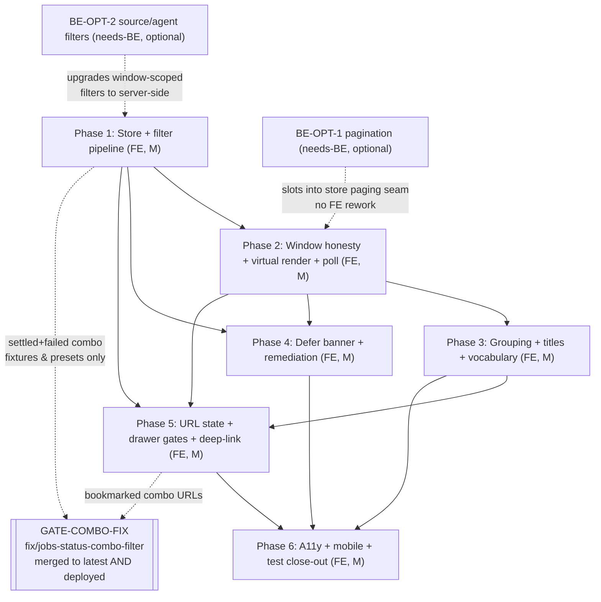

# Plan Overview: jobs-page-improvement

Date: 2026-09-10
Author: planner[v2] via plan-creation worker
Status: Ready for Review — direction basis fixed by dispatch (Direction A "Align-in-Place Refresh", architected as C-shaped groundwork)
Worktree: `/Users/nguyenminhkha/All/Code/opensource-projects/agents-ensemble-wt-jobs-page-plan` @ `feature/jobs-page-improvement` (base `e72558d1`)

## Objective

Turn `/jobs` into an honest, structured deep-inspection + operations surface: one store and one filter pipeline behind both view modes (dead-filter class eliminated structurally), a truthful data window (explicit `limit=100`, full-window banner, all-work render guard), conversation-context grouping with honest titles, first-class defer-blocked surfacing with wired remediation, URL-shareable state, and panel-parity a11y/mobile polish — **FE-only by default, zero BE dependencies in the default phases**.

## Scope

### In Scope
- `frontend/src/app/pages/jobs/**` (page, store, pure models, defer panel), `components/job-card`, `components/job-detail-drawer`, `components/queue-list`, `components/system-cleanup-confirm-dialog` (spec only), `components/job-create-dialog` (spec only), `services/job.service.ts`, `services/work.service.ts`, NEW `services/mission.service.ts`, `models/` (filter-state, grouping, window/poll/keyboard, defer, job/work extensions).
- All 9 pain themes P1–P9 from `current-state-analysis.md` map to phases (P1→3, P2→1+2, P3→4, P4→2/5, P5→1, P6→6, P7→6, P8→1, P9→per-phase+6).

### Out of Scope — the 8 non-goals (inherited verbatim from `ux-direction-options.md`)
1. **Not replace, rework, or restyle the header panel/indicator** — the glanceable/live-status role stays exactly where it is; the page only stops *contradicting* it (vocabulary, glyphs).
2. **No BE work in the default plan.** The only BE items are *named optional asks* behind OQ-2/OQ-3 (jobs pagination/real-total; `/api/work` limit; source/agent filters; row titles; list SSE). Nothing in the default phases blocks on them.
3. **Not fix the settled+failed combo defect** — owned by the parallel arc `fix/jobs-status-combo-filter` (base `e72558d1`). Pinned as **GATE-COMBO-FIX**, a version-gated dependency for settled-involving multi-status filter phases; explicitly not compensated FE-side.
4. **Not remove the queue concept** (queue sidebar, queue-scoped views, DLQ replay) — its fate is OQ-1, not a unilateral IA decision.
5. **Not introduce a design-system/component-library overhaul** — the page reuses existing panel patterns and Material primitives as-is.
6. **Not touch chat, instances sidebar, or notification surfaces.**
7. **Not implement mission-events/epoch history** (M4(ii) is BE; `epoch` is constant 1 today).
8. **Not chase real-time parity with no BE** — no fake "load more" against a cursor-less endpoint, no unbounded SSE fan-out, no silent truncation. Honesty surfaces instead.

## Direction Summary

**A — Align-in-Place Refresh (ADOPTED).** Keep the flat job list as the page's primary IA (it *is* the deep-inspection surface) and make it honest and contextual: one store + one filter pipeline, mission-grouped headers via the proven coalesced key, unified settled/receipt vocabulary, defer-blocked as a first-class page element, windowed render with an honesty banner, URL filter state, a11y/mobile port. Every element is evidence-backed as FE-shippable today; effort M–L total, risk low–medium.

**B — Instances-Primary Rebuild (rejected as first move).** Rebuild the page missions/instances-first with the flat list demoted. Native mental-model alignment and real pagination — but only on the missions axis (offset-paged 10/100), its secondary mode still inherits the jobs-window ceiling, and it drifts the page toward the panel's glanceable role (positioning violation risk). Effort L+, risk med–high. Revisit only if the user opts into the BE pagination arc (OQ-2).

**C — Hybrid Dual-Lens (adopted as ARCHITECTURE, deferred as IA).** One `JobsPageStore` projected into two lenses (Conversations tree + Flat dense table). The dual-mode divergence bug (P5.1) is exactly what C-without-a-store recreates — so we build A's store + single pipeline NOW (the "C-shaped groundwork") and any future Conversations lens becomes a *projection*, not a second pipeline. C's unique value is strategic; its corrective coverage equals A's.

**Why A-as-C-groundwork won:** it is the only direction whose every element is FE-shippable today (gap table rules out honest pagination, real totals, list SSE, server-side source/agent filters without BE); it preserves the page-vs-panel positioning split; it fixes all nine pain themes 1:1 with per-phase regression pins; and it de-risks the future C lens instead of repeating the historical dual-pipeline mistake.

## Phase Map

| Phase | Name | One-line Objective | Scope | Size | Status |
|-------|------|--------------------|-------|------|--------|
| 1 | Store & filter-pipeline unification | One `JobsPageStore` + one filter pipeline behind both views; dead filters structurally resolved; `limit=100` on the wire; all-work row parity | FE-only | M | pending |
| 2 | Window honesty, virtualized render & poll discipline | Full-window honesty banner; all-work >1000 render guard; `cdk-virtual-scroll`; visibility/drawer-gated 30s poll | FE-only | M | pending |
| 3 | Mission-context grouping, honest titles & vocabulary | Grouped headers via coalesced key (never-hide), fallback titles + lazy missions enrichment, settled/receipt vocabulary sweep | FE-only | M | pending |
| 4 | Defer-blocked surfacing & remediation wiring | Severity-graded page banner + holders drill-down (≤1 interaction), force-complete/resend behind two-stage confirm, retain-last-data | FE-only | M | pending |
| 5 | URL filter state, drawer gate fixes & job deep-link | Filter/view state in URL, `?job=<id>` drawer deep-link, Result/Timeline/Message drawer gates fixed honestly | FE-only | M | pending |
| 6 | Accessibility, mobile & test-completion close-out | WAI-ARIA + clamped keyboard model, ≤768px sidebar sheet, three missing spec suites, final audit + warning attribution | FE-only | M | pending |
| BE-OPT-1 | Jobs pagination & real total *(optional, OQ-2)* | `offset`/`has_more`/real `total` on `/api/jobs` (missions-envelope shape, `missions.py:262-269`); `limit` on `/api/work` | **needs-BE** | L | not planned |
| BE-OPT-2 | Server-side source/agent filters *(optional, OQ-3)* | `source`/`agent_id` query params on `/api/jobs` (gap-e5) | **needs-BE** | M | not planned |
| BE-OPT-3 | List-level SSE *(documented ask only, OQ-2 corollary)* | jobs-list SSE stream (gap-e1) — would obsolete the poll-only freshness ceiling | **needs-BE** | L | not planned |

## Dependency Graph

Linear spine P1→P2→P3→P6 with P4/P5 parallelizable against P2/P3; close-out last. GATE-COMBO-FIX gates only settled-involving multi-status combos (fixtures/presets/bookmarks), not the phases themselves.

## Merge & Branch Hygiene

- **Merge to `latest` with `--no-ff`** — one merge commit per phase; no fast-forwards, no direct pushes to `latest`.
- **Evidence-commit discipline** — evidence commits are path-scoped (e.g. `.agents/tester/RESULTS/*`); every artifact verified IN the worktree before commit; verify claimed close-out diff-stats with `git show --stat` (a claimed "2 files" has been 12 before) — never const-existence or docstring claims.
- **GATE-COMBO-FIX order rule: DEPLOY-gate, not merge-gate.** Either branch may land/merge first — the FE forwards status combos verbatim, so merge ORDER is irrelevant. The gate opens only when the FIXED DAEMON DEPLOYS to the environment serving this FE (probe: `GET /api/jobs?status=settled,failed` returns ≥ rows of `?status=failed`). Until the probe passes: settled-involving combo fixtures stay skipped-with-reason (Phase 1/5 codecs), and the honesty banner already makes no completeness claim (D2).

## Coupling Map

| | P1 | P2 | P3 | P4 | P5 | P6 |
|---|---|---|---|---|---|---|
| P1 | — | tight (store/window signals) | tight (grouping = projection of store) | loose (service discipline) | tight (JobsFilterState codec) | loose |
| P2 | tight | — | tight (flattened virtual item list) | loose (poll tick) | tight (drawer-open pause ↔ `?job=`) | loose (keyboard needs item list) |
| P3 | tight | tight | — | independent | loose | tight (ARIA tree structure) |
| P4 | loose | loose | independent | — | independent | loose (final audit) |
| P5 | tight | tight | loose | independent | — | loose |
| P6 | loose | loose | tight | loose | loose | — |

## Risks (Top 5)

| # | Risk | Severity | Mitigation |
|---|------|----------|------------|
| 1 | Grouped virtual scroll — headers inside the virtual viewport, the arc's one genuinely fiddly rendering constraint (Phase 3 over Phase 2's list) | Medium | Phase 2 defines a flattened `(header\|row) WindowItem[]` scroll source up front; uniform header height keeps fixed itemSize; property tests (every row exactly once) |
| 2 | Refactor regression against the 2,085-line existing spec pins (project persistence 1–6, `root_only=false`, SSE stamping, DLQ retry-all) while deleting the dual path (Phase 1) | High | Keep store API compatible with existing call sites; grep-pin old behavior before flipping; run FULL suite per commit; boot-level integration test stays in the merge gate |
| 3 | New bundle/budget warnings from `cdk` ScrollingModule + new surfaces polluting the "10 known warnings" baseline | Medium | Attribute every warning vs the known-10 corpus (6 scss budgets, 1 bundle, NG8113, 2 Sass deprecations) at each phase's build; unattributed deltas are merge blockers |
| 4 | GATE-COMBO-FIX slips: `settled,failed` combos keep dropping rows (live-measured 2 vs 3) while the new pipeline forwards them verbatim and bookmarks preserve them | Medium | Plan does not design around the defect (binding constraint); honesty banner never promises completeness; gate documented in Phase 1/5 codecs; probe criterion pinned (`settled,failed ≥ failed` row count) |
| 5 | Template-extraction blind spots — plain-TS logic specs cannot verify DOM bindings, and 5 of 6 phases touch `(click)`/`(keydown)` hunks | Medium | Mandatory per-phase diff-audit of deleted/added binding hunks per invocation site (Enter `preventDefault` F2 trap explicitly checked); final sweep in Phase 6 task 9 |

## Success Criteria (measurable)

| # | Criterion | How to Measure | Threshold |
|---|-----------|----------------|-----------|
| 1 | Dead-filter class eliminated structurally | Cross-seam invariant spec: every rendered filter control changes `store.filteredJobs()` output in BOTH view modes; grep for bypass paths (`filteredJobs` not touching active dataset) | 0 no-op controls; invariant spec green in both modes |
| 2 | Capped window surfaced honestly (50-cap class dead) | FE always sends `limit=100` (service spec pins query string); banner renders whenever response length == 100; all-work 1001-row fixture cannot render silently (render-guard spec) | 3 pins green; silent-cap path unreachable from page (no `listJobs` call without `limit`) |
| 3 | Defer-blocked visible ≤1 interaction from page root | Manual + spec: banner visible on load when data present; one click on "Review holders →" lists holders; actions fire only post-confirm | Banner on load; drill-down depth 1; confirm-gated dispatch spec green |
| 4 | Spec coverage complete | END-STATE suite inventory (13): `jobs-page.store`, `jobs-filter-state.model`, `jobs-window.model`, `jobs-poll.model`, `jobs-empty-state.model`, `jobs-grouping.model`, `jobs-url-state.model`, `jobs-keyboard.model`, `mission.service` (split — migrated + NEW URL pins), `work.service` (real-construction parity), `system-cleanup-confirm-dialog`, `queue-list`, `job-create-dialog`; per-phase budget ≤3 NEW spec files; `jobs.component.spec.ts` is migration/deletion-pin archive only (P6 DECLINE default) | All present and passing via `npx jest` |
| 5 | Build green | `npx tsc --noEmit -p tsconfig.app.json` + `npm run build` per phase and at close | tsc clean; build succeeds; warning corpus == known-10 or every delta attributed |
| 6 | All-work drawer repaired | Drawer spec: report/settled rows show Result when `result_summary` present; Timeline shows created+started+completed with computable duration | 2 pins green (Phase 5 tasks 4–5) |
| 7 | Never-hide grouping property | Grouping property test over randomized fixtures (null mission_id, both-populated, no-context rows) | Every row renders exactly once across groups |
| 8 | Keyboard + responsive parity | Keyboard truth-table spec (clamped nav, expand/collapse, activate); ≤768px sheet state spec | Specs green; zero title-only icon controls (grep) |

## Research Insights (shaping decisions; full cites in phase files)

- Silent server cap: FE sends no `limit` → BE default 50, `total`=page length, no `has_more` (`job.service.ts:85-106`; `constants.py:17/20`; `jobs_crud.py:866-869`) — honesty banner is the only truthful FE-only posture (gap-b/c).
- Dead filters are structural, not cosmetic: `filteredJobs` never touches `works()`, and `workToJob` nulls `source`/timestamps (`:230-249`, `:292-317`) — hence the Phase-1 single-pipeline fix rather than per-control patches.
- The coalesced key, fallback title chain, retain-last-data forkJoin, and WAI-ARIA model are panel-proven and portable near-verbatim (`instance-node.model.ts:382-394`; `job-queue-panel.component.ts:508-517`; `job-queue-indicator.component.ts:657-847`; alignment §7).
- `/api/missions` already carries `total/limit/offset/has_more/degraded` + `title` (paged 10/100) — the sanctioned client-join target for title enrichment; no batch-by-ids endpoint exists (gap-d workaround).
- Defer remediation endpoints + severity helpers already exist (`job.service.ts:240-272`; `defer-blocked.model.ts`; `queues.py:622-649`) — Phase 4 is pure wiring + UX gravity.
- Drawer bugs are data-side fixable: `WorkRecord` carries `started_at`/`completed_at`/`result_summary` — only the FE mapping discards them.

## Open Questions — user decision points (recommended defaults applied to this plan)

| # | Decision Point | Recommended Default (applied) |
|---|----------------|-------------------------------|
| OQ-1 | Keep the Queues vs All Work split, or collapse into one list with a kind/personality filter + queue facet? | **Keep both modes on the unified pipeline** (conservative; queues are an operations surface too). Flipping later = store projection change, cheap. |
| OQ-2 | BE pagination arc (offset/`has_more`/real total on `/api/jobs`; `limit` on `/api/work`)? | **FE-only: window + honesty banner.** BE-OPT-1 documented; store paging seam reserved so it slots in without UI rework. |
| OQ-3 | Source/agent filters: drop in all-work, keep client-side labeled, or BE server-side? | **Client-side over the window, labeled "window-scoped"; show-deleted honestly hidden in all-work.** BE-OPT-2 noted. |
| OQ-4 | Title strategy: fallback chain only, client join vs missions pages, or BE row-titles? | **Fallback chain day 1; lazy missions-join enrichment for visible groups (capped), degraded-safe.** |
| OQ-5 | Poll cadence & visibility policy | **30s, visibility-gated, pause on drawer/modal, immediate refresh on refocus.** (Panel keeps its own 8s — different surface.) |
| OQ-6 | URL filter state + `?job=` deep-link; separate `/jobs/:id` route? | **URL state yes; `?job=` drawer deep-link yes; separate route only if requested.** |
| OQ-7 | Queue sidebar on mobile (≤768px): sheet or filter-bar move? | **Collapse into a sheet** (queue operations stay reachable). Only meaningful while OQ-1 keeps queues. |
| OQ-8 | Defer remediation ownership: inline force-complete/resend, or link out? | **Inline behind two-stage ConfirmDialog**, matching cleanup-dialog gravity; link-out is the fallback if rejected. |
| R-7 (review) | Split the 2,085-line `jobs.component.spec.ts` monolith, or freeze it as a migration/deletion-pin archive? (Phase 1 spec-file placement) | Determines spec-file discipline for Phases 1–6; splitting mid-arc is a refactor tax on every later phase | **DECLINE — freeze as archive; all new pins land in NEW spec files** (split available as explicit user override) |

## File Map

| File | Content |
|------|---------|
| `plan-overview.md` | This file — synthesized plan, direction rationale, phase map, risks, success criteria, OQ defaults |
| `phase1-plan.md` | Store & filter-pipeline unification (FE, M) |
| `phase2-plan.md` | Window honesty, virtualized render & poll discipline (FE, M) |
| `phase3-plan.md` | Mission-context grouping, honest titles & vocabulary (FE, M) |
| `phase4-plan.md` | Defer-blocked surfacing & remediation wiring (FE, M) |
| `phase5-plan.md` | URL filter state, drawer gate fixes & job deep-link (FE, M) |
| `phase6-plan.md` | Accessibility, mobile & test-completion close-out (FE, M) |
| `decisions.md` | D1–D10 decision log (rationale, alternatives, OQ bindings) |
| `current-state-analysis.md` | Input — P1–P9 themes, cannot-do list, positioning table, precisions, binding constraints |
| `ux-direction-options.md` | Input — directions A/B/C, recommendation, non-goals, OQ-1..8 |
| `research/current-state-findings.md` | Input — FE ground-truth audit |
| `research/alignment-patterns-findings.md` | Input — panel design-language catalog to port |
| `research/api-capabilities-findings.md` | Input — BE contracts + gap table (gap-a…gap-e6) |
