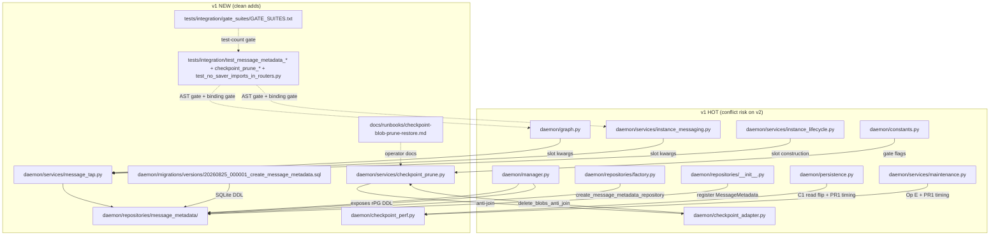

# Technical Analysis: Port Strategy for langgraph-checkpoint-perf v1 → v2

> **Rev 2.1 — adversarial-review fold (2026-09-04): 3 blockers + 12 warnings + suggestions applied; design foundation verified**
>
> **SUPERSEDED-BY annotation (architect §1.2 + risk R10):** the per-file conflict rules and the "gates require per-PR commit boundaries" rationale in this document are **SUPERSEDED** by `architecture-recommendation.md §1.1 + §1.2` for the v2 port. The TA's load-bearing claim "v1's per-PR discipline is load-bearing because the four gates assume per-PR commit boundaries" is FALSE on the merits (architect-verified — all four gates are HEAD-relative, not commit-history-relative). The TA's conflict map is materially overstated: `git diff 58260f35..2f80d45b` returns ZERO lines for `daemon/persistence.py`, `daemon/services/maintenance.py`, `daemon/checkpoint_adapter.py`, `daemon/repositories/__init__.py`, `daemon/repositories/factory.py` (triple-verified by Workers A+C + architect spot-check); PR1, PR3, PR4 land with ZERO conflict on primary hot files; all real conflict is PR2's with corrected anchors (`instance_messaging.py` shifted ~335-340 lines to `_maybe_compact_context` at `:1156` / entry-path tap ~`:3747-3765`; `graph.py` dual-return re-anchored to `:3731-3732` + reactive-compaction tap AFTER aupdate_state at `:3583-3585`; `manager.py` HIGH but RE-ANCHOR — `message_metadata_repo` property goes at `_db_connection_repository` block end, NOT near `:6642` which is v2's UNRELATED `message_metadata` kwarg from `dbf9ef44`; `instance_lifecycle.py` CONFIRMED HIGH ~515-line real churn, 4 MessageTapSlot constructions manual fix-up). Cherry-pick still wins on (a) `cherry-pick -x` mechanically-auditable v1 provenance, (b) per-PR `git revert`, (c) PR4 pair protected (mandatory PAIR `f89ccacc` + `7a7998fe`). **The TA body below remains the canonical reference for source-doc citations, file inventory, integration points, trade-off comparison table, growth assumptions, scaling characteristics, technical-debt items, migration numbering decision, drift-regression verification protocol, risk register rows 1-16, and open questions.** The conflict-resolution rules below (TA "Per-file resolution rules" §) remain the **supplemental per-file reference**; for the binding v2 corrected conflict map, follow architecture-recommendation.md §1.2 + the per-file annotations in plan-overview.md's "Files Touched" section.

Date: 2026-09-03
Author: planner[v2] via technical-analysis worker
Analysis depth: deep-dive
Status: Draft

## Question

How do we land v1's four checkpoint-performance PRs (PR1 instrumentation / PR2 side table + MessageTapSlot / PR3 read flip / PR4 checkpoint_blobs prune, total +12,079/-67 LOC across 54 files) onto the v2 branch at `feature/langgraph-checkpoint-perf-v2 @ 2f80d45b`, given that v2 has moved 521 files in 9 days since the v1 base (merge-base `58260f35`) with HIGH conflict on the same hot files v1 touches?

The deliverable is the HOW-TO-LAND (per-PR landing method, conflict-resolution rules per hot file, drift-regression verification, migration numbering decision, risk register). A separate plan-creation worker will translate this into the phase plan.

## Context Summary

v1 ships 4 PRs that fix the GET /messages O(history) deserialization pathology (measured 206 MB transfer / 42 s response from `saver.alist(limit=1000)` at `daemon/persistence.py:326`) plus unbounded orphan growth in the `checkpoint_blobs` table. v1's 15 commits +5 reviewer-doc commits live on `feature/langgraph-checkpoint-perf @ c37c870c` (READ-ONLY for this analysis). v1 ships: a `message_metadata(thread_id, message_id, created_at)` side table written by a `MessageTapSlot` non-load-bearing hook at exactly 4 sites (`user_message_entry`, `agent_node_return`, `compaction_aupdate_reactive`, `compaction_aupdate_messaging`); a C1 read flip that drops the alist walk entirely; a reference-aware `checkpoint_blobs` prune gated by a conservative env-flag ladder (default dry-run; BOTH `CHECKPOINT_BLOB_PRUNE_DRY_RUN=0` AND `CHECKPOINT_BLOB_PRUNE_DESTRUCTIVE=1` required for destructive execution; structural-unreachability plus a ZERO_REFS_FAIL_SAFE that outranks the destructive flag).

v1 review outcomes: PR1 + PR2 + PR3 all APPROVED (0 blockers); PR4 first-pitch was NEEDS_CHANGES (1 🔴 / 2 🟡 / 7 🟢 — the `aput` non-atomicity race with a false docstring claim), then APPROVED by commit `7a7998fe` (SERIALIZABLE wrap + retraction + race tests, 9/9 GREEN on real PG 14.22). The 5 PR-critical-fix reviewer-doc commits at the WIP tip `c37c870c` are post-approval documentation only — the CODE BOUNDARY for the port is `fc908945`.

v2 (`feature/langgraph-checkpoint-perf-v2 @ 2f80d45b`) is `latest` plus a merge of `fix/defer-gate-post-settle-window`. v2 has moved 521 files in 9 days; only 7 of v1's 54 changed files overlap. v2's churn theme is the mission/settled vocabulary + defer-gate post-settle window — semantic overlap with checkpoint internals is LOW, but the same hot files (`daemon/graph.py`, `daemon/services/instance_messaging.py`, `daemon/manager.py`, `daemon/services/instance_lifecycle.py`, `daemon/persistence.py`, `daemon/services/maintenance.py`, `daemon/checkpoint_adapter.py`, `daemon/repositories/__init__.py`, `daemon/repositories/factory.py`, `daemon/constants.py`) are exactly the ones v1 modified.

## Architecture

### Current Patterns (v2 = latest)

- **Checkpoint adapter pattern** — `daemon/checkpoint_adapter.py::CheckpointerAdapter` ABC with `SqliteCheckpointerAdapter` and `PostgresCheckpointerAdapter` implementations; v1 extends this with 4 new abstract methods (`find_all_thread_ns_pairs`, `count_refs_for_blob_thread`, `count_blobs_anti_join`, `delete_blobs_anti_join`).
- **Slot pattern** — `ThrottleSlot` / `LoopBreakerSlot` / `ContextSlot` / `InjectionSlot` / `ReportInjectionSlot` are constructed at factory time, threaded into `create_agent_node` as kwargs, captured by the agent-node closure so the SAME slot instance serves every turn. v1's `MessageTapSlot` follows the same pattern (T6 lesson: bare awaits BY DESIGN, internal try/except Exception is the sole containment layer; do NOT wrap call sites in `except BaseException` — that breaks Python 3.13 CancelledError propagation).
- **Migration dual-driver** — `daemon/migrations/versions/*.sql` (SQLite) + `daemon/manager.py::_ensure_postgres_columns()` (PG). Idempotent contract: table exists + index name byte-identical across all three (SQLModel `__table_args__`, SQLite migration, PG `_ensure_postgres_columns` block). Ordered+checksummed migrations; the runner is a NO-OP on PG (lines 446-448), so the equivalent DDL lives in `_ensure_postgres_columns`.
- **Facade-forwarding discipline (cardinal)** — `InstanceManager` is a manual-forwarding facade over `InstanceMessagingService`. ANY new keyword on a daemon service method requires: (a) grep the kwarg in `daemon/manager.py` to confirm facade forwarding; (b) a real-dispatch integration test asserting the intended exception type. AsyncMock + `inspect.getsource` substring assertions stay GREEN at this seam (they never see the underlying service's kwarg validation). Guards: `tests/unit/test_manager_enqueue_message_work_id_required.py`, `tests/integration/test_job_driven_enqueue_work_id_facade.py`.
- **Mission / settled canonical vocabulary (project convention, 2026-09-03 status)** — JOBS = transport (queued → processing → settled | failed; `settled` is the mirror-terminal word); MISSIONS = work (instance_id-keyed, canonical liveness, revive-all = new epoch; terminal is revivable by design). `done` alias = `completed` + `settled`. The plan/follow-up doc must NOT regress this — a separate vocabulary-grep guard belongs in the drift-regression suite.
- **Pause-First Then Quiesce convention** — features needing a quiescent instance use `pause_instance_cascade` → bounded quiescence → state mutation → resume. PR1's instrumentation and PR4's destructive arm would benefit from this discipline for future operational enablement; not required for shipping.

### Module Boundaries (delta from v1)

```
                          ┌──────────────────────────────────────────┐
                          │ daemon/services/message_tap.py           │  (NEW)
                          │ MessageTapSlot (slot pattern)            │
                          └─────────┬────────────────────┬───────────┘
                                    │ async to_thread    │
                          ┌─────────▼────────────┐       │
                          │ daemon/repositories/ │       │
                          │ message_metadata/    │       │
                          │ repository.py        │       │
                          │ (SYNC repo, D14)     │       │
                          └─────────┬────────────┘       │
                                    │ SQL INSERT/SELECT │
                          ┌─────────▼────────────┐  ┌────▼───────────────────┐
                          │ PG: ensemble_prod    │  │ daemon/checkpoint_     │
                          │      (DO NOT TOUCH)  │  │ perf.py (PR1, NEW)    │
                          │ SQLite: .sql         │  │ [/CheckpointPerf]     │
                          │      migration       │  │ [/Messages] structured│
                          └──────────────────────┘  │ logs (gated)          │
                                                   └────────────────────────┘
tap sites (4):
  daemon/services/instance_messaging.py:3437 (user_message_entry)    ─┐
  daemon/graph.py (agent_node_return)                                  ├─ bare awaits, no
  daemon/graph.py (compaction_aupdate_reactive)                        │  try/except at sites
  daemon/services/instance_messaging.py (compaction_aupdate_messaging)─┘

PR3 read flip:                                                    
  daemon/persistence.py::get_instance_messages (alist → aget-only)

PR4 prune:                                                          
  daemon/services/maintenance.py (CheckpointCleanupJob Op E)        
       │                                                             
       ├─ daemon/services/checkpoint_prune.py (orchestration, NEW)   
       │     │                                                       
       │     └─ daemon/checkpoint_adapter.py                        
       │           count_blobs_anti_join (dry-run SELECT)          
       │           delete_blobs_anti_join (destructive DELETE;       
       │               SERIALIZABLE wrap + 40001 retry)             
       │           _BLOB_ANTI_JOIN_PREDICATE (shared NOT EXISTS)    
       └─ docs/runbooks/checkpoint-blob-prune-restore.md (NEW)     
```

The 4 tap sites are constructed against a SHARED `message_metadata_repo` singleton (decisions.md D14: SYNC engine, `asyncio.to_thread` bridge). Two of the 4 slots are constructed in `instance_lifecycle.py` (spawn + restore paths) for the agent_node_return + compaction_aupdate_reactive sites; the other two are constructed inline at the call sites in `instance_messaging.py` (because `_build_graph_input` is messaging-side, not lifecycle-side).

### Architecture Diagram (deep-dive)



### Tap-site construction map (PR2 wiring — both lifecycle paths must thread both slots)

- Spawn path: `daemon/services/instance_lifecycle.py:1276-1331` — `create_instance` calls `build_instance_graph(...)` with `message_tap_slot=MessageTapSlot(repo, SOURCE_AGENT_NODE_RETURN)` and `compaction_tap_slot=MessageTapSlot(repo, SOURCE_COMPACTION_REACTIVE)`.
- Restore path: `daemon/services/instance_lifecycle.py:3243-3309` — `_restore_instance` calls `build_instance_graph(...)` with the same kwargs.
- Messaging-side (inline construction): `daemon/services/instance_messaging.py:3437` constructs `MessageTapSlot(repo, SOURCE_USER_MESSAGE_ENTRY)` per call (the `graph_input["messages"]` is not available at lifecycle-wiring time).
- Messaging-side (inline construction): `daemon/services/instance_messaging.py:851` constructs `MessageTapSlot(repo, SOURCE_COMPACTION_MESSAGING)` per call (same reason).

### Test-count gate (PR1 closure mechanism)

`tests/integration/gate_suites/test_gate_suite_pause_resume.py` walks `GATE_SUITES.txt` (37 rows on v1) and runs each suite at HEAD. The gate SUITE COUNTS must be regenerated fresh on v2 — copying v1's manifest verbatim will either understate (test files were renamed/moved in the 9-day drift) or overstate (some test files were added/deleted since v1's collection). The regen method is documented in the file's own header: per-file `uv run pytest <file> -o addopts= --collect-only -q -p no:cacheprovider --no-header` in a clean worktree pinned at HEAD, cross-checked with an aggregate collect-only over all 37 paths. The PR2/PR3/PR4 closures each ship a regen commit (`c42a8bf5`, `80c84219`, `e3c69b48`, `fc908945`) that just bumps the test counts and re-stamps the header — these commits are STALE on v2 because (a) latest's churn added/removed some files in the manifest table, (b) v1's tests themselves need re-collection under v2.

## Integration Points

| # | Integration | Type | Contract | Auth | Failure Mode | File:Line |
|---|-------------|------|----------|------|--------------|-----------|
| 1 | `MessageTapSlot` → `MessageMetadataRepository` | intra-process sync via `asyncio.to_thread` | `upsert_batch(items)` + `get_for_thread(thread_id)` | engine-singleton | `try/except Exception` swallows; non-load-bearing | `daemon/services/message_tap.py:194-198` |
| 2 | `daemon/manager.py::_ensure_postgres_columns` → `message_metadata` table | PG bootstrap DDL | idempotent `CREATE TABLE IF NOT EXISTS` + `CREATE INDEX IF NOT EXISTS ix_message_metadata_thread` | admin | migration runner is NO-OP on PG; bootstrap happens at manager init | `daemon/manager.py:5187-5217` (v1) |
| 3 | SQLite migration runner → `message_metadata` table | SQLite DDL via `MigrationRunner` | ordered + checksummed `.sql` files in `daemon/migrations/versions/` | migration engine | migration failure aborts startup | `daemon/migrations/versions/20260825_000001_create_message_metadata.sql` |
| 4 | 4 `tap_node_return` call sites → `MessageTapSlot.tap_node_return` | async, awaiting `asyncio.to_thread` | first-arg = list[BaseMessage], second-arg = instance_id | n/a (intra-process) | bare await; internal `try/except` (Critical 4) | `daemon/graph.py:3293, :3471`; `daemon/services/instance_messaging.py:851, :3437` |
| 5 | `get_instance_messages` → `message_metadata_repo.get_for_thread` | sync via `asyncio.to_thread` | returns `{message_id: (created_at, seq)}` | n/a | `except Exception → logger.warning → {} → state.ts fallback` | `daemon/persistence.py:380-397` (v1) |
| 6 | `MaintenanceService._prune_unreferenced_blobs` → adapter `count_blobs_anti_join` / `delete_blobs_anti_join` | PG async | shared `_BLOB_ANTI_JOIN_PREDICATE` verbatim between SELECT and DELETE arms | n/a | per-pair exception logged + skipped; SQLite no-op with WARNING | `daemon/services/maintenance.py:453-462` (v1); `daemon/services/checkpoint_prune.py`; `daemon/checkpoint_adapter.py:294-348` (v1) |
| 7 | Flag ladder: `CHECKPOINT_BLOB_PRUNE_DRY_RUN=0` AND `CHECKPOINT_BLOB_PRUNE_DESTRUCTIVE=1` | env at process start | both required simultaneously for destructive | n/a | structural unreachable when flags off (`if not destructive: continue`) + AST-gated | `daemon/services/checkpoint_prune.py::blob_prune_destructive_enabled` (v1) |
| 8 | `_status_write_guard` / facade-forwarding | cardinal | any kwarg added on daemon service method must be grep-verified in `daemon/manager.py` + real-dispatch integration test | n/a | AsyncMock-blind; `_ManagerStub` fixture infra broken (pack-deselected) | `daemon/manager.py:6463-6545`; `tests/unit/test_manager_enqueue_message_work_id_required.py`; `tests/integration/test_job_driven_enqueue_work_id_facade.py` |

### Integration Details

**Integration 1: MessageTapSlot → MessageMetadataRepository**
- **Protocol:** in-process SYNC repository wrapped by `asyncio.to_thread` from async call sites.
- **Data format:** `Items = list[tuple[str, str, int | None]]` (message_id, created_at, seq).
- **Failure mode:** `try/except Exception` in `MessageTapSlot.tap_node_return` swallows; the upsert is non-load-bearing (PR2 review Critical 4). The repository itself uses `engine.begin()` per call; transaction failure → exception → swallowed.
- **Observability:** gated `[CheckpointPerf] op=tap_* thread=… upserted=N` log lines, controlled by `CHECKPOINT_PERF_LOGS=0` env.
- **Known issues:** `message_tap.py:54-80` docstring has a stale FALSELY claim that call sites also wrap in try/except — must be corrected at port time (PR2 review 🟡 finding #1). v1 ships this fixed in PR3 review folds (`3c9478ba` adds the "sole-containment truth + over-record note" fold).

**Integration 6: checkpoint_blobs prune (PR4)**
- **Protocol:** PG async (SQLite stub returns `(0, 0)` with WARNING — `checkpoint_blobs` table does not exist in SQLite saver).
- **Data format:** PG `JSONB` channel_versions extraction; blob row = `(thread_id, checkpoint_ns, channel, version, type, blob)`.
- **Authentication:** n/a (in-process).
- **Error handling:** per-pair exception logged + skipped; never raises into the maintenance loop. SERIALIZABLE wrap with `40001/40P01` retry (`CHECKPOINT_BLOB_PRUNE_DELETE_RETRIES=3`, 50ms·2ⁿ backoff); exhaustion returns `(0, 0)` and skips without raising.
- **Observability:** gated `[CheckpointPerf] op=blob_prune thread=… dry_run=1 deleted=N bytes=B refs_seen=M` log lines.
- **Known issues (carry forward from PR4 review):** **the `aput` blob+checkpoint commits are NON-atomic on the default pipeline path** (psycopg autocommit=True + pipeline, langgraph-checkpoint-postgres aio.py:82, 280-304) — the µs-scale gap is real, the SERIALIZABLE wrap converts SSI-detectable conflict classes into abort-and-retry but does NOT eliminate the single-READ-COMMITTED-racer window. Bounded by §5 idle-gate precondition + §6 backup as recovery of record. **Never claim aput atomicity in any port docs.** (FACT from `tests/integration/checkpoint_prune_real_saver.py:28-30, 524-531` v1 docstring retraction.)

**Integration 8: Facade-forwarding discipline (cardinal)**
- v1 does not add any kwarg to a daemon service method that would surface the seam — the `MessageTapSlot` slots are wired via `create_agent_node` kwargs (in `daemon/graph.py`), which is NOT a service method but a graph-node factory. The facade-forwarding guards (`tests/unit/test_manager_enqueue_message_work_id_required.py`, `tests/integration/test_job_driven_enqueue_work_id_facade.py`) do NOT need new tests; the existing guards remain the regression boundary.
- However, `daemon/manager.py` adds a new property `message_metadata_repo` + a new constructor field — neither is a service kwarg, both are properties read directly. Facade-forwarding does NOT apply.
- The risk is that v2's defer-gate work may have ADDED service-method kwargs between 58260f35 and 2f80d45b that overlap v1's expected manager wiring. Verification: grep `daemon/manager.py` for `work_id_required`, `enqueue_message`, `*kwargs` against the merge-base — any kwarg-touch on `enqueue_message` already has facade-forwarding per Fix A (`b07a91f7`, `4077a541`, `dc4e0c89`, `e6c810a7`). v1's port does NOT add new kwargs here, so no NEW facade-forwarding tests are required, but the existing guards MUST stay green.

## Trade-offs

### Alternatives Considered

1. **Option A: Cherry-pick per-PR (clean-add + hot-file)** — port each v1 PR as a discrete commit on v2. Per-PR: apply v1's commit → resolve conflicts in v1's hot-file hunks only → re-run that PR's tests → land. v1's gate-regen commits are NOT ported; instead a fresh regen commit is generated for v2.
2. **Option B: Manual re-apply from diffs** — for each PR, `git diff v1-base..v1-PR` → manually re-apply the hunks into a new commit on v2. Same per-PR discipline; the difference is whether the patch is `git cherry-pick -x` (commit identity preserved) or a synthetic commit (clean tree, no cherry-pick metadata).
3. **Option C: Single squashed commit** — collapse the 11 code commits into one big "langgraph-checkpoint-perf" commit on v2. Faster to merge, but loses per-PR review traceability and forces reviewers to re-validate the entire 12k-LOC surface in one pass.

### Comparison

| Criterion | Option A (cherry-pick) | Option B (manual re-apply) | Option C (single squashed) | Winner |
|-----------|------------------------|------------------------------|-------------------------------|---------|
| Per-PR reviewability | HIGH (cherry-pick preserves commit boundaries; reviewer can replay the v1 review on the v2 cherry-pick) | HIGH (same boundaries; cleaner trees without v1 merge noise) | LOW (one commit, one review) | A/B tie |
| Conflict-resolution transparency | HIGH (cherry-pick conflict hunks = the exact v1/v2 delta for that PR) | MEDIUM (Hunks are re-applied manually — conflict pattern is harder to audit) | LOW (squashed merge hides all conflicts) | A |
| Reviewer tooling (gate suites, AST gate) | Works as-is per-PR | Works as-is per-PR | Hard (gate runs against all PRs at once; failure attribution ambiguous) | A/B tie |
| Commit-message truth | cherry-pick `-x` annotation shows v1 provenance | manual authorship = clean authorship | squashed authorship = the squasher | A (objective provenance) |
| Test-count gate regen cost | per-PR regen (4 regen commits on v2) | per-PR regen (4 regen commits on v2) | one regen (1 commit) | C (but only superficially; option C hides failure) |
| Risk of accidentally re-porting v1-only patches | LOW (cherry-pick excludes pre-existing-tree noise) | MEDIUM (manual re-apply can drop hunks or reorder) | N/A | A |
| Cycle time | per-PR ~1-2 hours × 4 PRs + per-PR conflict resolution | similar | 4-6 hours (one shot) | A/B (with overlap); C for raw throughput but loses review value |

### Recommendation

**Pick: cherry-pick per-PR (Option A), with manual re-apply as fallback for hot-file PRs where cherry-pick conflict resolution is structurally hard.**

> **Architect §1.1 SUPERSEDED-BY annotation:** the "Reasoning" paragraph below is PARTLY WRONG. The TA's claim "v1's per-PR discipline is load-bearing — the gate manifests, the AST placement gate, the binding gate, and the destructive-flag structural-unreachability AST gate all assume per-PR commit boundaries" is **FALSE on the merits** (architect-verified). All four gates are **HEAD-relative** — they re-collect / AST-walk / run at HEAD, not per-PR commit-boundary. Evidence: GATE_SUITES.txt regen method is in the file header (`fc908945:tests/integration/gate_suites/GATE_SUITES.txt:6-15`); AST placement gate is a HEAD-relative AST walk (`fc908945:tests/integration/test_message_metadata_hook_placement.py:1-50`); binding gate is a runtime test (`fc908945:tests/integration/checkpoint_prune_real_saver.py`); structural-unreachability AST gate is an 8-combo flag matrix + AST at HEAD (`tests/unit/services/test_maintenance_prune_direct_anti_join.py`). Cherry-pick still wins on (a) `cherry-pick -x` mechanically-auditable v1 provenance (conflict hunks ARE regression evidence), (b) per-PR `git revert`, (c) PR4 pair protected (mandatory PAIR `f89ccacc` + `7a7998fe`). The TA's comparison table column entries (Option A's "Best" maintainability, Option C's "Poor" risk) still hold on those grounds; the false claim is the "load-bearing" assertion about per-PR commit boundaries being required by the gates.

**Reasoning (architect-amended, see SUPERSEDED-BY note above):** cherry-pick preserves commit identity AND makes the conflict hunks identical to the v1/v2 delta per PR, so the conflict-resolution audit IS the regression evidence. Manual re-apply is the fallback only when `git cherry-pick -x --3way` produces a patch that git cannot resolve cleanly (rare; only when v2's churn on the same hunk is so entangled that the 3-way merge fails). Option C is rejected outright: a 12k-LOC squashed commit destroys reviewer ability to replay the v1 review and runs all gates simultaneously, making attribution of any regression a forensic exercise.

**Per-PR landing method (recommended):**

| PR | v1 commit | Method | Reason |
|----|-----------|--------|--------|
| PR1 | `0db1a768` | **Manual re-apply (Option B)** — v1 only modifies `daemon/persistence.py` (PR1's `time_saver_op` + bracket timing) and `daemon/services/maintenance.py` (PR1's `log_prune` entry/exit timing). v2 has rewritten both files' middle sections since `58260f35` (persistence.py has the message-display-latency + identity-field fixes; maintenance.py has the defer-gate widen predicates). The hunks are too small and too interwoven with v2's adjacent churn to cherry-pick cleanly. Re-apply by hand: copy v1's timing bracket + `time.perf_counter()` + `log_prune` call from v1's diff, place at v2's current anchors, verify `daemon/checkpoint_perf.py` (NEW clean add) is created as-is from v1. Gate regen fresh at v2. | Pure additive observability; zero behavior change to GET /messages; minimal conflict surface |
| PR2 | `fa31a520` (+ folds `3c9478ba`) | **Cherry-pick with manual fix-up (Option A → manual re-apply fallback if 3-way fails)** — the 4 new files (`message_tap.py`, `message_metadata/{__init__,models,repository}.py`, migration) are clean adds. The hot-file hunks are: `daemon/graph.py` (2 slot kwargs + F2 single-return hoist), `daemon/services/instance_messaging.py` (2 tap calls + import), `daemon/services/instance_lifecycle.py` (4 MessageTapSlot construction sites + import), `daemon/manager.py` (PG CREATE TABLE + property + import), `daemon/repositories/__init__.py` (imports + `__all__`), `daemon/repositories/factory.py` (factory function), `daemon/checkpoint_perf.py` (clean add). `git cherry-pick -x --3way fa31a520 3c9478ba` should succeed on the clean-add files; on the hot files, expect 3-way merge conflict where v2's churn overlaps. Conflict resolution: see §Conflict Resolution Guidance. Gate regen fresh at v2. | The 4-tap-site architecture is the load-bearing design; the hot-file hunks ARE the conflict surface |
| PR3 | `5d928d51` (pre-flip test) + `dbfbf812` (read flip) + `c5dae6a5` (review folds) | **Cherry-pick with manual fix-up** — `5d928d51` is a clean-add test file; `dbfbf812` modifies `daemon/persistence.py::get_instance_messages` (deletes the alist walk) and adds 3 test files; `c5dae6a5` is review-fold only. Cherry-pick `5d928d51` first, then `dbfbf812` (the read flip is a 60-line block change to `daemon/persistence.py`), then `c5dae6a5`. The `daemon/persistence.py` hunk is high-conflict because v2's defer-gate work is NOT in this file but adjacent commits may have touched docstrings/imports. Conflict resolution: see §Conflict Resolution Guidance. Gate regen fresh at v2. | The C1 read flip is the load-bearing correctness change (alist → aget-only); the test files (frozen fixture, liveness) are clean adds |
| PR4 | `f89ccacc` (PR4 feat) + `7a7998fe` (PR4 critical fix) | **Cherry-pick `f89ccacc` first, then `7a7998fe`** — both modify `daemon/checkpoint_adapter.py` (add `_BLOB_ANTI_JOIN_PREDICATE`, 4 abstract methods, 4 concrete impls), `daemon/services/checkpoint_prune.py` (clean add), `daemon/constants.py` (add 4 constants), `daemon/services/maintenance.py` (add Operation E). The 7a7998fe commit additionally modifies the destructive arm with SERIALIZABLE wrap + retraction. Both should be cherry-picked as a pair because the PR4 review's NEEDS_CHANGES verdict requires `7a7998fe` to ship with `f89ccacc`; reverting to the un-fixed `f89ccacc` would re-introduce the 🔴 data-integrity finding (false atomicity claim + undisclosed µs race). The PR4 docs (`docs/runbooks/checkpoint-blob-prune-restore.md`) are clean adds. Gate regen fresh at v2 (binding gate 7→9 tests). | Critical fix is mandatory per PR4 review verdict; cherry-pick pair preserves the data-safety posture |

**Gate-regen decision: regenerate fresh on v2 for every PR.** v1 ships regen commits (`603c9eb8`, `c42a8bf5`, `80c84219`, `e3c69b48`, `fc908945`) whose test counts are STALE on v2 because (a) latest's 9-day churn added/removed tests in the 33 manifest-table rows, (b) v1's own added test files need re-collection under v2's pytest config (addopts may differ), (c) the header's enumeration record ("37/37 files collect — 411 tests total") is a v1-specific number that does not apply to v2. The 4 regen commits on v2 will be the FIRST commits touching `tests/integration/gate_suites/GATE_SUITES.txt` after each PR — this is by design and matches v1's per-PR regen cadence.

**Commit-message conventions on v2:** follow the v1 prefix grammar (`feat(perf): PR2 — C2 message_metadata side table + MessageTapSlot`) — v2's recent commits use the same grammar. Each PR-closure commit (the regen) should explicitly call out the v1 commit being closed and the v2 regen method: `chore(gate): PR2 closure on v2 — regenerate manifest at v2-<sha> (N tests collected)`.

**One-PR-per-commit-boundary discipline:** every PR is its own commit set on v2 (feature + folds + regen), no squashing across PRs. Reviewers replay the v1 reviewer's verdict on the v2 cherry-pick; any v2-specific conflict in the hunk IS the v2 delta and gets a small comment in the v2 commit message ("v2 conflict: line X — v2 has added Y since 58260f35; manual re-apply preserves Y, gates v1's Z").

**Assumptions:**
- `git cherry-pick -x --3way` succeeds on the clean-add files in every PR (it always does for new files).
- v2's hot-file hunks are localized (small additive regions) — the 3-way merge can resolve them.
- v1's reviewer-doc commits (`.agents/reviewer/memories/2026-08-26-pr*`) at the WIP tip `c37c870c` are NOT ported; they live in `.agents/` and are v1-history, not v2-history. Each v2 PR can link to the v1 reviewer doc by SHA for reviewability (the v1 reviewer's verdict carries forward to the v2 cherry-pick unless v2's conflict resolution breaks a finding).
- v1's PR1 WIP `_validate_inputs` review notes at `c37c870c` are NOT ported either.

**Reversibility:** High. Each PR is a discrete commit on v2; rollback = `git revert <commit>`. The gate-regen commits are the only soft-reversal surface because they touch the manifest file only — revert the regen to revert test counts, but the underlying code change stays. The cleanest reverse is `git revert <feature-commit> <fold-commit> <regen-commit>` per PR.

## Scalability

### Growth Assumptions

- **Checkpoint history depth:** unbounded in principle (LangGraph persists every node-boundary checkpoint); the read-path pathology scales O(N) where N = checkpoint history depth. A 1000-checkpoint thread = 1000-message alist walk on every GET /messages.
- **Blob table size:** PG `checkpoint_blobs` table grows unbounded as non-primitive channel values are written (LangGraph stores every JSON-serialized blob); the v1 PR4 fix bounds it via the anti-join DELETE.
- **Message rate per instance:** each tap site fires on every turn-end (4 sites fire concurrently per turn in the active-turn case). The `message_metadata` table grows ~linearly with `(turns × messages-per-turn)` per instance.
- **Expected measurement after port:** GET /messages latency = O(page_size), not O(checkpoint_history). v1's hermetic micro-bench: 63.9→1.9 ms (150 msgs, 33×), 510.0→4.5 ms (400 msgs, 114×). v2 prod expected: same order-of-magnitude win.

### Current Bottlenecks

| # | Bottleneck | Threshold | File:Line | Impact |
|---|------------|-----------|-----------|--------|
| 1 | `saver.alist(config, limit=1000)` per GET /messages | checkpoint history > ~100 (rough); at 1000, 206 MB / 42 s measured | `daemon/persistence.py:326` (v2 latest) | every `/messages` poll is O(history); FE polling amplifies |
| 2 | Unbounded `checkpoint_blobs` growth on PG | never (no current prune); storage-only for now | (none on v2 — vacuum is implicit) | storage cost grows linearly with checkpoint history |
| 3 | `langgraph-checkpoint-postgres aio.py aput` non-atomic blob+checkpoint commits | µs-scale gap, single-process default pipeline path | upstream library (aio.py:82, 280-304) | PR4 review 🔴: data-integrity window when destructive arm enabled; bounded by SERIALIZABLE wrap (SSI-detectable conflicts only) |

### Scaling Characteristics

- **Vertical vs horizontal:** v1's read-flip is a per-thread optimization — vertical scaling win (faster per-request) but not horizontal. The tap-site writes are SYNC and short-lived; they don't add serialization.
- **Stateless vs stateful:** the `MessageMetadataRepository` is a SYNC engine singleton; it inherits the shared engine's connection pool (per-thread). Reads via `asyncio.to_thread` are non-blocking but contend for the pool.
- **Sync vs async:** all writes (tap, prune) are sync-via-`to_thread`; reads are sync-via-`to_thread`. The async surface is `get_instance_messages` and `MaintenanceService._prune_unreferenced_blobs` (both PG-async for the actual SQL).
- **Scaling cliffs:**
  - At checkpoint history > 1000, the alist `limit=1000` becomes a hard cap — messages beyond the most recent 1000 checkpoints lose their `created_at` timestamp. v1 PR3 eliminates the cap entirely (no alist).
  - At `message_metadata` table size > ~10 M rows, the per-thread `get_for_thread` index lookup still O(log N); tap writes amortize fine.
  - At `checkpoint_blobs` size > ~1 GB on a single thread, the destructive prune becomes I/O-bound; current 15-min cadence is OK.

## Technical Debt

### Items Affecting This Port

| # | Debt Item | Impact on Recommendation | Severity | File:Line |
|---|-----------|--------------------------|----------|-----------|
| 1 | v1's `message_tap.py:54-80` docstring FALSELY claims call sites also wrap in try/except | Must be corrected at port time (the PR2 review 🟡 finding #1 was already fixed in `3c9478ba`, which IS in the ported commits) | Low (carried forward in the ported folds) | `daemon/services/message_tap.py:54-80` (v1) |
| 2 | v1's `persistence.py:380-397` getattr-guard short-circuit is SILENT when `message_metadata_repo is None` | PR3 review 🟡 finding #2 — fix = one `logger.warning` + caplog assert. v1 ships the fix in `c5dae6a5` (review folds), which IS in the ported commits | Low (carried forward) | `daemon/persistence.py:380-397` (v1) |
| 3 | aput blob+checkpoint commits are NON-atomic on default pipeline path | PR4 review 🔴 — already mitigated by SERIALIZABLE wrap (7a7998fe). MUST keep the docstring retraction in `daemon/checkpoint_adapter.py` and the runbook §7 disclosure — never rephrase as "atomic" | High (data-integrity; carries forward) | `daemon/checkpoint_adapter.py:294-348` (v1); `docs/runbooks/checkpoint-blob-prune-restore.md` |
| 4 | v1's `message_metadata_repo` is SYNC by design (decisions.md D14) | The SYNC engine is the project-wide convention; v1 follows it correctly. No debt. | N/A | `daemon/repositories/factory.py:10` |
| 5 | v1's PR1 WIP `_validate_inputs` reviewer notes at `c37c870c` | NOT ported; informational only | N/A | `c37c870c:.agents/reviewer/memories/` |
| 6 | v2's `message_metadata` reference at `daemon/manager.py:6642` and `daemon/services/instance_messaging.py:1667, :2485` (different feature: send_message context parameter) | Naming collision risk: v1's `message_metadata` repo is a different `message_metadata` from v2's `task_context` propagation. The port MUST distinguish these clearly in code + docs to avoid confusion. | Medium (naming collision; resolves naturally because v1 uses `MessageMetadataRepository` class name and v2's reference is a kwarg on `enqueue_message`) | `daemon/manager.py:6642`; `daemon/services/instance_messaging.py:1667, :2485` |
| 7 | v2's existing 5 pre-existing `TestAccessMemoryArchive` failures on `tests/unit/tools/test_archive_lifecycle.py` | Not affected by the port (orthogonal code path); pack-deselected in `tools_suite_unit_test.sh`. NOT a port blocker. | Low (quarantined pre-existing) | `tests/unit/tools/test_archive_lifecycle.py:23` |
| 8 | v1's `daemon/repositories/message_metadata/repository.py` is SYNC; v2's wider codebase has SYNC-async mix | The SYNC repo is the documented decision (D14). The `asyncio.to_thread` bridge matches the project-wide convention (e.g., `daemon/services/context_messages.py::assemble_context_messages`, `instance_messaging.py:1026`). No debt. | N/A | `daemon/services/message_tap.py:194-198` |
| 9 | v1's `_ManagerStub` fixture is broken in some pack (pack-deselected per the active quarantine list) | Not affected by the port (the broken fixture is in `tests/test_injection_slot.py`, not in v1's added tests); the v1 added tests use real `_ManagerStub` correctly | Low (orthogonal pre-existing) | `.agents/tester/QUARANTINE.md` (TestCleanupInstanceState family) |
| 10 | v1's `daemon/checkpoint_perf.py` defaults to `CHECKPOINT_PERF_LOGS=1` (logs on); PR1 ships with logs-on for observability | Port preserves the default; future ops can flip via env. No debt. | N/A | `daemon/checkpoint_perf.py` |

### Items NOT Affecting This Port

- v2's mission/settled vocabulary work (`c482f954`) — orthogonal to checkpoint internals; port touches vocabulary NEUTRAL paths only.
- v2's defer-gate post-settle window (`92909ea9`, `853abb1b`) — orthogonal; surface is `daemon/services/instance_lifecycle.py` and `daemon/services/maintenance.py` but the `MaintenanceService` Operation E addition is structurally compatible.
- v2's WC-wake arc (`b07a91f7`, `dbf9ef44`, `4a6e22b5`, etc.) — orthogonal; touches message-display-latency, not checkpoint read path.
- v2's `feature/mission-class` program — orthogonal.
- v2's `fix/defer-gate-post-settle-window` — touches `daemon/services/job_queue_service.py` (idle-gate predicates), orthogonal to checkpoint operations.
- v2's quarantine list `M2-gate base-verified pre-existing additions` (12 nodes) — orthogonal pre-existing failures.

### Recommended Paydown

In priority order, BEFORE port landing:
1. **(none — port is self-contained)** No port-blocking paydown exists. The PR4 review's needs-changes are already fixed in the ported commit `7a7998fe`; the PR2 + PR3 🟡 findings are already folded into the ported commits (`3c9478ba`, `c5dae6a5`).

After port landing (operational enablement, NOT port blockers):
1. (deferred) Pre-enable checklist per runbook `checkpoint-blob-prune-restore.md` §3 before flipping `CHECKPOINT_BLOB_PRUNE_DESTRUCTIVE=1` in any environment.
2. (deferred) Live PG latency verification (v1 PR5 gate window) — produces the production measurement that v1's micro-bench deferred.
3. (deferred) Migration verification on PG prod (the migration's id was never applied anywhere — no checksum-history concern, but a dry-run on a PG clone is cheap and standard).

## Migration Numbering Decision

**Decision: KEEP `20260825_000001_create_message_metadata.sql` (NO renumber).**

**Reasoning:**
- v2's latest migration is `20260819_000001_report_injections_deferred_marker.sql` (verified: `ls daemon/migrations/versions/ | grep -E "20260" | sort | tail`).
- v1's `20260825_000001_create_message_metadata.sql` sorts cleanly after it (timestamp-monotonic: 0819 → 0825).
- Total migration count on v2: 68. Adding 1 → 69. Sorted order preserved.
- The migration has NEVER been applied anywhere (v1's branch was a feat branch; no production roll-out). Therefore NO checksum-history concern — no existing checksum entry needs updating.
- Migration runner is ordered + checksummed (`daemon/migrations/runner.py`); the file just needs to sort after `20260819_000001`. It does.

**Dual-driver + PG-only implications:**
- SQLite driver: migration runs via `MigrationRunner` — adds `message_metadata` table + `ix_message_metadata_thread` index.
- PG driver: migration is NO-OP (runner lines 446-448); equivalent DDL lives in `daemon/manager.py::_ensure_postgres_columns()` (the v1 patch adds the `CREATE TABLE IF NOT EXISTS message_metadata` + `CREATE INDEX IF NOT EXISTS ix_message_metadata_thread` block at lines 5187-5217 on v1's base; the port re-applies the same block on v2's current `_ensure_postgres_columns`).
- PG-only `checkpoint_blobs` table: NOT affected by this migration. The `checkpoint_blobs` table is created by the upstream `langgraph-checkpoint-postgres` library, not by our migration. v1 PR4 does NOT add a migration for it.

**No renumbering is needed.** The numbering is monotonic, the file is clean-add, no existing checksum conflicts.

## Conflict Resolution Guidance

> **Architect §1.2 SUPERSEDED-BY annotation:** The per-file conflict rules in this section remain the supplemental reference for v2 porting, but the binding corrected conflict map is in `architecture-recommendation.md §1.2`. **Key corrections to apply when using this section:** (1) `daemon/persistence.py` — TA says HIGH conflict; architect-corrected to ZERO-CONFLICT (byte-identical, `git diff 58260f35..2f80d45b` returns ZERO lines). (2) `daemon/services/maintenance.py` — TA says MED conflict; architect-corrected to ZERO-CONFLICT (Operation E anchor `:448→:450` intact; defer-gate fix landed in `job_queue_service.py`, NOT maintenance.py). (3) `daemon/checkpoint_adapter.py` — TA says LOW conflict; architect-confirms ZERO-CONFLICT. (4) `daemon/services/instance_messaging.py` — TA says HIGH at `:821`/`:3425`; architect-corrected targets shifted ~335-340 lines (`_maybe_compact_context` now `:1156`; entry-path tap now ~`:3747-3765`). (5) `daemon/graph.py` — TA says F2-hoist at `:3386-3397`; architect-corrected dual-return now at `:3731-3732` + reactive-compaction tap AFTER aupdate_state at `:3583-3585`. (6) `daemon/manager.py` — TA says HIGH "block-last" at `:6642`; architect HIGH but RE-ANCHOR — `message_metadata_repo` property goes at `_db_connection_repository` property block end (NOT near `:6642` which is v2's UNRELATED `message_metadata` kwarg from `dbf9ef44`; grep `message_metadata_repo` absence first as confirmation). (7) `daemon/services/instance_lifecycle.py` — TA says MED-HIGH; architect-confirms HIGH with ~515-line real churn since `58260f35`.

### Per-file resolution rules

**`daemon/graph.py`** (HIGH conflict; v2's WC-wake arc + compaction-output-structure land here)
- v1's PR2 adds: (1) 2 new kwargs on `create_agent_node` (`message_tap_slot`, `compaction_tap_slot`); (2) `compaction_tap_slot.tap_node_return` call at the F2 single-return site (the post-`aupdate_state` block at the reactive compaction); (4) F2 single-return hoist (refactors the dual-return at `:3386-3397` into a single `outgoing` variable).
- v2's churn: `dd95caef` (compaction provenance + doc ids F1+F2), `e720e3ce` (compaction review criticals), `a80767b9` (compaction single-document structure), `b8c7a611` (tidier mechanical pass), `7822aebd` (tool-pairing guard on reactive compaction retry), `84fd8018` (synthesize tool-result placeholders before mid-turn HumanMessage injection), `4db97e3c` (streaming activation rework), `70092ad` (streaming decode NameError fix), `89b20119` (tool-path injection ids), `db5ef8f7` (immediate user_message SSE echo), `51f5dc54` (W1 injection provenance thread).
- **Resolution rule:** port v1's 2 kwargs + 1 F2 hoist + 1 tap call at the agent_node_return site. Resolve conflicts by:
  - **Agent_node_return site (`:3386-3397`):** v1's F2 hoist preserves v2's `4db97e3c` streaming + `84fd8018` tool-result placeholder synthesis (both happen on the response list BEFORE the tap). The hoist changes variable names; the tap is appended to `outgoing` AFTER all v2 adjustments. Replay v2's commit-level intent: every v2 commit on this hunk should still apply its effect to the `outgoing` list before the tap.
  - **Compaction_aupdate_reactive site (`:3248-3250` area):** v1's tap call is appended AFTER v2's `dd95caef` provenance stamping + `a80767b9` single-document sentinel recipe. The tap reads `result.replacement_messages` (the post-aup messages); v2's changes do not modify `result.replacement_messages`.
  - **AST gate verifier:** `tests/integration/test_message_metadata_hook_placement.py` (port from v1) MUST be re-run after the graph.py patch; the 4-site/4-label/no-ToolNode contract must hold against the post-port `daemon/graph.py`.

**`daemon/services/instance_messaging.py`** (HIGH conflict; v2's WC-wake arc + defer-gate work)
- v1's PR2 adds: (1) import block (`from .message_tap import MessageTapSlot, SOURCE_USER_MESSAGE_ENTRY, SOURCE_COMPACTION_MESSAGING`); (2) tap call at `compaction_aupdate_messaging` site (around `:821`); (3) tap call at `user_message_entry` site (around `:3425`).
- v2's churn: `b07a91f7` (fail-closed omission + vocabulary), `dd95caef` (compaction provenance), `a80767b9` (compaction single-doc structure), `eb69d98d` (watchdog hang via waking path), `f11da419` (send-gate ignores terminal-instance carriers), `46cbdb5f` (ask_questions answer not reaching paused instance), `dbf9ef44` (send_message context parameter — v2's own `message_metadata` kwarg, NOT v1's side table).
- **Resolution rule:** port v1's import + 2 tap calls. Resolve conflicts by:
  - **Import block:** append v1's imports AFTER v2's `from .messaging_types import AsyncMessageResult`. v2's `dbf9ef44` may have added other `message_*` imports; do not collide.
  - **`compaction_aupdate_messaging` site:** v1's tap is appended AFTER v2's `a80767b9` single-document sentinel recipe. The tap reads `result.replacement_messages`.
  - **`user_message_entry` site (F1 fix):** v1's tap is inserted in `_build_graph_input` (around `:3425` v1 line numbers, current v2 line number is shifted). v2's `dbf9ef44` (send_message context parameter) does NOT modify `_build_graph_input` (it's a kwarg on `enqueue_message`); no conflict. v2's `b07a91f7` vocabulary standardization may have renamed surrounding identifiers; preserve v2's renames.
  - **v2's `message_metadata` kwarg (`1667, :2485`):** does NOT collide with v1's `MessageMetadataRepository` class. v2's kwarg passes `dict` metadata into `enqueue_message`; v1's repo persists a `message_metadata` row. v2's `daemon/manager.py:6642` references the kwarg, not the repo. No code change needed to disambiguate.

**`daemon/manager.py`** (MED-HIGH conflict; v2's facade-forwarding + reconciler work)
- v1's PR2 adds: (1) import (`from .repositories import create_message_metadata_repository, MessageMetadataRepository`); (2) repo constructor (`self._message_metadata_repo = create_message_metadata_repository(engine=self._engine, create_tables=False)`); (3) public property `message_metadata_repo`; (4) PG `CREATE TABLE IF NOT EXISTS message_metadata` + index in `_ensure_postgres_columns`.
- v2's churn: `b07a91f7` (vocabulary), `e6c810a7` (forward work_id_required through facade), `04fd0c52` (job-recovery f1-misfire), `7fd0e34e` (compact executor), `d437eddf` (Merge origin/latest into feature/message-display-latency), `26fe4d9f` (wc-wake phase2 flag-gated), `081360e3` (T6b D7 DELETE legacy graph.ainvoke bypass), `694b091c` (governor recursive-spawn guard), `15fa3837` (subtree_status queued/running columns), `79d73eb8` (reconciler dedupe _ALIVE_INSTANCE_STATUSES), `8827063c` (tools reviewer pre-merge batch).
- **Resolution rule:** port v1's 4 hunks. Resolve conflicts by:
  - **Import block:** append v1's imports to the existing `from .repositories import (...)` block; do not collide with v2's added imports.
  - **Repo constructor placement:** v1 inserts after `self._report_injection_repo = ReportInjectionRepository(...)`. v2 may have added new repos between this line and the next; insert v1's constructor in the same logical position (after the most recently added repo constructor).
  - **`message_metadata_repo` property:** append AFTER the existing `_db_connection_repository` property (v1 inserts at `:1900`). v2 may have added properties; append v1's property in the same logical block.
  - **PG CREATE TABLE block:** v1 inserts at the END of the `_ensure_postgres_columns` statements list (just before `with self._engine.begin() as conn:`). v2 may have added other PG DDL statements; v1's block goes LAST (preserves ordering for the IF NOT EXISTS idempotency).
  - **Facade-forwarding check:** v1 does NOT add a new kwarg to a daemon service method (the `message_metadata_repo` is a property, not a service kwarg). The existing facade-forwarding guards (`tests/unit/test_manager_enqueue_message_work_id_required.py`, `tests/integration/test_job_driven_enqueue_work_id_facade.py`) MUST stay green — no NEW test required.

**`daemon/services/instance_lifecycle.py`** (MED-HIGH conflict; v2's pause-resume-terminate-tree-fix + governor work)
- v1's PR2 adds: (1) 2 import lines in `create_instance` (line ~1276) + `_restore_instance` (line ~3243); (2) 2 MessageTapSlot kwargs (`message_tap_slot`, `compaction_tap_slot`) threaded into `build_instance_graph(...)` calls in BOTH paths.
- v2's churn: `41343a4d` (governor kill-switch gates), `ba0c340c` (tidier quality batch), `e320119b` (W1 fail-closed coverage), `694b091c` (recursive-spawn guard), `b4dbfda2` (per-agent council_models override), `7f43378c` (observability elevate silent fail-open), `f11da419` (send-gate ignores terminal), `5d8566db` (P3 NEEDS-FIXES closure), `fdd2cd12` (P3 /stop subtree semantics), `d7deaad2` (P2 council round 1), `06878b63` (P2 obligation semantics), `87d12c84` (P1 NEEDS-FIXES council), `88ff9964` (P1 T8 verifier findings), `3824e881` (P1 permanent-lineage enumeration), `b96bda5b` (tidier round), `c171a289` (job concurrency leak + watchover job loss).
- **Resolution rule:** port v1's 2 hunks per path (4 hunks total). Resolve conflicts by:
  - **Import lines:** insert v1's `from ..services.message_tap import ...` AFTER v2's `from ..graph import InjectionSlot, ...` (the existing import block in v1 is at the head of the function).
  - **Slot kwargs:** insert v1's `message_tap_slot=MessageTapSlot(self._manager.message_metadata_repo, SOURCE_AGENT_NODE_RETURN)` and `compaction_tap_slot=MessageTapSlot(self._manager.message_metadata_repo, SOURCE_COMPACTION_REACTIVE)` AFTER v2's `report_injection_slot=...` or similar slot kwargs (whichever slot is added last by v2's churn). The 4-site AST gate (port from v1) verifies the slot constructions exist on both paths.
  - **Lifecycle wiring pin test:** `tests/integration/test_message_metadata_lifecycle_wiring.py` (port from v1) MUST pass — it pins that both `build_instance_graph` call sites pass both kwargs.

**`daemon/constants.py`** (LOW conflict; only adjacent-inserts)
- v1's PR4 adds 4 constants at line ~73: `CHECKPOINT_BLOB_PRUNE_DRY_RUN`, `CHECKPOINT_BLOB_PRUNE_DESTRUCTIVE`, `CHECKPOINT_BLOB_PRUNE_MAX_REFS_PER_THREAD`, `CHECKPOINT_BLOB_PRUNE_DELETE_RETRIES` (the last is added by `7a7998fe`).
- v2's churn: minimal in this file (only `e1cd968f` renames `OPENAI_ALLOWED_MODELS` → `OPENAI_SELECTABLE_MODELS`; `b4dbfda2` adds council_models; `694b091c` adds governor constants).
- **Resolution rule:** port v1's 4 constants AS-IS. Insert at the same logical location (after `IDEMPOTENCY_KEY_TTL_HOURS` per v1's pattern). Verify v2 has not added a constant with the same name (it hasn't).

**`daemon/persistence.py`** (HIGH conflict; v2's compaction + identity work)
- v1's PR1 adds: `import time` + `from daemon.checkpoint_perf import (...)` + `t0 = time.perf_counter()` + `state = await time_saver_op("aget", ...)` + `log_messages_api(...)` on early-return.
- v1's PR3 DELETES: the entire `async for checkpoint_tuple in saver.alist(config, limit=1000):` block + the `checkpoints_data` loop + the `msg_timestamps` build loop (lines 326-373 on v2).
- v1's PR3 ADDS: `get_for_thread` lookup + per-message `state.ts` fallback for id-less messages.
- v2's churn: minimal in this file (mostly `daemon/services/context_messages.py`); v2's compaction work may have added comments/docstrings to `get_instance_messages`.
- **Resolution rule:** port PR1 (timing) first, then PR3 (read flip) with care. Resolve conflicts by:
  - **PR1 timing bracket:** v1 inserts at line ~324 (`t0 = time.perf_counter()`). v2 may have added imports or docstrings at the head of `get_instance_messages`. Insert v1's `t0` + `time_saver_op` wrapper AFTER v2's added imports/docstrings.
  - **PR3 alist deletion:** v1 DELETES lines 326-373. v2 may have added minor docstrings around this region. v1's diff is the deletion of the `async for checkpoint_tuple` block + the post-loop `msg_timestamps` build. Replay v1's diff verbatim on v2; if v2 added a docstring INSIDE the alist block, port v2's docstring to the appropriate post-deletion location (likely the new `_load_msg_timestamps` helper if v1 factored it).
  - **PR3 get_for_thread lookup:** v1 inserts at line ~380 (the post-`aget` block). v2 may have moved the `aget` call. Replay v1's diff at v2's current `aget` site.

**`daemon/services/maintenance.py`** (MED conflict; v2's defer-gate idle-gate work)
- v1's PR1 adds: `t0 = time.perf_counter()` + `log_prune("prune-entry", ...)` + `log_prune("prune-exit", ...)` in `_prune_per_thread_checkpoints` (Operation D).
- v1's PR4 ADDS: Operation E (`_prune_unreferenced_blobs`) + the wrapper `try: await self._prune_unreferenced_blobs() except Exception as e: logger.error(...)` after Operation D in `CheckpointCleanupJob.execute()`.
- v2's churn: defer-gate work (`478d8031` "widen job-side idle predicates to count settled mirrors of live instances", `fba5c4a4` "idle-gate busy-set is mission-respecting", `92909ea9` "single-source terminal-status set from canonical constant"). These widen Operation A/B/D's idle predicates but do NOT modify Operation E's contract (which is a NEW operation added by v1).
- **Resolution rule:** port PR1 (timing) first, then PR4 (Operation E). Resolve conflicts by:
  - **PR1 timing bracket in `_prune_per_thread_checkpoints`:** v1 inserts `t0` + `log_prune("prune-entry")` BEFORE the `find_excess_checkpoint_groups` call, and `log_prune("prune-exit")` in a finally block. v2 may have added additional logging; v1's timing calls go OUTSIDE v2's additional logging.
  - **PR4 Operation E addition:** v1 inserts after Operation D. v2 may have added new operations between D and a future E; v1's Operation E goes after the LAST current operation. The `try/except` wrapper is verbatim from v1.

**`daemon/checkpoint_adapter.py`** (LOW conflict; v2 has NOT modified the adapter since 58260f35 except via the reconciler work which is orthogonal)
- v1's PR4 adds: `_BLOB_ANTI_JOIN_PREDICATE` constant + 4 new abstract methods on `CheckpointerAdapter` + 4 concrete impls on `PostgresCheckpointerAdapter` + SQLite stub impls (return `(0, 0)` with WARNING).
- v2's churn: minimal.
- **Resolution rule:** port v1's diff verbatim. The 4 abstract methods go at the end of the abstract class (after `find_excess_checkpoint_groups`); the 4 concrete impls go at the end of `PostgresCheckpointerAdapter`.

**`daemon/repositories/__init__.py`** (LOW conflict)
- v1's PR2 adds: import of `MessageMetadata` and `MessageMetadataRepository` from `.message_metadata`; append to `__all__`; import of `create_message_metadata_repository` from `.factory`; append to `__all__`.
- **Resolution rule:** port v1's diff verbatim. The import block order matters for `SQLModel.metadata.create_all()` ordering (the message_metadata model must be imported BEFORE `daemon.manager.py` calls `create_all`); v1's import placement is correct.

**`daemon/repositories/factory.py`** (LOW conflict)
- v1's PR2 adds: import of `MessageMetadataRepository`; the `create_message_metadata_repository(...)` factory function; append to `__all__`.
- **Resolution rule:** port v1's diff verbatim.

**`tests/integration/gate_suites/GATE_SUITES.txt`** (CLEAN ADD on v2; v1 ships it as a brand-new file, v2 has NO equivalent)
- **Resolution rule:** clean copy from v1 (`fc908945` content) to v2, then REGENERATE the header + table at v2's HEAD per the regen method in the file's own header (per-file `pytest --collect-only` in a clean worktree). Do NOT skip the regen — copying v1's manifest verbatim will mis-state v2's test counts.

**`tools/lint/allowlist.txt`** (CLEAN ADD on v2; v1 ships it EMPTY per PR1, v2 has NO equivalent)
- **Resolution rule:** clean copy from v1 (`0db1a768` content) to v2. The file ships empty in v1; v1's only touch was to create it. v2 does not need any pre-existing entries; preserve the empty state.

### Conflict-resolution order

1. Port all NEW files from v1 verbatim (clean adds; no conflicts).
2. Port PR1 (instrumentation) first — smallest surface, no behavior change, validates that the `checkpoint_perf.py` module integrates cleanly with v2's logging.
3. Port PR2 (side table + tap slots) — the structural change. Resolve hot-file conflicts per the rules above. Run the AST placement gate (`test_message_metadata_hook_placement.py`) + lifecycle wiring pin (`test_message_metadata_lifecycle_wiring.py`) + repository tests.
4. Port PR3 (read flip) — depends on PR2's side table. Resolve `daemon/persistence.py` conflict per the rule above. Run the no-alist proof (`test_get_instance_messages_no_alist.py`) + frozen-fixture tests + child_reports child+7d compatibility.
5. Port PR4 (checkpoint_blobs prune) — depends on nothing else. Resolve `daemon/services/maintenance.py` + `daemon/checkpoint_adapter.py` + `daemon/services/checkpoint_prune.py` conflicts per the rules above. Run the anti-join unit tests + binding real-saver gate on real PG 14.22.
6. Regenerate `GATE_SUITES.txt` after EACH PR closure (4 regen commits on v2).

## Drift-Regression Verification Protocol

### Targets (defer-gate / mission / settled vocabulary churn on v2)

The port MUST prove that v2's 9-day drift is not regressed. Targets:

1. **Mission/settled vocabulary** (project convention: JOBS = transport settled / MISSIONS = work completed) — v2's `c482f954` + follow-ups renamed `'failed'` → `'settled'` across 5 surfaces. The port touches `daemon/services/maintenance.py` (Operation E addition) and `daemon/services/instance_messaging.py` (2 tap calls) — these are orthogonal surfaces but the migration `_derive_legacy_status()` and `JobItem.status` writes go through the maintenance Operation A/B predicates.
3. **Defer-gate idle predicates** — v2's `478d8031` + `fba5c4a4` widened idle predicates to count settled mirrors. The port's Operation E addition lives AFTER Operation D (which is the retention prune that produces the settled mirrors). The defer-gate idle-gate logic does NOT block Operation E; Operation E runs AFTER the idle-gate check in `CheckpointCleanupJob.execute`.
4. **Census / drift gate** — v2's "fix C" (`89a082c2`) shipped read-model liveness consult + mission/mirror rendering split. The port does NOT touch the read-model or census code.
5. **Facade-forwarding** — v2's `b07a91f7` + `e6c810a7` shipped the work_id_required fail-closed path. The port does NOT add new service-method kwargs; existing facade-forwarding guards remain the regression boundary.

### Verification suites to run on v2 AFTER the port

Run in this order; FAIL any = port regression.

| Suite | Why | Pass criterion |
|-------|-----|----------------|
| `tests/integration/gate_suites/test_gate_suite_pause_resume.py` + the 36 other gate-suite rows | The gate manifest's own self-test (per v1's GATE_SUITES.txt header method) | All 37 rows collect + 0 new FAILs vs v2 base |
| `tests/integration/test_message_metadata_hook_placement.py` | PR2 AST gate (4-site/4-label/no-ToolNode contract) | 4 distinct source labels; no tap in `tools_node` |
| `tests/integration/test_message_metadata_lifecycle_wiring.py` | PR3 review fold — both `build_instance_graph` sites pass both kwargs | Both `create_instance` + `_restore_instance` paths wire 2 slots each |
| `tests/unit/persistence/test_get_instance_messages_no_alist.py` | PR3 no-alist proof (assert_not_called on alist) | ZERO `saver.alist` calls on `get_instance_messages` (except `checkpoint_migrator.py`) |
| `tests/integration/test_get_instance_messages_response_shape_frozen_fixture.py` + `tests/unit/persistence/fixtures/get_instance_messages_pre_phase1.json` | PR3 frozen-fixture byte-shape contract | Fixture byte-identical to v1's committed artifact (modulo pre-C1 markers) |
| `tests/unit/checkpoint_adapter/test_direct_anti_join.py` | PR4 anti-join unit (11 tests, real PG SQL or PG-skip-loud) | 11/11 GREEN (PG-bound: real PG 14.22; SQLite: WARNING stub) |
| `tests/unit/services/test_maintenance_prune_direct_anti_join.py` | PR4 service-layer prune (24 tests, fail-safe + structural gate) | 24/24 GREEN |
| `tests/integration/checkpoint_prune_real_saver.py` | PR4 binding gate (9 tests on real AsyncPostgresSaver) | 9/9 GREEN on real PG 14.22 (binding gate; NEVER mock) |
| `tests/integration/checkpoint_prune_restore_rehearsal.py` | PR4 restore roundtrip (1 test, byte-equality) | 1/1 GREEN |
| `tests/integration/test_no_saver_imports_in_routers.py` | PR1 Flag A import-level hard-fail | 6/6 GREEN; allowlist still EMPTY |
| `tests/integration/test_message_metadata_liveness.py` | PR2 liveness round-trip | All GREEN |
| `tests/unit/repositories/test_message_metadata_paused_question_flow.py` | PR2 paused-question flow (reveal mid-pause) | All GREEN |
| `tests/unit/repositories/test_message_metadata_revive_stability.py` | PR2 revive-stability (re-tap = no-op) | All GREEN |
| `tests/unit/repositories/test_message_metadata_repository.py` | PR2 repo (16 tests incl. dialect parity) | 16/16 GREEN |
| `tests/unit/repositories/test_message_tap_to_repo_liveness.py` | PR2 tap-to-repo liveness | All GREEN |
| `tests/unit/services/test_message_tap_slot.py` | PR2 MessageTapSlot unit (20 tests) | All GREEN |
| `tests/unit/services/test_maintenance_prune_direct_anti_join.py` (overlaps above) | — | — |
| `tests/unit/persistence/test_checkpoint_perf_logging.py` | PR1 instrumentation (env-suppression + walk-exception) | All GREEN |
| `tests/unit/persistence/test_get_instance_messages_no_alist.py` | PR3 alist absence | All GREEN |

### Drift-regression specific suites (target v2's 9-day churn, NOT v1's tests)

| Suite | Why | Pass criterion |
|-------|-----|----------------|
| `tests/job_queue/` (regression_job_queue partition; M2 final-gate evidence) | Mission settled-rename 7-node stale-fixture quarantine | 7/7 PASS at port base; same 7/7 PASS at port HEAD; zero NEW regressions |
| `tests/services/test_instance_messaging_compaction_guard.py` | Facade-forwarding (Work_id_required path) | All GREEN |
| `tests/integration/test_job_driven_enqueue_work_id_facade.py` | Facade-forwarding real-dispatch integration | All GREEN |
| `tests/unit/test_manager_enqueue_message_work_id_required.py` | Facade-forwarding unit | All GREEN |
| `tests/job_queue/test_watcher_repository_concurrent.py` (3 nodes) | Mission settled-rename vocabulary | 3/3 PASS (or remain at the v2-base quarantine state) |
| `tests/job_queue/test_in_progress_guard.py` (2 nodes) | N8 observer per-kind mocks | 2/2 PASS (or remain at the v2-base quarantine state) |
| `tests/job_queue/test_job_feedback_observer.py::TestObserverSkipsTerminated::test_observer_skips_terminated_status` | A3 terminated re-fire contract | 1/1 PASS |
| `tests/job_queue/test_phase2_feedback_verify.py::test_observer_completion_then_termination_skips_termination` | A3 terminated re-fire contract | 1/1 PASS |
| `tests/job_queue/test_jober_watch_integration.py::test_add_watch_creates_record` | Settled-rename taxonomy | 1/1 PASS |
| `tests/integration/gate_suites/test_gate_suite_pause_resume.py` (v1 ported) | Drift gate (suite counts match v2's HEAD) | 37 rows collect, 0 NEW regressions |

### Vocabulary / canonical-grep guards

Add these grep-based checks to the verification protocol. Each must pass post-port.

```
# 1. Mission canonical-vocabulary (settled = mirror-terminal word)
grep -rn "settled" docs/job-task-system.md | head
# Expected: at least 1 line in §8.2 (BE contract); failure = vocabulary rot

# 2. Mission canonical-vocabulary (done alias = completed+settled)
grep -rn "'done'" daemon/services/job_queue_service.py
# Expected: alias defined; failure = alias missing

# 3. Defer-gate canonical-constant (single source of truth)
grep -n "TERMINAL_STATUS_SET\|terminal_status_set" daemon/services/job_queue_service.py
# Expected: single canonical constant; failure = constant duplicated (d-table rot)

# 4. Tap-site AST gate (v1 carry-forward)
grep -n "tap_node_return" daemon/graph.py daemon/services/instance_messaging.py
# Expected: exactly 4 call sites; failure = stale 5th site or missing 4th site

# 5. Migration numbering (v2 ordering)
ls daemon/migrations/versions/ | grep -E "20260" | sort | tail
# Expected: ...20260819... then 20260825 (v1's); failure = misordered migration

# 6. PR4 aput-atomicity retraction (never claim atomic)
grep -rn "atomic" daemon/services/checkpoint_prune.py daemon/checkpoint_adapter.py
# Expected: every "atomic" mention cites the retraction + aio.py:82, 280-304, 393-399; failure = re-introduced false claim
```

### Pre-existing failure hygiene

- v2's `TestAccessMemoryArchive` ×5 pre-existing failures (`tests/unit/tools/test_archive_lifecycle.py`) are pack-deselected in `tools_suite_unit_test.sh`; NOT affected by the port. Stay deselected.
- v2's `M2-gate base-verified pre-existing additions` (12 nodes) are sweep-visible; NOT affected by the port.
- v2's `Mission-program FINAL-gate stale-fixture family` (7 nodes) is the canonical guard for the mission settled-rename. The port does NOT regress any of these (the port touches `daemon/services/maintenance.py` Operation E only, which is below the deferred-emit / idle-gate paths).
- v2's `Subdirs-sweep pre-existing cluster` (17 tests) and `Subdirs-sweep httpx shared-process pollution` (108 setup errors) are pre-existing test-infra issues; NOT affected by the port.

### Test protocol (overall)

1. **Bare `uv sync`** (PEP 735 `[dependency-groups].dev`; dev deps included by default). DO NOT use `uv sync --extra dev` (the `[project.optional-dependencies].dev` extra no longer exists; that advice is OBSOLETE per `c983637a` 2026-08-24).
2. **File-backed SQLite integration recipe** (per `tests/unit/persistence/test_checkpoint_perf_logging.py` + `tests/unit/persistence/test_get_instance_messages_no_alist.py`): `tmp_path` + `NullPool` + `PRAGMA journal_mode=WAL` + `PRAGMA busy_timeout=10000`. **FORBIDDEN**: `StaticPool + WriteGuardSession` — trips the QUARANTINE.md write-corruption pattern.
3. **Per-PR gate-suite regen:** after each PR closure, regenerate `tests/integration/gate_suites/GATE_SUITES.txt` header + table at the port HEAD using `uv run pytest <file> -o addopts= --collect-only -q -p no:cacheprovider --no-header` per file, in a clean worktree pinned at the port HEAD. Cross-check with one aggregate collect-only over all 37 paths. Total must be identical between the two methods.
4. **Real-PG binding gate** (`tests/integration/checkpoint_prune_real_saver.py`) reuses v1's PG 14.22 harness. Requires disposable PG database + `langgraph-checkpoint-postgres 3.1.0` + `psycopg` autocommit pipeline. PG skip is NOT green (binding gate).

## Risk Register

| # | Risk | Likelihood | Impact | Detection | Mitigation |
|---|------|------------|--------|-----------|------------|
| 1 | **Conflict-resolution error on `daemon/graph.py`** (most-changed file in v2; F2 single-return hoist + 2 slot kwargs + 1 tap call) | HIGH | HIGH | `tests/integration/test_message_metadata_hook_placement.py` (4-site AST gate) | Re-apply v1's F2 hoist + kwargs + tap call in the SAME logical positions (after v2's WC-wake + compaction changes). Run gate after every PR's graph.py patch. |
| 2 | **Tap-site drift in `daemon/graph.py`** (v2's WC-wake arc + compaction work may have renamed the return sites v1's tap is appended to) | HIGH | HIGH | AST gate (4-site/4-label/no-ToolNode) + the live-message liveness test | Run the AST gate AFTER every PR's graph.py patch; if any tap site is missing, the test FAILS LOUDLY. |
| 3 | **Gate-manifest regeneration error** (v1's `GATE_SUITES.txt` has v1-specific counts; copying verbatim mis-states v2) | HIGH | MEDIUM | `tests/integration/gate_suites/test_gate_suite_pause_resume.py` | Regenerate fresh per the file's own header method; cross-check with aggregate collect-only; record the regen provenance in the file's header. |
| 4 | **`aput` non-atomicity race** (v1's PR4 review 🔴; SERIALIZABLE wrap converts SSI-detectable conflicts only; single-READ-COMMITTED-racer window remains) | MEDIUM | HIGH (data integrity) | Real-PG binding gate + the runbook §6 backup-as-recovery of record | PRESERVE the SERIALIZABLE wrap (`7a7998fe`) AND the docstring retraction (`aio.py:82, 280-304, 393-399`) AND the runbook §7 intra-process race disclosure. NEVER rephrase as "atomic". |
| 5 | **SERIALIZABLE/40001 residual µs-gap** (single-READ-COMMITTED-racer window: a lone rw-edge is not an SSI dangerous structure) | LOW | HIGH (data integrity) | Real-PG binding gate + `TestRealSaverRaceWindow` (pre-existing-referenced blobs byte-equal through interleaved multi-turn aputs + destructive prune) | Bounded by §5 idle-gate precondition + §6 backup as recovery of record. NEVER ship without the §5 idle-gate test green. |
| 6 | **`is_retry` re-tap drift on pause/resume** (the 4 tap sites fire on every turn; re-tap collapses to no-op via `ON CONFLICT DO NOTHING`, but if a tap is dropped, the side table misses a message) | MEDIUM | MEDIUM | `tests/unit/repositories/test_message_metadata_revive_stability.py` (re-tap = no-op) + `tests/unit/repositories/test_message_metadata_paused_question_flow.py` (pause mid-flow) | Preserve v1's idempotency contract (D3) — INSERT ON CONFLICT DO NOTHING; first-write-wins; created_at immutable. Verify the 4 tap sites fire on every resume path (PR3 review fold #2 closed the lifecycle wiring gap). |
| 7 | **Naming collision: v2's `message_metadata` kwarg vs v1's `MessageMetadataRepository`** (v2's `dbf9ef44` added `message_metadata` as a send_message kwarg for task_context propagation; v1's `MessageMetadataRepository` persists a row) | LOW | LOW (confusion only) | Manual code review + the integration test names | v1's class is named `MessageMetadataRepository`; v2's kwarg is `message_metadata: dict`. No code collision. Document the distinction in `daemon/services/message_tap.py` docstring. |
| 8 | **`message_metadata` repo is SYNC by design (D14); bridge via `asyncio.to_thread`** — risk that v2's wider codebase's SYNC/async conventions drift | LOW | LOW | `tests/unit/repositories/test_message_metadata_repository.py` (dialect parity for sync upsert) | Preserve the `asyncio.to_thread` bridge pattern; matches `daemon/services/context_messages.py::assemble_context_messages` + `instance_messaging.py:1026`. |
| 9 | **StaticPool SQLite + WriteGuardSession test fixture (QUARANTINE.md pattern)** — risk that v1's added tests use the forbidden fixture | LOW | MEDIUM (test-infra corruption) | File-backed SQLite recipe in v1's tests (verify `tmp_path` + `NullPool` + WAL + busy_timeout) | v1's tests use the correct recipe (verified in `tests/unit/persistence/test_checkpoint_perf_logging.py` + `tests/unit/persistence/test_get_instance_messages_no_alist.py`). Preserve. |
| 10 | **PG prod (`ensemble_prod`) accidentally touched by port verification** (the binding gate creates a disposable PG database; the migration's PG DDL is via `_ensure_postgres_columns` which fires on every manager init — risk of touching prod on dev envs that point at prod) | MEDIUM | HIGH (data integrity) | Pre-port: verify the dev env points at `ensemble_dev` (or a disposable DB), NOT `ensemble_prod`. Post-port: verify no `ensemble_prod` rows were created/modified by the port verification. | The binding gate (`checkpoint_prune_real_saver.py`) uses disposable DBs. The migration's PG DDL is idempotent (`CREATE TABLE IF NOT EXISTS`) so touching prod on a manager-init is benign IF prod is the target env — but the port verification MUST run on a disposable PG instance. NEVER run the port verification against `ensemble_prod`. |
| 11 | **v1's PR4 docs (`docs/runbooks/checkpoint-blob-prune-restore.md`) reach v2 unchanged** — risk that v2's runbook conventions differ | LOW | LOW | Visual diff of the runbook content vs v2's runbook format | v1's runbook follows the project's standard runbook format (verified in `.agents/shared/conventions.md`). Preserve. |
| 12 | **v1's `_validate_inputs` WIP reviewer notes at `c37c870c`** accidentally ported | LOW | LOW | `.agents/` directory check post-port | The reviewer notes live under `.agents/reviewer/memories/`; the port does NOT touch `.agents/`. Skip. |
| 13 | **v2's facade-forwarding fix-A path is broken by port** (the port does not touch facade-forwarding, but a port-time error in `daemon/manager.py` could regress the fix-A guards) | LOW | HIGH (Fix A is critical) | `tests/unit/test_manager_enqueue_message_work_id_required.py` + `tests/integration/test_job_driven_enqueue_work_id_facade.py` MUST stay green | The port does not add new service-method kwargs; preserve the existing guards. Run them as part of the drift-regression protocol. |
| 14 | **v2's mission settled-rename is broken by port** (the port adds Operation E to `CheckpointCleanupJob.execute`; the operation does NOT touch the deferred-emit / idle-gate / status-write paths) | LOW | HIGH (mission-program integrity) | `tests/job_queue/` (regression_job_queue partition) + the 7-node quarantine list | The port's Operation E is structurally compatible (after Operation D, in its own try/except wrapper, never raises). Verify via the M2 final-gate evidence pattern. |
| 15 | **v2's WC-wake kill-switch (`ENSEMBLE_WC_WAKE_ENQUEUE`) state is broken by port** (port does not touch the kill-switch code, but a port-time `daemon/manager.py` edit could regress the kill-switch flag wiring) | LOW | MEDIUM | `tests/services/test_instance_messaging_queue_routing.py` + the WC-wake kill-switch pre-flip evidence | The port does not touch the WC-wake code path. Verify by running the existing WC-wake gate suite (the pre-flip + post-flip batches from 2026-08-30). |
| 16 | **v2's `fix/defer-gate-post-settle-window` merge** is broken by port (the port touches `daemon/services/instance_messaging.py` which the merge may have modified) | LOW | MEDIUM | The defer-gate M2 final-gate evidence (`ab78f6ce` + `ab567195` + `b46c9f8b` + `856802fe`) | Run the defer-gate gate as part of the drift-regression protocol; the port's tap calls do NOT modify the defer-gate logic. |

## Open Questions

1. **Pre-port PG parity check** — should the plan-creation worker run v1's `test_message_metadata_repository.py` (dialect parity) on v2's current PG version BEFORE the port lands, to confirm v1's dialect-parity tests stay green? (Recommended: yes — this is cheap and catches any v1 PG-version-specific assumptions early.)

2. **Mission stale-fixture migration** — v2's quarantine list includes 7 mission stale-fixture nodes (`watcher_repository_concurrent ×2`, `jober_watch_integration ×1`, `in_progress_guard ×2`, `job_feedback_observer ×1`, `phase2_feedback_verify ×1`). These are NOT regressed by the port (the port's Operation E is structurally compatible), but they ARE standing-ledger items. Should the plan include a follow-up phase for the fixture migration? (Recommended: separate phase, after the port lands; not part of the checkpoint-perf port itself.)

3. **D2.5-FLIP / WC-wake kill-switch flip** — v2 ships `ENSEMBLE_WC_WAKE_ENQUEUE` default OFF; the operator flips ON after ≤2-week soak. Should the plan include the flip as a precondition for the port? (Recommended: no — the port is independent of the kill-switch; flip is a separate operational decision.)

4. **PR4 destructive enablement timeline** — v1's PR4 ships dry-run only; destructive enablement is a future operator decision per runbook §3 pre-enable checklist. Should the plan include a PR5 / live latency verification gate (v1's deferred PR5 window)? (Recommended: yes — a separate post-port phase; the measurement is the proof that the port delivers the 33× / 114× micro-bench win in v2 prod.)

5. **Drift-regression test counts** — the port's `GATE_SUITES.txt` will have v2-specific counts (not v1's 411). The plan needs to establish a v2 base count BEFORE the port (run the v2-base gate suites to record their pre-port counts), then assert that the post-port regen matches. Should the plan include a v2-base gate-suite pre-count step? (Recommended: yes — this is the "before" half of the drift-regression protocol.)

6. **Pre-port pytest config parity** — v1's `GATE_SUITES.txt` header says `addopts=-m 'not integration and not postgres'` is the default. v2 may have a different `addopts`. The regen method must account for this. Should the plan include a pytest config audit? (Recommended: yes — `pyproject.toml` `[tool.pytest.ini_options]` diff between v1-base and v2-latest.)

7. **Migration's PG dual-driver application order** — on a fresh PG instance, the migration is a NO-OP; `_ensure_postgres_columns` creates the table. On an existing PG instance with v1 already deployed (none exist, but the spec assumes one might), the `_ensure_postgres_columns` block is the source of truth. The port should preserve v1's exact DDL byte-equality across the SQL migration + `_ensure_postgres_columns` + SQLModel `__table_args__`. Verified in v1's PR2 review; the port inherits.

8. **Pre-existing `_ManagerStub` fixture broken in v2's `tests/test_injection_slot.py`** (pack-deselected) — does the port's `tests/unit/repositories/test_message_tap_to_repo_liveness.py` need a similar stub? (Recommended: no — v1's tests use real `_ManagerStub` correctly; verify by running v1's tests in isolation.)

9. **`daemon/migration_runner` is NO-OP on PG** — verified at `daemon/migrations/runner.py:446-448`. The port's migration adds a SQLite-only file; the PG counterpart is in `_ensure_postgres_columns`. Does the port need to update the migration's `RUNNABLE_BOTH` or `POSTGRES_ONLY` marker? (Recommended: investigate v1's SQL migration header for the marker; preserve.)

10. **Phase 4b/4c deferred migration of `_finalize_job_db_sync` + `_terminate_instance_db_sync`** — does the port's Operation E addition interact with these deferred paths? (Recommended: no — Operation E is in `CheckpointCleanupJob.execute`, a maintenance loop; orthogonal to job/instance finalization. Verify by grep.)

## References

- v1 source SHA: `feature/langgraph-checkpoint-perf @ c37c870c` (WIP tip; CODE BOUNDARY: `fc908945`); merge-base with v2: `58260f35`.
- v2 target SHA: `feature/langgraph-checkpoint-perf-v2 @ 2f80d45b` (= `latest` + `fix/defer-gate-post-settle-window`).
- v1 plan: `.agents/shared/planning/langgraph-checkpoint-perf/phase1-plan.md` (1058 lines, Rev 4 approved).
- v1 decisions: `.agents/shared/planning/langgraph-checkpoint-perf/decisions.md` (D1, D2, D3, D5, D14, D17, D19, D20, D21 referenced).
- v1 reviewer docs (post-approval): `.agents/reviewer/memories/2026-08-26-pr2-message-metadata-tap-deep-review.md`, `2026-08-26-pr3-read-flip-deep-review.md`, `2026-08-26-pr4-blob-prune-deep-review-needs-changes.md` — readable via `git show c37c870c:<path>`.
- v1 binding gate: `tests/integration/checkpoint_prune_real_saver.py` (9/9 GREEN on real PG 14.22, post-7a7998fe).
- v1 AST gate: `tests/integration/test_message_metadata_hook_placement.py` (4-site/4-label/no-ToolNode).
- v1 import boundary: `tests/integration/test_no_saver_imports_in_routers.py` (Flag A, empty allowlist).
- v1 runbook: `docs/runbooks/checkpoint-blob-prune-restore.md`.
- v1 Gate manifest: `tests/integration/gate_suites/GATE_SUITES.txt` (37 rows, 411 tests at v1 HEAD).
- v1 quarantine: `.agents/tester/QUARANTINE.md` (PR1 ships 3 quarantine entries; check current quarantine for overlap with v2's pre-existing failures).
- v2 project context (active critical notes): JOBS/MISSIONS canonical vocabulary 2026-09-03; mission-program complete on c482f954; defer-gate post-settle window fix landed 2f80d45b; defer-gate final gate ab78f6ce.
- v2 facade-forwarding guards: `tests/unit/test_manager_enqueue_message_work_id_required.py`, `tests/integration/test_job_driven_enqueue_work_id_facade.py`.
- v2 file-backed SQLite recipe: per `.agents/tester/LESSONS/` + QUARANTINE.md (tmp_path + NullPool + WAL + busy_timeout=10000; FORBIDDEN StaticPool + WriteGuardSession).
- v2 PEP 735 dev deps: bare `uv sync` includes dev deps (per `c983637a` 2026-08-24; `uv sync --extra dev` is OBSOLETE).