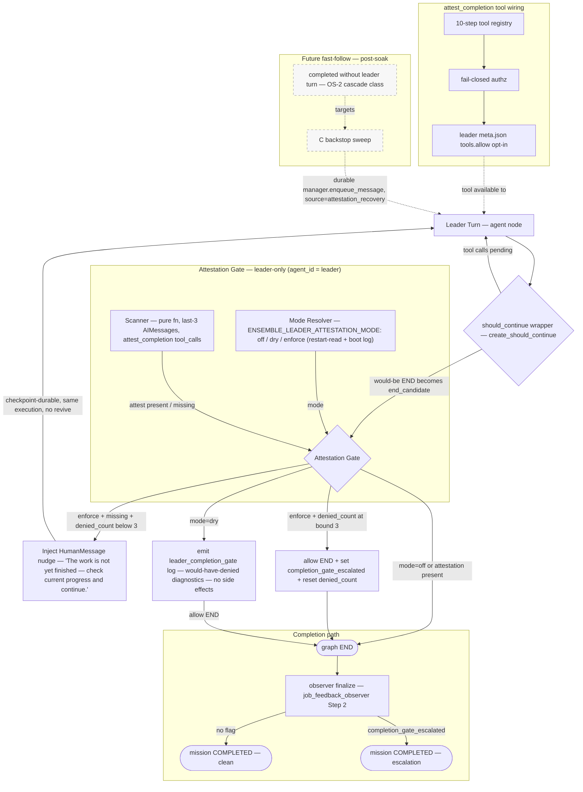

# Architecture Recommendation: Leader Completion Attestation

Date: 2026-09-05
Status: **DECIDED** — resolved by architect council `lca-d1-council-20260905-6f2a91` (governor `3387fa8d`, 2/2 councilors completed, both read-only compliant, models `coding`+`agentic`, skill `trade-off-analysis`), adjudicated and independently spot-verified by the architect (pattern-level greps at HEAD).
Branch: `feature/leader-completion-attestation`
Companion: this file resolves the OPEN decisions in [`decisions.md`](./decisions.md); C1–C8 CLOSED-by-user constraints stand unmodified.

---

## Executive Summary

**D1 = B: an in-graph, synchronous, pre-END attestation gate** mirroring the `language_check`/`end_candidate` precedent (`daemon/graph.py:2589-2734`, wiring `:6445-6470`), shipped under a **tri-state mode env defaulting to `dry`**. The gate is the chokepoint every completion stamper shares: if the graph never ENDs, observer Step 2, the child_reports stamps, and lifecycle side effects never fire — verified zero-race by both councilors. Candidates A and E are **disqualified** (both are bypassable/racy single-surface gates — see matrix), C is a **post-soak fast-follow backstop**, not a co-ship. Nine secondary decisions resolved below; the single most consequential architect ruling is the **C5 interpretation fork** (§3) — read it before implementing.

---

## 1. Resolved Decisions D1–D10

| # | Decision | Resolution | One-line rationale |
|---|----------|------------|--------------------|
| **D1** | Gate placement | **B — in-graph pre-END interception** (`create_should_continue` composition → `attestation_gate` node, own flag, both wiring branches) | Only chokepoint shared by all 4+ completion stampers; structurally race-free (denied turn never reaches observer Step 2 / child_reports / revive); exact in-file precedent; fully reversible (remove wrapper). |
| **D2** | Kill-switch default | **Tri-state `ENSEMBLE_LEADER_ATTESTATION_MODE=off\|dry\|enforce`, default `dry` at ship**; promote to `enforce` after ≤2-week soak on adjudicated dry-log false-positive rate | Dry strictly dominates plain OFF (telemetry before commitment) and plain ON (the "bad gate blocks all leader completions" outage class is bounded to log volume); single tri-state env avoids the invalid `ENABLED=OFF, DRY_RUN=ON` state of a 2-env design. |
| **D3** | Gate scope | **Leader-only** (`agent_id == "leader"`, enforced at graph-build time so non-leader graphs are untouched) | Bug class is leader-specific; user already locked tool scope to leader via `tools.allow`; zero friction on all other agents. |
| **D4** | Window N | **N=3, `ENSEMBLE_LEADER_ATTESTATION_WINDOW`, Pattern C** resolver (restart-read, cached global, one-time boot log) | Tightest usable window matching the natural `attest → ToolMessage → final prose` flow; Pattern C is the established kill-switch convention (`instance_messaging.py:114-191` precedent); **N must stay ≤ `min_recent_window` (3)** — see D10(b). |
| **D5** | Retry bound / ledger / fallback | **Bound 3 (env `ENSEMBLE_LEADER_ATTESTATION_DENY_BOUND`) / DB columns on instance row (`denied_count`, `completion_gate_escalated`) / allow-completion + flag + structured `gate_terminal_after_bound` event + counter reset** | Counter must survive revive (DB not RAM); a row-scoped column needs **no** 5-path cleanup (that precedent is for in-memory dicts) — but because instance rows survive revive, **`denied_count` MUST reset to 0 on every allow** or a revived leader starts its next mission pre-burdened (architect addition to council verdict). Migration must be PG+SQLite-safe (fresh-SQLite boot trap is live). |
| **D6** | Recovery source value | **New explicit source `"attestation_recovery"` + explicit `msg_type → HUMAN` mapping branch + defensive exclusion from any user-origin window** | Unanimous: not `source="api"` (provenance lie; window mechanics disputed between councilors — treat as possibly-armed, fail-closed), not else-branch quirk-reliance, not wait-for-P2.2 (whitelist **already landed**, `5ef35262a` — plan was stale). Implementation lands with the C fast-follow (see §3). |
| **D7** | Tool semantics | **`attest_completion`, no-arg, idempotent (any call in window counts), short confirmation ToolMessage return, NOT privileged** | Simplest scanner contract (`tool_calls[i].name` match); `tools.allow` opt-in + fail-closed authz suffice — `PRIVILEGED_TOOL_CATEGORIES` (only `system_upgrade`) would be scope creep; complete the full 10-step registration or the tool is **silently invisible**. |
| **D8** | Dry-run / observability | **Dry = the tri-state `dry` mode (gate evaluates, logs `would_have_denied` + scanner diagnostics, allows END, zero side effects) + always-on structured `leader_completion_gate` logging in every mode** | Dry lines must carry scanner diagnostics (window truncated? summary-seen?) so dry→enforce promotion is adjudicated on data, not conjecture. |
| **D9** | Finalize ordering | **Moot for B — recovery lands before finalize by construction** (denied turn never ENDs, so observer Step 2 never fires on it) | Planner's "only relevant for A/E" confirmed; for any future A/E-shaped gate the only safe shape is skip-the-stamp (a stamped-then-recovered completion already fired irrevocable post-commit side effects). |
| **D10** | Edge cases | **(a) ANY-in-last-3-AIMessages · (b) scan current post-compaction state — safe at default config, with N≤`min_recent_window` coupling enforced · (c) immune by construction** | (a) Last-AIMessage-only would false-deny the natural `attest→ToolMessage→prose` flow **every time** — a guaranteed 3-strikes-escalation machine; over-acceptance is bounded and observable in dry logs. (b) Compaction preserves AIMessage+ToolMessage as atomic boundary groups (`daemon/compaction.py:1373-1408`) and annotates summaries `[Called tools: …]` (`:2879-2887`) — plan's "may be dropped" was overly pessimistic; the real edge is only the `min_recent_window=3` floor under pressure. (c) Injected reports are HumanMessages; an AIMessage-only scan cannot see them. |

---

## 2. Five-Axis Trade-Off Matrix (D1)

Weights: Complexity 20 / Scalability 20 / Maintainability 25 / Risk 20 (inverted — higher = safer) / Cost 15 (inverted). Scores 1–5, merged from both councilors.

| Approach | Complexity | Scalability | Maintainability | Risk | Cost | Weighted | Verdict |
|----------|-----------|-------------|-----------------|------|------|----------|---------|
| **B — in-graph pre-END gate** | 2–3 (wrapper composition in **both** wiring branches) | 5 (per-turn O(N) scan, no new service) | 4–5 (exact in-file precedent) | 4 (structurally race-free, code-verified) | 3–4 | **3.90–4.00** | ✅ **RECOMMENDED** |
| **B+C hybrid (co-ship)** | 3 | 4 | 3–4 | 4–5 | 2–3 | 3.40–3.50 | C as **separately-shipped fast-follow**, not co-ship |
| **A — child_reports pre-commit** | 3 | 4 | 2–4 | 2–3 | 3–4 | 2.75–3.60 | ❌ Disqualified — **bypassable**: parent-cascade completer (`_update_parent_on_child_complete`, def `child_reports.py:952`, inline twin `:3325`) and `error_reporting.py:319` stamp anyway; gating one surface leaves ≥3 open |
| **E — observer Step 2 gate** | 3–4 | 4–5 | 2–3 | 2 | 3–4 | 2.75–3.55 | ❌ Disqualified — **double footgun**: `:1698` is an early-return, NOT a re-arm (post-commit re-arm `:1572-1577` is conditioned on `not gate_deferred` → defer-starvation strands the job `active`); Step 2 `:3740-3752` is a bare ORM terminal write with no WHERE guard → stomps revived RUNNING |
| **C — async sweep solo** | 2–3 | 4 | 3 | 2 | 2–3 | 2.65–3.00 | ❌ as primary (post-commit, TOCTOU vs revive `:1867-1909` and Step 2 re-stamp); ✅ valuable as backstop |
| **D — tool-as-only-trigger** | — | — | — | — | — | n/a | ❌ Pre-rejection **confirmed unanimously**: a sticky checkpoint flag survives revive → a revived instance ENDs on a stale pre-revive attestation — *the very bug class this feature targets*; window scanning is self-correcting, the flag is not |

**Honest coverage boundary:** B cannot see the parent-cascade path where a leader completes **without a leader turn** (last child completes → cascade stamps the parent). That class is OS-2-deferred by the plan; the C backstop is the only mechanism that can cover it later — hence fast-follow, not co-ship.

---

## 3. Architect Ruling — the C5 Interpretation Fork (READ FIRST)

C5 (CLOSED-by-user): *"Recovery MUST use `manager.enqueue_message` … NEVER RAM `set_injection`."*

**The fork:** read literally, "every deny enqueues via `manager.enqueue_message`" forces B's deny path to END-then-enqueue-revive — reintroducing the observer/revive race B exists to eliminate, and degrading B to detector+recovery. Doing **both** (in-graph nudge AND enqueue) on one deny **double-delivers**: the enqueued task fires after the attested END and spuriously revives a COMPLETED instance.

**Ruling:** C5's *intent* is durability — never RAM-only delivery that vanishes on crash. The architecture therefore splits delivery by context:

1. **In-graph deny nudge (shipped, B):** checkpoint-durable **in-state `HumanMessage`** injected by the gate node and routed back to `agent` — the exact `language_check` reminder precedent (`graph.py:2666-2685`). This is *prevention/continuation inside a live graph execution*: no revive semantics exist, nothing is RAM-only (LangGraph checkpoints at node boundaries), and the instance is RUNNING throughout.
2. **Out-of-graph recovery (C fast-follow):** durable `manager.enqueue_message` with `source="attestation_recovery"` per C5's letter — cross-restart, revive-capable, the only correct tool for post-completion recovery.

Consequence for phasing: the enqueue-based recovery injector (`attestation_recovery.py`), the D6 source mapping, and the facade-forwarding/JAFP test duties all move to the **C fast-follow phase**; the MVP deny path is purely in-graph. **This is a CLOSED-constraint interpretation, not a modification — flagged for user veto in §8.**

---

## 4. Recommended Architecture

Components (all `dry`-compatible — in `dry` every decision is computed and logged, nothing is enforced):

- **`daemon/tools/attestation.py`** — `attest_completion` tool: no-arg, idempotent, short confirmation ToolMessage. 10-step registration (`daemon/tools/upgrade_tools.py:110-143`), fail-closed authz (`daemon/tools/_auth.py`), opt-in `agents/leader/meta.json:14-15` `tools.allow` (+ meta version bump). NOT privileged.
- **`daemon/services/attestation_scanner.py`** — pure function: ANY-in-last-N-AIMessages `tool_calls[i].name == "attest_completion"` match, with diagnostics (window truncated, summary-seen). Unit-testable in isolation.
- **`daemon/services/attestation_gate.py`** — pure function: `(scanner_result, denied_count, mode, scope) → {allow, deny, terminal_after_bound, dry_log}`. Fail-**OPEN** in try/except (W4 precedent `graph.py:2661-2664`) — an unhandled scanner exception on the routing path would error every leader mission, which is precisely D2's outage class.
- **`daemon/graph.py`** — `create_should_continue` composition: would-be END → `attestation_gate` node under **its own flag, wired in BOTH branches** (language_check on AND off — `create_should_continue(language_check_enabled)` at `:2707` has two paths; piggybacking on language_check wiring silently disables the gate whenever `language_check_enabled=False`). Deny → inject in-state nudge, route to `agent`. Leader-only via graph-build-time `agent_id` check (non-leader graphs untouched).
- **Instance-row columns** — `denied_count`, `completion_gate_escalated` (PG+SQLite-safe migration; reset `denied_count` on every allow — rows survive revive).
- **`daemon/services/attestation_resolver.py`** — Pattern C resolvers for `ENSEMBLE_LEADER_ATTESTATION_MODE` (default `dry`, blank→`off`) / `…_WINDOW` (3) / `…_DENY_BOUND` (3); one-time boot log of all three.

---

## 5. Phasing Adjustments (vs plan-overview.md)

| Plan phase | Adjustment |
|---|---|
| **Phase 1** (tool + prompt contract) | Unchanged. **Add** the compaction boundary-group preservation assertion as a Phase-1 regression test (protects the D10(b) assumption early). |
| **Phase 2** (scanner + gate + hookup) | D1=B wiring must exist under its **own flag in both `create_should_continue` branches**; **add** the composition integration test (language_check AND attestation both enabled → conditional-edge table valid) before merge. |
| **Phase 3** (recovery + ledger + bound) | **Re-scoped**: in-graph nudge moves INTO Phase 2 (it is the gate's deny path). Phase 3 keeps the ledger columns, bound enforcement, terminal fallback, `denied_count`-reset-on-allow, escalation flag/event. **Drop** the 5-path cleanup tasks (in-memory-dict precedent does not apply to row-scoped columns). The enqueue-based recovery injector (`attestation_recovery.py`), D6 source mapping, facade-forwarding + JAFP no-JobItem tests all **move to the C fast-follow phase**. |
| **Phase 4** (config/observability) | Tri-state `MODE` env replaces the boolean `ENABLED` (kills the invalid OFF+DRY state); dry lines carry scanner diagnostics; boot log prints all three knobs. |
| **Phase 5** (tests) | **Add**: dry-mode decision-logging test; both-wiring-branches gate-activation test; fail-open-on-scanner-exception test; `denied_count` reset-on-allow + revive test. **Move**: JAFP/no-JobItem + facade-forwarding tests to fast-follow. |
| **New: fast-follow (post-soak)** | C backstop sweep + enqueue-based recovery + D6 implementation; covers the OS-2 no-leader-turn cascade class; ships only after dry→enforce soak data adjudicated. |

---

## 6. Plan Corrections (factual errors found — verify before implementation)

| # | Severity | Plan claim | Verified reality | Verified by |
|---|---|---|---|---|
| 1 | 🔴 | "`USER_ORIGIN_SOURCES` whitelist not landed / P2.2 will add" (decisions.md D6 opt-3, technical-analysis debt §1, plan-overview OS-1) | **Landed 2026-08-23**, commit `5ef35262a`, `daemon/tools/upgrade_journal.py:1081` — 13 days before the plan was authored; D6 option 3 moot | Architect grep + git log ✅ |
| 2 | 🔴 | `source="api"` side effects = "SSE notification + message-id + audit log" | Wrong framing — the window is an in-memory dict feeding the `system_upgrade`/`system_restart` 3-factor nonce gate; councilors disputed exact mechanics (one traced the facade as bypassing it entirely) — treat as possibly-armed, fail-closed, never use `"api"` | Council (mechanics disputed; verdicts identical) ⚠️ |
| 3 | 🔴 | E: "re-arm at `:1698` is proven precedent" + "low risk for revived RUNNING" | **Doubly wrong.** (a) `:1698` is `if db_result.gate_deferred: return` — no re-arm; post-commit re-arm `:1572-1577` is conditioned on `not gate_deferred` → `gate_deferred=True` **strands the job** `active`. (b) Step 2 `:3740-3752` is a bare ORM terminal write, no WHERE guard — a revived-RUNNING instance gets stomped. Plan's E risk rating inverted | Architect grep (:1576, :1698) ✅ + council |
| 4 | 🟡 | "Compaction may fold/drop the attestation tool_call" (severity=high) | `daemon/compaction.py:1373-1408` preserves AIMessage+ToolMessage as atomic boundary groups; summaries append `[Called tools: …]` (`:2879-2887`); only the `min_recent_window=3` floor under pressure is real | Architect sed ✅ + council |
| 5 | 🟡 | Compaction path cited as `daemon/services/compaction.py` (all docs) | Actual: `daemon/compaction.py` (line refs `:1090` correct at real path) | Architect ls ✅ |
| 6 | 🟡 | A framed as "3 UPDATE sites" | Understates: parent-cascade completer (`_update_parent_on_child_complete`, def `child_reports.py:952`, inline twin `:3325`) + `error_reporting.py:319` also stamp — A cannot stop leader completion even inside its own file. (Councilor cited `:1173`; function verified at `:952` — exact call-shape pin left to developer) | Architect grep (substance ✅) |
| 7 | 🟢 | "A prior Phase-1-style status gate was dead code, removed (per project history)" | No supporting git history found — treat as unverified, not evidence | Council ⚠️ |

---

## 7. Developer Watch-List (severity-ordered)

1. 🔴 **C5 ruling (§3) governs the deny path** — implement the in-graph nudge ONLY; do not also enqueue on deny (double-delivery → spurious revive of a COMPLETED instance). User veto pending (§8).
2. 🔴 **Both wiring branches** — the gate must be active when `language_check_enabled` is False (the common case). Piggybacking on language_check wiring silently disables the gate for most instances.
3. 🔴 **Gate fails OPEN** on any internal exception (try/except, W4 precedent `graph.py:2661-2664`) — otherwise one scanner bug errors every leader mission.
4. 🟡 **N ≤ `min_recent_window` (3) coupling** — raising the window env without checking the compaction floor invites folded-attestation false-denies; assert in resolver or boot log a warning when `WINDOW > min_recent_window`.
5. 🟡 **Migration hygiene** — instance-row columns PG+SQLite-safe (fresh-SQLite boot trap is a live hazard); full 10-step tool registration + `KNOWN_TOOL_NAMES` drift test or the tool is silently invisible.
6. 🟡 **`denied_count` reset-on-allow** — rows survive revive; without reset, a revived leader's next mission starts pre-burdened.
7. 🟡 **Dry→enforce promotion on data** — each enforce-mode false deny costs 3 extra turns + an escalation flag; promote only on adjudicated dry-log rates. Mode env resolves blank→`off` (mirror WC-wake resolver shape).
8. 🟢 **Pre-existing observer-vs-revive race** (correction #3b) exists independently of this feature — file separately; do not fix incidentally in this branch.

---

## 8. Decisions Pending (user confirmations — non-blocking for Phase 1)

1. **C5 interpretation veto window:** confirm (or reject) the §3 ruling that the in-graph checkpoint-durable nudge satisfies C5's intent while `manager.enqueue_message` remains mandatory for the out-of-graph fast-follow path. Rejection forces END-then-enqueue-revive on every deny and reopens D1.
2. **Dry→enforce flip ownership:** operator flips `ENSEMBLE_LEADER_ATTESTATION_MODE` after ≤2-week soak (WC-wake posture). Confirm the runbook entry in `docs/setup.md` naming all three envs.
3. **(Optional observability hardening)** whether `completion_gate_escalated` should additionally stamp a critical note — default NO per council (flag + structured event suffice at MVP).

## 9. Open Questions

- Exact mechanics of the `source="api"` user-origin window (correction #2) — moot for this feature (D6 never uses `"api"`), but worth a standalone verification note before P2.2 follow-ups touch it.
- Mission-read-model visibility of the escalation flag (D5): current resolution is instance-row flag + structured event; FE surface is a separate decision if operators need it in the mission list.

## 10. Confidence & Flip Assumptions

**Confidence: High** for D1 (unanimous, code-verified, exact in-file precedent, reversible) and D6/D7/D9; **Medium-High** for D2 (dry-first is strongly argued but the soak-duration and flip criteria are operator judgment). The recommendation flips if: (a) the C5 ruling is rejected by the user (reopens D1 toward E-with-skip-the-stamp), or (b) dry-log soak reveals scanner false-negative rates high enough that in-graph deny would have looped healthy leaders past the bound — in which case widen N with the compaction-floor fix first, do not loosen the bound.
