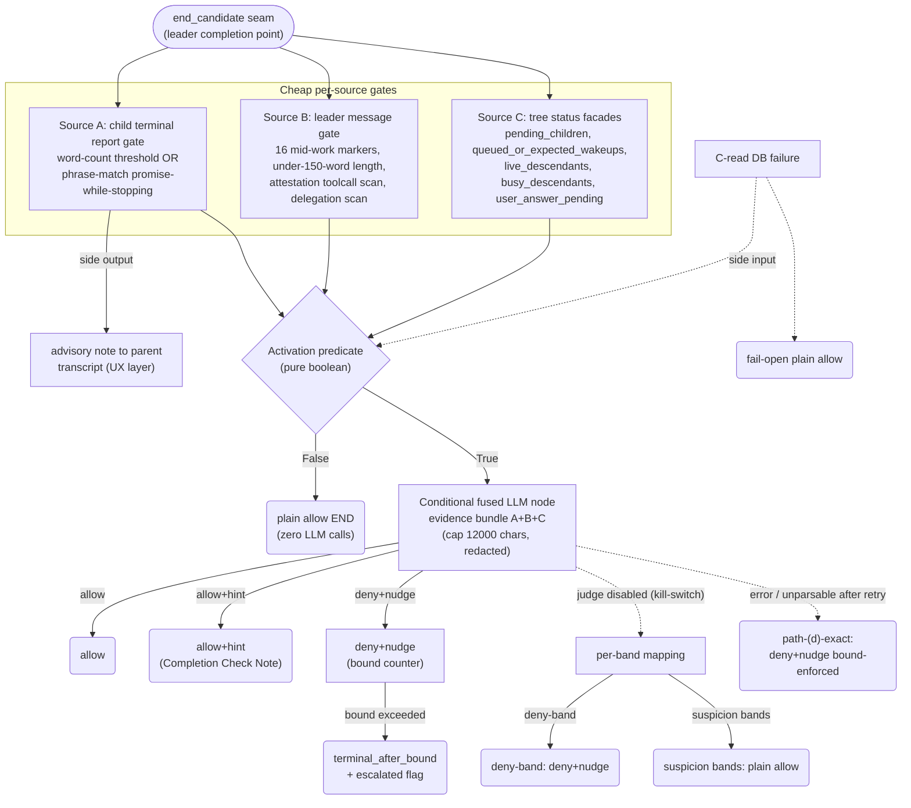

# LCA Unified 3-Source Completion Resolver — Design & Retirement Proposal

Date: 2026-09-16
Author: Architect (controller) — analysis by 3 dispatched workers, aggregated here
Repo state analyzed: `latest` tip **f2611f07** (v0.13.1, contains 937a72c4); working tree byte-identical to `latest` across all LCA files (verified: empty `git diff --stat latest -- <LCA files>`)
User direction: 2026-09-16 consolidation (fuse sources A/B/C into ONE resolver; activation unchanged; then cleanup pass — retirement list to USER for discussion before removal)
Status: **PROPOSAL — retirement list and outcome deltas require user sign-off before implementation**

---

## 1. Executive Summary

The current LCA stack (~7,300 lines across 11 files) runs **two separate LLM judge sites** behind two separate trigger paths, fed by five tree-status inputs, two leader-message scanners, and a delegation scan — with a sixth sensor (child-terminal contradiction detection) in flight but **not on the tip**. The unified resolver collapses this into: **cheap per-source gates → one pure activation predicate → ONE conditional fused LLM node at the completion seam → the existing outcome machinery** (allow / allow+hint / deny+nudge / terminal_after_bound), exactly as the user pinned mid-design.

Judge-call budget is provably ≤ today on every existing path (worst case 2 LLM calls/eval today = 2 after; most rows 0→0 or 1→1), with **one new 0→1 row** (source-A suspicion with a non-quiet tree) that needs explicit sign-off. Four outcome deltas survive scrutiny (Δ1–Δ4); two proposed by workers were **withdrawn** after code verification showed they would change pinned semantics. Eight retirement candidates are listed ordered with blast radius; **nothing is removed until the user approves**. Recommended migration: **staged over three releases, reusing the existing tri-state mode + rebuild-restart rollback — no new env flags** (repo convention n).

**Critical prerequisite:** the source-A producer (child-terminal contradiction detection) does **not exist on tip f2611f07** — grep for `promise-while-stopping`, `child_terminal_contradiction`, child-report scan variants: 0 hits. Both descriptions in circulation ("marker scan" / "word-count OR phrase match") describe unbuilt work on an in-flight branch. Its output contract must be locked **first** (§4.1).

---

## 2. Verified Inventory (current stack @ f2611f07)

### 2.1 Sensor inventory → role in the unified resolver

Legend: **PG** = PROMOTED-gate (activation-predicate producer) · **PE** = PROMOTED-evidence (LLM-node fused input) · **A** = ABSORBED (retirement candidate) · **P** = PRESERVED (carried unchanged)

| # | Sensor / detection | Anchor (verified) | Map |
|---|---|---|---|
| 1 | attestation_required (delegation scan) | attestation_gate.py:940,952 | A → outermost activation term |
| 2 | attested (in-window `attest_completion` scan) | attestation_scanner.py; gate.py:925 | P (anti-suspicion input) |
| 3 | pending_children (R2 #1) | manager.py:8864 | PG |
| 4 | queued_or_expected_wakeups (R2 #2) | instance_messaging.py:4546; manager.py:8894 | PG |
| 5 | live_descendants (R2 #3, two-set, fail-open −1) | manager.py:9059, :8921 | PG |
| 6 | busy_descendants (trigger suppression) | manager.py:9165 | PG |
| 7 | user_answer_pending (R2 #5, FIX-2) | manager.py:9222; gate.py:649,985 | PG (anti-suspicion) |
| 8 | attestation_seen_outside_window (log-only) | attestation_scanner.py | A (retire) |
| 9 | scan_for_mid_work_markers (16 patterns) | attestation_marker_scanner.py:258, called gate.py:1166 | PE (+ gate signal) |
| 10 | scan_for_short_final_ai (<150 words) | attestation_marker_scanner.py:333, called gate.py:1169 | PE (+ gate signal) |
| 11 | judge site 1 — marker path | graph.py:5251 → attestation_report_judge.py:718 | P → **subsumed by fused node** |
| 12 | judge site 2 — would-be-deny | graph.py:5631 (guard :5580) | P → **subsumed by fused node** |
| 13 | Retry-once on unparsable (98b59dd7) | attestation_report_judge.py:902-967 | P (node contract) |
| 14 | deny_bound_exceeded (shared bound) | attestation_gate.py:438; graph.py:5308,5473 | P |
| 15 | terminal_after_bound finalization | graph.py:5761 | P |
| 16 | completion_gate_escalated flag | attestation_ledger.py; graph.py:5807 | P |
| 17 | busy-suppression block | gate.py:1207-1220 | A → predicate term |
| 18 | Completion Check Note hint (route b) | graph.py:4704,5365,5543 | P (hint channel) |
| 19 | ATTESTATION_NUDGE_TEXT (deny nudge) | graph.py:4624,5840 | P (nudge channel) |
| 20 | should_inject_nudge | gate.py:159,297 | P |
| 21–24 | counter resets (attested-allow / bound / revive / creation) | gate.py:659,687,696; lifecycle | P |
| 25 | mode resolver off/dry/enforce | attestation_resolver.py:212,482 | P |
| 26 | LLM judge kill-switch | attestation_judge_resolver.py:90 | P |
| 27 | judge timeout resolver (25s default) | attestation_judge_timeout_resolver.py:180 | P |
| 28 | WINDOW=3 / DENY_BOUND=3 knobs | attestation_resolver.py:103-105 | P |
| 29 | scope_applicable (non-leader) | graph.py:5098 | A → outermost term |
| 30 | attestation_enabled master | graph.py:10377,5097 | A → outermost term |
| 31–33 | O1 boot assert / promotion metrics / gate_exception_seen | attestation_resolver.py; gate.py:1047 | P |
| 34 | DRY_LOG short-circuit | gate.py:606; graph.py:5165 | A → mode-layer |
| 35 | child-terminal contradiction detection (Source A) | **NOT ON TIP — unbuilt** | PG+PE once landed |

### 2.2 Judge-call census (today's budget baseline)

- Two call sites, **mutually exclusive per evaluation** (shared trigger predicate; once one fires the other cannot): marker path (graph.py:5251) and would-be-deny (graph.py:5631).
- Per site: 1 call, +1 retry on unparsable (attempt 2). **Realistic worst case / evaluation = 2 LLM calls.** Zero-call rows: meta-bypass, dry mode, judge kill-switch off, user-answer pending, R2-read DB failure.
- Key semantics pins (verified, load-bearing for fusion):
  - **Q1 — judge kill-switch OFF on the deny path ⇒ DENY+nudge WITHOUT the judge** (graph.py:5579 skip → ledger :5718 → nudge :5837; pinned by `test_attestation_judge_wiring.py::test_judge_not_called_when_env_kill_switch_off` :496). The judge on the deny path is a *rescuer*, not the denier.
  - **Path (d)** — marker-path judge error/timeout + nothing pending ⇒ **DENY+nudge, bound-enforced** (TERM at bound; FIX-1 6a0d60c9; graph.py:5308). Deny-on-judge-crash is today's *intended* semantics.
  - **D13 — benign asymmetry**: `live_descendants` conditional-live counts message-queue status {PENDING, READY, PROCESSING, RETRYING} (manager.py:9052-9055 → repository.py:845-850); `get_queued_or_expected_wakeups` counts {PENDING, RETRYING} + `next_retry_at > now` (instance_messaging.py:4636-4641). A PROCESSING row ⇒ wakeups=0 but live>0 ⇒ **arm-5 allow wins** (gate.py:670-680). Keep as documented contract; the OR-composition is the safety net.
  - **Structural invariant**: busy set {RUNNING, WAITING, WAITING_CHILDREN} ⊆ unconditional-live set ⇒ **busy>0 ⇒ live>0 ⇒ tree never "quiet"**. Any matrix row combining busy>0 with c_quiet is unreachable.
  - **D10 mirror requirement**: when `attestation_required=False`, the marker scan never runs today (gate.py:1101). The unified predicate must preserve this exclusion as an invariant.

---

## 3. Disagreement audit — what fusion exposes as wrong TODAY

1. **D13 PROCESSING asymmetry** (above) — benign, but only by accident of OR-composition; must become a *pinned contract test*, not folklore.
2. **D10 latent degenerate state** — delegation scan False + markers present: markers are silently excluded. Correct today; fusion must mirror it explicitly or markers would newly fire on non-delegation missions (outcome delta).
3. **Cross-sensor order-of-ops was historically buggy and recently fixed** (FIX-1 bound enforcement on marker path; FIX-2 user-answer-pending ordering; incident 98b59dd7 retry). The two-judge-site shape is where these bugs lived — consolidation removes the class (one site, one ordering).
4. **The sensors cannot simultaneously disagree about the deny predicate** today because `decide()` OR-composes R2 inputs with arm-precedence — but the *trigger layer* and *deny layer* evaluate at different code sites with different suppression rules (busy suppresses trigger, not deny). The unified predicate makes both suppression rules explicit in one pure function.

---

## 4. Unified Resolver Design



### 4.1 Components

- **`daemon/services/attestation_activation.py`** (new, ~150 LoC): typed signal collection + pure `activation_predicate(A, B, C) -> ActivationDecision{fires: bool, band: deny|marker|a_suspicion, signals}` + canonical `event=leader_activation` log row (additive fields mirroring today's marker/length row shape, gate.py:1282-1336). Scanners, catalogs, and C facades **keep their existing homes and contracts**.
- **Source-A producer** (in-flight branch; **not on tip**): REQUIRED output contract, locked before wiring —
  `per child terminal report: {advisory_present, contradiction_flag, phrase_promise_while_stopping, word_count_below_threshold, child_instance_id, report_excerpt}`.
  It emits (i) an **immediate advisory note to the parent transcript** (UX layer — see §4.4) and (ii) persists the typed flags for activation + evidence consumption.
- **Conditional fused LLM node** (rework of `attestation_report_judge.py` call path; one site): bundle = A excerpts ≤3000 chars + B leader signals/last-3-AIMessages ≤6000 + C tree snapshot ≤3000, total ≤12000 (today's `JUDGE_MAX_INPUT_CHARS`), id-redacted per the 98b59dd7 boundary. Verdict JSON `{verdict: complete|not_complete, evidence_cited[], advisory_note_text, rationale}`. Retry-once-on-unparsable preserved.
- **Outcome machinery — PRESERVED untouched**: bound/escalation/ledger (inventory #14–16, #21–24), hint/nudge channels (#18–20), modes/knobs (#25–28), observability (#31–33).

### 4.2 Activation predicate (pure function)

```
meta-bypass:  ¬attestation_required ∨ attested ∨ user_answer_pending  →  False (plain allow, 0 LLM)
C-read failure (any facade raises)                                    →  plain allow (whole-eval fail-open; gate.py:991-1048 parity)
c_quiet      := pending_children=0 ∧ queued_or_expected_wakeups=0 ∧ live_descendants=0
b_fires      := (marker_hit ∨ length_trigger) ∧ busy_descendants=0
a_suspicion  := any of {advisory_present, contradiction_flag, phrase_match, word_count_below_threshold}
activation   := c_quiet ∨ b_fires ∨ a_suspicion
band         := deny-band (c_quiet) | marker-band (b_fires ∧ ¬c_quiet) | A-band (a_suspicion ∧ ¬c_quiet ∧ ¬b_fires)
```

Notes: busy>0 ⇒ live>0 ⇒ ¬c_quiet (structural), so busy-suppression only ever mutes the marker band; **A is NOT busy-suppressed** (a child's promise-while-stopping is per-child evidence, orthogonal to other children being busy — decision point DP-2).

### 4.3 Decision matrix (bands × node states → outcomes)

| Band | Node fires? | verdict=complete | verdict=not_complete | error/unparsable ×2 | judge disabled (kill-switch) | Today's equivalent |
|---|---|---|---|---|---|---|
| Meta-bypass | no — 0 LLM | — | — | — | — | plain allow (unchanged) |
| C-read failure | no — 0 LLM | — | — | — | — | fail-open allow (unchanged) |
| **Deny-band** (un-attested ∧ c_quiet) | yes — 1 (+1 retry) | allow (rescue) | deny+nudge (bound) | **deny+nudge, bound-enforced** (path-(d)-exact) | **deny+nudge** (Q1 parity) | would-be-deny judge (graph.py:5631) |
| **Marker-band** (b_fires ∧ ¬c_quiet) | yes — 1 (+1 retry) | allow | pending>0 → allow+hint; else deny+nudge (bound) | path-(d)-exact | plain allow (marker-only too weak to deny) | marker judge routes (a)/(b)/(c)/(d) |
| **A-band** (a_suspicion alone, tree NOT quiet) | yes — **NEW 0→1 row** | allow | pending>0 → allow+hint (hint cites A evidence); else deny+nudge (bound) | path-(d)-exact | plain allow (suspicion bands never deny without judge) | **none — today plain allow, 0 LLM** |
| Dry mode | activation computed + logged, node skipped | — | — | — | — | DRY_LOG, 0 LLM (unchanged) |

### 4.4 Advisory-note ruling (the original design question)

**The advisory note SURVIVES as an immediate UX layer fed by source A — it does NOT fold into resolver outputs.** Reason: timing. The note's value is mid-mission correction (it fires when the child's terminal report lands, potentially hours before the leader attempts completion); folding it into the resolver would delay it to completion-check time. The resolver consumes the same typed flags as (i) activation condition (A-band) and (ii) judge evidence, and **cites** them in its own Completion Check Note via `evidence_cited` — the node worker's evidence-fidelity concern is answered by the citation, not by relocating the note. One producer, two consumers, no coupling of FE rendering to resolver internals.

---

## 5. Judge-Call Budget Comparison (must be ≤ today)

| Path | Today | Unified | Δ |
|---|---|---|---|
| Meta-bypass / attested / user-answer-pending / ¬c_quiet ∧ no triggers | 0 | 0 | 0 |
| Busy>0, no A (marker suppressed) | 0 | 0 | 0 |
| Marker band (busy=0, trigger, ¬quiet) | 1 (+1 retry) | 1 (+1 retry) | 0 |
| Deny band (un-attested ∧ quiet) | 1 (+1 retry) | 1 (+1 retry) | 0 |
| A ∧ c_quiet | 1 (deny-band judge) | 1 (fused node; richer prompt) | 0 |
| **A ∧ ¬c_quiet ∧ ¬b_fires** | **0** | **1** | **+1 — the only increasing row (Δ2)** |
| Judge disabled (any band) | 0 | 0 | 0 |
| Node/judge error | 1 (errored call) | 1 (errored call) | 0 |
| **Worst case / evaluation** | **2** | **2** | **0** |

Corrections vs worker drafts: the node worker's three "−1" rows were miscounted (an errored/disabled call still occurred or was skipped identically today — Δ=0 on each; the deny+marker "combo ≤3" row was unreachable, the two sites are mutually exclusive). Budget holds: **per-evaluation worst case unchanged at 2; total call volume changes only via Δ2's new row.**

---

## 6. Outcome-Delta Register (needs USER sign-off)

| # | Delta | Today | Unified | Risk | Verdict |
|---|---|---|---|---|---|
| **Δ1** | Source-A evidence reaches the completion decision (deny-band + all bands) | Judge sees only leader messages; a child's promise-while-stopping contradiction is invisible | Fused judge sees A excerpts/flags; verdicts may flip where child evidence contradicts leader's "done" | Medium — this is *the point* of the consolidation, but verdict flips are real behavior change | **Sign-off required** |
| **Δ2** | A-band activation (a_suspicion alone, tree not quiet) | Plain allow, 0 LLM | LLM node fires (1 call); verdict decides (likely allow+hint citing A) | Low-Medium — new judge spend in a previously-free row; worst-case/eval unchanged | **Sign-off required** (sub-decision DP-2: busy-suppress A? default **No**) |
| **Δ3** | Richer C evidence | Judge sees no tree detail | Bundle carries first-10 per-descendant rows (id-redacted) + `+N more` suffix + scalar counts | Low — bounded by caps; could flip verdicts on hidden dormant children (the D6 concern) | **Sign-off required** (mild) |
| **Δ4** | Hint channel enrichment | Completion Check Note is static text | Hint can carry `evidence_cited` + `advisory_note_text` from the verdict | Low — new UX surface on the existing stable-id channel | **Sign-off required** (mild) |

**Withdrawn (worker-proposed, rejected under the "consolidation, not semantics change" pin):**
- *Judge-error → fail-safe ALLOW* (node worker D2/D3): contradicts today's path-(d) deny-on-crash (FIX-1 6a0d60c9). Fused node replicates (d) exactly. Recorded as DP-5 (optional future revisit, user's call only).
- *Judge-disabled → activation False → plain allow everywhere* (both workers): contradicts Q1 — today's kill-switch-off deny path still DENIES. Replaced by per-band disabled-mapping (§4.3).

**Non-deltas (verified benign):** D4/D5/D7-class rows (same outcome, same-or-fewer calls); D13 (benign asymmetry, arm-5 catches); D10 (mirror requirement, §2.2).

---

## 7. Retirement List — **USER DISCUSSION REQUIRED BEFORE ANY REMOVAL**

Ordered safest-first. "Subsumed by" names the resolver path that makes the case redundant.

| # | Retirement candidate | Evidence of redundancy | Blast radius (tests / docs) | Risk |
|---|---|---|---|---|
| R1 | `attestation_seen_outside_window` log-only field (inv #8) | No decision weight anywhere (gate consumes in-window scan only) | None decision-pinning; decisions.md diagnostic note | None |
| R2 | `scope_applicable` + `attestation_enabled` as separate checks (inv #29/#30) | Outermost terms of the activation predicate; behavior byte-identical | test_attestation_runbook_drift.py, test_attestation_config.py (repoint) | Low |
| R3 | DRY_LOG short-circuit branch (inv #34, gate.py:606 / graph.py:5165) | Mode layer absorbs it; dry = activation computed+logged, node skipped, log-row shape preserved | test_attestation_dry_mode.py, test_attestation_dry_logging.py | Low |
| R4 | `attestation_required` delegation ARM as separate gate arm (inv #1, gate.py:940-952) | Concept preserved (delegation-gated activation); only the arm's code surface folds into the predicate | test_attestation_conditional_scanner.py, test_attestation_conditional_gate_outcomes.py, test_attestation_delegation_allow.py, test_attestation_nudge_chaos.py; requirements.md FR-3/R3 | Low-Med — D10 mirror must be pinned as invariant test first |
| R5 | Busy-suppression block (inv #17, gate.py:1207-1220) | Predicate term `b_suppressed_by_busy` | test_attestation_marker_wiring.py | Low |
| R6 | Marker/length TRIGGER block (inv #9/#10 call-site role, gate.py:1136-1271) | Become activation signal producers; scanner functions keep homes, 16-pattern catalog moves to activation constants | test_attestation_marker_scanner.py (matrix stays; call-site tests repoint) | Medium — core trigger semantics |
| R7 | **Both judge call sites** (graph.py:5251, :5631 + guard :5580 + route blocks :5419-5558, ~340 LoC) | ONE fused node + verdict_map with path-(d)-exact and per-band-disabled mappings (§4.3) | test_attestation_report_judge.py, test_attestation_judge_wiring.py (rewrite); route tests; this is the consolidation core | **Highest — gate behind dry soak (Stage 2→3)** |
| R8 | Legacy log event names (`*_marker_judge*`) | Folded into `*_fused_judge*` rows (keep old names as aliases one soak period for dashboards) | Observability queries / promotion-metric consumers | Low — dashboards only |

**Explicitly NOT retired:** bound/escalation/ledger machinery, counter resets, hint/nudge channels, all knobs/modes/kill-switches, retry-once, promotion metrics, gate_exception_seen, the attestation tool contract, `decide()`'s R2-input logging shape (kept for the canonical log schema).

---

## 8. Migration Plan — recommendation: **staged, 3 releases, no new flags**

Both worker drafts proposed new `ENSEMBLE_LCA_*` flags — **rejected**: repo convention (n) forbids new user-togglable flags for improvements. Staging rides the **existing** tri-state `ENSEMBLE_LEADER_ATTESTATION_MODE` (off/dry/enforce, Pattern C) and the existing judge kill-switch; rollback = redeploy previous build (frozen-PyInstaller, rebuild+restart discipline).

- **Stage 0 (prerequisite)** — Source-A producer lands (in-flight branch) with the §4.1 output contract LOCKED in requirements.md first. Resolver work consumes the contract only.
- **Stage 1 (additive release)** — `attestation_activation.py` + fused node wired in PARALLEL: mode=dry logs `leader_activation` rows + fused verdicts alongside today's paths. Outcomes byte-identical; zero behavior change; budget invariants testable in prod.
- **Stage 2 (flip release)** — enforce routes through activation → node → existing machinery (single seam change at the end_candidate block). Today's two judge sites become dead-but-present code for one release (instant revert-by-redeploy). Deltas Δ1–Δ4 go live **only after user sign-off**.
- **Stage 3 (retirement release)** — after ≥1 soak period of Stage 2 in prod, retire R1–R7 in listed order, repoint tests, delete dead blocks (R8 aliases after dashboard migration).

---

## 9. Fusion-Exposed Findings (honesty section)

1. **Source A does not exist on the tip** — the entire A-band rests on an unbuilt producer; its contract is the single biggest schedule risk (Stage 0 gates everything).
2. **Both approach workers mis-specified judge-disabled semantics** ("disabled → allow"); Q1 verification proved deny+nudge. Caught in aggregation; per-band mapping corrects it. Any implementation copying the worker drafts verbatim would have silently changed kill-switch semantics.
3. **The activation worker's decision matrix contained a structurally unreachable row** (busy ∧ quiet — impossible since busy ⊆ live) **and omitted the real new row** (A ∧ ¬quiet) — the only budget-increasing row. Corrected here; the invariant "busy>0 ⇒ ¬c_quiet" is now a required pin test.
4. **The node worker's budget "−1" rows were miscounted** (errored calls still cost a call; the 3-call combo row was unreachable). Corrected to Δ=0 everywhere except Δ2.
5. **D13's status-set asymmetry** between `live_descendants` and `get_queued_or_expected_wakeups` is real and survives fusion benignly only via arm-5 OR-composition — promote to a pinned contract test so a future edit to either status set cannot silently break the safety net.

---

## 10. Required Invariant Tests (implementation gate)

1. `¬attestation_required ⇒ no B/A contribution` (D10 mirror).
2. `busy>0 ⇒ ¬c_quiet` (status-set subset pin; guards both helpers).
3. Judge-disabled per-band mapping: deny-band → deny+nudge; marker/A bands → plain allow (extends `test_judge_not_called_when_env_kill_switch_off`).
4. Path-(d)-exact error mapping incl. at-bound edge (error at bound ⇒ terminal_after_bound, not a free deny).
5. Budget pin: ≤2 LLM calls per evaluation in every band and mode; dry = 0.
6. D13 contract: PROCESSING row ⇒ wakeups=0 ∧ live>0 ⇒ arm-5 allow.
7. Advisory-note timing: A producer emits transcript note at child-terminal time, independent of any later resolver evaluation.

---

## 11. Decisions Pending (user)

- **DP-1**: Sign off Δ1–Δ4 (outcome-delta register §6).
- **DP-2**: Busy-suppress source A? (default: **No** — per-child evidence, orthogonal to sibling busyness).
- **DP-3**: Approve retirement list R1–R8 (order + timing; nothing removed before approval).
- **DP-4**: Lock the source-A producer output contract (§4.1) — blocks Stage 0.
- **DP-5** (optional, default **reject**): change judge-error semantics from path-(d) deny to fail-safe allow (withdrawn worker proposal).

## 12. Evidence Base

- Inventory + judge census + disagreement audit + Q1/Q2 verifications: worker `0638b0dd` (data-flow-design), verified anchors throughout.
- Activation-layer design: worker `e32de8f8` (data-flow-design) — predicate, budget, fail-open, migration stages; matrix corrections per §9.
- Conditional-node design: worker `d4f6a040` (data-flow-design) — bundle caps, verdict contract, prompt sketch, fail-safe ladder, M0–M3 (flag scheme replaced per convention n).
- Architect adjudications: path-(d) replication, per-band disabled-mapping, busy⊆live correction, Δ2 identification, advisory-note ruling, migration re-flagging.

Confidence: **High** on inventory, census, budget math, and semantics pins (code-verified, test-pinned). **Medium-High** on the design itself (two worker errors found and corrected; source-A producer hypothetical until Stage 0 lands). Flip risk: if the source-A producer's real contract carries richer signal than the four booleans (confidence scores, severity tiers), the predicate grows a field and Δ2's shape shifts — the Stage-0 contract lock is the mitigation.


---

## Appendix A — User-Facing Retirement Review Table (R1–R8, item-by-item)

Approval status 2026-09-16: Δ1, Δ2 (source A **not** busy-suppressed), Δ3, Δ4 approved. Retirement list under item-by-item review — **no removal approved yet**. Post-retirement net behavior = today + the four approved deltas, and nothing else — conditional on the two guards flagged below.

| # | WHAT is retired (plain language) | WHY REDUNDANT (subsuming resolver path) | BLAST RADIUS | RISK | STAGE | Behavior change? (beyond log fields) |
|---|---|---|---|---|---|---|
| R1 | The diagnostic log field "attestation tool call seen, but outside the lookback window" | It never influences any decision — the resolver consumes only the in-window attestation result, which is kept | No behavior tests; one decisions-doc note. Tiny | **Low** — pure log surface | 3 | **None** (log-only) |
| R2 | The two separate "does this gate even apply" pre-checks (non-leader agents; feature master-off) | They become the first terms of the activation predicate — identical logic, one location | 2 test files repointed (runbook-drift, config). Small | **Low** | 3 | **None** — non-leaders and feature-off behave exactly as today (never activate) |
| R3 | The special-case branch that makes dry-run mode log triggers without acting | Dry becomes a property of the resolver itself: predicate computed + logged, LLM node skipped, zero effects — same observable contract | 2 dry-mode test files repointed; log rows keep shape (gain activation fields). Small | **Low** | 3 | **None** — dry stays log-only, zero LLM calls |
| R4 | The delegation scan's separate gate-arm ("is attestation required at all?") | Concept preserved unchanged — delegation-gated activation becomes the predicate's outermost term; only the code surface folds | 4 test files repointed; requirements FR-3/R3 wording. Medium-small | **Low-Med** — see 🚩 guard | 3 (invariant test lands **first**) | **None — with guard** 🚩 |
| R5 | The block that suppresses marker/length suspicion while children are actively working | Becomes a predicate term: busy mutes the marker band, exactly where and how it does today | 1 test file (marker wiring). Small | **Low** | 3 | **None**. (Source-A suspicion is deliberately NOT busy-suppressed — that is approved Δ2, not this item) |
| R6 | The plumbing that turns marker/length scan results into a judge trigger | Markers/length become activation signals; the scanners and the 16-pattern catalog are kept — only the trigger plumbing folds | Scanner 16-pattern test matrix kept; call-site tests repointed. Medium | **Medium** — core trigger semantics move (coupled with R7) | 3 (dead code from Stage-2 flip onward) | **None by itself** — the marker band activates the judge exactly where today's trigger did; any verdict differences come from the approved richer evidence (Δ1/Δ3) |
| R7 | The two separate LLM judge invocations (marker-path and would-be-deny) plus their four outcome routes — the heart of the old stack (~340 lines) | One conditional fused judge whose verdict maps onto the same four outcomes; crash and kill-switch behavior replicate today exactly | Judge + judge-wiring test files rewritten; route tests; largest single change | **High** — the consolidation core; gated behind the enforce soak | Flips in **2**, deletes in **3** | **None beyond the four approved deltas — CONDITIONAL** 🚩 |
| R8 | Legacy judge log-event names | One judge → one event family; old names kept as aliases during the soak for dashboards | Dashboards / metric queries only | **Low** — observability only | 3 (aliases first) | **None** (log-only) |

### 🚩 Loud flags — the two items that are neutral ONLY with their guards

- **R7 — conditional neutrality.** Both analysis drafts initially got crash/kill-switch semantics wrong; the retirement is behavior-neutral **only** with the corrected mappings, pinned by invariant tests in the same change: (1) judge **error/timeout** → deny+nudge, bound-enforced, exactly as today — NOT a fail-safe allow; (2) judge **kill-switch off** → deny+nudge on the un-attested-quiet band, plain allow on suspicion bands — NOT allow everywhere. Implementing from the drafts verbatim would silently change crash and kill-switch behavior.
- **R4 — conditional neutrality.** When no delegation happened since the last real user message, suspicion signals must not even be evaluated (today the marker scan is skipped entirely on that path). Without this mirror invariant pinned as a test first, markers would newly fire on non-delegated (solo) missions — false suspicion where the gate was never meant to look.
