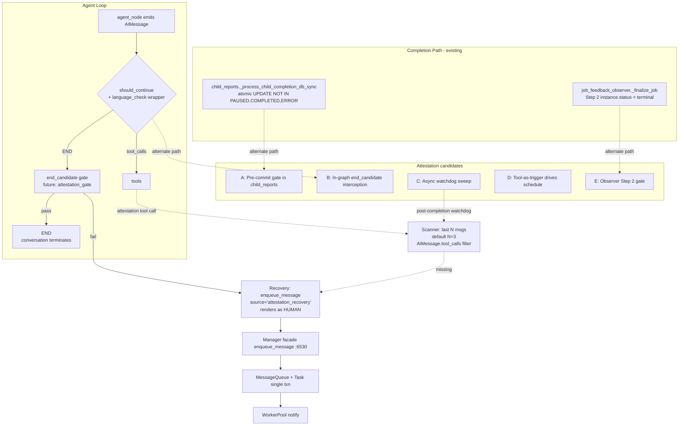

# Technical Analysis: Leader Completion Attestation

Date: 2026-09-05
Author: planner[v2] via technical-analysis worker
Analysis depth: deep-dive
Status: **SUPERSEDED IN PART** — see banner below
Target branch: `feature/leader-completion-attestation`

---

> ## ⚠️ SUPERSEDED IN PART
>
> This document is **partially superseded** by [`architecture-recommendation.md`](./architecture-recommendation.md) (architect council `lca-d1-council-20260905-6f2a91`) and the leader rulings recorded in [`decisions.md`](./decisions.md) as **R1** (nudge-MVP deny path) and **R2** (pending-wakeup gate input). The candidates A–E analysis below is retained as **historical evidence** for why D1=B is the architect's choice; do NOT rewrite the body. New authoritative shape lives in `architecture-recommendation.md`. Specifically:
>
> - **R1** — the deny path is an in-graph checkpoint-durable `HumanMessage` nudge routed back into the same execution (exact `language_check` reminder precedent). NO `manager.enqueue_message` on deny, NO revive on deny. The durable-enqueue recovery injector is relocated to phase6 (fast-follow backstop, post-soak).
> - **R2** — the gate's deny input ALSO requires `pending_children == 0` AND `queued_or_expected_wakeups == 0` (the pending-wakeup input). Legitimate delegation turn-ends are allowed un-attested. Log schema carries `pending_children` + `attest_seen_outside_window` (+ `messages_scanned>0`).
> - **Mode config** — tri-state `ENSEMBLE_LEADER_ATTESTATION_MODE=off|dry|enforce`, default `dry`. The single-bool / two-env-pair design is gone; only the tri-state surface is supported.
> - **Fail-open** — any exception in scanner/gate ⇒ allow completion + structured error log, EXCEPT the `attestation_denied_count` ledger DB seam (which raises `OperationalError`); the bootstrap exception set is the narrow set in `graph.py:2663-2688` and explicitly does NOT cover SQLAlchemy `OperationalError`.
>
> Treat this file as the architectural trade-off ledger. For the SPEC layer of what to build, read `requirements.md` + `decisions.md` (post-reconciliation) instead.

---

## Question

**What is the right architectural shape for a "leader completion attestation" mechanism that prevents a parent (leader) instance from being marked COMPLETED when a child agent reported "in progress" or prematurely signaled end-of-turn without actually finishing its work — across all future missions — without breaking the existing completion/finalize/revive/sweep stack?**

Sub-questions the analysis must answer:
1. Where in the completion path should the attestation gate live (sync pre-commit vs in-graph vs async sweep vs tool-driven)?
2. How should attestation interact with the observer's `_finalize_job` Step 2 race (terminal re-stamp over revived RUNNING)?
3. How should the recovery message be authored so the leader treats it as user-originated (not a system data frame) yet still passes through `enqueue_message`'s durable MessageQueue+Task path?
4. How does the kill-switch (env + config, restart-read) interact with the WC-wake precedent and the pydantic-alias/dual-read precedent?
5. What is the bounded-loop guard (max retries → terminal fallback) under which recovery stops?
6. How does attestation survive context-compaction folding (does the scanner still see the original `AIMessage.tool_calls` after compaction)?

---

## Context Summary

A user-reported defect: a child agent reports "in progress" (hallucinated or premature end-of-turn) → the leader LLM interprets the report as "work done" → the leader calls the completion path → the leader instance/mission is marked COMPLETED while work was never actually finished. The user requested four mechanics: (1) an attestation tool the leader MUST call to mark completion; (2) a completion check scanning the last N messages (default 3, configurable) for the tool call; (3) if not attested, recovery by a durable, user-authored message to the leader; (4) all future missions protected.

Hard constraints (user-fixed):
- Bounded per-instance retry + terminal fallback. Precedent: `loop-breaker` cap + counter auto-reset (`daemon/graph.py:1840-1847, :1836-1837`; `_loop_breaker_state.pop` cleanup at `daemon/manager.py:3734, :3798, :8548`).
- Kill-switch via env, restart-read resolver; default ON/OFF is open. Two patterns available: A) `pydantic validation_alias` + explicit `load_config` resolver, env > legacy alias > yaml > default, typo-safe (`daemon/config.py:805-844, :2155-2215`); B) dual-read cfg AND env (`daemon/config.py:463-506`); C) module env resolver + cached global + one-time boot log (WC-wake variant: `daemon/services/instance_messaging.py:114-191`).
- Window N configurable (env/config), not hardcoded.
- Leader-scoped tool via `meta.json` `tools.allow` opt-in + fail-closed authz; `PRIVILEGED_TOOL_CATEGORIES` (`daemon/tools/_tool_registry.py:101-103`) is an open sub-question.
- Recovery via durable `manager.enqueue_message` (`daemon/manager.py:6530-6626` → `daemon/services/instance_messaging.py:1960-2073`; single MessageQueue+Task txn; NEVER RAM `set_injection`). JAFP: internal paths use `enqueue_message` only, no JobItem.
- Recovery origin renders as user-authored: `else`-branch stamps `HUMAN` (`daemon/services/instance_messaging.py:1685-1704`, drifted from old `:1310-1319`); `source="api"` arms user-origin window (`daemon/manager.py:3159-3197`). Caller discipline required (known deferred defect).
- Must-not-break: normal attested completion; mission finalize; revive semantics (`daemon/services/instance_messaging.py:1867-1909`, PAUSED excluded); WC-wake lanes (`ENSEMBLE_WC_WAKE_ENQUEUE` default OFF); report-injection claim machine (`daemon/graph.py:416-490`); existing recovery sweeps.

Known blind spot: the inter-report gap where both the bus gate AND the pending-tasks gate pass (premature-finalize window) — the exact window this feature targets.

---

## Architecture

### Current Patterns in Use (Completion Path)

| # | Pattern | Location |
|---|---------|----------|
| 1 | **Defense-in-depth atomic UPDATE** (`WHERE status NOT IN (PAUSED, COMPLETED, ERROR)`) for instance terminalization, with rowcount == 0 → skip side effects (TOCTOU guard) | `daemon/services/child_reports.py:1983` (`_process_child_completion_db_sync`), 3 atomic write sites at ~`:2545`, `:2737`, `:2895` |
| 2 | **Observer-path terminal re-stamp** at Step 2 of `_finalize_job` — unconditional `instance.status = terminal_status` when not already terminal (this is the actual mission-finalize write surface) | `daemon/services/job_feedback_observer.py:3083` (`_finalize_job_db_sync`); Step 2 at `:3703-3758` |
| 3 | **In-graph END interception** via wrapper-on-routing-function: `create_should_continue` returns a closure that translates `END` → `"end_candidate"` and routes through a language-check node before allowing real END | `daemon/graph.py:2462` (original `should_continue`), `:2707-2734` (`create_should_continue` wrapper), wiring `:6463` |
| 4 | **HumanMessage injection into state** (additive_kwargs marker pattern) for reminders, nudges, and recovery messages that must survive next graph tick | `daemon/graph.py:2666-2685` (language_check reminder precedent with `language_check_reminder=True`) |
| 5 | **Report-injection claim machine** (atomic PENDING→INJECTED claim, drain → append to checkpoint) for cross-instance data flow | `daemon/graph.py:414-490`, `:3622-3658`; `daemon/repositories/report_injection/repository.py:claim_for_injection` |
| 6 | **Recovery sweeps with per-lane kill-switches** for backstop recovery of missed/stranded work | `daemon/services/report_delivery_recovery.py:207` (5-lane service); `daemon/services/waiting_children_watchdog.py:312` (hourly nudge-only watchdog); per-lane kill-switches `daemon/config.py:1107-1185`; wiring `daemon/manager.py:6093-6250` |
| 7 | **Gate-deferred completion** in observer — when bus gate or pending-tasks gate returns live work, job is deferred with `gate_deferred=True` (must re-arm or job strands in `admission_state='active'`) | `daemon/services/job_feedback_observer.py:259-277` (`gate_deferred` field), `:1698` (re-arm path) |
| 8 | **Loop-breaker** (stateless scan + Repairer with bounded retries, auto-reset counters; `_loop_breaker_state` reset at `daemon/manager.py:3734, :3798, :8548`) | `daemon/graph.py:1037-1044` (LoopDetector backwards walk), `:1836-1847` (max_repairs + auto-reset) |
| 9 | **JAFP (Job-As-Front-Primitive)** — public entry creates JobItem; internal paths (`send_message`, cascade-resume, reports, recovery) use `enqueue_message` only, no JobItem | `daemon/services/instance_messaging.py:1960` (`enqueue_message` internal); manager facade `:6530-6626` |
| 10 | **Source-based message-type stamping** in `_prepare_enqueued_message` — `internal_report:*` → COMPLETION_REPORT, `internal_error_report:*` → ERROR_REPORT, `internal_agent:*` → AGENT, **else → HUMAN** | `daemon/services/instance_messaging.py:1685-1704` |
| 11 | **Revive semantics** in `_prepare_enqueued_message` — terminal instance (COMPLETED/TERMINATED/ERROR/FAILED) auto-revives on new message; PAUSED is exempt | `daemon/services/instance_messaging.py:1867-1909` |
| 12 | **Tool registration discipline** — `@register_tool_category` ABOVE `@tool` + `CATEGORY_MODULES` entry + `DYNAMIC_TOOL_NAMES` (`:23-78`) + `KNOWN_TOOL_NAMES` regen (drift test); `tools.extend(create_...())` in `create_instance_tools()`. Decorator-only = SILENTLY INVISIBLE | `daemon/tools/_tool_registry.py:106`; 10-step checklist `daemon/tools/upgrade_tools.py:110-143`; enforced by `tests/unit/tools/test_upgrade_registration.py` |

### Module Boundaries

```
                          ┌─────────────────────────────────────────────────────────┐
                          │                   LangGraph graph.py                     │
                          │  agent_node → should_continue → [tools | END]             │
                          │       │                                  ↑                │
                          │       ▼                                  │                │
                          │  create_should_continue wrapper ──── end_candidate gate   │
                          │       │ (language_check, future attestation gate)         │
                          └─────────────────────────────────────────────────────────┘
                                            │              │
              ┌─────────────────────────────┘              └──────────────────────────┐
              ▼                                                                       ▼
  ┌───────────────────────────────┐                              ┌─────────────────────────────┐
  │   Tool layer                  │                              │  Completion / Finalize      │
  │   daemon/tools/               │                              │  daemon/services/           │
  │   _tool_registry.py           │                              │   child_reports.py          │
  │   + CATEGORY_MODULES          │                              │   (atomic UPDATEs at        │
  │   + PRIVILEGED_CATEGORIES     │                              │    ~2545/2737/2895)         │
  │   + KNOWN_TOOL_NAMES regen    │                              │   job_feedback_observer.py  │
  │                               │                              │   (_finalize_job, Step 2    │
  │   ──→ leader meta.json:14-15  │                              │    at :3703-3758)           │
  │       tools.allow opt-in      │                              │   gate_deferred re-arm      │
  └───────────────────────────────┘                              └─────────────────────────────┘
              │                                                                   │
              └────────────────────┐                          ┌───────────────────┘
                                   ▼                          ▼
                          ┌──────────────────────────────────────────┐
                          │      InstanceMessagingService             │
                          │      enqueue_message (internal)           │
                          │      instance_messaging.py:1960           │
                          │      → MessageQueue + Task single txn     │
                          │      → WorkerPool.notify_work()           │
                          │      source → msg_type (HUMAN stamp)      │
                          │      revive: COMPLETED→RUNNING            │
                          │      PAUSED exempt                        │
                          └──────────────────────────────────────────┘
                                   ▲
                                   │ facade (manager.enqueue_message :6530)
                          ┌────────┴───────────────────────┐
                          │  Recovery sweeps              │
                          │   report_delivery_recovery    │
                          │    5 lanes + per-lane kill-    │
                          │    switches                   │
                          │   waiting_children_watchdog   │
                          │    hourly nudge-only          │
                          │   (future: attestation_sweep) │
                          └────────────────────────────────┘
```

### Architecture Diagram (Candidate Plumbing)



---

## Integration Points

| # | Integration | Type | Contract | Auth | Failure Mode | File:Line |
|---|-------------|------|----------|------|--------------|-----------|
| 1 | Tool registration (attestation tool) | additive | `@register_tool_category("...new...")` ABOVE `@tool`; `CATEGORY_MODULES` entry; `DYNAMIC_TOOL_NAMES` (`:23-78`); `KNOWN_TOOL_NAMES` regen; `tests/unit/tools/test_upgrade_registration.py` enforces | leader `meta.json:14-15` `tools.allow` opt-in; `get_version→get_resolved` fallback `instance.py:4475-4477`; `_auth.py` fail-closed | Decorator-only = SILENTLY INVISIBLE (drift test catches it) | `daemon/tools/_tool_registry.py:106`; `daemon/tools/upgrade_tools.py:110-143` |
| 2 | In-graph `end_candidate` interception | sync | `create_should_continue`-style wrapper; conditional edge to new node | n/a (graph-level) | If wrapper misroutes, original `END` path executes — bypasses gate entirely | `daemon/graph.py:2707-2734`; wiring `:6463` |
| 3 | Pre-commit gate at child_reports | sync, atomic | conditional UPDATE extended with `attested` predicate; TOCTOU composed | n/a | If UPDATE rowcount=0 already (paused/completed), gate must skip side effects | `daemon/services/child_reports.py:1983, :2545, :2737, :2895` |
| 4 | Observer Step 2 gate | sync | `_finalize_job_db_sync` extended; `gate_deferred` reused/extended | n/a | **Defer-starvation footgun**: gate_deferred must re-arm or job strands in `admission_state='active'` | `daemon/services/job_feedback_observer.py:3083`; `:3703-3758`; defer re-arm `:1698` |
| 5 | Async watchdog sweep | async | modeled on `ReportDeliveryRecoveryService` (5-lane) / `WaitingChildrenWatchdog` (hourly, nudge-only) | per-lane kill-switch | Races observer finalize; TOCTOU window — recovery can fire AFTER terminal commit | `daemon/services/report_delivery_recovery.py:207`; `daemon/services/waiting_children_watchdog.py:312`; per-lane kills `daemon/config.py:1107-1185` |
| 6 | Recovery message via `enqueue_message` | async durable | `MessageQueue` + `Task` single txn; `source` field drives `msg_type` | manager facade forwards kwargs | Wrong source → wrong `msg_type` (e.g., `internal_report:*` → COMPLETION_REPORT, not HUMAN) | `daemon/services/instance_messaging.py:1960-2073`; facade `daemon/manager.py:6530-6626` |
| 7 | Source → HUMAN stamp | sync | `_prepare_enqueued_message` else-branch stamps `MessageType.HUMAN.value` | n/a | If source starts with `internal_*:` prefix, gets COMPLETION_REPORT/ERROR_REPORT/AGENT (wrong type) | `daemon/services/instance_messaging.py:1685-1704` |
| 8 | Revive semantics on recovery | sync (within txn) | terminal instance → RUNNING; `status_changed_to_running=True` | n/a | PAUSED instance is excluded — recovery enqueue to PAUSED leader does NOT flip; user must use explicit resume | `daemon/services/instance_messaging.py:1867-1909` |
| 9 | Report-injection claim machine | async | atomic PENDING→INJECTED claim; drain → append checkpoint | n/a | If recovery message lands in same checkpoint turn as report injection, ordering matters | `daemon/graph.py:414-490`; `:3622-3658` |
| 10 | Loop-breaker cap (max_repairs + auto-reset) | sync | counter increment, threshold check, terminal complete + flag | n/a | Counter persists in state; reset at the `_loop_breaker_state` cleanup sites (`daemon/manager.py:3734, :3798, :8548`) avoids stale-trip on new instance | `daemon/graph.py:1836-1847` |
| 11 | Compaction folding | sync (post-graph-tick) | summary message replaces N preceding; tool_calls may be dropped | n/a | **Scanner must search pre-compaction messages OR compaction must preserve attestation tool_call shape** | `daemon/compaction.py` (to verify) |
| 12 | WC-wake kill-switch env | sync | `ENSEMBLE_WC_WAKE_ENQUEUE` resolved at boot, one-time log | n/a | Default OFF; flip-on is operator decision | `daemon/services/instance_messaging.py:114-191` |

### Integration Details — Critical Notes

**Integration 1 — Tool registration:**
- The 10-step checklist (`daemon/tools/upgrade_tools.py:110-143`) is mandatory; missing `CATEGORY_MODULES` entry silently fails.
- `tools.allow` opt-in: `agents/leader/meta.json:14-15` lists 13 categories (`instance`, `subtree_messages`, `subtree_status`, `self`, `project`, `help`, `image`, `knowledge`, `mcp`, `critical_notes`, `project_history`, `shared_meta_kv`, `question`). Adding a new category requires opt-in. `PRIVILEGED_TOOL_CATEGORIES` (`daemon/tools/_tool_registry.py:101-103`) currently lists only `system_upgrade`; whether attestation belongs here is an open sub-question.
- `get_version→get_resolved` fallback (`daemon/tools/instance.py:4475-4477`) is required for version-tagged agent config lookups.

**Integration 6/7 — Recovery message authorship:**
- The else-branch `MessageType.HUMAN.value` stamp (`daemon/services/instance_messaging.py:1685-1704`) is the natural fit; **but `source="api"` arms the user-origin window** (`daemon/manager.py:3159-3197`) — which may have side effects (e.g., SSE notification, message-id assignment, audit log entry). The architect must decide: dedicated source prefix (no side effects) vs reuse `"api"` (canonical user message).
- The known deferred defect (`daemon/services/instance_messaging.py:1310-1319` historical → drifted to `:1688-1704`): origin else-branch stamps HUMAN for internal callers (cascade_resume, internal_invoke_and_wait). Anti-forgery rests on caller discipline; P2.2 adds `USER_ORIGIN_SOURCES` whitelist. Attestation recovery must NOT inherit this defect.
- The `[SYSTEM NOTE: ...]` data-frame convention (`daemon/graph.py:216-224`) is for in-conversation system data; **recovery message MUST NOT use this framing** — it must read as user-authored prose. The user-reported scenario is precisely the leader hallucinating from `[SYSTEM NOTE]`-framed reports.

---

## Trade-offs — Candidate Integration Points

### Alternatives Considered

The user-supplied candidates are A–E. Each is analyzed below with mechanism, hook, sync/async, failure modes, races, latency, blast radius, testability, kill-switch ergonomics, and must-not-break interaction. A hybrid (e.g., B primary + C backstop) is left as the architect's call.

---

#### **Candidate A: Synchronous pre-commit gate at the completion write**

**Mechanism:** Extend the three atomic conditional UPDATEs in `child_reports._process_child_completion_db_sync` (`daemon/services/child_reports.py:1983`) at `:2545`, `:2737`, `:2895`. Before stamping `COMPLETED`, run a scanner over the last N messages of the child instance (or the parent's view of the child) checking for an attestation `AIMessage.tool_calls` entry from the parent. If absent → skip the atomic UPDATE (or stamp a `WAITING_CHILDREN` / recovery_pending state) and let recovery run.

- **Where it hooks:** inside the SQLAlchemy Core UPDATE itself, or as a same-txn SELECT-then-UPDATE pair.
- **Sync/async:** synchronous (within the child completion handler).
- **Failure modes:**
  - **Gate query races the leader's attestation tool call** (the leader may be ABOUT to call the attestation tool when the child handler fires). Strict ordering: the gate must consider the leader's last action including any in-flight tool_calls at the point of `aget_state`.
  - **Compaction folding can hide the attestation tool_call** before the gate runs. Mitigation: scan `aget_state` `values['messages']` pre-compaction OR require attestation tool call to survive compaction summary.
  - **TOCTOU at the `session.get(Instance)`** line above the atomic UPDATE: defense-in-depth UPDATE (`WHERE status NOT IN (...)`) catches pause cascade; the gate itself needs the same guard.
- **Races with observer Step 2:** the child_reports write is one of multiple completion paths; observer `_finalize_job` Step 2 (`:3703-3758`) is the other. If both gate at the same N-messages window, they may agree or disagree on attestation. Risk: divergent decisions across two write surfaces.
- **Latency impact:** adds an `aget_state` read per child completion write — small but not zero.
- **Blast radius:** touches only `child_reports.py` (well-scoped); 3 atomic UPDATEs × 1 gate.
- **Testability:** unit-testable with mocked session + fake messages; integration requires a real DB and a full child-completion flow.
- **Kill-switch ergonomics:** a single gate function with an env-resolved tri-state mode; the `WHERE` clause can include the gate-disabled short-circuit (`rowcount = 0 path` returns success, no behavior change).
- **Must-not-break interaction:**
  - Normal attested completion: gate passes, UPDATE proceeds (no behavior change).
  - Revive: gate runs after `_prepare_enqueued_message` revive — gate state is fresh.
  - Mission finalize: the gate is on completion, not finalize; mission finalize proceeds after the gate.

---

#### **Candidate B: In-graph would-be-END interception (language_check pattern)**

**Mechanism:** Extend `create_should_continue` (`daemon/graph.py:2707-2734`) to translate `END` → `"end_candidate"` and route to an `attestation_gate` node (parallel to `language_check`). The gate scans the last N `AIMessage`s (default 3) in `state['messages']` for an attestation `tool_calls` entry. If present → return `END`. If absent → inject a `HumanMessage` (additional_kwargs marker) and route back to `agent`.

- **Where it hooks:** `daemon/graph.py:2707-2734` (wrapper function); wiring `:6463`; new `attestation_gate` node co-located with `language_check`.
- **Sync/async:** synchronous (pre-END, no async race with finalize).
- **Failure modes:**
  - **Scanning logic on compacted messages:** if compaction has folded the attestation tool_call into a summary, the gate sees no tool_call and falsely triggers recovery. Mitigation: scanner walks backwards through `messages` from the end (LoopDetector precedent `:1037-1044`); if a summary message is encountered first, the gate **cannot prove attestation**, so the rule is **cannot-prove ⇒ deny** (the in-graph nudge fires). Note: this is distinct from the *gate-level* fail-OPEN — a scanner exception (`except Exception` at the routing path) still allows completion (W4 precedent `graph.py:2661-2664`); the narrow exception set covers programming errors, NOT *truthy* "I can't tell" cases (those are deny-by-policy).
  - **Wrapper function is opt-in**: `language_check_enabled=True` gates wiring at `:6463`. Attestation must follow the same opt-in shape so the default graph is unaffected.
  - **The gate node must be added to the graph assembly** (similar to `language_check` at `:6463`). Adding it without opt-in would gate every instance (over-broad — leader-only is minimal).
- **Races with observer Step 2:** none — the gate runs IN-GRAPH before END; observer Step 2 only fires after the graph commits the END transition. There is no race.
- **Latency impact:** one extra node hop per would-be END; the gate's `aget_state` is local.
- **Blast radius:** touches `graph.py` (the wrapper + new node + wiring) and adds a tool category.
- **Testability:** high — gate logic is a pure function over `state['messages']`; graph-level tests with mocked nodes.
- **Kill-switch ergonomics:** the gate node + wrapper are opt-in via an env-resolved tri-state mode flag (D2), threaded through the `create_should_continue`-style wrapper. (Note: this line is historical — the actual implementation per R1+B+C uses the tri-state MODE env at boot.)
- **Must-not-break interaction:**
  - **WC-wake lanes**: the wrapper does NOT affect wake paths (only END).
  - **Report-injection claim machine**: the report-injection slot (`:3090, :6265`) is unaffected; it fires on tool_calls, not on END.
  - **Language_check interaction**: two `create_should_continue` wrappers — composition order matters. Likely: language_check runs first (cheap), attestation runs second (one tool_call check). Composing two wrappers is mechanical but the architect must verify the conditional edges table.
  - **Revive semantics**: the gate runs on every graph turn; a revived instance has fresh state, no historical attestation tool_call from before pause — correct.

---

#### **Candidate C: Post-completion watchdog sweep (async)**

**Mechanism:** New lane/sweep modeled on `ReportDeliveryRecoveryService` (`daemon/services/report_delivery_recovery.py:207`, 5-lane) or `WaitingChildrenWatchdog` (`:312`, hourly nudge-only). After an instance is finalized, a periodic sweep scans recently-COMPLETED instances and re-validates: for each, scan the last N messages for the attestation tool call; if missing, enqueue a recovery message.

- **Where it hooks:** `daemon/services/<new>_recovery.py`; wired via `daemon/manager.py:6093-6250`; per-lane kill-switch `daemon/config.py:1107-1185`.
- **Sync/async:** async (sweep cadence — minutes, not seconds).
- **Failure modes:**
  - **Races observer finalize**: Step 2 (`:3703-3758`) is unconditional `instance.status = terminal_status` when not already terminal. The sweep runs AFTER finalize. **If the leader was already revived** (terminal→RUNNING) between finalize and sweep tick, the sweep sees a RUNNING instance. Two paths: (i) sweep skips RUNNING → no recovery fires — fine; (ii) sweep blindly re-enqueues recovery to RUNNING → forces another turn that may collide with leader's resumed work.
  - **Defer-starvation footgun**: the recovery sweep must not gate_deferred — it must fully complete or fully skip. If it tries to mirror `_finalize_job`'s gate pattern and the gate fails, it strands the job. The watchdog is a sweep, not a job-finalize path — different contract.
  - **Latency of recovery**: a hallucinated premature COMPLETED stamp is followed by sweep N-minutes later. The leader instance has been COMPLETED for N minutes; the user sees the mission "done" and may have moved on. **The user-requested behavior is "protect all future missions"**, not "correct past ones" — but the gap between stamp and recovery is UX-visible.
  - **TOCTOU at the scan**: a parent's report can land between sweep tick and recovery enqueue. The sweep must re-query right before enqueue (TOCTOU guard), else it can inject recovery into an instance that just got an attested completion.
- **Latency impact:** zero on hot path; sweep runs on a separate worker.
- **Blast radius:** large — new service, new config section, new wiring, new tests; modeled on existing 5-lane service but is a new surface.
- **Testability:** sweep tests are integration-heavy (need full DB + a fake finalized instance + a fake message log).
- **Kill-switch ergonomics:** per-lane kill-switch precedent (`config.py:1107-1185`); easy to add a new lane toggle.
- **Must-not-break interaction:**
  - **Existing sweeps**: ReportDeliveryRecoveryService's 5 lanes and WaitingChildrenWatchdog are independent of instance completion; adding the attestation lane does not interfere with report-delivery logic. Coexistence proven by precedent.
  - **Lifecycle events**: lifecycle events fire POST-terminal-commit. A sweep running after finalize can fire another lifecycle event on re-revive — risk of double-firing.

---

#### **Candidate D: Tool-as-completion-trigger (inverted control)**

**Mechanism:** The attestation tool call itself drives/schedules the completion. Instead of the leader's normal "say I'm done" → END path, the leader calls `attest_completion(summary, mission_id)` → the tool emits a confirmation frame, signals the graph to commit END, and the observer's finalize path runs.

- **Where it hooks:** new tool category registered; tool handler emits a control signal back to the graph (likely via a new state field, e.g., `state['attested'] = True`); `should_continue` (or `create_should_continue`) checks the flag.
- **Sync/async:** synchronous (within the same tool-call turn).
- **Failure modes:**
  - **Inverted control vs. `should_continue` END routing**: `should_continue` (`graph.py:2462`) returns `END` when no `tool_calls`. If the attestation tool is called, `should_continue` returns `"tools"` (correct) — the tool runs, the LLM emits a confirmation, `should_continue` returns `END`. Normal flow works. **But**: if the leader calls the attestation tool but does NOT then say "I'm done" in a follow-up turn (the tool itself confirms END), the model may emit a follow-up AIMessage after the tool — `should_continue` returns `"agent"` → another LLM turn. Risk: extra turn, no harm but visible latency.
  - **What the tool RETURNS** matters: the tool result is part of the next LLM context. If the tool returns a confirmation frame that the LLM hallucinates as "the user already saw this done", the leader may prematurely wrap up.
  - **Tool-call visibility in the scanner** (Candidate C's main concern): if the tool itself drives the gate, the scanner becomes redundant.
- **Races with observer Step 2:** none if the tool sets the flag before the next agent tick.
- **Latency impact:** zero on hot path; adds one tool invocation per completion.
- **Blast radius:** touches tool layer + graph state + maybe observer.
- **Testability:** tool unit tests + graph integration tests; tool-result round-trip is the main test surface.
- **Kill-switch ergonomics:** env-resolved tri-state mode on the new state field; tool call always succeeds (no-op if disabled).
- **Must-not-break interaction:**
  - **Report-injection claim machine**: the tool is a normal `@tool` decorated function; injection slot unaffected.
  - **Normal attested completion**: leader calls attestation tool → tool emits confirmation → leader's next AIMessage says "done" → should_continue → END. Standard flow.
  - **Revive semantics**: a revived instance must call the tool again — explicit per-revive attestation. This is a UX cost: the user must re-run the mission end-to-end, not just resume. **Open sub-question**: does revive reset the attestation counter?

---

#### **Candidate E: Observer-path gate at `_finalize_job` Step 2**

**Mechanism:** Extend `_finalize_job` Step 2 (`daemon/services/job_feedback_observer.py:3703-3758`) to check attestation before stamping terminal status. Use the existing `gate_deferred` pattern (`gate_deferred: bool = False` at `:277`) — if attestation missing, gate_deferred=True → re-arm.

- **Where it hooks:** `daemon/services/job_feedback_observer.py:3083` (`_finalize_job_db_sync`); re-arm `:1698`.
- **Sync/async:** synchronous (within the same finalize tx).
- **Failure modes:**
  - **Defer-starvation footgun**: `_finalize_job` re-arms via `:1698`. The architecture comment at `:259-277` is explicit: `gate_deferred=True` MUST re-arm or the job strands in `admission_state='active'`. The architect must verify the re-arm path is wired for the attestation gate.
  - **Lifecycle events fire POST-terminal-commit**: a prior attempt at a Phase-1-style status gate here was "dead code — removed" (per project history). The reason: lifecycle events were already committed by the time the gate fired. Same risk for attestation: the gate cannot roll back a committed lifecycle event.
  - **Observer Step 2 races with child_reports atomic UPDATE**: two write surfaces, two gates. Same divergence risk as Candidate A.
- **Races with revived RUNNING:** Step 2 reads `instance.status` (`:3718`) — if a revive has already flipped terminal→RUNNING (`instance_messaging.py:1867-1909`), Step 2's `elif instance.status in _TERMINAL_INSTANCE_STATUSES` branch (`:3719-3728`) skips the write. **Safe.** But if the revive happens BETWEEN Step 2 read and write (within the session), the gate does not see it. The defense-in-depth UPDATE pattern from `child_reports` would need to be replicated here.
- **Latency impact:** adds an `aget_state` read per finalize — small.
- **Blast radius:** touches only `job_feedback_observer.py` (well-scoped).
- **Testability:** unit-testable with mocked session + gate conditions; integration requires real DB.
- **Kill-switch ergonomics:** tri-state MODE-resolved env at the gate check.
- **Must-not-break interaction:**
  - **Mission finalize**: this IS the mission finalize path — any gate here directly gates mission finalize. The defer/re-arm contract is well-tested (existing per-lane kill-switches).
  - **Report-injection claim machine**: unaffected.

---

### Comparison Matrix

| Criterion | A: Pre-commit child_reports | B: In-graph end_candidate | C: Post-completion sweep | D: Tool-as-trigger | E: Observer Step 2 |
|-----------|------------------------------|---------------------------|---------------------------|---------------------|---------------------|
| **Sync/async** | sync | sync (in-graph) | async (sweep) | sync (in-turn) | sync |
| **Race with observer Step 2** | moderate (two gates, two surfaces) | none (pre-END) | high (post-finalize) | none (pre-END via state flag) | n/a (IS the surface) |
| **Race with revived RUNNING** | low (atomic UPDATE guard) | none (gate sees fresh state per turn) | high (TOCTOU between finalize and sweep) | low (gate is per-turn state) | low (atomic UPDATE guard) |
| **Latency on hot path** | small (1 aget_state per child completion) | small (1 extra node hop per END) | zero | small (1 tool call per completion) | small (1 aget_state per finalize) |
| **Blast radius** | small (1 file, 3 UPDATE sites) | medium (graph.py wrapper + node + wiring) | large (new service + config + wiring + tests) | medium (tool + graph state + maybe observer) | small (1 file) |
| **Testability** | high (unit + integration) | very high (pure function over messages) | integration-heavy | medium (tool round-trip + graph) | high |
| **Kill-switch ergonomics** | high (tri-state MODE in gate) | high (opt-in tri-state flag on create_should_continue) | high (per-lane precedent) | high (tri-state flag on state) | medium (gate_deferred re-arm dependency) |
| **Compaction safety** | at-risk (scanner sees post-compaction) | at-risk (summary hides tool_call) | at-risk (post-compaction scan) | safe (tool sets state, survives compaction) | at-risk |
| **Mission finalize protection** | direct | direct (pre-END blocks mission END) | delayed (post-finalize recovery) | direct | direct |
| **WC-wake interaction** | none | none (only END path) | none | none | none |
| **Report-injection interaction** | none | none | none | none | none |
| **Revive semantics interaction** | low (gate sees fresh state) | none (per-turn fresh) | at-risk (sweep sees revived RUNNING) | at-risk (per-revive re-attest UX cost) | low |
| **Defer-starvation footgun** | none (gate either passes or skips) | none | low (sweep is not a job-finalize path) | none | **HIGH** (gate_deferred must re-arm) |
| **Loop-breaker precedent fit** | n/a | **best** (same pattern as language_check) | n/a | n/a | n/a |
| **Pre-existing pattern fit** | moderate (defense-in-depth UPDATE precedent) | **best** (exact language_check mirror) | high (5-lane service precedent) | none (inverted) | moderate (gate_deferred precedent) |
| **Default kill-switch fit** | Pattern A or B (config.py:805-844 or :463-506) | Pattern A or B | Pattern A or B | Pattern A or B | Pattern B (env direct) |

### Recommendation (NON-BINDING — input for architect)

**Primary shortlist (ranked):**

1. **Candidate B (In-graph `end_candidate` interception)** — strongest fit to the `language_check` precedent (Pattern A already proven at `daemon/graph.py:2707-2734`); zero race with observer Step 2; pure function over `state['messages']`; gate-level fail-OPEN to allow on scanner exceptions; cannot-prove ⇒ deny on ambiguity (compaction summary encountered, no tool_call visible); WC-wake / report-injection / revive unaffected; loop-breaker precedent exact match. **Concern:** compaction folding may hide the tool_call — must be analyzed under "Compaction Interaction" below.

2. **Candidate E (Observer Step 2 gate)** — smallest blast radius; well-scoped; reuses `gate_deferred` precedent. **Concern:** defer-starvation footgun is real (per project history, a prior Phase-1-style status gate here was dead code — removed for lifecycle-event ordering); re-arm path at `:1698` must be verified.

3. **Candidate A (Pre-commit child_reports gate)** — also small; defense-in-depth UPDATE precedent. **Concern:** divergence risk with E if both are implemented; the two-surface split may need a shared gate function.

**Hybrid (architect's call):**

- **B primary + C backstop**: B catches the would-be END at the source; C is a defense-in-depth sweep for cases where B's wrapper failed (e.g., instance spawned before B was deployed). This mirrors the WC-wake posture (default OFF for legacy compatibility + sweep coverage for stragglers).

**Not recommended:**

- **Candidate D (Tool-as-trigger)** — the inverted-control interaction with `should_continue` END routing is subtle; the UX cost of per-revive re-attestation is real; the gate itself is a passive scanner in B/E/A — driving completion from the tool is unnecessary complexity.

### Assumptions (must hold for the recommendation)

- The leader's last `AIMessage` before END can be reliably scanned (no compaction has folded it).
- The attestation tool call shape (a specific `tool_calls[i].name` value) is unique enough that false positives are negligible.
- The kill-switch default is configurable at deploy time without code change (Pattern A or B).
- The leader's `meta.json` `tools.allow` can be extended without invalidating existing opt-ins (no auth regression).

### Reversibility

- B is reversible: removing the wrapper reverts to the original `should_continue`. The attestation tool becomes a no-op.
- E is reversible: removing the gate reverts to the unconditional terminal re-stamp.
- A is reversible: removing the gate short-circuit reverts to the unconditional atomic UPDATE.
- C is reversible: per-lane kill-switch precedent (`config.py:1107-1185`) — disable the lane, sweep stops running.
- D is hardest to reverse: the tool is registered, the graph state field is threaded; removal touches multiple layers.

---

## Scalability

### Growth Assumptions

- **Leaders**: O(team_members count) per active project. Each leader instance is a potential consumer of the gate.
- **Children per leader**: bounded by team_members + ad-hoc spawns; typical 5–15, max ~30 in current observed patterns.
- **Message history per instance**: grows linearly with turn count; default context limit is 700k tokens (`e14f09f9`); with avg ~1k tokens/message, a leader can accumulate ~700 messages before compaction. **Compaction folding rate** is the key axis: how many compaction events happen per leader lifetime.
- **Sweeps (Candidate C)**: O(instances COMPLTED in last N minutes) per tick; with ~100 active projects and ~10 completed instances/hour, sweep load is bounded.
- **Attestation tool call rate** (Candidates A/B/E): ~1 per completion; O(completions/hour).

### Current Bottlenecks (Pre-Attestation)

| # | Bottleneck | Threshold | File:Line | Impact |
|---|------------|-----------|-----------|--------|
| 1 | Observer Step 2 unconditional terminal re-stamp over RUNNING after revive | rare race (TOCTOU between revive and observer finalize) | `daemon/services/job_feedback_observer.py:3703-3758` vs `daemon/services/instance_messaging.py:1867-1909` | Mis-finalizes a resumed mission |
| 2 | Premature-finalize window where bus gate + pending-tasks gate both pass on a hallucinated report | rare but reproducible | `daemon/services/job_feedback_observer.py:259-277` (gate_deferred) | User-visible: "done" while work unfinished |
| 3 | Compaction folding drops historical `AIMessage.tool_calls` from scanner view | any compaction event post-attestation | `daemon/compaction.py` (to verify) | Scanner sees no attestation → false-positive recovery |
| 4 | Sweep tick vs. observer finalize race | async vs. sync mismatch | n/a (candidate-specific) | Candidate C: recovery can fire on already-revived instance |

### Scaling Characteristics

- **Vertical vs horizontal:** horizontal (multiple instances, multiple projects); gate adds per-completion overhead.
- **Stateless vs stateful:** B is stateless per turn (scans `state['messages']`); C is stateful (sweep tick persists counters); A/E are stateless per write.
- **Sync vs async:** A/B/E sync; C async.
- **Scaling cliffs:**
  - **Compaction cliff**: as message history grows, compaction frequency grows; the scanner's N-message window (default 3) is independent of history length, but if the attestation call falls outside the N-window due to compaction summary folding, the scanner fails. Mitigation: scanner must read pre-compaction state (snapshot via `aget_state`) OR compaction must preserve attestation tool_call shape.
  - **Sweep tick latency cliff (C)**: as instances/sec grow, sweep tick duration grows; sweep must remain O(1) per tick OR be sharded. ReportDeliveryRecoveryService has 5 lanes with per-lane limits — same pattern.

---

## Technical Debt

### Items Affecting This Analysis

| # | Debt Item | Impact on Recommendation | Severity | File:Line |
|---|-----------|--------------------------|----------|-----------|
| 1 | Origin else-branch stamps HUMAN for internal callers (cascade_resume, internal_invoke_and_wait) — anti-forgery rests on caller discipline | Recovery must NOT use the defective origin path; P2.2 adds `USER_ORIGIN_SOURCES` whitelist | High | `daemon/services/instance_messaging.py:1685-1704` (drifted from `:1310-1319`) |
| 2 | Loop-breaker counter cleanup pattern | The new `attestation_denied_count` is a **row-scoped DB column** (per D5 architect ruling) — it persists across instance revival, so it does NOT need in-state cleanup hooks (the loop-breaker cleanup is for in-memory dicts). It DOES need **`attestation_denied_count` reset-to-0 on every allow** and reset on terminal-after-bound; otherwise a revived leader starts its next mission pre-burdened. | Medium (false-positive escalation if not reset) | `daemon/graph.py:1836-1847`; `_loop_breaker_state` reset sites `daemon/manager.py:3734, :3798, :8548` (in-memory precedent only — different domain) |
| 3 | Sweep tick + observer finalize race | Candidate C must use TOCTOU re-query right before enqueue | Medium | n/a (architectural) |
| 4 | `[SYSTEM NOTE: ...]` data-frame convention in report-injection | Recovery message MUST NOT use this framing (leader hallucinates from it) | High | `daemon/graph.py:216-224` |
| 5 | Loop-breaker max_repairs + auto-reset precedent | Recovery retry cap should mirror this — bounded + auto-reset | Low | `daemon/graph.py:1840-1847, :1836-1837` |
| 6 | WC-wake env resolver pattern (cached global + one-time boot log) | Kill-switch resolver should reuse this pattern | Low | `daemon/services/instance_messaging.py:114-191` |
| 7 | Decorator-only tool = SILENTLY INVISIBLE | Attestation tool MUST follow the 10-step checklist | High | `daemon/tools/upgrade_tools.py:110-143` |
| 8 | Compaction folding may drop `tool_calls` | Scanner must search pre-compaction OR compaction must preserve | Medium | `daemon/compaction.py` (to verify) |
| 9 | Facade-forwarding discipline for new kwargs | If `enqueue_message` gains a new kwarg, manager.py must forward; real-dispatch integration test required | Medium | `daemon/manager.py:6530-6626`; precedent `tests/unit/test_manager_enqueue_message_work_id_required.py` |
| 10 | `adopt_stale_txn` + launcher journal sweep — none in scope | n/a (out of scope for this feature) | n/a | n/a |

### Items NOT Affecting This Analysis

- LLM HA arc splits (BIG structural only) — orthogonal to completion path
- Turn-Reconciler Migration Phase 4b/4c deferred — orthogonal
- Proactive compaction skip (terminal-shape guard + regular-only numerator) — orthogonal (compaction is a different concern)
- 5 pre-existing TestAccessMemoryArchive failures — quarantined, unrelated

### Recommended Paydown (in priority order)

1. **Verify `daemon/compaction.py` behavior on `AIMessage.tool_calls` folding** — single most important debt to address before recommending Candidate B. The scanner depends on seeing the tool_call post-compaction, or the gate is unreliable.
2. **Add `USER_ORIGIN_SOURCES` whitelist to `_prepare_enqueued_message`** — addresses debt item 1; the P2.2 plan covers it. Attestation recovery must use the whitelist.
3. **Define a kill-switch env resolver module** matching the WC-wake pattern (`daemon/services/instance_messaging.py:114-191`) — provides the cached global + one-time boot log for the new kill-switches (kill-switch for the gate; per-lane kill-switch if Candidate C).

---

## Open Questions (Architect / User Decisions)

1. **Primary candidate (A/B/C/D/E or hybrid):** see `decisions.md` §D1.
2. **Kill-switch default (ON vs OFF at ship; soak/flip plan):** see `decisions.md` §D2.
3. **Gate scope (leader-only vs all parents vs all instances):** see `decisions.md` §D3.
4. **Window N default + config surface (env name, Pattern A vs B):** see `decisions.md` §D4.
5. **Retry bound default + counter location (in-memory vs DB) + terminal fallback behavior:** see `decisions.md` §D5.
6. **Recovery message authorship (source value; side-effect analysis):** see `decisions.md` §D6.
7. **Attestation tool semantics (args, idempotency, return shape, name):** see `decisions.md` §D7.
8. **Dry-run / observability mode when kill-switched OFF:** see `decisions.md` §D8.
9. **Mission finalize ordering coordination (does recovery need to land before observer Step 2?):** see `decisions.md` §D9.
10. **Tool-call visibility edge cases (window semantics, compaction folding, report-injection interleaving):** see `decisions.md` §D10.

---

## Risk Register

### Races

| ID | Risk | Likelihood | Severity | Mitigation |
|----|------|------------|----------|------------|
| R1 | Two gate surfaces (A + E) diverge on the same completion | medium (if both A and E ship) | medium | Single shared gate function; A delegates to E's gate; or pick one |
| R2 | Sweep (C) enqueues recovery on already-revived RUNNING instance | medium | medium | TOCTOU re-query right before enqueue; skip if RUNNING |
| R3 | Compaction folds attestation tool_call before scanner reads | medium | high | aget_state pre-compaction OR compaction preserves tool_call shape |
| R4 | Revive race: leader revives between gate check and observer stamp | low | medium | Defense-in-depth UPDATE pattern from child_reports; gate under same WHERE NOT IN guard |
| R5 | Recovery message lands in same checkpoint turn as report injection | low | low | Ordering: recovery enqueue is async durable; injection slot fires on tool_calls (independent path) |

### Defer-Starvation

| ID | Risk | Likelihood | Severity | Mitigation |
|----|------|------------|----------|------------|
| D1 | Candidate E `gate_deferred=True` re-arm fails, job strands in `admission_state='active'` | medium | high | Re-arm at `:1698` is proven precedent; test must verify |
| D2 | Candidate C sweep tick is blocked indefinitely by external failure | low | medium | Per-lane kill-switch; sweep runs in isolated task with timeout |
| D3 | Loop-breaker cap strands recovery retry counter | low | medium | Loop-breaker counter is in-state; recovery counter should be separate OR share with care |

### Clobbering

| ID | Risk | Likelihood | Severity | Mitigation |
|----|------|------------|----------|------------|
| C1 | Recovery message clobbers an in-flight tool_call | low | low | Tool calls are atomic; recovery is a new turn |
| C3 | Recovery counter clobbers loop-breaker counter | low | medium | Separate state field; different cleanup paths |
| C4 | Recovery message wrong `source` value → wrong `msg_type` (COMPLETION_REPORT, not HUMAN) | medium | high | Use exact `else` branch with `source` that does NOT start with `internal_*:` prefix |

### Compaction Interactions

| ID | Risk | Likelihood | Severity | Mitigation |
|----|------|------------|----------|------------|
| CMP1 | Attestation tool_call folded into summary before scanner reads | medium | high | Scan pre-compaction state via `aget_state`; OR compaction preserves tool_call shape |
| CMP2 | Recovery message itself triggers compaction (large history) | low | low | Recovery message is short |
| CMP3 | Summary message contains a paraphrase of the attestation tool call → false-positive scanner | low | medium | Scanner matches `tool_calls[i].name` exactly, NOT text content |

---

## Test Architecture Notes

### Unit Tests

| Surface | Test |
|---------|------|
| Scanner | `tests/unit/test_attestation_scanner.py` — N-messages window; tool_call name match; summary message handling; compaction-folded messages |
| Gate decision | `tests/unit/test_attestation_gate.py` — pass/fail/no-state cases; compaction-folded; language_check composition |
| Recovery injection | `tests/unit/test_attestation_recovery.py` — source value → HUMAN stamp; msg_type; revive set; PAUSED exempt |
| Loop-guard bounds | `tests/unit/test_attestation_loop_guard.py` — counter increment; threshold; terminal fallback; **`attestation_denied_count` reset-on-allow** (instance-row column, per D5); **`attestation_denied_count` reset on terminal-after-bound** (escalation path skips inject_recovery, then resets); counter survives revive (no in-memory cleanup hook required) |
| Mode resolver (kill-switch) | `tests/unit/test_attestation_resolver.py` — env-resolved tri-state mode; typo validation; restart-read; boot log |
| Tool registration | `tests/unit/tools/test_attestation_registration.py` — `CATEGORY_MODULES` entry; `DYNAMIC_TOOL_NAMES`; `KNOWN_TOOL_NAMES` regen; `tools.allow` opt-in |
| Source/HUMAN stamp | `tests/unit/test_attestation_source_authorship.py` — source prefix NOT starting with `internal_*:`; HUMAN stamp; user-origin window side-effects |

### Integration Tests

| Surface | Test |
|---------|------|
| Full hallucination → recovery → continue | `tests/integration/test_attestation_recovery_flow.py` — child reports "in progress"; leader finalizes; gate fires; recovery injected; leader resumes; re-attests; finalize proceeds |
| Revive + re-attest | `tests/integration/test_attestation_revive.py` — terminal → revive → fresh attestation; counter resets |
| Sweep backstop (Candidate C) | `tests/integration/test_attestation_sweep.py` — instance finalized without attestation; sweep tick recovers; subsequent finalize attested |
| Compaction interaction | `tests/integration/test_attestation_compaction.py` — leader calls attestation tool; compaction folds; gate still passes (via pre-compaction aget_state) |
| Mission finalize ordering | `tests/integration/test_attestation_mission_order.py` — recovery lands before observer Step 2 commits; finalize ordering preserved |
| Facade-forwarding | `tests/integration/test_attestation_facade.py` — if `enqueue_message` gains a new kwarg, manager.py forwards correctly; real-dispatch integration test |

### Test Strategy (per `agents-ensemble` convention)

- **Worktree-based regression proof:** if a Candidate B regression breaks normal END routing, copy `test_attestation_recovery_flow.py` to a pre-fix worktree; expect the original END-bypass failure mode.
- **File-backed SQLite:** integration tests use file-backed SQLite at `tmp_path` with `NullPool`, `PRAGMA journal_mode=WAL`, `PRAGMA busy_timeout=10000` (the forbidden `StaticPool + WriteGuardSession` pattern).
- **Full-partition attribution:** any pass-at-base test must re-run the FULL partition in a context-matched scratch worktree at base; 3× solo determinism budget at HEAD.
- **Mock-migration checklist:** if any linkage-contract tripwire is escalated to `enforce=True`, grep for mocked `enqueue_message` returns feeding recovery path; migrate mocks to real `work_id=task.work_id`.

### Test-Blindness Fix Pattern

For attestation: a real-dispatch integration test with DB read-back (gate fires or doesn't; recovery message lands or doesn't; instance status transitions correctly) plus kwargs-CONTENT assertions (not kwargs-EXIST) closes the gap between AsyncMock-blinded unit tests and the real linkage contract.

---

## References

- **Tool registration discipline:** `daemon/tools/_tool_registry.py:106`; 10-step checklist `daemon/tools/upgrade_tools.py:110-143`; enforced by `tests/unit/tools/test_upgrade_registration.py`
- **Authz (fail-closed):** `daemon/tools/_auth.py`; `daemon/tools/instance.py:4475-4477` (get_version→get_resolved)
- **Completion writes (atomic):** `daemon/services/child_reports.py:1983` (`_process_child_completion_db_sync`); atomic UPDATEs at `:2545`, `:2737`, `:2895`
- **Observer finalize (Step 2):** `daemon/services/job_feedback_observer.py:3083` (`_finalize_job_db_sync`); Step 2 `:3703-3758`; gate_deferred field `:259-277`; re-arm `:1698`
- **In-graph END interception (language_check):** `daemon/graph.py:2462` (should_continue); `:2707-2734` (`create_should_continue`); wiring `:6463`
- **Report-injection claim machine:** `daemon/graph.py:414-490`; `:3622-3658`
- **Recovery sweeps:** `daemon/services/report_delivery_recovery.py:207` (5-lane); `daemon/services/waiting_children_watchdog.py:312` (hourly nudge-only); per-lane kill-switches `daemon/config.py:1107-1185`; wiring `daemon/manager.py:6093-6250`
- **Loop-breaker:** `daemon/graph.py:1037-1044` (LoopDetector backwards walk); `:1836-1847` (max_repairs + auto-reset); cleanup `daemon/manager.py:3798/:8548`
- **Recovery message path:** facade `daemon/manager.py:6530-6626`; service `daemon/services/instance_messaging.py:1960-2073`; source→HUMAN stamp `:1685-1704`; revive set `:1867-1909`
- **Kill-switch patterns:** A) `daemon/config.py:805-844, :2155-2215`; B) `daemon/config.py:463-506`; C) WC-wake `daemon/services/instance_messaging.py:114-191`
- **Tool-call mechanics:** `daemon/graph.py:995-1005` (AIMessage.tool_calls); LoopDetector backwards walk `:1037-1044`
- **`[SYSTEM NOTE: ...]` data-frame convention:** `daemon/graph.py:216-224` (recovery MUST NOT use this framing)
- **Leader docs:** `agents/leader/rule.md` (must-call-tool convention precedent = planner/tidier skill_feedback); `agents/leader/meta.json:14-15` (13-category tools.allow); `agents/leader/workflow.md`
- **JAFP (Job-As-Front-Primitive):** `daemon/services/instance_messaging.py:1960`; manager facade `:6530-6626`
- **Facade-forwarding discipline:** `tests/unit/test_manager_enqueue_message_work_id_required.py`; `tests/integration/test_job_driven_enqueue_work_id_facade.py`
- **Compaction:** `daemon/compaction.py` (default context limit 700k, `e14f09f9`); `daemon/graph.py:1174` (reactive compaction pattern)

---

## Appendix — Candidate Synopses (One-Line Each)

- **A — Pre-commit child_reports gate:** smallest blast radius; same-tx check; races observer Step 2 if both ship.
- **B — In-graph `end_candidate` interception:** exact precedent match; zero race with finalize; compaction folding is the main risk.
- **C — Async post-completion sweep:** defense-in-depth; per-lane kill-switch precedent; sweep-vs-finalize race is the main risk.
- **D — Tool-as-trigger (inverted control):** unnecessary complexity; UX cost on revive; not recommended.
- **E — Observer Step 2 gate:** smallest blast radius; defer-starvation footgun; lifecycle-event ordering pitfall.
- **Hybrid (B + C):** B primary, C backstop; mirrors WC-wake posture (default OFF for legacy + sweep for misses).