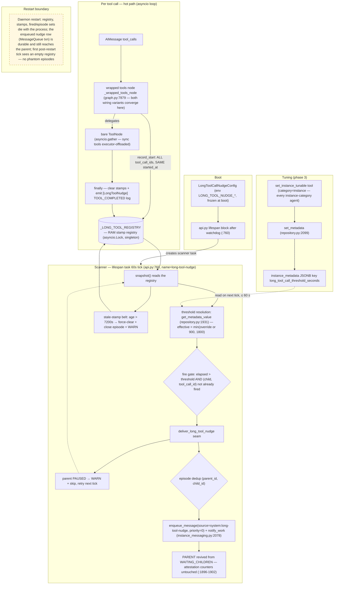

# Architecture Recommendation: Long Tool Call Detection → Parent Nudge

**Date:** 2026-09-13
**Kind:** Architect verification + enrichment pass (pre-review strengthening)
**Base:** `plan/long-tool-call-nudge` @ `0516e83e` (5-file plan set: `plan-overview.md`, `decisions.md` (36 ADs), `phase1/2/3-plan.md`)
**Analyst instances:** W1 fact-verification `76f460e4` (skill-less), W2 trade-off-analysis `18f992be`, W3 structural-design `7ad5f768`
**Deliverable status:** Complete — no gaps; all three dispatched analyses reported with path:line evidence.

---

## 1. Verdict Summary

| # | Item | Verdict | Headline | Key evidence |
|---|------|---------|----------|--------------|
| 1 | **AD-32** tool-registry cache timing | **VERIFIED — NUANCED** | Resolution is per-spawn AND per-restore; there is NO resolved-list cache. But meta.json is snapshotted **once per process** (registry singleton, no re-discover) — so BOTH a new tool and a `tools.allow` change require a **daemon restart**, after which **all** instances get them (restore rebuilds tools+graph), not "newly-spawned only" | `_tool_registry.py:15-18` (no cache), `instance.py:4492-4495, 4541-4544`, `instance_lifecycle.py:1611/:1714/:3892/:3995`, `manager.py:462`, `registry.py:1174-1175, 551-563` |
| 2 | **AD-35** exposure set | **VERIFIED + DECIDED** | Exposure is **category-wide by construction**: every agent whose active meta.json allows `"instance"` receives the tool automatically (~15 agents today, incl. tester, governor, architect, coder). planner[v2]/developer[v2] **already allow** `"instance"`; base planner/developer do not; worker is denied by the team-membership gate regardless. **Decision: accept category-wide exposure; drop the unconditional meta.json one-liners** | `instance.py:1786-4134` (7 instance-category tools), W1 exposure matrix, `instance.py:582/:1812-1814` (team gate) |
| 3 | **AD-36** metadata read API | **VERIFIED** | `get_metadata_value(instance_id, key) -> Any \| None` — sync, single-key, no row hydrate, `None` on missing row/NULL/absent key, JSON re-parse at `:1980`. It is the correct scanner read. Write path `set_metadata(instance_id, key, value) -> Instance \| None` (`:2099`), `set_metadata_many` (`:2175`) | `repository.py:1931-1982, 2099, 2175` |
| 4 | **AD-34** bounded bash timeout | **DECIDED — STRICTLY DEFER** | The bash tool **already has** a per-call `timeout` kwarg (default **1800 s**, cap 1800, enforced `asyncio.wait_for` at `bash.py:327`). The incident ask is a *default-policy* change, not new machinery. A hard timeout is non-advisory and crosses every agent's every bash call → separate feature, exact ticket below | `bash.py:204, 215, 225-226, 327` |
| 5 | **AD-3** per-batch stamping | **CONFIRMED** | `ToolNode._arun_batch` dispatches via `asyncio.gather` (`tool_node.py:843-846`) — per-call start unavailable without reimplementing dispatch. Overestimation is the conservative direction; false positives recoverable, false negatives not | `tool_node.py:843-846`; `decisions.md:36-44` |
| 6 | **Missed-`tool_end` suppression** (AD-9 limitation / "R2") | **DECIDED — ADD cheap belt (AD-9a)** | Stamp-TTL force-close at `4 × HARD_MAX = 7200 s`: force-clear stamp + close episode + re-arm fired-set + WARN. Zero false-positive risk (legitimate in-flight stamps cannot outlive their task), closes the silent-suppression failure mode for ~10 LOC + 1 test | W2 tie-break on Risk axis; belt spec §3.3 |
| 7 | **AD-11** `priority=0` | **CONFIRMED** | Reset branch is exactly `priority == 1 AND msg_type == HUMAN.value` (`instance_messaging.py:1896-1902`, intent comment `:1889-1893`). `priority=0` also queue-jumps ahead of priority-1 rows (claim `ORDER BY priority ASC`, `message_queue/repository.py:184`) — **intended** for system advisories; watchdog wedge-notice precedent uses the same lane | `instance_messaging.py:1896-1902`; `message_queue/repository.py:184` |
| 8 | **AD-14** RAM-only restart | **CONFIRMED** | ≤1 duplicate nudge post-restart is benign; first post-restart tick sees an **empty registry** (no phantom episodes — tool calls die with the process); the enqueued nudge row is durable (`MessageQueue`+`Task` one txn, commit `:1939`) | W1 + W3 lifetime analysis |
| 9 | **AD-12** PAUSED-parent skip | **DECIDED — semantics sharpened, plan text fix** | Skip is **retry-every-tick-while-paused, fire-on-resume** (the stamp-level fired-set is only set on a *successful* fire), NOT one-shot-lost. Pause-cascade ends the stamp (child task cancelled → `finally` clears) → episode never opens — acceptable, operator present | `phase2-plan.md` Task 3 ordering; `instance_lifecycle.py:2876` |
| 10 | **Detection placement** (AD-1) | **CONFIRMED — Approach A** | Single `add_node("tools", ToolNode(...))` site (`graph.py:7879`); both wiring variants converge (`:8089-8114` watched via `should_end_watchover` → `"tools"`; `:8128-8131` fallback unconditional edge); **zero** tool execution outside the ToolNode; Approach C structurally blind (worker threads claim whole tasks, `worker_pool.py:166/:289`) | `graph.py:7879, 8089-8114, 8131, 8135-8142`; `worker_pool.py:166, 289` |
| 11 | **Phase boundaries** | **DECIDED — re-slice** | Move `LongToolCallNudgeConfig` (~30 LOC) **and** the `HARD_MAX_THRESHOLD_SECONDS` constant into Phase 1 so Phase 1 boots self-contained; Phase 2 becomes delivery-only; Phase 3 then depends only on Phase 1 (2/3 fully parallel) | `phase1-plan.md:157`; `decisions.md:164-170, 282-286` |

---

## 2. Verification Findings (detail)

### 2.1 AD-32 — tool-registry resolution timing (Phase 3 rollout claims)

**Fact chain (W1, all verified at `0516e83e`):**

1. Tool lists are resolved **per spawn and per restore-from-DB**: both paths call `create_instance_tools(...)` (`instance_lifecycle.py:1611` spawn, `:3892` restore) which runs `scan_tools_for_full_docs` then `_apply_tool_filter` (`instance.py:4492-4495`); category expansion reads the **live** registry at call time (`instance.py:282` → `list_tools_by_category()` ← `_tool_metadata`, `_tool_registry.py:240-252`).
2. There is **no resolved-list cache anywhere** — the only module-level state is the doc registries `_full_docs` / `_tool_metadata` (`_tool_registry.py:15-18`).
3. **But** `agents/*/meta.json` is read **once per process**: `get_registry()` builds `AgentRegistry` and calls `discover()` only when the singleton is `None` (`registry.py:1174-1175`); meta.json contents are snapshotted into `_agents`/`_versioned_agents` (`registry.py:551-563`). No runtime re-discover exists.
4. The compiled graph is cached per instance (`manager.instances: dict[str, tuple[CompiledStateGraph, str]]`, `manager.py:462`; written at `instance_lifecycle.py:1893/:3620`). `build_instance_graph` is invoked from exactly two production sites — spawn (`:1714`) and restore (`:3995`) — never per turn.

**Rollout consequence (corrects the plan's mitigation text):** adding `set_instance_tunable` (code) and/or adding `"instance"` to a meta.json affects **no instance in the running process** — not even *new* spawns, because the registry serves the stale meta.json snapshot. A **daemon restart is required for both**; after restart, **every** instance gets the change (spawn-path for new, restore-path rehydration for pre-existing), not "only newly-spawned instances" as `plan-overview.md:107` currently implies. The plan's Activation section ("daemon restart required") is already correct; only the AD-32 mitigation wording needs the fix (AM-1).

**Correction on `:696-700`:** that list is the tail of `KNOWN_TOOL_NAMES: frozenset` (`_tool_registry.py:559-739`) — a **static boot-validation universe** ("false-positive 'unknown tool' warnings on agent boot", `:536-537`), NOT an exposure gate and NOT category membership. Phase 3 Task 4 (adding the name there) remains correct but its *purpose* must be documented as validation completeness, not exposure (AM-2).

### 2.2 AD-35 — exposure set and spawn capability

**Verified matrix (W1):**

- `"instance"` category resolves to 7 tools: `spawn_instance`, `send_message`, `subtree_messages`, `subtree_status`, `terminate_instance`, `list_instances`, `get_instance_info` (`instance.py:1786-4134`).
- Holders of `"instance"` in the active-version meta.json set: **leader, planner[v2], developer[v2], tester, governor, architect, approver[v2], coder, _mother, blueprinter, project-manager, reviewer[v2], tidier[v2], wanderer** (non-exhaustive; W1 enumerated the agents/ tree).
- Base planner/developer do NOT list `"instance"` — but their **v2 variants do**, and v2 is the current lineage (project pattern notes: tester/developer/planner are v2).
- `worker` has `allow: []` (passes the filter) but is denied spawn by the team-membership gate (`instance.py:582`, deny-by-default `:1812-1814`). **tester CAN spawn today** (allows `"instance"`; team_members `['explorer','worker']`).

**Decision — exposure set.** Because exposure is category-resolution based (§2.1), shipping `set_instance_tunable` in category `"instance"` exposes it to **every instance-category holder automatically** — there is no per-agent opt-in to add and no practical way to subtract a single tool from a category (a new `"instance_tuning"` category was already rejected by AD-23). Therefore:

- **Accept category-wide exposure.** It is house-consistent: every holder already has strictly higher-privilege tools (`terminate_instance`, `spawn_instance`); a threshold-tuning tool writing one advisory metadata key (AD-24 blast radius already accepted) is the *least* privileged tool in the category.
- **Drop phase 3 Task 6's unconditional meta.json one-liners.** They are no-ops if v2 is the resolved version (planner[v2]/developer[v2] already allow `"instance"`) and target the wrong file if not. Replace with a verification step: resolve the *active* `version_tag` for planner/developer per project (`registry.get_version` with `get_resolved` fallback, `instance.py:4541-4544`) and add the line **only** to a variant that is actually resolved and missing the category (fallback documented in AM-3).
- **Document the effective exposure list** (leader, planner, developer, tester, governor, architect, coder, reviewer, tidier, wanderer, …) in `docs/long-tool-nudge.md` so the wider-than-plan surface is explicit at review time.

### 2.3 AD-36 — metadata API

- `get_metadata_value(self, instance_id: str, key: str) -> Any | None` (`repository.py:1931`) — **sync** `def`, single top-level key, does not hydrate the row; PostgreSQL `metadata ->> :key` (`:1950-1951`), SQLite `json_extract` (`:1955-1956`); returns `None` when the row is missing, the column is NULL, or the key is absent (`:1940-1942`); TEXT extraction is JSON-re-parsed via `json.loads` at `:1980` (try/except returns raw value `:1981-1982`). SQLite boolean-fidelity caveat (`:1968-1971`) is irrelevant for an int-seconds key.
- `set_metadata(self, instance_id, key, value) -> Instance | None` (`:2099`) — atomic single-statement dialect-aware UPDATE; returns the refreshed enriched Instance or `None` if missing. `set_metadata_many` (`:2175`) for N keys in one UPDATE.
- **Verdict:** the plan's read (`get_metadata_value`) and write (`set_metadata`) choices are both correct as pinned; no fallback path needed.

### 2.4 Delivery-seam anchor corrections (fold into phase-2 pin table — AM-10)

- `worker_pool.notify_work()` is called inside `enqueue_message` at `instance_messaging.py:2078` (after the `asyncio.to_thread(_prepare_enqueued_message, ...)` prelude, `:2029-2041`) — the plan's `:1987` citation is **docstring text**, not the call site.
- The counter-reset **writes** land at `:1901-1902`; the condition at `:1896-1902`; the intent comment at `:1889-1893` ("an internal caller stamping HUMAN with priority=0 fails the priority check") independently confirms the `priority=0` design.
- `MessageQueue` (`:1676-1687`) + `Task` (`:1701-1710`) commit in **one transaction** (`session.commit()` at `:1939`) — nudge durability claim confirmed.

---

## 3. Decisions (detail)

### 3.1 AD-34 — bounded bash timeout: **DEFER**, ticket shape below

**Deciding facts.** The daemon's bash tool already exposes a per-call `timeout` kwarg — `timeout: int | float | None = 1800` (`bash.py:204`), validated ≤ 1800 (`:225-226`), enforced via `asyncio.wait_for(proc.wait(), timeout=...)` (`:327`). So nothing structural is missing; the incident user's ask ("reduce timeout, 3-5 min good enough") is a **default-policy** change. Changing the default inside *this* feature would (a) violate its advisory-only contract (a hard timeout cancels the call — an action, not an advisory), (b) cross every agent's every bash call including legitimate long operations (this repo's own pytest suite, migrations, playwright), and (c) entangle two reviewable blast radii in one merge. The nudge path already bounds the *visibility* gap (≤ threshold + ~60 s to parent notice).

**Follow-up ticket (file separately; do NOT block this feature on it):**

```
Title:  Reduce bash tool default per-call timeout from 1800s to 300s (policy change)
Scope:  daemon/tools/bash.py ONLY — change the `timeout` default from 1800 to
        env-resolved int(os.environ.get("ENSEMBLE_BASH_DEFAULT_TIMEOUT_SECONDS", "300")).
        Do NOT touch the 1800 hard cap, the per-call kwarg override surface, the
        7200s graph-task cap, or any other tool.
Policy questions to settle in that ticket's review:
        - default 300s vs 180s (user said "3-5 min");
        - whether agents' prompts/tools_note need a one-line hint that long ops
          should pass an explicit timeout (prompt-file change, separate consent);
        - whether the nudge notice §(b) should then gain one cross-ref line
          (would require an AD-8 structure amendment — keep OUT until shipped).
Blast-radius checklist:
        [ ] full pytest suite green (any single test >5min must pass explicit timeout)
        [ ] migration + playwright runs audited for long single bash calls
        [ ] no LLM-facing schema change beyond the default value
        [ ] regression pin: TestBashDefaultTimeoutRespectsEnv (env default, override, cap)
Acceptance: default = 300 via env with ge=1 le=1800 validation; kwarg still wins;
            cap unchanged; kill-switch = the env var itself (set 1800 to restore).
```

**Note:** the v1 nudge notice text must NOT reference this env var yet (AD-8 locks the 5-section body; referencing a non-existent feature confuses parents). The cross-ref belongs to the future ticket, as captured above.

### 3.2 AD-3 — per-batch stamps: **CONFIRMED** (no change)

`ToolNode._arun_batch` gathers per-call coroutines (`tool_node.py:843-846`); a node-level wrapper sees only batch boundaries. bd4b36ef's five long bash calls were five separate AIMessages (one call each) — the common case has no co-batching, and when co-batching occurs the batch contains the very slow call the feature must catch. Overestimation only inflates *other* ids in the same batch toward a threshold the slow call has already crossed — conservative. Per-call attribution stays the named future refinement (AD-33). Docstring + test pin as planned.

### 3.3 Missed-`tool_end` suppression: **ADD the cheap belt (new AD-9a)**

Accepted limitation today: a stamp that never clears keeps its `(parent, child)` episode open forever → a genuinely-new long call on that pair is silently suppressed. The `finally` contract + test pins make leaks unlikely, but leak classes exist that tests cannot forever prevent (future wrapper regression, registry bug, kill-path races).

**Belt spec (new AD-9a):** at the end of each `run_once`, the scanner sweeps `registry.snapshot()` and for any stamp with `age > 4 × HARD_MAX_THRESHOLD_SECONDS` (= 7200 s):
`registry.clear(...)` (force-clear) → `_active_episodes.discard((parent, child))` (close) → `_fired_episodes.discard((child, tool_call_id))` (re-arm) → `logger.warning("[LongToolNudge] STALE_STAMP force-cleared ...")`.

Why zero false-positive: a *legitimate* in-flight stamp cannot exceed the graph-task lifetime — the process's task supervision cancels it first — so a >7200 s stamp is by definition a leak. Belt cost ≈ 10 LOC + `TestScannerStaleStampForceCloses` (synthetic age 7300 s → force-cleared on next tick; a fresh `tool_call_id` on the same child fires normally afterwards).

**Two implementation riders:**
1. Define the TTL as `4 × HARD_MAX_THRESHOLD_SECONDS` — a module constant (`STALE_STAMP_TTL_SECONDS`), **not** "the task cap". W2 observed `constants.py:36 TASK_TIMEOUT_S: int = 300` while the incident forensics and `MainLoopBridge.run_async(timeout=...)` (`worker_pool.py:546/:1304`) indicate a 7200 s effective cap — the source of the effective cap was not reconciled; decoupling the belt from it removes the dependency on that unresolved question (implementer pin P-1).
2. Hygiene sweep in the same pass: discard `_fired_episodes` entries whose `(child_id, tool_call_id)` no longer appears in the snapshot — prevents unbounded set growth from any clear-path that bypasses the scanner's bookkeeping.

### 3.4 `priority=0` — **CONFIRMED** (with one rationale addition)

Condition verified verbatim (`:1896-1902`); `priority=0` bypasses the reset. Side effect: claim order is `ORDER BY priority ASC, enqueued_at ASC` (`message_queue/repository.py:184`) — priority-0 nudges are claimed **ahead of** priority-1 user messages, including cross-instance scans. This is intended (system advisories should not queue behind user traffic) and matches the watchdog wedge-notice precedent. No change; add the queue-jump sentence to AD-11's rationale (AM-6).

### 3.5 RAM-only restart × PAUSED-parent skip — **CONFIRMED + text fix**

- **Restart:** ≤1 duplicate nudge accepted (AD-14); first post-restart tick iterates an empty registry — no phantom episodes (both the tool call and its RAM tracking die with the process).
- **PAUSED parent (sharpened):** `deliver_long_tool_nudge` returns `False` on PAUSED **before** `_active_episodes.add` — and the stamp-level `_fired_episodes` is only set on a *successful* fire — so the scanner **re-attempts delivery every tick** while the stamp stays alive and the parent stays PAUSED, and fires promptly on resume with elapsed/threshold read from the live stamp (fresh numbers, not stale). The plan's "single WARN" wording must become "one WARN per tick while paused (bounded in practice: pausing the parent cascades to the child, whose cancelled task clears the stamp via `finally`, ending the retry loop)" — AM-7.
- **Pause cascade:** `pause_instance_cascade` (`instance_lifecycle.py:2876`) pauses children too; a child paused mid-tool has its task cancelled → `finally` clears stamps → episode never opens → no nudge. **Acceptable**: the operator performing the pause is present and is the canonical decision-maker. Documented in AD-12 text.

### 3.6 Phase boundaries — **re-slice (config + constant move to Phase 1)**

Problem confirmed by two workers independently: Phase 1's lifespan ctor reads `config.long_tool_nudge.*` which **does not exist** today (`grep` negative in `daemon/config.py`) and is owned by Phase 2/3 — Phase 1 merged alone boots the scanner-dead with an ERROR line ("construction failed"), and W3 flags the same coupling as a 🔴 risk ("Phase 1 + config must land as one deployment unit").

**Re-slice (AM-8):**
- **Phase 1 Task 1 (module)** additionally defines `HARD_MAX_THRESHOLD_SECONDS = 1800` (moves here from Phase 2 Task 1 — AD-30's canonical home is unchanged, only its landing phase).
- **Phase 1 Task 7a (new):** `LongToolCallNudgeConfig(BaseSettings)` — `enabled: bool = True`, `interval_seconds: int = Field(default=60, ge=1)`, `default_threshold_seconds: int = Field(default=900, ge=1, le=HARD_MAX_THRESHOLD_SECONDS)`, `env_prefix="LONG_TOOL_NUDGE_"` — wired on `EnsembleConfig` as `long_tool_nudge: LongToolCallNudgeConfig = Field(default_factory=...)` between `ReportIntegrityConfig` and `LanguageConfig` (AD-16 placement unchanged). Phase 1 config/env tests (U14-U16 content) move with it.
- **Phase 2** drops the class + constant definitions; owns delivery only (seam body, notice builder, episode state, A5 notify, priority/PAUSED semantics, restart docs).
- **Phase 3** then imports `HARD_MAX_THRESHOLD_SECONDS` from a module that landed in Phase 1 → **Phase 3 depends only on Phase 1**; the `plan-overview.md:41` stub-until-merge caveat disappears; Phases 2 and 3 become fully parallel after Phase 1.
- Test suites were already self-contained per phase; after the re-slice each phase's merge is bootable and independently verifiable (Phase 1: stub-fire observable end-to-end; Phase 2: real delivery; Phase 3: tool + exposure).

---

## 4. Architecture Enrichment

### 4.1 Component & data-flow diagram (validated Mermaid)



### 4.2 Lifespan wiring (startup + shutdown)

Verified template (W1 + W3 agree): watchdog block `api.py:713-758` — lazy import → `try:` ctor → `except:` `app.state.waiting_children_watchdog_task = None` + ERROR `exc_info=True` → `else: if enabled: asyncio.create_task(..., name=...)` + INFO start log; disabled → `None` + "disabled by config". Sequence context: `manager.setup_worker_pool()` runs early (`api.py:322`); OrphanWatcherSweep block before (`:655-686`); `reconcile_terminal_watches()` after (`:761-762`); shutdown cancels+awaits the watchdog task at `:1244-1256` before `manager.shutdown()` (`:1300`).

**Insertion spec for the nudge block (Phase 1 Task 7):**

- Startup: immediately after the watchdog block (`:759/760`). Construct `LongToolNudgeScanner(instance_repository=<shared SQLModelInstanceRepository>, registry=_LONG_TOOL_REGISTRY, manager=manager, enabled=config.long_tool_nudge.enabled, interval_seconds=..., default_threshold_seconds=...)` inside `try/except` → on failure `app.state.long_tool_nudge_task = None` + ERROR; on success + enabled → `asyncio.create_task(run_long_tool_nudge_loop(...), name="long-tool-nudge")`, store on `app.state`, INFO `Long-tool-nudge scanner started: interval=…s, default_threshold=…s`; disabled → `None` + `"Long-tool-nudge scanner disabled by config"`.
- **Import the module-level `_LONG_TOOL_REGISTRY` singleton explicitly** in the lifespan block — the wrapper (graph.py) and scanner MUST share one instance; per-graph or per-ctor allocation silently no-ops the whole feature (pinned by T8 `id()` identity test).
- **Reuse the existing `SQLModelInstanceRepository` instance** constructed for the watchdog block rather than building a second engine-holding repo (AD-20 wording; verify at implementation).
- Shutdown (after the watchdog cancel/await at `:1256`, before `manager.shutdown()`): `task = getattr(app.state, "long_tool_nudge_task", None)`; if alive → `cancel()` → `await` with `except asyncio.CancelledError: pass` / `except Exception: WARN` → set `app.state.long_tool_nudge_task = None`. The `getattr` guard survives partial-startup failures.

### 4.3 Thread/loop safety of the RAM registry — `asyncio.Lock` is correct

**Substrate (verified):** worker threads are `threading.Thread` (`worker_pool.py:166`) that claim whole tasks (`:289`) and bridge graph execution onto the **uvicorn lifespan loop** via `MainLoopBridge.run_async` → `asyncio.run_coroutine_threadsafe(coro, loop)` (`task_processor.py:1304`; `main_loop_bridge.py:83`), with the loop captured at `manager.initialize()` (`manager.py:2345`) and installed in `setup_worker_pool` (`:6265`). ToolNode's async path gathers on that loop (`tool_node.py:846`); **sync** tools are executor-offloaded (`langchain_core tools/base.py:801` `run_in_executor`), running on threadpool threads.

**Why the hazard doesn't reach the registry:** the wrapper is the *node body* — it executes on the asyncio loop, one stack frame **above** tool dispatch. `record_start` (pre-batch) and the `finally`-clear (post-batch) run on the loop regardless of whether the underlying tools are async (loop) or sync (executor threads — the wrapper never executes there). The scanner's `snapshot()` is also loop-side. All three registry touch-points are on one loop → **`asyncio.Lock`** (serializes across `await` yield points); `threading.Lock` would be a structural anti-pattern here (it cannot be awaited and would block the loop).

**Snapshot safety:** `snapshot()` returns a shallow copy as a single synchronous step (no `await` between copy and return) — no coroutine interleaves mid-copy; the scanner then iterates the copy **outside** the lock. Phase-1 T1 (50 gather-writers + 1 snapshot reader) pins exactly the real hazard.

**Latent hazard to pin (AM-9):** if a future change moves stamping *inside* a per-tool callable (e.g. a ToolNode `wrap_tool_call` hook, `tool_node.py:749-750`), sync tools would then touch the registry from executor threads where `asyncio.Lock` deadlocks. Add to T4 an assertion that `record_start` observes `asyncio.get_running_loop()` — cheap insurance against that refactor class.

### 4.4 Wrapper contract — both wiring variants

- **Both variants verified to converge:** watched `agent → (conditional) → watchover_check → should_end_watchover → "tools"` (`graph.py:7899`, `:8089-8114`) and manager-less fallback with unconditional `add_edge("tools", "agent")` (`:8128-8131`). The post-tools router (`create_post_tools_router`, defined `:5985`, wired `:8135-8142`) reads only `manager.is_question_pause_requested(...)` — it routes; it never invokes tools.
- **Callable shape:** LangGraph `add_node` accepts a Runnable or a plain async function `(state, config) -> result`. The wrapper needs **no `writer` kwarg** — stream-writer access arrives via config, not the node signature. Phase-1 Task 3's `(state, config=None, *, writer=None, ...)` wording should be simplified to `(state, config)` delegating to `ToolNode.ainvoke` (AM-9).
- **instance_id extraction:** `config["configurable"]["thread_id"]` **is** the instance id — verified at every graph invocation surface (`instance_lifecycle.py:1685/:2653/:3953`, `instance_messaging.py:1068/:1357/:1371/:2657`, `manager.py:2254/:8921/:8942`).
- **Empty tool_calls is unreachable:** the `should_continue` routers (`graph.py:2499/:2911`) route to END/agent when the AIMessage has no tool_calls; the tools node is never entered call-less. The wrapper's loop is defensively empty-safe anyway.
- **Verbatim return is non-negotiable:** `_combine_tool_outputs` (`tool_node.py:850-889`) yields `list[ToolMessage]`, `{messages_key: [...]}`, or mixed `Command` lists depending on input type; the post-tools router and agent node consume that shape. The wrapper returns `await ToolNode.ainvoke(state, config)` untouched — no inspection, no reformatting, no "harmless" logging of output shapes.
- **Retry/resume re-entry:** under `astream` each node runs once per superstep; checkpoint resume does not re-execute a completed tools node. If the node was cancelled mid-flight (pause / task-cap timeout), the `finally` has already cleared stamps and resume re-stamps fresh (`elapsed since resumed dispatch`). In the rare window where stamps survived an interrupted first attempt, **first-stamp-wins idempotency (T1) preserves the original `started_at`** — the correct semantics for the burn this feature exists to catch (elapsed since first dispatch). Both behaviors are right; no change.
- **Exception paths:** `handle_tool_errors=True` turns tool errors into ToolMessages (normal clear); `CancelledError` (pause-cancel) and `asyncio.TimeoutError` (task cap) propagate through the wrapper — `finally` runs on both (Python guarantees `finally` on `BaseException` propagation). Exception-path clearing is test-pinned (`TestWrappedToolsNodeExceptionClearsStamps` / `...CancelClearsStamps`).

### 4.5 Component lifetime matrix

| Component | Lifetime | Created at | Cleared at | Survives restart |
|---|---|---|---|---|
| `_LONG_TOOL_REGISTRY` singleton | process | first import of `daemon.services.long_tool_nudge` (graph build / lifespan) | process exit | ❌ |
| Wrapper closure (per graph) | per instance-graph | `build_instance_graph` at spawn (`instance_lifecycle.py:1714`) / restore (`:3995`); graph cached in `manager.instances` (`manager.py:462`) | instance cache eviction / cleanup | ❌ (rebuilt on restore) |
| Scanner task | app lifespan | `asyncio.create_task(name="long-tool-nudge")` after ctor success | shutdown cancel/await (`:1256`-pattern) | ❌ |
| `LongToolCallNudgeConfig` | boot (env-frozen) | `load_config()` | process exit | ❌ (env re-read) |
| Stamp `_Stamp` | per tool call | wrapper `record_start` (batch entry) | wrapper `finally`-clear / belt force-clear | ❌ |
| `_fired_episodes` / `_active_episodes` | process | first fire / first delivery | stamp-clear + `close_episode` / belt / process exit | ❌ (accepts ≤1 duplicate nudge) |
| Nudge row (MessageQueue + Task) | durable | `enqueue_message` commit (`instance_messaging.py:1939`) | queue lifecycle settle | ✅ |

**First post-restart tick:** empty snapshot → zero stamps → zero fires. In-flight tools died with the process; no phantom episodes; the already-enqueued nudge still reaches the parent. Coherent by construction.

---

## 5. Plan Amendments (concrete deltas for the implementer)

> Amend the plan files with these; do not treat this recommendation file as the plan's replacement.

- **AM-1 — `plan-overview.md` risk row (AD-32) + `phase3-plan.md` Task 7.** Replace "if per-spawn, document that meta.json changes affect only newly-spawned instances" with: *"Tool lists resolve per spawn AND per restore (no resolved-list cache), but meta.json is snapshotted once per process (registry singleton, no runtime re-discover). BOTH the new tool and any tools.allow change therefore require a daemon restart; after restart ALL instances receive them — new via the spawn path, pre-existing via restore-path rehydration (instance_lifecycle.py:1611/1714/3892/3995)."* Mark AD-32 RESOLVED with this text.
- **AM-2 — `phase3-plan.md` Task 4.** Add purpose note: the `KNOWN_TOOL_NAMES` entry (`_tool_registry.py:559-739`) is **boot-validation completeness** (suppresses false-positive unknown-tool warnings), NOT the exposure mechanism; exposure comes from `@register_tool_category("instance")` + factory inclusion + the agent's active `tools.allow`.
- **AM-3 — `phase3-plan.md` Task 6 + `decisions.md` AD-23/AD-35.** Replace the two unconditional meta.json one-liners with: (a) resolve the ACTIVE `version_tag` per agent (planner[v2]/developer[v2] already allow `"instance"` — likely zero edits); (b) add `"instance"` only to a variant that is actually resolved and missing it; (c) document in `docs/long-tool-nudge.md` that exposure is category-wide — effective holders today: leader, planner, developer, tester, governor, architect, coder, reviewer[v2], tidier[v2], wanderer, approver[v2], _mother, blueprinter, project-manager. Mark AD-35 RESOLVED: exposure set = category-wide (accepted; least-privilege tool in the category; AD-24 stance unchanged).
- **AM-4 — `decisions.md` AD-34 + `plan-overview.md` Open Questions.** Mark AD-34 DECIDED — STRICTLY DEFER; embed the follow-up ticket block from §3.1 verbatim; note the v1 notice text must NOT reference the future env var (AD-8 structure locked).
- **AM-5 — `decisions.md` new AD-9a + `phase1-plan.md` new T10.** Stamp-TTL force-close belt per §3.3: `STALE_STAMP_TTL_SECONDS = 4 × HARD_MAX_THRESHOLD_SECONDS` (7200), end-of-`run_once` sweep, force-clear + close + re-arm + WARN; plus the `_fired_episodes` orphan-entry hygiene discard; test `TestScannerStaleStampForceCloses`.
- **AM-6 — `decisions.md` AD-11 rationale.** Append: "priority=0 also preempts priority-1 rows in claim order (ORDER BY priority ASC, message_queue/repository.py:184) — intended for system advisories; same lane as watchdog wedge notices."
- **AM-7 — `decisions.md` AD-12 + `phase2-plan.md` Task 3(a) comment.** Replace the PAUSED-skip wording with §3.5's clarified semantics: retry-every-tick-while-paused (fired-set only set on successful fire), fire-on-resume with fresh numbers; pause-cascade ends the stamp (acceptable — operator present); WARN is per-tick while the condition holds, bounded by the cascade clearing the stamp.
- **AM-8 — phase re-slice.** (a) `phase1-plan.md` Task 1: module also defines `HARD_MAX_THRESHOLD_SECONDS = 1800` (canonical home per AD-30 unchanged; landing phase moves 2→1). (b) `phase1-plan.md` new Task 7a: `LongToolCallNudgeConfig` + `EnsembleConfig` wiring per §3.6 (env prefix `LONG_TOOL_NUDGE_`, defaults 900/60, `le=HARD_MAX_THRESHOLD_SECONDS` imported from the services module); config/env tests move to phase 1. (c) `phase2-plan.md` Task 1/7: drop class + constant definitions; phase 2 owns delivery only. (d) `plan-overview.md` Phase table + `:41` parallelism note: Phase 3 now depends only on Phase 1; Phases 2/3 fully parallel after Phase 1; landing order 1 → (2 ∥ 3).
- **AM-9 — `phase1-plan.md` Task 3 + T4.** Wrapper signature simplified to the LangGraph node shape `(state, config)` delegating to `ToolNode.ainvoke` (no `writer` kwarg); add T4 assertion `asyncio.get_running_loop()` inside `record_start` (guards the §4.3 latent executor-thread hazard).
- **AM-10 — `phase2-plan.md` verified-pin table.** Correct: `notify_work()` internal call is `instance_messaging.py:2078` (`:1987` is docstring text); counter-reset writes at `:1901-1902` (condition `:1896-1902`, intent comment `:1889-1893`); metadata JSON re-parse `json.loads` at `repository.py:1980`.
- **AM-11 — `phase1-plan.md` lifespan task.** Make explicit: import the module-level `_LONG_TOOL_REGISTRY` singleton in the api.py block (shared instance with graph.py — T8 `id()` pin); reuse the watchdog's `SQLModelInstanceRepository`; shutdown mirror after `api.py:1256` with `getattr` guard (§4.2).

---

## 6. Risks

- 🔴 **Per-graph registry allocation** (if a future edit allocates inside `_wrapped_tools_node`) — feature silently no-ops; already pinned by T8 identity test; keep the pin.
- 🟡 **Category-wide exposure is wider than the plan stated** (~15 agents vs leader+planner+developer). Accepted by construction (AM-3); the review must see the documented list — blast radius is one advisory-threshold metadata key behind a tool strictly less privileged than `terminate_instance`, which every holder already has.
- 🟡 **Effective graph-task-cap source unreconciled** (`constants.py:36 TASK_TIMEOUT_S=300` vs the 7200 s observed in incident forensics / `MainLoopBridge.run_async`). Belt decoupled from it (P-1); implementer should pin the effective timeout source when writing T10.
- 🟢 **Latent sync-thread hazard** if stamping ever moves inside a per-tool callable — T4 loop-identity assertion (AM-9) makes the invariant loud.
- 🟢 **`concurrent.futures.CancelledError` translation at the await boundary** is a runtime detail; T4 pins the asyncio variant; pause-cascade suite covers the rest.

## 7. Decisions Pending / Implementer Pins

- **P-1:** Pin the effective graph-task timeout source (which constant/config feeds `MainLoopBridge.run_async(timeout=...)`) when implementing AD-9a; keep `STALE_STAMP_TTL_SECONDS` independent of it.
- **P-2:** During Phase 3 Task 7, resolve the active `version_tag` for planner/developer per project default and apply AM-3's conditional edit (or zero edits if v2 resolves).
- **P-3 (informational):** `agent`-node downstream consumption of ToolNode output shape was structurally traced (router + verbatim-return contract) but not exhaustively; `TestWrappedToolsNodeNoBehaviorChange` already pins it — keep that test strict (identical output shape on a mock tool).

## 8. Gaps & Confidence

No gaps — all three dispatched analyses reported. **Confidence: High** on items 1-3, 5-10 (code-verified anchors); **Medium-High** on AD-34-defer and the belt (judgment calls on verified facts; flip conditions stated in §3.1/§3.3). The recommendation on exposure (AM-3) would flip only if the owner insists on a narrower set — which requires the new-category path AD-23 rejected.
