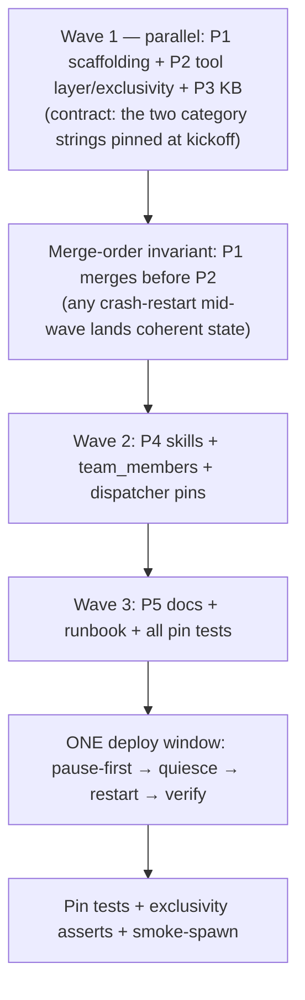

# Architecture Recommendation: Maintenancer Agent

Date: 2026-09-08
Status: Additive enrichment + adjudication layer over `plan-overview.md` + `decisions.md` (planner files untouched)
Method: 3-dimension read-only worker analysis (data-flow / structural / resilience), aggregated on the five fixed axes (Complexity, Scalability, Maintainability, Risk, Cost). All load-bearing claims carry file:line evidence verified in this worktree (`plan/maintenancer-agent`).

---

## 1. Executive Summary

The planner's plan is structurally sound — 13 MADE decisions stand, 4 of 5 OPEN decisions resolve to the planner's own recommendation (two with material refinements), and 1 (OPEN C) resolves to a **refined variant** that drops the separate audit connection. Three defects require plan correction before implementation: **(1)** the de-scope list misses `agents/developer[v2]/meta.json`, so exclusivity fails its own success criterion; **(2)** Phase 1's standalone restart (task 1.10) forces two restarts and a 4-holder exclusivity window — restructure into 3 waves with ONE restart window; **(3)** the `kb-curator` skill's "records via experience() on startup" is architecturally impossible (skills are static prompt text; no startup hooks exist) — reframe to a tiered KB design.

### Adjudication of OPEN decisions

| # | Decision | Verdict | One-line rationale |
|---|----------|---------|-------------------|
| **A** | Restart/upgrade autonomy | **Option 1, refined** — grant `system_upgrade` (NOT `system_restart`) with the same 3-factor gate | The gate is instance-bound and satisfiable by a legitimate maintenancer via in-thread user nonce echo (`upgrade_tools.py:1870-1886`) — real per-op-authorized autonomy, not just attack surface. `system_restart` refuses live in code regardless (`:1459-1465`) — granting it adds confusion, zero capability. |
| **B** | Log exclusivity (worker) | **Option 1** — keep worker's `system-log`; formalize worker as the designated break-glass | Stripping breaks log-driven debugging for 12 dispatcher agents; a dedicated `maintenance-worker` (Opt 3/4) buys prompt-discipline that code cannot enforce. Worker retention is ALSO the SPOF backstop (§8.1). Revisit split on usage evidence. |
| **C** | `ens_db_*` write policy + pools | **Option 4′ (refined hybrid)** — shared engine for SELECT; dedicated repair pool (2+3); audit in the SAME transaction on the repair connection (drop the planner's separate 1+0 audit connection) | A separate audit connection breaks audit atomicity: worst case is a committed prod repair with no audit row — the exact event the audit exists to prevent. Fail-closed on audit-write failure. |
| **D** | Watcher side-effect | **Option 1** — accept the strip | Planner's audit independently re-verified: zero `system-log`/`ens_system_log` references across `agents/watcher/` (all 6 files) and `daemon/services/watchover_service.py`. Record the one-line commit comment. |
| **E** | KB composition path | **Modified Option 4 (tiered)** — KB index in prompt (via `memory.md`, already planned as task 1.7) as the load-bearing guarantee; filesystem full-text reads as the content path; RAG mirroring as a best-effort first-turn duty | "All three paths at full strength" is infeasible: skill-content inclusion of the full 12k chars costs ~3k tokens per turn, and startup auto-recording is impossible (no execution hooks). Tiered roles match each mechanism's actual guarantee. |

---

## 2. Phase Dependency Graph + Scheduling (Focus 1)

### 2.1 What a restart actually activates

All three mutation surfaces are **boot-frozen**; nothing hot-reloads:

- Agent registry: `_registry` module global, `discover()` runs once (`daemon/registry.py:1167-1190`); per-spawn resolution reads the in-memory snapshot via `get_version(...) or get_resolved(...)` (`daemon/tools/instance.py:4539-4541`), never the file.
- `PRIVILEGED_TOOL_CATEGORIES` frozenset (`daemon/tools/_tool_registry.py:106-108`) and `CATEGORY_MODULES` (`:459`) are module-level — import-bound.

Therefore ONE restart activates: new agent dirs, all meta.json edits (allows, de-scopes, team_members), the frozenset change, and the category-module wiring — atomically.

### 2.2 Deploy-window gap analysis

**No zero-holder window is possible.** Pre-restart, the running process keeps the OLD frozenset — `system-log` is not yet privileged, so stripping does not apply, and explicit allows keep working. At any crash-restart mid-merge, explicit allows still resolve; worker retention (OPEN B Option 1) backstops holders at ≥2 even post-promotion. Promotion never touches *explicit* allow entries — `_strip_privileged_category_tools` (`instance.py:4497-4514`, called `:4547`/`:4583`) strips only the empty-allow/default-allow paths.

**The real defects in the planner's sequencing:**
1. Task 1.10 restarts inside Phase 1 → restart #1 registers maintenancer WITH `system-log` while developer/wanderer/worker still hold it (4-holder exclusivity gap until restart #2 lands P2). Two restarts, one avoidable window.
2. Task 1.2's `ens-db` allow entry is inert until P2 exists (validation warning only, `registry.py:1178-1180`) — acceptable, but the plan should say so.
3. Rollback section (§Rollout Notes 6) is incomplete post-P2 — see §2.4.

### 2.3 Corrected wave structure

- **Wave 1 (P1 ∥ P2 ∥ P3):** file-disjoint (`agents/maintenancer/*` ∪ leader meta vs `daemon/tools/*` vs `knowledge/*.md`). The planner's "tight P1↔P2" coupling is a string contract only — the literal category names in 1.2's `tools.allow`. Drop task 1.10's standalone restart.
- **Wave 2 (P4):** needs P1's `team_members` + P3's section names for skill cross-refs.
- **Wave 3 (P5 + restart + pins):** single deploy window; exclusivity, registration, and `ens-db` activation land atomically.

### 2.4 Rollback completeness

Post-P2 rollback must revert, beyond the planner's list: the frozenset entry, the `CATEGORY_MODULES` entry, `DYNAMIC_TOOL_NAMES`/`KNOWN_TOOL_NAMES` regen (else the frozen-name drift test stays red and masks real regressions), the de-scopes, and the `create_ens_db_tools` wiring. **Executed repairs have no structural rollback** — DB mutations live outside graph checkpoints; the runbook must add a snapshot-before-repair step, with compensating idempotent `DO$$` forward-fix as the recovery recipe, discoverable via `repair_log.created_by`.

---

## 3. `ens_db_*` Tool-Family Architecture (Focus 2, Decision C)

### 3.1 Engine topology (Option 4′)

| Path | Engine | Pool | Timeouts |
|------|--------|------|----------|
| `ens_db_postgres_select`, `ens_db_inspect` | shared `manager.engine` (ONE engine daemon-wide, `manager.py:438-460`; ~16 repositories bound) | existing 5+10 pre-ping (`repositories/factory.py:202-208`) | per-transaction `SET LOCAL statement_timeout` inside the tool's own connection block + client-side `asyncio.wait_for` belt |
| `ens_db_repair_execute` | dedicated `create_engine` | **2+3**, `pool_pre_ping=True`, `pool_recycle=3600` | engine-level connect_args: `statement_timeout=60s`, `lock_timeout=10s`, `idle_in_transaction_session_timeout=60s` |
| audit | **same connection as the repair** | — | same transaction; fail-closed |

**Why not the ConnectionPoolManager/asyncpg path** (the `db_postgres_dml_select` precedent, `db_tools.py:487-530`): those tools resolve by `connection_name` against the user-facing connection registry, and the `db` category is NOT privileged. A synthetic `ensemble_prod` registration would make the daemon's own DB SELECT-able by every `db`-category holder — bypassing the `ens-db` exclusivity this plan exists to build. Rejected unless a hidden-connection mechanism is added (not justified at this scope).

**Thread-bridge caveats** (shared-engine reads): `asyncio.wait_for(asyncio.to_thread(...))` cancels the awaitable but does NOT abort the blocking psycopg call — the worker thread runs to server-side timeout. Hence server-side `statement_timeout` is the real cap (scoped via `SET LOCAL` in the tool's own tx — never engine-wide connect_args on the SHARED engine, which would cap every repository operation). `CancelledError` propagates via bare awaits (message_tap precedent); never wrap in `except BaseException`.

**Pool isolation does not isolate locks:** DDL holds `ACCESS EXCLUSIVE` — lock waits block all sessions regardless of pool. The dedicated pool isolates *connection* starvation only; the timeout posture above is what bounds lock blast radius. `pool_recycle=3600` + periodic `ANALYZE` mitigates the inherited PG planner-cache trap (generic-plan seq-scans on long-lived connections, `docs/runbooks/checkpoint-blob-prune-restore.md` §10).

### 3.2 Audit trail — same-transaction, fail-closed

Mirror the `InfraAssetHistory` pattern (`daemon/repositories/infra/models.py:301-394`: append-only, JSONB snapshot, `changed_by`, indexed on `(target, timestamp)`). New `repair_log` table **must** be created via `SQLModel.metadata.create_all` + `_ensure_postgres_columns` — NEVER via the migration runner (SQLite-only by design, `daemon/migrations/runner.py:486-491`).

Record shape: `id, created_at, created_by_instance_id, created_by_agent_id, sql_text, sql_class, sql_hash, dry_run, before_snapshot (JSONB), after_snapshot (JSONB), outcome ('previewed'|'committed'|'rolled_back'|'error'), error_message, target_table, nonce, ttl_expires_at`.

- **Before/after:** DML post-image via native `RETURNING *`; pre-image via shadow `SELECT ... FOR UPDATE` in the same tx. DDL records statement class + `DO$$` block hash + dry-run preview result (no row images exist).
- **Ordering:** audit `INSERT` in the SAME `BEGIN/COMMIT` as the repair, same connection. The planner's separate 1+0 audit connection creates two fatal states — repair committed + audit failed (un-audited prod change), or repair rolled back + audit committed (false attribution). **Audit-write failure ⇒ rollback. Fail-closed.**

### 3.3 Dry-run / confirm ergonomics

- DDL dry-run: `BEGIN; <DDL>; ROLLBACK;` wrapper. DML dry-run: same wrapper returning row-count projection + first ~100 affected-row preview.
- Confirm gate for repairs: **single-use nonce + TTL (5 min) + action-bound** (`kind='repair', target=<table/operation>`), borrowed from `upgrade_tools.py:1937-2006` primitives — but WITHOUT the human-relay factor: repairs are intra-process DB mutations where the agent IS the operator under Cardinal #2 (confirm-before-destructive directed at the leader/user in-thread). Implementation shape: the dry-run pass writes a `repair_log` row with `outcome='previewed'` + nonce; the confirm pass executes and flips the same row to `committed`/`rolled_back`/`error`.

### 3.4 Repository-methods vs raw SQL — the decision rule

**Use the existing service/repo method when one exists** (DLQ replay → `DeadLetterService.replay_from_dlq` `daemon/services/dead_letter_service.py:370`; watcher re-arm → `DependencyWatcherRepository.rearm_cancelled` `daemon/repositories/dependency_bus/repository.py:810-844`; sentinel heal seam → `_insert_deferred_marker` `daemon/repositories/report_injection/repository.py:756`; any `job_state_machine` transition). **Raw SQL is legitimate ONLY when** no service method exists AND the operation is idempotent + bounded + dry-run-previewable AND writes a same-tx audit row (canonical precedent: `manager.py:4996-5012`). **Raw SQL is a smell when** it bypasses a state-machine wrapper or mutates without audit. The tool should surface a "a service method exists for this class" warning in its dry-run output.

### 3.5 `ens_db_inspect` scope

Expose: public-schema tables (filter `table_schema='public'`), approximate row counts via `pg_stat_user_tables.n_live_tup`, column types, indexes, FK chains, pool status (`engine.pool.status()`), last-ANALYZE/autovacuum timestamps. Withhold: credentials (`has_password` boolean only — `db_tools.py:432-434` precedent), `pg_catalog` noise, role grants, other backends' SQL text.

---

## 4. Privileged Promotion Blast Radius (Focus 3, Decisions B+D)

### 4.1 Mechanism (confirmed)

Explicit allow **keeps** privileged categories post-promotion — category expansion adds every named category including privileged ones (`instance.py:316-322`). Stripping applies ONLY to: no-`tools`-config agents (`:4547`), empty-allow+empty-deny (`:4583`), and default-universe construction (allow empty, deny present: `:302-308`). The planner's D5 is sound; deny is the only override.

### 4.2 Definitive before/after table

| Agent | system-log today | After promotion (plan as written) | After correction |
|---|---|---|---|
| developer (base) | explicit allow | loses (plan de-scopes) | loses |
| **developer[v2]** | **explicit allow — planner missed this meta** | **KEEPS — exclusivity fails** | **loses (add `agents/developer[v2]/meta.json` to de-scope list)** |
| wanderer | explicit allow | loses | loses |
| worker | explicit allow | keeps (OPEN B) | keeps — designated break-glass |
| watcher | empty allow → default-open | loses (R-SR16 hole closes) | loses (by design) |
| all 32 other agents | never had it | gain nothing | gain nothing |
| maintenancer (new) | n/a | gains `system-log` + `ens-db` | same |

### 4.3 Versioned-meta gap (🔴 plan correction)

`developer[v2]` is a separate directory (`daemon/registry.py:27-45`) with its OWN `meta.json` whose allow contains `system-log`; tool resolution prefers `get_version(agent_id, tag)` over `get_resolved` (`instance.py:4539-4541`). De-scoping base developer only leaves `developer[v2]` instances holding logs — success criterion #2 fails. **Correction:** add `agents/developer[v2]/meta.json` to task 2.7, and make the post-change resolution pin test enumerate base AND versioned metas (the standing guard for future `developer[v3]`-class additions).

### 4.4 Registration/test gates (what the plan's inventory misses)

Binding steps for `ens-db` (from the 10-step checklist, `upgrade_tools.py:110-142`): 1 (factory + `@register_tool_category` ABOVE `@tool`), 2 (`CATEGORY_MODULES`), 3 (`DYNAMIC_TOOL_NAMES`), 4 (KNOWN_TOOL_NAMES regen + drift test `test_frozen_tool_name_discovery.py:223`), 5 (list-append in `create_instance_tools` — decorator-only registration is silently invisible), 7 (frozenset), 8 (meta allow + tools_note).

🟡 **Two exact-equality pins break on promotion and are absent from the plan's test inventory:** `tests/unit/tools/test_upgrade_registration.py:100` and `tests/unit/tools/test_attestation_registration.py:154` both assert `PRIVILEGED_TOOL_CATEGORIES == frozenset({"system_upgrade"})` — deliberate "silent additions visible" pins. They MUST be consciously updated in the same PR (this is the mechanism working as designed, not test debt).

### 4.5 OPEN B adjudication — five axes

| Option | Complexity | Scalability | Maintainability | Risk | Cost |
|---|---|---|---|---|---|
| 1 keep worker, accept leak | Low | High | High | Low-Med (leak bounded) | Low |
| 2 strip worker | Low | Med | Med | Med (12 dispatchers lose debugging loops) | Low |
| 3 dedicated maintenance-worker | Med | High | Med | Low | Med-High |
| 4 hybrid | Med-High | High | Low-Med (soft discipline) | Low-Med | Med |

**→ Option 1.** Exclusivity's goal is "maintenancer HAS the tools," not "logs are unreadable elsewhere." Worker retention is simultaneously the incident-time break-glass (§8.1). File the `maintenance-worker` split as a usage-evidence-triggered follow-up. Consequence for the plan: `team_members: ["explorer", "worker", "coder"]` stands; worker keeps `system-log` but NEVER `ens-db` (workers cannot write DB at all — pin in the 2.10 exclusivity test).

### 4.6 OPEN D — accept (audit double-verified)

Zero `system-log`/`ens_system_log` references in `agents/watcher/` (all 6 files) and `daemon/services/watchover_service.py`. Watcher's empty allow strips it at `:302-308`/`:4547`/`:4583`. Record the planner's commit comment; nothing else.

---

## 5. Autonomy / Safety Architecture (Focus 4, Decision A)

### 5.1 Gate mechanics (verified airtight for agent-held use)

The 3-factor gate (`upgrade_tools.py:1877-2036`): (F1) `user_confirmed`; (F2) per-instance user-origin window stamped ONLY from dispatch-funnel message **source** (`manager.py:6848-6853` → `:3238-3275`; whitelist = exact `api` + `telegram:/webhook:/whatsapp:/discord:/slack:` prefixes, `upgrade_journal.py:1076-1084`); (F3) single-use, 15-min-TTL, **instance-bound** (`issued_to_instance`), **action-bound** (kind/env/target) nonce found in the triggering message row content. `internal_agent:` sources fail `is_user_origin_source` → window cleared per-turn. The known HUMAN mis-stamp defect (`instance_messaging.py:1766` else-branch) does NOT feed this gate — it feeds msg_type consumers; the gate rides on source, not msg_type.

**Decisive nuance:** the gate is satisfiable by a legitimate maintenancer — `dry_run` mints a nonce bound to ITS OWN instance (`upgrade_tools.py:1870-1886`); a user message to maintenancer within 15 min echoing the nonce arms the live upgrade. So Option 1 grants real per-op-authorized autonomy: maintenancer detects → prepares → dry-runs → mints nonce → asks the user to echo it in-thread → executes. This matches the user's "auto restart, upgrade" intent while every live action remains human-authorized per-op. `system_restart` refuses live unconditionally (`upgrade_tools.py:1459-1465`, before any gate logic) — do not grant it.

### 5.2 The ladder

| Tier | Items | Grounding |
|---|---|---|
| **1 — fully autonomous** | diagnose; `ens_db_postgres_select`/`ens_db_inspect` (SELECT-guarded); job/mission read-model repair prep; DLQ **inspection**; upgrade dry-run/prep (demo/sandbox); KB updates; worker dispatch (cap 3) | Read-only or already-gated (`db_tools.py:97` guard); reads fail-open by design |
| **2 — leader/user-confirmed** | `ens_db_repair_execute` DML/DDL (nonce+TTL+audit gates, §3.2-3.3); `terminate_instance` on stuck instances (existing tool, `instance.py:4113`); DLQ **replay** (DEAD→QUEUED `job_state_machine.py:60` re-delivers user-visible content); self-pause via `ask_user` | Destructive/side-effecting; mirrors D6 + confirm-before-destructive |
| **3 — human-only** | live restart (code-refused); live upgrade arm (nonce = human origin); promote.sh S4–S6 (ADR-017); upgrade-ledger ops (`--f2-verified-closed`, cycle state); HTTP pause-first on OTHER instances (`routers/instances.py:647-669` — no tool wraps `pause_instance_cascade`) | Codified human monopoly; maintenancer prepares and requests, never executes |

### 5.3 OPEN A — five axes

| Axis | Opt 1 (live tool + same gate) | Opt 2 (prepare-only) | Opt 3 (bypass gate) |
|---|---|---|---|
| Complexity | Med | Low | High |
| Scalability | Med (per-op in-thread confirm) | High | Low |
| Maintainability | Med (reuses gate + tests) | High | Low |
| Risk | Med (real execute power, bounded by F2/F3) | Low | Critical |
| Cost | Low-Med | Low | High |

**→ Option 1 with conditions:** (a) grant `system_upgrade` only — never `system_restart`; (b) Cardinal rule: relay the nonce verbatim, never fabricate/echo it agent-side; (c) monitor `upgrade_promote_refusal` journal events; (d) any future gate loosening (instance-binding removal, TTL extension, bulk row reads) must re-run the full refusal test suite. Option 3 remains rejected (planner correct).

### 5.4 Upgrade-ladder boundary

Maintenancer stays strictly below Layer 1 of the live-rung gate: it may read journal/state, run `upgrade_status`/`upgrade_dry_run` (demo/sandbox only — cross-env structurally refused); it can NEVER set `ENSEMBLE_UPGRADE_LIVE` (executor env allowlist strips it, `upgrade_journal.py:986-990`), pass `--f2-verified-closed` (argv-only, `promote.sh:103`), write ledger cycle state (`ledger_check.py:277` hard-BLOCKS on F2-open before count logic), or run S4–S6. Defense-in-depth holds even under full gate compromise: the executor spawns through the env-stripped allowlist and `require_live_guard` exits 78 (`lib.sh:327-341`).

---

## 6. KB Architecture (Focus 5, Decision E)

### 6.1 Feasibility corrections (🔴 planner defects)

- **No startup execution exists.** Skills are static markdown; neither delivery path (static prompt sections via `load_agent_skills`, `loader.py:287-316`; skill-bank auto_load per-turn injection, `context_messages.py:869-940`) executes code. The kb-curator skill can only *instruct* — the LLM must choose to call `experience()` on its first turns (probabilistic compliance; pin via a first-turn duty in `workflow.md` + grep pin test).
- **auto_load injection is project-scoped** — `context_messages.py:914-915` returns empty when `project_id` is falsy; the "guaranteed-on" skill path silently degrades on no-project turns.
- **`innate_skills` early-return** (`loader.py:287-297`) ignores any per-agent `skills/` dir once innate_skills is set — the planner's "assembled at loader.py:407-413" path cannot come from a per-agent skills directory.
- **`knowledge` category missing from the plan's `tools.allow`** — without it, `experience`/`explore` don't exist for maintenancer (`knowledge_tools.py:677,915`) and the RAG leg is structurally dead. **Add it.**
- **D13 tension:** `no_force_explore: true` swaps in the no-force knowledge variant (`loader.py:210-222, :649`) — works against the first-turn RAG duty; the workflow must explicitly override for the one-time mirror.

### 6.2 Recommended tiered design (modified Option 4)

| Tier | Mechanism | Role | Cost |
|---|---|---|---|
| **Primary (load-bearing)** | KB **index** embedded in `memory.md` (task 1.7 already plans this slot): doc map + one-line-per-doc triggers + verification discipline | guaranteed-on, ~<1k chars | negligible |
| **Content path** | `agents/maintenancer/knowledge/*.md` full text via `read_file` on demand | exact, current, zero idle cost | ~1-2k tokens per retrieval |
| **Best-effort** | RAG mirror via first-turn `experience()` duty in `workflow.md` (+ `knowledge` category in allow) | cross-session recall | probabilistic |

Full-text skill-content inclusion of all 6 docs (~12k chars ≈ ~3k tokens) on EVERY turn is rejected — 15-25% of a typical system prompt, compounding toward the 700k window / 80% compaction rung.

### 6.3 Staleness strategy

- Pin `last-verified-against` to a **release tag** (immutable), not a rolling SHA — this repo merges 20+/day; a rolling pin would warn perpetually and train the agent to ignore warnings. (Also corrects D12/success-criterion #12, which compares against `git rev-parse HEAD` — brittle in CI; compare to the merge-base tag when KB files change.)
- Enforcement: **pin test at merge time** (deterministic); runtime divergence is **warn-only** (refuse-to-cite is unenforceable against an LLM).

---

## 7. Cross-Cutting Risks (Focus 6)

### 7.1 Log-forensics SPOF (🔴 planner missed the explicit mitigation)
Post-P2 holders = maintenancer + worker. Worker is the de-facto break-glass but the plan calls it a "leak." **Formalize worker as the designated break-glass** in the runbook: never strip without replacement; maintenancer ERROR/registry-miss → leader re-spawns (revive semantics re-register watchers); re-grant = meta allow + restart via pause-first runbook; human bash fallback documented WITH the caveat that raw reads bypass `ens_system_log_*` redaction.

### 7.2 Self-governance
(a) Repair summaries route to leader/user in every final report (report-sanity scrutiny); `repair_log.created_by` rows have no other reviewer. (b) **Self-surgery refusal:** `ens_db_repair_execute` guard refuses targets matching the calling instance's own rows; workflow rule forbids repairing own state. (c) Dispatched workers hold `system-log` but NEVER `ens-db` — no DB write path from workers at all (pin in exclusivity test).

### 7.3 Pause-first interaction
Pause of arbitrary instances is HTTP/operator-only (`routers/instances.py:647-669`); no tool wraps `pause_instance_cascade`. Repairs needing quiescence on another instance → maintenancer REQUESTS the leader/user run the HTTP pause (runbook line required). Self-pause via `ask_user` defers to post-turn (`question_tools.py:20-33`). **Repair DML is not pause-atomic:** a mid-repair pause cancels the graph task at a node boundary but does NOT roll back executed DML — the idempotent-`DO$$`-only rule (R10) is load-bearing and partial application must be reconstructible from `repair_log`.

### 7.4 Versioned-meta discipline for the new agent
Both decision seams — spawn auth (`daemon/tools/_auth.py:106-107`) and tool resolution (`instance.py:4539-4541`) — use `get_version(...) or get_resolved(...)`. Satisfied; a future maintenancer v2 needs a restart like everything else. The standing guard is the resolution pin test over base + versioned metas (§4.3).

### 7.5 Dual-engine (SQLite/PG) path
`manager.py:446-451` selects engine by config; on SQLite-backed dev/CI the PG timeouts are no-ops. Pin test must verify SELECT works on both engines.

### 7.6 PG role privileges
Verify the daemon's PG role holds CREATE/ALTER on `ensemble_prod` before enabling repair DDL; if not, the repair tool must refuse with a clear error (never silently fail). (Unverified at plan time — Wave-1 checklist item.)

---

## 8. Consolidated Plan Corrections (numbered deltas for the implementer)

1. **§4.3:** add `agents/developer[v2]/meta.json` to the 2.7 de-scope list; extend the resolution pin test to base + versioned metas. 🔴
2. **§2.3:** drop task 1.10's standalone restart; restructure to Wave 1 (P1∥P2∥P3) → Wave 2 (P4) → Wave 3 (P5 + ONE restart window); add the P1-before-P2 merge-order invariant. 🟡
3. **§3.2:** delete the separate 1+0 audit connection; audit row commits in the repair's own transaction, fail-closed. 🔴
4. **§3.1:** reads stay on the shared engine with per-tx `SET LOCAL statement_timeout` (NOT engine-wide connect_args, NOT a synthetic ConnectionPoolManager registration — §3.1 exclusivity leak). 🟡
5. **§3.3:** repair confirm gate = single-use nonce + 5-min TTL + action-bound (no human-relay factor); dry-run writes the `previewed` audit row the confirm pass flips. 🟡
6. **§4.4:** add `test_upgrade_registration.py:100` + `test_attestation_registration.py:154` exact-equality pin updates to task 2.6's checklist. 🟡
7. **§5.3:** OPEN A resolves Option 1-refined — grant `system_upgrade` only; add the nonce-relay cardinal + refusal-event monitoring; add the gate-refusal integration test (plan 5.5 already has it — keep). 🟢
8. **§6.1:** add `knowledge` to `tools.allow`; reframe kb-curator from "startup recorder" to "index + first-turn RAG mirror duty"; add the `no_force_explore` override note. 🔴
9. **§6.3:** pin `last-verified-against` to release tags; change criterion #12 from `git rev-parse HEAD` to merge-base tag comparison. 🟢
10. **§7.1:** formalize worker as break-glass in the rollout runbook; §2.4: complete the rollback list + snapshot-before-repair step. 🟡
11. **§3.4:** encode the repository-methods-first rule in the `ens-db-repair` skill AND as a dry-run warning in the tool body. 🟢

---

## 9. Decisions Pending (leader/user)

- **Approve adjudications A–E** (§1 table). All five carry "recommended default" fallbacks matching the planner's where unchanged; A, C, E carry the refinements above.
- **`maintenance-worker` follow-up trigger:** define the usage evidence threshold that would justify the split (e.g. N log-touching worker dispatches/month by non-maintenancer dispatchers).
- **Repair-pool privilege check** (§7.6) — operator to confirm PG role capabilities in Wave 1.

## 10. Open Questions

- Exact `lock_timeout` value (10s proposed) — re-tune after first soak against prod lock-wait distribution.
- `pool_recycle` × `pool_pre_ping` × `reset-on-return` interaction on the repair pool — empirically verify on a disposable PG (SQLAlchemy 2.x documented-correct, not yet verified here).
- Whether a hidden-connection mechanism in `ConnectionPoolManager` is ever worth building (would enable the asyncpg read path without the exclusivity leak) — defer.

---

## Evidence Provenance

All file:line citations above were verified by three read-only analyst passes over this worktree (data-flow, structural, resilience dimensions), cross-checked at aggregation. Divergences found between planner citations and code (minor line drift in `factory.py`/`manager.py`/`infra.py` anchors) are noted where they matter; none change conclusions except where explicitly corrected (§3, §4, §6).
