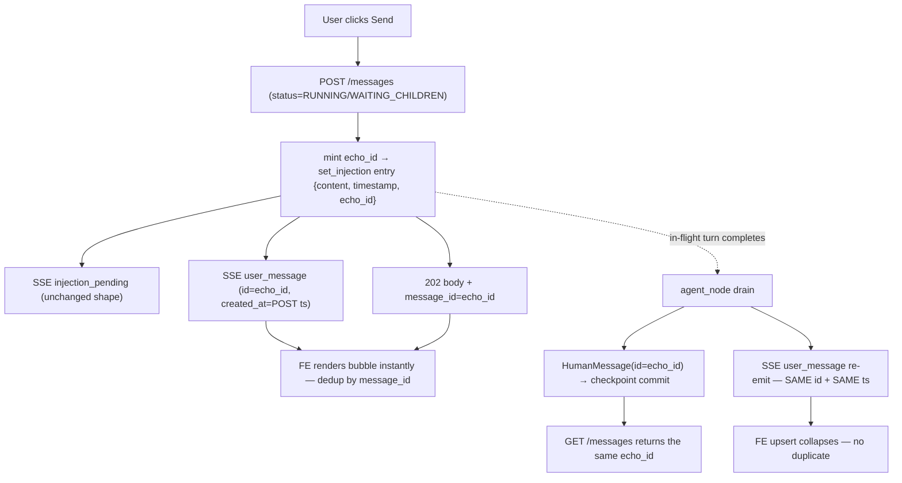

# Architecture Recommendation — FE Chat Message Display Latency Fix

Date: 2026-08-30
Branch: `feature/message-display-latency` @ bb759ee3
Mode: Standard Design — competitive fan-out, 3 workers (`data-flow-design` skill, one approach each)
Worker instances: `architect-worker-echo-at-post` (A), `architect-worker-fe-merge` (B), `architect-worker-persist-row` (C) — all reports received, all skills confirmed loaded. Fan-in total; no gaps.

---

## 1. Problem (verified)

The FE never renders a sent message optimistically — the user bubble renders exclusively from the backend `user_message` SSE echo. Timing depends on instance status at `POST /instances/{id}/messages`:

- **200 path** (IDLE/QUEUED/PAUSED/terminal): rows committed synchronously in the handler; response carries a real `message_id`; `user_message` pre-emits at turn start after worker claim (`instance_messaging.py:~3475`). Sub-second, variable under queue saturation.
- **202 path** (RUNNING/WAITING_CHILDREN, `messages.py:351-381`): message lives **only** in a RAM injection queue (`manager.set_injection`, `manager.py:2413-2427`); today's 202 body is `{status, instance_id, content, timestamp, pending_count}` — **no `message_id`**; `user_message` echoes only when the in-flight turn ends and `agent_node` drains the queue (`graph.py:2937-3080`). **Display latency = remainder of current turn (seconds→minutes). Dominant slow case.**
- GET `/messages` reads only the LangGraph checkpoint (`persistence.py:312/326`) — injected messages are invisible to REST until the consuming `agent_node` commits.
- FE compounding gaps: no SSE reconnect-refetch (`sse.service.ts:506-518`), REST seed **overwrites** the list (`chat.component.ts:1012-1013`), and `LiveEventHub` is fire-and-forget live-only — drops events with 0 connections and on `QueueFull` (max 50); **no replay buffer** (`live_event_hub.py:1-4, :44, :172-198`).

**Additional defects discovered during analysis (pre-existing, out of scope — see §9):**
1. Injected messages have **unstable ids across GET /messages reads** — the drain builds `HumanMessage` with `id=None` (`graph.py:2957-2960`) and `serialize_message` mints a fresh uuid4 per read (`utils.py:168-169`).
2. The 202 path **silently drops images** — `set_injection` has no images parameter (`manager.py:2379-2382`).
3. RAM injections are **lost on daemon restart** — no recovery machinery touches `_pending_injections`; only a 3600s TTL sweep while alive (`manager.py:2372, :648`).

---

## 2. Decision summary (per design question)

| Q | Decision |
|---|----------|
| **Q1 Fast path (200)** | **CONFIRMED**: FE optimistic append keyed by `response.message_id` + existing id-keyed dedup. Refinement: FE must treat `message_id` as *possibly absent* (old BE; PAUSED branch can return `message_id=None` at `messages.py:319-322`) — degrade to today's render-on-echo behavior. |
| **Q2 Slow path (202)** | **(a) BE immediate `user_message` echo at POST + stable-id threading** through `set_injection` → `agent_node` drain, with emit-twice-same-id semantics. NOT (b) content-merge, NOT (c) row persistence. Rationale in §4. |
| **Q3 Refetch/reconnect** | FE hardening layer (from B's analysis, id-keyed instead of content-keyed): union-by-id refetch merge replacing the `set()` overwrite; one-shot catch-up refetch on `connected` after an error/disconnect; pending-entry eviction (wall-clock + terminal-status purge). **Hard prerequisite** — without it, provisional bubbles are wiped by any pre-drain refetch. |
| **Q4 Queue levers** | **CONFIRMED DEFER.** All three workers independently verified: queue timing affects turn-*start*, not bubble render. Under (a) the bubble renders at POST regardless of when the turn starts; even 0ms queue wait leaves the injection-path latency = remainder of current turn. Skill-job queue placement / concurrency raises are a different problem. |
| **Q5 Back-compat** | All contract changes **additive**. Old FE + new BE works unchanged (extra POST-time echo renders as an ordinary bubble; re-emit dedups). New FE + old BE degrades to today's behavior (FE tolerates missing `message_id`). 202 body gaining `message_id` *fixes an existing type lie* — FE `MessageResponse` already declares it required (`models/index.ts:100-101`) but never receives it on 202. |

---

## 3. Approach comparison — 5-axis matrix (202-path options)

| Approach | Complexity | Scalability | Maintainability | Risk | Cost | Verdict |
|---|---|---|---|---|---|---|
| **A: echo-at-POST + id threading** | **Low** — conditional entry key + one id mint + one POST-time emit reusing existing framing (`stream_message`); no new hub methods, no new storage | Neutral — one extra SSE event per injection, O(connections) | Moderate — seam spans router/manager/graph + 2 test files; "conditional key, byte-identical when absent" pattern is established (`source` precedent, `manager.py:2417-2422`) | **Low-Med** — additive only; hazards are provisional-bubble semantics (🟡) and test drift (🟡, same-PR fix) | **Low** | ✅ **RECOMMENDED (primary)** — fixes latency at the true seam, id-authoritative dedup, retroactively fixes GET id instability |
| **B: FE-only temp id + content merge** | Low-Med — ~150 LOC, new FIFO queue + reconciler | Trivial — client memory only | Medium — subtle invariant (temp ids never collide; strict FIFO head-of-queue matching) | **Med** — 🔴 stuck duplicate when content-match fails (identical consecutive messages, whitespace drift); send-before-SSE-connect uncovered server-side; eviction tuning vs multi-minute turns | Minimal | ◐ **PARTIAL ADOPT** — merge-safety/reconnect/eviction layer adopted (id-keyed); the content-matching reconciler is *superseded* by A's shared id and should NOT ship |
| **C1: row write only (GET unchanged)** | Low-Med | Neutral | Low-Med — write-only audit rows nobody consumes; new orphan-row class | Med — without drain-side id reuse it bakes in a permanent two-id scheme | Low-Med | ❌ Not adopted — everything it delivers (id + POST echo) is delivered by A without a row |
| **C2: row + GET union** | Med | Neutral | Low | **High** — 🔴 split-brain transcript: dual truth for "did the agent see this", crash-window dishonesty (GET shows message the LLM never saw), contradictory ordering keys | Med | ❌ **REJECTED** — violates "GET = what the LLM saw" invariant |
| **C3: row-as-outbox (ReportInjection-style: PENDING→INJECTED claim, id reuse, checkpoint sole transcript source)** | **High** — new table + migration + repo + claim state machine + GC + 3 `set_injection` call sites + drain rewrite | Good — indexed single-row claim, no new polling | Medium — must mirror `ReportInjection` conventions exactly or becomes a divergent fork | Med — 🔴 claim-vs-checkpoint-commit window (INJECTED row + missing checkpoint = silent loss with false "delivered"); GC liabilities | High | ⏸ **DEFERRED** — real durability win (restart loses RAM injections today) but orthogonal to display latency; precedented follow-up |

**Dominant axes:** A wins on Complexity and Risk decisively while matching B's Cost class; C-class loses on Complexity/Risk for the stated goal. A also uniquely fixes the GET id-instability defect as a side effect — B cannot (no server id), C3 can but at High cost.

---

## 4. Chosen design

### 4.1 Why (a) over (b)

- **Id-authoritative vs heuristic**: B's reconciler must match echo→temp by content/FIFO; its 🔴 failure mode (stuck duplicate on content drift, identical consecutive messages) is exactly what A eliminates — under A the FE *never* content-matches, because POST-time event, drain-time echo, and 202 body all carry the same server-minted id, and FE dedup (`sse.service.ts:116-138`) collapses by `message_id` with zero new matching machinery.
- **Server knows the truth at POST**; the client guessing it later is strictly weaker.
- **Verified safe contract reuse**: the FE `user_message` listener has **no turn-start semantics** — its only side effects are bubble upsert + `isSending=false` (`sse.service.ts:232-242`, `chat.component.ts:393`), both desirable at POST time. Watchover effects key off `status_change`/`tool_call`/`tool_result`, not `user_message` (`chat.component.ts:455-474`).
- **Covers reconnect for free**: emit-twice (POST + drain re-emit with same id) means a client that missed the POST-time event still gets the bubble at drain — B needs an eviction-timer workaround for the same scenario.

### 4.2 Why not (c) now

- c2 rejected on transcript honesty (🔴). c1 is A-minus. c3 is a genuine durability architecture (it is literally `ReportInjection` generalized to user messages) but touches a table, migration, claim semantics, GC, and all three `set_injection` call sites — none of which the display-latency goal needs. It is the right *follow-up* for the restart-loss defect, to be scoped separately.

### 4.3 Exact contract changes (all additive)

**BE — `POST /messages` 202 branch (`messages.py:351-381`):**

1. Mint `echo_id = uuid4()` in the router.
2. `manager.set_injection(iid, content, echo_id=echo_id)` — entry gains a conditional `echo_id` key; **byte-identical entry shape when absent** (same pattern as `source`, `manager.py:2417-2422`; back-compat contract at `graph.py:2946-2949` preserved).
3. Emit `injection_pending` **unchanged** (keep first — pending-card logic and GET `/injection` fallback depend on it, `sse.service.ts:427-448, :533-563`). Optionally add `echo_id` to its payload for correlation (additive).
4. Emit **`user_message` immediately at POST** via the existing `stream_message` framing (no new hub method — W5 contract, `test_injection_sse.py:69-97`): `{message_id: echo_id, role: "user", content, created_at: <entry POST timestamp>, instance_id}`.
5. 202 body gains `message_id: echo_id` (additive; fixes the FE type lie).

**BE — `agent_node` drain (`graph.py:2937-3080`):**

6. `HumanMessage(content=..., id=entry.get("echo_id"), additional_kwargs=<unchanged>)`. Verified: `BaseMessage.id` is **not serialized to the OpenAI wire** by `langchain_openai` (`_convert_message_to_dict` serializes content/name/role/tool_calls/content-blocks only) — the LLM payload and the `additional_kwargs` byte-identical contract are untouched. Entries without `echo_id` (agent-tool `instance.py:2811`, `job_inject` `job_queue.py:1868`) keep today's behavior exactly: `id=None`, fresh uuid4 echo, current timestamping. **Suppression, if ever added, must be per-entry — never global.**
7. Per-entry `user_message` re-emit **reuses `echo_id` and the POST-time `created_at`** (not a fresh uuid4, not a new timestamp). Emit-twice-same-id-same-stamp, not suppress-at-drain:
   - reconnect coverage (client that missed the POST event gets the bubble at drain);
   - zero reorder risk — FE sorts by `created_at` (`sse.service.ts:135`); reusing the POST stamp keeps the bubble in send position relative to mid-stream assistant messages. A drain-time stamp would sort it *below* the earlier reply — wrong;
   - smaller test churn (drain echo counts stay pinned).
8. Checkpoint commit then carries the same id → **GET /messages returns the same id** — retroactively fixes the per-read random-id instability for injected messages.

**FE — hardening (id-keyed; from B's analysis):**

9. `loadInstanceMessages` (`chat.component.ts:1001-1061`): replace `this.messages.set(viewModels)` (`:1012-1013`) with **union-by-id merge** — upsert server entries by `message_id`, keep local-only pending/provisional entries. Keep symmetric with the SSE mirror effect (`:375-392`).
10. Reconnect catch-up: track error/disconnect state (`onerror`, `sse.service.ts:506-518`); on the next `connected` event (`:218-229`) trigger a one-shot `loadInstanceMessages` in **merge** mode.
11. Eviction: drop pending/provisional entries older than **10 minutes** (wall-clock) **or** on terminal `status_change` (B found 5–10 min workable; multi-minute agent turns are normal, so don't go shorter).
12. Optimistic append in `onSendMessage` (`chat.component.ts:1121-1178`) keyed by `response.message_id` when present (covers 200 and new-202, and the send-before-SSE-connect race — the POST response itself confirms); **skip optimistic append when `message_id` is absent** (old BE / PAUSED `None` case) — degrade to today's behavior rather than shipping B's content-matching reconciler. BE+FE deploy as one bundle (`make install` bundles `frontend/dist`), so version skew is a dev-only transient.
13. Fix the TS type lie: discriminated response union (or optional `message_id`) at `api.service.ts:187-192`; optional `pending?: boolean` on the Message model for the provisional visual state (dim/spinner until the drain echo / `injection_consumed`).
14. Polish (🟢, optional same-PR): hide the "N queued" pending card when the provisional bubble is present.

### 4.4 Data flow (chosen design)

---

## 5. Ordered implementation components

**Phase 1 — BE (id mint + threading + POST echo):**

| # | Component | Seam |
|---|---|---|
| 1 | `set_injection(..., echo_id=None)` — conditional entry key, byte-identical when absent | `manager.py:2413-2427` (entry build `:2396-2398` pattern) |
| 2 | 202 branch: mint id, pass through, emit `injection_pending` (unchanged) then POST-time `user_message` (existing `stream_message` framing, hub `event_id=message_id`, `live_event_hub.py:126-142`), add `message_id` to 202 body | `messages.py:351-381`; SSE helper `:99-144` |
| 3 | Drain: `HumanMessage(id=entry.get("echo_id"))` — id field only, `additional_kwargs` untouched; per-entry re-emit with entry's `echo_id` + entry timestamp when present, else today's behavior | `graph.py:2950-2961` (build), `:3028-3041` (echo) |
| 4 | Same-PR test updates (drift hazard — `.agents/tester/LESSONS/2026-08-18-reasoning-echo-test-contract-drift.md`): `test_injection_api.py:190` (2-arg `set_injection` call), `:193` (`stream_message` called once → twice on POST), `test_injection_sse.py:274/:336` (drain echo counts — unchanged counts, id/timestamp assertions added) | `tests/unit/routers/`, `tests/unit/services/` |

**Phase 2 — FE (merge-safety + reconnect + optimistic append):**

| # | Component | Seam |
|---|---|---|
| 5 | Response typing fix (discriminated union / optional `message_id`); `pending?: boolean` on Message model | `api.service.ts:187-192`, `models/index.ts:100-101` |
| 6 | Optimistic append on send keyed by `response.message_id` (skip when absent) | `chat.component.ts:1121-1178` |
| 7 | Union-by-id refetch merge (replace `set()` overwrite) | `chat.component.ts:1012-1013`, symmetric with `:375-392` |
| 8 | Reconnect catch-up: error-state tracking + one-shot merge-refetch on `connected` | `sse.service.ts:218-229, :506-518` |
| 9 | Pending-entry eviction: 10-min wall-clock + terminal `status_change` purge | `sse.service.ts` (status listener `:304-319`) + `chat.component.ts` |
| 10 | Polish: provisional visual state; hide pending card when bubble present | `chat.component.ts` template |

---

## 6. Edge cases

- **Mid-stream assistant ordering**: FE sorts by `created_at`. The POST-time stamp sorts the provisional bubble after the still-streaming earlier reply (whose `created_at` postdates the drain, `utils.py:50-69`). The drain re-emit MUST reuse the POST stamp — a drain-time stamp would jump the bubble below the earlier reply. Emit-twice-same-id-same-stamp guarantees stability.
- **Reconnect-during-pending**: `LiveEventHub` drops events for disconnected clients (no buffer). Emit-twice covers a client that reconnects before drain (drain echo delivers); the `connected`-triggered merge-refetch covers post-drain reconciliation; pending entries survive refetches via union-merge.
- **Send-before-SSE-connect (fresh instance)**: POST-time SSE is dropped (no connection). Covered FE-side by optimistic append from the 202 body (now carries `message_id`).
- **Multiple queued injections (202 during RUNNING)**: each POST mints and echoes its own id; FIFO queue preserves order; drain emits one `user_message` per entry (`graph.py:3024-3027`) — each re-emit collapses onto its own provisional bubble. No content collision possible (id-keyed).
- **FE cache/refetch interplay**: pre-drain refetch erases the provisional bubble *unless* union-merge is in place (hence prerequisite). Post-drain refetch is exact-dedup-safe **only because** the checkpointed `HumanMessage` now carries `echo_id` — without it, GET's per-read random id (`utils.py:168-169`) would duplicate the bubble. (This is why Phase 1 items 2+3 must land together.)
- **Back-compat**: old FE + new BE — extra POST echo renders as ordinary bubble, re-emit dedups, `injection_pending` unchanged. New FE + old BE — no `message_id` on 202 → FE skips optimistic append, renders on echo (today's behavior). Tool-path injections (`instance.py:2811`, `job_queue.py:1868`) — no `echo_id` → drain behavior byte-identical to today.
- **Crash window (restart between POST and drain)**: RAM injection is lost (pre-existing; no recovery machinery, `manager.py:648`). Approach (a) creates no new loss but **surfaces** it: the user saw a bubble; post-restart refetch removes it. Accepted and documented; durable fix = deferred c3 outbox.
- **PAUSED path**: returns 200 with `message_id=None` possible (`messages.py:319-322`) — FE must tolerate; same id-minting treatment is an optional follow-up.
- **Multi-tab**: tab B without optimistic state still sees the POST-time `user_message` via its own SSE connection (improvement over today); full multi-tab optimistic consistency out of scope.

---

## 7. Test strategy sketch

**BE unit**
- POST-time `user_message` emission: shape (id, role, content, created_at=POST ts, instance_id), ordering after `injection_pending`.
- `set_injection` entry byte-identity when `echo_id` absent; key present when passed.
- Drain: id reuse + timestamp reuse when `echo_id` present; fresh-uuid/today's-stamp when absent (tool-path back-compat pin).
- 202 body includes `message_id`; existing keys unchanged.
- Update the 4 pinned assertions (§5 item 4) in the same PR.

**BE integration**
- Inject-then-drain flow: id continuity across POST event → drain echo → checkpoint GET (`GET /messages` returns same `message_id` for the injected message — also pins the id-stability fix).
- N queued injections: N POST echoes + N drain re-emits, FIFO order, all pairs collapse by id.
- Pairing guard unaffected: mid-tool-call injection still synthesizes placeholders (`graph.py:2962-2973`).

**FE unit**
- Dedup collapse: POST-echo + drain-echo same id → single bubble, created_at from POST.
- Union-merge: refetch without the pending message preserves the provisional entry; post-drain refetch with same id replaces it, no dup.
- Eviction: 10-min TTL + terminal-status purge.
- Optimistic append: 200 path keyed by response id; 202-with-id; absent-id degrades (no append).
- Reconnect: error → `connected` triggers one merge-refetch.

**FE manual/automation outline (script or Playwright)**
1. *Slow-path latency*: start a long tool-loop turn (RUNNING) → send message → bubble appears < 1s (previously: seconds→minutes).
2. *Reconnect-during-pending*: send while RUNNING → kill SSE (offline) → reconnect before drain → no duplicate, bubble persists; after drain → still one bubble.
3. *Multi-send*: 3 rapid sends while RUNNING → 3 instant bubbles in order; after drain → still 3, no merge errors.
4. *Reload-before-drain*: send → reload page (pre-drain) → pending card/bubble state sane; post-drain GET shows the message with the same id, no duplicate.
5. *Back-compat*: run new FE against un-patched BE → behavior identical to today (no optimistic append, no errors).

---

## 8. Risks

- 🟡 **Provisional-bubble semantics**: POST-time `user_message` now means "accepted, RAM-only" — weaker than "consumed into turn". Mitigate by documenting the provisional stage; `injection_pending`/`injection_consumed` remain the authoritative lifecycle events.
- 🟡 **Test drift**: 4+ pinned assertions must change in the same PR or CI green-ness hides contract drift (lesson on record).
- 🟡 **Refetch merge is a hard prerequisite**: without Phase 2 item 7, provisional bubbles vanish on any pre-drain refetch — ship Phase 1+2 together or gate Phase 1 behind nothing user-visible… in practice BE-first deploy is still safe (worst case = today's behavior plus one extra echo that dedups), but the *latency win* requires the FE layer.
- 🟡 **Pre-existing, surfaced**: restart between POST and drain loses the message the user saw (RAM-only). Documented; c3 follow-up.
- 🟢 Visual duplication of bubble + "N queued" card until `injection_consumed` — FE polish.
- 🟢 New-FE/old-BE degradation is graceful (skip optimistic append).

---

## 9. Explicit OUT-OF-SCOPE list

1. **Durable injection outbox (c3 / ReportInjection-for-user-messages)** — restart-loss fix; separate feature, precedented design on record here (§3).
2. **Queue levers** — skill jobs off `system_parallel_queue`, concurrency raise, per-instance serialization: turn-start latency, not display latency (Q4).
3. **Images on the 202 injection path** — pre-existing silent drop (`manager.py:2379-2382`); fixing it changes `set_injection`'s signature and the entry shape; separate defect ticket (recommend bundling with c3 since both touch the entry contract).
4. **`echo_id` minting for agent-tool (`instance.py:2811`) and `job_inject` (`job_queue.py:1868`) paths** — optional follow-up for their GET id stability; not required for this fix.
5. **PAUSED-path `message_id=None` refinement** (`messages.py:319-322`).
6. **LiveEventHub replay buffer for unregistered clients** — covered cheaper by emit-twice + FE refetch.
7. **FE content-matching reconciler (pure-B algorithm)** — deliberately not shipped; superseded by shared id.
8. **Multi-tab optimistic consistency.**

## 10. Decisions pending (leader)

- **Deploy coupling**: confirm BE+FE ship together (assumed — bundled `make install`); if BE can ship weeks ahead, consider also shipping the FE absence-degradation test explicitly.
- **Eviction TTL value**: 10 min proposed; confirm against real longest-turn expectations.
- **`injection_pending` payload enrichment with `echo_id`** (correlation nicety) — include or skip.

## 11. Open questions (non-blocking)

- Whether `message_queue` could host c3's row without colliding with WorkerPool claim semantics (C's unverified item — for the follow-up, not this fix).
- FE pending-card vs provisional-bubble coexistence needs a visual check at implementation time (static analysis only).

## 12. Evidence index

- Worker A (echo-at-POST): flow + contract analysis, `user_message` consumer audit (no turn-start semantics), langchain id-invisibility verification, hub drop semantics, pinned-test inventory.
- Worker B (FE-only): 202 body verification (`messages.py:374-381`), reconciler algorithm + failure modes, merge-safety design, reconnect hook, FE spec inventory (`sse.service.spec.ts:235-254`; `chat.component.spec.ts:467/551/966-994`).
- Worker C (persist-row): sub-variant coherence verdicts, `ReportInjection` precedent (`repositories/report_injection/models.py:83-135`), `_prepare_enqueued_message` reuse hazards (`instance_messaging.py:1462-1538`), restart-recovery gap, GC liabilities, three-call-site fork hazard (`constants.py:186-216`).
