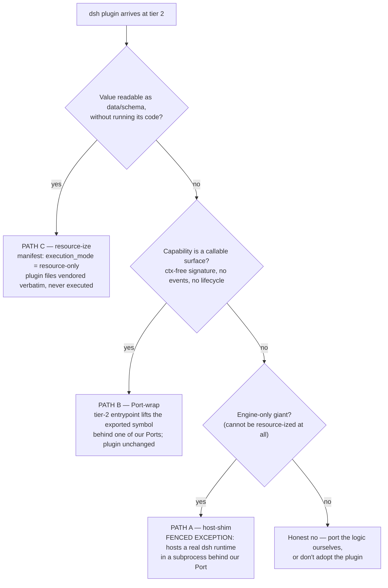

# Plugin-System Pattern Review + Fast Plan (r2 — ADDENDUM: three-tier fold + interop story)

**Kind:** Addendum to `plugin-pattern-review-and-plan.md` (r1). Two tasks from the user-approved addendum (2026-10-06): (1) fold the three-tier framing as the formal organizing statement; (2) the interop hard requirement — the ecosystem-reuse test for dsh (deepseek-harness) plugins, with worked example and minimal NOW contract decisions.
**Evidence:** r1 + `future-giant-plugins-reference.md` (dsh/Cordis anatomy) as grounding; three-worker competitive fan-out, same skill (`system-decomposition`), one worker per integration path — cited as (A §n) host-shim / (B §n) Port-wrapping / (C §n) resource-izing. All three confirmed skill-bank hits. r1 content remains authoritative where not amended here.
**Status:** Delivered. No gaps.

---

## 0. Organizing Statement — the Three Tiers (Task 1 fold; supersedes r1's flat 10-node presentation)

**Tier 1 — ensemble core. Native, never a plugin.** The agent loop, LLM machinery (proxy, retries, finish_reason/usage capture, completeness gates), job queue, skill machinery, daemon. Execution authority. Nothing here is pluggable; resilience comes from this core by construction (plugin-philosophy directive: "EXECUTION runs on our own stable, resilient agent-system core").
**Tier 2 — plugin subsystem. Uniform contracts as DESIGN discipline; thin hand-rolled support now.** Manifest, sync-runner, Port registry, plugin-skill templates. Every integration is expressed as Port + Adapter with provenance — that is the discipline, independent of mechanism. **NO runtime plugin framework yet.** Named escape path: a pluggy-style runtime may *grow out of the Port registry* if an engine-only giant ever needs in-process-style composition — the registry is the seed, never the starting framework.
**Tier 3 — plugins. External systems as resource-snapshots first.** Vendored trees + provenance manifest under `plugins/<name>/`; opendesign = first instance. This addendum extends the same discipline to *foreign-ecosystem plugins* (dsh).

**Tier mapping of the r1 overview nodes:** N8 (ensemble-core) = Tier 1. N3 manifest, N4 path-classifier, N5 sync-runner, N6 plugin-skills, N7 adapter-tools + Port registry, N10 trigger-engine = Tier 2 (the subsystem). N1 upstream-repo, N2 vendored tree, N9 parity-boundary = Tier 3 (the plugin as content + its declared not-covered list). The interop paths below add Tier-2 boxes only; Tier 1 is untouched by all three.

---

## 1. The Interop Story — the ecosystem-reuse test (Task 2)

**Question:** *if there is a plugin that works with dsh, how can it work with OUR system without changing the plugin — or at least with minimal change?*

**The honest headline (all three workers converge):** dsh plugins are TypeScript Cordis Services expecting an in-process `ctx.<key>` registry, typed events, and a DSH-runtime peer-dep — a Python daemon cannot satisfy that contract in-process, period. But the change burden does **not** land on the plugin in any path: in all three paths **the plugin's own files stay untouched, and every change artifact is Tier-2-authored, `own-outright` provenance** (a skill, a manifest field, or a thin wrapper). What varies is *which plugins each path can honestly take*, and what we pay.

**The routing ladder** (a plugin is classified ONCE, at vendoring time — see NOW-decision N3):

### Per-path verdicts

| | (C) resource-izing | (B) Port-wrapping | (A) host-shim adapter |
|---|---|---|---|
| **What it is** | Vendor the plugin's non-code payload; code never runs (C §1) | Lift the plugin's *exported callable* via a thin TS entrypoint subprocess; front it as one Provider behind our Port (B §1) | Host a real dsh runtime (sdk-minimal profile candidate) in a subprocess; our in-process shim adapter fronts it behind a Port (A §1) |
| **UNCHANGED** | All non-TS payload: prompts, presets, config, assets, docs, license (C §2) | Plugin source bit-for-bit, **iff importable**: ctx-free signature, no `ctx.effect/on/inject`, no waterfall `next()` (B §2) | Plugin source, Service contract, typed-event modes, bundle manifest, peer-dep — "the shim IS the dsh profile; the plugin cannot tell" (A §2) |
| **MINIMAL CHANGE** | None in plugin. We author: plugin-skill (N6), `execution_mode` manifest field, parity row (C §3) | None in plugin. We author: `adapter/entry.ts` + IPC framing (Tier-2, own-outright), manifest `lifted_symbol` (B §3) | None in plugin. We author: host-shim adapter (Python), per-Port factory, manifest `hosted-runtime-deps`, new alarm source (A §3) |
| **IMPOSSIBLE** | Any plugin whose value is behavior: Services, `ctx.<key>` participation, event emitters/listeners, effect lifecycle (C §4) | Value-is-context-participation: service installers, event listeners, waterfall middleware — "no rewrite cannot help" (B §4) | In-process identity semantics, HMR fiber disposal (→ subprocess restart), µs `ctx.*` latency assumptions, in-process approval UX, exemption UX (A §4) |
| **Plugin's view** | Nothing — one-way consumption; "we use your data, you don't know it" (C §5) | A Node process importing and calling its exported function; no ctx, no Cordis (B §5) | A standard dsh SDK environment — unchanged (A §5) |

### Five-axis comparison

| Axis | C resource-ize | B Port-wrap | A host-shim |
|---|---|---|---|
| Complexity | **Low** — zero new boxes; pure N1–N10 special case (C §1) | **Medium** — 2 new Tier-2 boxes; one wrapper template, learn-once-apply-many; one pinned Node runtime (B §1, §8🟢) | **High** — 3–4 new boxes; runtime ops, trust-model translation, per-capability-class IPC vocabulary (A §1, §3) |
| Scalability | **High** — no runtime at all | **Med-High** — subprocess-per-call v1; warm-pool recorded as manifest alternative (B §6.2) | **Low-Med** — IPC latency silently degrades inner-loop plugins; cold-start per dispatch (A §4, §8🔴) |
| Maintainability | **High** — existing sync machinery; informational alarms only (C §1) | **High** — wrapper absorbs upstream renames via existing drift alarm (B §5.7) | **Low-Med** — third sync sub-run, runtime-drift alarm source, developer-preview churn (A §8🟡) |
| Risk | **Low-Med** — silent capability loss if misapplied; positively declared + refusal guard (C §7) | **Med** — misclassification + contract-purity drift; both CI-guardable (B §8🔴) | **High** — direct pillar-(f) tension; acceptable ONLY as the engine-only exception behind a fence (A §7) |
| Cost | **Lowest** — manifest field + skill | **Low-Med** — one thin wrapper per Port capability, Tier-2 own-outright | **High** — Node ops footprint, measurement debt (latency, cold-start, faithfulness) (A §8) |

**Recommendation (routing, not winner-take-all):** **C is the default** for resource-dominant plugins. **B is the recommended lane for capability plugins** — it is where "without changing the plugin" is literally true *and* behavior is preserved. **A is the fenced exception**, reserved for engine-only giants — exactly the deferral-trigger scenario the reference doc already names (§5: "vendor the engine, patch-log it, wrap it as one Provider behind an existing Port"). If we reach for A for anything resource-izable, the fence has failed (A §7).

### Worked example — provider/model-adapter plugin via Path B (end-to-end)

**Archetype** (the addendum's own suggestion): a dsh model-adapter plugin whose exported symbol is `mapRequest(spec, prompt, params) → WireRequest` — pure data transformation; the Cordis ceremony lives in `apply(ctx)`, which we never invoke (B §5).

1. **Vendoring:** sync-runner pulls the plugin @ its tag into `plugins/<name>/src/`, class `snapshot-with-drift-alarm`; manifest records `execution_mode: lifted-symbol`, `lifted_symbol: "mapRequest"`, `entrypoint: adapter/entry.ts`, `ipc_version: 1`.
2. **Tier 2 provides:** `adapter/entry.ts` (ours, own-outright, budget ≤ ~200 lines — the "thin" tripwire, B §7): imports `mapRequest` by named symbol (bypassing side-effecting module import), reads one JSON object from stdin, calls it, writes JSON (or a typed error envelope) to stdout. Vendoring-time check asserts the lifted signature is ctx-free; a smoke fixture calls it — failure is a *vendoring* failure, not a runtime one (B §6.3).
3. **What the plugin sees:** a Node process evaluating its module and invoking its function once per call. No ctx, no events, no Cordis. Its `apply(ctx)` is dead code from our vantage.
4. **What our side sees:** one Port tool `plugin_<name>_map_request(spec, prompt, params)` — JSON in, JSON out — behind the same Port Definition/Provider/Consumer triple as every other capability (three-role rule: Definition ours, Provider = *our wrapper* lifting the plugin-as-resource, Consumer = designer workflow/job) (B §6.5).
5. **What changes:** nothing in the plugin, ever. Upstream renames `mapRequest` → `buildWireRequest`: wrapper import breaks at next sync → drift alarm → reconciliation ticket against the wrapper (B §5.7).

*Contrast cases:* a prompt-pack plugin (`prompts/` + `presets/` + trivial `index.ts`) takes **C** — vendored verbatim, `execution_mode: resource-only`, consumed via a plugin-skill; its `index.ts` is inert bytes (C §5). A tool-provider plugin that must register into `ctx.tools` live takes **A** — and only if dsh is itself the adopted giant; otherwise the honest answer is "port the tool" (A §5, X-limb of the ladder).

---

## 2. Minimal Contract Decisions — NOW vs deferrable

**Decide NOW (6 items — convention-level, cheap, they keep every future answer "adapter, not rewrite"):**

1. **Port contracts are DATA contracts.** Every Port in/out is JSON-serializable; no object identity, no shared mutable state, no functions crossing. *"If we let a single non-serializable value across a Port, the wrapper grows a translator and the path is no longer adapter-not-rewrite"* (B §6.1). Serves B directly, A's IPC necessarily, and all future plugins. Guard: JSON-schema check on every Port definition in CI (B §8🔴).
2. **Manifest v1 gains an integration-mode vocabulary, as POSITIVE declarations** (not defaults): `execution_mode: resource-only | lifted-symbol | hosted-runtime`. Absent declaration ⇒ sync-runner REFUSES to vendor the plugin under any path (C §7 guard, generalized). This one field unifies C's resource-only declaration, B's `lifted_symbol`, and A's per-plugin opt-in. Record the v1 runtime default for lifted-symbol (subprocess-per-call) in the same vocabulary (B §6.2).
3. **Vendoring-time capability classification.** The routing ladder runs at vendoring: importability check (ctx-free signature; no `inject`/`apply` on the lifted path; static transitive-ctx check) + smoke fixture. Misclassification fails the vendoring, never the runtime (B §6.3, §8).
4. **Typed error envelope across every process boundary** — `{ok:false, code, message, details?}`; no stack traces, no raw exceptions (B §6.4). A needs the same discipline on its IPC.
5. **The engine-only FENCE, written into the convention now:** `hosted-runtime` is per-plugin opt-in; Tier 1 NEVER imports the shim (N13 reaches N8 only via N7); strict peer-dep — install-time hard-fail on range mismatch, NO compatibility-exemption UX (A §6.6, §7); capability surface is a static manifest-declared list, not runtime-open registration (adjudication of A §5's open question — aligns with decision 1 and the no-runtime-ABI rule).
6. **Three-role rule extended to interop:** Definition (ours, Tier 2) / Provider (our wrapper or shim — the plugin is a *resource the Provider lifts*, never a role itself) / Consumer (named workflow/job) (B §6.5; extends the already-borrowed seam gate).

**Deferrable — with the trigger named:**

- **B-path mechanics:** IPC framing choice, warm-pool sizing, result caching, streaming ports, entrypoint test harness → at first concrete lifted-symbol plugin (B §6 deferrable list).
- **A-path internals:** host profile choice (sdk-minimal is the leading candidate), per-capability-class IPC vocabulary, effect-disposal = subprocess-restart semantics, per-call approval mediation, HMR-equivalents, profile stacking, capability graph → **not now; at the moment the first engine-only giant fires the exception** (worker A's "before first adoption on that path" ≠ today). The fence (item 5) is what we owe today; the internals are owed then (A §6).
- **C-path generics:** 4th manifest class promotion (`resource-only` stays a top-level field in v1; promote to a class at plugin #2), generic foreign-ecosology manifest profile, per-archetype plugin-skill templates → plugin #2/#3 (C §6).
- **Measurement debts:** IPC latency, subprocess cold-start, shim faithfulness → before ANY A-path adoption; Node-runtime ops footprint → at first B-path plugin (A §8 unverified; B §8🟡).

---

## 3. Diagram-ready additions (node/edge deltas vs r1's N1–N10)

All additions are **Tier 2 boxes**; Tier 1 (N8) untouched. Following r1 convention, the full chart stays deferred; deltas are literal:

| id | name | tier | path | role (1 line) |
|---|---|---|---|---|
| **N7a** | ts-entrypoint | 2 (own-outright) | B | thin TS module importing the plugin's exported symbol; JSON stdin→stdout; ≤ ~200-line budget |
| **N7b** | ipc-contract | 2 (manifest-declared) | B *and* A | wire schema + typed error envelope between our process and any TS subprocess |
| **N11** | hosted-runtime | 2-hosted subprocess | A | a real dsh runtime (sdk-minimal candidate) + plugin bundle, in-process to itself, subprocess to us (folds A's N11+N12 loader) |
| **N13** | host-shim-adapter | 2 | A | Python, in our process; translates Port calls ⇄ IPC; the ONLY thing our side touches; never imported by N8 |
| *(none)* | — | — | C | zero new boxes; N3 field + N9 rows only |

**Edges added:** N7 —[spawn]→ N7a —[import+call]→ N2(plugin src) —[JSON]→ N7a —[envelope]→ N7 *(B)* · N7 —[Port call]→ N13 —[IPC per N7b]→ N11 —[ctx.* native]→ plugin *(A)* · manifest `execution_mode` —[routes]→ {C, B, A} *(the ladder itself)* · N5 —[3rd sub-run: runtime drift]→ N10 *(A only)*.

**Manifest (N3) deltas:** `execution_mode` vocabulary; `lifted_symbol`+`entrypoint`+`ipc_version` (B); `hosted-runtime-deps` = runtime pin + profile id + IPC schema pin + capability allowlist (A). **Parity-boundary (N9) delta:** per-plugin NOT-EXECUTED declarations (C) / NOT-REPLICATED list for hosted runtimes (A).

---

## 4. Risks (severity-ordered, deduped across workers)

- 🔴 **Port-contract purity drift** — one non-serializable value admitted anywhere and every later wrapper grows a translator → ABI creep. Guard: decision 1 + JSON-schema CI on Port definitions (B §8).
- 🔴 **Silent capability loss by mis-resource-izing** — behavior plugin vendored as data, degraded output, nobody knows. Guard: positive `execution_mode` + sync-runner refusal (C §7/§8).
- 🔴 **Pillar erosion via host-shim generalization** — A as default mechanism voids pillar (f) and the dsh-divergence argument. Guard: the fence (decision 5); "reaching for A on anything resource-izable = the test failed" (A §7/§8).
- 🟡 Misclassifying ctx-coupled code as liftable (transitive ctx refs) — static check + smoke fixture (B §8). · Cordis `${ctx.*}` placeholder leakage in vendored prompts — strip/resolve/declare-broken; one real bundle inspection owed (C §8). · Node.js becomes a Tier-2 runtime dependency — one pinned version, declared in manifest (B §8). · Runtime-pin churn vs developer-preview upstream — divergence-register log (already borrow-NOW pending) is the mitigation (A §8). · IPC latency / cold-start silently breaking inner-loop plugins — measure before any A adoption (A §8).
- 🟢 Wrapper-size budget as the "thin" tripwire (~200 lines, CI-alarmable) (B §7). · Second-tag burn-in owed for the new manifest fields before plugin #2 (C §8). · Generated plugin-surface catalog — later, at plugin #2 (ref §6.5).

## Gaps

None — all three dispatched workers reported with skill-bank hits confirmed (`Skill loaded: [system-decomposition]` first-line on each). Unverified items are carried in-line above (the largest: no real dsh-plugin bundle has been inspected — archetype distribution and placeholder prevalence rest on the reference doc's CORE findings, not on plugin inventories; flagged by all three workers).
