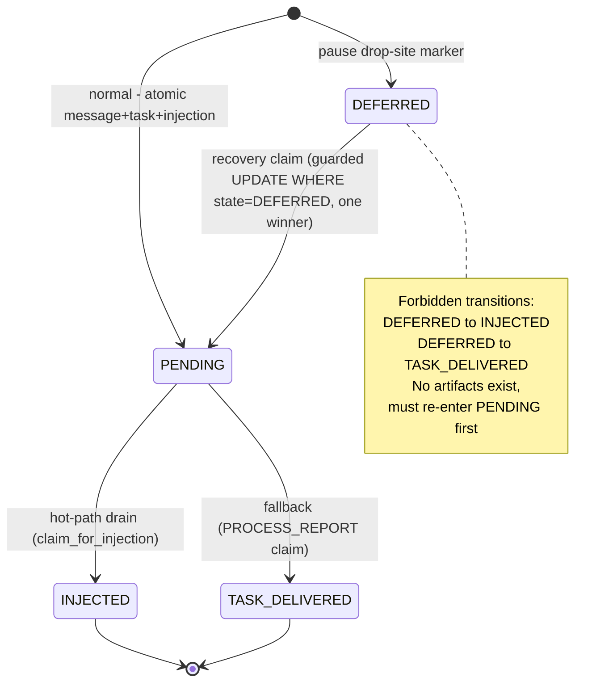

# Architecture Recommendation: pause-report-recovery (plan enrichment)

Date: 2026-08-19T20:21:25Z
Branch: feature/pause-report-recovery @ 6bb99d5f
Mode: Standard Design — 3-worker verification fan-out (structural-design / data-flow-design / resilience-design)
Instances: architect-worker-marker-statemachine (1d2ce77c), architect-worker-delivery-races (97e0e7a4), architect-worker-recovery-coverage (a7946e5a)
Inputs: plan-overview.md (binding Q1–Q5), phase1/2/3-plan.md, prod-6c631666-report-lost/code-analysis.md
Status: **All 5 focus areas verified — plan CONFIRMED with 1 mandatory fix (FM-11), 1 re-anchor, and 8 task-level adjustments. Do NOT rewrite the plan; apply the annotations below.**

---

## 🔴 The Load-Bearing Finding — FM-11: the Site 1 marker write cannot survive cancellation

Two workers, two independent skills, same hole, consistent evidence:

- **Worker 1 (structural-design):** the Site 1 marker write sits *inside* the PAUSED-skip branch, downstream of `await _is_instance_paused(...)` (message_processing_pipeline.py:472-482). If pause cascade's `graph_task.cancel()` (instance_lifecycle.py:2124-2125) fires at that await, `CancelledError` raises before `ensure_deferred` runs. The plan's "best-effort wrap" does not help: **`asyncio.CancelledError` is BaseException, not Exception** — the wrap never sees it.
- **Worker 3 (resilience-design):** Stages 4–6 run inside a try whose `except asyncio.CancelledError` at pipeline.py:486-487 returns via `_handle_cancel` — the if-branch is **unreachable under cancellation**. Worse: task 1.4's planned `asyncio.to_thread(ensure_deferred)` is a *second* sequential cancellation point. This is the exact incident scenario (6c631666): pause cancels the pipeline mid-Stage-6 → no marker, no artifacts, silent drop — the precise drop the plan exists to eliminate.
- **Worker 2 (data-flow-design)** confirms the boundary condition: pipeline.py has **no in-flight transaction at Stage 6** (no `engine.begin` anywhere in the file) — so "promote the write into the existing pipeline transaction" (option ii alone) is not implementable without restructuring every pipeline path.

**Consequence:** as written, Phase 1 task 1.4 has a hole at its primary incident site. Fix options compared in [§FM-11 Closure](#fm-11-closure-options). Recommendation: **Option A (harden the write) + Option C (permanent no-row backstop)** — defense in depth.

---

## Verdict 1 — State machine soundness: ✅ CONFIRMED, with two blockers to resolve in task 1.1/1.4

**`report_injections` + DEFERRED is the right home.** Every claim consumer already guards on `state='PENDING'`:

| Consumer | Guard | DEFERRED visible? |
|---|---|---|
| Hot-path drain — graph.py:267-301, 2758 → `claim_for_injection` (repository.py:162-261) | `WHERE state='PENDING'` | No ✓ |
| Fallback — task_processor.py:272-289 → `claim_for_task_delivery` (repository.py:267-345) | `WHERE state='PENDING'` | No ✓ |
| Mirror — `reconcile_turn_mirror` report_injections SQL (task/repository.py:951) | `state='PENDING'` | No ✓ |
| INJECTED filter — child_reports.py:1547 | `state==INJECTED` | Correctly returns False (not delivered) ✓ |

DEFERRED is **invisible to both delivery lanes by construction** — no hot-path consumer change required. Marker-home alternatives (Worker 1, 5-axis):

| Home | Complexity | Scalability | Maintainability | Risk | Cost | Recommendation |
|---|---|---|---|---|---|---|
| **(a) report_injections + DEFERRED** | Low | Low | Low | Med* | Low | **✅ CONFIRM** — lanes guard on PENDING; parent-keyed index exists (models.py:112-116) |
| (b) nullable task column | High | Med | High | High | Med | Reject — task.status already 8+ values; fights named-transitions mirror; every terminal/inflight filter needs audit (task/repository.py:716-725) |
| (c) message_queue overload | High | Med | High | High | High | Reject — "COMPLETED but delivery owed" is self-contradictory; terminal_reason fan-out into the mirror's ELSE-'completed' trap |
| (d) new table | Med | Low | Med | Low | High | Reject — duplicate semantics, two repos/migrations/mirror couplings, zero correctness win |

*Med risk is the two blockers below, both resolvable without switching homes.

**MIRROR_SET: verified clean.** `deferred_pause` is a `_ChildCompletionDbResult.outcome` label, not a `message_queue.terminal_reason`; `deferred_reason` lives on report_injections, not task; the FM-1 guard leaves the task PENDING (already inside inflight_statuses, task/repository.py:721-725). No new terminal_reason reaches the mirror CASE (task/repository.py:840-856). → Downgrade task 2.5d to a regression-test assertion.

**Blocker 1 — `report_message_id` is `nullable=False` (models.py:144-147), but the Site 1 marker has no artifact yet.** Task 1.1 must decide: make the column nullable (recommended — honest shape; task 2.2 reconciliation then handles `report_message_id IS NULL` explicitly as the pre-artifact Site-1 shape) vs placeholder `deferred_*` UUIDs (pollutes the message-source key space). **Recommend nullable=True.**

**Blocker 2 — the cancel-race (FM-11, above).** Resolved by the task 1.4 adjustment below.

PENDING is the single gateway: both entry paths converge on it; both terminals depart only from it. Document in task 1.7 that `enqueue` (repository.py:115) and `ensure_deferred` are the only two row-creation paths, and that DEFERRED→INJECTED/TASK_DELIVERED are illegal by the `state='PENDING'` claim guards.

---

## Verdict 2 — Concurrency & exactly-once: ✅ SUFFICIENT; idempotency key pinned; one defensive addition

**The guarded `UPDATE ... WHERE state='DEFERRED'` + rowcount check IS sufficient.** No LockManager slot / advisory lock needed. The claim composes with four existing serialization layers:

1. **Obligation-triple dedup (the idempotency key):** `(parent_instance_id, child_instance_id, child_message_id)` — DB-enforced by the partial unique index `WHERE state IN ('pending','deferred')`, application-checked by the `existing_report` SELECT on `MessageQueue.source = f"internal_report:{child}:{msg}"` (child_reports.py:2118-2127). Two-line defense: SELECT is the fast path; the index catches the READ-COMMITTED cross-transaction race. **`report_message_id` is NOT the key** — it is per-delivery-attempt; multiple recoveries may mint fresh ones, the triple still rejects duplicates.
2. **Claim-level:** `WHERE state='PENDING'` atomic UPDATE in both lanes — exactly one of hot-path/fallback wins.
3. **Per-instance serialization:** S3 invariant on `claim_pending_task` (status='running' ONLY, task/repository.py:1304-1306) — hot-path drain and fallback task for the same instance never run concurrently.
4. **Actor-level:** all three recovery actors (router / sweep / FM-1-guarded path) converge on `transition_deferred_to_pending`; rowcount=0 = someone else recovered → skip.

**Caveat (Worker 2):** `bus._get_parent_lock(instance_id)` in `_process_child_completion_and_notify_parent` (child_reports.py:1453) is **child-keyed, not triple-keyed** — it does NOT serialize the three actors. The partial unique index is the only cross-actor gate. **Therefore: mandatory addition — catch `sqlalchemy.exc.IntegrityError` on the report_injections INSERT in `_process_child_completion_db_sync` and treat it as `already_delivered`-equivalent** (mirrors `TaskDeliveryClaim`'s tri-state). Without this, a sweep-vs-hot-path race surfaces as an uncaught constraint error instead of a graceful no-op.

**Cross-lane double-delivery (focus Q):** prevented by the claim UPDATEs (both lanes mutate injection state atomically) + the triple index + existing_report. Partial-artifact shape (b) "message-only → create task only" cannot double-deliver: the created task's claim goes through `claim_for_task_delivery`, which returns `already_delivered` if the hot-path won meanwhile.

**Ordering requirement (Worker 1):** in task 2.2, `transition_deferred_to_pending` must run **BEFORE** partial-artifact reconciliation — the mirror SQL (task/repository.py:951) is guarded on `state='PENDING'`; reversed order silently skips. Cover with Phase 3 test 3.5.

---

## Verdict 3 — Recovery completeness: 🟡 COVERED for the 3 variants + FM-2/5/6/7/9; HOLE at FM-11; seams needed for FM-1/3/12/13

Condensed FM matrix (Worker 3, full detail in its report):

| FM | Verdict | Mechanism / Gap |
|---|---|---|
| FM-1 | PARTIAL | Type-aware guard (2.3) is preventive only; if it ever misses, PENDING row strands (see FM-13) |
| FM-2 | COVERED | Boot sweep + marker; DB row survives RAM-set loss |
| FM-3 | PARTIAL | Preventive via 2.3; no corrective path for already-cancelled tasks |
| FM-4, FM-8, FM-10 | OUT-OF-SCOPE | Different invariants (selector, Task↔JobItem, checkpointer) — correctly deferred |
| FM-5, FM-6 | COVERED | Site 1 marker + sweep |
| FM-7 | COVERED | Post-restart sweep |
| FM-9 | COVERED | Sweep |
| **FM-11** | **🔴 HOLE** | **Cancel at the pause-check await → marker write never runs (see load-bearing finding)** |
| FM-12 | SEAM | Parent paused indefinitely: PENDING row never recovered (sweep skips busy → PAUSED counts as busy; router fires only on resume). Documented assumption or new query — Decisions Pending |
| FM-13 | SEAM | Legacy PENDING sweep is one-time/config-gated; post-launch stranded PENDING (FM-1/FM-3 escapes) have no permanent actor |

**Sweep crash-safety:** per-row errors leave rows in DEFERRED (retry next sweep — correct); crash mid-sweep after `transition_deferred_to_pending` but before artifact creation leaves a **fresh PENDING row** that router (wants DEFERRED) and sweep (age-bound 10min) both skip for a window, and after the one-time legacy sweep is disabled, forever. **Fix: add `recovery_attempted_at` column (task 1.1) + sweep re-processes `state='PENDING' AND recovery_attempted_at IS NOT NULL AND recovery_attempted_at < now - 1min`.** This converts the sweep from one-time legacy semantics into a permanent idempotent reconciler and also closes FM-13.

**Live-parent re-entry race:** busy-check TOCTOU is acceptable — per-instance S3 serialization blocks recovery behind the live turn; the exactly-once guards (Verdict 2) merge outcomes. No change.

**Revival on terminal parent:** safe — corrective emit (child_reports.py:2865-2890) re-fires the bus event; lanes don't need a live bus; `parent_id` permanent / hierarchy rows transient (blueprint-verified). Keep task 2.1's revival-on-terminal semantics.

**Site 1 write-transaction verdict: (iii) both — as planned**, with a scope note: Worker 2 verified no transaction exists at Stage 6, so best-effort is forced for DB errors (acceptable — the permanent no-row sweep query is the net); **cancellation is a separate axis and needs the FM-11 hardening.**

## FM-11 closure options

| Option | Complexity | Scalability | Maintainability | Risk | Cost | Recommendation |
|---|---|---|---|---|---|---|
| **A: Harden in-pipeline** — hoist marker write into `finally` at the try/except indent, keyed on a cached pause-check result; wrap in `asyncio.shield`; `except CancelledError` re-raises AFTER the shielded write dispatches | Low | High | Med | Med (shield covers cancel-at-await only partially; crash-mid-shield still lost) | Low | **✅ Adopt** (task 1.4) |
| **B: Pause-cascade-side hook** — write the marker inside the `_pause_cascade_db_sync` block (instance_lifecycle.py:2164-2172), transactional with the PAUSED commit, after `graph_task.cancel()` completes | Med | High | High | Low (immune to the cancel race by construction) | Med | 🟢 Defer — strongest, but touches instance_lifecycle.py, which Phase 1 explicitly declares out of scope; adopt if 3.9 shows shield gaps |
| **C: Permanent no-row backstop** — promote `find_completed_children_missing_report` from legacy-one-time to a permanent, age-bounded, batch-capped sweep query | Low | Med (standing scan; index-assisted) | High | Low | Low | **✅ Adopt** (task 2.4) — this is the ONLY net under a lost marker write; if it stays one-time, every future FM-11 drop is permanent |

**A + C together** give defense in depth: A makes the common case durable pre-crash; C catches cancel-at-await, crash-mid-shield, and any future drop lane that writes no marker. Note: unconditionally writing DEFERRED at every post-processing entry (Worker 1's "invert the order" variant) was considered and rejected — it collides with the subsequent PENDING insert on the same triple and taxes the hottest path in the system.

---

## Verdict 4 — Migration safety: ✅ LOW RISK (two plan-level worries resolved by code facts)

| # | Hazard | Severity | Finding / Mitigation |
|---|---|---|---|
| 1 | PG enum for `state` → rollback drops enum value / ALTER TYPE needed | **NONE** | **Verified: `state` is TEXT, max_length=16 (models.py:156)** — not a PG native enum. Old binary post-rollback reads `'DEFERRED'` as an unknown string and correctly ignores it (no claim path touches it). Missed-recovery only, acceptable. Document in rollback runbook |
| 2 | Partial unique index syntax divergence SQLite/PG | **NONE** | Precedent exists: `idx_job_idempotency` (job_queue/models.py:292-298, `sqlite_where` + `postgresql_where`) and migration `20260619_120000_fix_idempotency_index_include_deleted_at.sql` (raw `CREATE UNIQUE INDEX ... WHERE`, both drivers). Index NAME must match across `_ensure_postgres_columns` and the .sql migration |
| 3 | Old binary writing PENDING rows during new-binary index build | LOW | PG MVCC: index built from snapshot misses them — and that is *correct*: a PENDING row from any binary IS a non-terminal obligation; the triple index rightly refuses a second DEFERRED row for it; sweep rowcount guard handles gracefully |
| 4 | Concurrent boot instances mid-ALTER | LOW | `ADD COLUMN IF NOT EXISTS` + `CREATE INDEX IF NOT EXISTS` idempotent; brief ShareUpdateExclusiveLock during index build only |
| 5 | Sweep scanning un-migrated rows | LOW | Wire `ReportDeliveryRecoveryService` AFTER `_ensure_postgres_columns` + StaleTaskRecovery (manager.py:5072-5091) — already the plan's task 2.5 ordering; keep it binding |

---

## Verdict 5 — TOCTOU-deferral scope: ✅ SOUND **WITH** the FM-11 seam (not without it)

Deferring pause-cascade window closure is architecturally sound **only because** every window drop becomes a recoverable obligation. That argument holds for drops where the marker write executes; **it fails for FM-11, where cancellation prevents the write.** With A + C adopted (marker hardening + permanent no-row backstop), every TOCTOU shape is either marker-recoverable or backstop-recoverable, and the deferral stands. Update the plan's TOCTOU risk-row mitigation text accordingly. If the leader declines C, the deferral is NOT sound and the window (or the FM-11 lane) must be closed — Option B.

---

## Concrete phase-task adjustments (consolidated, deduped)

| Task | Adjustment | Severity |
|---|---|---|
| **1.1** | (a) Make `report_message_id` **nullable=True** (model + migration) — Site 1 markers have no artifact yet; (b) add `recovery_attempted_at` nullable timestamp column + index; (c) define partial unique index via `sqlite_where`/`postgresql_where` (job_queue models.py:292-298 precedent), same index name in both DDL paths | 🔴 |
| **1.2** | `ensure_deferred` uses the partial unique index as write-once gate; declare in the repo contract that `enqueue` and `ensure_deferred` are the ONLY row-creation paths | 🟡 |
| **1.3** | Index name MUST match between `_ensure_postgres_columns` and the SQLite companion migration | 🟡 |
| **1.4** | **Re-anchor + harden (FM-11):** keep best-effort for DB errors (no transaction exists at Stage 6 — verified) BUT hoist the marker write into a `finally` block at the try/except indent keyed on the cached pause-check result, dispatch via `asyncio.shield`, and re-raise `CancelledError` only after dispatch. Add comment: "sweep no-row query is the backstop for a lost write". ID orientation as planned (parent = child's `instance.parent_id`) | 🔴 |
| **1.5** | **RE-ANCHOR from child_reports.py:665-695 to :2106-2108** — 665-695 is dead code (tests only); production is the inlined check. Apply `ensure_deferred` at the live site (and keep the helper convergent) | 🔴 |
| **1.7** | Extend docstring: NULL `report_message_id` = pre-artifact Site-1 shape (task 2.2 must handle it); unique index enforces write-once; natural-path delivery with a stale DEFERRED row → sweep reconciles | 🟡 |
| **2.1** | Add `IntegrityError` → `already_delivered`-equivalent handling in the re-entry path (tri-state pattern); `transition_deferred_to_pending` BEFORE reconciliation (mirror SQL guarded on PENDING) | 🔴 |
| **2.2** | Handle `report_message_id IS NULL` shape explicitly (pre-artifact marker → full creation); ordering per 2.1 | 🟡 |
| **2.3** | The exemption predicate "non-terminal injection row exists" naturally covers DEFERRED — state this explicitly; note that **2.4 depends on 2.3** (a sweep-recovered delivery creates a READY report + PENDING PROCESS_REPORT task that FM-1's unmodified loop would kill) | 🔴 |
| **2.4** | (a) Promote `find_completed_children_missing_report` to **permanent** config-gated (default ON) — it is the only net under FM-11, not legacy cleanup; (b) add `recovery_attempted_at` re-processing branch (closes mid-sweep-crash gap + FM-13); (c) document rowcount=0 = already-recovered signal | 🔴 |
| **2.5d** | Downgrade MIRROR_SET guard to a regression-test assertion (grep-assert: no new `terminal_reason` literals without MIRROR_SET entry) — verified no new terminal_reason exists in this design | 🟢 |
| **3.5** | Add the ordering assertion (transition-before-reconciliation) and the IntegrityError race pairing (sweep vs hot-path) to the double-delivery matrix | 🟡 |
| **3.9 (NEW)** | **FM-11 regression test:** cancel the graph task DURING the Stage-6 pause-check await → assert the marker row exists (or, if relying on C, that the no-row sweep recovers it). Without this test the fix cannot be verified | 🔴 |
| **3.10 (NEW, optional)** | FM-12 test (parent paused indefinitely) — only if the leader adopts a paused-parent seam; otherwise document the assumption | 🟢 |

## Decisions Pending (leader)

1. **FM-12 (parent paused indefinitely):** accept-and-document the "parents always eventually resume" assumption, or add a config-gated `sweep_paused_parents` query (PENDING/DEFERRED rows whose parent is PAUSED with no live task). Recommended: document now, seam later — field data first.
2. **FM-13 scope:** adopt the `recovery_attempted_at` permanent-reconciler semantics (recommended, folded into 2.4) vs keep sweep strictly DEFERRED+legacy. The recommendation makes FM-3's missing corrective path permanent too.
3. **Option B (pause-cascade transactional hook):** defer until 3.9 results; pre-approve as the fallback if shield proves insufficient.

## Open Questions

- Exact sweep cadence for the permanent no-row query (boot-only vs periodic) — cheap on boot; periodic needs a scheduler decision.
- `count_pending_for_parent` (repository.py:351-372) semantics — if read by observability paths expecting PENDING-only, decide whether "delivery owed" = PENDING ∪ DEFERRED there too.

## Gaps

None — all three workers reported with skills confirmed loaded (`Skill loaded:` first line on each); no skill-bank misses; no re-dispatches needed.

## Confidence

**High** for Verdicts 1, 2, 4, 5 (code-cited, cross-verified, convergent). **Medium-High** for Verdict 3 — FM-12/13 seam sizing is judgment, not code fact. The assumption that would flip the recommendation: if `_is_instance_paused` turns out to be a synchronous (non-await) call, FM-11's primary race window narrows to the `to_thread` dispatch only — the hardening (A) and backstop (C) remain correct but less urgent; verify the helper's signature during task 1.4 implementation.
