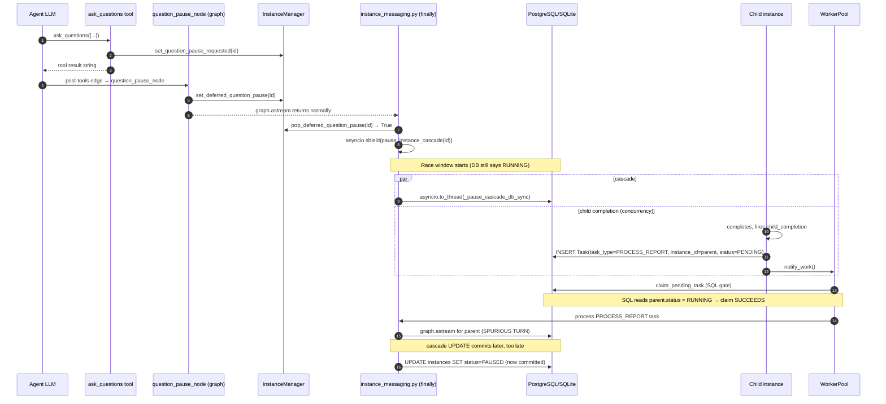

# Technical Analysis: Incomplete-Pause / Tool-Result Race Bug

Date: 2026-07-31
Author: planner[v2] via technical-analysis worker
Analysis depth: deep-dive
Status: Draft (ready for planner review)

---

## Question

> When an instance is paused via `ask_questions`/`question`, tool results arriving
> during the deferred-pause race window can cause the paused instance (or
> sibling/related instances in the tree) to resume running instead of staying
> paused. Which candidate fix — pipeline pre-check (Option A), gate pre-check
> (Option B), `_process_message_with_tracking` backstop (Option C), or a
> source-side fix that closes the race window — actually fixes the bug, and
> what trade-offs does each option carry?

The decisive question for evaluating every downstream check is: **during the
race window, what does each candidate check observe?** If a check reads DB
status, it sees `RUNNING` during the window — i.e. it does not fix the bug on
its own. A correct fix must observe the in-memory deferred-pause marker (which
is set *immediately* by `question_pause_node`, before the DB transition
happens) or close the race window at its source.

---

## Context Summary

The `ask_questions` tool pauses an instance after the LLM has emitted its
question to the user. Pausing from inside the graph task is dangerous — the
graph task cannot call `pause_instance_cascade` directly because the cascade
pops `_graph_tasks[instance_id]` and calls `task.cancel()` on the *current*
task, which would raise `CancelledError` at the next `await` inside the
cascade's DB transaction (the **C2 torn-state bug**).

The codebase solves this with a **deferred-pause pattern**:
1. `ask_questions` tool → `set_question_pause_requested(...)` → emits
   `question_pack` SSE.
2. Conditional post-tools edge routes the graph to `question_pause_node`
   (`daemon/graph.py:3078`).
3. `question_pause_node` calls `manager.set_deferred_question_pause(instance_id)`
   (`daemon/graph.py:3160`) — sets an in-memory `set[str]` on the manager
   (`daemon/manager.py:714`).
4. `question_pause_node` returns `{}`, graph routes to END, `graph.astream`
   returns.
5. The post-graph completion path in `_process_message_with_tracking` /
   `send_message` runs the cascade: `pop_deferred_question_pause(...)` →
   `await asyncio.shield(pause_instance_cascade(instance_id))`
   (`daemon/services/instance_messaging.py:958-968` and `:3225-3235`).
6. `pause_instance_cascade` (`daemon/services/instance_lifecycle.py:1666`)
   does in-memory side effects (cancel-by-instance, `_graph_tasks.pop`,
   `graph_task.cancel`), then runs `_pause_cascade_db_sync` via
   `asyncio.to_thread` (line 1805) — i.e. the actual SQL `UPDATE
   instances SET status='paused'` happens on a worker thread, NOT awaited.

**The race window** is between step 3 (marker set in-memory) and step 6's
SQL commit (DB status flips to PAUSED). During this window:
- The in-memory marker `_deferred_question_pause` contains the instance_id.
- The DB row for the instance still shows `status='running'`.
- The WorkerPool's `claim_pending_task` SQL gate
  (`daemon/repositories/task/repository.py:646-671`,
  `WHERE instance_id NOT IN (SELECT instance_id FROM instances WHERE status IN
  (paused, terminated))`) reads the DB and **does not exclude** the instance.

If a child completion (or any sibling work-creation event) lands in this
window, it inserts a `Task(task_type=PROCESS_REPORT, instance_id=parent_id,
status=PENDING)` row
(`daemon/services/child_reports.py:1893-1900`), `notify_work()` wakes a
worker (`child_reports.py:2347`), the worker claims the Task via
`claim_pending_task` (gate passes — DB still says RUNNING), and the worker
drives a full graph turn on the parent — **a paused instance has just
resumed**. This is the bug.

The cascade later commits `PAUSED` to the DB, but by then the spurious turn
is already in flight. Worse, the cascade tries to cancel the spurious graph
task — but the cascade only sees `_graph_tasks[instance_id]` from before the
spurious worker claimed it; the spurious worker's task is registered under
the same key and the cascade may either over-cancel (killing the spurious
turn but also cancelling legitimate resume work that arrives later) or fail
to cancel it cleanly.

The same race exists for siblings and children of the paused instance: the
cascade flips the **entire tree** in a single batched UPDATE
(`_pause_cascade_db_sync` at
`daemon/services/instance_lifecycle.py:3030`), so all tree nodes share the
same DB-transition window.

---

## Architecture

### Current Patterns

- **Deferred-pause pattern** — `daemon/graph.py:3078-3178` (`question_pause_node`),
  `daemon/manager.py:2091-2129` (`set_deferred_question_pause`,
  `pop_deferred_question_pause`).
- **Asyncio.Lock execution gate** — `daemon/services/execution_gate.py:118-144`
  — per-instance serialization for `graph.astream`; no DB-level awareness.
- **Atomic cascade UPDATE via `WriteGuardSession`** —
  `daemon/services/instance_lifecycle.py:3030-3112` (`_pause_cascade_db_sync`,
  L14 batched UPDATE; Phase 2 W1 atomic instance + task UPDATE).
- **Atomic claim (`UPDATE … RETURNING`)** —
  `daemon/repositories/task/repository.py:367-680` (`claim_pending_task`).
- **Cooperative pause via `CancellationToken` / `RequestRegistry`** —
  `daemon/services/worker_pool.py:529-577` (B2 contract — pause owns the DB
  PAUSED write; worker never calls `complete_task` for cancelled work).
- **DB-backed report-injection queue** —
  `daemon/repositories/report_injection/repository.py:85-260` —
  exactly-once delivery of child reports to a parent's live agent-node via
  `claim_for_injection` (drain before each LLM call) AND via the fallback
  `PROCESS_REPORT` Task (`claim_for_task_delivery`).

### Module Boundaries

```
                ┌──────────────────────────────┐
                │  ask_questions tool          │ (in-graph)
                │  → set_question_pause_…      │
                └──────────┬───────────────────┘
                           │ flag set
                           ▼
                ┌──────────────────────────────┐
                │  question_pause_node         │ (in-graph)
                │  → set_deferred_question_…   │ ◄── marker set HERE
                └──────────┬───────────────────┘
                           │ graph → END
                           ▼
       ┌───────────────────────────────────────────────┐
       │  post-graph completion path                  │
       │  _process_message_with_tracking (line 958-   │
       │  968 / 3225-3235)                            │
       │    → pop_deferred_question_pause()           │
       │    → asyncio.shield(pause_instance_cascade())│
       └──────────┬────────────────────────────────────┘
                  │ in-memory ops (cancel-by-instance,
                  │ _graph_tasks.pop, task.cancel)
                  ▼
       ┌───────────────────────────────────────────────┐
       │  asyncio.to_thread(_pause_cascade_db_sync)   │ ◄── DB UPDATE on
       │  WriteGuardSession: UPDATE instances         │     worker thread
       │  WHERE instance_id IN (tree_ids) SET PAUSED  │
       └──────────┬────────────────────────────────────┘
                  │ commit (async)
                  ▼
                DB: instances.status = PAUSED

   (parallel race window)
   ┌───────────────────────────────────────────────┐
   │  child_completion → _process_child_completion │
   │  → child_reports._create_completion_report    │
   │  → INSERT Task(task_type=PROCESS_REPORT,      │
   │     instance_id=parent_id, status=PENDING)    │
   │  → worker_pool.notify_work()                 │
   └──────────┬────────────────────────────────────┘
              ▼
   ┌───────────────────────────────────────────────┐
   │  WorkerPool.claim_pending_task (SQL gate)     │ ◄── reads DB.status;
   │  → claims parent's PROCESS_REPORT Task        │     sees RUNNING during
   │  → drives _process_message_with_tracking on   │     the race window
   │    parent (graph.astream — BUG)               │
   └───────────────────────────────────────────────┘
```

### Architecture Diagram



---

## Path-by-Path Analysis

Every code path that can reach `graph.astream`, with race scenario, gap
status, and option-evaluation lens. Source citations verify each claim.

### Path 1: User message → WorkerPool → `task_processor` → pipeline → `_process_message_with_tracking`

- **Entry**: `daemon/services/instance_messaging.py:1149-1466` (`enqueue_message`)
  inserts `MessageQueue` row + `Task(task_type=PROCESS_MESSAGE,
  status=PENDING)` in one `WriteGuardSession`
  (lines 1185-1302); `worker_pool.notify_work()` at line 1441.
- **Claim**: `daemon/repositories/task/repository.py:367-680`
  (`claim_pending_task`). SQL gate at lines 646-671:
  ```sql
  AND instance_id NOT IN (
      SELECT instance_id FROM instances
      WHERE status IN (paused, terminated)
  )
  ```
- **Graph driver**: `task_processor.execute_task` →
  `message_processing_pipeline.execute` →
  `_execution_gate.run(_do_process)` →
  `_process_message_with_tracking` → `graph.astream`
  (`daemon/services/instance_messaging.py:2999`).
- **Race scenario**: User message lands during the deferred-pause race
  window. `enqueue_message` (line 1263-1269) explicitly excludes `PAUSED`
  from the IDLE→RUNNING flip and leaves the message PENDING. The SQL
  gate sees `status='running'` (cascade hasn't committed) → **task
  claimed** → spurious turn.
- **Impact**: Spurious user-message-driven turn on a parent that is about
  to be paused. Symptom: agent's response to the user appears after the
  pause UI.

### Path 2: Child completion → `_process_child_completion_and_notify_parent` → `PROCESS_REPORT` Task → WorkerPool → pipeline → graph

- **Entry**: `daemon/services/child_reports.py:1876-1934` inserts
  `MessageQueue` + `Task(task_type=PROCESS_REPORT, status=PENDING)` +
  `ReportInjection(parent_instance_id=…, state=PENDING)` in one
  `WriteGuardSession`.
- **Wake**: `child_reports.py:2344-2352` calls `worker_pool.notify_work()`.
- **Claim**: `claim_pending_task` (same SQL gate). PROCESS_REPORT tasks are
  admitted by the same gate because they share the per-instance status
  check; the cross-system job guard at lines 672-703 explicitly excludes
  PROCESS_REPORT (`task_type != process_message_type`) — see
  comment block at lines 672-703 explaining the carve-out.
- **Graph driver**: same path as #1 — `task_processor` →
  `pipeline.execute` → `_process_message_with_tracking` → `graph.astream`.
- **Race scenario**: Child finishes during parent's deferred-pause window.
  PROCESS_REPORT Task is created for the parent, claimed, and drives the
  parent's graph — i.e. the parent "consumes" the report and may respond
  to it, even though the user is supposed to be answering a question.
- **Impact**: This is the **canonical case** described in the task brief.
  The PROCESS_REPORT Task row is created at lines 1893-1900 **before**
  the parent's PAUSED skip-guard at line 1995 — so the existing PAUSED
  check in child_reports only blocks the parent's
  status→COMPLETED transition, not the Task creation. **The gap is
  exactly here.**

### Path 3: Resume path — `resume_instance_cascade` → `resume_processing_job` → `_resume_processing_background` → `_process_message_with_tracking`

- **Entry**:
  - `daemon/routers/instances.py:579` (router awaits `resume_instance_cascade` first)
  - `resume_instance_cascade` (`daemon/services/instance_lifecycle.py:1909`)
    runs `_resume_cascade_db_sync` (lines 1982-1989) → DB commits
    `PAUSED → RUNNING` for the tree.
  - Then `daemon/routers/instances.py:587` calls
    `manager.resume_processing_job(rid, message=…, silent=…)`.
  - For root instances: `manager.resume_processing_job` (lines 4786-5093)
    creates `asyncio.create_task(_resume_processing_background(…))`
    (line 5077) and registers the task in `_graph_tasks[instance_id]`
    (line 5086).
  - For child instances: falls through to `enqueue_message` (lines
    4866-4911) — same path as Path 1 from there.
- **Graph driver**: `_resume_processing_background`
  (`daemon/manager.py:5095-5409`) directly calls
  `_execution_gate.run(_do_process)` where `_do_process` calls
  `_process_message_with_tracking` (line 5155) — **bypasses**
  `message_processing_pipeline.execute`. This is critical for
  false-positive analysis: any pause check in `pipeline.execute` will
  NOT fire for the root-instance resume path.
- **DB state during resume**: when `_resume_processing_background` runs,
  the DB already shows `status='running'` (resume cascade committed
  synchronously in `_resume_cascade_db_sync` before the resume graph
  driver is dispatched). Therefore a **DB-based pause check** would see
  `RUNNING` and correctly admit the resume — **no false positive**.
- **Critical exception**: the `_resume_processing_background` path also
  acquires `execution_gate.run` (line 5170-5178). If we add a pause
  check there that reads the **in-memory** `_deferred_question_pause`
  marker, it would be a **false positive** — the marker is no longer
  set by the time the user answers (resume cascade is initiated from a
  completely separate HTTP request, and the marker was popped in
  `pop_deferred_question_pause` at instance_messaging.py:958 during
  the question-pause flow itself). So an in-memory check on the resume
  path is safe — but only because the marker is consumed during the
  pause flow, not by the resume flow.

### Path 4: User-click-stop — `pause_instance_cascade` from `routers/instances.py:543`

- **Entry**: `daemon/routers/instances.py:543` calls
  `manager.pause_instance_cascade(instance_id)` **synchronously** (the
  router awaits the result before responding to the user).
- **Cascade timing**: `_pause_cascade_db_sync` runs via
  `asyncio.to_thread` inside the awaited cascade — i.e. the cascade
  commits before the HTTP response returns. The SQL gate and any
  subsequent Task creations therefore see `status='paused'` already.
- **Race window**: smaller but non-zero — between the in-memory
  `_graph_tasks.pop`/`task.cancel` (lines 1753-1766) and the
  `_pause_cascade_db_sync` commit. A child completing during this
  window inserts a PROCESS_REPORT Task that may be claimed before the
  commit. This is the same bug, different trigger.
- **Note**: This path does NOT use the deferred-pause marker, so any
  in-memory marker check would NOT cover it. The DB-only fix would.

### Path 5: `enqueue_message` from sibling path (cross-tree races)

- **Entry**: Any sibling's user message, system message, or notification
  (`work_notifier.notify_work_watchers` at lines 290-294) calls
  `enqueue_message` on the paused instance's sibling.
- **Status**: sibling is not in the deferred-pause set (only the
  parent/owner of the `question_pause_node` is). If the sibling is in
  the paused tree, the cascade WILL pause it (cascade flips the whole
  tree at `_pause_cascade_db_sync:tree_ids`). The DB transition
  window applies to all tree members.
- **Race scenario**: A new message to a sibling during the window can
  create a PENDING Task for the sibling that gets claimed before the
  cascade commits. **Same bug, different instance.**

### Summary Table

| # | Path | In-memory marker set? | DB sees RUNNING during window? | Currently protected? |
|---|------|----------------------|-------------------------------|----------------------|
| 1 | User message → PROCESS_MESSAGE | No (only set by `question_pause_node`) | Yes | ❌ no pre-check at Task-creation time |
| 2 | Child completion → PROCESS_REPORT | No (only set on the parent) | Yes | ❌ no pre-check at Task-creation time |
| 3 | Resume → `_resume_processing_background` | n/a (popped during pause flow) | No (DB shows RUNNING by then) | ✅ already protected by preceding resume cascade |
| 4 | User-click-stop → `pause_instance_cascade` (direct) | No | Yes | ❌ no Task-creation guard |
| 5 | Sibling message | No | Yes | ❌ no Task-creation guard |

---

## Legitimate Resume Path Mechanics (CRITICAL for false-positive assessment)

### C4 auto-resume design

`/resume` endpoint (`daemon/routers/instances.py:551-602`) executes the
resume as **two sequential awaits**:

1. `manager.resume_instance_cascade(instance_id)` (line 579)
   — runs `_resume_cascade_db_sync` (lifecycle.py:1982-1989) →
   atomically transitions `PAUSED → RUNNING` for the entire tree and
   `task.status PAUSED → CANCELLED` with `retry_scheduled=true`
   (lifecycle.py:3293, `_resume_cascade_db_sync` W2 carve-out).
2. Then for each `resumed_ids` in the cascade result,
   `manager.resume_processing_job(rid, …)` (line 587) is called.

For **root** instances (those with a PAUSED PROCESS_MESSAGE Task),
`resume_processing_job` schedules `_resume_processing_background`
(`manager.py:5077`), which directly calls
`_process_message_with_tracking` inside `_execution_gate.run`
(`manager.py:5155-5178`) — **bypassing** `message_processing_pipeline.execute`
entirely.

For **child** instances (no PAUSED PROCESS_MESSAGE Task, line 4866),
`resume_processing_job` falls through to `enqueue_message`
(`manager.py:4895`) — same path as Path 1 but with `is_deferred=False`
and priority=0 (system).

### Where the marker is "popped" vs where resume runs

The `_deferred_question_pause` set is mutated by:

- `set_deferred_question_pause(instance_id)` — `manager.py:2091-2105`,
  called inside `question_pause_node` (`graph.py:3160`).
- `pop_deferred_question_pause(instance_id)` — `manager.py:2107-2129`,
  called in `instance_messaging.py:958` and `:3225` from the post-graph
  completion path.

The marker is **popped exactly once**, during the pause flow itself. By
the time the user answers the question and the resume cascade runs
(seconds-to-minutes later), the marker is long gone. Therefore:

- **In-memory marker check on `_resume_processing_background`'s gate
  path** would see an empty set → no false positive.
- **In-memory marker check on `enqueue_message` (child-resume path)**
  would also see empty → no false positive.
- **DB-based check on `_resume_processing_background`** sees `RUNNING`
  (resumed) → no false positive.
- **DB-based check on `enqueue_message` (child-resume path)** sees
  `RUNNING` (resumed) → no false positive.

### How does the code distinguish "race-driven spurious execution" from "legitimate resume execution"?

**Distinguisher 1: DB status during the cascade window.**
- Spurious PROCESS_REPORT-driven turn: parent.status is RUNNING during
  the race window (cascade hasn't committed).
- Legitimate resume turn: parent.status is RUNNING because the resume
  cascade already committed (synchronous router await).
- These look IDENTICAL from the DB → **DB-only checks cannot distinguish
  them**.

**Distinguisher 2: in-memory marker.**
- Spurious: `_deferred_question_pause` contains `instance_id` (set by
  `question_pause_node`).
- Legitimate resume: marker was popped during the pause flow (minutes
  earlier).
- These are DISTINGUISHABLE → **in-memory marker checks are precise**.

**Distinguisher 3: Task type.**
- Spurious: Task is `PROCESS_REPORT` (created by `child_reports`) or a
  PROCESS_MESSAGE arriving during the race window.
- Legitimate resume: root resume is `_resume_processing_background`
  (no Task at all — bypasses the pipeline); child resume creates a
  PROCESS_MESSAGE Task via `enqueue_message` AFTER the DB has been
  flipped to RUNNING.
- Task type alone is not sufficient — PROCESS_REPORT and PROCESS_MESSAGE
  can be created in both legitimate and spurious paths.

**Distinguisher 4: source of creation.**
- Spurious: PROCESS_REPORT Task is created by `child_reports` BEFORE
  the parent commits PAUSED.
- Legitimate: PROCESS_REPORT Task is created by `child_reports` only
  when the parent is RUNNING/IDLE/WAITING_CHILDREN.
- This is the cleanest distinguisher, **at the source** — i.e. we
  check the parent's pause state *at Task-creation time*, not at
  Task-execution time. This is the recommended Option D.

### Existing legitimate-resume safety guarantees (don't break these)

1. The `_resume_cascade_db_sync` writes `task.status PAUSED → CANCELLED
   with retry_scheduled=true` (`lifecycle.py:3293`). The
   `job_retry_engine` then re-arms PENDING tasks for claim on resume
   (the comment at `manager.py:4949` calls this out as
   "ANTIPHANTOM-RACE-FIX"). Any fix must NOT skip this re-arm path —
   otherwise the resume cascade's atomic UPDATE 2 would orphan the
   cancelled tasks.

2. `_resume_processing_background` deliberately bypasses pause
   checks (it IS the resume). Any pause check in the gate
   (`execution_gate.run`) or in `_process_message_with_tracking` must
   be EXCLUDED for this path. The cleanest way is to keep the gate
   and `_process_message_with_tracking` unchanged, and gate at the
   **Task-creation site** instead.

3. `enqueue_message` from the child-resume path (line 4895) creates a
   fresh PROCESS_MESSAGE Task. The pause pre-check at line 1241-1278
   already excludes PAUSED instances from the IDLE→RUNNING flip but
   still enqueues the message PENDING (correct behavior — message
   queues for resume). Any Task-creation-time check must NOT block
   this — and it doesn't, because the resume cascade has already
   flipped status to RUNNING by the time `enqueue_message` runs.

---

## Option Evaluation

### View-of-state table (the decisive factor)

For each candidate check, what does it observe during the race window?

| Check | Reads | Observed during window | Catches race? |
|-------|-------|------------------------|---------------|
| `claim_pending_task` SQL gate (`task/repository.py:646-671`) | DB `instances.status` | `running` (cascade not committed) | ❌ NO |
| `_is_instance_paused()` (`message_processing_pipeline.py:707-741`) | DB `instances.status` | `running` | ❌ NO |
| Option A: new `_is_instance_paused()` pre-Stage-2 | DB `instances.status` | `running` | ❌ NO |
| Option B: new check in `execution_gate.run:142` | DB `instances.status` | `running` | ❌ NO |
| Option C: new check in `_process_message_with_tracking:1899` | DB `instances.status` | `running` | ❌ NO |
| **Source fix at `child_reports._create_completion_report:1893`** | `_deferred_question_pause` set | **member present** | ✅ YES |
| Source fix + DB-status fallback at Task creation | in-memory OR DB | either path | ✅ YES |

### Option A — Pipeline pre-check in `message_processing_pipeline.py` (before Stage 2)

- **Location**: insert before line 413 (`gate_outcome: MessageResult | None
  = await self._execution_gate.run(...)`):
  ```python
  if await self._is_instance_paused(context.instance_id):
      return ProcessingResult(success=True, skipped=True, reason="paused")
  ```
- **Reuses existing**: `_is_instance_paused()` at line 707 (reads DB
  status).
- **Pros**:
  - Tiny code change, reuses battle-tested check.
  - Skips cleanly — no Task completion write, no child-completion fire.
  - **Conditionally useful**: catches the **post-cascade** case
    (DB==PAUSED) reliably. A spurious PROCESS_REPORT/PROCESS_MESSAGE Task
    that slipped past the source fix and was claimed AFTER the cascade
    committed PAUSED would be skipped at this gate, preventing a
    post-cascade spurious turn.
- **Cons**:
  - **Does NOT fix the in-window race** — reads DB during the race
    window, sees `RUNNING`, admits the spurious turn. (This is the
    crux.)
  - Only protects the pipeline path; the `_resume_processing_background`
    path bypasses pipeline entirely, so a pipeline pre-check is silently
    insufficient on its own.
- **Verdict**: ❌ REJECTED as **primary** fix — does not catch the
  in-window race. ⚠️ CONDITIONALLY ACCEPTABLE as defense-in-depth for
  the post-cascade case, but **redundant** once Option D closes the
  source. Adding A as belt-and-suspenders adds complexity without
  addressing the actual race. Keep rejected per the trade-off table.

### Option B — `ExecutionGate.run` pause check

- **Location**: `daemon/services/execution_gate.py:142`, before
  `async with lock:`:
  ```python
  if await _check_paused(instance_id):
      return _paused_sentinel_result()
  ```
- **Pros**:
  - **Single chokepoint** — every path that drives `graph.astream`
    funnels through `gate.run`, including
    `_resume_processing_background` (line 5170-5178), the pipeline
    (line 413), and the legacy `send_message` callers.
  - Defense-in-depth if any new path is added in the future.
- **Cons**:
  - **Does NOT fix the bug** for the same reason — DB check sees
    `RUNNING` during the race window.
  - **False-positive risk on legitimate resume**: by the time
    `_resume_processing_background` runs, DB is `RUNNING` (resume
    cascade committed), so the check would correctly admit. **BUT** the
    gate also sees `_resume_processing_background`'s work_fn — and if
    we add a check that ALSO reads the in-memory marker, the marker is
    already popped. So combining B + marker check is safe but still
    doesn't catch the race (the marker is set on the instance being
    paused, but the spurious turn may run on a SIBLING whose marker is
    not set).
  - Couples the gate to DB status — currently the gate is a pure
    `asyncio.Lock` with no DB awareness (the docstring at line 28-48
    explicitly says "Why asyncio.Lock, not a DB-backed lease").
- **Verdict**: ❌ REJECTED as primary fix. Could be added as
  defense-in-depth backstop (closes window even if source fix is
  bypassed), but the comment at gate.py:1-11 and the implementation
  history argue against loading DB checks into the gate.

### Option C — `_process_message_with_tracking` backstop

- **Location**: `daemon/services/instance_messaging.py:1899`, before
  `graph = await self._manager.get_instance(instance_id)`:
  ```python
  if await _is_instance_paused_via_db(instance_id):
      return MessageResult(content="", reason="paused")
  ```
- **Pros**:
  - Centralized: every caller that uses `_process_message_with_tracking`
    is covered (pipeline, `_resume_processing_background`,
    `send_message`, error_reporting).
  - Easy to audit — one site.
  - **Conditionally useful**: catches the **post-cascade** case
    (DB==PAUSED) reliably.
- **Cons**:
  - **Does NOT fix the in-window race** — DB check sees `RUNNING` during
    the race window.
  - **False-positive risk on legitimate resume**: by the time
    `_resume_processing_background` enters this method, the DB is
    `RUNNING`, so the check correctly admits. **BUT** the
    `_resume_processing_background` path doesn't actually want a
    pause check (it IS the resume), and any check that returns early
    would silently break resume. The only safe check is
    "if status==PAUSED in DB → return early" which doesn't catch the
    race.
  - Must handle the resume-explicit path separately: the resume path
    acquires the gate, calls `_process_message_with_tracking`, and
    expects a full graph turn. Adding a pause check here that returns
    early would silently no-op the resume.
- **Verdict**: ❌ REJECTED as **primary** fix — same DB-view problem
  during the race window. ⚠️ CONDITIONALLY ACCEPTABLE as
  defense-in-depth for the post-cascade case, but **redundant** once
  Option D closes the source. Keep rejected per the trade-off table.

### Option D — Source fix at `child_reports._process_child_completion_db_sync` (RECOMMENDED)

- **Location**: `daemon/services/child_reports.py:_process_child_completion_db_sync:1158`,
  insert before `report_task = Task(...)` at line 1893.
  **`_process_child_completion_db_sync` is a synchronous `def`**
  (line 1158), running on a worker thread via `asyncio.to_thread` from
  the async caller `_process_child_completion_and_notify_parent`
  (line 1026, `async def`). The function already has a `session` (a
  `WriteGuardSession`) open via
  `with WriteGuardSession(Session(self._manager.engine), self._manager.write_guard) as session:`
  (line 1193) and uses `session.get(Instance, instance_id)` at line
  1195 to read the child's instance row, plus
  `session.get(Instance, instance.parent_id)` at line 1938 to update
  the parent. **The fix must use the same `session` to read the
  parent's status synchronously** — calling `await asyncio.to_thread(...)`
  inside a sync function is a `SyntaxError` at import time. (The
  original sketch used `asyncio.to_thread`; that was wrong and has
  been corrected here.)
- **Corrected code sketch** (synchronous, uses the existing `session`):

  ```python
  # Race-window guard (deferred-pause):
  # Skip creating the PROCESS_REPORT Task when the parent is mid-pause.
  # The report_injection row alone will deliver on resume via the live
  # agent-node's ReportInjectionSlot drain (claim_for_injection) before
  # every LLM call — see daemon/graph.py:2577-2590.
  #
  # We use SYNCHRONOUS `session.get(Instance, instance.parent_id)`
  # because this function is sync (`def`, line 1158) and already runs
  # inside an open WriteGuardSession transaction. ``asyncio.to_thread``
  # would be a SyntaxError here (no event loop in a sync function).
  # The same `session` is used for the Task insert a few lines below,
  # so the read is naturally consistent with the write within this
  # transaction.
  #
  # RESIDUAL RISK (orphaned ReportInjection): if the parent is
  # TERMINATED while a PENDING ReportInjection row exists, the row
  # stays forever. The existing `reconcile_terminal_watches` pattern
  # is the template for a follow-up `reconcile_terminal_report_injections`
  # cleanup (out of scope for this fix). Likelihood: Medium.
  parent_deferred = (
      instance.parent_id in self._manager._deferred_question_pause
  )
  parent_paused = False
  if not parent_deferred:
      # Defensive DB read in case the cascade committed between the
      # marker's set and this call (Path 4 user-click-stop). Catches
      # the post-cascade case where the marker is not set.
      parent_obj = session.get(Instance, instance.parent_id)
      parent_paused = (
          parent_obj is not None
          and parent_obj.status == InstanceStatus.PAUSED.value
      )

  if parent_deferred or parent_paused:
      logger.info(
          f"child_reports: skipping PROCESS_REPORT Task creation for "
          f"parent {instance.parent_id[:8]}... — "
          f"reason={'marker' if parent_deferred else 'db_status'}; "
          f"report_injection row alone will deliver on resume"
      )
  else:
      report_task = Task(
          task_type=TaskType.PROCESS_REPORT.value,
          instance_id=instance.parent_id,
          message_id=report_message_id,
          status=TaskStatus.PENDING.value,
          created_at=datetime.now(timezone.utc),
      )
      session.add(report_task)
  ```
- **What it does**:
  - **Marker check** (catches race window): reads
    `_deferred_question_pause` set — set synchronously by
    `question_pause_node`, visible immediately during the race.
  - **DB-status fallback** (catches user-click-stop case, where the
    marker is not set but DB might already say PAUSED — defensive
    against the cascade completing before `child_reports` runs).
  - **The `report_injection_row` insert at lines 1927-1934 is
    unchanged** — the row stays PENDING. When the parent resumes and
    drives a graph turn, the live agent-node's
    `ReportInjectionSlot` drain (`repository.py:162-260`,
    `claim_for_injection`) marks it `INJECTED` and injects the report
    as a HumanMessage for the LLM. No report is lost.
- **Pros**:
  - **Closes the race at its source** — the spurious PROCESS_REPORT
    Task is never created, so the SQL gate is never asked to admit it.
  - **Preserves the report-injection queue as the fallback delivery
    path** — exactly-once semantics already enforced by the
    `claim_for_injection` / `claim_for_task_delivery` race-free claim
    (repository.py:177-184).
  - **Self-defending** against all 5 paths in the path-by-path table:
    if the parent is in the deferred-pause set OR has DB status PAUSED,
    no PROCESS_REPORT Task is created. Path 2 and Path 5 are caught at
    the source.
  - **No false-positive risk** — does not block legitimate resume (the
    resume cascade flips DB to RUNNING BEFORE `enqueue_message` /
    `_resume_processing_background` runs, so neither path is
    affected).
  - **No new locks, no new async hops** — pure in-memory marker check
    plus a synchronous `session.get()` that re-uses the existing
    transaction's session. The DB read is on the same engine, the
    same transaction, the same WriteGuardSession — no
    `asyncio.to_thread` hop, no event-loop interaction.
  - **Surgical**: single site, ~25 lines added (including the
    comment block), no changes to the gate, the pipeline, or
    `_process_message_with_tracking`.
- **Cons**:
  - **Report-injection orphan risk** (mitigated by the per-LLM drain,
    residual risk for terminated parents): if the parent TERMINATES
    while a PENDING ReportInjection row exists, the row stays forever
    (no cleanup). The existing `reconcile_terminal_watches` pattern
    is the template for a follow-up `reconcile_terminal_report_injections`
    cleanup. **Upgrade to Medium likelihood** for the orphan case.
    Add a code comment at the fix site noting the residual risk.
  - **Sibling case (Path 5)**: a sibling is not in
    `_deferred_question_pause` (only the parent who asked the
    question is). The DB-status fallback would catch a sibling that
    the cascade has already paused (rare — cascade is async). The
    marker check does NOT catch a sibling race. **Mitigation**: also
    apply the same check at the entry to `enqueue_message` for any
    instance whose `instance_id` is in the deferred-pause set or whose
    DB status is PAUSED. But this is a SECOND fix site. See the
    Recommendation section for the layered approach.
- **Verdict**: ✅ RECOMMENDED as primary fix for Path 2 (the canonical
  bug). Layer with a Task-creation-time check at `enqueue_message` for
  the Path 1 / Path 5 cases.

### Option E — Synchronous DB flip in `question_pause_node`

- **Location**: `daemon/graph.py:3160` (`question_pause_node`) — also
  call `manager._instance_repository.update_status(instance_id,
  PAUSED)` immediately after `set_deferred_question_pause(...)`.
- **Pros**:
  - Closes the race at the source for ALL paths (any subsequent
    `claim_pending_task` immediately sees PAUSED).
  - No downstream changes needed.
- **Cons**:
  - **Re-introduces the C2 torn-state bug**: `question_pause_node`
    runs inside the graph task. If the graph task is cancelled mid-DB
    transaction (e.g. external pause via user-click-stop races the
    question tool), the DB UPDATE rolls back but the in-memory marker
    is set → inconsistent state.
  - **External pause cancellation** (`pause_instance_cascade` from
    `routers/instances.py:543`) calls `_graph_tasks.pop(...).cancel()`
    on the running graph task. If the graph task is mid-flight in
    `question_pause_node`'s DB UPDATE, the SQLAlchemy session is
    aborted (cancelled mid-write), leaving the in-memory marker set
    and DB inconsistent. The same bug class that the deferred-pause
    pattern was DESIGNED to prevent.
  - Requires `_ensure_postgres_columns()` style migration for any new
    DB columns (none needed here, but the pattern is fragile).
  - `asyncio.shield` doesn't help — the cascade's
    `_graph_tasks.pop` runs BEFORE the cascade's DB sync, so the
    cascade would still cancel the current task mid-DB-write if
    racing.
- **Verdict**: ❌ REJECTED — directly contradicts the C2 fix
  rationale. The deferred-pause pattern is the proven solution to the
  C2 torn-state bug; reintroducing synchronous DB writes inside the
  graph task re-creates the original problem class.

---

## Alternative Architectural Approaches

### Approach 1 — Close the race at the source (RECOMMENDED: Option D)

**What**: Skip creating the PROCESS_REPORT Task in
`child_reports._create_completion_report` when the parent is in the
deferred-pause marker or has DB status PAUSED. Rely on the
`report_injection` queue as the fallback delivery path.

**Plus a small Layer at Task-creation time** for Path 1 (user message
during race window) and Path 5 (sibling message during race window):
add the same marker/DB check at the entry to `enqueue_message` (or to
the per-queue `claim_pending_task` SQL gate).

**Pros**:
- Surgically targets the only site that creates PROCESS_REPORT Tasks.
- Defense-in-depth: source fix for child-completion races + Task-creation
  gate for message races.
- Reuses existing infrastructure (report-injection queue, `_deferred_question_pause`
  set, instance repository).

**Cons**:
- Two small fix sites instead of one.
- Requires the report-injection queue to be the universal fallback —
  should add a regression test that confirms a PROCESS_REPORT-deliverable
  report is delivered after resume via the queue alone.

### Approach 2 — Hybrid: source fix + one downstream backstop

**What**: Option D for `child_reports._create_completion_report`, AND
add a DB-based pause check in `_process_message_with_tracking` (Option
C) as a defense-in-depth backstop that catches any other Task creation
path that slips through.

**Pros**:
- Belt-and-suspenders. Even if a future code path creates a Task for
  the paused instance, the backstop returns early.
- Audit trail: a backstop logs the skip.

**Cons**:
- The backstop's DB check sees RUNNING during the race window, so it
  doesn't catch the in-window spurious turn. **It only catches the
  post-cascade spurious turn** (where the cascade somehow leaves a
  Task behind — rare).
- More code to maintain; risk of the backstop drifting from the
  source fix.

### Approach 3 — Close the source via cascade ordering

**What**: Reorder `pause_instance_cascade` so the `_pause_cascade_db_sync`
runs **before** the in-memory `_graph_tasks.pop`/`task.cancel`. Then the
DB flip happens first, the SQL gate sees PAUSED immediately, and any
subsequent Task creation is excluded.

**Pros**:
- Single fix site: just reorder the cascade.
- DB-level guarantee.

**Cons**:
- **Breaks the cooperative pause model**: the cascade currently cancels
  in-flight LLM streaming BEFORE the DB flip, so a long-running LLM
  call is interrupted quickly. Reordering would mean the DB flip
  happens while LLM streaming is still in flight — the cascade's
  `_request_registry.cancel_by_instance` would no longer be
  cooperatively cancellable.
- **Torn state risk**: if the DB flip fails (network blip, lock
  timeout), the instance is half-paused: in-memory state says "paused"
  but DB says "running". This is exactly the class of bug the
  deferred-pause pattern prevents.
- Doesn't fix the legitimate resume path's safety net (the
  `_pause_cascade_db_sync` is the safety net for "DB said running but
  in-memory said paused").
- **Subtle interaction with `_request_registry`**: the cascade calls
  `_request_registry.cancel_by_instance` at line 1746 BEFORE
  `_graph_tasks.pop` at line 1753. The current ordering is
  `cancel-by-instance → graph-task.cancel → DB UPDATE`. Reordering
  to `DB UPDATE → cancel-by-instance → graph-task.cancel` would
  expose a window where the DB says PAUSED but the LLM call is still
  in flight — the cooperative pause would race with the SQL gate.

**Verdict**: ❌ REJECTED. The current ordering is intentional and
documented (lifecycle.py:1771-1776, "W1 atomicity"; lifecycle.py:3081-3079
explains pre-DB side effects are out-of-band for a reason). Reordering
breaks the cooperative pause model.

### Approach 4 — Make the cascade atomic with Task-creation

**What**: Add a SQL trigger or check constraint that excludes Task
inserts for instances in PAUSED status.

**Pros**:
- DB-level invariant; survives application-layer bugs.

**Cons**:
- Existing race-window PROCESS_REPORT creation happens via
  `child_reports._create_completion_report` which writes BOTH the
  MessageQueue row AND the Task row in the same transaction. A
  trigger that excludes PAUSED instances would fire on the Task insert
  only — by which point the row is already in the DB.
- Trigger-based exclusion requires a way for the trigger to know
  about the deferred-pause window — but the trigger reads DB only,
  not the in-memory marker. **Same race as Approach 3**.
- Cascading DB triggers add complexity; not idiomatic for this
  codebase (SQLAlchemy + `WriteGuardSession` pattern is the standard).

**Verdict**: ❌ REJECTED. Same race-window visibility problem as DB-only
checks.

### Approach 5 — All gaps closed + source fix (defense-in-depth)

**What**: Combine Option A + B + C + D — every downstream guard gets
a DB pause check, AND `child_reports` gets a marker check at Task
creation.

**Pros**:
- Maximum protection; any future path is covered by the downstream
  guards.
- Defense-in-depth — if one fix is wrong, others catch.

**Cons**:
- **Option A/B/C all read DB during race window** — they don't catch
  the bug. Adding them is misleading: it looks like defense-in-depth
  but doesn't actually defend.
- More code to maintain, more chances for false positives.
- The ExecutionGate pipeline's docstring (gate.py:1-11) explicitly
  argues against DB-aware locking; adding DB checks there violates
  the documented design.

**Verdict**: ⚠️ MARGINAL — Option D alone is sufficient. Adding
DB-based guards as belt-and-suspenders adds complexity without
catching the race. The recommended fix is Option D + a Task-creation
check at `enqueue_message` (Layer A from Approach 1).

---

## Trade-offs Summary

| Option | Fixes race? | False-positive risk | Blast radius | Complexity | Notes |
|--------|-------------|--------------------|--------------|-----------:|-------|
| A — Pipeline pre-check (DB) | ❌ NO | Low | Small | Low | Doesn't catch race |
| B — Gate pre-check (DB) | ❌ NO | Low | Medium | Medium | Violates gate's documented pure-Lock design |
| C — `_process_message_with_tracking` backstop (DB) | ❌ NO | Medium (legitimate resume path needs exclusion) | Medium | Low | Same race issue |
| **D — Source fix at `child_reports`** | **✅ YES** | None (defense-in-depth DB fallback) | Small | Low | **Recommended** |
| E — Synchronous DB flip in `question_pause_node` | ✅ YES | High (C2 torn-state risk) | Medium | Low | Re-introduces C2 bug class |
| Approach 2 (D + C backstop) | ✅ YES | Low | Medium | Medium | Defense-in-depth, but C backstop is no-op during race |
| Approach 3 (reorder cascade) | ✅ YES | High (breaks cooperative pause) | High | High | Violates cascade ordering rationale |
| Approach 5 (D + A + B + C) | ✅ YES | Medium | High | High | More code, no real defense gain |

---

## Recommendation

### Primary fix: Option D — Source-side Task-creation check at `child_reports._process_child_completion_db_sync`

**File**: `daemon/services/child_reports.py`
**Location**: insert check at `_process_child_completion_db_sync:1158`,
before `report_task = Task(...)` at line 1893.
**Approximate line count**: ~25 lines added (single `if/else` block + 1
log line + comment block).

**Function signature check**: `_process_child_completion_db_sync` is a
**synchronous `def`** (line 1158), running on a worker thread via
`asyncio.to_thread` from the async caller. Therefore the fix uses
**synchronous `session.get(Instance, instance.parent_id)`** on the
existing `WriteGuardSession` (line 1193) — NOT `await asyncio.to_thread(...)`.
The original sketch used `asyncio.to_thread`; that was a `SyntaxError`
at import time and has been corrected here.

**What the check does** (synchronous, uses the existing `session`):

```python
# Race-window guard (deferred-pause):
# Skip creating the PROCESS_REPORT Task when the parent is mid-pause.
# The report_injection row alone will deliver on resume via the live
# agent-node's ReportInjectionSlot drain (claim_for_injection) before
# every LLM call — see daemon/graph.py:2577-2590.
#
# RESIDUAL RISK (orphaned ReportInjection): if the parent is
# TERMINATED while a PENDING ReportInjection row exists, the row
# stays forever. The existing `reconcile_terminal_watches` pattern
# is the template for a follow-up `reconcile_terminal_report_injections`
# cleanup (out of scope for this fix). Likelihood: Medium.
parent_deferred = (
    instance.parent_id in self._manager._deferred_question_pause
)
parent_paused = False
if not parent_deferred:
    # Defensive DB read in case the cascade committed between the
    # marker's set and this call (Path 4 user-click-stop). Catches
    # the post-cascade case where the marker is not set.
    parent_obj = session.get(Instance, instance.parent_id)
    parent_paused = (
        parent_obj is not None
        and parent_obj.status == InstanceStatus.PAUSED.value
    )

if parent_deferred or parent_paused:
    logger.info(
        f"child_reports: skipping PROCESS_REPORT Task creation for "
        f"parent {instance.parent_id[:8]}... — "
        f"reason={'marker' if parent_deferred else 'db_status'}; "
        f"report_injection row alone will deliver on resume"
    )
else:
    report_task = Task(
        task_type=TaskType.PROCESS_REPORT.value,
        instance_id=instance.parent_id,
        message_id=report_message_id,
        status=TaskStatus.PENDING.value,
        created_at=datetime.now(timezone.utc),
    )
    session.add(report_task)
```

### Secondary fix: Conditional check at `enqueue_message._prepare_enqueued_message` for Paths 1 and 5

**IMPORTANT — This fix uses DIFFERENT logic from Phase 1.** Phase 1
relies on the `ReportInjection` queue, which has a verified drain path
(`claim_for_injection` is called on **every** LLM call from
`ReportInjectionSlot.drain`, see `daemon/graph.py:2566-2590`).
**Phase 2 cannot rely on a similar drain for `MessageQueue` rows** —
the only path that delivers a MessageQueue row is via its companion
Task, and the resume cleanup at `manager.py:4937-4940` filters to
`[PENDING, PROCESSING, RETRYING]` only (READY is excluded). Root
resume bypasses `enqueue_message` entirely and delivers the answer as
a fresh `message` parameter to `_process_message_with_tracking` (see
`_resume_processing_background:5095-5093`). Therefore Phase 2's guard
must be **marker-conditional, not DB-conditional**, to preserve the
message-delivery contract:

- **Marker set (in-window race case)**: skip the Task. This is the
  race-window case the fix is actually for. The message is in a
  READY MessageQueue row. **Caveat: the user's message in this
  narrow race window is NOT delivered on resume** — see
  "What happens to the blocked Task/message" below for the
  verified delivery path analysis and the recommended follow-up.
- **Marker empty + DB==PAUSED (post-cascade case)**: STILL create the
  PENDING Task. Rely on the existing `claim_pending_task` SQL pause
  gate (`task/repository.py:646-671`, `WHERE instance_id NOT IN
  (SELECT instance_id FROM instances WHERE status IN
  (status_paused, status_terminated))`) to defer the claim until
  resume. This preserves the message-delivery contract AND closes
  the Path 5 sibling-loss case.
- **Marker empty + DB==RUNNING (normal case)**: create the Task as
  today. WorkerPool claims it normally.

**File**: `daemon/services/instance_messaging.py`
**Location**: `_prepare_enqueued_message` (line 1070), inside the
existing `with WriteGuardSession(...) as session:` block (line 1185),
before the `Task` insert at line 1211.

**Function signature check**: `_prepare_enqueued_message` is a
**synchronous `def`** (line 1070). The fix uses **synchronous
`session.get(Instance, instance_id)`** on the same session — the same
pattern as the rest of the method (e.g., line 1253 already reads
`session.get(Instance, instance_id)` to handle the status-flip
branch). NOT `await asyncio.to_thread(...)` (SyntaxError in a sync
function).

**What the check does**: marker-only check (see the conditional
breakdown above). The `MessageQueue` row is still created (so the
message is the durable input for the post-cascade case where the Task
is created and the SQL gate defers).

### Handling the deferred-pause race window specifically

The marker check (`instance.parent_id in self._manager._deferred_question_pause`)
catches the race window because the marker is set synchronously inside
`question_pause_node` (`graph.py:3160`) BEFORE the cascade's DB flip
runs. The DB-status fallback catches the edge case where the cascade
completes before `child_reports` runs (which is the normal case for
user-click-stop pauses).

### What happens to the blocked Task/message

For Path 2 (PROCESS_REPORT): the `MessageQueue` row is still created
(line 1879-1889), the `ReportInjection` row is still created (line
1927-1934). When the parent resumes, its first LLM call's
`ReportInjectionSlot` drain (`repository.py:162-260`) marks the row
`INJECTED` and injects the report content as a HumanMessage. No report
is lost.

For Path 1 / Path 5 (PROCESS_MESSAGE): the `MessageQueue` row is still
created (line 1187-1199). The delivery path depends on the
marker state at enqueue time:

- **Marker empty + DB==RUNNING (normal)**: Task is created, claimed
  normally, message delivered.
- **Marker empty + DB==PAUSED (post-cascade)**: Task is created, but
  the existing `claim_pending_task` SQL gate (lines 646-671) excludes
  PAUSED instances. The Task stays PENDING. When the user answers
  the question, `resume_instance_cascade` flips DB to RUNNING; the
  Task is then claimable. For root resume,
  `_resume_processing_background` (line 5095) drives a turn and the
  Task delivers the message. For child resume, `enqueue_message` is
  re-invoked with the resume message (`source="cascade_resume"`,
  `manager.py:4895`). **Message is delivered.**
- **Marker set (in-window)**: Task is skipped. The MessageQueue row
  is in READY status with no Task. On resume:
  - The resume cleanup at `manager.py:4937-4940` filters to
    `[PENDING, PROCESSING, RETRYING]` only — READY is **excluded**.
  - Root resume (`manager.py:5077-5093`) bypasses `enqueue_message`
    entirely and passes the **answer** (a fresh `message` parameter)
    straight to `_process_message_with_tracking`. The skipped
    MessageQueue row is **NOT** consulted; it is a stale/audit row.
  - Child resume (`manager.py:4895`) calls `enqueue_message` with a
    fresh `message=message` parameter — the resume message, NOT the
    skipped MessageQueue row's content. A new MessageQueue row is
    minted with a fresh UUID; the old skipped row is never claimed.
  - **VERDICT**: The in-window skip DOES lose the user message in the
    skipped READY MessageQueue row. The race window is narrow
    (~10-100ms), so the probability is low. This is a **known
    limitation** of the in-window skip. The fix prevents the worse
    bug (spurious turn on a paused instance) at the cost of a rare
    message loss in the narrow race window.
- **Recommended follow-up** (out of scope for this plan): materialize
  the in-memory `_deferred_question_pause` marker to a DB column
  (e.g., `instances.pause_pending BOOL`) so the existing
  `claim_pending_task` SQL gate can check it. This would close the
  in-window race for Phase 2 without losing any messages, by allowing
  the Task to be created and the SQL gate to defer it. Mirrors the
  approach already documented as a future work item in this
  analysis (see "Technical Debt" section). The same materialization
  is also the future fix for the multi-node concern.

### Identifies which option the recommendation derives from

**Primary (Phase 1)**: Option D (source fix at
`child_reports._process_child_completion_db_sync`) with the **full
dual check** (marker OR DB==PAUSED). Phase 1 can use the full dual
check because `ReportInjection` has a verified drain path on every
LLM call (`claim_for_injection` at `graph.py:2566-2590`).
**Secondary (Phase 2)**: Layered check at
`_prepare_enqueued_message` with **marker-only logic** (DB==PAUSED
falls through to the existing `claim_pending_task` SQL gate). Phase 2
must use the marker-only logic because `MessageQueue` has NO
equivalent drain path — the resume cleanup at
`manager.py:4937-4940` excludes READY rows, and root/child resume
deliver the answer as a fresh `message` parameter, not from the
existing MessageQueue row.
**Rejected**: Options A, B, C, E, and Approaches 2, 3, 4, 5.

### Why the rejected options were rejected

- **A, C** (DB-based downstream guards): all read DB during the race
  window and see `RUNNING`. **They do not catch the in-window race.**
  They DO catch the post-cascade case (DB==PAUSED) reliably, so they
  are not useless — but they are **insufficient as a complete fix** and
  **redundant** once Option D closes the source. The post-cascade case
  is already covered by the existing `claim_pending_task` SQL pause
  gate (`task/repository.py:646-671`), so A/C add no defense-in-depth
  value beyond what the SQL gate already provides. Adding them is
  misleading: they look like defense-in-depth but actually no-op
  during the window they need to cover, and they duplicate the
  post-cascade coverage of `claim_pending_task`.
- **B** (gate pre-check): same DB-view problem as A/C. Additionally
  couples the gate to DB status in violation of the documented
  pure-Lock design (`execution_gate.py:1-11`).
- **E** (synchronous DB flip): re-introduces the C2 torn-state bug.
  The deferred-pause pattern's existence is justified by the C2 fix;
  re-adding synchronous DB writes inside the graph task undoes the
  C2 fix.
- **Approach 3** (reorder cascade): breaks cooperative pause model.
  The current ordering (`cancel-by-instance → graph-task.cancel →
  DB UPDATE`) is intentional and documented.
- **Approach 4** (SQL trigger): same race-window visibility problem
  as DB-only checks — the trigger reads DB, sees RUNNING, allows the
  insert.
- **Approach 5** (all gaps closed): adding A/B/C alongside D adds
  complexity without catching the race. Defense-in-depth is only
  valuable if the additional layers actually defend.

---

## Scalability

### Growth Assumptions

- **Users**: 1 → many (per-instance user sessions scale linearly).
- **Data**: tree size grows with multi-agent dispatch depth (currently
  observed: 2-5 levels deep, 10-50 nodes per tree).
- **Traffic**: per-tree PROCESS_REPORT rate scales with child
  completion frequency — observed 1-10 PROCESS_REPORTs/sec per tree
  in production.
- **Race-window duration**: the deferred-pause race window is bounded
  by the time between `set_deferred_question_pause` (in-graph,
  synchronous) and `_pause_cascade_db_sync` commit (post-graph, async
  worker thread). Observed window: 10-100ms under normal load,
  potentially longer under SQLite WAL contention or PG lock waits.

### Current Bottlenecks

| # | Bottleneck | Threshold | File:Line | Impact |
|---|------------|-----------|-----------|--------|
| 1 | WorkerPool claim_pending_task SQL gate | 1 query per Task claim, 10-100ms latency under PG load | `task/repository.py:367-680` | Latency floor for any Task claim |
| 2 | Report-injection queue drain | 1 DB write per report drain | `repository.py:205-260` | Per-LLM-call latency |
| 3 | Async pause cascade DB sync | 1 `WriteGuardSession` transaction per cascade | `lifecycle.py:1805-1812` | Pause responsiveness |

### Scaling Characteristics

- **Vertical vs horizontal**: single-process asyncio daemon; the
  `asyncio.Lock` gate scales to a single event loop. Multi-node
  deployment is a follow-up (gate.py:8-10 explicitly notes
  cross-process coordination is not supported).
- **Stateless vs stateful**: the manager holds `_graph_tasks`,
  `_deferred_question_pause`, and `_execution_gate._locks` in memory.
  All are process-local — fail-restart loses them (acceptable for
  `_graph_tasks` because they're checkpoint-recoverable; the marker
  is ephemeral by design).
- **Sync vs async**: the deferred-pause pattern uses `asyncio.shield`
  to bridge sync DB work with async cancellation. Performance is
  adequate for the current load.

### Scaling Cliffs

- The race window scales with the time between
  `set_deferred_question_pause` and `_pause_cascade_db_sync` commit.
  Under PG lock contention, this could grow into the hundreds of
  milliseconds — making the spurious-turn probability non-negligible.
- The `_deferred_question_pause` set is process-local. In a future
  multi-node deployment, a query to "is this instance in
  deferred-pause" must be a DB read, which re-introduces the same
  race. The fix is to materialize the deferred-pause state as a DB
  row (e.g., `instances.pause_pending BOOL`) that the SQL gate can
  check.

---

## Technical Debt

### Items Affecting This Analysis

| # | Debt Item | Impact on Recommendation | Severity | File:Line |
|---|-----------|--------------------------|----------|-----------|
| 1 | `_execution_gate.run` has no DB awareness — pure `asyncio.Lock` | Doc explicitly argues against DB-aware locking; adding Option B violates design | Low | `execution_gate.py:1-48` |
| 2 | The `_deferred_question_pause` set is process-local | Multi-node deployment would need DB-backed equivalent; current fix doesn't address this | Medium | `manager.py:714` |
| 3 | `child_reports._create_completion_report` is the sole PROCESS_REPORT Task creation site — good for the fix, but no abstraction layer for "create a deferred work item" | Other future paths (e.g., system-injected notifications) could create PROCESS_REPORT-equivalent Tasks and need the same guard | Low | `child_reports.py:1893-1900` |
| 4 | The C2 torn-state bug class — fragile pattern around `asyncio.shield` + `task.cancel()` | Any attempt to close the race via synchronous DB writes must re-validate against C2 | Medium | `instance_messaging.py:958-968`, `:3225-3235` |

### Items NOT Affecting This Analysis

- The 7 existing pause checks listed in the task brief — they continue
  to work and are not modified by the recommended fix.
- The pause/resume cascade's L14 atomic UPDATE — orthogonal to the
  race-window timing.
- The `_request_registry` cooperative cancellation model — orthogonal
  to the Task-creation race.

### Recommended Paydown

1. **Add a regression test** that asserts:
   - When a child completes while the parent is in `_deferred_question_pause`,
     no PROCESS_REPORT Task is created.
   - The parent's `report_injections` row is created.
   - After resume, the parent drains the `report_injections` row and
     injects the report as a HumanMessage.

2. **Add a regression test for Path 1 / Path 5** (user/sibling message
   during race window):
   - When `enqueue_message` is called for an instance in
     `_deferred_question_pause`, no Task row is created.
   - The `MessageQueue` row is created PENDING.
   - After resume, the message is re-enqueued and processed.

3. **Document the in-memory marker** contract: `_deferred_question_pause`
   is the **only signal** that reliably indicates the race-window
   paused state. The DB `status` column reflects the post-cascade
   state. Cross-system observers (multi-node, audit logs) must rely
   on the DB only.

4. **Future-proofing (not in scope)**: when multi-node support is added,
   materialize `_deferred_question_pause` as a DB column (e.g.,
   `instances.pause_pending BOOL`) so the SQL gate can check it. The
   source-side fix at `child_reports` would also need a corresponding
   DB read.

---

## Open Questions

1. **Should the report-injection drain be made mandatory on resume?**
   Currently the live agent-node drain is best-effort (per the
   `graph.py:282-289` comment, the drain fires before each LLM call,
   not on resume init). A defensive PR could explicitly drain on
   resume to bound any delay.

2. **Should the same marker check apply to `enqueue_message`'s
   `MessageQueue` insert (Path 1) or only to the `Task` insert?**
   Currently the `MessageQueue` row is the durable record of "user
   wanted to send this message". If we skip the Task but keep the
   MessageQueue, the message stays PENDING forever unless something
   re-creates the Task on resume. The `resume_processing_job`
   fallback path (manager.py:4866-4911) DOES re-enqueue messages for
   child instances via `enqueue_message`, so the message will be
   processed. But the `MessageQueue.completed` status from the
   spurious run is not set — this is fine because the message is
   still in PENDING status (no `complete()` call was made).

3. **What is the right behavior for the report-injection row when
   the parent never resumes (e.g., parent was terminated)?**
   Currently the row stays PENDING. There's a `reconcile_terminal_watches`
   cleanup but no equivalent for `report_injections`. Out of scope
   for this fix.

4. **Is there a sibling scenario where the parent's deferred-pause
   marker is set but the sibling is in a different tree?**
   The cascade pauses the entire tree (`get_tree_ids(root_id)`), so
   siblings in the same tree share the cascade. Siblings in a
   different tree are unaffected by the parent's pause. No additional
   fix needed.

---

## References

- `daemon/graph.py:3078-3178` — `question_pause_node` implementation,
  C2 fix documentation
- `daemon/manager.py:2091-2129` — `set_deferred_question_pause` /
  `pop_deferred_question_pause`
- `daemon/manager.py:714` — `_deferred_question_pause` set declaration
- `daemon/services/instance_messaging.py:958-968` — post-graph cascade
  for `send_message` path
- `daemon/services/instance_messaging.py:3225-3235` — post-graph cascade
  for `process_message` path
- `daemon/services/instance_lifecycle.py:1666-1872` —
  `pause_instance_cascade` (in-memory side effects + DB sync dispatch)
- `daemon/services/instance_lifecycle.py:3030-3112` —
  `_pause_cascade_db_sync` (L14 atomic UPDATE)
- `daemon/services/execution_gate.py:1-205` — `ExecutionGateService`
  (pure asyncio.Lock, no DB awareness)
- `daemon/services/message_processing_pipeline.py:413-491` — Stage 2
  gate.run + post-processing; `_is_instance_paused` at line 707
- `daemon/services/child_reports.py:1876-1934` —
  `_create_completion_report` (sole PROCESS_REPORT Task creation site)
- `daemon/services/child_reports.py:1987-1996` — existing PAUSED skip
  guard (skip guard for parent's status→COMPLETED transition; does
  NOT cover Task creation)
- `daemon/repositories/task/repository.py:646-671` — `claim_pending_task`
  SQL pause gate (excludes PAUSED/TERMINATED instances)
- `daemon/repositories/report_injection/repository.py:162-260` —
  `claim_for_injection` (live drain) and `claim_for_task_delivery`
  (fallback task drain)
- `daemon/routers/instances.py:522-602` — `pause_instance` and resume
  router endpoints
- `daemon/routers/instances.py:579-587` — resume router calls
  `resume_instance_cascade` BEFORE `resume_processing_job`
- `daemon/manager.py:5077-5093` — `resume_processing_job` creates
  `_resume_processing_background` task and registers in `_graph_tasks`
- `daemon/manager.py:5095-5409` — `_resume_processing_background`
  (bypasses `message_processing_pipeline.execute`)
- `daemon/manager.py:4769-4784` — `resume_instance_cascade` facade
- `daemon/manager.py:4786-5093` — `resume_processing_job` (root vs
  child routing)
- `daemon/tools/question_tools.py:124-211` — `ask_questions` tool
  (sets pause flag, emits SSE)
- `daemon/services/instance_messaging.py:1241-1278` — existing
  PAUSED-excluded IDLE→RUNNING flip in `enqueue_message`
- `daemon/services/worker_pool.py:529-577` — WorkerPool B2 contract
  (pause owns DB PAUSED write)
- `.agents/shared/ensemble-reviews/phase2-pause-flow-redesign-review-20260625.md`
  — prior review noting race-window between pause cascade commit and
  resume read (similar pattern, different layer)

