# Plugin Subsystem v1 — Architecture Recommendation (Tier-2 General Architecture)

**Date:** 2026-10-06
**Status:** Delivered — plan + interfaces; implementation commissions follow separately.
**Scope:** Tier-2 GENERAL architecture, in `.agents/shared/planning/plugin-subsystem/`. Distinct from the opendesign-instance docs under `od-native-design-subsystem/`.
**Base (ratified — embedded as-is, not re-litigated):** `plugin-pattern-review-and-plan.md` (r1) + v2 addendum (three-tier organizing statement, routing ladder, NOW-decisions 1–6) · `architecture-investigation.md` (r2) · `future-giant-plugins-reference.md` (dsh borrow items) · project metadata keys `plugin_architecture_philosophy` / `plugin_path_model` / `plugin_direction_status` · user steer 2026-10-06 (build gate opened; opendesign EXITS the MCP lane entirely).
**Companions:** `v1-interface-contracts.md` (full interface spec — the user's #1 priority) · `architecture-decision-record.md` (ADR-PLUG-001: the freeze + retirement decision).

---

## 1. Overview Architecture

### 1.1 The three-tier frame

| Tier | Contains | Pluggability |
|---|---|---|
| **T1 — ensemble core** | Agent loop, LLM proxy + retries + finish_reason/usage capture, completeness gates, job queue, skill machinery, daemon | **Never pluggable** — native by construction; execution authority |
| **T2 — plugin subsystem** | Manifest vocabulary, path-type registry, sync-runner, Port registry, plugin-skill/tool templates, schema-CI guard | **Internally** — uniform contracts as DESIGN discipline, thin hand-rolled support; NO runtime plugin framework in v1 (Port registry is the seed, never the starting framework) |
| **T3 — plugins** | Vendored resource trees under `plugins/<name>/` + provenance manifest | Per plugin — declarative, classified once at vendoring time |

Every external system enters through T2 via a registered path (B, C today; A fenced; D/E/F later). Nothing external bypasses the wrapper layer. Backend-mostly; no UI plugins.

### 1.2 Tier-2 component inventory (reuse-first)

| # | Component | Role (1 line) | RIDES (verified) | NEW | Pattern | Built in | Conv / instance |
|---|---|---|---|---|---|---|---|
| 1 | `plugin_declaration` | Typed row per plugin (dataclass) | — | S (~80) | data | ① | conv |
| 2 | `manifest_reader` | Parse+validate `MANIFEST.yaml`; bounded JSON-Schema; refuses unknown fields | `jsonschema` stdlib | M (~250) | Parser (NOT a schema engine) | ① | conv |
| 3 | `plugin_registry` | Boot-scan map; lookup-by-name + by-port | daemon `Service_*` ctor pattern | S (~120) | Repository | ①② | conv |
| 4 | `path_type_registry` | `path_types.yaml` rows B / C / A(fenced); D/E/F later = add a row | `_tool_registry` frozenset pattern | XS (~30) | Registry table (NOT a loader) | ① | conv |
| 5 | `vendoring_classifier` | Routing ladder; classifies ONE plugin ONCE at vendoring time | — | S (~150) | Strategy | ②⑤ | conv |
| 6 | `sync_runner` | `tag-diff → classify → report`; dry-run default; **sole writer** of `copy_freely/` + `snapshot_with_drift_alarm/`; refuses `own_outright/` | `stage.sh` git discipline; `migrations/runner.py` checksum pattern; job queue for long work | M (~400) | Command | ③ | conv |
| 7 | `drift_event_publisher` | Emit drift facts to tier-1 trigger engine; no new bus | `daemon/services/skill_trigger_engine.py:75` | XS (~80) | Observer | ⑥ | conv |
| 8 | `port_registry` | One row per Port (Definition/Provider/Consumer triple); JSON data contracts | `_tool_registry` category pattern | M (~200) | Registry table | ⑤ | conv |
| 9 | `plugin_opendesign_generate` (+ compose-brief / save / lint sub-modules) | **B-element for plugin #1**: compose prompt → tier-1 proxy call (finish_reason+usage visible) → gates INSIDE (parse5 EOF + lint) → save → summary+path | LLM proxy + completeness gates; `completion_content` extract | M (~600; gates are the bulk) | Adapter + Facade, split per-capability | ⑤ | **OD-instance riding tier-2** |
| 9b | `ts_entrypoint_wrapper_template` | Generic B-path TS wrapper; JSON stdin→stdout; ≤ ~200-line tripwire | — (own-outright) | M — **deferred** to first dsh-style lifted-symbol plugin | Adapter | — | conv (deferred) |
| 10 | `host_shim_adapter` + `hosted-runtime` (N11+N13) | A-path machinery | — | L — **FENCED, zero code in v1** | Adapter | never in v1 | fenced |
| 11 | `plugin_skill_template` | Skill source form + registration into the existing skill system | `skill_store_service.create_skill` | M (~250) | Template Method | ④ | conv |
| 12 | `plugin_tool_factory` | Port→tool binding; registers under tool category `plugin` | `_tool_registry.register_tool` + `daemon/tools/instance.py` resolve path | M (~300) | Factory | ⑤ | conv |
| 13 | `promote_staleness_check` | Predicate: pin age > N days OR unresolved divergence ⇒ refuse; argv-only override | `scripts/upgrade/stage.sh:152-281` freshness-guard family | S (~150) | Specification | ⑥ | conv |
| 14 | `capability_seam_gate` | Design-time checklist: Definition+Provider+Consumer all named or refuse | static checker | S (~80) | Specification | ⑤ | conv |
| 15 | `divergence_register` | Convention: numbered manifest section `{files, delta, rationale, upstream-ref, pinning-test}`; sync rule "re-apply or drop, update the log either way" | — | XS (doc) | Convention | ① | conv |
| 16 | `parity_boundary` | Convention: manifest section — intentionally-not-vendored / not-executed | — | XS (doc) | Convention | ① | conv |
| 17 | `retire-opendesign-mcp` | One-time transition: deregister opendesign MCP server, drop BYOK config, stop daemon unit — runs once, then gone | `mcp_servers` config lane; systemd unit | XS (checklist + tiny script) | Retirement artifact | ⑦ | transition, **not** a tier-2 component |
| 18 | `schema_ci_runner` | Validate manifests + Port definitions (JSON-serializability negative tests); wired into test pack + promote gate | pytest pack; promote pipeline | S–M | Specification | ① (manifests), ⑤ (ports) | conv |

**Total new-code estimate (v1):** ~2.5–3K LOC Python + ~200-line TS template (deferred). Small by design.

### 1.3 Reuse-first summary

**Rides existing machinery (no new code):** dynamic-skill system (store + trigger engine) · agent-tool factories + category registry · LLM proxy + completeness gates · `completion_content` extraction · job queue (sync long-work + reconciliation tickets) · `stage.sh`/`promote.sh` staleness-guard family · migrations checksum discipline · MCP config lane (retirement path only, one-time).

**New-and-small:** the manifest/classifier/sync/port core (~2.5K LOC) + two pure-convention manifest sections + one retirement checklist. The design discipline (3-class provenance, Port data contracts, three-role seam) costs documentation, not mechanism.

### 1.4 Forbidden edges — the tier-1-untouched invariants

- ❌ No tier-1 module imports code from `plugins/<name>/`. Tier-1 references only registered tool/skill names; the lookup is opaque.
- ❌ No runtime plugin loading anywhere: no `importlib`, no entry-point scan, no lifecycle hooks in any registry (the pluggy trap; the ONLY sanctioned growth path is the fenced A-path exception).
- ❌ N13 (future A-path shim) is never imported by N8 — it sits behind the wrapper tool.
- ❌ Manifest vocabulary (`execution_mode`, `lifted_symbol`, `ipc_version`, …) is confined to `daemon/plugin_subsystem/**` — CI-sentinel-greppable (see contracts doc §7).
- ❌ `sync_runner` is the SOLE writer of `copy_freely/` and `snapshot_with_drift_alarm/`; `own_outright/` is never written by sync (no override flag — the rule is hard).
- ❌ After slice ⑦: `open-design-mcp` references in `daemon/` = zero (CI sentinel; retirement re-litigation guard).

### 1.5 Component diagram

```mermaid
flowchart TD
    %% External upstream source (pinned)
    UP["Upstream Repo @ git tag"]

    subgraph T1["Tier 1 — ensemble core (native, never pluggable)"]
        Agents["Worker / Designer Agents"]
        SkillSys["Skill System + Skill Trigger Engine"]
        ToolLane["Agent Tool Lane + Tool Registry"]
        LLMProxy["LLM Proxy + Completeness Gates (finish_reason + usage capture)"]
        JobQ["Job Queue"]
        Promote["Promote Pipeline (stage.sh + promote.sh)"]
    end

    subgraph T2["Tier 2 — plugin subsystem (thin support, frozen contracts)"]
        ManifestRd["Manifest Reader"]
        PluginReg["Plugin Registry"]
        PathTypes["Path-Type Registry (path_types.yaml: rows B, C, A-fenced)"]
        Classifier["Vendoring Classifier (routing ladder; once per plugin at vendoring time)"]
        SyncRun["Sync-Runner (tag-diff, classify, report; dry-run default)"]
        DriftPub["Drift-Event Publisher"]
        StaleChk["Promote Staleness Check"]
        PortReg["Port Registry (JSON data contracts, three-role seam gate)"]
        ToolFact["Plugin Tool Factory"]
        SkillTpl["Plugin-Skill Template"]
        SchemaCI["Schema-CI Runner (validates manifests and port definitions)"]
        GenAdapter["Native Generate Adapter (opendesign B-element: compose prompt, proxy call, parse5/lint gates inside, save)"]
    end

    subgraph T3["Tier 3 — plugins/{name} (vendored resource trees)"]
        Manifest["MANIFEST.yaml"]
        CopyFree["copy_freely/ subtree"]
        Snapshot["snapshot_with_drift_alarm/ subtree + numbered Divergence Register"]
        OwnOut["own_outright/ subtree"]
        AdapterDir["adapter/ dir"]
        SkillsDir["skills/ dir"]
    end

    %% --- Sync / vendoring lane ---
    UP -->|"tag-diff"| SyncRun
    ManifestRd -->|"reads"| Manifest
    ManifestRd -->|"feeds"| PluginReg
    Classifier -->|"consults at vendoring time"| PathTypes
    SyncRun -->|"clean-pull only (sole writer)"| CopyFree
    SyncRun -->|"drift alarm → Divergence Register"| Snapshot
    SyncRun -.->|"refuses to touch"| OwnOut
    SyncRun -->|"report"| DriftPub
    DriftPub -->|"drift facts"| SkillSys
    StaleChk -->|"feeds"| Promote
    SchemaCI -.->|"validates"| Manifest
    SchemaCI -.->|"validates"| PortReg
    SyncRun -->|"dispatch long work"| JobQ

    %% --- Runtime lane ---
    PortReg -->|"port definitions"| ToolFact
    ToolFact -->|"register plugin tools (category=plugin)"| ToolLane
    Agents -->|"invoke plugin tools"| ToolLane
    ToolLane -->|"plugin tool call"| PortReg
    PortReg -->|"dispatch to port"| GenAdapter
    GenAdapter -->|"proxy call + gates"| LLMProxy
    GenAdapter -->|"sole bridge: tools → vendored resources"| AdapterDir
    SkillTpl -->|"registers skill content"| SkillSys
    SkillsDir -->|"skill content"| SkillTpl
    Agents -->|"load plugin skills (upstream pin visible)"| SkillSys

    %% --- Forbidden invariants ---
    T1 -.->|"NEVER imports plugins/{name} code"| T3
    PortReg -.->|"NEVER runtime-load plugin code (no importlib, no entry-point scan)"| T3
    PathTypes -.->|"NEVER runtime-load plugin code"| T3
    ToolLane -.->|"no direct access — Native Generate Adapter is the only path"| T3

    classDef external fill:#fef9e7,stroke:#b7950b,stroke-width:2px,stroke-dasharray:5 5
    class UP external
    style T1 fill:#eef2ff,stroke:#5c6bc0
    style T2 fill:#eefaf2,stroke:#4caf7d
    style T3 fill:#fdf3e7,stroke:#d98e32
    linkStyle 23,24,25,26 stroke:#c0392b,stroke-width:2px,stroke-dasharray:6 4
```

---

## 2. v1 Interfaces (summary — full spec in `v1-interface-contracts.md`)

| Interface | One-liner | Load-bearing refusal |
|---|---|---|
| 1. Plugin declaration | `plugins/<name>/` = self-describing tree; `MANIFEST.yaml` + `PARITY` section required | Missing manifest / parity ⇒ refuse to register |
| 2. Manifest vocabulary | Positive declarations; 3-class provenance; per-class tag-only pins; per-class alarm owners; license; divergence register | Absent `execution_mode` ⇒ refuse to vendor (silence is not permission) |
| 3. Port data contracts | JSON-serializable in/out, schema-CI-guarded, typed error envelope, three-role seam | Non-serializable type in a Port schema ⇒ CI fails the Port |
| 4. Path-type registry | `path_types.yaml` — declarative rows; D/E/F = add a row, never edit tier-1 | Manifest path not in registry ⇒ refuse; fence-stripping ⇒ registry CI refusal |
| 5. Sync-runner | Command: tag-diff → per-class action → structured report; `dry_run=true` default | Sync into `own_outright/` ⇒ refuse, no override |
| 6. Consumption | Plugin-skills (with `plugin_ref` pin visibility) + Port-backed adapter tools; named consumers only | Anonymous consumer / broken vendored ref ⇒ skill refuses to load |

**FROZEN vs EVOLVABLE + versioning rule:** see §3 below and the per-element table in the contracts doc. `schema_version: "1.0.0"`; SemVer — additive-only on `1.0.x`; minor bumps carry a dual-schema migration window; majors require user ratification. First additive change is `1.0.1`, never v2.

---

## 3. Extension-over-Refactor Discipline

**v1-FROZEN (changing later = breaking plugins):**
- Directory layout under `plugins/<name>/` + manifest file name (`MANIFEST.yaml`)
- Manifest field names/types; `execution_mode` enum; 3-class vocabulary (`copy_freely` / `snapshot_with_drift_alarm` / `own_outright`)
- `divergence_register` entry shape; `alarm_owner` field-set; license carry (SPDX); `parity_boundary` section; `fence_grant` block
- Port contract rules: JSON-Schema usage, typed error envelope shape, three-role seam gate
- `path_types.yaml` schema + fence semantics (row ADDITIONS are the extension mechanism — non-breaking)
- `sync_result` core shape + refusal-code closed enum; `dry_run=true` default
- `plugin_ref` block shape (version visibility); skill `consumption.by` + `vendored_references` semantics

**v1-EVOLVABLE (internal — free to change):**
- All implementation internals (storage of registries, sync-runner internals, factory mechanics)
- Escalation default N=14 days (placeholder); per-plugin sync-cadence policy
- SPDX validator version; parity-boundary row detail; per-Port schemas (gated by Port `version`, not manifest schema)
- Health/readout SURFACES (v1 surfaces: `sync_result`, admin tool, promote predicate; an HTTP endpoint is an additive later addition)
- Generation Provider internals (Mode P vs Mode T — see §4.2) behind the same frozen Port

**The extension point that must be frozen right (user requirement):** the path-type registry. Adding path D/E/F later = author a `path_types.yaml` row (display name, fence flag, allowed execution modes, required manifest fields, vendoring-check name, smoke fixture, sync default) + register the check function + fixture by NAME. No tier-1 code changes; the three tiers do not reshape. CI cross-checks every manifest's `integration_path` against registry rows and every `execution_mode` against the row's allowlist.

---

## 4. Opendesign on the Foundation (plugin #1)

### 4.1 Layer → class → path mapping (evidence: architecture-investigation r2)

| OD layer | Class | Path | Why |
|---|---|---|---|
| 154 systems + 115 templates + 13 craft + 106 prompt-templates (data) | **copy_freely** | C | Zero churn across full minor; plain files; documented folder contracts |
| 10 TS composer modules + 18 mirror contracts (prompt code) | **snapshot_with_drift_alarm** | B-element (thinned) or C | 106 commits/7wk; cannot vendor intact; divergence register from day one |
| Turn-3 / compose-brief orchestration | **own_outright** | C catalog + authored orchestration | NOT in OD repo; catalog vendored, orchestration authored clean-room |
| Lint (16 regex) + parse5 EOF gate | **own_outright** (ported) | — | Our port; lives inside the generate adapter, not an upstream symbol |
| Brand presets (19 modules + loop + browser) | **excluded** | — | Entangled — parity boundary |
| Functional skill stubs (~half of `skills/`) | **excluded** (catalog only) | C | Entangled; catalogue index vendored only if useful |
| OD daemon / SQLite / in-repo MCP forwarder | **excluded** | — | Entangled; not vendored |

**C-dominant confirmed; the B element is generation only.**

### 4.2 The B-element shape — Mode P default, Mode T fallback (probe-gated)

- **Mode P (recommended default): Python-native compose.** The generate adapter (component 9) composes prompts from the vendored prompt library and calls the LLM through the tier-1 proxy — no Node runtime, no subprocess. Evidence: the OD "engine" on our lane is ~200 lines of relay + prompt library (inv §2.1); the prompt layer is data we re-express; the divergence register tracks our port of the composition semantics. Avoids making Node.js a tier-2 runtime dependency in v1.
- **Mode T (fallback): TS sidecar / lifted symbol** — the generic B-path mechanics (component 9b, ts-entrypoint ≤200 lines, subprocess-per-call) if probe §8.1 finds the composer chain too entangled to re-express faithfully in Python.
- **Either mode binds to the SAME frozen Port contract** (`od.generate` / `od.compose_brief` / `od.save` / `od.lint` family, per-capability) — the frozen/evolvable split protects exactly this choice: Provider internals are evolvable, the Port is not.
- **Decision input:** port-surface probe (inv §8.1) + designer consumption survey (inv §8.6), run before slice ⑤ implementation. See §8 Decisions Pending.

### 4.3 Vertical-slice sequence (build order — tier-2-convention vs opendesign-instance marked)

| # | Slice | Tier-2 convention work | OD-instance work | PROVES | Effort | Depends |
|---|---|---|---|---|---|---|
| ① | Manifest vocab v1 | Schema + 3-class vocab + `execution_mode` + pins + alarm-owner + license + divergence/parity sections | none | Vocab sufficient; extension rule holds | S | — |
| ② | `plugins/opendesign/` skeleton + copy-freely data @ one tag | Manifest reader, registry, skeleton conventions | Vendor 154+115+13+106 data @ pinned tag; minimal manifest | Tag-pin round-trip; class modeling; license carry; clean-pull safety | S | ① |
| ③ | Sync-runner MVP | Sync-runner + classifier; class-keyed write paths; tag-deletion/force-push fail-closed | Full 3-class manifest; first real tag-diff | Tag-diff clean-pull; alarm emission; atomic mid-pull safety | M | ①② |
| ④ | One plugin-skill consumed | Skill template + registration | `opendesign.list_systems` skill; agent answers count query | Skill↔tree references; **pin visible at load** | S | ①② |
| ⑤ | Port + native generate tool + **designer rewire** | Port registry, tool factory, seam gate, schema-CI on ports | Generate adapter w/ gates inside (Mode P/T per probe); designer prompt `od_*` refs rewritten → plugin skill + native tool; **last-effort text fallback UNCHANGED** | Port purity; gates colocated; artifact persistence; designer completes representative task on new path alone | M | ①–④ + probes §8.1/§8.6 |
| ⑤b | **Parity validation** (fail-closed gate) | Both lanes instrumented; native = USED path; MCP read-only delta; parity evidence artifact | Native vs MCP HTML across ≥N design systems × mockup+deck; fallback tested (skill removed / tool disabled / both) | Native equal-or-better; gates hold; native-only task completion; fallback intact. **If any fails ⇒ do NOT retire; loop to ⑤** | S+M | ⑤ + native-only traffic window |
| ⑥ | Trigger-engine hookup + promote staleness gate | Drift publisher → trigger engine; `promote.sh` staleness predicate; alarm-owner escalation (block-promote after N days unowned) | First divergence-register entries | "4.5 months silent" impossible; staleness visible at promote | M | ①–⑤ (parallel w/ ⑤b) |
| ⑦ | **Retire the seam** | (transition artifact #17) | Deregister opendesign MCP server; drop BYOK config; stop OD daemon unit (not uninstall) | Task set completes with opendesign MCP absent; zero `od_*` refs; ensemble MCP capability intact | S | ⑤b PASSED + ⑥ |

**First vertical slice** (inside ②–④): pin OD @ mapped tag → vendor copy-freely data → minimal manifest → sync dry-run vs second tag → one skill → agent answers a count query. Proves 5/6 of the inv §4.3 problem set (tag-pin, class modeling, tag-diff clean-pull, skill consumption, license carry). Does NOT prove: port-with-alarm path, own-outright authorship, adapter generation + gates, per-class update policy — those ride ⑤–⑦ + probes.

**Slice DAG:** ①→②→③→⑤ · ②→④→⑤ · ⑤→⑤b→⑦ · ⑤→⑥ (parallel with ⑤b). Probes §8.1 + §8.5 owed between ③ and ⑤ (gating ⑤, NOT blocking ①–④ — that ordering IS the v1-SMALL discipline).

---

## 5. MCP Retirement Transition (user-confirmed 2026-10-06 — explicit)

**opendesign EXITS the MCP lane entirely.** Plugin tool / plugin skill / plugin resources (C-dominant, B element for generation).

| Stage | Slices | What flows | What it proves | Fail-closed condition |
|---|---|---|---|---|
| **1 BUILD** | ①–⑤ | MCP `od_*` tools coexist with native path during bring-up; designer prompt `od_*` references REWRITTEN to plugin skill + native tool at ⑤ (last-effort text-fallback semantics UNCHANGED) | Data vendors cleanly; native generates end-to-end w/ gates; designer completes a representative task on the new path alone | nothing — coexistence is the safe default |
| **2 PARITY** | ⑤b | Both lanes generate; native is the USED path; MCP read-only for delta; explicit parity evidence artifact | (a) native HTML structurally equal-or-better on ≥N systems × mockup+deck; (b) gates hold; (c) native-only task completion; (d) text-fallback intact under all three failure conditions | **Any of (a)–(d) fails ⇒ seam NOT retired; hold ⑦, loop to ⑤** |
| **3 RETIRE** | ⑦ | Nothing — opendesign MCP server deregistered; BYOK config dropped; OD daemon (:7456) STOPPED (not uninstalled) | Task set completes with the server absent; zero `od_*` call sites; `mcp_servers` reflects only remaining capabilities | Any residual `od_*` call post-⑦ ⇒ deregistration incomplete — re-enable and patch |

**Hard guarantees (per user steer):** the ensemble's MCP capability STAYS (context7 / plane / webfetch unaffected — we retire this dependency, not the subsystem) · last-effort text-fallback semantics UNCHANGED across all three stages · the OD daemon's OWN retirement is a SEPARATE decision after parity passes (it becomes non-load-bearing at ⑦; tracked outside this plan).

**Teardown ordering (slice ⑦ discipline):** stop the OD daemon unit → drop credentials/config (`mcp_servers` opendesign row removal + BYOK env removal + `~/.config/opendesign-daemon/env` decommission) → single-transaction commit of the config row + env-marker strip (prevents a live process re-resolving a removed marker). Post-⑦ sentinels: `open-design-mcp` greps to zero in `daemon/`; `od_*` call-rate instrumentation alerts if non-zero after ⑤b.

**Coupling note:** `~/.config/opendesign-daemon/env` holds a physical `OPENAI_API_KEY` copy (deferred-key-rotation metadata, correction 2026-10-03). Its decommission at ⑦ must be reconciled with the deferred rotation decision — retiring the file removes one of the rotation-scope items; do NOT rotate-then-retire blindly.

---

## 6. Effort Classes + Build Order (whole plan)

| Slice | Class | Tier-2 conv | OD instance |
|---|---|---|---|
| ① manifest vocab | S | ✔ | — |
| ② skeleton + data | S | ✔ | ✔ (vendoring) |
| ③ sync-runner MVP | M | ✔ | ✔ (3-class manifest) |
| ④ plugin-skill | S | ✔ | ✔ (skill content) |
| ⑤ port + generate + rewire | M | ✔ (ports/factory/seam/CI) | ✔ (adapter + probe + rewire) |
| ⑤b parity | S+M | instrumentation | evidence runs |
| ⑥ trigger + staleness gate | M | ✔ | ✔ (first divergences) |
| ⑦ retire seam | S | transition artifact | ops |

**Deliberately deferred (v1-SMALL):** component 9b (generic TS wrapper — first dsh-style plugin) · entire A-path (convention text + fence only) · `/healthz/plugins` HTTP endpoint (staleness surfaces exist via sync result + admin tool + promote predicate) · per-class cadence policy detail · dedicated-agent path · generated plugin-surface catalog (plugin #2+) · platform-tax hardening.

---

## 7. Risks (severity-ordered, deduplicated across analyses)

- 🔴 **Port-contract purity drift** — one non-serializable value admitted anywhere ⇒ every later wrapper grows a translator (ABI creep). Guard: schema-CI negative tests on every Port definition ( wired into test pack + promote gate).
- 🔴 **Class-vocabulary mis-calibration** — retrofit = whole-tree re-tag. Guard: 3-class v1 + explicit extension rule; second-tag dry-run (probe §8.5) before hardening claims.
- 🔴 **Silent capability loss by mis-resource-izing** — behavior plugin vendored as data, degraded output, nobody knows. Guard: positive `execution_mode` + vendoring-time classification + smoke fixture; misclassification fails the VENDORING, never the runtime.
- 🔴 **Premature seam retirement** — retiring before parity evidence. Guard: ⑤b fail-closed gate (evidence artifact required; no "looks fine" shortcut); ⑦ gated on ⑤b AND ⑥.
- 🔴 **Designer rewire drops a call site** — a missed `od_*` reference degrades designer to text-only in production. Guard: full inventory of `od_*` call sites (designer soul.md, meta.json, designer-side skills) + CI check on the rewire diff.
- 🟡 Tier-1↔T3 import / concept leakage — seam gate + scoped CI sentinel (vocabulary confined to `daemon/plugin_subsystem/**`).
- 🟡 Fence erosion on A-path — registry CI refuses fence-stripping; alarm owner on the path-type row itself.
- 🟡 Drift-alarm ownership silently dropped — `alarm_owner` REQUIRED per class; unowned alarm N days ⇒ block promote.
- 🟡 Divergence register started late — required from day one of any `snapshot_with_drift_alarm` path (empty register on non-empty path = refused manifest).
- 🟡 Port undecided (10/17/22 referent gap) — probe §8.1 gated INSIDE ⑤; slices ①–④ unblocked (data-only path).
- 🟡 Upstream tag deletion / force-push — sync fails closed (refuse + alert); owed at ③.
- 🟡 Sync interrupted mid-pull — stage-into-temp + atomic rename; divergence-register update atomic with manifest.
- 🟡 Wrapper-budget creep (when 9b lands) — CI line-count: alarm 220, refuse 300.
- 🟡 Component 9 becomes an OD monolith — per-capability sub-module split (generate / compose-brief / save / lint) is the guard; retrofit for plugin #2 must not require untangling.
- 🟡 Strangler drift during coexistence — instrument `od_*` call rate; alert if non-zero after ⑤b.
- 🟡 Trigger-engine payload acceptance unverified — probe at ③/⑥ (envelope vs verbatim).
- 🟢 Escalation default tuning · platform tax before plugin #2 · trademark executor (review-time escalation rule owed) · Cordis `${ctx.*}` placeholder leakage (first real bundle inspection) · stale `~/.config/opendesign-daemon/` post-⑦ (operator checklist).

---

## 8. Decisions Pending (user)

1. **Prompt-layer consumption mode (inv OQ1)** — Mode P (Python-native compose; recommended) vs Mode T (TS sidecar / lifted symbol). Input: probe §8.1 + consumption survey §8.6, before slice ⑤. The Port contract is identical either way; only the Provider internals differ.
2. **Placement (recommended, confirm):** tier-2 runtime code = `daemon/plugin_subsystem/` package; frozen convention assets (schemas, `path_types.yaml`, CI runner) = `plugins-convention/` at repo root; plugin trees = `plugins/<name>/` (pure tier-3). Rationale: `plugins/` stays pure content; the sentinel scope (`daemon/plugin_subsystem/**` is the only manifest-vocabulary zone) becomes trivially greppable.
3. **Escalation default N=14 days** — placeholder; tune freely (evolvable, no schema bump).
4. **OD vendored file curation (inv OQ3)** — full 388-file copy-freely set (recommended: data is cheap, curation creates divergence risk) vs curated subset.

## 9. Open Questions / Probes Owed

| Probe / OQ | Owed at |
|---|---|
| Port-surface probe §8.1 + designer consumption survey §8.6 (Mode P vs T input) | before ⑤ |
| Sync dry-run on second tag pair §8.5 | inside ③ |
| npm shim internals/license OQ4 (Turn-3 authorship gate) | before ⑤ (own-outright authoring) |
| OD slice-② file curation OQ3 | ② |
| Vision-proxy reasoning-budget OQ5 | ⑤ (generate adapter budget knobs) |
| `core-slim` asymmetry OQ7; two-tree mirror drift (commit to ONE tree) | ⑤ |
| JSON-Schema non-serializable detection coverage (first real Port) | ⑤ |
| Real dsh-bundle inspection (placeholder prevalence) | first dsh-style plugin (9b) |
| Trigger-engine drift-payload acceptance | ③/⑥ |
| Parity evidence breadth N + native-only traffic window | ⑤b planning |
