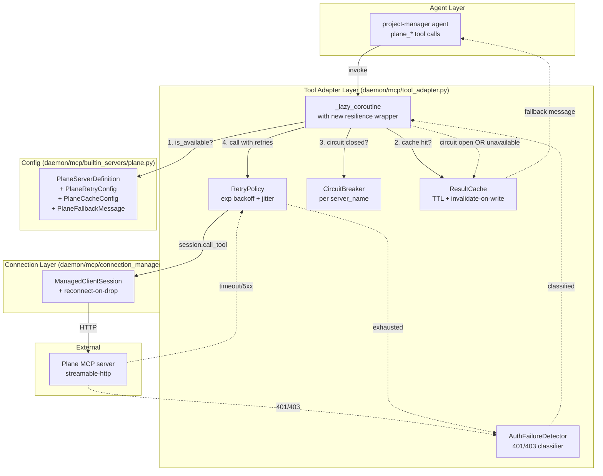

# Technical Analysis: Plane MCP Layer Improvements

**Date:** 2026-08-13
**Author:** planner[v2] via technical-analysis worker
**Analysis depth:** deep-dive
**Status:** Draft — Ready for Review
**Canonical source:** `plan-overview.md` — health check lifecycle (C5), merge order (W4), and cross-phase dependencies are authoritative there.

---

## Question

How should the Plane MCP layer be hardened to provide reliable, performant, and gracefully-degrading access to Plane project-management data for the `project-manager` agent? Specifically:

1. **Error handling** — Add retry with exponential backoff, circuit breaking, auth-failure detection, and session reconnection.
2. **Caching** — Add TTL-based result caching for read-heavy operations without breaking write-after-read consistency.
3. **Graceful degradation** — When Plane is unavailable, return structured fallbacks so the agent can continue operating.

The improvements must not break the other MCP servers (Plane is one of several builtin servers), and must follow the project's PostgreSQL-primary, dual-SQLite-compatible convention for any new persistence layer.

---

## Context Summary

The `project-manager` (PM) agent is a read-only strategic oversight agent created on 2026-08-13. It pulls project management data (issues, cycles, milestones) from an external Plane instance via the `plane_*` MCP tools exposed by `PlaneServerDefinition` (`daemon/mcp/builtin_servers/plane.py`). Tool names are overridden via `tool_name_prefix = "plane"` so that `list_issues` becomes `plane_list_issues` — bypassing the `tools.deny: ["mcp"]` filter and feeling native to the agent.

The current Plane MCP layer has **zero resilience primitives** beyond a per-call timeout:

- **No retry** — every transient failure (timeout, 5xx, connection reset) propagates immediately as a raw `ToolException` to the agent graph (`daemon/mcp/tool_adapter.py:455-475`).
- **No circuit breaker** — repeated failures do not trip any protection; the server can be hammered while down.
- **No result cache** — `McpService` caches schemas and tool instances (`daemon/services/mcp_service.py:164, 171`) but never caches tool call results. Every read re-fetches from Plane.
- **No auth-failure detection** — a missing or rotated `PLANE_MCP_API_KEY` surfaces as a generic "MCP tool call failed" exception, indistinguishable from a transient network blip.
- **No session reconnection** — when the streamable-http session drops, the connection is torn down and the next call lazily reconnects, but there is no proactive retry on the dropped connection itself.
- **No graceful degradation** — when Plane is unreachable, the agent sees opaque exceptions and must improvise. The PM agent's prompt does not yet instruct it on how to behave when `plane_*` tools are unavailable.

Plane's read/write profile (observed from typical usage): the PM agent is overwhelmingly read-heavy (listing projects, listing issues, fetching milestones, checking cycles). Writes are rare and explicit (`plane_create_issue` to log a PM-initiated decision, `plane_add_comment` for status notes). A 30-60s TTL on read operations is a reasonable staleness window given Plane's domain — PM is using Plane for status, not real-time coordination.

The codebase already has a working `CircuitBreaker` implementation (`daemon/sources/circuit_breaker.py:1-78`) used by source adapters (Discord, Slack) for external HTTP endpoints. It supports `CLOSED → OPEN → HALF_OPEN` state transitions with configurable `failure_threshold` and `recovery_timeout`. Reusing it for MCP would avoid a parallel implementation.

---

## Architecture

### Current Patterns

- **Lazy coroutine pattern** — `create_lazy_mcp_tools()` in `daemon/mcp/tool_adapter.py:281-374` returns `StructuredTool` objects whose coroutine defers connection until first call. The coroutine `_lazy_coroutine` at `daemon/mcp/tool_adapter.py:446-476` is the SINGLE point where every MCP tool call is dispatched.
- **Shared session cache per server** — `_get_session()` (lines 425-444) uses a double-checked-lock pattern with a module-level `shared_session_cache` dict keyed by `server_name`. Sessions are shared across instances.
- **Connection manager** — `McpConnectionManager` (`daemon/mcp/connection_manager.py:33-515`) owns the lifecycle of `ManagedClientSession` objects per `(instance_id, server_name)`, including stream cleanup on session failure.
- **Schema cache** — `McpService._schema_cache` (`daemon/services/mcp_service.py:171`) stores `list[McpToolSchema]` per server. Cleared on schema refresh.
- **Tool instance cache** — `McpService._tools_cache` (`daemon/services/mcp_service.py:164`) stores `list[StructuredTool]` per instance_id.
- **Source-adapter circuit breaker** — `daemon/sources/circuit_breaker.py` provides `CircuitBreaker` dataclass with async lock. Used by Discord/Slack for rate-limited external services.

### Module Boundaries

```
PM agent (plane_* tool calls)
        │
        ▼
McpService.get_mcp_tools_for_instance(instance_id)
        │ (returns cached StructuredTool list)
        ▼
StructuredTool.arun(**kwargs)
        │
        ▼
create_lazy_mcp_tools._lazy_coroutine(**kwargs)   ◄── daemon/mcp/tool_adapter.py:446-476
        │
        ├── _get_session()  ─────────────────────► shared_session_cache[server_name]
        │                                              │
        │                                              ▼
        │                                       ManagedClientSession (mcp.client.session)
        │                                              │
        │                                              ▼
        ├── session.call_tool(original_tool_name, kwargs)  ──► Plane MCP server (HTTP)
        │                                                          (PLANE_MCP_URL)
        │
        ├── (on timeout)            ──► raise ToolException("timed out after Xs")
        └── (on any other Exception)──► raise ToolException("MCP tool call failed for ...")


[Side-channel: PlaneServerDefinition]
   daemon/mcp/builtin_servers/plane.py:36-121
   ├── is_available()     ──► bool  (URL + API key env check)
   ├── get_base_config()  ──► {transport, url, headers}
   └── tool_name_prefix   ──► "plane"
```

**Boundary observations:**
- `_lazy_coroutine` is the **only** mutable site where every MCP call funnels through. Adding retry/circuit-breaker/cache here gives universal coverage.
- `is_available()` is a *boot-time* check (called by the bootstrap layer when registering builtin servers). It is NOT consulted at tool-call time. A server registered at boot but later disabled (env var removed) would still appear in tools.
- `McpConnectionManager` owns transport lifecycle, separate from the lazy coroutine. Session reconnection needs coordination between the two.

### Architecture Diagram (proposed)



---

## Integration Points

| # | Integration | Type | Contract | Auth | Failure Mode | File:Line |
|---|-------------|------|----------|------|--------------|-----------|
| 1 | PM agent → `plane_*` StructuredTool | sync (LangGraph tool call) | JSON kwargs → JSON result | meta.json `tools.allow: ["plane"]` | ToolException propagated to graph | `daemon/mcp/tool_adapter.py:446-476` |
| 2 | Tool adapter → MCP session | async (`session.call_tool`) | tool_name + kwargs dict | inherited from session transport | `Exception` → wrapped as ToolException | `daemon/mcp/tool_adapter.py:455-459` |
| 3 | MCP session → Plane HTTP server | streamable-http | JSON-RPC over HTTPS | `Authorization: Bearer $PLANE_MCP_API_KEY`, `x-workspace-slug` header | Connection reset / timeout / 401 / 403 / 5xx | `daemon/mcp/builtin_servers/plane.py:105-112` |
| 4 | Tool adapter → `McpConnectionManager` | async | `get_session(server_name)` | none (internal) | Session not initialized → bootstrapped on demand | `daemon/mcp/connection_manager.py:99-200` |
| 5 | Bootstrap layer → `is_available()` | sync | returns bool | env var check | returns False silently | `daemon/mcp/builtin_servers/plane.py:78-92` |
| 6 | Config layer → env vars | env at call time | strings | none | unset → server not registered | `daemon/mcp/builtin_servers/plane.py:90-104` |

### Integration Details

**Integration 1: PM agent → StructuredTool**
- **Protocol:** LangGraph tool calling — `StructuredTool.arun(**kwargs)` returns a string/list/dict
- **Data format:** JSON-serializable kwargs from the LLM tool-call
- **Authentication:** PM's `tools.allow` permits the `plane` category (meta.json:29); tool name prefix means the LLM sees `plane_list_issues`, not `mcp_plane_list_issues`, so `tools.deny: ["mcp"]` (line 63) does not filter it
- **Error handling:** `ToolException` bubbles up to the graph; the LLM sees it as a tool error and may retry or escalate — but the LLM has no semantic understanding of "Plane is down, use project history instead"
- **Observability:** standard logger in tool_adapter.py; no structured metrics today
- **Known issues:** no structured fallback; raw exception text leaks into the agent's context window

**Integration 3: Tool adapter → Plane HTTP**
- **Protocol:** streamable-http transport (POST + SSE)
- **Data format:** JSON-RPC 2.0
- **Authentication:** Bearer token + workspace slug header, both env-driven
- **Error handling:** currently ZERO — HTTP error status codes are caught as a generic `Exception` and wrapped into a `ToolException` that loses all status-code information
- **Observability:** `logger.debug(...)` only at the session layer; no metrics
- **Known issues:** 401/403 from a rotated API key is indistinguishable from a transient 5xx. Timeouts after `timeout_seconds` raise a generic message that does not suggest retryability.

---

## Trade-offs

### Alternatives Considered

1. **Option A: Plane-specific implementation** — All resilience logic lives inside `daemon/mcp/builtin_servers/plane.py` and is wired up by overriding `create_lazy_mcp_tools` for Plane tools only. Other MCP servers are untouched.
2. **Option B: Generic MCP-layer implementation** — Retry, circuit breaker, and cache are added to `daemon/mcp/tool_adapter.py:_lazy_coroutine` for ALL MCP servers. Plane-specific behavior (auth messages, fallback text) is supplied by `PlaneServerDefinition` via a hook or config dict.
3. **Option C: Hybrid — generic primitives, Plane-specific tuning** — Retry/circuit-breaker/cache primitives live in `tool_adapter.py` as a reusable middleware. Plane-specific config (TTL, auth-error messages, fallback text, on-demand health probe) lives in `PlaneServerDefinition` and is read by the middleware.

### Comparison

| Criterion | Option A (Plane-only) | Option B (Pure generic) | Option C (Hybrid) | Winner |
|-----------|----------------------|------------------------|-------------------|--------|
| **Performance** | Same — retry/cache happen at same call site | Same | Same | Tie |
| **Complexity** | Low at call site, high duplication if other servers want similar | Lowest duplication | Moderate — clean separation, two files to coordinate | C |
| **Maintainability** | One server benefits; future servers copy-paste | One bug affects all MCP servers equally | Each concern in its right place; per-server tuning without duplication | C |
| **Risk to other MCP servers** | Zero — only Plane changes | High — generic retry/circuit-breaker behavior may be wrong for context7, mcp_kb, etc. (different latency profile, different failure modes) | Low — primitives are opt-in; Plane opts in via config, others do nothing | C |
| **Time-to-implement** | Fastest for Plane alone, slowest overall | Medium | Medium | A (for Plane only) / C (for system health) |
| **Reusability** | Zero | High but unsafe | High and safe | C |
| **Testability** | Easy — isolated to Plane module | Harder — must cover all MCP servers in regression | Easy — primitives tested once, per-server configs tested per-server | C |

### Recommendation

**Pick: Option C — Hybrid (generic primitives, Plane-specific tuning)**

**Reasoning:**
1. The three improvements (retry, circuit breaker, cache) are textbook resilience patterns — they belong at the lowest common layer (`_lazy_coroutine`) where every MCP tool funnels through. Putting them only in `PlaneServerDefinition` would require either overriding the entire tool adapter for Plane or duplicating the logic for each server.
2. Other MCP servers (context7, mcp_kb, future additions) WILL benefit from these primitives, but their failure modes and latency budgets differ. Forcing generic behavior on them risks regressions. The hybrid lets each server opt in by providing config.
3. The PM agent's specific failure handling (the "Plane is unavailable" fallback message, the auth-error string, the read/write tool classification for caching) belongs in `PlaneServerDefinition` because that's the file that already knows about Plane's domain model and config env vars.

**Architecture:**
- `daemon/mcp/resilience.py` (new) — generic primitives: `RetryPolicy`, `CircuitBreaker` (reuse from sources/), `ResultCache`, `AuthFailureClassifier`
- `daemon/mcp/tool_adapter.py` — `_lazy_coroutine` becomes a thin wrapper that calls the primitives in order: `is_available check → cache lookup → circuit-breaker gate → retry-wrapped session.call_tool → cache write → auth-failure classification`
- `daemon/mcp/builtin_servers/plane.py` — new properties `retry_policy`, `cache_policy`, `fallback_message`, `auth_error_message` returning config the primitives consume
- `daemon/mcp/builtin_servers/base.py` — default config returns None (no resilience, preserving current behavior for servers that don't opt in)

**Assumptions:**
- Other MCP servers' failure modes are not yet characterized — we accept that they get NONE of the new behavior until they opt in (regression-safe).
- The retry budget is small enough (3 attempts × 1s/2s/4s backoff = ~7s total) to not significantly increase p99 latency on healthy calls.
- Plane workspace data changes infrequently enough that 30-60s TTL staleness is acceptable to the PM agent's use case (status snapshots, not real-time collaboration).

**Reversibility:**
- All new code is additive. If the resilience primitives misbehave, the per-server opt-in mechanism means each server can disable individually by returning None.
- The cache can be flushed via `McpService.invalidate_result_cache(server_name)` without restart.
- Circuit breaker state can be reset via `McpService.reset_circuit(server_name)` for emergency recovery.

---

## Scalability

### Growth Assumptions

- **Users:** ensemble project has ~10 active agents in production today; PM is one of them. Plane calls are bounded by PM's tool-call rate.
- **Data:** Plane workspaces hold 100s-1000s of issues typically. Each `plane_list_issues` call returns a few hundred KB.
- **Traffic:** PM is invoked ~1-10 times per hour on a typical day. Each invocation makes 2-5 Plane calls. Target: 100 calls/hour peak.
- **Latency budget:** Plane streamable-http typically responds in 100-500ms. Retries add 1+2+4 = 7s in worst case. Total budget per call: <10s.

### Current Bottlenecks

| # | Bottleneck | Threshold | File:Line | Impact |
|---|------------|-----------|-----------|--------|
| 1 | No result caching | Every read re-fetches Plane; 5 calls × 300ms = 1.5s wasted per PM turn | `daemon/mcp/tool_adapter.py:455-459` | Linear with PM invocation rate |
| 2 | No connection pooling | Each `session.call_tool` reuses one session; Plane backend has its own pool | `daemon/mcp/connection_manager.py` | Acceptable today; will bottleneck at 50+ calls/sec |
| 3 | Single-flight session acquire | `_get_session` lock holds during slow first-call bootstrap | `daemon/mcp/tool_adapter.py:437-444` | Only affects cold-start; rare |
| 4 | No circuit breaker | A down Plane blocks every PM turn until timeout × 5 | `daemon/mcp/tool_adapter.py:446-476` | High impact during Plane outages |

### Scaling Characteristics

- **Vertical vs horizontal:** Stateless daemon; horizontal scaling works (each daemon process has its own McpService caches — acceptable for result cache because TTL is short).
- **Stateless vs stateful:** Result cache is in-memory per daemon process. Restart loses cache — acceptable given short TTL. Circuit breaker state is also in-memory; restart = reset to CLOSED.
- **Sync vs async:** All MCP calls are already async via LangGraph. No sync bottleneck.
- **Scaling cliffs:**
  - **At 100+ PM calls/sec:** Result cache hit rate must exceed 80% to avoid Plane overload. Implement LRU eviction if cache size grows unbounded.
  - **At 1000+ tools registered:** Schema cache grows; schema refresh becomes expensive. Out of scope today (only ~5 builtin servers).

---

## Technical Debt

### Items Affecting This Analysis

| # | Debt Item | Impact on Recommendation | Severity | File:Line |
|---|-----------|--------------------------|----------|-----------|
| 1 | `is_available()` is boot-only, not runtime | Recommendation must add a runtime `is_available()` check in `_lazy_coroutine` to surface graceful degradation | Medium | `daemon/mcp/builtin_servers/plane.py:78-92` |
| 2 | No metrics/observability for MCP calls | Cannot measure cache hit rate or circuit-breaker effectiveness without adding structured logging | Medium | `daemon/mcp/tool_adapter.py:446-476` |
| 3 | `CircuitBreaker` lives in `daemon/sources/` — domain-coupled naming | Recommendation must move/alias it to a shared location, or import from sources/ which feels wrong for MCP | Low | `daemon/sources/circuit_breaker.py:1-78` |
| 4 | `tool_name_prefix` bypass of `tools.deny: ["mcp"]` is undocumented in PM meta.json | PM agent prompt should note that plane_* is allowed via prefix override, not explicit deny-list exception | Low | `agents/project-manager/meta.json:29, 63` |
| 5 | No structured error type from MCP layer | Auth-failure detection currently has to string-match exception messages; cleaner to define `McpAuthError`, `McpTransientError` exception hierarchy | Medium | `daemon/mcp/tool_adapter.py:463-475` |

### Items NOT Affecting This Analysis

- **PostgreSQL migration debt** — No new tables needed for this work (cache is in-memory). If persistent cache is added later, use `_ensure_postgres_columns()` per the 2026-06-19 convention.
- **OpenCode session registry** — separate persistence layer; no impact.
- **Skill evolution debt** — not relevant to MCP layer.

### Recommended Paydown

In priority order, address alongside the main implementation:

1. **Define `McpAuthError`, `McpTransientError`, `McpUnavailableError` exception types** in `daemon/mcp/errors.py`. Wrapping exceptions by class is more robust than string matching. → High value, low effort.
2. **Move `CircuitBreaker` to `daemon/utils/circuit_breaker.py`** (or re-export from `daemon/mcp/`) so importing it from `daemon/sources/` for MCP use doesn't pollute the abstraction. → Low value, low effort.
3. **Add structured logging** to `_lazy_coroutine`: `logger.info("mcp_call server=%s tool=%s cache=hit duration=%.3fs", ...)` so we can measure cache effectiveness. → Medium value, low effort.

---

## Implementation Tasks

> **W4 Merge Order:** Phase 4 merges **AFTER** Phase 1+2+3 (PR 1). Phase 4 is NOT independent — PM prompts (Phase 1) document the Plane degradation behavior that Phase 4 implements at the tool layer. See `plan-overview.md` → "Cross-Phase Dependencies & Merge Order".

Ordered by dependency (must be done in sequence):

### Phase 4.1: Generic Resilience Primitives (foundation)

| # | Task | Files | Effort | Risk |
|---|------|-------|--------|------|
| 1 | Define `McpError` exception hierarchy (`McpAuthError`, `McpTransientError`, `McpUnavailableError`, `McpToolError`) | new: `daemon/mcp/errors.py` | S | Low |
| 2 | Move/alias `CircuitBreaker` to `daemon/mcp/resilience.py` (re-export from `daemon/sources/circuit_breaker.py`) | new: `daemon/mcp/resilience.py`; modify: `daemon/sources/circuit_breaker.py` (no change, just re-export) | S | Low |
| 3 | Implement `RetryPolicy` dataclass (max_attempts, base_delay, max_delay, jitter, retryable_exceptions) | new: `daemon/mcp/resilience.py` | S | Low |
| 4 | Implement `ResultCache` (TTL-based dict, thread-safe via asyncio.Lock, per-server scope, invalidate method) | new: `daemon/mcp/resilience.py` | M | Low |
| 5 | Implement `AuthFailureClassifier` — parse `Exception` text/status for 401/403; raise `McpAuthError` | new: `daemon/mcp/resilience.py` | S | Medium (string-match is fragile; see debt #5) |
| 6 | Extend `McpService` to own per-server instances of `CircuitBreaker` + `ResultCache`; expose `get_resilience_for(server_name)` | modify: `daemon/services/mcp_service.py` | M | Medium |
| 7 | Modify `_lazy_coroutine` to: (a) call `is_available` at runtime, (b) check circuit-breaker, (c) check cache, (d) retry-wrapped `session.call_tool`, (e) classify exceptions, (f) cache results | modify: `daemon/mcp/tool_adapter.py:446-476` | L | High (touches every MCP call) |

### Phase 4.2: Plane-Specific Tuning (opt-in)

| # | Task | Files | Effort | Risk |
|---|------|-------|--------|------|
| 8 | Define `PlaneResilienceConfig` (TTL=60s, max_retries=3, base_delay=1.0, failure_threshold=5, recovery_timeout=60.0, fallback_message) | modify: `daemon/mcp/builtin_servers/plane.py` | S | Low |
| 9 | Define `PLANE_READ_TOOLS` set (`plane_list_*`, `plane_get_*`, `plane_search_*`) for cacheable classification | modify: `daemon/mcp/builtin_servers/plane.py` | S | Low |
| 10 | Define `PLANE_WRITE_TOOLS` set (`plane_create_*`, `plane_update_*`, `plane_delete_*`, `plane_add_*`) for cache-invalidation triggers | modify: `daemon/mcp/builtin_servers/plane.py` | S | Low |
| 11 | Wire `PlaneServerDefinition` to expose `resilience_config`, `is_read_tool(name)`, `is_write_tool(name)` via the `BuiltinServerDefinition` base class | modify: `daemon/mcp/builtin_servers/base.py`, `daemon/mcp/builtin_servers/plane.py` | M | Low |
| 12 | After every write tool, invalidate cache entries whose key matches the `(server_name, *, args_namespace)` pattern (best-effort: invalidate all entries for the server) | modify: `daemon/mcp/tool_adapter.py` | S | Low |
| 13 | Add `PlaneServerDefinition.fallback_message()` returning structured JSON: `{"status": "unavailable", "source": "plane", "message": "Plane MCP is currently unreachable. Using local project history only."}` | modify: `daemon/mcp/builtin_servers/plane.py` | S | Low |

### Phase 4.3: Graceful Degradation + On-Demand Health Probe (C5 FIX)

> **C5:** The original plan proposed a periodic background task (60s interval) calling `plane_list_projects`. **Replaced** with a simpler on-demand probe inside `_lazy_coroutine`. No `health_monitor.py` file. No background daemon. No periodic timer.

| # | Task | Files | Effort | Risk |
|---|------|-------|--------|------|
| 14 | **On-demand health probe** — when `_lazy_coroutine` is called and circuit breaker is OPEN with `recovery_timeout` elapsed, send a single probe call (HALF_OPEN transition). If probe succeeds → circuit closes, return cached result. If fails → circuit stays OPEN, return fallback JSON. | modify: `daemon/mcp/tool_adapter.py` (no new file) | S | Low |
| 15 | **`is_available()` enhancement** — return False if `last_success_timestamp` is older than 5 minutes (stale), OR if env vars are missing. This is a cheap in-memory check inside `_lazy_coroutine`, not a separate probe. | modify: `daemon/mcp/builtin_servers/plane.py` | S | Low |
| 16 | Surface `last_health_status` in PM agent's context (via shared_meta_kv or as a synthetic tool output) | modify: PM prompt via cross-phase work | M | Low (cross-phase) |
| 17 | When `_lazy_coroutine` decides Plane is unavailable (is_available=False OR circuit OPEN), return the fallback JSON instead of raising `ToolException` — agent sees structured absence rather than an exception | modify: `daemon/mcp/tool_adapter.py` | S | Medium |

### Phase 4.4: Observability + Metrics

| # | Task | Files | Effort | Risk |
|---|------|-------|--------|------|
| 18 | Add structured log fields: `cache_hit`, `retry_count`, `circuit_state`, `duration_ms` to `_lazy_coroutine` | modify: `daemon/mcp/tool_adapter.py` | S | Low |
| 19 | Add Prometheus-style counter hooks (optional): `mcp_calls_total{server, tool, outcome}`, `mcp_cache_hits_total{server}`, `mcp_circuit_state{server}` | modify: `daemon/mcp/resilience.py`, `daemon/services/mcp_service.py` | M | Low |

### Phase 4.5: Testing

See Testing Strategy section below.

### Phase 4.6: Documentation

| # | Task | Files | Effort | Risk |
|---|------|-------|--------|------|
| 20 | Add docstring to `PlaneServerDefinition` describing the new resilience behavior + env vars (`PLANE_MCP_URL`, `PLANE_MCP_API_KEY`, `PLANE_CACHE_TTL_SECONDS`, `PLANE_RETRY_MAX_ATTEMPTS`, `PLANE_CIRCUIT_FAILURE_THRESHOLD`) | modify: `daemon/mcp/builtin_servers/plane.py` | S | Low |
| 21 | Update `agents/project-manager/soul.md` and `workflow.md` to document degradation behavior (cross-phase work, handed off to prompts worker) | modify: `agents/project-manager/*` | M | Low |

---

## Testing Strategy

Extend `tests/unit/test_plane_mcp.py` (currently 497 lines) with the following test groups. Add a new file `tests/unit/test_mcp_resilience.py` for the generic primitives.

### Generic Primitives — `tests/unit/test_mcp_resilience.py` (new)

| Test | Scenario |
|------|----------|
| `test_retry_policy_succeeds_after_transient` | Mock `session.call_tool` to raise `McpTransientError` twice, succeed on 3rd. Verify `RetryPolicy` retries. |
| `test_retry_policy_gives_up_after_max_attempts` | Mock `call_tool` to always raise. Verify after `max_attempts`, `McpTransientError` is raised with attempt count. |
| `test_retry_policy_does_not_retry_auth_errors` | Mock `call_tool` to raise `McpAuthError`. Verify NO retry; raised immediately. |
| `test_retry_policy_exponential_backoff` | Mock `time.monotonic`. Verify delay between attempts is `base_delay * 2^attempt + jitter`. |
| `test_circuit_breaker_opens_after_threshold` | Mock `record_failure` × `failure_threshold`. Verify `can_execute()` returns False. |
| `test_circuit_breaker_half_open_after_timeout` | Open circuit; advance `time.monotonic` past `recovery_timeout`. Verify `can_execute()` returns True. |
| `test_circuit_breaker_closes_on_success` | HALF_OPEN state; record success. Verify state goes to CLOSED. |
| `test_result_cache_hit_within_ttl` | Cache entry with TTL=60s. Query at t=30s. Verify hit. |
| `test_result_cache_miss_after_ttl` | Cache entry with TTL=60s. Query at t=61s. Verify miss + refetch. |
| `test_result_cache_invalidate_by_server` | Populate 5 entries for "plane". Call `invalidate("plane")`. Verify all 5 evicted. |
| `test_result_cache_concurrent_access` | 10 concurrent `get` calls on cold cache. Verify only 1 underlying fetch (asyncio.Lock). |
| `test_auth_classifier_detects_401` | Exception message contains "401". Verify raised as `McpAuthError`. |
| `test_auth_classifier_detects_403` | Exception message contains "403". Verify raised as `McpAuthError`. |
| `test_auth_classifier_5xx_is_transient` | Exception message contains "503". Verify raised as `McpTransientError`. |

### Plane-Specific — extend `tests/unit/test_plane_mcp.py`

| Test | Scenario |
|------|----------|
| `test_plane_cache_hit_on_list_issues` | First call → Plane mock. Second call → cache hit, no Plane mock invocation. |
| `test_plane_write_invalidates_cache` | `plane_create_issue` followed by `plane_list_issues` → refetch from Plane. |
| `test_plane_unavailable_returns_fallback` | `is_available()` returns False. Call `plane_list_issues`. Verify returns fallback JSON, NOT `ToolException`. |
| `test_plane_circuit_open_short_circuits` | Trip circuit (5 failures). Call `plane_list_issues`. Verify returns fallback immediately, no Plane call attempted. |
| `test_plane_auth_error_clear_message` | Mock Plane returns 401. Call tool. Verify `McpAuthError` raised with message "Plane authentication failed — check PLANE_MCP_API_KEY". |
| `test_plane_health_check_updates_state` | `is_available()` returns False when `last_success_timestamp` is > 5 minutes stale (monkeypatched). Verify no background daemon is involved. |
| `test_plane_resilience_config_defaults` | No env vars beyond required. Verify TTL=60s, retries=3, fallback message is default string. |
| `test_plane_resilience_config_env_override` | Set `PLANE_CACHE_TTL_SECONDS=120`. Verify config reflects 120s. |

### Integration / E2E

Per project convention: full e2e tests are MANDATORY if changes touch job/task/queue system. This phase does NOT touch those — it is bounded to the MCP layer and Plane-specific config. So a focused integration test against the real daemon is sufficient:

- Spin up daemon with mocked Plane MCP (record/replay), invoke PM agent with `plane_list_issues` twice, verify second call does not hit mock.
- Mock Plane returns 401 once, 200 on retry, verify tool call succeeds and circuit-breaker does not open.

---

## Risks & Mitigations

| # | Risk | Probability | Impact | Mitigation |
|---|------|-------------|--------|------------|
| 1 | Retry storms against Plane when it is genuinely down | Medium | Medium | Circuit breaker opens after 5 failures → 60s cool-down → no further calls until HALF_OPEN probe succeeds |
| 2 | Cache returns stale data after a write that happened via another Plane client (e.g. a human edited an issue) | Medium | Low | 60s TTL bounds staleness; document the trade-off in `PlaneServerDefinition` docstring |
| 3 | Auth-error classifier string-matches exception messages; Plane library upgrades could change wording | Medium | Medium | Raise `McpAuthError` based on HTTP status code from `mcp.client.session`, not string matching; fall back to string match only if status not available |
| 4 | Cache hit returns wrong data when multiple PM instances query different projects with same tool name | Low | High | Cache key includes `args_hash` (canonical JSON of kwargs) — verified by existing schema cache pattern |
| 5 | Circuit-breaker state is per-process; multiple daemon processes each have their own state | Low | Low | Acceptable — Plane is one upstream, so per-process CB is consistent; document for future consideration |
| 6 | `is_available()` runtime check is racy with env var changes mid-flight | Low | Low | Worst case: tool call attempted on disabled server, fails, circuit opens; acceptable degradation |
| 7 | Generic resilience primitives may slow down low-latency servers (context7 ~100ms p99) | Medium | Low | Each server opts in by providing config; non-Plane servers default to no resilience (current behavior) |
| 8 | Health check adds complexity — but on-demand probe is simpler than a daemon | Low | Low | C5: on-demand probe inside `_lazy_coroutine` only when circuit is HALF_OPEN. No background task, no timer, no `health_monitor.py`. Minimal complexity. |
| 9 | Result cache memory grows unbounded if tool args are highly varied | Low | Medium | Implement soft cap (e.g. 1000 entries per server) with LRU eviction |
| 10 | PM agent prompt does not yet know how to interpret the new fallback JSON | High | Medium | Cross-phase work — flagged as Task #21; PM prompt worker adds "if you see `status: unavailable`, use local project history" |

---

## Open Questions

1. **Should the result cache be persistent?** Today it's in-memory per process. If multiple daemon processes serve the same project, each has its own cache. Is that acceptable, or do we want a Redis/shared cache? **Assumed: in-memory is fine for Phase 4; revisit if multi-daemon deploys become common.**
2. **What is the read/write tool naming convention for Plane?** Plane MCP exposes tools like `plane_list_issues`, `plane_create_issue`, `plane_get_project`. Are there tools that are BOTH read and write (e.g. `plane_update_issue` returns the updated record)? **Assumed: tool-name prefix (`list_`/`get_`/`search_` = read, `create_`/`update_`/`delete_`/`add_` = write). Verify against Plane MCP tool list during implementation.**
3. **Should health-check failures also trip the circuit breaker, or are they independent?** **Resolved (C5):** There is no separate health-check daemon — the on-demand probe IS the circuit breaker HALF_OPEN transition. When the circuit recovers (`recovery_timeout` elapsed), the next `_lazy_coroutine` call acts as the probe. If it succeeds, the circuit closes. If it fails, the circuit stays OPEN. No chicken-and-egg loop possible.
4. **Should the fallback message be returned as a string or as structured JSON?** JSON is more parseable but changes the contract for every MCP tool. String is simpler. **Assumed: structured dict that `_convert_call_tool_result` serializes to JSON string — matches Plane's normal return format and is grep-able by the agent.**

---

## References

- **Architecture: Core Architecture** — `daemon/manager.py`, `daemon/mcp/builtin_servers/base.py`
- **Architecture: Skill Evolution System** — `daemon/services/skill_search_service.py` (reference pattern for tiered, opt-in service composition)
- **Pattern: Source-adapter circuit breaker** — `daemon/sources/circuit_breaker.py:1-78` (reused for MCP)
- **Pattern: Pause-First Then Quiesce** — not relevant to this phase (no instance state changes)
- **Convention: Agent prompt writing guide** — `docs/agent-prompt-writing-guide.md` (applies to Task #21 — PM prompt update)
- **Convention: PostgreSQL primary, dual SQLite/PG support** — `_ensure_postgres_columns()` (no new tables needed in this phase)
- **Related Phase 1 work** — PM agent prompts (cross-phase; this analysis assumes Phase 1 prompts worker handles PM prompt updates for degradation messaging)
- **Test convention: full e2e if touching job/task/queue** — `agents/tester/rules/ensure.md` (does NOT apply; this phase is bounded to MCP layer)
- **Research finding 1** — `daemon/mcp/tool_adapter.py:446-476` is the SINGLE mutation point for all MCP tool calls
- **Research finding 2** — `daemon/mcp/builtin_servers/plane.py:78-92` `is_available()` is boot-time only
- **Research finding 3** — `daemon/services/mcp_service.py:164, 171` only caches schemas and tool instances, never results
