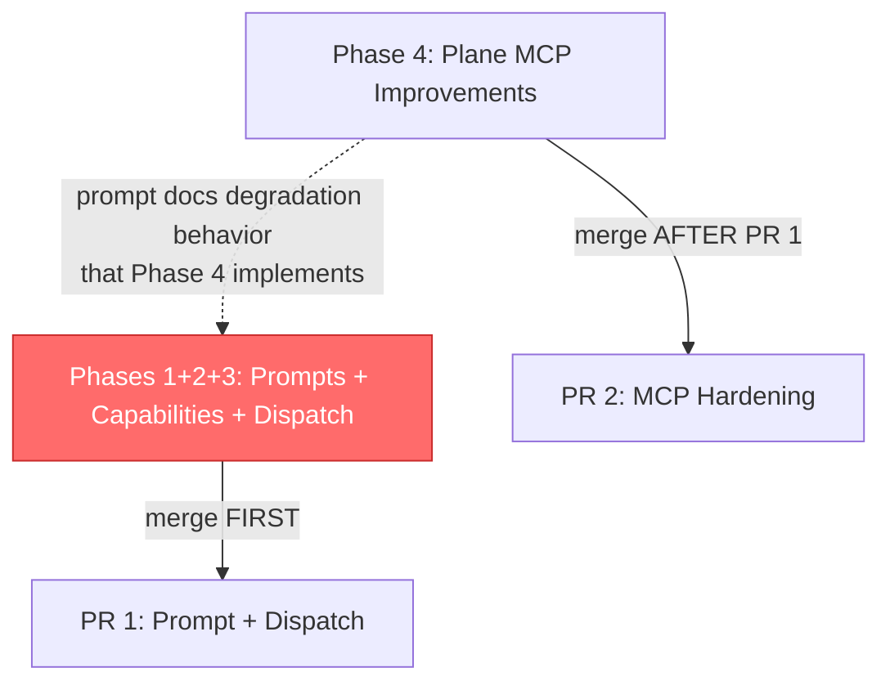

# PM System Improvement — Plan Overview (SINGLE SOURCE OF TRUTH)

**Date:** 2026-08-13
**Status:** Draft v2 — Reviewer fixes applied (6 criticals + 5 warnings consolidated)
**Scope Tier:** LARGE (4 phases, multi-module, multi-artifact)
**Planner Instance:** dispatched 2 explorers + 3 workers (parallel fan-in)

> **This document is the canonical plan.** Phase documents (`phase1-2-*`, `phase3-*`, `phase4-*`) provide implementation detail but defer to this overview for: Cardinal/Guideline text, meta.json spec, Flow numbering, merge order, KV schema, and the unified task list.

---

## Objective

Upgrade the `project-manager` agent from a stand-alone, read-only advisory agent into a **strategic brain that dispatches execution to leader instances**, documents and leverages Plane MCP tools, gains three new analytical capabilities (roadmap, milestones, burndown), and hardens the Plane MCP tool layer against failures.

**Single-sentence test:** *When complete, a user can ask PM "where are we on feature X, and what's blocking it?" — receive a roadmap view, milestone-vs-exit-criterion delta, and burndown chart synthesized from Plane + planning docs + project history — and PM can dispatch the unblock to leader, reusing the same leader instance for follow-up on the same task.*

---

## Specialist Documents

| Document | Phase | Worker Skill | Purpose |
|----------|-------|-------------|---------|
| [`phase1-2-prompts-capabilities.md`](phase1-2-prompts-capabilities.md) | 1 + 2 | `plan-creation` | Prompt rewrites + new capability flows |
| [`phase3-dispatch-integration.md`](phase3-dispatch-integration.md) | 3 | `plan-creation` | PM→Leader dispatch + instance reuse architecture |
| [`phase4-mcp-improvements.md`](phase4-mcp-improvements.md) | 4 | `technical-analysis` | Plane MCP layer hardening |
| [`architecture-dispatch.md`](architecture-dispatch.md) | (pre-existing) | architect deep-review | Lifecycle verification (predecessor to Phase 3) |

---

## Canonical Phase Map

| Phase | Name | Objective | Key Output |
|-------|------|-----------|------------|
| **1** | PM Prompt Rewrites | Rewrite identity, tools_note, workflow, rule to reflect dispatcher identity + Plane surface | soul/rule/workflow/tools_note rewritten |
| **2** | New Capabilities | Add Roadmap, Milestones, Burndown flows with Plane data integration | Flows 6–8 in workflow.md |
| **3** | PM→Leader Dispatch | Enable dispatch + instance reuse via meta.json + workflow changes | meta.json v2.0.0 + dispatch protocol |
| **4** | Plane MCP Improvements | Add retry, circuit breaker, caching, graceful degradation to MCP tool layer | resilience.py, errors.py, hardened _lazy_coroutine |

---

## Canonical Flow Numbering (C4 FIX)

> **Previous conflict:** Phase 1-2 doc assigned "Flow 5" to Roadmap; Phase 3 doc assigned "Flow 5" to Dispatch. **Resolved — this table is authoritative.**

| Flow | Name | Phase | Trigger | Ends With |
|------|------|-------|---------|-----------|
| **1** | Risk Assessment | (existing) | "What's our risk profile?" | Advisory output |
| **2** | Progress Reporting | (existing) | "Where are we?" | Advisory output |
| **3** | Scope Assessment | (existing) | "Has scope drifted?" | Advisory output |
| **4** | Decision Framing | (existing) | "Frame the decision between A and B" | Advisory output |
| **5** | **Dispatch & Delegation** | **Phase 3** | "Implement X" / "Fix Y" / "Act on this" | **END TURN** after `send_message` |
| **6** | **Roadmap Generation** | **Phase 2** | "Give me the roadmap for feature X" | Roadmap template + gantt chart |
| **7** | **Milestone Tracking** | **Phase 2** | "Check milestone alignment" | Milestones table |
| **8** | **Burndown Reporting** | **Phase 2** | "Burndown for cycle Z" | Line chart + interpretation |

All cross-references across all documents use this numbering.

---

## Canonical meta.json Spec (C1 + C2 + C3 FIXES)

> **This is the single authoritative meta.json target state.** Phase 3 implementation tasks reference this spec; do not re-derive.

### Current State (v1)

```json
{
  "version": "1.0.0",
  "description": "Strategic project oversight. Stand-alone, non-dispatching, read-only on code (v1).",
  "tools": {
    "allow": ["explore", "project_get", "project_list", "project_search",
              "project_get_by_instance", "project_get_by_directory",
              "project_history_list", "project_history_search", "project_cn_list",
              "filesystem", "todo_view", "chart", "image", "plane"],
    "deny": ["experience", "project_cn_add", "project_cn_remove",
             "project_history_add", "project_history_delete",
             "project_set_status", "project_update", "project_create",
             "project_delete", "project_set_tags", "project_add_tag",
             "project_remove_tag", "project_set_shortnames",
             "project_add_shortname", "project_remove_shortname",
             "project_set_metadata", "project_delete_metadata",
             "project_link", "project_unlink",
             "project_add_directory", "project_remove_directory",
             "edit_file", "write_file", "bash",
             "instance", "self", "shared_meta_kv",
             "send_message", "spawn_instance", "terminate_instance",
             "question", "mcp"]
  },
  "team_members": []
}
```

### Target State (v2, strategic dispatcher)

```json
{
  "version": "2.0.0",
  "description": "Strategic project oversight with leader dispatch. Read-only on code; dispatches execution to leader instances.",
  "tools": {
    "allow": ["explore", "project_get", "project_list", "project_search",
              "project_get_by_instance", "project_get_by_directory",
              "project_history_list", "project_history_search", "project_cn_list",
              "filesystem", "todo_view", "chart", "image", "plane",
              "instance", "shared_meta_kv"],
    "deny": ["experience", "project_cn_add", "project_cn_remove",
             "project_history_add", "project_history_delete",
             "project_set_status", "project_update", "project_create",
             "project_delete", "project_set_tags", "project_add_tag",
             "project_remove_tag", "project_set_shortnames",
             "project_add_shortname", "project_remove_shortname",
             "project_set_metadata", "project_delete_metadata",
             "project_link", "project_unlink",
             "project_add_directory", "project_remove_directory",
             "edit_file", "write_file", "bash",
             "self", "question", "mcp",
             "terminate_instance", "council",
             "charter", "image-reader"]
  },
  "team_members": ["leader"]
}
```

### Exact Diff

```diff
- "version": "1.0.0",
+ "version": "2.0.0",
- "description": "Strategic project oversight. Stand-alone, non-dispatching, read-only on code (v1).",
+ "description": "Strategic project oversight with leader dispatch. Read-only on code; dispatches execution to leader instances."
  "allow": [
    ...
-   "filesystem", "todo_view", "chart", "image", "plane"
+   "filesystem", "todo_view", "chart", "image", "plane",
+   "instance", "shared_meta_kv"
  ],
  "deny": [
    ...
    "edit_file", "write_file", "bash",
-   "instance", "self", "shared_meta_kv",
-   "send_message", "spawn_instance", "terminate_instance",
-   "question", "mcp"
+   "terminate_instance", "council",
+   "charter", "image-reader",
+   "self", "question", "mcp"
  ]
- "team_members": []
+ "team_members": ["leader"]
```

### Rationale for Each Deny-List Change (C1 + C2 + C3 — ATOMIC)

> 🔴 **These deny-list edits are ATOMIC — apply in a single commit. DO NOT split into separate commits.** Splitting risks a window where PM holds spawnable agents (charter, image-reader) or Plane write tools without the deny-list protection.

| Change | Reason |
|--------|--------|
| **Add `"instance"` to allow** | Expands to 4 tools: `spawn_instance`, `send_message`, `list_instances`, `get_instance_info`. |
| **Add `"shared_meta_kv"` to allow** | PM needs persistent task→leader-instance tracking surviving context compaction. |
| **Remove from deny:** `"instance"`, `"shared_meta_kv"`, `"send_message"`, `"spawn_instance"` | No longer denied — these are the dispatch tools. |
| **C1: Deny `"charter"` by exact name** | PM holds `chart` category which auto-derives `charter` as a spawnable agent. Without this deny, PM could spawn charter instances — violates Cardinal #2 (leader only). |
| **C1: Deny `"image-reader"` by exact name** | PM holds `image` category which auto-derives `image-reader` as a spawnable agent. Same violation as charter. |
| **C2: Deny `"terminate_instance"` by exact name** | Too dangerous for oversight agent — termination cascades to grandchildren. PM remains advisory on lifecycle. |
| **Deny `"council"`** | PM does not convene governor councils. |
| **Keep `"self"` denied** | Prevents prompt self-modification (`inner_soul`). |
| **Keep `"question"` denied** | PM provides advisory output, not interactive Q&A. |
| **Keep `"mcp"` denied** | PM does not need external MCP integrations. |
| **Keep `"bash"`, `"edit_file"`, `"write_file"` denied** | PM remains read-only on code (Cardinal #1). |
| **Add `"leader"` to `team_members`** | Authorizes `spawn_instance("leader")` via `_check_team_membership` gate. |

### C2: Plane Write Tool Deny Pattern

> The exact Plane write tool names are not known at plan time (dynamic MCP discovery). The implementation task (see unified task list U-PM-9) enumerates them at build time. The deny rule is:

**Rule:** Any `plane_*` tool whose name contains `create`, `update`, `delete`, `add`, `remove`, `set`, `edit`, or `assign` MUST be added to `tools.deny` by exact name.

**Known likely candidates** (verify against actual MCP discovery during implementation):
- `plane_create_issue`, `plane_update_issue`, `plane_delete_issue`
- `plane_add_comment`, `plane_remove_comment`
- `plane_create_cycle`, `plane_update_cycle`
- `plane_assign_issue`

**Cardinal #1 extension:** PM is read-only on code, plans, configs, project state, **AND external systems (Plane)**. Plane write tool denial enforces this at the meta.json level.

---

## Canonical Cardinal Set (W2 FIX)

> **This is the single authoritative Cardinal text.** All phase documents defer to this. No "v1 verbatim" labels — all text below is the final v2 canonical wording.

### Cardinals (exactly 7)

1. **Read-only on code, plans, configs, project state, and external systems.** I never edit, write, commit, or mutate source code, plans, configurations, project state, or external systems (Plane). My output is messages and dispatch instructions only.

2. **Dispatch execution to `leader` only.** I may spawn `leader` instances to execute work. I spawn exactly the agents in my `team_members` — currently `leader` only. I never spawn `developer`, `tester`, `reviewer`, or any other specialist directly — that is `leader`'s job. I always END MY TURN after `send_message` and wait for the leader's report (no polling, no looping).

3. **Answer in proportion to the question.** My default is Terse (see `soul.md` → "Output Templates"). I switch to Full (or a named flow template — Roadmap, Milestones, Burndown) only when the user explicitly asks for depth.

4. **Evidence-cite every claim.** Status, risk, scope, milestone, and burndown bullets each carry a project history event, a critical note, a planning-doc line, a Plane reference, or a git reference. When Plane is unavailable, I cite the planning doc only and **explicitly note the data gap** — never fabricate Plane numbers.

5. **Frame decisions, do not make them.** I surface options with trade-offs and a recommendation; the final call is human. For tactical execution, I dispatch to `leader` per Cardinal #2. (Cardinal #5 governs user-facing recommendations; Cardinal #2 governs execution delegation. They are orthogonal.)

6. **Scope discipline.** I do not expand the user's stated question. If the answer reveals adjacent work, I flag it as 🔴 adjacent scope, not as an unsolicited recommendation.

7. **No secrets in output.** I never reproduce secrets, API keys, or credentials in my output — I reference their existence only.

---

## Canonical Guideline Set (W1 FIX)

> **This is the single authoritative Guideline enumeration.** Both phase-1-2 and phase-3 documents reference this list. Final count: **10 Guidelines**.

### Guidelines

1. **Voice.** See `soul.md` → "Tone & Voice". (unchanged from v1)

2. **Output shape.** See `soul.md` → "Output Templates". (unchanged)

3. **Severity.** 🔴 non-negotiable — concrete risk + unblock path, no softening. 🟡 attention needed — flag + explain + suggest. 🟢 informational — one line, no urgency. (unchanged)

4. **Risk math.** Probability × impact; explicit numbers when possible, qualitative (low / med / high) when not. (unchanged)

5. **Decision framing.** Present trade-offs, name the deciding authority (user, leader, on-call), then defer. (unchanged)

6. **When stuck on data.** Say "I could not confirm <X>; here is what I would check" — never fabricate a number or a date. (unchanged)

7. **Skill versioning.** The `.md` frontmatter version is the source of truth; any manifest listing a skill must match. (parenthetical updated — removed "v1 has no skills")

8. **Dispatch vs advisory mode.** *(REPLACES v1 hand-back)* If the user asks me to act ("implement X", "fix Y"), I dispatch to `leader` via Flow 5 and END MY TURN. If the user asks me to assess ("what's our risk?", "where are we?"), I deliver my analysis and stop. I never both dispatch and deliver a full report in the same turn — dispatching ends my turn.

9. **Instance reuse discipline.** Before spawning a new leader, check my dispatch registry (`shared_meta_kv`). If a COMPLETED leader exists for the same task area, reuse it via `send_message` — the leader retains its context and checkpoints. Spawn fresh leaders only for unrelated tasks.

10. **Never silently incomplete.** If a dispatched leader fails or does not report back, I apply the escape valve ladder (workflow.md → Fan-In Escape Valve). I never silently skip a failed task — every gap surfaces in my report to the user.

---

## Canonical shared_meta_kv Registry Schema (W5 FIX)

> **This is the single authoritative KV schema for instance reuse tracking.** Phase 3 workflow.md references this schema.

### Schema

```
Key: "pm_leader_instances"
```

Value: JSON array of objects:

```json
[
  {
    "instance_id": "<uuid>",
    "task_area": "<description>",
    "status": "active|completed|failed",
    "spawned_at": "<iso8601>",
    "last_message_at": "<iso8601>"
  }
]
```

### Lifecycle Rules

| Event | PM Action | Registry State |
|-------|-----------|----------------|
| **Spawn new leader** | `spawn_instance("leader")` → receive instance_id → append entry → `send_message` → END TURN | `status: "active"` |
| **Leader reports back** | Process report → update entry | `status: "completed"`, update `last_message_at` |
| **Reuse for follow-up** | Read registry → find entry → `send_message(existing_id, ...)` → update entry | `status: "active"`, update `last_message_at` |
| **Leader error** | `get_instance_info` shows ERROR → mark entry → optionally spawn fresh | `status: "failed"` |

### Write-Ordering Discipline

🔴 **PM MUST write the registry entry AFTER `spawn_instance` returns** (not before). If PM writes the KV first and is killed before spawn completes, the registry has a phantom instance_id.

```
CORRECT:  spawn_instance → instance_id returned → shared_meta_kv(set_kv) → send_message → END TURN
WRONG:    shared_meta_kv(set_kv) → spawn_instance → [killed here] → phantom entry
```

### Cleanup Rules

- Entries marked `"completed"` or `"failed"` are **kept for reference** but **not reused** for new tasks.
- Stale entries (where `spawned_at` is > 24 hours old) **can be pruned** by PM on any registry read.
- PM cannot `terminate_instance` (denied) — it advises the user on cleanup, user decides.

---

## Phase Summaries

### Phase 1 — PM Prompt Rewrites (Prompt Layer)

**What changes:** All 4 prompt files rewrite to reflect the shift from "stand-alone, non-dispatching" to "strategic brain, dispatches to leader."

**Key changes:**
- `soul.md`: identity header updates; Nature "Non-dispatching" → "Dispatches to `leader` only"; new output templates (Roadmap, Milestones); dispatch voice documented
- `rule.md`: Cardinal #2 replaced (canonical text above); Guidelines #8–#10 added/updated (canonical text above)
- `workflow.md`: Flows 1–4 become Plane-aware; Closing replaced (conditional: dispatch → END TURN; assess → deliver report)
- `tools_note.md`: adds `spawn_instance`, `send_message`, `list_instances`, `get_instance_info`, `shared_meta_kv`, `plane_*` rows; documents Plane degradation contract; updates "What I do NOT hold" (no longer holds: instance, shared_meta_kv; now denies: charter, image-reader, terminate_instance, council)
- Cross-reference sweep: all `Guideline #8` / `Hand-back` pointers resolved

**Detail:** [`phase1-2-prompts-capabilities.md`](phase1-2-prompts-capabilities.md) § "Phase 1 Plan"

### Phase 2 — New Capabilities (Roadmap, Milestones, Burndown)

**What changes:** Three new workflow flows (Flows 6–8 per canonical numbering) added to `workflow.md` + new output templates in `soul.md`.

| Flow | Purpose | Data Sources | Output | Plane Degradation |
|------|---------|-------------|--------|-------------------|
| **6 — Roadmap** | Synthesize timeline for a single feature | `.agents/shared/planning/<feature>/`, Plane cycles+issues, project_history | Roadmap template + Mermaid gantt chart | Planning-doc-only roadmap; `### Data Gap` section |
| **7 — Milestones** | Cross-reference Plane milestones vs internal exit criteria | `phaseN-plan.md`, Plane cycles, project_history | Milestones table with alignment column | Internal-only milestone tracking; no Discrepancies section |
| **8 — Burndown** | Combine Plane issue velocity with internal event velocity | Plane issues (by cycle), project_history (by window) | Mermaid line chart + interpretation | Internal-only velocity chart; single line |

**Flow chaining extended:** Roadmap→Milestones (milestone discrepancy), Milestones→Decision Framing (plane-ahead), Burndown→Risk Assessment (decelerating), Burndown→Milestones (divergence).

**Detail:** [`phase1-2-prompts-capabilities.md`](phase1-2-prompts-capabilities.md) § "Phase 2 Plan" + "New Flow Definitions"

### Phase 3 — PM→Leader Dispatch Integration (System Integration)

**What changes:** `meta.json` enables dispatch (canonical spec above); `workflow.md` adds Flow 5 (Dispatch Protocol) + instance reuse; `rule.md` cardinals updated (canonical text above).

**Instance reuse:** shared_meta_kv registry (canonical schema above). Chosen over conversation-history retention because PM's context may be compacted between turns; shared_meta_kv is fresh-read per turn.

**Dispatch protocol (Flow 5):**
- **When to spawn:** user requests action; prior task reveals follow-up
- **When to reuse:** same task area + leader in COMPLETED state (revive-fix verified at `instance_messaging.py:1486-1510`)
- **Hand-off format:** strategic context (what/why) + task + success criteria; PM never prescribes implementation
- **Report handling:** update registry → assess → report to user → decide next step
- **Multi-task:** fan-in via `todo_graph`; escape valve (max 1 re-dispatch, then partial-aggregate with Gaps section)

**Lifecycle compatibility verified** — no daemon code needed. See `architecture-dispatch.md` for the full verification.

**Detail:** [`phase3-dispatch-integration.md`](phase3-dispatch-integration.md)

### Phase 4 — Plane MCP Improvements (Tool Layer Hardening) (C5 FIX)

**What changes:** New resilience module + modifications to tool adapter + Plane server definition.

**Architecture (hybrid: generic primitives + Plane-specific tuning):**
- `daemon/mcp/resilience.py` (new) — generic `RetryPolicy`, `CircuitBreaker` (reused from `daemon/sources/`), `ResultCache`, `AuthFailureClassifier`
- `daemon/mcp/errors.py` (new) — `McpAuthError`, `McpTransientError`, `McpUnavailableError` exception hierarchy
- `daemon/mcp/tool_adapter.py` — `_lazy_coroutine` (line 446-476) wrapped with resilience middleware
- `daemon/mcp/builtin_servers/plane.py` — new `PlaneResilienceConfig` (TTL=60s, retries=3, backoff=1s/2s/4s, fallback message)

**Three improvement areas:**

| Area | Current | Target |
|------|---------|--------|
| **Error handling** | Raw ToolException on any failure | Retry (3 attempts, exp backoff) + circuit breaker (5 failures → 60s cool-down) + auth-failure detection (401/403 → clear message) |
| **Caching** | No result cache | TTL-based ResultCache for read tools; write tools invalidate cache. Key: `(instance_id, tool_name, args_hash)`; 60s default TTL |
| **Graceful degradation** | Raw ToolException propagates | Structured fallback JSON `{"status":"unavailable",...}` instead of exception |

**C5 FIX — Health check lifecycle (on-demand probe, NOT background daemon):**

> The original plan proposed a periodic background task (60s interval) calling `plane_list_projects`. **Replaced** with a simpler on-demand probe inside `_lazy_coroutine`:

- **When `_lazy_coroutine` is called** and the circuit breaker is CLOSED (or HALF_OPEN), the call proceeds normally.
- **When the circuit breaker is OPEN**, `_lazy_coroutine` checks: has the `recovery_timeout` (60s) elapsed since the circuit opened? If YES → send a single probe call (HALF_OPEN transition). If the probe succeeds → circuit closes, cached result returned. If the probe fails → circuit stays OPEN, fallback JSON returned.
- **No background daemon task. No `health_monitor.py` file. No periodic timer.** Health state is inferred from circuit breaker state + a `last_success_timestamp` recorded on each successful call.
- **`is_available()` enhancement:** `is_available()` returns False if `last_success_timestamp` is older than 5 minutes (stale), OR if env vars are missing. This is a cheap in-memory check inside `_lazy_coroutine`, not a separate probe.

**Scope:** Generic primitives benefit all MCP servers; Plane opts in via config; other servers unaffected (opt-in model).

**Detail:** [`phase4-mcp-improvements.md`](phase4-mcp-improvements.md)

---

## Cross-Phase Dependencies & Merge Order (W4 FIX)

> 🔴 **Phase 4 is NOT independent.** It must merge AFTER Phase 1+2+3 because PM prompts (Phase 1) document the Plane degradation behavior that Phase 4's tool layer implements. If Phase 4 lands first, the tool layer returns fallback JSON but PM prompts don't yet tell PM how to interpret it.



| Dependency | Direction | Constraint |
|------------|-----------|------------|
| Phase 1 ↔ Phase 2 ↔ Phase 3 | **Must merge together (PR 1)** | Prompts claim tools Phase 3 wires; flows live in Phase 1's workflow.md rewrite; cardinal renumbering must be atomic |
| Phase 1 → Phase 4 | **Sequential: Phase 1 lands first** | Phase 1 prompts document Plane degradation behavior that Phase 4 implements at tool layer |
| Phase 4 → Phase 1 | Loose | Phase 4's failure mode (fallback JSON) must match Phase 1's documented degradation contract |

**Recommended merge order:**
1. **PR 1:** Phase 1 + Phase 2 + Phase 3 (single PR — prompts + capabilities + dispatch + meta.json)
2. **PR 2:** Phase 4 (MCP improvements — merges AFTER PR 1)

---

## Unified Task List (W3 FIX)

> **This is the single authoritative task list.** Phase documents provide implementation detail per task but defer to this list for ordering and ownership. Phase 3's original tasks 3B–3E (rule.md, workflow.md, soul.md, tools_note.md) are consolidated here with Phase 1–2 tasks — no duplication.

### U-META: meta.json Configuration (Phase 3)

| ID | Task | Target | Acceptance |
|----|------|--------|------------|
| U-META-1 | Update `version` to `"2.0.0"` and `description` | `meta.json` | Version + description reflect v2 dispatch capability |
| U-META-2 | Add `"instance"` and `"shared_meta_kv"` to `tools.allow` | `meta.json` | PM has spawn_instance, send_message, list_instances, get_instance_info, shared_meta_kv |
| U-META-3 | **ATOMIC deny-list edit (C3)** — remove `instance`, `shared_meta_kv`, `send_message`, `spawn_instance` from deny; add `terminate_instance`, `council`, `charter`, `image-reader` to deny (C1); add Plane write tools by exact name (C2) | `meta.json` | No contradiction between allow/deny; PM cannot spawn charter/image-reader/terminate; PM cannot write to Plane. **Apply as ONE commit.** |
| U-META-4 | Change `team_members` from `[]` to `["leader"]` | `meta.json` | PM authorized to spawn leader only |

### U-PM: Prompt Rewrites (Phases 1 + 2 + 3 consolidated)

| ID | Task | Target | Acceptance |
|----|------|--------|------------|
| U-PM-1 | Rewrite `soul.md` — identity, Nature bullets, Role-vs-Leader table, Tone, Output Templates | `soul.md` | Status line: "strategic oversight with leader dispatch"; Nature: "Dispatches to leader only"; dispatch voice documented; new templates (Roadmap, Milestones) added |
| U-PM-2 | Rewrite `rule.md` Cardinals — apply canonical Cardinal set (exactly 7) | `rule.md` | Cardinal #1 includes "and external systems (Plane)"; Cardinal #2 is dispatch; count = 7 |
| U-PM-3 | Rewrite `rule.md` Guidelines — apply canonical Guideline set (10 total) | `rule.md` | Guidelines #1–#10 match canonical text; #8 replaces hand-back; #9–#10 new |
| U-PM-4 | Rewrite `workflow.md` Flows 1–4 to be Plane-aware; add Flow 5 (Dispatch & Delegation); add Flows 6–8 (Roadmap, Milestones, Burndown) | `workflow.md` | Each existing flow has a Plane step; Flow 5 has full dispatch protocol; Flows 6–8 have step-by-step + template + degradation clause |
| U-PM-5 | Add Flow Chaining rules for Flows 5–8 | `workflow.md` | Chaining: advisory flows can trigger Flow 5 if user acts; Roadmap→Milestones; Milestones→Decision; Burndown→Risk; Burndown→Milestones |
| U-PM-6 | Replace Closing section | `workflow.md` | Hand-back retired; conditional close (dispatch → END TURN; assess → deliver) |
| U-PM-7 | Add Fan-In Escape Valve section | `workflow.md` | Stuck-leader ladder, max re-dispatch = 1, partial-aggregate with Gaps |
| U-PM-8 | Rewrite `tools_note.md` — add new tool rows; update deny section | `tools_note.md` | New rows: spawn_instance, send_message, list_instances, get_instance_info, shared_meta_kv, plane_*. Updated "What I do NOT hold": charter, image-reader, terminate_instance, council, self, question, mcp |
| U-PM-9 | **Enumerate Plane write tools and add to meta.json deny** (C2 implementation task) | `meta.json` + `tools_note.md` | Query actual Plane MCP tool discovery; add any tool containing create/update/delete/add/remove/set/edit/assign to deny by exact name |
| U-PM-10 | Cross-reference sweep + APWG grep | all PM `.md` files | `grep -nE 'Guideline #8\|Hand-back'` → 0 unexpected; APWG forbidden-token grep → 0 matches |

### U-MCP: Plane MCP Improvements (Phase 4)

| ID | Task | Target | Acceptance |
|----|------|--------|------------|
| U-MCP-1 | Define `McpError` exception hierarchy | new: `daemon/mcp/errors.py` | McpAuthError, McpTransientError, McpUnavailableError |
| U-MCP-2 | Implement generic resilience primitives: RetryPolicy, CircuitBreaker (reuse from sources/), ResultCache, AuthFailureClassifier | new: `daemon/mcp/resilience.py` | Each primitive unit-tested |
| U-MCP-3 | Extend McpService to own per-server CircuitBreaker + ResultCache | `daemon/services/mcp_service.py` | `get_resilience_for(server_name)` returns primitives |
| U-MCP-4 | Wrap `_lazy_coroutine` with resilience middleware | `daemon/mcp/tool_adapter.py:446-476` | is_available check → cache lookup → circuit gate → retry-wrapped call → classify → cache write → fallback on unavailable |
| U-MCP-5 | Define `PlaneResilienceConfig` + read/write tool classification | `daemon/mcp/builtin_servers/plane.py` | TTL=60s, retries=3, fallback message; PLANE_READ_TOOLS + PLANE_WRITE_TOOLS sets |
| U-MCP-6 | Implement write-tool cache invalidation | `daemon/mcp/tool_adapter.py` | After write tool, invalidate server's cache entries |
| U-MCP-7 | Implement on-demand probe + `is_available()` enhancement (C5) | `daemon/mcp/tool_adapter.py` + `plane.py` | No background daemon; probe on HALF_OPEN; last_success_timestamp staleness check in is_available |
| U-MCP-8 | Add structured logging fields | `daemon/mcp/tool_adapter.py` | cache_hit, retry_count, circuit_state, duration_ms |
| U-MCP-9 | Testing | `tests/unit/test_mcp_resilience.py`, `tests/unit/test_plane_mcp.py` | 14 generic tests + 8 Plane-specific tests pass |

---

## Consolidated Risk Register

| # | Risk | Impact | Likelihood | Phase | Mitigation |
|---|------|--------|------------|-------|------------|
| 1 | **PM dispatches leader for a question that only needed analysis** | Medium | Medium | 1+3 | Cardinal #2 restricts dispatch; Flow 5 requires explicit act-request trigger |
| 2 | **Cardinal count drifts past 7** | High | Low | 1 | Locked at 7 in canonical text; new behaviors in Guidelines |
| 3 | **Stale cross-refs after rule.md renumber** | High | High | 1 | Sweep `Guideline #8` / `Hand-back` in same commit; grep gate (U-PM-10) |
| 4 | **Plane tools fail silently → PM hallucinates data** | High | Medium | 1+4 | Cardinal #4 "Plane unavailable" clause + per-flow degradation + Phase 4 fallback JSON + integration test |
| 5 | **shared_meta_kv registry grows stale** | Medium | Medium | 3 | Lifecycle rules: completed/failed kept for reference, not reused; >24h pruned |
| 6 | **PM context compaction loses leader instance_ids** | High | Medium | 3 | shared_meta_kv registry (fresh-read per turn) |
| 7 | **Phase 1+2+3 split across commits** | High | Medium | 1+2+3 | Merge gate: single PR for all prompt + meta.json changes |
| 8 | **Retry storms against Plane when down** | Medium | Medium | 4 | Circuit breaker: 5 failures → 60s cool-down → HALF_OPEN probe |
| 9 | **Cache returns stale data after external Plane edit** | Low | Medium | 4 | 60s TTL bounds staleness; write tools invalidate |
| 10 | **Auth-error classifier string-matches** | Medium | Medium | 4 | Use HTTP status code when available; string match as fallback |
| 11 | **C1: PM spawns charter/image-reader** | High | Low | 3 | Denied by exact name in meta.json (atomic with all deny changes) |
| 12 | **C2: PM writes to Plane** | High | Low | 3 | Denied by exact name pattern; Cardinal #1 includes external systems |

---

## Success Criteria

| # | Criterion | Measurement | Threshold |
|---|-----------|-------------|-----------|
| 1 | Cardinal count is exactly 7 | grep Cardinal section in rule.md | = 7 |
| 2 | No APWG-forbidden tokens in prompt prose | grep for forbidden tokens in `agents/project-manager/*.md` | 0 matches |
| 3 | All stale `Guideline #8` / `Hand-back` refs resolved | grep in PM agent dir | 0 unexpected |
| 4 | PM spawns leader for strategic questions, hands back for tactical | Integration test | spawn for "implement X"; no spawn for "how do I run pytest" |
| 5 | PM reuses leader instance via shared_meta_kv | Integration test | follow-up to SAME instance_id |
| 6 | PM degrades gracefully when Plane unavailable | Failure-injection test | "Plane unavailable" stated; no fabricated data |
| 7 | Flows 5–8 present with Plane-degradation clauses | Manual review | Each has step-by-step + template + degradation |
| 8 | MCP resilience: retry + circuit breaker + cache working | Unit tests | All 22 tests pass |
| 9 | No background daemon for health check (C5) | Code review | No `health_monitor.py`; no periodic task; on-demand probe only |
| 10 | meta.json: charter, image-reader, Plane writes, terminate_instance denied | Tool resolution test | All denied tools not in effective set |
| 11 | meta.json version is 2.0.0 | `jq .version` | `"2.0.0"` |
| 12 | Phase 4 merges AFTER Phase 1+2+3 | PR sequence | PR 1 merged before PR 2 |

---

## Testing Strategy Summary

| Layer | Tests | Phase |
|-------|-------|-------|
| **Prompt consistency (unit)** | `test_pm_v2_prompts.py` — cardinal count, forbidden tokens, cross-refs, dispatch protocol, flows 5–8 | 1+2 |
| **Tool surface (unit)** | `test_pm_v2_tools.py` — tools_note documents all allowed; denied tools (charter, image-reader, terminate, plane writes) not held | 1+3 |
| **Dispatch + reuse (integration)** | `test_pm_dispatch.py` — spawns leader, reuses via KV registry, hands back tactical, degrades on Plane unavailable | 3 |
| **MCP resilience (unit)** | `test_mcp_resilience.py` — retry, circuit breaker, cache, auth classifier (14 tests) | 4 |
| **Plane-specific (unit)** | extend `test_plane_mcp.py` — cache hit, write-invalidates, unavailable-fallback, circuit-open, auth-error, on-demand probe (8 tests) | 4 |
| **Tester agent e2e** | NOT required (no job/task/queue changes in any phase) | All |

---

## Open Questions

| # | Question | Default | Owner |
|---|----------|---------|-------|
| 1 | Exact Plane write tool names (dynamic discovery) | Deny any `plane_*` containing create/update/delete/add/remove/set/edit/assign — enumerate at build time (U-PM-9) | Phase 3 |
| 2 | Should MCP result cache be persistent? | In-memory for now; revisit if multi-daemon deploys | Phase 4 |
| 3 | Does PM need a `memory.md` for cross-session baselines? | Out of scope — flow output is the artifact | Phase 2 |

---

## Reviewer Fix Log

| Fix | Severity | What Changed |
|-----|----------|--------------|
| C1 | Critical | Added `charter`, `image-reader` to meta.json deny (prevents auto-derived agent spawning) |
| C2 | Critical | Added Plane write tool deny pattern to meta.json; extended Cardinal #1 to "external systems (Plane)" |
| C3 | Critical | Merged deny-list edits into single atomic instruction (U-META-3) |
| C4 | Critical | Fixed Flow numbering collision: Flow 5=Dispatch, Flow 6=Roadmap, Flow 7=Milestones, Flow 8=Burndown |
| C5 | Critical | Replaced periodic health-check daemon with on-demand probe inside `_lazy_coroutine`; removed `health_monitor.py` |
| C6 | Info | No plan changes (stale AGENT_ID_ALIASES note — handled separately) |
| W1 | Warning | Enumerated all 10 Guidelines with exact canonical text |
| W2 | Warning | Canonical Cardinal #1 text includes "external systems (Plane)"; removed "v1 verbatim" labels |
| W3 | Warning | Unified task list in plan-overview.md; Phase 3 defer to it for non-meta.json tasks |
| W4 | Warning | Phase 4 merges AFTER Phase 1+2+3 (sequential); removed "independent" claim |
| W5 | Warning | Specified exact KV schema: key `pm_leader_instances`, JSON array, cleanup rules |
