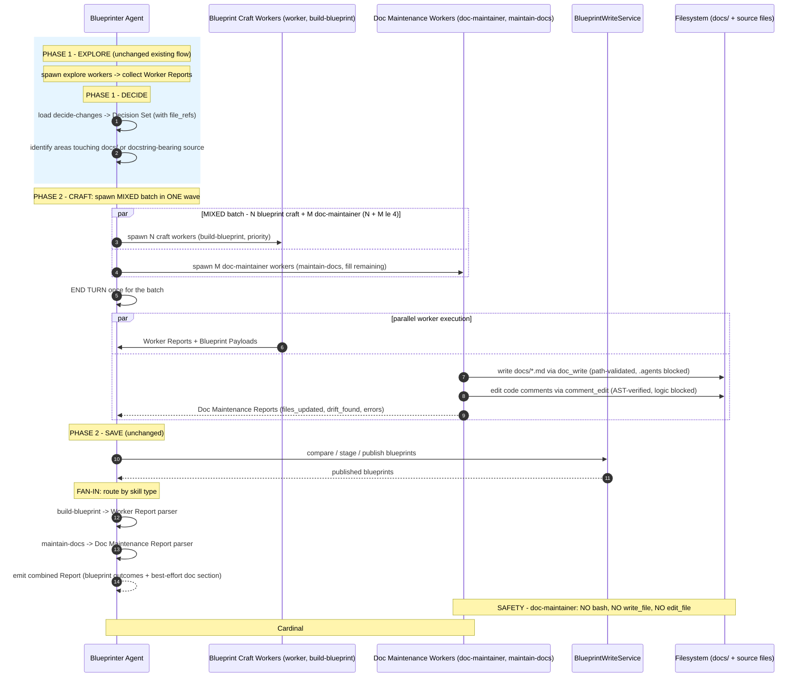
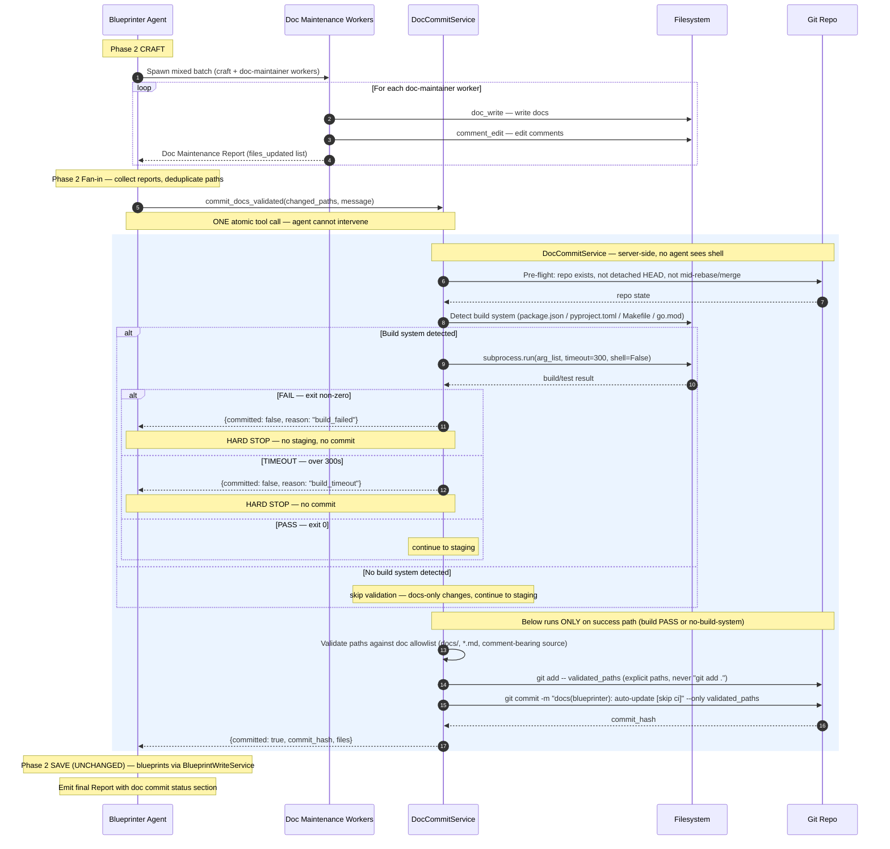

# Architecture Recommendation: Blueprinter Doc Maintenance Capability

**Date:** 2026-08-05  
**Architect Instance:** architect (via 3-worker area-based fan-out)  
**Worker Reports:** `security-design` (trust boundary/safety), `data-flow-design` (workflow integration/reporting), `structural-design` (skill architecture/explore enhancement)  
**Status:** Complete  
**Scope:** Add parallel doc maintenance (project docs + code comments/docstrings) alongside blueprint content updates — best-effort, scoped to the current task, mechanically safe.

---

## Executive Summary

Doc maintenance expands the blueprinter's trust boundary from "blueprint DB rows via BlueprintWriteService" to "also modify source files (comments/docstrings) and project docs" — a 🔴 architecturally significant posture change for a fully-automatic background agent. The recommended design layers **mechanical enforcement at the tool surface** (a new restricted `doc-maintainer` agent with only `doc_write` + `comment_edit` tools — no `bash`, no `write_file`, no `edit_file`) with a **parallel-wave integration** that mixes blueprint craft workers and doc maintenance workers in the existing Phase 2 CRAFT batch.

Three worker reports converged cleanly on most areas but surfaced **two cross-worker tensions** that the synthesis resolves:

1. **New agent vs generic worker** — security worker recommends a new `doc-maintainer` agent (mechanical tool restriction); data-flow worker assumed spawning generic `worker` instances. **Resolution: new `doc-maintainer` agent** — the security evidence is decisive (prompt-level enforcement has historically drifted in this codebase).
2. **Two-skill vs three-skill doc architecture** — structural worker proposes 3 skills (`explore-doc-drift` + `maintain-docs` + `decide-doc-changes`); data-flow worker implicitly assumes 1 skill (`maintain-docs` with embedded detection). **Resolution: 2 skills** (`explore-doc-drift` + `maintain-docs`) — the third `decide-doc-changes` is unnecessary because the blueprinter can apply its existing `decide-changes` pattern for doc decisions, and embedding detection in maintenance violates the explore/produce separation.

The design adds **1 new agent** (`doc-maintainer`), **2 new tools** (`doc_write`, `comment_edit`), **2 new skills** (`explore-doc-drift`, `maintain-docs`), and **1 new Cardinal Rule + 3 Guidelines**. It touches 0 existing blueprint logic.

---

## Cross-Worker Tension Resolution

### Tension 1: New `doc-maintainer` Agent vs Generic Worker

| Position | Worker | Argument |
|----------|--------|----------|
| **New `doc-maintainer` agent** | security-design | Mechanical enforcement: restrict tools.allow to `doc_write` + `comment_edit` only. Remove `bash`, `proc`, `write_file`, `edit_file`. Prompt-level enforcement (Approach B) has historically drifted (coder→developer alias shadow, `except BaseException: pass` bug). |
| Generic `worker` | data-flow-design | (Implicit) Workers already have filesystem tools; skill instructions provide guardrails. |

**Resolution: New `doc-maintainer` agent.** The security worker's evidence is decisive:
- Prompt-only enforcement has a documented failure history in this codebase (multiple critical notes).
- A background agent modifying source files without mechanical guardrails is a 🔴 risk.
- The `tools.allow`/`tools.deny` mechanism is already proven (blueprinter's own meta.json uses it to exclude `bash`).
- The new agent has a minimal tool surface — no `bash`, no `proc`, no `write_file`, no `edit_file`. Only `doc_write` + `comment_edit` + read-only filesystem tools.

**Impact on data-flow worker's parallel-wave design:** The blueprinter must add `doc-maintainer` to its `team_members` list. The parallel-wave integration pattern is unchanged — the blueprinter spawns `doc-maintainer` instances instead of generic `worker` instances for doc tasks.

### Tension 2: Two-Skill vs Three-Skill Doc Architecture

| Position | Worker | Skills |
|----------|--------|--------|
| **3 skills** | structural-design | `explore-doc-drift` (detect) + `maintain-docs` (update) + `decide-doc-changes` (filter findings) |
| 1 skill (implicit) | data-flow-design | `maintain-docs` (embedded detection + update) |

**Resolution: 2 skills** (`explore-doc-drift` + `maintain-docs`). The third `decide-doc-changes` is unnecessary because:
- The blueprinter already owns fan-in decisions via `decide-changes` — a parallel `decide-doc-changes` is redundant ceremony for a best-effort, low-stakes path.
- Doc maintenance is best-effort (Cardinal #8) — a formal decision skill over-engineers the filtering step. The blueprinter can filter doc-drift findings inline at fan-in (confidence bar: only act on unambiguous drift, same as `explore-for-single`'s manual-source rule).
- 2 skills maintains the explore/produce separation (structural worker's strongest argument) without adding a third skill that mirrors an existing blueprinter capability.

---

## End-to-End Flow



---

## Approach Comparison

### Dimension 1 — Safety Architecture (Area D)

| Approach | Enforcement Level | Effectiveness | Complexity | Recommendation |
|----------|-------------------|---------------|------------|----------------|
| **A+D: Restricted `doc-maintainer` agent + `doc_write`/`comment_edit` tools** | **Mechanical** (tool surface) | High — cannot be bypassed by confused LLM | High (new agent + 2 new tools + AST backends) | ✅ **Recommended** |
| B: Skill-level guardrails only | Advisory (prompt) | Low — historically unreliable | Low | 🔴 Rejected — evidence shows prompt enforcement drifts |
| C: Hybrid (B + post-write verification + rollback) | Mechanical (post-hoc) | Medium — false negatives pass through; TOCTOU window | Higher than A | Rejected — strictly weaker than A (bad write happens first) |

**Winner: A+D combined.** The security worker's core principle — *"mechanical enforcement at the tool surface, not advisory enforcement in the prompt"* — is non-negotiable for a background agent modifying source files. The `doc-maintainer` agent has `doc_write` + `comment_edit` as its ONLY write surface. No `write_file`, no `edit_file`, no `bash`. A confused LLM literally cannot modify code logic because the tools reject non-comment writes.

### Dimension 2 — Workflow Integration (Area B)

| Approach | Blueprint Logic Changed | Turns Added | Worker Budget Impact | Recommendation |
|----------|------------------------|-------------|---------------------|----------------|
| **A: Parallel wave during Phase 2 CRAFT** | **None** — EXPLORE, DECIDE, SAVE untouched | 0 | Shares 4-slot cap with blueprint craft | ✅ **Recommended** |
| B: Separate sequential Phase 2.5 | None | +1 fan-out/fan-in (2 turns) | Clean separation but adds latency | Rejected — unnecessary latency |
| C: Cross-phase (explore detects drift) | **High** — changes EXPLORE skills, DECIDE format, Decision Set | 0 | Extra detection in existing workers | 🔴 Rejected — violates "additive" constraint |

**Winner: A.** The only purely additive approach. Doc-maintainer workers join the existing CRAFT batch. The 4-worker cap is split at dispatch time (blueprint craft takes priority, doc fills remaining slots; doc deferred if 0 slots). Blueprint SAVE logic is completely unchanged.

### Dimension 3 — Worker Report Format (Area C)

| Approach | Parser Impact | Cardinal #5 Compliance | Recommendation |
|----------|---------------|----------------------|----------------|
| **B: Separate Doc Maintenance Report format** | Two parsers, dispatch-routed by skill | ✅ Each format is purpose-built | ✅ **Recommended** |
| A: Extend existing Worker Report | Muddies canonical format | ⚠️ Cardinal #5 says "refuse reports that deviate" | Rejected — format mixing |
| C: JSON-in-markdown | Fragile parsing | 🔴 Cardinal #5 deviation risk | Rejected |

**Winner: B.** The blueprinter routes reports by skill assignment (already tracked at dispatch). Blueprint reports → existing Worker Report parser. Doc reports → new Doc Maintenance Report parser. Zero format mixing.

### Dimension 4 — Skill Architecture (Area A)

| Approach | Skill Count | Separation of Concerns | Recommendation |
|----------|-------------|----------------------|----------------|
| **B: Two skills (`explore-doc-drift` + `maintain-docs`)** | +2 | ✅ Mirrors existing explore/build pattern | ✅ **Recommended** |
| A: Single `maintain-docs` | +1 | ❌ Mixes detection + writing in one pass | Rejected — no DECIDE checkpoint |
| C: Single with embedded explore | +1 | ❌ Same write-during-explore problem | Rejected |

**Winner: B.** Mirrors the existing 2-skill-per-workflow pattern: `explore-for-*` + `build-blueprint` = blueprint workflow; `explore-doc-drift` + `maintain-docs` = doc workflow.

### Dimension 5 — Explore Enhancement (Area E)

| Approach | Existing Explores Changed | Focus Dilution | Recommendation |
|----------|--------------------------|----------------|----------------|
| **B: Separate doc-drift detection skill** | **None** — existing explores untouched | None | ✅ **Recommended** |
| A: Add doc-drift to all 3 explores | All 3 modified | ⚠️ Zero-sum tradeoff with 500-word cap | Rejected — dilutes primary purpose |
| C: Only `explore-for-single` gets doc-drift | 1 modified | Asymmetric behavior across modes | Rejected — inconsistency |

**Winner: B.** Doc maintenance is its own subsystem. The `explore-doc-drift` skill is the dedicated detection layer — existing explores keep their primary purpose (blueprint drift) completely intact.

---

## Detailed Design

### 1. New Agent: `doc-maintainer`

**File:** `agents/doc-maintainer/` (full v2 agent package following `docs/agent-prompt-writing-guide.md`)

**`meta.json` — critical tool restriction:**
```json
{
    "id": "doc-maintainer",
    "name": "Doc Maintainer",
    "description": "Restricted worker for maintaining project docs and code comments. No bash, no raw file writes — only doc_write and comment_edit.",
    "version": "1.0.0",
    "llm_models": [
        {"model": "coding", "weight": 100}
    ],
    "skill_injection": true,
    "tools": {
        "allow": [
            "doc_write",
            "comment_edit",
            "read_file",
            "list_directory",
            "glob_files",
            "grep_files",
            "skill_search",
            "shared_context_metadata",
            "time",
            "help"
        ]
    }
}
```

⚠️ **Critical:** `write_file`, `edit_file`, `bash`, and `proc` are deliberately ABSENT from `tools.allow`. The `doc-maintainer` literally cannot invoke them. This is the mechanical enforcement layer.

### 2. New Tools: `doc_write` + `comment_edit`

**`doc_write(path, content, mode)`** — `daemon/tools/doc_write.py` (~200 LOC)
- **Path allowlist:** `docs/...`, `doc/...`, `<root>/*.md` (top-level markdown only)
- **Path denylist:** `.agents/`, `daemon/`, `frontend/`, `node_modules/`, binary extensions
- **Mode:** `create` or `update` only — `delete` rejected
- **Validation:** `os.path.realpath` → workdir containment → doc allowlist → denylist check
- **Write safety:** Atomic write via `tempfile.NamedTemporaryFile + os.replace` (unlike the current non-atomic `write_file`)
- **File locking:** Acquires `daemon/services/file_lock.py` lock

**`comment_edit(file_path, anchor, new_text)`** — `daemon/tools/comment_edit.py` (~400 LOC)
- **Language allowlist:** Python, JavaScript/TypeScript, Java (initially; Go/Rust deferred)
- **Process:** Parse file with language AST → locate `anchor` AST node → must be `Comment`/`Docstring`/`JSDoc`/`Javadoc` type → substitute `new_text` → verify resulting AST has **identical non-comment nodes** → reject if any logic node differs → atomic write
- **Safety guarantee:** If the edit changes ANY non-comment AST node (function body, statement, expression), the tool REJECTS the write and returns an error. The worker cannot bypass this.

### 3. New Skills

**`explore-doc-drift.md`** — `agents/blueprinter/skills-template/`
```markdown
---
version: 1.0.0
category: execution
auto_load: false
---

# Explore Doc Drift

You are a worker detecting documentation and code-comment drift for a specific
blueprint area. You DO NOT write — you report findings.

## Input
- Blueprint area (name, file_refs, trigger_queries)
- The blueprint's current content

## Drift Taxonomy
Report these signal types:
- stale-doc: doc describes a module/API that no longer exists or has moved
- missing-doc: new module/file with no docstring, README, or docs/ entry
- comment-mismatch: inline comment/docstring claim contradicted by adjacent code
- moved-ref: doc links to a path that no longer resolves

## Output
Worker Report per build-blueprint §Worker Report format. Add a
### Doc Drift Findings section listing each finding with:
  - signal type (stale-doc | missing-doc | comment-mismatch | moved-ref)
  - file path + line range
  - evidence (what the doc says vs what the code says)
  - confidence: high (unambiguous) | medium | low (speculative)

## Constraints
- Scope = the blueprint's file_refs and their immediate area. Do NOT scan the entire project.
- Do NOT write any files. Report only.
- Verify every file path you reference.
- ≤500 words total.
- If source=manual: only report high-confidence drift (Cardinal #3 threshold).
```

**`maintain-docs.md`** — `agents/blueprinter/skills-template/`
```markdown
---
version: 1.0.0
category: execution
auto_load: false
---

# Maintain Docs

You are a doc-maintainer worker updating project docs and code comments.
You use ONLY doc_write and comment_edit tools — no other write tools exist.

## Input
- Doc Drift Findings (from explore-doc-drift Worker Report)
- The blueprint area's file_refs for scope

## What to Do
For each confirmed drift finding (high confidence only):
1. For docs/ files: use doc_write(mode="update") to fix stale content.
2. For code comments/docstrings: use comment_edit(file_path, anchor, new_text)
   to update the comment text. The tool verifies that only comment regions change.

## Output
Return a Doc Maintenance Report:
### Summary — [1-2 sentence overview]
### Files Updated — file path + what was updated + why
### Drift Found — findings detected (including those not acted on)
### Errors — contained errors (file + reason)
### Files Skipped — paths out of scope or in system dirs
### Confidence: [high / medium / low]

## Constraints
- ONLY update docs/ files and code comments. NEVER change code logic.
- NEVER touch .agents/, daemon/, agents/ prompt files, or configs.
- NEVER delete files. Only create or update.
- Act only on HIGH-confidence drift. Medium/low → report but skip.
- If a file is locked or the tool rejects the edit, report the error and continue.
```

### 4. Workflow Integration

**Phase 2 CRAFT** — the mixed batch dispatch (`workflow.md` amendment):

```
Phase 2 — CRAFT (fan-out)
   1. Read the Decision Set. Count blueprint actions (N).
   2. Allocate slots: N blueprint-craft workers (build-blueprint, priority).
      If N < 4, allocate M = 4 - N doc-maintainer workers (maintain-docs).
      If N >= 4, defer doc maintenance (report "doc maintenance deferred — no slots").
   3. For doc workers: derive scope from Decision Set areas touching docs/
      or docstring-bearing source files (use file_refs as starting points).
   4. Spawn the MIXED batch (N + M workers, ≤4 total). END MY TURN once.
```

**Phase 2 SAVE** — **UNCHANGED.** Blueprint compare/stage/publish via BlueprintWriteService only. No doc writes in this phase.

**Fan-in** — dispatch-routed report parsing:
```
Phase 2 — Fan-in
   1. Route each worker report by skill type:
      - build-blueprint reports → existing Worker Report parser (unchanged)
      - maintain-docs reports → Doc Maintenance Report parser (new)
   2. Blueprint updates proceed to SAVE (unchanged logic).
   3. Doc results: aggregate into final Report as "Doc Maintenance" subsection.
      Contain any doc errors — never block SAVE or the Report.
```

### 5. Rule Updates

**New Cardinal Rule #8:**
```
8. Doc maintenance is best-effort and contained.
   Doc-maintainer workers update docs/ files and code comments only.
   Doc failures never block blueprint updates — I report them under
   "Contained failures" and proceed to SAVE/Report regardless.
   Cardinal #1 (fire-and-forget) extends to all doc-maintenance workers.
```

**New Guidelines:**
```
13. Doc workers must NOT change code logic. They update docs/ and code
    comments/docstrings only — enforced mechanically by the doc-maintainer
    agent's restricted tool surface (doc_write, comment_edit; no bash,
    no write_file, no edit_file). Any tool rejection is a contained failure.

14. Doc workers must NOT touch .agents/, daemon/, agent prompt files, or
    configs. Scope = docs/ and code comments in source files only.
    Path enforcement is mechanical: doc_write validates against an
    allowlist; comment_edit validates AST node types.

15. Doc workers share the CRAFT wave with blueprint craft workers.
    Total wave ≤4 (Guideline #2). Blueprint craft takes priority;
    doc maintenance fills remaining slots, deferred if no room.
```

### 6. Blueprinter Configuration Updates

| File | Change |
|------|--------|
| `agents/blueprinter/meta.json` | Add `"doc-maintainer"` to `team_members` (currently `["worker"]` → `["worker", "doc-maintainer"]`) |
| `agents/blueprinter/soul.md` | Line 89 ("I do not write project code") — **keep unchanged**. Add: "Doc maintenance is delegated to the restricted `doc-maintainer` sub-agent; I coordinate, it executes with a locked-down tool surface." |
| `agents/blueprinter/rule.md` | Add Cardinal #8 + Guidelines 13-15 (above). |
| `agents/blueprinter/workflow.md` | Amend Phase 2 CRAFT with mixed-batch allocation + fan-in routing. |
| `agents/blueprinter/skill-set.yaml` | Add `explore-doc-drift` + `maintain-docs` entries. |

---

## Edge Cases

| Edge case | Behavior |
|-----------|----------|
| **Blueprint craft uses all 4 worker slots** | Doc maintenance deferred. Report: "doc maintenance deferred — all slots used by blueprint craft." Follow-up incremental run picks it up. |
| **No docs/ directory exists in the project** | Doc workers find nothing to maintain. Report: "no project docs found." No-op. |
| **Source file has no comments/docstrings** | `comment_edit` has nothing to edit. Worker reports "no comment drift found." |
| **`comment_edit` AST parser doesn't recognize the language** (e.g., Go, Rust) | Tool returns `UNSUPPORTED_LANGUAGE`. Worker reports error, continues to next finding. Best-effort. |
| **Doc worker tries to modify code logic** | `comment_edit` rejects the edit at the AST level (non-comment node differs). `doc_write` rejects non-doc paths. Worker cannot bypass — no `write_file`/`edit_file`/`bash` available. Error contained. |
| **Adversarial content in a doc** (prompt injection embedded in markdown) | The doc-maintainer reads the doc but its system prompt is LLM-controlled (synthetic system message). Doc writes go through `doc_write` which validates content structure. Risk is low; monitor for injection patterns. |
| **Concurrent developer edits same file** | `doc_write`/`comment_edit` acquire file_lock via `daemon/services/file_lock.py`. If locked, worker reports "file locked" and skips. Best-effort. |
| **Doc was deleted between detection and update** | `doc_write(mode="update")` on non-existent path → creates it. Or: if the deletion was intentional, the worker's drift report notes it. Best-effort — manual review. |

---

## Risks

| Severity | Risk | Mitigation |
|----------|------|------------|
| 🔴 | **`doc_write`/`comment_edit` tool bugs block all legitimate doc updates.** If the tools fail, doc-maintainer has NO fallback write surface. | **Phased rollout:** Phase 1 ships `doc_write` only (docs/ + *.md — no source editing). Phase 2 adds `comment_edit` (Python docstrings only). Phase 3 expands to JS/TS, then Java. Each phase dogfooded for 1 week before expanding. |
| 🔴 | **Background agent modifying source files** — even comments — is a new trust posture. Users may not expect automated docstring changes. | Mechanical enforcement (restricted tools) + best-effort semantics + structured reporting (Doc Maintenance Report visible in job results). The leader/user can disable doc maintenance by not allocating doc-worker slots (Guideline #15). |
| 🟡 | **4-slot contention under high drift** — if rebuild produces 4 CREATE/UPDATE actions, zero slots remain for doc maintenance. | Doc maintenance defers to follow-up incremental run (Guideline #15 priority rule). Acceptable — docs are best-effort. |
| 🟡 | **AST libraries add per-language dependencies.** JS/TS requires Node bridge (`@babel/parser`); Java needs `java-parser` PyPI package. | Phase rollout starts with Python (stdlib `ast` — zero dependencies). JS/TS/Java deferred to Phase 3. Unsupported languages → `UNSUPPORTED_LANGUAGE` → best-effort skip. |
| 🟡 | **No rate-limiting on doc writes.** Doc workers write directly to filesystem, not through BlueprintWriteService. | `maintain-docs` skill bounds scope to the Decision Set's affected areas only. Doc-maintainer's restricted tool surface prevents project-wide scanning. Monitor file-edit counts in the Doc Maintenance Report. |
| 🟡 | **Doc-edit false positives** — worker "fixes" intentionally aspirational docs or deliberate TODOs. | `maintain-docs` confidence bar: act only on HIGH-confidence drift. Medium/low → report but skip. Same threshold as `explore-for-single`'s manual-source rule. |
| 🟢 | **Skill count growth** — 5 → 7 skills. | New skills are structurally identical to existing ones (≤80 lines, canonical format). Copy-pattern maintenance cost is low. |
| 🟢 | **Two report parsers.** | Dispatch-routing by skill assignment is deterministic. No shared mutable state between parsers. |

---

## Implementation Checklist

### New files (create)

| # | File | Description | Effort |
|---|------|-------------|--------|
| 1 | `agents/doc-maintainer/meta.json` | Restricted agent config (tools.allow: doc_write, comment_edit, read-only FS) | Small |
| 2 | `agents/doc-maintainer/soul.md` + `rule.md` + `workflow.md` + `tools_note.md` | Minimal v2 agent prompt files | Medium |
| 3 | `agents/blueprinter/skills-template/explore-doc-drift.md` | Detection skill (~80 lines) | Small |
| 4 | `agents/blueprinter/skills-template/maintain-docs.md` | Maintenance skill (~80 lines) | Small |
| 5 | `daemon/tools/doc_write.py` | Path-validated doc write tool (~200 LOC) | Medium |
| 6 | `daemon/tools/comment_edit.py` | AST-verified comment edit tool (~400 LOC) | Large |
| 7 | `daemon/services/ast_backends/python.py` | Python AST backend (stdlib) | Small |
| 8 | `daemon/services/ast_backends/js_ts.py` | JS/TS AST backend (Phase 3 — deferred) | Large |

### Existing files (modify)

| # | File | Change |
|---|------|--------|
| 9 | `agents/blueprinter/meta.json` | Add `"doc-maintainer"` to `team_members` |
| 10 | `agents/blueprinter/soul.md` | Add doc-maintenance delegation note (line ~89) |
| 11 | `agents/blueprinter/rule.md` | Add Cardinal #8 + Guidelines 13-15 |
| 12 | `agents/blueprinter/workflow.md` | Amend Phase 2 CRAFT with mixed-batch + fan-in routing |
| 13 | `agents/blueprinter/skill-set.yaml` | Add `explore-doc-drift` + `maintain-docs` |
| 14 | `daemon/tools/__init__.py` + `daemon/tools/instance.py` | Register `doc_write` + `comment_edit` tools |

### Phased Rollout

| Phase | Scope | Duration |
|-------|-------|----------|
| **Phase 1** | `doc_write` tool only (docs/ + *.md). `doc-maintainer` agent with doc_write only. `explore-doc-drift` + `maintain-docs` skills. Blueprinter mixed-batch integration. | 1 week dogfood |
| **Phase 2** | Add `comment_edit` tool (Python docstrings only via stdlib `ast`). | 1 week dogfood |
| **Phase 3** | Extend `comment_edit` to JS/TS (`@babel/parser` bridge) and Java. | Per-language |
| **Phase 4** | Git-diff review integration (post-write summary dispatched to leader for review). | Future |

---

## Decisions Pending (for the leader)

1. **Phased rollout or big-bang?** — Recommend phased (Phase 1 docs-only is safe and low-risk; comment_edit with AST verification needs more validation). **Recommendation: phased.**
2. **Should doc maintenance be opt-in per project?** — The blueprinter could gate doc maintenance behind a project metadata flag (like `blueprint_active` for blueprints). **Recommendation: yes** — add `doc_maintenance_enabled` flag, default `false`. Users explicitly opt in to automated source-file editing.
3. **JS/TS AST backend implementation** — Node bridge (run `@babel/parser` subprocess from the daemon, not the agent) or pure-Python parser? **Recommendation: Node bridge** — daemon-managed subprocess, agent never sees it.
4. **Should `explore-doc-drift` run in Phase 1 EXPLORE (alongside blueprint explore) or Phase 2 CRAFT?** — This architecture recommends Phase 2 CRAFT (parallel with craft). An alternative is to run doc-drift exploration in Phase 1, giving DECIDE more information. **Recommendation: Phase 2 CRAFT** — keeps Phase 1 unchanged (additive constraint); doc workers do their own exploration inline.

---

## Open Questions

1. **How does the `doc-maintainer` agent get the project workdir?** — Workers inherit workdir from the spawning instance. Confirm the doc-maintainer resolves the same project workdir as the blueprinter.
2. **Should doc writes create revision history?** — BlueprintWriteService creates revisions for blueprints. Doc writes go directly to filesystem. Should there be a lightweight audit log (file path + before/after hash)? **Recommendation: yes** — the Doc Maintenance Report serves this purpose; consider a structured log entry via `experience()` for traceability.
3. **Should the `maintain-docs` skill be a doc-maintainer skill or a blueprinter skill?** — Since the `doc-maintainer` agent executes it, it should be registered in `agents/doc-maintainer/skill-set.yaml`, not the blueprinter's. The blueprinter dispatches `doc-maintainer` instances with the skill loaded. **Recommendation: doc-maintainer's skill-set** — but the skill files can live in `agents/blueprinter/skills-template/` during seeding if the blueprinter's seeder is the only one running. Clarify with the implementer.

---

## Confidence: Medium-High

The safety architecture (restricted agent + AST-verified tools) is sound and the workflow integration is cleanly additive. The design drops to Medium confidence on:
- **AST comment-region verification across languages** — Python's `ast` module is mature but only captures docstrings, not inline comments (those need `tokenize` or `libcst`). JS/TS AST tools have varying comment-node support. The Phase 1 (docs-only) rollout sidesteps this entirely.
- **Worker budget contention under high drift** — the 4-slot cap means doc maintenance is frequently deferred on busy rebuilds. This is acceptable (best-effort) but may make the feature feel unreliable if it's always starved.
- **The recommendation would flip** if the project decided prompt-level enforcement (Approach B) is sufficient — but the security worker's evidence on prompt-enforcement drift is strong enough that this is unlikely.

---

# Addition: Build/Test Validation + Git Commit Gate

**Date:** 2026-08-05 (Revision 2)  
**Worker Reports:** `security-design` (trust boundary for shell access), `data-flow-design` (build detection, commit flow, failure matrix)  
**Scope:** After doc-maintainer workers write files, validate the changes don't break the build, then commit via git as a single atomic operation.

---

## Cross-Worker Tension Resolution (Revision 2)

### Tension 3: Build FAIL Behavior — Hard Stop vs Fail-Soft

| Position | Worker | Argument |
|----------|--------|----------|
| **Hard stop (no commit on FAIL)** | security-design | Failed build = broken changes. Committing them violates the user's explicit requirement. |
| Fail-soft (commit anyway, log warning) | data-flow-design | Changes are "safe in working tree"; validator is warn-only. |

**Resolution: Hard stop.** The user's requirement is explicit: *"MUST NOT commit broken changes — no broken commits ever land."* The data-flow worker's fail-soft reasoning ("changes are safe in working tree") misses that a committed broken build is worse than uncommitted changes — it pollutes the git history and may trigger broken CI. **Build FAIL = RETURN immediately, no staging, no commit.** Changes remain in the working tree for the user to review/revert.

### Tension 4: One Atomic Tool vs Two Sequential Steps

| Position | Worker | Argument |
|----------|--------|----------|
| **One atomic service call** | security-design | Two tools (validate then commit) create a TOCTOU window: build passes → state changes → commit may succeed against a wrong tree. Also, the agent could call commit without calling validate. |
| Two sequential steps | data-flow-design | Separate validate → commit steps, each with its own result. |

**Resolution: One atomic tool** (`commit_docs_validated`). The validate→commit sequence runs inside a single synchronous service call. The agent cannot intervene between validate and commit. A failed build mechanically prevents staging and commit. This closes the TOCTOU window.

---

## Updated End-to-End Flow (with Build Gate + Commit)



---

## Detailed Design: Build/Test Validation + Git Commit

### 1. Trust Boundary — Who Gets Shell Access?

**Nobody.** No agent gains `bash` or `proc` access. The `DocCommitService` runs subprocesses **internally** (server-side), using the same proven pattern as `GitDiffService._run_git`: `subprocess.run(["git"] + args, cwd=workdir, capture_output=True, timeout=T, shell=False)` — argument lists, never shell strings.

| Actor | Shell Access | How It Executes Git/Build |
|-------|-------------|--------------------------|
| `doc-maintainer` worker | **No** (unchanged) | Never — writes via `doc_write`/`comment_edit` only |
| `blueprinter` (orchestrator) | **No** (unchanged) | Calls `commit_docs_validated()` — a data-only tool wrapper, not shell |
| `DocCommitService` (server-side) | **Yes, internally only** | `subprocess.run(arg_list, shell=False)` — agent never sees the shell |

**Blueprinter soul.md line 90 ("I do not execute shell commands") stays unchanged.** The `commit_docs_validated` tool is a structured data call to a service — exactly like `blueprint_update` is not "database access."

### 2. New Service: `DocCommitService`

**File:** `daemon/services/doc_commit_service.py` (~200 LOC)

**Single method:** `commit_docs_validated(changed_paths: list[str], message: str, workdir: str, project_metadata: dict) -> CommitResult`

**Atomic validate→commit sequence (one synchronous call, agent cannot intervene):**

```
1. PRE-FLIGHT (git repo state check)
   - subprocess: ["git", "rev-parse", "--is-inside-work-tree"]
   - subprocess: ["git", "symbolic-ref", "--quiet", "HEAD"]  (detached HEAD?)
   - subprocess: ["git", "status", "--porcelain"]            (mid-rebase/merge?)
   - Any fail → return {committed: false, reason: "repo_unsafe", detail: ...}
   - Protected branch check (main/master/latest) → return {committed: false, reason: "branch_unsafe"}

2. BUILD SYSTEM DETECTION
   - detect_build_system(workdir, metadata override)
   - Fixed command map (never agent-supplied):
     package.json    → ["npm", "test"]
     pyproject.toml  → ["pytest", "-x"]
     pytest.ini      → ["pytest", "-x"]
     Makefile (test) → ["make", "test"]
     Cargo.toml      → ["cargo", "test"]
     go.mod          → ["go", "test", "./..."]
   - Override: project metadata field doc_maintenance_build_cmd (if set, replaces detected command)
   - Multi-language: sequential execution (detected → first failing command stops)
   - None detected → skip validation, proceed to step 4

3. BUILD/TEST VALIDATION (only if build system detected)
   - subprocess.run(cmd, cwd=workdir, capture_output=True, timeout=300, shell=False, check=False)
   - PASS (returncode == 0) → continue to step 4
   - FAIL (returncode != 0) → RETURN {committed: false, reason: "build_failed",
                                       output: truncate(stderr, 4KB)}
   - TIMEOUT (>300s) → RETURN {committed: false, reason: "build_timeout"}
   - HARD STOP. No staging. No commit.

4. PATH VALIDATION
   - For each path in changed_paths: validate against doc allowlist
     (docs/, doc/, *.md, comment-bearing source files)
   - Reject any path under .agents/, daemon/, configs/, binary extensions
   - Filter: drop paths that don't exist on disk or aren't currently modified
   - Re-check git status --porcelain AFTER validation (test may have mutated files)
   - Empty after filtering → RETURN {committed: false, reason: "no_valid_paths"}

5. STAGE (explicit paths only — never "git add .")
   - subprocess: ["git", "add", "--", *validated_paths]

6. COMMIT (single atomic commit, --only flag prevents sweeping unrelated changes)
   - subprocess: ["git", "-c", "user.email=blueprinter@local",
                   "-c", "user.name=blueprinter",
                   "commit", "-m", message, "--only", *validated_paths]
   - --only ensures the commit contains EXACTLY specified files regardless of staged state

7. RETURN {committed: true, commit_hash: <sha>, files: validated_paths}
```

**Commit message convention:**
```
docs(blueprinter): auto-update <mode> <blueprint_area> [skip ci]
```
- `docs(blueprinter):` — conventional commit scope, greppable
- `<mode>` — rebuild | incremental | single
- `<blueprint_area>` — the blueprint name or area scope
- `[skip ci]` — trailer prevents re-triggering CI pipelines

**Never called:** `git push`, `git stash`, `git reset`, `git checkout`, `git restore`. Commits stay local for user review.

### 3. New Tool: `commit_docs_validated`

**Registration:** Add `commit_docs_validated` to `agents/blueprinter/meta.json` `tools.allow`. **Do NOT add `bash`** — the tool is a structured data call, not shell access.

**Tool factory pattern:** Mirror `create_blueprint_tools` — same closure pattern, same `agent_id`-gated authorization (only `blueprinter` can call).

### 4. Build System Detector

**File:** `daemon/services/build_system_detector.py` (~80 LOC)

Pure function — no side effects, no subprocess (file-presence check only):

```python
def detect(workdir: str, override_cmd: str | None = None) -> BuildSystem | None:
    """Detect the project's build/test system via file-presence heuristic.

    Returns None for docs-only repos (no recognizable build system).
    Override via project metadata replaces the detected command.
    """
    if override_cmd:
        return BuildSystem(name="override", cmd=shlex.split(override_cmd), timeout=300)

    MARKERS = [
        ("package.json",   "npm",       ["npm", "test"]),
        ("pyproject.toml", "pytest",    ["pytest", "-x"]),
        ("pytest.ini",     "pytest",    ["pytest", "-x"]),
        ("Makefile",       "make",      ["make", "test"]),       # only if "test:" target exists
        ("Cargo.toml",     "cargo",     ["cargo", "test"]),
        ("go.mod",         "go",        ["go", "test", "./..."]),
    ]
    for marker, name, cmd in MARKERS:
        if (Path(workdir) / marker).exists():
            return BuildSystem(name=name, cmd=cmd, timeout=300)
    return None
```

### 5. Result Dataclasses

```python
@dataclass
class CommitResult:
    status: Literal["COMMITTED", "BUILD_FAILED", "BUILD_TIMEOUT", "REPO_UNSAFE",
                    "BRANCH_UNSAFE", "NO_VALID_PATHS", "STAGING_ERROR",
                    "BLOCKED_BY_HOOK", "SKIPPED"]
    commit_hash: str | None = None
    files: list[str] | None = None
    reason: str = ""
    build_output: str = ""  # truncated to 4KB, secrets stripped
    duration_ms: int = 0
```

### 6. Updated Failure Handling Matrix

| Scenario | Build | Commit | Action |
|----------|-------|--------|--------|
| Build PASS | ✅ PASS | ✅ COMMITTED | Happy path — changes committed locally |
| Build FAIL | ❌ FAIL | ❌ NO COMMIT | Hard stop. Changes stay in working tree. Log warning. |
| Build TIMEOUT (>5min) | ⏱️ TIMEOUT | ❌ NO COMMIT | Hard stop. Changes stay in working tree. Log warning. |
| No build system (docs-only) | ⏭️ SKIP | ✅ COMMITTED | Docs-only changes rarely break builds. Commit proceeds. |
| Git not initialized | — | ⏭️ SKIPPED | Log info. Not all projects are git repos. |
| Detached HEAD / mid-rebase | — | ⏭️ SKIPPED | Log warning. Don't disturb user-initiated git ops. |
| Protected branch (main/master/latest) | — | ⏭️ SKIPPED | Log warning. Don't auto-commit to protected branches. |
| No doc changes (all workers no-op) | ⏭️ SKIP | ⏭️ SKIP | Nothing to validate or commit. |
| Pre-commit hook blocks commit | ✅ PASS | ❌ BLOCKED | Catch CalledProcessError, capture stderr. Changes stay staged but uncommitted. |
| `doc_maintenance_commit_enabled=false` | ⏭️ SKIP | ⏭️ SKIP | Operator opt-out. Changes stay in working tree. |

### 7. Updated Workflow Integration

The build gate + commit step runs **after Phase 2 fan-in** (all doc-maintainer reports collected) and **before Phase 2 SAVE** (blueprints via BlueprintWriteService — unaffected):

```
Phase 2 CRAFT (parallel wave):
  ├─ Blueprint craft workers → Worker Reports
  └─ Doc-maintainer workers → Doc Maintenance Reports
       ↓
Phase 2 Fan-in:
  - Route by skill type (build-blueprint → blueprint parser, maintain-docs → doc parser)
  - Collect all Doc Maintenance Reports
  - Deduplicate changed file paths from ### Files Updated sections
       ↓
NEW: Build Gate + Commit:
  - If doc_maintenance_commit_enabled is false → skip (changes stay in working tree)
  - If no doc changes → skip
  - Call commit_docs_validated(changed_paths, message)
  - DocCommitService runs atomic validate→commit (server-side)
  - Result: CommitResult (COMMITTED | BUILD_FAILED | REPO_UNSAFE | ...)
       ↓
Phase 2 SAVE (UNCHANGED):
  - Blueprint compare/stage/publish via BlueprintWriteService
  - Unaffected by doc maintenance commit result (best-effort, Cardinal #8)
       ↓
Final Report:
  - Blueprint outcomes (Created/Updated/Disabled/No-op/Rate-limited)
  - Doc Maintenance section (files_updated, drift_found, errors)
  - NEW: Doc Commit section (status, commit_hash or skip reason, build_output if failed)
```

### 8. Opt-in Flag Update

Two flags compose:

| Flag | Default | Gates |
|------|---------|-------|
| `doc_maintenance_enabled` | `false` | Doc-maintainer workers write docs/comments at all |
| `doc_maintenance_commit_enabled` | `false` | Build validation + git commit step |

Users can test doc-generation correctness (writes only, no commits) before enabling auto-commits. Project metadata field: `doc_maintenance_build_cmd` (optional override for build/test command).

### 9. Updated Rule Additions

**Add to Cardinal #8:**
```
8. Doc maintenance is best-effort and contained.
   Doc-maintainer workers update docs/ files and code comments only.
   Doc failures never block blueprint updates.
   Build validation is a SAFETY GATE: if the build fails, doc changes
   are NOT committed — they remain in the working tree for user review.
   Cardinal #1 (fire-and-forget) extends to all doc-maintenance workers
   AND to the build/commit step.
```

**New Guideline #16:**
```
16. Build validation is mandatory before commit. If the build/test
    command fails or times out (>5 min), I do NOT commit the doc changes.
    I report the failure and leave changes in the working tree. The
    commit step (if enabled) runs as a single atomic service call — I
    cannot skip validation and commit directly.
```

---

## Updated Implementation Checklist

### Additional new files (Revision 2)

| # | File | Description | Effort |
|---|------|-------------|--------|
| 15 | `daemon/services/doc_commit_service.py` | `DocCommitService` with atomic `commit_docs_validated()` (~200 LOC) | Large |
| 16 | `daemon/services/build_system_detector.py` | Pure-function build system detection (~80 LOC) | Small |
| 17 | `daemon/tools/doc_commit.py` | Thin tool wrapper for `commit_docs_validated` (~60 LOC) | Small |

### Additional existing files (Revision 2)

| # | File | Change |
|---|------|--------|
| 18 | `agents/blueprinter/meta.json` | Add `commit_docs_validated` to `tools.allow` (NOT bash) |
| 19 | `agents/blueprinter/rule.md` | Amend Cardinal #8 + add Guideline #16 |
| 20 | `agents/blueprinter/workflow.md` | Add build gate + commit step after fan-in |
| 21 | `daemon/tools/__init__.py` + `daemon/tools/instance.py` | Register `commit_docs_validated` tool |

### Updated Phased Rollout

| Phase | Scope | Duration |
|-------|-------|----------|
| **Phase 1** | `doc_write` tool only (docs/ + *.md). `doc-maintainer` agent. Skills. Mixed-batch integration. | 1 week |
| **Phase 2** | Add `comment_edit` (Python docstrings). | 1 week |
| **Phase 3** | Extend `comment_edit` to JS/TS + Java. | Per-language |
| **Phase 4** (was future) | **Build/test validation + git commit** (`DocCommitService` + `commit_docs_validated` tool + `build_system_detector`). Requires `doc_maintenance_commit_enabled` flag. | 1 week dogfood |
| **Phase 5** (new) | Git-diff review integration (post-commit summary dispatched to leader for review). | Future |

---

## Updated Decisions Pending

5. **Should the commit skip protected branches silently or log loudly?** — Current design: log warning + skip. The user can re-run after switching branches. **Recommendation: log warning.**
6. **Multi-language monorepos: sequential or parallel test commands?** — Current design: sequential (first failing command stops). Alternative: parallel via ThreadPoolExecutor if `doc_maintenance_build_cmd_parallel=true`. **Recommendation: sequential for v1** — parallelism adds complexity; most projects have one primary build system.
7. **Should `build_system_detector` check for `Makefile` `test:` target existence?** — A bare `Makefile` without a test target would fail. **Recommendation: yes** — grep for `^test:` before selecting `make test`.

---

## Updated Confidence: Medium-High

The atomic single-tool design (security worker's key insight) closes the TOCTOU window and guarantees no broken commits. The build system detector is a simple file-presence heuristic with override. Confidence drops to Medium on:
- **Build system detection edge cases** — monorepos with multiple build systems, Makefiles without test targets, projects with custom build scripts. The override field (`doc_maintenance_build_cmd`) mitigates this.
- **`--only` flag behavior with concurrent working-tree changes** — `git commit --only <paths>` commits only the specified paths regardless of what else is staged. This is the correct behavior but should be verified against the project's git version.
- **Pre-commit hook interaction** — a pre-commit hook that modifies files (e.g., formatter) could change the committed content vs. what was validated. **Mitigation:** the `--only` flag stages paths fresh; if the hook modifies them, the committed content reflects the hook's output (which should still pass since the hook ran). Edge case: hook introduces a failure — caught as `BLOCKED_BY_HOOK`.
