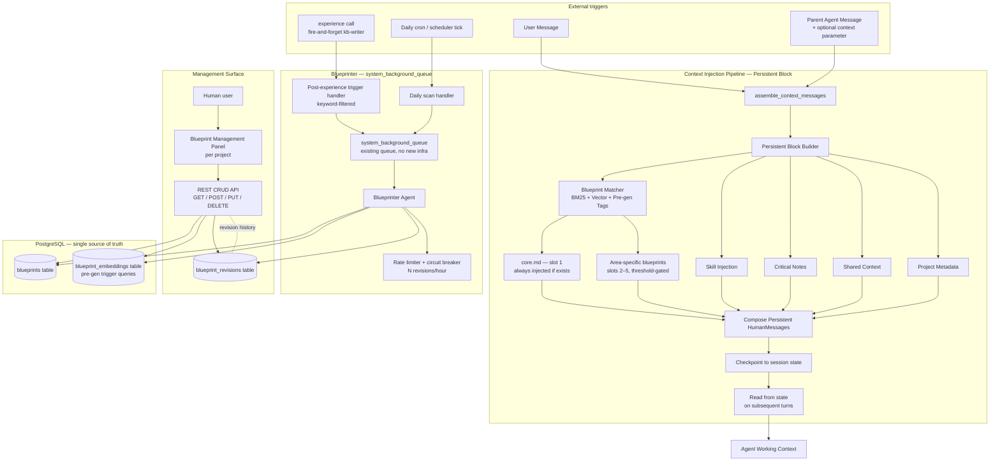

# Project Blueprint — Final Architecture & Design Plan

**Status:** Final
**Scope:** Overview — architecture and design decisions (no SQL DDL, no exact JSON schemas, no code)
**Audience:** Architecture reviewers, agent prompt maintainers, integration implementers

---

## 1. Executive Summary

### 1.1 What is Project Blueprint?

Project Blueprint is a **lightweight, high-value, persistent context layer** that is loaded into an agent's working context **before** any retrieval (RAG) or exploration step. It gives the coding agent a compact, curated summary of the project's stable architectural knowledge — tech stack, directory structure, key patterns, entry points, module boundaries — matched to the current task via multi-algorithm search.

Blueprints are short, focused markdown documents (200–500 words each) that act as a *skeleton* of the project. They are matched to the incoming message once, injected into the **persistent context block**, and remain stable for the lifetime of the agent instance.

### 1.2 Why it matters

Today, every coding agent instance starts with effectively no project context and must rediscover architecture through `explore()` calls, file reads, and RAG queries. This produces:

- **Repeated exploration cost** — the same architectural facts are re-discovered across instances, sessions, and parent→child delegations.
- **Lost early-turn context** — the agent often explores before it knows what the project looks like, producing vague or off-topic early outputs.
- **High token spend on low-value retrieval** — broad RAG queries return many unrelated chunks when a small curated summary would have answered the question.
- **Inconsistent understanding across agents** — different agents (developer, tester, reviewer, wanderer) reconstruct the architecture differently.

Blueprint removes these costs by giving every agent — at the moment of first message receipt — a stable, well-matched snapshot of the project's skeleton.

### 1.3 User quote (decisive intent)

> *"When user send message or when parent agent send message to children, that agent need blueprint right away before many other context, before I need to explore we provide the project skeleton already. After that it will explore, get more detail context if need then work, blueprint check on that time don't have many value."*

This locks Blueprint into the **persistent** path, matched at first-message receipt, with the matched set frozen for the instance lifetime.

### 1.4 Expected impact

| Metric | Expected Direction |
|---|---|
| Average explore() calls per task | ↓ Significant reduction |
| First-turn correctness on architectural questions | ↑ Higher |
| Context-token budget spent on stale/irrelevant material | ↓ Lower |
| Time-to-first-meaningful-action | ↓ Faster |
| Consistency of architectural assumptions across agents | ↑ Higher |
| Maintenance overhead for blueprint corpus | Low (automatic blueprinter on background queue) |

---

## 2. System Architecture Overview

The following diagram shows the full Blueprint system: the **persistent injection path** through `assemble_context_messages()`, the **background maintenance path** through the blueprinter agent, and the **CRUD API + UI** for human management. Blueprint is **persistent infrastructure**, not ephemeral.



### 2.1 Architectural invariants

1. **Persistent, not ephemeral.** Blueprint injection lives in the persistent block of `assemble_context_messages()`. There is no "dormant code" to reactivate — the path is the live path.
2. **Match-once-per-instance.** Blueprints are matched at first-message receipt and frozen for the lifetime of the agent instance. Subsequent turns read from checkpointed state; no re-matching.
3. **Single storage authority.** PostgreSQL only. No file-mode fallback, no migration path, no file-mode metadata.
4. **Opt-out, not opt-in.** All agents receive blueprints by default. Disable per agent via `blueprint_inactive: true` in `meta.json`.
5. **No approval flow.** Blueprinter maintenance is fully automatic. Manual edits overwrite auto-maintained content.
6. **Slot 1 reserved for core.md.** `core.md` is always injected (when present) and consumes one of the five available slots.

---

## 3. Blueprint Content Model & Format

### 3.1 Content unit

A **blueprint** is a short markdown document that captures a single coherent slice of project architectural knowledge. The standard unit:

- **Length:** 200–500 words (hard ceiling; longer content is split across multiple blueprints)
- **Tone:** Overview-level, stable, factual — no tutorial, no step-by-step instructions
- **Style:** Declarative statements ("The job queue uses a 7-state lifecycle"), not exploratory ("We might want to consider…")
- **Format:** Markdown with simple structure: a heading, short body paragraphs, optional inline file references

### 3.2 File references — the canonical deepening path

Every blueprint MUST include **file references** that point the agent to deeper material when needed:

> *"For more detail read file `daemon/services/context_messages.py` at function `assemble_context_messages` (line ~120), and `docs/architecture/persistent-block.md`."*

References are how Blueprint stays short while still being useful. The 200–500 word blueprint is the index; file references are the lookup table to actual code/docs.

### 3.3 core.md — the project-wide foundation

`core.md` is a **special blueprint** with a reserved slot. Contract:

| Property | Value |
|---|---|
| **Length** | 300–500 words (strict) |
| **Scope** | Stable project facts only: tech stack, top-level directory structure, entry points, key architectural patterns, where to look first |
| **Slot reservation** | Slot 1 — always injected if the file exists |
| **Ownership** | Blueprinter has highest maintenance priority on core.md; manual edits preserved unless explicitly regenerated |
| **Forbidden** | Duplicating system-prompt content, listing every file, dynamic/stale content |

`core.md` is the single most important blueprint. It is always present, always injected, and always the first thing an agent sees about the project.

### 3.4 Maximum per match: 5 blueprints

A matched blueprint set contains at most **5 blueprints**:

- **Slot 1:** `core.md` (reserved, always present if file exists)
- **Slots 2–5:** Up to 4 area-specific blueprints matched via the multi-algorithm engine (Decision 8)

If no area-specific match clears the threshold, slots 2–5 are simply empty — `core.md` is injected alone.

### 3.5 Source lineage tags

Every injected blueprint carries a source lineage tag for traceability and post-hoc analysis:

| Tag | Meaning |
|---|---|
| `core` | The `core.md` foundation blueprint |
| `matched` | Area-specific blueprint selected by the multi-algorithm matcher |
| `fallback` | Injected when matching returned nothing useful; currently always equal to `core` |

Lineage tags are not shown to the agent in normal flow but are recorded for analytics (no-match rate, source distribution, calibration feedback).

---

## 4. Data Model

**Storage:** PostgreSQL only. Single source of truth. No file-mode metadata, no migration path.

The Blueprint data model consists of three core tables (DDL out of scope for this plan). Conceptually:

### 4.1 blueprints table

Holds the canonical blueprint content per project.

| Logical field | Purpose |
|---|---|
| `id` (PK) | Unique blueprint identifier |
| `project_id` (FK) | Owning project |
| `name` | Short slug-style name (e.g., `core`, `job-queue`, `context-injection`) |
| `kind` | Enum: `core` \| `area` (distinguishes `core.md` from area blueprints) |
| `content` | The markdown body, 200–500 words |
| `file_refs` | Structured list of file references with optional line/function pointers |
| `tags` | LLM-generated + user-editable tag list |
| `trigger_queries` | LLM-generated 3–10 example queries that should match this blueprint |
| `embedding` | Pre-computed vector of the blueprint's combined content (content + trigger queries) for vector search |
| `version` | Monotonically increasing version, incremented on every revision |
| `is_active` | Soft-delete / disable flag |
| `created_at` / `updated_at` | Timestamps |
| `source` | Enum: `auto` \| `manual` (provenance for analytics; manual edits are not auto-overwritten unless blueprinter regenerates with higher confidence) |

### 4.2 blueprint_embeddings table

Pre-computed embeddings for trigger queries. Stored separately so they can be regenerated in bulk without rewriting the blueprint row.

| Logical field | Purpose |
|---|---|
| `blueprint_id` (FK) | Owning blueprint |
| `trigger_query` | One of the LLM-generated example queries |
| `embedding` | Vector of that trigger query |

### 4.3 blueprint_revisions table

Append-only history of every revision for the management UI's revision history endpoint.

| Logical field | Purpose |
|---|---|
| `id` (PK) | Revision identifier |
| `blueprint_id` (FK) | The blueprint that was revised |
| `version` | Version number after the revision |
| `content_snapshot` | Full content at the time of revision |
| `change_source` | Enum: `auto_blueprinter` \| `manual_user` \| `manual_api` |
| `changed_by` | User / agent / system identifier |
| `reason` | Optional free-text reason (e.g., "post-experience drift detected") |
| `created_at` | Timestamp |

### 4.4 Indexing and search support

The matching engine relies on standard PostgreSQL extensions for BM25-style scoring and pgvector (or equivalent) for vector similarity. The actual extension choice is an implementation detail; at the design level, the system requires:

- Fast lexical scoring over `content` + `tags` + `trigger_queries` + `name`
- Vector similarity over the `embedding` column (single vector per blueprint, averaging / pooling its trigger-query embeddings)
- Compound filter by `project_id` and `is_active = true`

---

## 5. Multi-Algorithm Matching Engine

### 5.1 Pipeline shape

The blueprint matcher is a **multi-algorithm fusion** designed to mirror the established skill injection pipeline (3-stage: BM25 → embedding → LLM). The three signals are fused at the design level as follows:

| Stage | Algorithm | Purpose | Cost |
|---|---|---|---|
| 1 | **BM25 keyword matching** | Fast lexical filter — narrow the candidate set from N blueprints to top-K by token overlap with the query | Cheap, in-process |
| 2 | **Vector embedding similarity** | Semantic ranking of the BM25 top-K using pre-computed blueprint embeddings | Embedding lookup, cheap |
| 3 | **Pre-generated tags / trigger queries** | LLM at creation/update time generated 3–10 example queries whose embeddings are stored; these boost recall for paraphrased intent | Storage cost only at runtime |
| Fusion | **Weighted combined score** | `score = α · normalized_bm25 + β · vector_similarity` | Free |
| Gate | **Threshold** | Drop blueprints below confidence threshold — refuse to inject noise | Free |

The LLM rerank stage from skill injection is **not required** for Blueprint — the small candidate set (after BM25 + vector) plus the curated trigger-query corpus is sufficient at design scope. If evaluation (Phase 6) shows poor recall, LLM rerank is the fallback.

### 5.2 Trigger queries — the key design move

When a blueprint is created or updated, an LLM generates **3–10 example trigger queries**: natural-language phrasings a user or parent agent might use that should match this blueprint. Their embeddings are pre-computed and stored in `blueprint_embeddings`. At match time, the user's query is embedded once and compared against all stored trigger-query embeddings; results are aggregated per blueprint.

This is what makes Blueprint robust to paraphrasing: the LLM did the paraphrase work at write time, not at read time. Match cost stays low.

### 5.3 Parent→child matching model — Candidate D′

This is the section that locks Blueprint into the parent→child delegation flow.

**Architecture:**

| Slot | Content | Source | Always-on? |
|---|---|---|---|
| 1 | `core.md` | Reserved slot — project-wide foundation | Yes (if file exists) |
| 2–5 | Area-specific blueprints | Multi-algorithm matcher against query | Threshold-gated |

**Query source for matching:**

- **Primary:** task message text (the message body that the child agent receives)
- **Enrichment (optional):** the parent agent's `context` parameter (the structured parent-to-child context field added in the recent Tier 2A feature)

When the parent provides `context`, it is concatenated with or prepended to the task message for matching purposes. When absent, only the message text is used.

**Threshold gate:** Blueprints that score below a calibrated confidence threshold are dropped — we prefer 1–2 high-confidence matches over 4 low-confidence ones. This prevents injecting noise into a small token budget.

**Dedup:** `core.md` is removed from the area-match results so it is not double-counted against the slot budget.

**Lineage tags:** Each injected blueprint is tagged `core` or `matched` for analytics.

**No-match fallback:** If the matcher returns nothing above threshold, inject `core.md` only. Never inject zero blueprints (when `core.md` exists).

### 5.4 Matching timing

Matching runs **at first-message receipt**, not at spawn time. This is consistent with the existing skill injection pattern (`user_query=message` in `assemble_context_messages()`):

- The instance is spawned with no blueprint context
- The first user/parent message triggers `assemble_context_messages()`
- During that call, the blueprint matcher runs once against the incoming message text (+ optional `context` enrichment)
- The matched blueprints are composed into a persistent HumanMessage with lineage tags
- The persistent message is checkpointed with the session state

**Immutability for instance lifetime:** Subsequent turns read the checkpointed persistent messages directly. No re-matching, no drift, no surprise re-injection. This mirrors the existing skill injection checkpoint behavior.

### 5.5 Worker reuse — documented invariant

Blueprint match is **immutable for instance lifetime**. If a worker instance is reused for a materially different task area, its blueprints are stale.

**Mitigation:** Spawn fresh instances for different work areas. This is consistent with the existing dispatcher pattern where new work generally spawns a new instance rather than reusing a long-lived one. The invariant is documented in agent prompt material and is not enforced mechanically at this design scope.

---

## 6. Injection Integration

### 6.1 Integration point — `assemble_context_messages()`

Blueprint joins the **persistent block** of `assemble_context_messages()`. This is the single integration seam. The persistent block already contains:

- Project metadata
- Critical notes
- Shared context
- Skills (via skill injection)

Blueprint becomes a fifth source alongside these. Position within the persistent block is **alongside skills** (after shared context, near skills) so that project-skeleton facts are seen before skills and before ephemeral context.

### 6.2 Opt-out model — `blueprint_inactive`

A new `blueprint_inactive` boolean field is added to agent `meta.json`:

| Agent | `blueprint_inactive` | Rationale |
|---|---|---|
| developer | `false` (default) | Coding agent — benefits from skeleton |
| devops | `false` (default) | Coding agent — benefits from skeleton |
| tester | `false` (default) | Coding agent — benefits from skeleton |
| wanderer | `false` (default) | Investigator — benefits from skeleton |
| planner | `false` (default) | Planner — benefits from skeleton |
| reviewer | `false` (default) | Reviewer — benefits from skeleton |
| explorer | `false` (default) | **Explorer benefits too** — Blueprint reduces redundant exploration |
| kb-writer | `true` | Utility — writes knowledge, doesn't need skeleton for its own task |
| blueprinter | `true` | Utility — generates skeletons, would be self-referential |

All agents get Blueprint by default. The opt-out is for utility agents where the injection would be wasted tokens or self-referential.

### 6.3 Message format

Each matched blueprint is rendered as a single persistent HumanMessage with:

- A header identifying the source: `[BLUEPRINT core]` or `[BLUEPRINT matched]`
- The blueprint name and version
- The markdown content body
- The file references list
- A short footer: `Source: blueprint:{name} v{version} | lineage:{core|matched}`

Messages are appended in slot order (core first, then matches by score). The full blueprint set is at most 5 messages (or fewer when matches are below threshold).

### 6.4 5-slot allocation summary

```
[SLOT 1] core.md             ← reserved, always if exists, lineage=core
[SLOT 2] area match #1       ← best area match, lineage=matched
[SLOT 3] area match #2       ← second-best, lineage=matched
[SLOT 4] area match #3       ← third-best, lineage=matched
[SLOT 5] area match #4       ← fourth-best, lineage=matched
```

Empty slots are simply absent. No padding with low-quality matches.

---

## 7. Blueprinter Agent Design

### 7.1 What Blueprinter does

Blueprinter is an agent that **maintains the blueprint corpus** automatically. It runs on the existing `system_background_queue` — no new queue infrastructure.

Responsibilities:

1. **Create** new blueprints when it detects a coherent architectural area that is not yet represented.
2. **Update** existing blueprints when the project's architecture drifts.
3. **Delete / disable** blueprints that have become stale and irrelevant.
4. **Generate trigger queries** for new and updated blueprints.
5. **Recompute embeddings** for new and updated blueprints.
6. **Revise core.md** with the highest priority — it is the most-injected blueprint.

Blueprinter is **fully automatic** — no approval flow, no human-in-the-loop for revisions.

### 7.2 Triggers

Two trigger modes, both dispatching via `system_background_queue`:

| Trigger | Mechanism | Frequency |
|---|---|---|
| **Post-experience** | When `experience()` is called, a sidecar hook enqueues a blueprinter job. The blueprinter job is **filtered by architecture/domain/module keywords** — only relevant experience entries trigger a scan | Per experience call (filtered) |
| **Daily scan** | A scheduler tick enqueues a blueprinter job once per 24h per project | Daily per project |

The post-experience trigger is the **primary** maintenance path — it catches drift close to when it happens. The daily scan is the **safety net** — it catches drift the post-experience trigger missed.

### 7.3 Rate limiting and circuit breaker

To prevent runaway maintenance:

- **Hard cap:** N revisions per hour per project (N to be calibrated in Phase 6; initial value e.g. 5)
- **Circuit breaker:** If blueprinter fails N times in a row, it backs off for a cooldown period before retrying
- **No-self-edit:** Blueprinter does not run on its own blueprints (it is `blueprint_inactive: true` for itself, but additionally it filters out any blueprint where `name = 'core'` from its own revision targets to avoid self-referential churn)

### 7.4 Filter keywords for post-experience trigger

The post-experience sidecar filters by architecture-domain keywords to avoid triggering on every random `experience()` call. Example filter terms: `architecture`, `pattern`, `module`, `service`, `directory structure`, `entry point`, `lifecycle`, `protocol`. Full keyword list is an implementation detail; at the design level, the trigger is filtered, not unbounded.

---

## 8. CRUD API & Frontend Design

### 8.1 Backend REST API

The CRUD API gives the user direct control over the blueprint corpus. Endpoints (logical, exact paths/schemas out of scope):

| Method | Endpoint purpose | Notes |
|---|---|---|
| `GET` | List blueprints for a project | Returns name, kind, version, tags, updated_at |
| `GET` | Fetch a single blueprint with full content + trigger queries + file refs | |
| `POST` | Create a new blueprint | User provides content + tags; LLM generates trigger queries server-side |
| `PUT` | Update an existing blueprint (full overwrite) | Manual edits allowed; sets `source = manual` |
| `DELETE` | Soft-delete a blueprint (`is_active = false`) | Preserves revisions |
| `GET` | Revision history for a blueprint | Returns paginated revision list |

All endpoints are **per-project** (scoped by `project_id`).

### 8.2 Manual edit semantics

Manual edits overwrite auto-maintained content. The semantics:

- After a manual edit, the blueprint's `source` field is set to `manual`.
- Blueprinter may still update `manual` blueprints in the future — it is not blocked by the source flag — but with a **higher confidence threshold** so it does not thrash human-authored content.
- Revision history is preserved so the user can always roll back.

### 8.3 No approval flow

There is no approval workflow for blueprint revisions — neither for blueprinter updates nor for manual edits. Revisions are immediate. Rollback is via revision history.

### 8.4 Frontend management panel

A per-project panel in the frontend UI:

- **List view:** All blueprints with name, kind, version, tags, last updated
- **Detail view:** Markdown rendering, file refs display, tag editor
- **Edit view:** Markdown editor with live preview, tag editor, file refs editor
- **History view:** Revision list with diff against current
- **Create view:** Form for new blueprint

The panel is integrated into the existing project UI; it is not a standalone tool.

---

## 9. Tool API Design

### 9.1 Tool category registration

Blueprints expose a small set of tools that agents can call directly (in addition to the automatic injection). Following the existing tool registration convention:

- `@register_tool_category("blueprint")` decorator on each tool function
- `"blueprint": "daemon.tools.blueprint"` added to `CATEGORY_MODULES`
- The `"blueprint"` category included in the `tools=[]` factory list

### 9.2 Tool surface (logical)

| Tool | Purpose | Authorized to |
|---|---|---|
| `blueprint_list(project_id?)` | List available blueprints | All agents |
| `blueprint_get(name)` | Fetch full content + file refs of one blueprint | All agents |
| `blueprint_create(...)` / `blueprint_update(...)` / `blueprint_delete(...)` | Management operations | Blueprinter agent + user-facing API; agent-callable via explicit permission |

Read tools are unrestricted. Write tools are restricted to blueprinter and to UI-mediated user actions.

### 9.3 Tool authorization model

Agents can freely read blueprints. Writing is restricted:

- **Blueprinter agent:** can write (its core purpose)
- **Other agents:** can read; write requires explicit user permission via the management UI/API

This matches the existing `experience()` model: agents can read freely, write is mediated.

---

## 10. Lifecycle & Maintenance

### 10.1 Blueprint creation

| Path | Triggered by | Result |
|---|---|---|
| **First-time setup** | User creates initial blueprints via UI/API, including `core.md` | Manual seed |
| **Blueprinter post-experience** | Filtered `experience()` call | New blueprint created if architectural area is unrepresented |
| **Blueprinter daily scan** | Daily cron | Drift detected → new blueprint or update |
| **Manual via UI** | User adds a blueprint | Manual entry, `source = manual` |

### 10.2 Blueprinter maintenance

For each blueprinter run:

1. Gather candidate facts: recent `experience()` entries (filtered), recent project changes, drift signals
2. Decide: no-op / create / update / disable
3. For each create/update:
   - Generate content (200–500 words, overview-level, file references)
   - Generate trigger queries (3–10 example natural-language queries)
   - Compute embeddings for trigger queries + content
   - Write revision row in `blueprint_revisions`
   - Update blueprint row + embeddings
4. Respect rate limit and circuit breaker
5. For core.md: highest priority; if drift is detected anywhere, core.md is reviewed first

### 10.3 Staleness and drift detection

Drift signals include:

- New `experience()` entries that contradict current blueprint content
- File references in blueprints pointing to deleted or relocated files
- New high-level directories or services not represented in any blueprint
- Trigger queries that have low match rate against recent task traffic (suggests the blueprint is no longer relevant)

When drift is detected, blueprinter schedules a revision.

### 10.4 Versioning and revisions

- Every revision increments `version`
- Every revision appends a row to `blueprint_revisions` with `change_source`
- Revision history is queryable via the API for the management UI
- Rollback = manually edit content back to a prior revision's snapshot (or call a future `blueprint_rollback` tool, out of scope here)

### 10.5 core.md ownership

`core.md` is treated specially:

- Maintained by blueprinter with **highest priority**
- Manual edits preserved unless explicitly regenerated
- Strict word limit (300–500) enforced by blueprinter (it will split content into core + area blueprints if a project outgrows the word limit)
- No duplication of system-prompt content (blueprinter checks for overlap)

---

## 11. Integration Points

| Existing system | How Blueprint touches it |
|---|---|
| **Context injection (`assemble_context_messages()`)** | New persistent source alongside metadata, critical notes, shared context, skills. Matched at first-message receipt, checkpointed, immutable. |
| **Skill injection pipeline** | Pattern parallel: BM25 + vector + pre-generated triggers. Established reference for the matching design. |
| **RAG / `explore()`** | Blueprint sits **before** RAG in the agent's mental model: agent reads the skeleton, then explores for detail. Reduces redundant exploration. |
| **`experience()` knowledge base** | Source of drift signal for blueprinter. Sidecar hook filters and enqueues blueprinter jobs. |
| **Background queue (`system_background_queue`)** | Blueprinter runs on this existing queue. **No new queue created.** |
| **Tool registry (`@register_tool_category` + `CATEGORY_MODULES`)** | New `"blueprint"` category for read/write tools. |
| **Agent definitions (`agents/{id}/meta.json`)** | New `blueprint_inactive` opt-out field. Default is `false` (active). |
| **CRUD API + frontend UI** | Management panel per project for full CRUD + revision history. |
| **Session checkpoint / state** | Blueprint persistent messages are checkpointed; subsequent turns read from state. |
| **Job queue system** | Blueprinter enqueues via standard job dispatch — no special job type needed. |

---

## 12. Phasing Strategy

The implementation is broken into 7 phases. Phases 0–4 must be complete before the system is generally usable; phases 5–6 are user-facing and tuning.

### Phase 0 — Contract spike

**Objective:** Validate that BM25 + vector matching on 3–10 pre-generated trigger queries produces acceptable recall on real agent task messages.

- Sample 5–10 real user/parent task messages from production-like traffic
- Manually curate a small initial blueprint corpus (3–5 blueprints including `core.md`)
- Run the matching pipeline against the messages
- Measure: top-1 accuracy, top-4 coverage, no-match rate
- **Exit criteria:** Multi-algorithm recall ≥ 80% top-1 on the sample; threshold value picked

### Phase 1 — DB schema + matching engine

**Objective:** Persistent storage and the matching engine in production code.

- PostgreSQL tables for `blueprints`, `blueprint_embeddings`, `blueprint_revisions`
- BM25 + vector matching service
- Trigger-query generation at create/update
- `core.md` reserved-slot logic
- Threshold gate (initial value from Phase 0)
- **Exit criteria:** Matching service passes unit tests; trigger-query generation produces useful queries

### Phase 2 — Injection integration

**Objective:** Wire blueprint into `assemble_context_messages()` persistent block.

- New persistent source in the persistent block builder
- Opt-out via `blueprint_inactive` in agent `meta.json`
- First-message-receipt matching
- Persistent HumanMessage format with lineage tags
- 5-slot allocation with core reserved
- Checkpoint integration verified
- **Exit criteria:** End-to-end test confirms a fresh agent instance receives blueprint injection on first message, and no re-injection on subsequent turns

### Phase 3 — CRUD API

**Objective:** Backend REST API for blueprint management.

- GET / POST / PUT / DELETE per blueprint
- Revision history endpoint
- Manual edit semantics (preserves revisions, sets `source = manual`)
- Soft-delete via `is_active`
- **Exit criteria:** All endpoints pass API tests; revision history is queryable

### Phase 4 — Blueprinter agent

**Objective:** Automatic maintenance on `system_background_queue`.

- Blueprinter agent definition (tools, prompt, behavior)
- Post-experience trigger with keyword filter
- Daily scan via scheduler tick
- Rate limiter + circuit breaker
- core.md highest priority logic
- **Exit criteria:** Blueprinter revises a stale blueprint correctly in a synthetic drift scenario; rate limiter prevents thrash

### Phase 5 — Frontend UI

**Objective:** Blueprint management panel per project.

- List / detail / edit / create / history views
- Markdown rendering and live preview
- Tag editor
- File refs editor
- Per-project integration into existing project UI
- **Exit criteria:** User can perform all CRUD operations through the UI; revision history is browsable

### Phase 6 — Evaluation + tuning

**Objective:** Calibrate thresholds, weights, and rates based on production behavior.

- No-match rate analysis (target: low; calibrate threshold)
- BM25 / vector fusion weight tuning
- Trigger-query quality audit
- Rate limit calibration for blueprinter
- LLM rerank fallback evaluation (if recall is insufficient)
- **Exit criteria:** No-match rate, top-K recall, and revision quality meet targets

---

## 13. Risks & Considerations

### 13.1 Stale data — the central risk

Blueprints are point-in-time snapshots. They go stale. Mitigations:

- Automatic blueprinter (post-experience + daily)
- Revision history for rollback
- Drift detection signals
- Manual edit always available

Residual risk: drift between revisions is bounded by trigger frequency (post-experience + daily) plus drift detection latency.

### 13.2 Token budget pressure

Each matched blueprint is 200–500 words. Five blueprints = ~2500 words ≈ 3000–3500 tokens. This is a significant persistent block addition. Mitigations:

- Threshold gate keeps low-quality matches out
- core.md is short (300–500 words) — its size is its value
- 5-slot cap is a hard ceiling
- File references keep the body short (deepening happens on demand, not by injection)

Residual risk: if many blueprints all match strongly, the 5-slot cap is the floor. We accept this.

### 13.3 Worker reuse staleness

Blueprint match is **immutable for instance lifetime**. If a worker instance is reused for a materially different task area, its blueprints are stale.

**Mitigation:** Document the task/domain-affine reuse invariant — spawn fresh instances for different work areas. This is consistent with the existing dispatcher pattern. Not mechanically enforced at this design scope.

### 13.4 Re-dispatch policy

**Policy:** Blueprint matching runs once at first-message receipt. For instances reused on different tasks, blueprints are **not re-matched**.

This is consistent with the existing pattern where fresh instances are spawned for new work, and with the broader principle that the persistent block is stable. The alternative — re-matching on every message — would inject churn and surprise into agent context, which is exactly what the persistent block is designed to prevent.

### 13.5 Threshold calibration

Threshold values are pending Phase 0 calibration. Risk: a threshold set too low injects noise; a threshold set too high leaves the agent with only core.md (under-injection). Phase 6 tuning is the answer.

### 13.6 LLM fallback cost

If matching recall is insufficient and we add LLM rerank (currently not in scope), every match incurs an LLM call. Mitigation: defer the decision to Phase 6 evaluation — only adopt LLM rerank if BM25 + vector + trigger-query embeddings are demonstrably insufficient.

### 13.7 Self-referential blueprinter

Blueprinter generates blueprints. If blueprinter's own behavior is captured in a blueprint, it could become self-referential. Mitigations:

- `blueprint_inactive: true` for blueprinter itself
- Blueprinter's prompt instructs it not to revise core.md based on its own introspection
- core.md is checked for system-prompt duplication

### 13.8 Manual-edit thrash

User manual edits followed by blueprinter revisions could thrash. Mitigation: when `source = manual`, blueprinter uses a higher confidence threshold to overwrite — reducing but not eliminating thrash. Rollback via revision history is the safety valve.

---

## 14. Open Design Decisions

### 14.1 Resolved decisions

All previously open design decisions are resolved as of this plan.

| # | Decision | Resolution |
|---|---|---|
| D1 | Persistence model | **Persistent** — joined to persistent block in `assemble_context_messages()` |
| D2 | Storage | **PostgreSQL only** — single source of truth, no file mode |
| D3 | File-mode metadata | **N/A** — DB only |
| D4 | core.md behavior | **Always injected (Slot 1 reserved)** |
| D5 | Blueprinter auto-apply | **Fully automatic, no approval flow** |
| D6 | Blueprint ↔ explore() | **All agents get blueprint, including Explorer** |
| D7 | Matching model | **Candidate D′ — core slot + 4 area matches, parent-context enrichment** |
| D8 | Matching timing | **First-message receipt (immutable for instance lifetime)** |
| D9 | Content format | **200–500 words, file references required, markdown** |
| D10 | Max per match | **5 blueprints (1 core + 4 matched)** |
| D11 | Opt-in vs opt-out | **Opt-out (`blueprint_inactive: true`)** |
| D12 | Queue for blueprinter | **`system_background_queue` (existing, no new infra)** |
| D13 | Multi-algorithm | **BM25 + vector + pre-gen trigger queries, weighted fusion, threshold gate** |
| D14 | Management UI | **Full CRUD API + frontend panel, manual edit allowed** |

### 14.2 Remaining open items

| # | Open item | To be resolved in |
|---|---|---|
| O1 | Threshold values for matching (initial values from Phase 0; final calibration in Phase 6) | Phase 0 + Phase 6 |
| O2 | BM25 / vector score fusion weights (α, β) | Phase 0 + Phase 6 |
| O3 | Blueprinter post-experience trigger keyword filter (exact filter terms) | Phase 4 implementation |
| O4 | Blueprinter rate limit value (revisions/hour/project) | Phase 6 calibration |
| O5 | Whether LLM rerank fallback is needed (depends on Phase 6 recall results) | Phase 6 |
| O6 | Exact placement of blueprint messages within the persistent block order (relative to skills, critical notes, shared context) | Phase 2 implementation tuning |
| O7 | Whether `source = manual` blueprints should be auto-protected from any blueprinter revision (currently only higher-threshold) | Future iteration if thrash is observed |

These open items are implementation calibration, not architectural uncertainty. The architecture is locked.

---

## Appendix A — Glossary

| Term | Meaning |
|---|---|
| **Blueprint** | A short markdown document capturing a coherent slice of project architectural knowledge (200–500 words). |
| **`core.md`** | The reserved-slot, project-wide foundation blueprint (300–500 words, always injected if present). |
| **Persistent block** | The portion of `assemble_context_messages()` output that is built once on first turn and checkpointed with session state. |
| **Blueprinter** | The agent that maintains the blueprint corpus automatically, running on `system_background_queue`. |
| **Trigger queries** | LLM-generated 3–10 example natural-language queries whose embeddings are pre-computed and stored for robust match. |
| **Lineage tag** | `core` \| `matched` \| `fallback` annotation on each injected blueprint for traceability. |
| **D′ model** | The parent→child matching architecture: Slot 1 reserved for core.md; slots 2–5 filled by multi-algorithm area matches. |

## Appendix B — Related References

- Skill injection pipeline (3-stage: BM25 → embedding → LLM) — established pattern parallel for blueprint matching.
- `assemble_context_messages()` in `daemon/services/context_messages.py` — single integration seam.
- `system_background_queue` — existing queue infrastructure used by blueprinter.
- `experience()` — source of drift signal for post-experience blueprinter trigger.
- `@register_tool_category` decorator and `CATEGORY_MODULES` registry — tool registration convention.
- `meta.json` fields (`tools.allow`, `team_members`, `skill_injection`) — pattern for adding the new `blueprint_inactive` opt-out flag.
