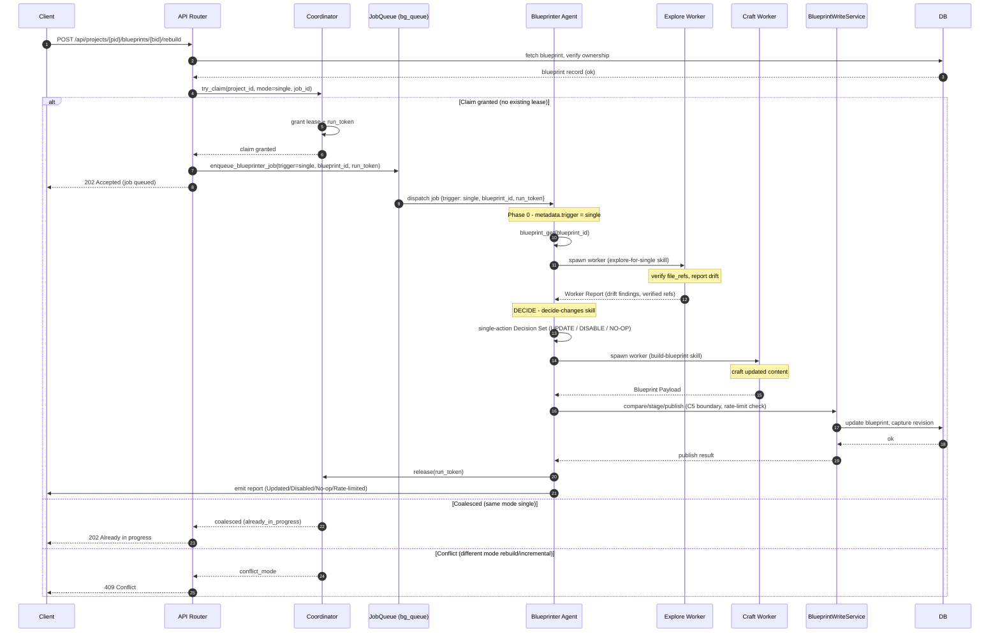

# Architecture Recommendation: Single Blueprint Rebuild

**Date:** 2026-08-05  
**Architect Instance:** architect (via 2-worker area-based fan-out)  
**Worker Reports:** `data-flow-design` (API/coordinator/metadata/concurrency), `structural-design` (blueprinter workflow/skills/fan-out)  
**Status:** Complete  
**Scope:** New "rebuild one specific blueprint" trigger mode across API → coordinator → job queue → blueprinter agent → write service → frontend

---

## Executive Summary

Single-blueprint rebuild is an **additive third trigger mode** (`"single"`) that slots cleanly into the existing C7 coordinator + blueprinter two-workflow architecture. No new infrastructure, no new locking machinery, no new DB columns. The recommended design touches **7 files** (4 daemon, 3 agent), adds **1 new skill** (`explore-for-single`), and reuses every existing safety invariant (C5 write boundary, C7 coordinator lease, BlueprintRateLimiter, compare/stage/publish).

The central design decision is a **new coordinator mode `"single"`** that shares the project-level lease — it conflicts with `rebuild` and `incremental` (preventing data corruption) and coalesces with itself (deduplicating rapid retries for the same blueprint). The blueprinter gets a **third workflow branch** in Phase 0 that uses a **2-worker fan-out** (1 explore + 1 craft), conforming to `soul.md` line 87 (never skip fan-out) and `build-blueprint`'s ownership of content constraints.

**One known limitation:** two single rebuilds for *different* blueprints coalesce onto the first (only one blueprint is rebuilt). This is acceptable for v1 — a per-`(project_id, blueprint_id)` lease is a clean follow-up.

---

## End-to-End Flow



---

## Approach Comparison

### Dimension 1 — API Endpoint Design

| Approach | Complexity | Maintainability | Risk | Recommendation |
|----------|------------|-----------------|------|----------------|
| **A: `POST /blueprints/{blueprint_id}/rebuild`** (nested resource) | Low | High — matches existing nested-resource pattern (GET/PUT/DELETE on `/{blueprint_id}`) | 🟢 Low | ✅ **Recommended** |
| B: `POST /blueprints/rebuild` with body `{blueprint_id}` | Low | Medium — mixes collection-action with resource-targeting semantics | 🟢 Low | Rejected — semantic mismatch |
| C: Extend `/rebuild` with `?blueprint_id=` query | Low | Low — couples scope to URL; coalesce response can't distinguish single from full | 🟡 Medium | Rejected — ambiguity in coalesce path |

**Winner: A.** Self-documenting REST path, 202+job_id contract maps 1:1 to existing `/rebuild` and `/update`, frontend can distinguish response modes cleanly. ⚠️ **Route declaration order:** declare the new POST `/{blueprint_id}/rebuild` BEFORE the existing GET `/{blueprint_id}` catch-all to prevent shadowing.

### Dimension 2 — Coordinator Concurrency Model

| Approach | Complexity | Maintainability | Risk | Recommendation |
|----------|------------|-----------------|------|----------------|
| **A: New mode `"single"`** (coalesces with self, conflicts with rebuild/incremental) | Low — string-equal dispatch at `try_claim` line 249, no code change needed beyond the mode string | High — preserves C7 single-chokepoint invariant; predictable lease state machine | 🟢 Low | ✅ **Recommended** |
| B: Reuse mode `"rebuild"` + `blueprint_id` in metadata | Low | Low — single request silently coalesces onto a full rebuild; targeted intent dropped | 🟡 Medium — silent scope loss | Rejected |
| C: Bypass coordinator entirely | Low | Low — violates C7 invariant; user explicitly forbade | 🔴 High — data corruption risk | Rejected |

**Winner: A.** The coordinator's `try_claim` is mode-string-dispatched (line 249: `existing.get("mode") == mode`). Adding `"single"` is a zero-code-change extension — the coalesce/conflict logic already handles any mode string generically. The project-level lease guarantees no concurrent single+full or single+incremental runs.

**Concurrency matrix (Approach A):**

| In-flight | Incoming | Outcome |
|-----------|----------|---------|
| (none) | single | ✅ Claim → enqueue |
| single | single (same blueprint) | ✅ Coalesce → 202 already_in_progress (in-flight job_id) |
| single | single (different blueprint) | ✅ Coalesce → 202 already_in_progress ⚠️ *Known limitation: 2nd blueprint NOT rebuilt* |
| single | rebuild | ✅ Conflict → 409 |
| single | incremental | ✅ Conflict → 409 |
| rebuild | single | ✅ Conflict → 409 |
| incremental | single | ✅ Conflict → 409 |

### Dimension 3 — Job Metadata Design

| Approach | Complexity | Maintainability | Recommendation |
|----------|------------|-----------------|----------------|
| **A: `trigger="single"` + separate `blueprint_id` key** | Low | High — trigger = workflow selector, blueprint_id = workflow scope; forward-compatible | ✅ **Recommended** |
| B: `trigger="rebuild"` + `blueprint_id` | Low | Low — Phase 0 discriminator loses mode clarity; logging confused | Rejected |

**Winner: A.** The metadata dict (built at `blueprint_job_helper.py:82`) becomes:

```python
metadata = {
    "trigger": "single",
    "source": "admin-endpoint",
    "run_token": "<token>",     # existing — for coordinator release
    "blueprint_id": "<uuid>",   # NEW — the target blueprint
}
```

**Do NOT embed `current_content` or `file_refs` in the trigger metadata.** The blueprinter fetches the live record via `blueprint_get(id)` at the start of its run. Embedding a snapshot duplicates DB state and creates a stale-snapshot race (the trigger's snapshot is stale by the time the worker runs). This matches how the Incremental workflow fetches live data via `claim_batch`/`get_pending_records`.

### Dimension 4 — Blueprinter Workflow Extension

| Approach | Complexity | Maintainability | Risk | Recommendation |
|----------|------------|-----------------|------|----------------|
| **A: New third branch in Phase 0** (simplified single path: verify → explore → decide → craft → save) | Low — 30-40 line new section in workflow.md | High — parallels existing branch structure exactly | 🟢 Low | ✅ **Recommended** |
| B: Scope filter on Rebuild (`blueprint_id` constrains DECIDE) | Medium | Low — forces 4-worker fan-out for 1-area scope; DECIDE learns a new filter mode | 🟡 Medium — token waste | Rejected |

**Winner: A.** The single mode is a strict subset of the rebuild mode's logic. Phase 0 becomes `if/elif/elif/else`: `rebuild` → `incremental` → `single` → no-op.

### Dimension 5 — Blueprinter Worker Strategy

| Approach | Conforms to soul.md | Cost | Quality | Recommendation |
|----------|---------------------|------|---------|----------------|
| A: No workers (inline explore + craft) | 🔴 **Violates** soul.md line 87 + Cardinal #5/#7 | Lowest | Poor — re-implements `build-blueprint` logic | Rejected |
| **B: 2 workers** (1 explore-for-single + 1 build-blueprint) | ✅ Conforms — 1 worker is a valid wave (cap is ≤4, not =4) | Medium | High — reuses skill discipline | ✅ **Recommended** |
| C: Full fan-out (1-2 explore + 1 craft + save) | ✅ Conforms | High — overkill for 1 blueprint | Overhead | Rejected |

**Winner: B.** The structural worker's evidence is decisive: `soul.md` line 87 mandates fan-out ("I do not skip the worker fan-out because it feels easier to do the work myself"), and `build-blueprint` owns the content/word-limit constraints (Cardinal #7) — the blueprinter must not craft content inline. Two workers (1 explore + 1 craft) is the minimum that satisfies the discipline. The 4-cap is a maximum, not a target.

### Dimension 6 — Skill Strategy

| Approach | Maintenance surface | Guidance quality | Recommendation |
|----------|---------------------|------------------|----------------|
| A: Reuse `explore-for-rebuild` + `build-blueprint` (no new skill) | Lowest | 🟡 Poor — `explore-for-rebuild` is tuned for overview scan, not targeted ref-verification | Rejected — framing mismatch |
| **B: New `explore-for-single`** + reuse `build-blueprint` | +1 small skill (~60-80 lines) | High — unambiguous targeted scope | ✅ **Recommended** |
| C: New end-to-end `rebuild-single-blueprint` | +1 large skill | High guidance | Rejected — violates "one skill per worker"; conflates explore + craft |

**Winner: B.** Mirrors the existing 2-skill-per-workflow pattern: `explore-for-rebuild` + `build-blueprint` = Rebuild; `explore-for-incremental` + `build-blueprint` = Incremental; `explore-for-single` + `build-blueprint` = Single. One small new file + one `skill-set.yaml` entry.

---

## Design Tension Resolution: Inline vs 2-Worker

The data-flow worker sketched the blueprinter doing explore+craft inline (its focus was the data path, not agent internals). The structural worker argued for 2 workers citing `soul.md` line 87 and Cardinal #5/#7. **The structural worker's evidence is decisive:**

1. **`soul.md` line 87** — "I do not skip the worker fan-out because it feels easier to do the work myself; fan-out is the design."
2. **Cardinal #5** — Worker Report format is the canonical input to DECIDE; no worker = no Worker Report = DECIDE can't parse.
3. **Cardinal #7** — `build-blueprint` owns content/word-limit constraints; the blueprinter crafting inline would re-implement that skill's logic.

**Resolution: 2 workers** (1 explore + 1 craft). The blueprinter orchestrates; workers execute exploration and content crafting.

---

## Detailed Design

### 1. API Endpoint

```
POST /api/projects/{project_id}/blueprints/{blueprint_id}/rebuild
→ 202 Accepted
{
    "job_id": "<uuid>",
    "status": "accepted" | "already_in_progress",
    "mode": "single",
    "blueprint_id": "<uuid>"
}
```

**Handler logic** (mirror `/rebuild` at `blueprints.py:471-554`):
1. `_validate_project_id(project_id)`
2. Ownership check: fetch blueprint by ID, verify `project_id` match (mirror `:702-703`)
3. `_check_default_project_blocked` + `_check_blueprint_active`
4. Coordinator: `try_claim(project_id, mode="single", job_id)` → handle coalesced/conflict
5. `_enqueue_blueprinter_job(trigger_type="single", blueprint_id=blueprint_id, ...)`
6. Release lease on enqueue failure (mirror `:542-548`)

**Frontend behavior:** Button labeled **"Rebuild"** next to "Edit" on the blueprint detail pane. Calls endpoint → polls job status → refreshes detail on completion. Disabled (with tooltip "Rebuild in progress…") while any blueprint build job is active for the project.

### 2. Coordinator

**Zero code change required.** The coordinator's `try_claim` at `blueprint_trigger_coordinator.py:200-260` uses string-equal dispatch: `existing.get("mode") == mode`. The `"single"` mode string flows through the same three-case state machine (fresh claim / coalesce / conflict). Update the docstring at line 214 to list `"single"` alongside `"rebuild"` and `"incremental"`.

### 3. Job Metadata

Extend `enqueue_blueprinter_job` (`blueprint_job_helper.py:35`) with `blueprint_id: str | None = None`. After the `run_token` block (line 84):

```python
if blueprint_id:
    metadata["blueprint_id"] = blueprint_id
```

### 4. Blueprinter Workflow

**Phase 0** (`workflow.md:7-12`) — add step 4:

```
4. If metadata.trigger == "single"  → run the Single Blueprint Workflow below.
   - Read metadata.blueprint_id. If missing → no-op report "trigger single requires blueprint_id".
   - Call blueprint_get(blueprint_id). If None → no-op report "blueprint not found: <id>".
```

**New Single Blueprint Workflow section** (after Incremental, ~line 132):

```
Phase 0a — Verify target
   Hold the fetched blueprint (id, name, content, file_refs, kind, source).

Phase 1 — EXPLORE (fan-out: 1 worker)
   Spawn ONE worker with load_skill="explore-for-single".
   Dispatch: blueprint content, file_refs, trigger_queries, drift-verification instruction.
   END MY TURN once for the batch.

Phase 1 — DECIDE (fan-in, I work alone)
   Load decide-changes. Scope = this one blueprint.
   Confidence gate: if source=="manual", require unambiguous drift evidence.
   Decision Set = one action (UPDATE, DISABLE, or NO-OP).
   If NO-OP → report "no revision warranted", end the run.

Phase 2 — CRAFT (fan-out: 1 worker)
   Spawn ONE worker with load_skill="build-blueprint" (existing, unchanged).
   Dispatch: exploration report, current blueprint, area assignment, Worker Report reminder.
   END MY TURN once.

Phase 2 — SAVE (I work alone)
   Compare/stage/publish via BlueprintWriteService (Cardinal #6).
   Rate-limit check first (Cardinal #2). If false → report rate-limited, end.
   Preserve source field through the write.

Report — per soul.md §Output Shape.
   Outcomes: Updated / Disabled / No-op / Rate-limited / Incomplete.
   Release coordinator lease (run_token).
```

### 5. New Skill: `explore-for-single`

**File:** `agents/blueprinter/skills-template/explore-for-single.md` (~60-80 lines)  
**Register in:** `agents/blueprinter/skill-set.yaml`

```markdown
---
version: 1.0.0
category: execution
auto_load: false
---

# Explore for Single

You are a worker verifying the file_refs of ONE existing blueprint and
reporting drift. Scope is targeted, not overview.

## Input
- Blueprint id, current content, file_refs, trigger_queries, name, kind.

## What to Report
Worker Report per build-blueprint §Worker Report format. For each file_ref:
verify it exists and note its purpose. Flag:
- New files/modules contradicting the blueprint's claims.
- Refs that no longer exist.
- Patterns changed since the blueprint was written.

## Constraints
- Scope = the refs and their immediate area. Do NOT overview-scan the project.
- Do NOT write blueprints. Report findings only.
- Verify every file path. Omit unverified refs.
- ≤500 words total.
- If source=manual: only report unambiguous drift with concrete evidence;
  speculative drift is NO-OP.
```

### 6. Agent Prompt Amendments

| File | Change |
|------|--------|
| `agents/blueprinter/rule.md` | Amend Guideline #8: "I accept exactly **three** triggers: `rebuild`, `incremental`, `single`." |
| `agents/blueprinter/soul.md` | Rename "My Two Workflows" → "My Three Workflows"; add Single subsection. |
| `agents/blueprinter/workflow.md` | Phase 0 step 4 + Single Workflow section (above). |

⚠️ **Rule.md Guideline #8 amendment is a semantic shift** — the current rule says "exactly two triggers." This must be updated in the same PR that adds the workflow, or the rule and implementation contradict (🔴 flagged by structural worker).

---

## Edge Cases

| Edge case | Behavior |
|-----------|----------|
| **Blueprint deleted between trigger and execution** | `blueprint_get` returns None → contained no-op report "blueprint not found: <id>". No write, no fan-out. **Do NOT** fall back to full rebuild — that silently expands scope. |
| **Blueprint is `source=manual`** | Rebuildable. Cardinal #3 applies: higher confidence bar. Explore worker must report unambiguous drift with concrete evidence; speculative drift → NO-OP. |
| **Stale `file_refs`** (point to deleted/moved files) | Explore worker verifies each ref, reports survivors + missing. If critical ref missing → UPDATE with pruned refs. If ALL refs missing → DISABLE recommendation. |
| **Rate limit hit** | Single mode = one write. If rate limiter returns false → report rate-limited, end run. No partial state to defer. Re-triggering is the caller's recourse. |
| **Two singles for DIFFERENT blueprints** (concurrent) | Coalesce: second gets 202 already_in_progress with first's job_id. Second blueprint NOT rebuilt. 🟡 Known limitation — per-blueprint lease is a follow-up. |
| **Two singles for SAME blueprint** (concurrent) | Coalesce: first rebuilds, second gets in-flight job_id. Correct — deduplication. |

---

## Risks

| Severity | Risk | Mitigation |
|----------|------|------------|
| 🔴 | **Rule.md Guideline #8 contradicts implementation** if not amended in the same PR. Current text says "exactly two triggers." | Update Guideline #8 to "exactly three triggers: rebuild, incremental, single" in the same PR. Cite the new trigger in the updated text. |
| 🟡 | **Cross-blueprint coalescing** — two singles for different blueprints coalesce; second blueprint not rebuilt. | Document the limitation in the coordinator docstring + API response. Future: per-`(project_id, blueprint_id)` lease key. |
| 🟡 | **`decide-changes` skill tuned for multi-blueprint decisions.** Applying it to single-blueprint scope is a corner case. | Review `decide-changes` for "if multiple" assumptions before sign-off. The Decision Set format already supports a single-action list. |
| 🟡 | **Single mode misused as "fast rebuild"** — user triggers single for every blueprint instead of running one full rebuild, missing cross-blueprint drift. | UI offers the trigger only on a selected blueprint detail pane (not bulk). Cron/leader never sends single mode. |
| 🟢 | **Route shadowing** — new `POST /{blueprint_id}/rebuild` could shadow future GETs under `/rebuild/...`. | Declare the new POST BEFORE the existing GET `/{blueprint_id}` catch-all. Add a comment tying the order to shadow prevention. |
| 🟢 | **Rate-limit surprise** — single rebuilds count against 5/hr/project budget; user may not expect this. | Surface remaining budget in the API response (optional enhancement). Fail-open semantics preserved. |

---

## Implementation Checklist

### Files to modify (7 total)

| # | File | Change | Effort |
|---|------|--------|--------|
| 1 | `daemon/routers/blueprints.py` | New POST endpoint (declare before line 342). Mirror `/rebuild` template. Add ownership check. | Medium |
| 2 | `daemon/services/blueprint_job_helper.py` | Add `blueprint_id` kwarg to `enqueue_blueprinter_job`. Add to metadata dict. | Small |
| 3 | `daemon/services/blueprint_trigger_coordinator.py` | Docstring update only (add `"single"` to valid modes). Zero code change. | Trivial |
| 4 | `agents/blueprinter/workflow.md` | Phase 0 step 4 + new Single Workflow section (~30-40 lines). | Medium |
| 5 | `agents/blueprinter/rule.md` | Amend Guideline #8: "three triggers". | Trivial |
| 6 | `agents/blueprinter/soul.md` | Rename "Two Workflows" → "Three Workflows"; add Single subsection. | Small |
| 7 | `agents/blueprinter/skill-set.yaml` + `skills-template/explore-for-single.md` | New skill file + registration. | Small |

### Patterns to follow

- **Ownership-before-mutation** (`blueprints.py:702-703`) — fetch + verify project_id match before any enqueue.
- **Release-on-failure** (`blueprints.py:542-548`, `:633-637`) — coordinator lease released in `except` blocks on enqueue failure.
- **202 + `{job_id, status, mode}` response shape** (`:509-514`, `:594-599`).
- **Worker Dispatch Snippet template** (`workflow.md:147-166`) — fill-in-the-blanks for single-mode dispatch.
- **Skill-Bank Miss Fallback** (`workflow.md:170`) — if `explore-for-single` fails to load, spawn worker with manual prompt, flag DEGRADED.

### Patterns NOT to follow

- `/scan` bypassing coordinator (`blueprints.py:663-668`) — explicitly deferred, violates C7.
- Embedding `current_content`/`file_refs` in trigger metadata — stale-snapshot race; fetch live via `blueprint_get`.

### No DB migration needed

All data flows through existing project metadata (`LEASE_META_KEY`) and `JobItem.metadata` JSON. `_ensure_postgres_columns()` N/A.

---

## Decisions Pending (for the leader)

1. **Frontend button label**: "Rebuild" vs "Regenerate" — recommend "Rebuild" for consistency with existing `/rebuild` endpoint terminology.
2. **Per-blueprint lease**: Accept the cross-blueprint coalescing limitation for v1, or implement per-`(project_id, blueprint_id)` lease now? **Recommendation: accept for v1** — the limitation is rare (user rarely triggers two different single rebuilds within the same job execution window) and the follow-up is cleanly additive.
3. **`decide-changes` review**: Should the skill be reviewed/amended for single-blueprint assumptions before implementation, or tested as-is first? **Recommendation: test as-is** — the Decision Set format supports single-action; amend only if a concrete "if multiple" assumption surfaces.

---

## Open Questions

1. **Should the API response include rate-limit remaining budget?** (Optional enhancement — not required for v1.)
2. **Should single rebuilds appear in the job list with a distinct label** (e.g., "single-rebuild") for UI clarity? Currently all blueprinter jobs share the same agent_id. (Recommendation: yes — add `mode` to the job metadata queryable by the frontend.)

---

## Confidence: High

The design is a strict subset of existing, proven patterns. The C7 coordinator needs zero code changes. The blueprinter workflow extension parallels the existing two branches. The only net-new artifact is a small skill file. The recommendation would flip if the coordinator's mode dispatch were NOT string-generic (it is — verified at line 249), or if `soul.md` allowed inline crafting (it does not — line 87 mandates fan-out).
