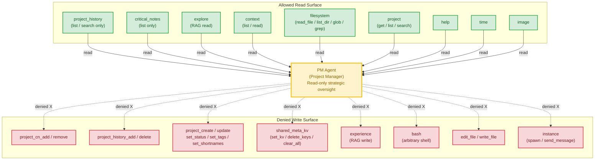

# Architecture Recommendation: Project-Manager Agent

**Date:** 2026-08-12
**Architect Instance:** architect (controller)
**Worker Instances:** architect-worker-pm-security (65886b02), architect-worker-pm-structural (0a622ac0), architect-worker-pm-tradeoff (18e1952c)
**Plan Under Review:** `.agents/shared/planning/project-manager-agent/plan.md` (566 lines)
**Status:** Complete — 3/3 worker reports aggregated

---

## Executive Summary

The PM agent plan is **structurally sound but machine-unsafe as written**. The prose, Cardinal rules, workflow flows, and convention compliance are all well-designed. However, the proposed `tools.allow` / `tools.deny` configuration in `meta.json` grants **~16 write-capable tools** across 6 categories, completely bypassing the Cardinal #1 "read-only on code" constraint at the machine level. The deny list catches only 2 of those 16 write paths. This is a 🔴 **critical** finding that must be fixed before Phase 4 validation — the smoke test would "pass" because the LLM follows prose, but the safety backstop does not exist.

Additionally, the plan has three §10 convention violations that would fail the Phase 4 grep checklist, a semantic cross-reference mismatch (Cardinal #2 vs Guideline #8), and two workflow flows that reference a `question` tool the PM doesn't hold.

**Confidence: High.** The tool-expansion behavior was verified directly against `resolve_tool_filter()` at `daemon/tools/instance.py:226-301`. The write-capable tools were confirmed by reading the tool implementations in `daemon/tools/critical_notes.py`, `project_history.py`, `project.py`, `shared_meta_kv_tools.py`, and `knowledge_tools.py`.

---

## 🔴 Critical Finding: Tool Allowance Is a Write-Grant, Not a Read-Grant

### Root Cause

The ensemble's tool resolution (`resolve_tool_filter`, `daemon/tools/instance.py:226-301`) expands **category names** in `tools.allow` to **all individual tools** registered under that category. The plan allows these categories:

| Category in `tools.allow` | Write-capable tools it expands to | Plan's stated intent |
|---|---|---|
| `critical_notes` | `project_cn_add`, `project_cn_remove` | "Read existing notes" |
| `project_history` | `project_history_add`, `project_history_delete` | "Read chronological events" |
| `project` | `project_create`, `project_update`, `project_set_status`, `project_add_directory`, `project_remove_directory`, `project_set_tags`, `project_add_tag`, `project_remove_tag`, `project_set_shortnames` (9 tools) | "Read project metadata" |
| `shared_meta_kv` | `set_kv`, `delete_keys`, `clear_all` (the entire tool is write-capable — no read-only mode exists) | "Read cross-instance state" |
| `knowledge` | `experience` (writes to RAG KB) | "Query the RAG KB (`explore`)" |
| `bash` | arbitrary shell (`echo >`, `cat << EOF >`, `git commit`, `rm -rf`, `python -c`) | "Read-only git inspection" |

The plan's `tools.deny` names only: `edit_file`, `write_file`, `git_commit`, `db_conn_add`, `db_conn_delete`, `instance`.

**Result:** the deny list catches `edit_file` and `write_file` (2 of ~16 write paths). The other ~14 are open. The `git_commit` deny entry is **dead code** — there is no `git_commit` tool in the registry; bash can run `git commit` as a shell command regardless. The `db_conn_*` denies are also dead code (the `db` category is not in the allow list).

### Why This Matters

- **Cardinal #1 is prose-only.** The agent's prompt says "I never edit, write, commit, or mutate source code, plans, configs, or project state." But the machine config grants the tools to do exactly that. If the agent ever misreads its own prose (context compression, skill-load failure, adversarial prompt), nothing stops it.
- **Critical notes poisoning.** `project_cn_add` lets the PM author critical notes that shape leader behavior — a self-referential conflict of interest for a "read-only oversight" agent.
- **Audit trail fabrication.** `project_history_add` / `project_history_delete` let the PM fabricate or erase history entries.
- **Project DB mutation.** `project_set_status` lets the PM flip a project from `active` to `archived`; `project_set_shortnames` can hijack routing.
- **RAG poisoning.** `experience` writes to the shared knowledge base, reaching every future worker.
- **Shared KV wipe.** `shared_meta_kv` with `clear_all=True` nukes leader/planner state.
- **Shell escape.** `bash` can bypass all file-write denies via heredocs and can run arbitrary Python.

### Concrete Fix: Corrected `tools.allow` + `tools.deny`

The fix has two parts: (1) remove categories that are exclusively or predominantly write-capable from `tools.allow`, and (2) deny individual write tools by exact name for categories that mix read and write.

**Corrected `tools.allow`:**
```jsonc
"allow": [
  "help",
  "time",
  "image",
  "explore",           // individual tool name, NOT "knowledge" category (which bundles "experience")
  "project",           // category kept — read tools needed; write tools denied below
  "project_history",   // category kept — read tools needed; write tools denied below
  "critical_notes",    // category kept — read tools needed; write tools denied below
  "context",
  "filesystem"         // category kept — read tools needed; edit_file/write_file denied below
]
```

**Removed from `allow`:**
- `self` → grants `inner_soul` (write to own persona files). PM doesn't need self-mutation; reads served by `filesystem`.
- `knowledge` → replaced with explicit `explore` (individual read-only tool).
- `shared_meta_kv` → the entire tool is write-capable; no read-only mode exists. If cross-instance state visibility is needed, route via `context` files instead.
- `bash` → no safe read-only mode. Removing is the only enforceable path. (If git read access is later needed, add individual `git_status`/`git_log`/`git_diff` tools — see Open Questions.)

**Corrected `tools.deny`:**
```jsonc
"deny": [
  // Filesystem writes
  "edit_file",
  "write_file",

  // Critical notes writes
  "project_cn_add",
  "project_cn_remove",

  // Project history writes
  "project_history_add",
  "project_history_delete",

  // Project DB writes (all 9)
  "project_create",
  "project_update",
  "project_set_status",
  "project_add_directory",
  "project_remove_directory",
  "project_set_tags",
  "project_add_tag",
  "project_remove_tag",
  "project_set_shortnames",

  // RAG KB writes
  "experience",

  // Stand-alone constraint
  "instance"
]
```

**Removed from `deny`:**
- `git_commit`, `db_conn_add`, `db_conn_delete` — dead-code entries (no such tools in registry; categories not in allow list). Keeping them is harmless documentation, but they provide no safety.

### Trust Boundary After Fixes



After fixes: the PM can **read everything** (project metadata, history, critical notes, RAG KB, shared context, filesystem) but **mutate nothing**. The Cardinal #1 "read-only on code" constraint becomes machine-enforced, not just prose-enforced.

---

## Approach Comparison (Design Dimension Clusters)

| Dimension | Complexity | Scalability | Maintainability | Risk | Cost | Recommendation |
|---|---|---|---|---|---|---|
| **Tool boundary (current plan)** | Low (simple allow/deny) | N/A | 🟡 Deny list will grow as categories expand | 🔴 16 write paths open | Low (config only) | **Fix before implementation — see corrected config above** |
| **Tool boundary (corrected)** | Low | Good — individual denies are stable | 🟢 Clear: category kept for reads, writes denied by name | 🟢 Machine-enforced | Low | **Adopt** |
| **PM ↔ Leader boundary** | Low (no coupling) | Good (standalone scales independently) | 🟢 Semantic labels survive renumbering | 🟡 "Hand back to leader" is prose-only, no machine handoff | Low | **Accept for v1; document the prose-only nature explicitly** |
| **meta.json schema** | Low | N/A | 🟢 Complete vs all reference agents | 🟢 No missing fields | Low | **Accept as-is; resolve 4 open questions → all yes** |
| **Workflow flows (4)** | Med (4 flows) | Good (flows are independent) | 🟡 F2/F4 reference absent `question` tool; flows don't chain | 🟡 Tactical-question redirect untested in smoke test | Low | **Fix F2/F4 step 1; add flow-chain rule; add dispatch red-team to smoke test** |
| **Future integration** | Low (v1 is minimal) | Good (additive-only path) | 🟢 Id/name stable; allow-list is additive | 🟡 `instance` must stay permanently denied | Low | **Add "Future Integration Contract" section to plan** |

---

## All Findings (Severity-Ordered, Deduplicated)

### 🔴 Critical

| # | Finding | Source | Evidence | Fix |
|---|---|---|---|---|
| C1 | **16 write-capable tools granted** — `tools.allow` categories expand to write tools the deny list doesn't catch | security | `resolve_tool_filter` at `instance.py:226-301`; tool impls in `critical_notes.py:92,221`, `project_history.py:125,286`, `project.py:358-643`, `shared_meta_kv_tools.py:71`, `knowledge_tools.py:961` | Apply corrected allow/deny config above |
| C2 | **`bash` grants arbitrary shell** — `git_commit` deny is dead code (no such tool); heredocs bypass `write_file`/`edit_file` denies | security | `bash.py:213`; `git_commit` not in `_tool_registry` | Remove `bash` from `tools.allow` |
| C3 | **§10.1 violations in proposed prompt prose** — `meta.json` and `tools.deny` appear in Cardinal #1 and tools_note.md rows | trade-off | plan lines 313, 464, 465 | Delete references; rewrite as operational prose only |

### 🟡 Significant

| # | Finding | Source | Evidence | Fix |
|---|---|---|---|---|
| S1 | **"Hand back to leader" is prose-only** — PM has `team_members: []` and `instance` denied; cannot `send_message` to leader | structural | `team_members: []` + `instance` in deny | Document explicitly: hand-back is user-mediated prose by design |
| S2 | **Cardinal #2 cross-ref mismatch** — workflow.md line 386 points to Cardinal #2 ("no dispatch") for the hand-back redirect, but hand-back is Guideline #8 | structural + trade-off | plan lines 314, 332, 386 | Re-anchor to Guideline #8 |
| S3 | **F2 + F4 reference absent `question` tool** — "Confirm scope with the user" / "Confirm the choice" steps assume a tool the PM doesn't hold | trade-off | plan lines 406, 426; `question` excluded at line 206 | Rephrase: infer from literal ask, state the window/frame in the reply |
| S4 | **tools_note.md "Backstop" section describes the deny mechanism** — violates §4 ("Don't describe the meta.json deny mechanism in prose") | trade-off | plan lines 471-475 | Delete section; trust the machine layer silently |
| S5 | **Flows don't chain** — F1 discovering scope drift doesn't hand to F3; 4 siloed scripts, not a coherent oversight surface | trade-off | plan lines 391-431 (no inter-flow references) | Add tail rule: "If F1 surfaces scope drift → run F3; if F3 surfaces a decision → run F4" |
| S6 | **Dead-code deny entries** — `git_commit`, `db_conn_add`, `db_conn_delete` name tools that don't exist or aren't in allow list | security | `_tool_registry.py` has no `git_commit` tool; `db` category not in allow | Remove from deny (harmless but misleading to auditors) |
| S7 | **`description` will become stale on v2 upgrade** — "read-only on code, never dispatches" becomes false when `team_members` is added | structural | plan line 150 | Soften: "Strategic project oversight. Read-only on code (v1)." |
| S8 | **`skill_injection: false → true` flip has no documented prerequisites** — PM needs a `pm-strategy` skill + tools_note.md update before the flip is safe | structural | plan has no v2 checklist | Add to "Future Integration Contract" section |

### 🟢 Improvements

| # | Finding | Source | Fix |
|---|---|---|---|
| I1 | Smoke test doesn't red-team the dispatch constraint | structural | Add step 8: "spawn a worker to fix this" → expect Cardinal #2 denial |
| I2 | Cardinal #7 (active contracts) has no dedicated flow entry point | trade-off | Add F5 "Contract & Risk Sweep" or fold into F1 step 4 |
| I3 | No invocation-contract table in workflow.md | structural | Add "Caller says → Flow → Output template" table for future programmatic invocation |
| I4 | 4-row PM-vs-leader table omits the handoff-mechanism axis | structural | Add 5th row: "Handoff — leader assigns to user; PM emits 'hand to leader'" |
| I5 | `self` (inner_soul) grants self-mutation to own persona files | security | Remove `self` from allow; reads served by `filesystem` |
| I6 | No dependency-tracking flow (cross-feature blocking) | trade-off | Fold into F1 step 4 as a 1-line dependency map; defer dedicated flow to v2 |

---

## Resolved Open Questions (from plan §119-124)

| Q | Plan's Default | Architect Recommendation | Rationale |
|---|---|---|---|
| 1. `description` mentions stand-alone + non-dispatching? | yes | **Yes**, but soften to "(v1)" so it doesn't go stale on upgrade | S7 |
| 2. Primary color? | `accent-emerald` | **Yes — `accent-emerald`** | Distinct from leader (amber), planner (indigo), architect (violet) |
| 3. `context_injection.heuristic_match_shared_md_files: true`? | yes | **Yes** | Matches leader/planner/architect pattern; PM needs shared context for oversight |
| 4. Skill-versioning line in rule.md? | yes | **Yes — Guideline #7** | Future-proof; convention-compliant (doesn't name `skill-set.yaml`) |

---

## Recommended Plan Edits (Priority Order)

These are edits the **developer** should make to the plan and/or the agent files during implementation:

### Must-Fix Before Phase 4 (🔴 blockers)

1. **Replace `tools.allow` + `tools.deny`** in the plan's meta.json spec (lines 160-183) with the corrected config from this recommendation.
2. **Delete `meta.json` and `tools.deny` references** from Cardinal #1 prose (plan line 313) and tools_note.md rows (plan lines 464-465). Rewrite operationally.
3. **Delete the "Backstop" section** from tools_note.md spec (plan lines 471-475). Per §4, the agent doesn't know about the deny mechanism.

### Should-Fix Before Implementation (🟡 quality)

4. **Re-anchor workflow.md line 386** from "Cardinal #2" to "Guideline #8 — Hand-back".
5. **Rephrase F2 step 1** (line 406): drop "Confirm scope with the user" → "Default to last 7 days; state the window in the reply."
6. **Rephrase F4 step 1** (line 426): drop "Confirm the choice" → "Frame as the literal ask reads; if ambiguous, state the framing."
7. **Add flow-chain rule** at workflow.md tail (after line 440): "If F1 surfaces scope drift → run F3 in same reply. If F3 surfaces a decision → run F4."
8. **Add dispatch red-team** to smoke test (after plan line 547): step 8 — "spawn a worker to fix this" → expect Cardinal #2 denial + Guideline #8 hand-back.
9. **Add 5th row** to PM-vs-leader table (plan §259-263): handoff mechanism axis.
10. **Add Cardinal #2 sub-clause** (plan line 314): "`instance` is permanently denied; a future PR adding it must rewrite this Cardinal first."

### Nice-to-Have (🟢 polish)

11. **Add invocation-contract table** to workflow.md top: "Caller says → Flow → Output template."
12. **Add "Future Integration Contract" section** to plan Summary (before line 564): "v2 may add `team_members`, `skill_injection: true`, `mcp`, `question` — id/name/version stay, Cardinal #1 stays, **`instance` stays permanently denied**. v2 PRs must add a `pm-strategy` skill and update `tools_note.md`."
13. **Consider F5 "Contract & Risk Sweep"** — operationalizes Cardinal #7. Optional for v1.

---

## Decisions Pending (Leader/User Must Decide)

| # | Decision | Options | Architect Recommendation |
|---|---|---|---|
| D1 | **Remove `bash` entirely vs. keep with prose-only constraint** | (A) Remove bash; PM uses `filesystem` for all reads. (B) Keep bash; trust Cardinal #1 prose + smoke test. | **(A) Remove.** Bash has no enforceable read-only mode. If git reads are needed later, add individual `git_status`/`git_log`/`git_diff` tools. |
| D2 | **Remove `self` from allow vs. keep for introspection** | (A) Remove; PM reads its own files via `filesystem`. (B) Keep; accept self-only write blast radius. | **(A) Remove.** PM doesn't need self-mutation. Reads served by `filesystem`. |
| D3 | **Remove `shared_meta_kv` vs. keep for cross-instance state visibility** | (A) Remove entirely (no read or write). (B) Keep; trust prose to not call `set_kv`. | **(A) Remove.** The tool is exclusively write-capable. If KV visibility is needed, route via `context` files. |
| D4 | **Add F5 "Contract & Risk Sweep" flow in v1 vs. defer to v2** | (A) Add now. (B) Fold into F1 step 4. (C) Defer. | **(B) Fold into F1.** Keeps v1 at 4 flows; Cardinal #7 gets an entry point without a new flow. |

---

## Open Questions

| # | Question | Notes |
|---|---|---|
| O1 | Does the ensemble have (or plan to add) granular read-only git tools (`git_status`, `git_log`, `git_diff`) as individual registered tools? | If yes, PM can regain git-read capability without bash. If no, PM loses git-read entirely (acceptable — `filesystem` + `project_history` cover most oversight needs). |
| O2 | Is there a read-only mode for `shared_meta_kv` (e.g., calling with no args returns current state)? | The tool's signature suggests calling with no mutations returns current state — but this is a read side-effect of a write tool, not a guaranteed read-only path. Needs verification against `shared_meta_kv_tools.py` behavior. |
| O3 | Can the PM signal the leader via the parent-of-spawn mechanism (i.e., its completion report goes to whoever spawned it)? | If yes, "hand back to leader" has a machine path (PM's response reaches the spawner). If no, hand-back is purely user-mediated prose. This doesn't change the v1 design but affects the future-integration contract. |

---

## Gaps

None. All three workers reported successfully with full skill confirmation (`Skill loaded: [...]` on all three). No re-dispatches were needed. No approach was left unanalyzed.
