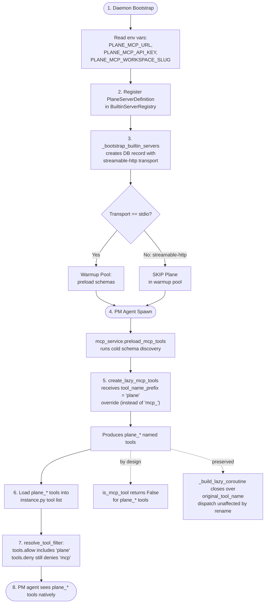

# Plane MCP Architecture: Built-in Server with Native Tool Naming

**Date:** 2026-08-13
**Architect Instance:** architect (controller)
**Worker Instances:** architect-worker-plane-option-a (e12a6f4e), architect-worker-plane-option-c (e872ab83), architect-worker-plane-option-bd (1f60db92)
**Status:** Complete — 3/3 worker reports aggregated + architect verification
**Confidence:** High

---

## Executive Summary

**Recommended Approach: A+D Hybrid — Tool Name Prefix Override via `BuiltinServerDefinition.tool_name_prefix`**

Add an optional `tool_name_prefix` property to `BuiltinServerDefinition`. When set (e.g., `"plane"`), the tool adapter uses `plane_` instead of `mcp_plane_` as the tool name prefix. This is the smallest-surface-area change that satisfies the non-negotiable "no `mcp_` prefix" requirement: one new ABC property, one new builtin definition file, ~10 lines of plumbing across the tool adapter and MCP service, plus a new `plane` tool category for clean agent config.

The critical enabling fact: Plane uses `streamable-http` transport, so `manager.py:1473` **skips it from the warmup pool** (`if config_dict.get("transport") != "stdio": continue`). This means `adapt_mcp_tools()` is **never called** for Plane — only `create_lazy_mcp_tools()` is used via the cold-discovery lazy path. The prefix override needs to flow through exactly ONE function, not two.

---

## Problem Statement

The project-manager agent needs Plane (project management tool) integrated as a built-in MCP server. Requirements:

1. **Built-in registration** — auto-registered at daemon bootstrap like context7/webfetch
2. **No `mcp_` prefix** — tools must appear as `plane_*`, not `mcp_plane_*` (NON-NEGOTIABLE)
3. **Env-based config** — URL, API key, workspace slug from environment variables
4. **Essential, not optional** — these tools are core to the PM agent's function
5. **PM agent compatibility** — PM currently denies `mcp` in `tools.deny`; Plane tools must not be caught by this deny

---

## Approach Comparison

| Approach | Complexity | Scalability | Maintainability | Risk | Cost | Recommendation |
|----------|------------|-------------|-----------------|------|------|----------------|
| **A: Prefix Override** | 🟢 Low | 🟢 High (extensible to other servers) | 🟢 High (single property, opt-in) | 🟢 Low (additive, backward-compatible) | 🟢 Low (~10 lines plumbing) | **✅ RECOMMENDED** |
| **B: Custom Category** | 🟡 Medium | 🟡 Medium (category per server) | 🔴 Low (overlapping categories) | 🔴 High (❌ does NOT remove prefix) | 🟡 Medium | ❌ Does not meet requirement |
| **C: Native Wrappers** | 🔴 High (50+ hand-written functions) | 🔴 Low (schema drift, coverage gaps) | 🔴 Low (parallel maintenance layer) | 🔴 High (schema staleness, coverage drift) | 🔴 High (full-time maintenance) | ❌ Excessive complexity |
| **D: Post-Creation Rewriter** | 🟢 Low | 🟢 High | 🟡 Medium (naming strategy table) | 🟢 Low | 🟢 Low | ✅ VIABLE — equivalent to A |

### Why A+D Hybrid Wins

**Approaches A and D are architecturally identical** — both override the tool name prefix at the factory boundary (`create_lazy_mcp_tools`). The difference is framing:
- **A** frames it as a property on `BuiltinServerDefinition` (cleaner extension point)
- **D** frames it as a naming strategy parameter (more flexible but more plumbing)

We adopt **A's framing** (property on the ABC) because it's the most discoverable and reusable pattern. The implementation mechanics are the same as D: thread the prefix from the definition through `create_lazy_mcp_tools`.

### Why Others Lose

- **B (Custom Category)** is a non-starter: it changes only the *category label*, not the *tool name*. Tools would still be `mcp_plane_*`, violating the non-negotiable requirement. The worker confirmed: "Result: PM agent sees no Plane tools at all" because the `mcp_` prefix causes deny-wins-over-allow collision.

- **C (Native Wrappers)** satisfies the naming requirement but at unacceptable cost: ~50+ hand-written tool functions (Plane exposes a large tool surface), frozen `args_schema` that drifts from Plane's actual schema, and a coverage gap where new Plane tools require code changes. The maintenance tax is unbounded.

---

## Recommended Architecture: A+D Hybrid

### Registration & Transport



### How It Works

#### Phase 1: Bootstrap Registration
1. `PlaneServerDefinition` (new file) implements `BuiltinServerDefinition` with:
   - `name = "plane"`, `tool_name_prefix = "plane"`
   - `get_base_config()` returns `{"transport": "streamable-http", "url": <env>, "headers": {"Authorization": ..., "x-workspace-slug": ...}}`
   - `is_available()` returns `True` only when `PLANE_MCP_URL` env var is set
   - `get_config_schema()` returns the three env-backed config fields
2. `_bootstrap_builtin_servers()` in `manager.py` auto-creates the DB record with `is_builtin=True`
3. Warmup pool **skips** Plane (`transport != stdio` at `manager.py:1473`)

#### Phase 2: Tool Discovery & Prefix Override
4. On PM agent spawn, `mcp_service.preload_mcp_tools()` iterates active MCP servers
5. For Plane: cold schema discovery via `_discover_schemas_cold()` (streamable-http, not pooled)
6. `create_lazy_mcp_tools()` is called with the `tool_name_prefix` from the builtin definition
7. Tools are created with `plane_` prefix instead of `mcp_plane_`
8. The `_build_lazy_coroutine()` captures `original_tool_name` in its closure — dispatch to the MCP server is **unaffected by the tool name change**

#### Phase 3: Agent Filtering
9. `resolve_tool_filter()` runs: PM's `tools.allow` includes `"plane"` category, `tools.deny` includes `"mcp"`
10. `plane_*` tools don't match the `mcp_` prefix, so `is_mcp_tool()` returns `False` — they are **not** caught by the `"mcp"` deny
11. PM agent sees `plane_*` tools natively

### Critical Safety Properties (Verified by Architect)

| Property | Verification | Impact |
|----------|-------------|--------|
| `_build_lazy_coroutine` closes over `original_tool_name` | ✅ Confirmed at `tool_adapter.py:314-315` | Tool name rename does NOT break MCP dispatch |
| `is_mcp_tool()` has zero call sites outside `tool_adapter.py` | ✅ Grep confirmed: only defined at `tool_adapter.py:122`, exported at `__init__.py:17`, no external consumers | Rename doesn't break any routing/dispatch code |
| `adapt_mcp_tools()` is NOT called for Plane | ✅ `manager.py:1473` skips non-stdio servers from warmup pool; Plane uses streamable-http | Prefix override only needs to flow through `create_lazy_mcp_tools` |
| `resolve_tool_filter` uses `all_tool_names` for MCP discovery | ✅ `instance.py:267-275` discovers by actual names, not prefix | Renamed tools are found if they're in the tool list |
| `McpStreamableHttpConfig` supports headers | ✅ `config.py:151-156` has `url` + `headers` fields | Plane's auth headers work without code changes |

---

## Required Environment Variables

| Variable | Purpose | Example |
|----------|---------|---------|
| `PLANE_MCP_URL` | MCP server endpoint URL | `https://mcp.ensem.dev/plane/http/api-key/mcp` |
| `PLANE_MCP_API_KEY` | Bearer token for Authorization header | `plane_api_947db192e75b4237ab43bf9a31b546f2` |
| `PLANE_MCP_WORKSPACE_SLUG` | Workspace identifier for x-workspace-slug header | `nea` |
| `MCP_DISABLE_BUILT_IN_PLANE` | Disable Plane (standard builtin disable pattern) | `true` |

When `PLANE_MCP_URL` is unset, `is_available()` returns `False` and the server is silently skipped at bootstrap — no errors, no DB record, no connection attempts. This matches the existing pattern for optional builtins.

---

## Files to Change

### New Files

| File | Purpose |
|------|---------|
| `daemon/mcp/builtin_servers/plane.py` | `PlaneServerDefinition` — streamable-http transport, env-driven config, `tool_name_prefix = "plane"`, `is_available()` checks env var presence |

### Modified Files

| File | Change | Lines Affected |
|------|--------|----------------|
| `daemon/mcp/builtin_servers/base.py` | Add optional `tool_name_prefix` property (default `None`) to `BuiltinServerDefinition` | +5 lines (property + docstring) |
| `daemon/mcp/builtin_servers/__init__.py` | Register `PlaneServerDefinition()` at module bottom | +2 lines (import + register) |
| `daemon/mcp/tool_adapter.py` | Add `tool_name_prefix: str \| None = None` param to `create_lazy_mcp_tools()`; use it instead of hardcoded `mcp_` when provided | ~8 lines changed in function signature + prefix computation |
| `daemon/services/mcp_service.py` | In `preload_mcp_tools()`: resolve builtin definition, pass `tool_name_prefix` to `create_lazy_mcp_tools()` | ~5 lines added around line 497 |
| `daemon/tools/_tool_registry.py` | Add `"plane": "daemon.tools.plane_tools"` to `CATEGORY_MODULES` dict | +1 line at line ~285 |
| `daemon/tools/plane_tools.py` | **New module** (can be minimal — just `CATEGORY_NAME` + `CATEGORY_DOC` constants for help tool; tools are dynamically created) | ~15 lines |
| `agents/project-manager/meta.json` | Add `"plane"` to `tools.allow`; `"mcp"` stays in `tools.deny` | 1 line changed |

### Implementation Detail: `tool_name_prefix` Property

```python
# In BuiltinServerDefinition (base.py)
@property
def tool_name_prefix(self) -> str | None:
    """Override the tool name prefix for this server's tools.

    When None (default), tools use the standard 'mcp_{server_name}_' prefix.
    When set (e.g., 'plane'), tools use '{prefix}_' instead — e.g.,
    'plane_list_issues' instead of 'mcp_plane_list_issues'.

    This is for essential built-in servers whose tools should feel native
    to specific agents rather than appearing as add-on MCP tools.
    """
    return None
```

### Implementation Detail: Prefix Computation in `create_lazy_mcp_tools`

The current code at `tool_adapter.py:302-303`:
```python
slugified_server = _slugify(server_name)
prefix = f"mcp_{slugified_server}_"
```

Changes to:
```python
if tool_name_prefix is not None:
    prefix = f"{tool_name_prefix}_"
else:
    slugified_server = _slugify(server_name)
    prefix = f"mcp_{slugified_server}_"
```

The description suffix (`[MCP:{server_name}]`) is preserved regardless of prefix — this maintains consistency in help tool output and system prompt tool listings.

---

## Agent Integration

### PM Agent `meta.json` Changes

```jsonc
{
  "tools": {
    "allow": [
      // ... existing tools ...
      "plane"            // NEW: plane tool category
    ],
    "deny": [
      // ... existing denies ...
      "mcp"              // UNCHANGED: still denies general MCP tools
    ]
  }
}
```

The `"mcp"` deny stays — it blocks all standard MCP tools (context7, webfetch, custom servers). Plane tools are `plane_*`, not `mcp_*`, so they bypass this deny entirely. The separation is clean: Plane is an *essential* toolset with native naming, not a general MCP add-on.

### Tool Names Visible to the PM Agent

| MCP Server Tool Name | Agent-Visible Name |
|---------------------|-------------------|
| `list_issues` | `plane_list_issues` |
| `create_issue` | `plane_create_issue` |
| `get_project` | `plane_get_project` |
| `list_cycles` | `plane_list_cycles` |
| `update_module` | `plane_update_module` |

All tools carry the `[MCP:plane]` description suffix for consistency with other MCP-backed tools.

### Category Resolution Flow

1. PM's `tools.allow` includes `"plane"` category
2. `resolve_tool_filter()` looks up `"plane"` in `tool_categories`
3. The `plane` category is populated by `scan_tools_for_full_docs()` which infers category from `_tool_category` attribute or name prefix (`name.split('_')[0]` = `"plane"`)
4. `plane_*` tools are matched and included in the allowed set
5. PM's `tools.deny` includes `"mcp"` — but `plane_*` tools don't match `mcp_` prefix, so they survive the deny

---

## `plane_tools.py` Module (New)

This module serves a dual purpose:

1. **Category registration** — declares `CATEGORY_NAME = "Plane"` and `CATEGORY_DOC = "..."` for the help tool
2. **Dynamic tool creation (optional optimization)** — can include a factory function that creates `plane_*` tool stubs from discovered schemas, but this is NOT required for the MVP. The lazy MCP tools with `plane_` prefix are sufficient.

Minimal MVP:
```python
# daemon/tools/plane_tools.py
"""Plane tool category for the project-manager agent.

Tools are created dynamically by create_lazy_mcp_tools with the
'plane_' prefix override. This module provides category metadata
for the help tool and category resolution system.
"""

CATEGORY_NAME = "Plane"
CATEGORY_DOC = "Project management tools for Plane (issues, projects, cycles, modules). Native integration — no MCP prefix."
```

The `CATEGORY_MODULES` entry `"plane": "daemon.tools.plane_tools"` tells the registry where to find category metadata. The actual tools are injected dynamically by the MCP system with `plane_` names.

---

## Security Considerations

### API Key Handling

| Concern | Mitigation |
|---------|-----------|
| API key in code | ✅ Read from `PLANE_MCP_API_KEY` env var at bootstrap time |
| API key in DB | ⚠️ Stored in MCP server config (DB row) — same as all MCP servers. Acceptable: it's a server-side secret, not exposed to agents |
| API key in logs | ✅ `build_config()` writes headers to DB config; no log statements print headers. Existing MCP logging doesn't dump config |
| API key rotation | ✅ Update env var + restart daemon. `_bootstrap_builtin_servers()` detects schema version change and refreshes config |

### Tool Access Control

| Concern | Mitigation |
|---------|-----------|
| Should Plane tools be PM-only? | 🟡 **Recommendation: yes, initially.** Other agents don't include `"plane"` in `tools.allow`, so they never see Plane tools. If broader access is needed later, add `"plane"` to other agents' allow lists |
| PM agent's deny of `"mcp"` | ✅ Unaffected — `plane_*` tools don't match `mcp_` prefix. The deny correctly blocks context7/webfetch/custom MCP servers |
| Essential vs optional | ✅ Plane is "essential" in *concept* (core to PM function) but "optional" in *availability* (graceful skip when env vars absent). `is_available()` returns `False` when `PLANE_MCP_URL` is unset — no crash, no error |

---

## Impact on Existing MCP System

### Zero Breaking Changes

| Component | Impact | Details |
|-----------|--------|---------|
| Context7 builtin | ✅ None | `tool_name_prefix = None` (default), unchanged behavior |
| WebFetch builtin | ✅ None | Same — default prefix preserved |
| Custom MCP servers (REST API) | ✅ None | Non-builtin servers always get `None` prefix (no definition to consult) |
| `is_mcp_tool()` | ✅ None | Still works for `mcp_*` tools; `plane_*` simply returns `False` (correct — they're "native" by design) |
| `adapt_mcp_tools()` | ✅ None | Only called by warmup pool for stdio servers; Plane is streamable-http, never pooled |
| Warmup pool | ✅ None | Skips non-stdio servers at `manager.py:1473` |
| `resolve_tool_filter()` | ✅ None | Uses `all_tool_names` for discovery; `plane_*` found by category, not prefix |
| Help tool | ✅ None | `scan_tools_for_full_docs()` infers category from name prefix; `plane_*` → `"plane"` category |

### Future Extensibility

The `tool_name_prefix` property is a **general-purpose extension point**. Future essential MCP servers follow the same pattern:

| Server | `tool_name_prefix` | Agent-Visible Names |
|--------|-------------------|-------------------|
| Plane | `"plane"` | `plane_list_issues`, `plane_create_issue` |
| (future) Notion | `"notion"` | `notion_search_pages`, `notion_create_page` |
| (future) Linear | `"linear"` | `linear_list_issues`, `linear_create_issue` |
| (future) Jira | `"jira"` | `jira_get_ticket`, `jira_create_ticket` |

Each gets a corresponding entry in `CATEGORY_MODULES` and the agent's `tools.allow`. The pattern scales cleanly.

---

## Risks

### 🔴 Critical

None. All critical-path concerns were verified by the architect.

### 🟡 Significant

1. **`adapt_mcp_tools()` prefix gap** — If Plane is ever changed to use stdio transport (unlikely — it's a remote HTTP service), `adapt_mcp_tools` at `tool_adapter.py:197-198` would also need the prefix override. **Current risk: zero** because Plane is streamable-http and skipped by the warmup pool. **Future-proofing:** add the same `tool_name_prefix` param to `adapt_mcp_tools` for symmetry, even if unused today.

2. **Category scan timing** — `scan_tools_for_full_docs()` at `instance.py:2070` infers category from `_tool_category` or name prefix. For dynamically-created lazy MCP tools, `_tool_category` is not set, so the fallback `name.split('_')[0]` produces `"plane"`. This works but is brittle if a tool name doesn't start with the prefix. **Mitigation:** set `_tool_category = "plane"` on the StructuredTool in `create_lazy_mcp_tools` when a prefix override is active.

3. **Preload waste for non-PM agents** — `preload_mcp_tools()` runs for ALL agents, building `plane_*` lazy tools even for agents that don't allow the `plane` category. The tools are filtered out later, but the schema discovery and tool creation work runs anyway. **Mitigation (optional):** gate preload on agent's `tools.allow` — but this is an optimization, not a correctness issue. The existing system already has this behavior for all MCP servers.

### 🟢 Improvement Opportunities

1. **Documentation** — The PM agent's prompt files should document the `plane_*` tools in the `## Tools` section. Since tool names are dynamic, the help tool (`tool_help`) is the canonical discovery mechanism.

2. **Graceful degradation** — When Plane MCP server is unreachable, lazy tool coroutines raise `ToolException`. The PM agent should handle this gracefully in its prompt ("Plane tools may be temporarily unavailable").

3. **Testing** — Add a test verifying that `resolve_tool_filter(allow=["plane"], deny=["mcp"])` correctly includes `plane_*` tools and excludes `mcp_*` tools. Add a test for `PlaneServerDefinition.is_available()` behavior with/without env vars.

---

## Decisions Pending

| Decision | Owner | Default if Undecided |
|----------|-------|---------------------|
| Should Plane tools be available to agents other than PM? | Leader | No — PM-only initially (other agents don't list `"plane"` in allow) |
| Should `adapt_mcp_tools` also get the prefix param (future-proofing)? | Implementer | Yes — add for symmetry even if unused today |
| Should `plane_tools.py` include a dynamic tool factory, or just category metadata? | Implementer | Category metadata only for MVP; dynamic factory is optional optimization |

---

## Open Questions

1. **Plane tool surface** — How many tools does the Plane MCP server expose? This affects preload time and token budget for the PM agent's system prompt. The cold schema discovery at spawn time will reveal the full list.

2. **Tool description quality** — Plane MCP server tool descriptions may need enrichment for the PM agent's use case. The `description_suffix = "[MCP:plane]"` is added automatically, but the base descriptions come from the server. If they're insufficient, a post-processing enrichment step could be added later.

3. **Rate limiting** — Does the Plane MCP server have rate limits? The existing MCP tool timeout (`tool_call_timeout`) handles slow responses, but burst-rate limits aren't addressed. Monitor in production; add a token bucket if needed (the source adapter subsystem already has `rate_limiter.py` as a pattern).

---

## Appendix: Worker Report Summaries

### Worker A (Option A: Prefix Override) — ⭐ Recommended
- **Verdict:** Viable and recommended
- **Complexity:** Low-Medium
- **Key insight:** `tool_name_prefix` property is a single, discoverable extension point; `all_tool_names` in `resolve_tool_filter` decouples discovery from prefix-matching
- **Risk:** Category leakage if Plane tools mixed into `mcp` category (mitigated by separate `plane` category)

### Worker C (Option C: Native Wrappers) — ❌ Not Recommended
- **Verdict:** Viable only with hybrid schema-aliasing mitigation
- **Complexity:** Medium-High (50+ hand-written functions)
- **Key insight:** Frozen `args_schema` drifts from Plane's actual schema; coverage gaps when Plane adds new tools
- **Risk:** 🔴 Schema staleness, 🔴 coverage gap, 🟡 preload leak

### Worker B+D (Custom Category + Post-Creation Rewriter)
- **Option B verdict:** ❌ Not viable — changes category label, not tool name; deny-wins collision blocks all tools
- **Option D verdict:** ✅ Viable and recommended — equivalent to A; rewrite at factory boundary; `is_mcp_tool()` false-negatives are safe (no external consumers)
- **Key insight:** `_build_lazy_coroutine` closes over `original_tool_name`, so renaming `StructuredTool.name` does not affect MCP dispatch
