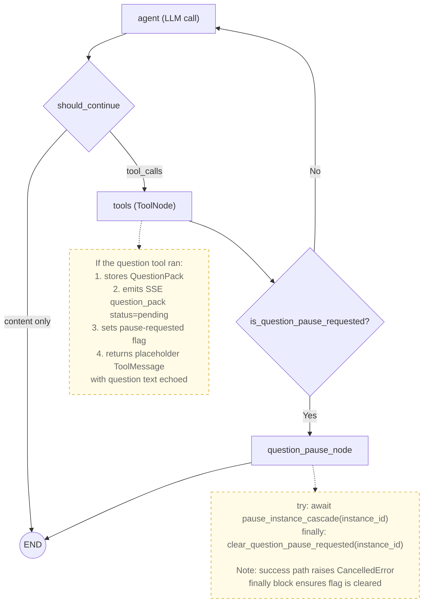
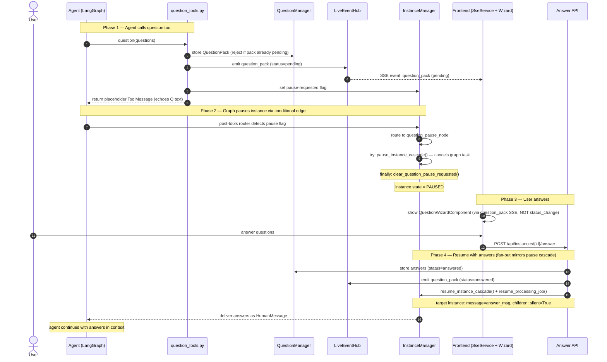

# Plan Overview: Question Tool

## Objective
Add a `question` tool that lets the leader agent ask the user a batch of questions and **pause** the instance while waiting for answers. When the user submits answers via a new `POST /api/instances/{id}/answer` endpoint, the instance **resumes** and the answers are injected back into the agent's conversation. The frontend renders a wizard-style UI driven by a new `question_pack` SSE event.

## Scope Assessment
**MEDIUM** — A single cohesive feature that spans the Python daemon (new manager + tool + API + SSE), one agent config change, and the Angular frontend (new component + SSE + chat integration). The pattern is well-established (mirrors the Todo system), so complexity is moderate. ~10 files created/modified. Estimated 1 day of focused development.

## Context
- **Project**: agents-ensemble
- **Working Directory**: `/Users/nguyenminhkha/All/Code/opensource-projects/agents-ensemble`
- **Database**: PostgreSQL is the PRIMARY dev/test DB. QuestionManager is **in-memory only** (no DB table) — same as TodoManager.
- **Reference patterns**: Todo system (manager + tool + SSE + frontend), injection slot (RAM-based per-instance state), pause/resume cascade.

## Architecture Summary

### Graph Routing Architecture (post-review)

The **pause-from-within-tool** is implemented via a **conditional edge** after the tools node. The existing `tools → agent` edge (`graph.py:1226`, currently unconditional `graph.add_edge("tools", "agent")`) is converted to a conditional edge that routes to a new `question_pause_node` when the pause-requested flag is set.

**Key architectural insight**: `should_continue()` runs AFTER the agent node (agent→tools routing), NOT after the tool node. The `tools → agent` edge was unconditional. The fix adds a **post-tools conditional edge** (`create_post_tools_router` closure) that checks `manager.is_question_pause_requested(instance_id)` and routes to `question_pause_node` when set.

### End-to-End Flow

### Key Components Touched

| Component | File | Role |
|-----------|------|------|
| QuestionManager | `daemon/services/question_manager.py` *(new)* | In-memory per-instance question pack store; thread-safe; singleton on InstanceManager; rejects duplicate pending packs |
| Question Tool | `daemon/tools/question_tools.py` *(new)* | `question(questions)` tool; stores pack + triggers pause flag; echoes question text in placeholder result |
| Tool Registry | `daemon/tools/_tool_registry.py` | Add `"question"` to `CATEGORY_MODULES` |
| Tool Factory | `daemon/tools/instance.py` | Wire `create_question_tools()` into `create_instance_tools()` |
| Graph Routing | `daemon/graph.py` | Convert `tools→agent` to conditional edge (`create_post_tools_router`); add `question_pause_node` with try/finally |
| InstanceManager | `daemon/manager.py` | Add `_question_manager` singleton + pause-requested flag helper + cleanup in `_cleanup_instance_state` |
| Answer API | `daemon/routers/instances.py` | New `POST /api/instances/{id}/answer` endpoint; mirrors PAUSED-branch fan-out |
| LiveEventHub | `daemon/services/live_event_hub.py` | New `stream_question_pack()` method |
| Leader Config | `agents/leader/meta.json` | Add `"question"` to `tools.allow` |
| Skill Doc | `agents/_prompt_system/innate-skills/question/skill.md` *(new)* | Document the question tool |
| SseService | `frontend/src/app/services/sse.service.ts` | New `questionPack` signal + `question_pack` event listener |
| QuestionWizardComponent | `frontend/src/app/components/question-wizard/` *(new)* | Wizard UI for answering questions |
| Chat Interface | `frontend/src/app/pages/chat/chat.component.html` | Integrate QuestionWizardComponent above chat input |
| API Models | `frontend/src/app/models/` *(new or existing)* | `Question` + `QuestionPack` interfaces |

### Key Design Decisions

| ID | Decision | Rationale |
|----|----------|-----------|
| D1 | **QuestionManager is in-memory only** (no DB table) | Matches TodoManager pattern. Ephemeral state is acceptable — if daemon crashes, agent re-asks or the question pack is lost (acceptable for v1). |
| D2 | **Pause via conditional post-tools edge + `question_pause_node`** | `should_continue()` runs after the agent node, not after tools. The `tools→agent` edge was unconditional (`graph.add_edge("tools", "agent")` at `graph.py:1226`). The fix converts it to `add_conditional_edges("tools", create_post_tools_router(manager), {...})` that checks the pause-requested flag. A new `question_pause_node` calls `pause_instance_cascade()` and routes to `END`. **`manager` must be threaded into `build_instance_graph`** (like `injection_slot`/`live_hub` already are). |
| D3 | **Answers delivered as injected HumanMessage** on resume | Reuses the existing `resume_instance_cascade()` + `resume_processing_job()` path (same as `messages.py:198-249` PAUSED branch). The answer message is formatted as a HumanMessage so the agent sees it as user input. |
| D4 | **`question` tool returns a placeholder result immediately**, NOT a blocking await | Blocking inside a tool would hold a WorkerPool thread indefinitely and complicate error handling. The tool returns a placeholder, sets the pause flag, and the **conditional edge** routes to `question_pause_node` which handles the actual pause. |
| D5 | **`question` NOT in `INNATE_SKILL_TOOL_CATEGORIES`** | Leader gets it via `tools.allow` in meta.json. This matches the requirement and keeps it opt-in per agent. The skill.md still documents usage. |
| D6 | **Answers are NOT format-enforced** | The `/answer` API accepts any JSON. The QuestionManager stores whatever the user/frontend sends. For external API compatibility. |
| D7 | **`question_pause_node` clears flag in `finally` block** | The success path of `pause_instance_cascade()` IS the cancellation path — `graph_task.cancel()` raises `CancelledError` at the next await. Any code after the await (including flag clearing) is unreachable. The `finally` block ensures the flag is always cleared, preventing stuck loops on resume. |
| D8 | **At most one pending pack per instance** | If a pack is already pending, the question tool rejects the call with an explanatory message. This resolves the concurrent-question race and simplifies the model. |
| D9 | **Placeholder ToolMessage echoes question text** | After context compaction, the original `AIMessage` with `tool_calls` may be lost. Echoing the question text (`"Asked the user: Q1: ... | Q2: ..."`) in the placeholder `ToolMessage` ensures the LLM can correlate Q↔A even after compaction. |
| D10 | **Answer endpoint mirrors PAUSED-branch fan-out** | `pause_instance_cascade()` cascades to children. The answer endpoint mirrors `messages.py:198-249`: calls `resume_instance_cascade()` then `resume_processing_job()` per resumed instance, with `message=answer_msg` for the target instance and `silent=True` for children. |

## Phase Index

| Phase | Name | Objective | Dependencies | Coupling | Est. Time |
|-------|------|-----------|-------------|----------|-----------|
| 1 | Backend Core: Manager + Tool + Pause Hook | QuestionManager service, `question` tool, tool registration, conditional post-tools edge + `question_pause_node`, InstanceManager wiring | None | — (root) | 4-5h |
| 2 | Backend API + SSE | Answer API endpoint (PAUSED-branch fan-out), `stream_question_pack()` SSE method, answer→resume flow | Phase 1 | tight | 2h |
| 3 | Skill Doc + Agent Config | skill.md + add `"question"` to leader meta.json | None | independent | 0.5h |
| 4 | Frontend: Question Wizard Component | Standalone Angular component, SseService signal, chat integration | Phase 2 (SSE contract) | loose | 3-4h |

### Coupling Assessment

| Phase Pair | Coupling | Reasoning |
|------------|----------|-----------|
| 1 → 2 | **tight** | Phase 2's Answer API stores answers in Phase 1's QuestionManager and calls Phase 1's pause-flag/InstanceManager methods. Same codepath (backend services). |
| 1 → 3 | **independent** | Phase 3 only creates skill.md + edits meta.json. No code dependency on Phase 1's implementation. |
| 2 → 4 | **loose** | Frontend only needs the SSE event payload contract (`question_pack` event shape) and the Answer API URL. Can code against the spec without Phase 2's implementation. |
| 3 → 4 | **independent** | Frontend doesn't depend on skill.md or meta.json. |

**Parallelization opportunities:**
- Phases 1+2 can be done as one backend session (tight coupling, same codepath) — recommended.
- Phase 3 can run **in parallel** with Phases 1+2 (fully independent).
- Phase 4 can start in parallel with Phases 1+2+3 if coding against the SSE/API contract (loose coupling), but integration testing requires Phase 2 complete.

## Risks & Mitigations

| Risk | Impact | Mitigation |
|------|--------|------------|
| **Conditional edge changes graph topology** — the `tools→agent` edge becomes conditional | **high** | Convert `graph.add_edge("tools", "agent")` at `graph.py:1226` to `add_conditional_edges`. The `create_post_tools_router` closure is a simple flag check — if flag is False (the overwhelmingly common case), routes to `"agent"` exactly as before. Non-question tools never set the flag, so normal flow is unaffected. Test that non-question tool calls route normally. |
| **`pause_instance_cascade` success path raises CancelledError** — code after the await is unreachable | **high** | Use `try/finally` in `question_pause_node`: the `finally` block clears the pause-requested flag. Add defense-in-depth `except Exception` handler that logs + clears flag + re-raises (F4). CancelledError is re-raised, not swallowed. |
| **Post-commit SSE won't fire on in-graph cancel** — pause cancels the task mid-execution, skipping post-commit code | **med** | The `question_pack` SSE event (status=pending) is emitted by the **tool itself** (before the pause cascade), not by post-commit code. Document in Phase 4 that the frontend wizard depends on `question_pack` SSE, NOT on `status_change` (F3). |
| Concurrent question calls (agent calls tool twice before pause takes effect) | **low** | QuestionManager rejects duplicate pending packs (D8/F8/F11). The tool returns an error message if a pack is already pending. At most one pending pack per instance. |
| WorkerPool thread held during pause | low | The tool does NOT block/await — it returns immediately. The graph pauses by routing to `question_pause_node` which calls `pause_instance_cascade()`. The WorkerPool thread is released when `pause_instance_cascade()` cancels the graph task. |
| Resume delivers answers correctly to the agent | med | Reuse the proven `resume_instance_cascade()` + `resume_processing_job()` path, mirroring `messages.py:198-249` PAUSED branch (D10/F10). Target instance gets `message=answer_msg`, children get `silent=True`. |
| QuestionManager memory leak | low | Cleanup added to `_cleanup_instance_state` in manager.py (~line 1909), covering terminate/release/hard-delete (F5). |
| Frontend SSE event race (question_pack arrives before wizard component ready) | low | SseService stores the latest pack in a signal. Component reads the signal on init. Same pattern as TodoListComponent. |
| PostgreSQL compatibility | low | QuestionManager is in-memory only — NO DB table needed. No migration required. |

## Success Criteria
- [ ] `question` tool is available to the leader agent (via `tools.allow`)
- [ ] Calling `question` stores the pack in QuestionManager and pauses the instance
- [ ] SSE `question_pack` event emitted with status='pending' when tool is called
- [ ] Frontend shows QuestionWizardComponent when a pending pack arrives via SSE
- [ ] User can answer questions in the wizard (select option or type custom answer)
- [ ] `POST /api/instances/{id}/answer` stores answers and resumes the instance (PAUSED-branch fan-out)
- [ ] Answers are delivered to the agent as a HumanMessage after resume
- [ ] SSE `question_pack` event emitted with status='answered' when answers received
- [ ] Frontend hides the wizard after answers submitted
- [ ] Instance correctly resumes and agent continues with answers in context
- [ ] **Conditional edge**: non-question tool calls route to agent normally (no regression)
- [ ] **Pause node try/finally**: flag cleared even on CancelledError path
- [ ] **Duplicate rejection**: second `question` call while pack pending returns error
- [ ] **Cleanup**: `_cleanup_instance_state` clears question pack (terminate/hard-delete paths)
- [ ] Backend unit tests pass (QuestionManager, tool, API, routing)
- [ ] Frontend compiles without errors
- [ ] No PostgreSQL migration needed (in-memory only)

## Review Findings Incorporated

This plan was reviewed and updated with the following findings (all accepted):

| Finding | Severity | Phase | Summary |
|---------|----------|-------|---------|
| F1 | 🔴 CRITICAL | Phase 1 | Commit to conditional post-tools edge + `question_pause_node` (was vague "study should_continue()") |
| F2 | 🔴 CRITICAL | Phase 1 | Clear pause flag in `finally` block (success path raises CancelledError) |
| F3 | 🟡 WARNING | Phase 4 | Document SSE dependency: wizard depends on `question_pack` SSE, not `status_change` |
| F4 | 🟡 WARNING | Phase 1 | Defense-in-depth exception handling in pause node (`except Exception` logs + clears + re-raises) |
| F5 | 🟢 SUGGESTION | Phase 1 | Add cleanup to `_cleanup_instance_state` (single hook) |
| F6 | 🟢 SUGGESTION | Phase 3 | Note actual meta.json includes `"image"` and `"shared_context"` |
| F7 | 🟡 WARNING | Phase 1 | Placeholder echoes question text (compaction-safe) |
| F8+F11 | 🟢 SUGGESTION | Phase 1 | Reject duplicate question calls (at most one pending pack) |
| F9+F12 | 🟢 SUGGESTION | Phase 1 | Verification items: terminate path hits `_cleanup_instance_state`, `_request_registry` cleaned after pause |
| F10 | 🟡 WARNING | Phase 2 | Answer endpoint mirrors PAUSED-branch fan-out |

## Tracking
- Created: 2026-07-16
- Last Updated: 2026-07-16 (review findings F1-F12 incorporated)
- Status: draft
