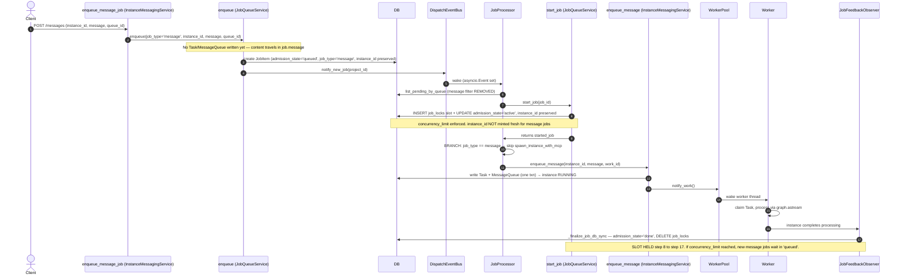

# Plan: Option B — Hybrid Path (Job Queue + Message Branching)

## Objective

Route message-type jobs through `JobQueueService.enqueue` (real slot-based concurrency enforcement via `job_locks`), then branch in `JobProcessor._process_next_job`: if `job_type == "message"`, route to `enqueue_message(existing_instance_id)` instead of `spawn_instance_with_mcp`. This makes the queue selector's `concurrency_limit` actually enforced for messages.

## Scope Assessment

**LARGE** — Touches 5 files across 3 layers (repository, service, processor), involves subtle state-machine interactions (D13 guard, admission_state lifecycle, slot locking), requires crash-recovery hardening, and changes the message dispatch timing model (deferred Task/MessageQueue creation). Estimated 1-2 days of focused development + testing.

---

## Architecture



### Key Architectural Insight (from exploration)

**Concurrency is enforced via `job_locks` slot-claims (INSERT OR IGNORE loop in `start_job_atomic_with_lock`), NOT via COUNT(*) queries.** The `job_type != "message"` filters in repository.py gate *dispatch visibility*, not slot accounting. Removing the dispatch filters makes message JobItems visible to `JobProcessor`, which routes them through `start_job_atomic_with_lock`, which acquires a `job_locks` slot — *that* is what makes them count toward `concurrency_limit`.

The existing COUNT queries (`count_active_jobs_by_project`, `has_active_non_deferred_work`, etc.) already have **NO** `job_type` filter — they already count message jobs. No change needed there.

---

## Current State Analysis

### How Messages Work Today (D13 / Job-as-Front-Primitive)

```
POST /messages → enqueue_message_job
  ├── _prepare_enqueued_message()     ← writes Task + MessageQueue NOW (instance → RUNNING)
  ├── job_repo.create(job_type='message')  ← JobItem mirror, bypasses enqueue (D13 guard)
  ├── job_repo.atomic_transition(QUEUED → ACTIVE)  ← EAGER FLIP (bypasses slot locking)
  ├── job_repo.stamp_message_id()
  └── worker_pool.notify_work()       ← wakes worker IMMEDIATELY (bypasses queue dispatch)
```

**Result**: Messages bypass ALL queue concurrency controls. The queue selector's `concurrency_limit` is a dead-letter for messages. Only per-instance `ExecutionGate` serialization is enforced.

### Why Messages Were Excluded (Defense-in-Depth)

Three layers prevent message JobItems from reaching the dispatch path:
1. **D13 guard** (`job_queue_service.py:603-607`) — `enqueue` rejects `job_type == "message"`
2. **Repository filters** (`repository.py:921, 945, 1022`) — dispatch queries exclude message type
3. **Eager activation** (`instance_messaging.py:1629-1635`) — message mirrors flipped to `'active'` immediately, so even if visible, the `WHERE admission_state = 'queued'` guard in `start_job_atomic_with_lock` rejects them

All three layers must be addressed for Option B.

---

## Task Breakdown

### Phase 1: Repository Layer — Remove Dispatch Filters

**File**: `daemon/repositories/job_queue/repository.py`

**Remove** the `.where(JobItem.job_type != "message")` filter from these 3 dispatch/fetch queries:

| Line | Method | Purpose | Action |
|------|--------|---------|--------|
| **921** | `list_pending_by_project` | Fetch pending jobs for a project | **REMOVE filter** |
| **945** | `list_all_pending` | Fetch all pending jobs system-wide | **REMOVE filter** |
| **1022** | `list_pending_by_queue` | Fetch pending jobs for a queue (used by JobProcessor) | **REMOVE filter** |

**KEEP** the filter at these 2 housekeeping queries (they protect cleanup cascades):

| Line | Method | Purpose | Why Keep |
|------|--------|---------|----------|
| **2315** | `batch_cancel_queued` | Bulk cancel via `POST /api/jobs/cleanup` | Cancelling message mirrors would desync them from their authoritative Task rows |
| **2355** | `find_active_jobs` | Find active jobs for destructive terminate cascade | Feeding message mirrors into the cascade would trigger destructive instance termination on a Task that has other live work |

**No-op queries** (already include messages — no change needed):
- `find_processing_jobs` (L952) — crash recovery, no filter
- `find_orphan_active_jobs` (L2380) — reaper, deliberately no filter
- `force_finalize_orphan` (L2476) — reaper finalize, no filter
- All COUNT queries (L523, L549, L583, L708) — no filter

**Tasks:**
1. Remove filter at L921 (`list_pending_by_project`)
2. Remove filter at L945 (`list_all_pending`)
3. Remove filter at L1022 (`list_pending_by_queue`)
4. Update docstrings at L905-908, L928-931, L1001-1004 to reflect new behavior
5. **Audit**: verify no other code path relies on these queries excluding messages (e.g., idle-gate predicates — see Risk R5)

---

### Phase 2: JobQueueService — Remove D13 Guard + Preserve instance_id

**File**: `daemon/services/job_queue_service.py`

#### Task 2.1: Remove D13 Guard (L603-607)

```python
# REMOVE this block:
if job_type == "message":
    raise ValueError(
        "enqueue_job no longer accepts job_type='message' — "
        "use enqueue_message instead (D13 architecture migration)"
    )
```

**Note**: The method is actually named `enqueue` (not `enqueue_job`) — the error message references the old name. After removal, `enqueue` accepts `job_type="message"`.

#### Task 2.2: enqueue — Accept & Store Metadata for Messages

The `enqueue` method signature already accepts `job_type` and `instance_id` parameters. For message jobs, the caller (`enqueue_message_job`) will pass:
- `job_type="message"`
- `instance_id=existing_instance_id` (the target instance)
- `message=message_text` (content travels in `job.message`)
- `metadata={"images": [...], "is_deferred": bool, "is_background": bool}` (extra fields for dispatch)

**Verify**: `enqueue` passes `metadata` through to `repository.create(job_metadata=metadata)` (L776-789). It does — no change needed here, just ensure the caller passes the right metadata.

#### Task 2.3: start_job — Preserve instance_id for Message Jobs

**File**: `daemon/services/job_queue_service.py`, around **L2741-2748**

Current code:
```python
# Generate instance_id: always mint a fresh UUID for the job's
# target instance. The legacy MESSAGE-specific branch that
# preserved an existing instance_id was removed; ...
instance_id = str(uuid.uuid4())
```

**Change to:**
```python
# Generate instance_id:
# - For message jobs: preserve the existing instance_id (the target instance)
# - For task jobs: mint a fresh UUID for the new instance
if job.job_type == "message" and job.instance_id:
    instance_id = job.instance_id  # preserve existing
else:
    instance_id = str(uuid.uuid4())  # fresh for new instances
```

**Why**: Message jobs target an EXISTING instance. The `enqueue_message_job` caller sets `instance_id` on the JobItem. `start_job` must NOT overwrite it with a fresh UUID (which would point at a non-existent instance and break the Task↔JobItem↔Instance linkage).

**Idempotency note**: `start_job_atomic_with_lock` receives `instance_id` as a parameter and writes it in the UPDATE (`SET instance_id = :instance_id`). Since the JobItem already has the correct `instance_id` (set by `enqueue`), and `start_job` passes that same value, the write is idempotent.

#### Task 2.4: start_job — Skip Instance-Status Checks for Messages

**Around L2698-2738**: The existing code checks `job.instance_id` against instance status (terminal → clear ref; PAUSED → return None). For message jobs:
- If the instance is **PAUSED**, we should still skip dispatch (return None) — correct behavior, keep as-is.
- If the instance is **TERMINAL**, the message can't be delivered — `start_job` should return None or mark FAILED. The existing terminal-clears-ref logic (L2720-2733) would clear the instance_id, which is WRONG for messages (we want to FAIL, not re-spawn). **Add a guard**: if `job.job_type == "message"` and instance is terminal, return None (let the queue retry or dead-letter).

**Tasks for Phase 2:**
1. Remove D13 guard (L603-607)
2. Add instance_id preservation for message jobs in `start_job` (L2741-2748)
3. Add terminal-instance guard for message jobs in `start_job` (L2698-2738)
4. Update docstrings/comments referencing D13 guard removal

---

### Phase 3: InstanceMessagingService — Redirect enqueue_message_job

**File**: `daemon/services/instance_messaging.py`

#### Task 3.1: Refactor `enqueue_message_job` (L1275-1696)

**Current flow** (5 steps):
1. Write Task + MessageQueue via `_prepare_enqueued_message` (L1355-1370)
2. Emit SSE status_change (L1372-1378)
3. Title generation (L1380-1383)
4. Create JobItem mirror via `job_repo.create` + eager flip + stamp_message_id (L1385-1677)
5. `worker_pool.notify_work()` (L1683)

**New flow** (3 steps):
1. Resolve queue_id (existing logic from L1466-1583 — keep this)
2. Call `self._manager._job_queue_service.enqueue(...)` with message job params
3. Return adapted `AsyncMessageResult`

```python
async def enqueue_message_job(
    self,
    instance_id: str,
    message: str,
    source: str = "api",
    priority: int = 1,
    images: list[str] | None = None,
    metadata: dict[str, Any] | None = None,
    *,
    is_deferred: bool = False,
    is_background: bool = False,
    queue_id: str | None = None,
) -> "AsyncMessageResult":
    # --- Step 1: Resolve queue_id (reuse existing logic) ---
    # [Keep the project_id resolution (L1417-1464) and queue_id
    #  resolution (L1466-1583) logic as-is]

    # --- Step 2: Enqueue via JobQueueService (real concurrency enforcement) ---
    job_item = await self._manager._job_queue_service.enqueue(
        agent_id=resolved_agent_id,        # from instance lookup
        message=message,
        source=source,
        project_id=project_id_for_job,     # from instances.project_id (W1 security fix)
        priority=priority,
        metadata={
            **(metadata or {}),
            "images": images or [],
            "is_deferred": is_deferred,
            "is_background": is_background,
        },
        queue_id=queue_id_for_job,
        job_type="message",
        instance_id=instance_id,           # PRESERVE existing instance
    )

    # --- Step 3: Return adapted result ---
    return AsyncMessageResult(
        message_id=None,         # not yet created — created at dispatch time
        instance_id=instance_id,
        status="queued",         # waiting for slot
        job_id=job_item.job_id,
    )
```

#### Task 3.2: Remove Dead Code

Remove these from `enqueue_message_job` (they now happen at dispatch time in `enqueue_message`):
- `_prepare_enqueued_message` call (Task + MessageQueue creation) — **MOVED to dispatch time**
- SSE status_change emit — **MOVED to dispatch time** (inside `enqueue_message`)
- Title generation — **MOVED to dispatch time** (inside `enqueue_message`)
- `job_repo.create` direct call — **REPLACED by `enqueue`**
- `job_repo.atomic_transition(QUEUED → ACTIVE)` eager flip — **REMOVED** (let `start_job_atomic_with_lock` do it properly)
- `job_repo.stamp_message_id` — **MOVED to dispatch time** (after Task is created)
- `worker_pool.notify_work()` — **REMOVED** (no Task exists yet; dispatch happens via JobProcessor)

#### Task 3.3: `enqueue_message` — Stamp message_id on JobItem

**File**: `daemon/services/instance_messaging.py`, in `enqueue_message` (L1140-1253)

After `_prepare_enqueued_message` creates the Task (with `work_id`), add a best-effort call to stamp the `message_id` onto the JobItem for cross-system correlation:

```python
# After ctx = await asyncio.to_thread(self._prepare_enqueued_message, ...)
# Best-effort: stamp message_id onto the JobItem mirror for correlation
if ctx.work_id:
    try:
        await asyncio.to_thread(
            self._manager._job_queue_service._repository.stamp_message_id,
            ctx.work_id,       # job_id == work_id (shared UUID)
            ctx.message_id,
        )
    except Exception:
        logger.debug(f"Failed to stamp message_id on job {ctx.work_id}", exc_info=True)
```

**Note**: This is the same pattern already used in `_process_next_job` for task jobs (L1059-1069). Non-fatal on failure.

**Tasks for Phase 3:**
1. Refactor `enqueue_message_job` to call `enqueue` (3-step flow)
2. Remove dead code (Task/MessageQueue creation, eager flip, notify_work, SSE, title gen)
3. Add message_id stamping in `enqueue_message`
4. Update `AsyncMessageResult` return (status="queued", message_id=None until dispatch)
5. **Verify**: manager wrapper `InstanceManager.enqueue_message_job` still forwards all kwargs correctly (known gotcha: missing kwarg → TypeError in router→manager→service flow)

---

### Phase 4: JobProcessor — Add Message Branch

**File**: `daemon/services/job_processor.py`

#### Task 4.1: Add Branch in `_process_next_job`

**Location**: After `start_job` succeeds (around **L1017**), before `spawn_instance_with_mcp` (L1018-1023).

Current code:
```python
# L995: started_job = await self._queue_service.start_job(job.job_id)
# ...
# L1018:
try:
    instance_id = await self._instance_manager.spawn_instance_with_mcp(
        agent_id=job.agent_id,
        instance_id=started_job.instance_id,
        project_id=job.project_id,
    )
```

**New code:**
```python
# L995: started_job = await self._queue_service.start_job(job.job_id)
# ...

# === MESSAGE BRANCH (Option B) ===
if job.job_type == "message":
    # Message jobs target an EXISTING instance — skip spawn, route to enqueue_message
    try:
        # Extract metadata stored at enqueue time
        job_meta = job.job_metadata or {}
        result = await self._instance_manager.enqueue_message(
            instance_id=started_job.instance_id,  # == job.instance_id (preserved by start_job)
            message=job.message,
            source=job.source,
            images=job_meta.get("images"),
            metadata=job_meta,
            is_deferred=job_meta.get("is_deferred", False),
            is_background=job_meta.get("is_background", False),
            work_id=job.job_id,  # links Task.work_id == JobItem.job_id
        )
        # Best-effort: stamp message_id onto JobItem for correlation
        if result.message_id:
            try:
                await asyncio.to_thread(
                    self._queue_service._repository.stamp_message_id,
                    job.job_id,
                    result.message_id,
                )
            except Exception:
                logger.debug(f"stamp_message_id failed for {job.job_id}", exc_info=True)
    except Exception as e:
        logger.error(f"Failed to enqueue message for job {job.job_id}: {e}")
        await self._queue_service.complete_job(
            job.job_id, demand_state=DemandState.FAILED, error=str(e)
        )
        self._cleanup_in_progress_tracking(job.job_id)
    continue  # fire-and-forget — observer handles completion

# === TASK PATH (existing) ===
try:
    instance_id = await self._instance_manager.spawn_instance_with_mcp(
        agent_id=job.agent_id,
        instance_id=started_job.instance_id,
        project_id=job.project_id,
    )
# ... rest of existing task path
```

#### Task 4.2: Key Behavioral Notes

- **Fire-and-forget**: After `enqueue_message` returns, `_process_next_job` moves on. It does NOT wait for the instance to finish processing. Completion is observed by `JobFeedbackObserver` (existing pattern for task jobs).
- **No `complete_job` on success**: The observer owns terminal transitions. Only call `complete_job(FAILED)` on `enqueue_message` failure.
- **Lock release is automatic**: The observer's `_finalize_job_db_sync` releases the `job_locks` slot when the instance finishes (`DELETE FROM job_locks WHERE instance_id = ?`).
- **`started_job.instance_id` == `job.instance_id`** for message jobs (Phase 2 ensures preservation). Either can be used; using `started_job.instance_id` is consistent with the task path.

**Tasks for Phase 4:**
1. Add message branch in `_process_next_job` (after start_job, before spawn)
2. Extract metadata (images, is_deferred, is_background) from `job.job_metadata`
3. Add error handling (complete_job FAILED on enqueue_message failure)
4. Update D13 comment block at L1007-1015

---

### Phase 5: Crash Recovery Hardening

**File**: `daemon/services/job_recovery_service.py`

#### The Crash Window

```
start_job succeeds (slot acquired, JobItem='active', instance_id set)
    ↓ CRASH HERE ↓
enqueue_message (Task + MessageQueue not yet created)
```

If the daemon crashes in this window:
- JobItem is `admission_state='active'`, `instance_id` set
- **No Task row exists** (Task is created by `enqueue_message`, which didn't run)
- **No MessageQueue row exists**
- The instance is still in its pre-message state (IDLE/WAITING_CHILDREN)

**Current recovery behavior** (`JobRecoveryService.recover_on_startup`):
- Finds the active JobItem
- Finds the instance alive (IDLE)
- Leaves job as PROCESSING — "observer will pick up"
- **BUT**: the observer waits for instance completion, which never happens (no Task → no work → no completion event)
- **Result**: Job stuck in `active` forever until stale timeout

#### Task 5.1: Add Task-Existence Check for Message Jobs

In `JobRecoveryService.recover_on_startup`, for active message jobs, check if a Task with `work_id == job_id` exists:

```python
# For each recovered job:
if job.job_type == "message":
    # Check if the Task was created (i.e., enqueue_message ran)
    task_exists = await self._task_repo.find_by_work_id(job.job_id)
    if not task_exists:
        # Crash happened between start_job and enqueue_message
        # Reset to 'queued' for re-dispatch
        logger.warning(
            f"Message job {job.job_id} is active but has no Task — "
            f"resetting to queued for re-dispatch"
        )
        await self._job_queue_service._repository.atomic_transition(
            job.job_id,
            from_admission_state="active",
            to_admission_state="queued",
        )
        # Release the slot lock so re-dispatch can re-acquire it
        await self._lock_repo.release_by_job(job.job_id)
        continue
```

**Note**: `atomic_transition` with `from_admission_state='active', to_admission_state='queued'` is a supported transition (used by `rearm_with_lock` for the F9 orphan-race fix). The `rearm_with_lock` method (repository.py:1937+) is the race-safe variant — prefer it over bare `atomic_transition`.

**Tasks for Phase 5:**
1. Add Task-existence check in `JobRecoveryService` for message jobs
2. Reset orphaned message jobs to `queued` + release slot lock
3. Add test for crash recovery scenario

---

### Phase 6: Testing

#### Existing Tests to Update

| Test Area | What Changes | Action |
|-----------|-------------|--------|
| D13 guard tests | Guard removed — `enqueue` now accepts `job_type="message"` | Remove/update tests asserting ValueError |
| Dispatch filter tests | Filters removed from 3 queries | Update tests asserting messages excluded |
| `enqueue_message_job` tests | No longer creates Task/MessageQueue directly; calls `enqueue` instead | Rewrite to verify `enqueue` is called with correct params |
| `enqueue_message_job` tests | No longer calls `worker_pool.notify_work()` | Remove assertion |
| `enqueue_message_job` tests | No longer eagerly flips to `active` | Remove assertion |
| `start_job` tests | Preserves `instance_id` for message jobs | Add test case |

#### New Tests Required

| # | Test | What It Validates |
|---|------|-------------------|
| 1 | **Concurrency enforcement** | Queue N+1 messages to same queue (concurrency_limit=N); only N run concurrently; N+1th waits in `queued` |
| 2 | **Content delivery** | Message text arrives in `MessageQueue.content` after dispatch; Task created with correct `work_id` |
| 3 | **`_process_next_job` message branch** | Message jobs route to `enqueue_message`, not `spawn_instance_with_mcp` |
| 4 | **instance_id preservation** | Message job's `instance_id` is NOT overwritten by `start_job`; matches target instance |
| 5 | **Metadata passthrough** | `images`, `is_deferred`, `is_background` flow from `enqueue_message_job` → JobItem.metadata → `enqueue_message` |
| 6 | **Crash recovery (active, no Task)** | Active message job with no Task → reset to `queued` + slot released |
| 7 | **Crash recovery (active, Task exists)** | Active message job WITH Task → left as-is (observer handles) |
| 8 | **Slot release on completion** | After instance finishes, `job_locks` row deleted (slot freed) |
| 9 | **Terminal instance guard** | Message job targeting terminal instance → `start_job` returns None (not re-spawned) |
| 10 | **batch_cancel_queued still excludes messages** | L2315 filter intact — cleanup doesn't cancel message mirrors |
| 11 | **find_active_jobs still excludes messages** | L2355 filter intact — destructive cascade doesn't hit message mirrors |
| 12 | **FIFO queue serialization** | Messages to FIFO queue (concurrency_limit=1) run strictly sequentially |

#### Test Database

**CRITICAL**: Run tests against PostgreSQL (not just SQLite). The `start_job_atomic_with_lock` uses dialect-branched SQL (`INSERT OR IGNORE` for SQLite, `ON CONFLICT DO NOTHING` for PostgreSQL), and the PG trigger `trg_job_locks_active_guard` requires both writes visible at COMMIT. SQLite-only testing would miss PG-specific concurrency bugs.

---

## Coupling Assessment

All phases have **tight coupling** — they must be deployed together. Mid-states are broken:

| Mid-State | Why Broken |
|-----------|-----------|
| P1 only (filters removed, D13 guard remains) | `enqueue_message_job` still bypasses `enqueue`; no message JobItems in `queued` state; no behavioral change |
| P1+P2 (filters removed, guard removed) | `enqueue_message_job` still uses old path (job_repo.create + eager flip); message mirrors are `active`, not `queued`; dispatch queries won't see them |
| P1+P2+P3 (enqueue redirected) | JobItem is `queued` but `_process_next_job` has no message branch → would try `spawn_instance_with_mcp` on existing instance → error |
| P1+P2+P3+P4 (branch added) | **Working state** — but crash recovery gap exists |
| P1+P2+P3+P4+P5 (recovery hardened) | **Complete** |

**Deployment**: Single coordinated deployment. Code changes can be sequenced for review (P1→P2→P3→P4→P5) but must merge as one unit.

---

## Risks & Mitigations

| # | Risk | Impact | Likelihood | Mitigation |
|---|------|--------|-----------|------------|
| **R1** | **Crash between start_job and enqueue_message** — active message job with no Task, stuck forever | High | Low (narrow async window) | Phase 5: `JobRecoveryService` checks Task existence, resets to `queued` |
| **R2** | **instance_id overwrite** — `start_job` mints fresh UUID, detaching JobItem from instance | High | Prevented by design | Phase 2.3: preserve `instance_id` for message jobs |
| **R3** | **Double dispatch** — old path (notify_work) + new path (JobProcessor) both fire | High | Prevented by design | Phase 3.2: remove `worker_pool.notify_work()` from `enqueue_message_job` |
| **R4** | **Frontend UX change** — instance stays IDLE until slot acquired (was: immediately RUNNING) | Medium | Certain (behavioral change) | API returns `status="queued"`; frontend should show queued state. Assess if UI update needed. |
| **R5** | **Idle-gate predicate behavior change** — `list_all_pending` now includes messages; consumers (`maintenance.py:323`, `job_queue_service.py:2355, 2640`) may behave differently | Medium | Possible | Audit all consumers of `list_all_pending` and `list_pending_by_project` for semantic dependence on message exclusion |
| **R6** | **Message delivery latency increase** — messages now wait for slot acquisition + dispatch event (was: immediate) | Low-Medium | Certain (by design) | This is the intended trade-off: concurrency control ↔ slight latency. DispatchEventBus provides near-instant wake. |
| **R7** | **PG trigger `trg_job_locks_active_guard`** — requires `job_locks` row AND `admission_state='active'` visible at COMMIT | High | Low (existing design) | No change needed — `start_job_atomic_with_lock` already does both writes in one transaction |
| **R8** | **`system_parallel_queue` concurrency discrepancy** — migration seeds limit=3, runtime creates limit=5 | Low | Legacy DBs only | Document; trust runtime value (5). Not in scope for this refactor. |
| **R9** | **Per-instance ExecutionGate + queue concurrency interaction** — two serialization layers may cause unexpected blocking | Medium | Possible | The ExecutionGate serializes messages to the SAME instance (asyncio.Lock). Queue concurrency limits TOTAL messages across instances. They compose correctly: queue limits breadth, gate limits depth. Verify with integration test. |
| **R10** | **Existing in-flight message mirrors** — at deploy time, active message JobItems created by old path (eager 'active') exist in DB | Medium | Possible | Recovery queries already handle active message jobs. Old mirrors will finalize normally via observer. No migration needed. |

---

## Success Criteria

- [ ] `concurrency_limit` is enforced for message jobs (test: N+1 messages, only N concurrent)
- [ ] Message content is delivered correctly (Task + MessageQueue created at dispatch time)
- [ ] Existing instance is reused (no new instance spawned for messages)
- [ ] `job_locks` slot is released on instance completion (slot freed for next message)
- [ ] Crash recovery handles the start_job→enqueue_message gap (reset to queued)
- [ ] `batch_cancel_queued` and `find_active_jobs` still exclude message mirrors (cleanup safety)
- [ ] FIFO queue serialization works for messages (concurrency_limit=1 → strict order)
- [ ] All existing tests pass (after updating D13/dispatch-filter/enqueue_message_job tests)
- [ ] Tests pass on PostgreSQL (not just SQLite)

---

## Files Changed Summary

| File | Changes | Phase |
|------|---------|-------|
| `daemon/repositories/job_queue/repository.py` | Remove 3 dispatch filters (L921, L945, L1022); update docstrings | P1 |
| `daemon/services/job_queue_service.py` | Remove D13 guard (L603-607); preserve instance_id in start_job (L2741-2748); terminal guard for messages | P2 |
| `daemon/services/instance_messaging.py` | Refactor `enqueue_message_job` to call `enqueue`; remove dead code; add message_id stamping in `enqueue_message` | P3 |
| `daemon/services/job_processor.py` | Add message branch in `_process_next_job` (after start_job, before spawn) | P4 |
| `daemon/services/job_recovery_service.py` | Add Task-existence check for active message jobs; reset orphans to queued | P5 |

**No new columns needed** — `job_metadata` (JSON) already exists on JobItem and is used to store `images`, `is_deferred`, `is_background`. No `_ensure_postgres_columns()` changes required.

**No migrations needed** — no schema changes.

---

## Tracking

- **Created**: 2026-07-25
- **Last Updated**: 2026-07-25
- **Status**: draft
- **Scope**: LARGE
- **Estimated Time**: 1-2 days (development + testing)
