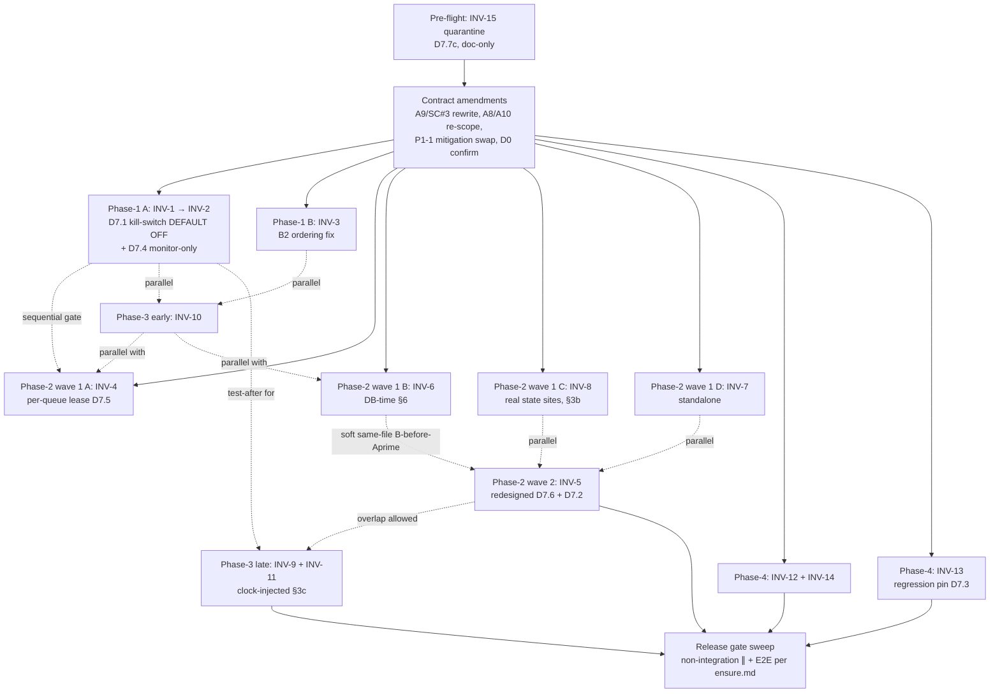

# Plan Overview: Schedule Feature Review & Improvement (Cycle 2)

Date: 2026-08-24
Author: planner[v2] via plan-creation worker
Branch: `feature/schedule-review-improve` @ `46349698` (v0.11.0)
Status: Ready for Review (Phase-Plan Workers Dispatch Pending)

---

## Amendment Log (2026-08-24)

**Architect review verdict**: **PLAN APPROVED WITH MANDATORY AMENDMENTS** — 4 blocking rewrites required before Phase-1 dispatch. Full review at `.agents/shared/planning/schedule-review-improve/architecture-recommendation.md`.

**Three leader rulings** (supersede architect doc where they conflict):

1. **INV-13 → verify-and-document + regression pins** (architect §2c option (a) confirmed). `cancel_task` / `complete_task` / `fail_task` are **already migrated** — pin that state with regression tests; document. Keep 15/15 honest. D2's ≤4-LOC ceiling and first-site hard-exit gate are **MOOT**.
2. **D0 → `reason='failed'`** (NOT adding `orphaned_no_task` to `_STATUS_CANONICAL_MAP`). Dissolves the D↔A′ semantic coupling.
3. **INV-1 → outer-handler tightening + `JOB_PROCESSOR_RAISE_ON_ERROR` env kill-switch, DEFAULT OFF**. Demo-env 10-min observation replaces non-existent load-shadow replica (dev=8079 / demo=7979 / live=9797 topology; no replica). Per-job_id 30s rate-cap + per-processor global ~100/min cap.

**Pointer**: All amendments are codified in `decisions.md` §D7 (Architect Amendment Batch, 2026-08-24) — D7.1 through D7.7 with **PINNED** numbering. Phase-plan workers (W2: phase1 + phase3; W3: phase2 + phase4) cite D7 sub-decisions by these exact numbers. Where D2 / D3 / D4 / D6 conflict with D7, **D7 wins**.

**Corrected execution order** (per architect §7, 10 steps): see [Phase Index](#phase-index-amended) below.

---

## Objective

Eliminate 15 live defects across the job-queue, task-repository, and source-adapter subsystems that surfaced in Cycle-2 code review, restoring operator signal on orphaned jobs, hardening queue/repo reliability under load, filling test gaps on critical recovery paths, and cleaning up deferred technical-debt items from earlier phases — without expanding scope beyond those 15 items.

---

## Scope

### In Scope
- **Bug fixes** for silent-failure and restart-storm root causes (Tier P1, INV-1..3).
- **Reliability hardening** for race windows, time-convention skew, status derivation, and circuit-breaker invariants (Tier P2, INV-4..8).
- **Test coverage** for orphan-recovery, rate-limiter, and adapter-error paths (Tier P3, INV-9..11).
- **Cleanup** of dead code, deferred migrations, docstring drift, and the broken mock harness (Tier P4, INV-12..15).
- All work lands on branch `feature/schedule-review-improve` (workdir = current workdir).

### Out of Scope
- **TestAccessMemoryArchive 5 quarantined failures** (memory/archive subsystem; separate fix per `.agents/tester/QUARANTINE.md`).
- **New features** beyond the 15 inventoried items — no scope creep into reschedule-engine rewrites, observability dashboards, or new adapters.
- **Cycle-1 schedule-feature fixes** (`.agents/shared/planning/schedule-improve/`) — those issues are already merged; this plan explicitly does not re-litigate them.
- **Cross-cycle follow-ups** to `defer-seam-bugfix`, `turn-reconciler-migration`, etc. — INV-13 picks up the deferred named-transition stubs that those cycles parked, but is bounded to that surface.
- **Performance / load testing beyond existing packs** — re-using the established `concurrency_atomic_unit_test` and `e2e_workflows_ensure_test` packs.

### Surface Note
- INV-5 + INV-13 both touch `reconcile_turn_mirror`-derived machinery but in different mechanisms. Per D7.7(b), the INV-5→INV-13 sequential gate is **DISSOLVED** (INV-13 call-sites are already migrated per D7.3). The cross-cutting constraint is now a **vocabulary freeze** (named-transition + post-commit-reconcile) that must be defined BEFORE both — not a sequence dependency. See `decisions.md §D7.7(b)` + `§D7.3`.

---

## Phase Index (Amended)

Per architect §7 corrected execution order (10 steps). Pre-flight is a NEW node hoisted ahead of all phase work.

| Phase / Step | Name | Tier | Objective | Issues | Coupling | Parallelizable Sub-Slices |
|--------------|------|------|-----------|--------|----------|---------------------------|
| **Pre-flight** | **INV-15 Quarantine** | P4 (doc-only) | Remove false-PASSING `mock_job_queue_test` from gate pipeline (D7.7(c)) | INV-15 | independent of all phases | single doc edit; precedes ALL gate runs |
| **1** | Fix Bugs (P1) | P1 | Restore operator signal; stop restart storm; redesign orphan-recovery as monitor-only + rewrite A9 (D7.4) | INV-1, INV-2, INV-3 | tight (INV-1→INV-2 same handler); INV-3 source-layer orthogonal | INV-3 ⟂ (INV-1→INV-2) — parallel worker dispatch per D7.7 |
| **2 (wave 1)** | Harden Reliability — P2 round 1 | P2 | Per-queue lease (INV-4, D7.5); DB-time convention (INV-6, §6); circuit-breaker real sites + sibling-failure invariant (INV-8, §3b); INV-7 standalone | INV-4, INV-6, INV-7, INV-8 | tight (INV-1→INV-4 sequential gate); INV-6 ⟂ INV-4 ⟂ INV-8 ⟂ INV-7 (parallel wave 1) | INV-4 ∥ INV-6 ∥ INV-8 ∥ INV-7 — staggered `concurrency_atomic_unit_test` runs per D7.7(d) |
| **2 (wave 2)** | Harden Reliability — INV-5 redesigned | P2 | Task↔JobItem reconciliation via named-transition + post-commit reconcile + SKIP-LOCKED sweep (D7.6); uses `reason='failed'` (D7.2) | INV-5 | soft same-file B-before-A′ order (INV-6 before INV-5); vocabulary frozen before both (D7.7(b)) | W3 worker; soft B-before-A′ order only |
| **3 (early)** | Test Coverage — rate-limiter stress | P3 | INV-10 rate-limiter stress (parallel from Phase 1 onward) | INV-10 | independent of all phases | runs ∥ Phase 1 + Phase 2 wave 1 |
| **3 (late)** | Test Coverage — orphan-recovery + adapter error paths | P3 | INV-9 + INV-11 (clock-injected contracts per §3c) | INV-9, INV-11 | INV-9 after Phase 1 closes; INV-11 after Phase 1 closes | W2 worker; may overlap Phase 2 wave 2 |
| **4** | Clean Up (P4) | P4 | INV-12 dead-overload removal (D6 confirmed safe); INV-14 trivial; INV-13-**as-verification** + regression pin (D7.3) | INV-12, INV-13, INV-14 | INV-12 ∥ INV-14; **INV-13 gate DISSOLVED** (D7.7(b)) | INV-12 + INV-14 ∥ INV-13 (regression pin) |
| **Release** | Final gate sweep | — | Full non-integration packs in parallel + E2E one-by-one per `ensure.md` | all | — | one-by-one per `ensure.md` |

### Corrected Dependency Graph (per architect §7)

**Text-form dependency graph (linear, 10 steps per §7):**

1. Pre-flight (INV-15 quarantine, D7.7(c)) → 2. Contract amendments (A9/SC#3, A8/A10, P1-1, D0) → **3.** Phase-1 A (INV-1 → INV-2) **∥ 4.** Phase-1 B (INV-3) **∥ 5.** Phase-3 early (INV-10) → 6. Phase-2 wave 1 (INV-4 ∥ INV-6 ∥ INV-8 ∥ INV-7) → 7. Phase-2 wave 2 (INV-5 redesigned; soft B-before-A′) → 8. Phase-3 late (INV-9 + INV-11; may overlap 6-7) → 9. Phase-4 (INV-12 + INV-14 ∥ INV-13-as-verification) → 10. Release-gate sweep (full non-integration ∥ + E2E per `ensure.md`).

---

## Coupling Map (Amended)

|         | Pre-flight | Phase 1 | Phase 2 wave 1 | Phase 2 wave 2 | Phase 3 early | Phase 3 late | Phase 4 | Release |
|---------|-----------|---------|----------------|----------------|---------------|--------------|---------|---------|
| Pre-flight | — | independent (doc precedes dispatch) | independent | independent | independent | independent | independent | runs first |
| Phase 1 | dependent (precedes dispatch) | — | INV-1 → INV-4 sequential gate | independent | parallel with both 1A + 1B | test-after for INV-9/INV-11 | independent | runs after 1 |
| Phase 2 wave 1 | dependent | sequential (INV-1 precedes INV-4) | — | soft same-file B-before-A′ (INV-6 → INV-5); INV-8 ∥ INV-7 parallel with INV-5 | parallel (no INV-10 surface) | may overlap | independent | runs after 2-wave-1 |
| Phase 2 wave 2 | dependent | independent | soft B-before-A′ | — | independent | overlap allowed | vocabulary freeze (D7.7(b)) | runs after 2-wave-2 |
| Phase 3 early | dependent | parallel | parallel (no overlap with INV-10 surface) | independent | — | test-after mix split (D5) | independent | runs after 3-early |
| Phase 3 late | dependent | test-after (closes Phase 1) | independent | overlap allowed | parallel (D5 split) | — | independent | runs after 3-late |
| Phase 4 | dependent | independent | independent | INV-13 **gate DISSOLVED** (D7.7(b)) | independent | independent | — | runs after 4 |
| Release | runs after pre-flight | test-after validation | test-after validation | test-after validation | parallel | parallel | test-after validation | — |

### Key Couplings (verbal, amended)

- **Pre-flight (NEW node, D7.7(c))**: doc-only `QUARANTINE.md` row + `mock_job_queue_test.sh` QUARANTINED marker. Must precede **all phase gate runs** — the pack currently statically false-PASSes (exit 0 with `pytest.main` exit code swallowed at `mock_test_job_queue_api.py:1027`). Pre-flight also fixes `phase1-plan`'s false "already quarantined" claim (the row does not exist until pre-flight creates it).
- **INV-1 → INV-2 (intra-phase)**: Same `job_processor.py` ACTIVE-loop block (lines 1263-1271 → 945-979). Fix the silent swallow first so a fixed recovery path doesn't itself silently fail. **INV-2 primary = monitor-only** (D7.4) — no production behavior change; W1-skip → `recover_on_startup` (DELETE-lock + UPDATE-state atomic) is the documented fallback.
- **INV-1 → INV-4 (inter-phase)**: INV-1 fix removes masking; INV-4 redesigned per-queue lease (D7.5) enlarges the `job_processor.py` diff; keep the A5 gate.
- **INV-6 → INV-5 critical-path DISSOLVED (D7.7(a))**: stated rationale ("the resume-time sweep reuses the same age predicate that INV-6 SQL-ifies", `phase2-plan.md:65`) was never true — A′3's own spec is an age-free NOT-EXISTS (`:133`); the *redesigned* INV-5 needs no `_age_seconds_sql`. Keep only the **soft same-file B-before-A′ order** inside the repo-worker (B before A′).
- **INV-5 → INV-13 gate DISSOLVED (D7.7(b))**: premise false per D7.3 — INV-13 sites already migrated. Replaced by: **named-transition + post-commit-reconcile vocabulary frozen before both** (no sequence dependency).
- **D↔A′ semantic coupling DISSOLVED by D7.2**: the INV-5 sweep uses `reason='failed'` (already canonical); `orphaned_no_task` is NOT added to `_STATUS_CANONICAL_MAP`. Sweep never surfaces a state value absent from the canonical map — no coupling with INV-7 D3(a) test list.
- **INV-2 ↔ INV-9 (cross-tier)**: Both manage message-job orphans from different vantages (recovery vs. PENDING-message startup). Verify together to keep the W1-skip rationale coherent.
- **INV-3, INV-8, INV-10, INV-11 (source-layer cluster)**: Fully orthogonal to the job-queue work. These four can be implemented by the same worker without touching `daemon/services/job_processor.py` or `daemon/repositories/task/repository.py`.
- **INV-6 (DB-time convention)**: Couples `list_pending_tasks_older_than`, `update_heartbeat`, `find_stale_running_tasks`, `reset_stale_tasks` — single unit; do NOT split across workers.
- **Vocabulary freeze (NEW, D7.7(b))**: named-transition + post-commit-reconcile vocabulary must be frozen **before both INV-5 (Phase 2 wave 2) and INV-13 (Phase 4)** — replaces the dissolved INV-5→INV-13 sequential gate.

---

## Risks (Amended)

| # | Risk | Impact | Likelihood | Mitigation |
|---|------|--------|------------|------------|
| 1 | INV-1 fix surfaces hidden failures previously swallowed; system may emit a flush of ERROR logs at deploy | High | Medium | Wrap fix with rate-limited logger (per-job_id 30s + per-processor ~100/min cap per D7.1); `JOB_PROCESSOR_RAISE_ON_ERROR` kill-switch **DEFAULT OFF** (D7.1); demo-env 10-min observation + stable queue depth + per-job_id error rate ≤ 2× baseline gate (D7.1) — replaces the non-existent load-shadow replica |
| 2 | **INV-2 monitor-only residual risk (D7.4)**: monitor-only primary leaves the orphan-recovery bypass **unfixed in production** (observation only); orphans recovered at boot via `recover_on_startup` if fallback adopted | Medium | Medium | Documented residual (architect §9); accepted by D4/D7.4; monitor counters inform future fallback adoption decision. A8 re-scoped to counter-volume observation (D7.4) — p99-RT benchmark invalid for monitor-only |
| 3 | INV-13 (Turn-Reconciler 4b/4c) is migration-shaped — was a risk under D2 (≤4-LOC ceiling + first-site hard-exit); **DISSOLVED by D7.3** (sites already migrated; re-scoped to verify-and-document + regression pin) | — | — | D2 superseded by D7.3; real deferred items (`_finalize_job_db_sync`, `_terminate_instance_db_sync`, `force_cancel_and_schedule_retry`, `_status_write_guard`) stay Cycle-3 to avoid INV-12 same-file conflict via `test_observer_race1.py:91-119` |
| 4 | **INV-15 mock harness 48/48 setup-error** — pack statically false-PASSes today (`exit 0` + swallowed `pytest.main` exit code) | High | High | **D7.7(c)**: hoist to **cycle pre-flight**. `QUARANTINE.md` row + `mock_job_queue_test.sh` QUARANTINED marker must precede ALL phase gate runs. Operator-visible **PACKS.md:346 FAIL-vs-exit-0 inconsistency** persists until pre-flight lands |
| 5 | Phase-3 testing as test-after for Phases 1-2 risks "tests chase implementation"; the three tiers must validate independently | Medium | Medium | `decisions.md §D5`: MIX approach — INV-9 reads INV-1/INV-2 commit, INV-11 reads INV-3 commit, INV-10 has no dependency; tests authored by separate test-worker that reads diff post-merge. D7.7(e) confirms two-wave structure holds |
| 6 | E2E gate per `ensure.md` adds 280s+ to every phase that touches `job_processor` / `reconcile_turn_mirror` / `job_locks` — could double cycle wall-clock | Medium | High | Run E2E in parallel with non-E2E packs where possible; release gate only for big/critical change scopes (per `ensure.md`); emphasize Core gate for most phases; **stagger `concurrency_atomic_unit_test` runs across parallel sub-slices** (D7.7(d), 4-way contention) |
| 7 | Branch `feature/schedule-review-improve` may have grown cycle-1 changes that conflict with this cycle's edits | Low | Low | Re-verify branch HEAD before each phase-plan worker dispatch; resolve any silent merge conflicts early |
| 8 | **INV-5 redesign diff size (architect §9)**: named-transition sweep is a **larger** change than the plan's raw-UPDATE version — but it is the *correct* size; raw-UPDATE version was smaller only by externalizing cost to mirror-table staleness and watcher deadlocks | Medium | High | Accept the larger diff; raw-UPDATE forbidden by D7.6 (no MIRROR_SET bypass; no in-transaction reconcile; no sweep without `emit_terminal`). Path-typo correction: idle-gates at `task/repository.py:2199, 2430` (NOT-EXISTS `:2519-2570`), NOT `instance_lifecycle.py:2474-2518` |
| 9 | **Session-TZ invariant holds by accident** (architect §6) until `SET TIME ZONE 'UTC'` lands at connection time — INV-6 DB-side `now()` ages are correct under the current daemon-local rendering frame, but the invariant is load-bearing without contractual enforcement | Low | Low | Document the invariant at `_age_seconds_sql` helper (architect §6 recommendation); assert non-`Decimal` returns in B6 test matrix; `SET TIME ZONE 'UTC'` is recommended but optional in this cycle |

---

## Success Criteria (Amended)

| # | Criterion | How to Measure | Threshold |
|---|-----------|----------------|-----------|
| 0 | **Pre-flight (D7.7(c))**: `QUARANTINE.md` row for `mock_job_queue_test` exists + pack marked QUARANTINED in `mock_job_queue_test.sh` BEFORE any phase gate run | git diff against `latest` for `.agents/tester/QUARANTINE.md` + `test/packs/mock_job_queue_test.sh`; verify file mtimes | `QUARANTINE.md` row exists at first phase-gate trigger; absence is a Release-gate BLOCK |
| 1 | All 15 inventoried issues are addressed (fixed, hardened, tested, or cleaned-up per tier spec) | Diff against `feature/schedule-review-improve` HEAD; per-phase close-out notes | 15/15 closed (deferred items cite `decisions.md` §D7.3 for INV-13's real Cycle-3 tail) |
| 2 | INV-1 silent-swallow is gone — no `except Exception: pass` in `job_processor.py:1263-1271` block; outer-handler at `_process_loop:653-654` tightened (counter + DLQ marker); `JOB_PROCESSOR_RAISE_ON_ERROR` kill-switch DEFAULT OFF (D7.1) | grep for the swallow idiom; targeted unit test asserting outer-handler counter increments + kill-switch behavior | 0 matches in the named block; env kill-switch default OFF verified |
| 3 | **REWORDED per D7.4**: INV-2 message-job recovery uses monitor-only primary; W1-skip fires for `job_type='message'` ACTIVE orphans; `recover_on_startup → reset_active_to_queued` (`job_queue/repository.py:2169+`) flips row + releases lock atomically. Regression pins assert monitor counters increment + W1-skip fires + `reset_active_to_queued` atomic pattern. **NO `job_locks` acquisition claim via `start_job_atomic_with_lock`** — structurally impossible for message jobs | Code review of W1-skip extension; regression test in `tests/unit/services/test_job_processor_orphan_recovery.py` asserts (a) monitor counters increment; (b) W1-skip fires; (c) `reset_active_to_queued` atomic flip; (d) `start_job_atomic_with_lock` is **never** invoked for `job_type='message'` | All 4 assertions PASS; Success Criterion #3 reworded per D7.4 |
| 4 | INV-3 backoff-reset measures run duration ≥ 60s, not last-success-time; B2 ordering fix: `run_duration` computed at error-entry; `_run_start_time` cleared only at supervisor exit (~`:720`); attribute survives adapter restart | Static check on `daemon/sources/registry.py:705-718`; clock-injected unit test (per §3c); verify attribute object identity across restart | Test PASSES; CPU burn pattern not reproducible; restart identity check PASS |
| 5 | INV-5 redesigned per D7.6: resume transitions trigger `AbortTurn(reason='failed')` (per D7.2) for paused-Task → terminal-JobItem rows; sweep = `SELECT … FOR UPDATE SKIP LOCKED` candidate query invoking the named transition per row; **post-commit** `reconcile_turn_mirror(work_id)` handles all 8 mirrors; `emit_terminal()` fires for dependency-bus watchers; path-typo corrected (idle-gates at `task/repository.py:2199, 2430`, NOT-EXISTS `:2519-2570`) | Code review; targeted DB-state test; verify NO raw terminal UPDATEs bypassing MIRROR_SET; verify NO in-transaction reconcile; verify `emit_terminal` fires | Resume of paused Task with dead JobItem marks Task terminal via named transition; sweep SKIP-LOCKED; mirrors consistent; watchers cleared |
| 6 | INV-6 DB-side ages replace Python-side naive-TIMESTAMP arithmetic; session-TZ invariant documented; assert non-`Decimal` returns in B6 test matrix; recommended `SET TIME ZONE 'UTC'` documented | Diff: PG `EXTRACT(EPOCH FROM …)` / SQLite `julianday` patterns present; naive datetime arithmetic gone; helper docstring documents session-TZ invariant | No naive-TIMESTAMP age math in `daemon/repositories/task/repository.py` queries; non-Decimal assertion PASS |
| 7 | INV-4 redesigned per D7.5: per-queue lease / set-aside list (exponential window with jitter); counter in `JobProcessor` instance state (cross-cycle); **NO `asyncio.sleep` inside `_process_next_job`** (single-threaded `_process_loop:650`); `event=skip_backoff` log preserved | Code review; concurrency test; verify `_process_next_job` contains zero `asyncio.sleep` calls; verify counter survives scan-cycle iteration end | Lease re-entry correct; counter accumulates across cycles; no `_process_next_job` sleep |
| 8 | E2E gate (per `.agents/tester/rules/ensure.md` Core + Release) passes for each e2e-gated phase; `concurrency_atomic_unit_test` runs staggered across parallel sub-slices (D7.7(d)) | Run `.agents/tester/rules/ensure.md` gate commands | All Core items + applicable Release items PASS; staggered pack runs |
| 9 | No new quarantined tests added beyond the documented `decisions.md` choices | grep against `.agents/tester/QUARANTINE.md` before/after | Only INV-15 quarantine added (D7.7(c), pre-flight) |
| 10 | `feature/schedule-review-improve` branch rebased onto `latest` at cycle end; diff is reviewable | git log / log density vs `latest` | Single coherent merge commit per phase |
| 11 | No scope-creep PRs against this branch (no reschedule-engine rewrites, no observability) | PR labels + diff size sanity | All PRs reference one of INV-1..15 in title/body |

---

## Research Insights (Amended)

Three parallel explorers (job-queue, task-repository, source-adapter areas) consolidated into `research-findings.md`. Architect review synthesized the same body of evidence with 4 additional findings (focus areas 1-6 in `architecture-recommendation.md`). Key findings that shaped this plan:

1. **Verified-Fixed Inventory** (do NOT re-open) — F9 (rearm_with_lock), F16 core (truthy-check), empty-admission-states guard, Job-retry backoff via persisted retry_count, message-JobItem lock-skip airtight via PG trigger `trg_job_locks_active_guard`. These were a Cycle-1 cleanup tail and are now confirmed clean.
2. **Verified-Root-Cause** (carry into plan) — Today's 11:17-11:30 CPU-burn incident maps DIRECTLY to INV-3 (registry.py:648-649, 705-718 — backoff measures time-since-last-success, not run duration). The restart storm pattern is the same fingerprint. **Architect §3a refinement**: B2 ordering hazard — clearing `_run_start_time = None` on stop/error *before* the reset gate reads it pins backoff at the 300s cap forever. Fix: compute `run_duration` at error-entry, gate resets on `run_duration ≥ success_threshold`, clear `_run_start_time` only at supervisor exit (~`:720`).
3. **Coupling Hidden in INV-5 (D7.6 redesign)** — `task/repository.py:2126-2241` (`reconcile_terminal_task` / `batch_reconcile_bad_state_tasks`) only fires on JobItem terminal transitions; `_resume_cascade_db_sync` at `instance_lifecycle.py:3693+` defers reconciliation (lines 3870-3874). The idle-gate defenses at `has_active_non_deferred_work` (path-typo-corrected: `task/repository.py:2199, 2430` with NOT-EXISTS at `:2519-2570`, **NOT** `instance_lifecycle.py:2474-2518`) are a symptom mask, not a fix.
4. **D↔A′ semantic coupling DISSOLVED by D7.2** — the INV-5 sweep now uses `reason='failed'` (canonical); `orphaned_no_task` is NOT added to `_STATUS_CANONICAL_MAP`. Sweep never surfaces a state value absent from the canonical map; INV-7 D3(a) test list no longer shares a contract with INV-5.
5. **INV-2 structural impossibility (D7.4)** — `job_locks` acquisition via `start_job_atomic_with_lock` for message jobs is structurally impossible: W1 skip at `job_processor.py:841-843` excludes `job_type='message'`; message JobItems are pure mirrors (PG trigger skips them); convention forbids lock acquisition. The owner of message-job recovery is `recover_on_startup → reset_active_to_queued` (`job_queue/repository.py:2169+`) — DELETE-lock + UPDATE-state atomic pattern.
6. **INV-4 scope + primitive (D7.5)** — old per-scan-cycle counter resets at iteration end (`job_processor.py:1052` `continue`); sustained cross-cycle hot-queue contention never accumulates. `asyncio.sleep` inside `_process_next_job` stalls all queues (single-threaded `_process_loop:650`). `system_parallel_queue` c=5 means 5-way race produces 4 SKIPs — threshold=3 penalized all queues on the first race.
7. **E2E-Gate Discipline** — Per `.agents/tester/rules/ensure.md`, any change touching `claim_pending_task`, `turn_transitions`, `reconcile_turn_mirror`, `job_processor`, `job_locks` requires the full Core + Release gate. Six of the 15 items (INV-1, 2, 4, 5, possibly 13) hit that surface. **D7.7(d)**: stagger `concurrency_atomic_unit_test` runs across parallel sub-slices (4-way contention, 280s internal cap).
8. **INV-15 false-PASS hazard (D7.7(c))** — `mock_job_queue_test.sh` exits 0 with `pytest.main` exit code swallowed at `mock_test_job_queue_api.py:1027`; **PACKS.md:346** records FAIL while the pack exits 0 — operator-visible inconsistency. Quarantine MUST land in **cycle pre-flight** (doc-only), not Phase 4.

---

## Open Questions (Amended)

1. ~~**INV-15 mock harness** — 48/48 setup errors are presumably fixture-drift from the long-ago `JobLockManager` signature change. Do we know the signature-change commit so we can scope the repair? (`decisions.md §D3` defaults to QUARANTINE if not.)~~ **RESOLVED by D7.7(c)**: quarantine is the chosen path (per D3); timing hoisted to cycle pre-flight. The signature-change commit remains unrecovered — Path A (repair) is open as a Cycle-3 follow-up if anyone recovers it.
2. ~~**INV-13 scope ceiling** — `decisions.md §D2` proposes bounded call-site set. Does the dispatcher (planner v2 / reviewer) concur? If scope creeps to >4 LOC per call-site, the item moves to a Cycle-3 plan automatically.~~ **RESOLVED by D7.3 (leader ruling 1)**: INV-13 call-sites are already migrated; re-scoped to verify-and-document + regression pin; bounded-migration ceiling and first-site hard-exit gate are MOOT.
3. **Cycle-1 schedule-improve overlap** — Does the cycle-1 plan at `.agents/shared/planning/schedule-improve/` touch any of INV-1..15 files? (Spot-checked: it touches `scheduler.py`, `schedules.py`, `models.py`, `repository.py` — distinct from this cycle's `job_processor.py` / `task/repository.py` / `sources/registry.py` files. Confirmed disjoint.)
4. **Backport pressure** — Should INV-3 (backoff fix) be backported immediately to `latest` outside this cycle, given that the bug is actively causing CPU burn today? (Default: NO — let the cycle land cleanly; if the outage repeats, treat as a hot-fix per ADR.)
5. **INV-4 per-queue lease re-entry mechanics (architect §10)** — How does a set-aside queue rejoin the scan after its exponentially-growing window expires? Direction is firm (per-queue lease + cross-cycle counter in `JobProcessor` instance state per D7.5); the exact re-entry timing/condition is an **implementation-level detail for the phase-plan worker** (W3, Phase 2 wave 1 sub-slice A).
6. **`_run_start_time` object identity across adapter restart (architect §3a secondary check)** — If a fresh adapter instance is constructed per restart, the attribute resets — same hazard surface as the B2 ordering bug. Should `_run_start_time` live on the adapter or on the supervisor record? **Flagged for the implementing worker** (W2, Phase-1 B, INV-3) to verify against the supervisor/adapter lifecycle in `daemon/sources/registry.py`.
7. **Empirical "Task stuck paused" row counts in production (architect §10)** — INV-5's premise volume is unchanged from the plan's own gap list; no production metric captured yet. The redesigned sweep's `limit=100` (per D7.6) is a placeholder until the worker can size it against observed volume.

---

## Execution Contract for Phase-Plan Workers (Amended 2026-08-24)

Each phase gets its own `phaseN-plan.md` (4 files total). Workers MUST:

1. **Read** this `plan-overview.md` + `decisions.md` + `architecture-recommendation.md` + `research-findings.md` end-to-end before drafting. The architect recommendation is the amendment authority for cycle 2.
2. **Honor `decisions.md §D7` (Architect Amendment Batch)** — D7.1 through D7.7 with **PINNED** numbering. Cite D7 sub-decisions by these exact numbers in task descriptions, success criteria, and risk callouts. Where D2/D3/D4/D6 conflict with D7, **D7 wins**.
3. **Pre-flight (D7.7(c))** must precede all phase gate runs. The pre-flight is the **W1 worker's** responsibility (this worker). Verify pre-flight landed before dispatching Phase 1.
4. **Quote** the relevant INV item, its tier, its e2e-gate flag, AND its D7 sub-decision pointer (e.g., "INV-2 — D7.4") in the phase plan header.
5. **Cite** the line references from the frozen inventory verbatim; do not re-derive from source unless a verification grep fails.
6. **Sequence** sub-tasks within the phase to honor internal coupling AND the corrected execution order (architect §7, 10 steps):
   - Phase 1: INV-1 BEFORE INV-2; INV-3 runs as parallel sub-slice B (D7.7).
   - Phase 2 wave 1: INV-4 ∥ INV-6 ∥ INV-8 ∥ INV-7 — stagger `concurrency_atomic_unit_test` runs (D7.7(d)).
   - Phase 2 wave 2: INV-5 redesigned per D7.6 (named-transition + post-commit reconcile + SKIP-LOCKED sweep) AFTER Phase 2 wave 1's INV-6 (soft same-file B-before-A′ order only; INV-6 → INV-5 critical-path DISSOLVED per D7.7(a)).
   - Phase 4: INV-12 + INV-14 ∥ INV-13-**as-verification** (regression pin per D7.3; INV-5 → INV-13 gate DISSOLVED per D7.7(b)).
   - Vocabulary freeze (named-transition + post-commit-reconcile) precedes both INV-5 and INV-13 — not a sequence dependency, just a contract that must be defined first.
7. **Bake** the `ensure.md` Core gate into every phase's verification; add Release gate only for big/critical scopes per the rule.
8. **Honor `decisions.md` choices** — do not re-open them in phase plans; surface deviations only via `decisions.md` amendments (NOT a phase-plan-side override).
9. **Each phase-plan produces** a self-contained task list with testable acceptance criteria; no open questions other than what `decisions.md` already settles. Where architect §10 flags implementation-level detail (lease re-entry, `_run_start_time` object identity), the implementing worker MAY resolve it locally without escalating — the direction is firm.
10. **Pin the amended success criteria** — Success Criterion #3 must use the D7.4 reword (monitor-only + W1-skip + `reset_active_to_queued`; NO `start_job_atomic_with_lock` claim for message jobs). Criterion #0 (pre-flight) must be green before phase gate runs.
