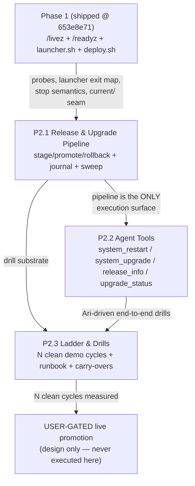

# Self-Restart / Self-Upgrade — Phase 2: Plan Overview

- **Date:** 2026-08-22 · **Author:** planner[v2] via plan-creation worker (W1 of a 3-worker wave)
- **Status:** Draft — Ready for Review
- **Base:** branch `plan/self-restart-upgrade-phase2` @ `653e8e71` (linear on the merged Phase-1 follow-up tip)
- **Parent initiative:** `.agents/shared/planning/auto-restart-upgrade/plan-overview.md` (Phase 1 = "never stays down" — **SHIPPED**, live-validated on demo @ `653e8e71`; see `.agents/tester/RESULTS/2026-08-22-ar-phase1-followups-verification.md` ✅ PASS)
- **Companion docs (sibling workers, same directory, same phase IDs P2.1/P2.2/P2.3):** `tool-api-design.md`, `risk-register.md` (W2) · `test-strategy.md`, `promotion-ladder.md`, `decisions.md` (W3)

---

## ⛔ HARD CONSTRAINT (user directive — VERBATIM, applies to every phase)

> NEVER touch the live/production ensemble environment — it is the running environment of Ari and all live agents (~/agents-ensemble, port 9797, prod DB, ENSEMBLE_DEPLOY_LIVE are out of bounds; live pids must remain untouched). ALL work/testing/drills in dev and demo only. If any plan step would require touching live, mark it as USER-GATED and design it as an explicit user-confirmed action. Sandbox instances (own port + throwaway PG) are fine.

This constraint is restated in `phase1-plan.md`, `phase2-plan.md`, and `phase3-plan.md`. Any step whose code path *can* target live is either (a) excluded from this initiative's execution and marked **USER-GATED**, or (b) implemented but with the live branch unreachable without an explicit user-confirmed action at runtime (and even then, *executing* it is outside this initiative's validation — see `promotion-ladder.md`, W3). Read-only observation of live (GET probes, pid listing) follows the Phase-1 precedent (`2026-08-22-ar-phase1-followups-verification.md` §5: GET-probes + read-only inspection only).

---

## 1. Goal

Give **Ari** (front-door agent, `agents/ari/meta.json`) restart and self-upgrade capability via agent-facing tools built on the **live-validated Phase 1 infrastructure** (probes `/livez` + `/readyz`, `launcher.sh` supervisor, `scripts/deploy.sh` — all proven on demo @ `653e8e71`), in three phases:

1. **P2.1 Release & Upgrade Pipeline** — ADR-004/005/009/012 upgrade tooling: fetch/build/stage/promote with integrity checks, atomic `current` flips, journal, rollback lock, health-gated auto-rollback (cap 3/24h), launcher journal-sweep implementation (ADR-012).
2. **P2.2 Agent-Facing Restart & Upgrade Tools** — ADR-015 extended: `daemon/tools/upgrade_tools.py` with `system_restart`, `system_upgrade`, `release_info`, **and `upgrade_status`** (4 tools — reviewer-ratified D-FA2.1), all routing through the P2.1 pipeline (health-gated, never raw kills), env-target permission model (demo/dev free, live runtime-user-confirmed), auto-rollback + cap surfaced to Ari.
3. **P2.3 Rollout Ladder, Drills & Carry-Overs** — demo-first rollout with N clean demo cycles gating any (USER-GATED) live promotion, drill runbook (does not exist today), alerting on abort/rollback-cap halt, closure of the 3 Phase-1 carry-overs.

**Hard requirement (inherited, unchanged):** no LLM in the critical recovery path. Ari is a *conversational front door to a deterministic pipeline* — the LLM never decides go/rollback; the health gate does (ADR-015). The restart tool follows the same rule: it triggers a deterministic, health-gated sequence.

---

## 2. Non-Goals (explicitly OUT of scope)

| Non-goal | Reason |
|---|---|
| **Drain controller** (ADR-006: draining flag + 503 middleware + snapshot census) | `system_upgrade` promotes **drain-free** initially — sanctioned by ADR-009/M3 ("Phase 3 promotes drain-free; drain slots in at Phase 4"). In-flight work resumes from LangGraph node-boundary checkpoints; "drain is a courtesy, not correctness." Future work, separate initiative. |
| **`daemon_meta` migration guard** (ADR-007) | Not built. The PG schema-drift risk (rollback onto a schema the old binary mishandles) stays **open** and is mitigated only by the manifest `rollback_safe` gate (M5: "two enforcement layers, one rule, no phase-ordering hole"). **Sibling `risk-register.md` (W2) owns this risk.** |
| **Live deployment / live promotion execution** | Hard constraint (§ ⛔). Design for live exists; *executing* live promotion is USER-GATED and is never performed by this initiative's validation. |
| **Jober tooling** | ADR-015 named ari + jober; the request names only Ari. **Recommended default: ari only in P2.2; jober deferred** — flagged as an open question for the user (see §8, and `decisions.md` W3). |
| **systemd / launchd supervisor work** | Phase 1 shipped the launcher + plist artifacts; no new supervisor config in Phase 2. (launchd remains ADR-001's choice; `launcher.sh` policy is supervisor-agnostic.) |
| **LLM observer / postmortem automation** (ADR-008 Phase 6) | Not built. P2.3 covers only *notification* of abort/halt events (SSE `NotificationBroadcaster` + watchdog-watcher precedent), not LLM postmortems. |
| **Capability smoke test** (PM-v0.10.4-bug class, §4.8 of parent plan) | Phase 5 scope in the parent plan; not in this initiative. `release_info` gives conversational visibility only. |
| **Backing up the live flat install / `.bak` scheme** | The legacy `.bak` files are hand-rolled artifacts in the live dir — out of bounds (hard constraint). The P2.1 staged layout replaces the *destructiveness* going forward in demo/sandbox; the live dir is migrated only inside a USER-GATED step (see P2.3). |

---

## 3. Verified Foundation (Phase 1 as shipped @ `653e8e71` — cite, do not re-derive)

All facts below were verified by 3 explorer passes + tester verification (`2026-08-22-ar-phase1-followups-verification.md`). Full inventory in each phase doc; headline items:

- **launcher.sh** — exit map `0` clean / `75` boot-tempfail (capped 5s→60s backoff, burst-budget-exempt) / `78` refuse-no-loop / `1` crash (backoff 10s→300s ×2); burst budget 5 crashes/600s; uptime ≥600s resets budget; `.launcher-state` atomic write (`.tmp.$$` + `mv`, launcher.sh:187-247); env: launcher exports `INSTALL_DIR/.env`, wins over binary (launcher.sh:95-149, 561-565); **journal sweep is a stub, logging only** (launcher.sh:151-174, 567-568) — ADR-012 sweep NOT implemented; **binary resolution already prefers `$INSTALL_DIR/current/ensemble-prod`** then falls back flat (launcher.sh:349-374) — the `releases/` seam is ready; knobs are script constants (changes need launcher restart).
- **scripts/deploy.sh** — bare PyInstaller build (`uv run python -m PyInstaller ensemble.spec`, deploy.sh:19-22, 195-197; **NEVER make targets on feature branches** — ensure-latest chain hazard); demo env generated from `.env.prod` with `PORT=7979` + `POSTGRES_DB=ensemble_demo` (deploy.sh:206-230); `--create-db` demo-only; stages binary + `agents/` + `frontend/dist` + `config.yaml` + `launcher.sh`, env last; **`rm -rf agents/` + `frontend/dist` unbacked** (deploy.sh:276, 282); health gates `/livez` ≤60s + `/readyz` ≤120s via `_probe` (2s sleep, curl max-time 5s) → exit 75 unreachable; **`ENSEMBLE_DEPLOY_LIVE=1` required for live else exit 78** (deploy.sh:139-148); **NO releases/, manifest, journal, rollback, or backup machinery — and NO `.bak` logic** (the `.bak`s are hand-rolled legacy artifacts in the live dir, not produced by this repo).
- **scripts/stop-ensemble.sh** — SINGLE-TERM launcher-only rule (trap forwards once, `CHILD_STOP_WAIT_S=70`); `WAIT_S` precedence env-var > `DAEMON_GRACEFUL_SHUTDOWN_TIMEOUT_SECONDS`+10 > 70, clamp 10..600; anchored-path + cwd cmdline matching; ports report-only.
- **Makefile** — NO stage/promote/rollback; `install`/`pyinstaller`/`build`/`ensure-latest` exist.
- **Probes** — `/livez` = event-loop only, returns `status`/`uptime_seconds`/`version` (daemon/api.py:1719-1733); `/readyz` = O(1) read of `app.state.readiness_composite`, 503 + `Retry-After: 5`, `draining` field reserved always-false (api.py:1735-1779); composite = DB `SELECT 1` (0.5s) + queue-freshness max-age on RUNNING tasks (2.0s) + services, 10s refresher, drill knob `ENSEMBLE_READINESS_FORCE_DEGRADED` one-way fail-safe (daemon/services/readiness.py:48-67).
- **Boot/stop semantics** — `__main__.py`: uvicorn `timeout_graceful_shutdown` bounds task-drain (:241-268); boot preflight PG `SELECT 1` timeout 10s → exit 75. **NO `--version` CLI smoke anywhere** — integrity/version-check is NEW scope (P2.1 decides: `/livez` version read vs `--version` flag).
- **Tool system** (for P2.2 sizing) — category = `@register_tool_category("system_upgrade")` in `daemon/tools/upgrade_tools.py` + `CATEGORY_MODULES` entry (`daemon/tools/_tool_registry.py:423-457`) + `tools.allow` expansion (`daemon/tools/instance.py:284-289`) + **CRITICAL: tools must ALSO be appended to the tools list in `create_instance_tools()` or they are silently invisible** (code precedent: the append-to-list pattern at `daemon/tools/instance.py:1895-1993`). `upgrade_tools.py` does NOT exist yet. Ari allow has 14 entries incl. `bash`; jober 9. **No tool survives process death** (all in-process); Bash tool has `BashProcessRegistry` + SIGTERM→5s→SIGKILL (daemon/tools/bash.py:138-150); **daemonization for tool-launched processes needs double-fork + `os.setsid` + `execv`** (Phase-1 lesson: nohup'd children orphan under the tool harness). User-origin signal: `MessageQueue.type` HUMAN/AGENT/SYSTEM (`daemon/repositories/message_queue/models.py:49`) is the strongest origin discriminator; **no trigger-marker mechanism exists** (OQ9 open); question-tool plan has an SSE + POST-answer confirmation pattern (not implemented). `meta.json` lookups must use `get_version()` w/ `get_resolved()` fallback.
- **Restart semantics** (drives P2.2 sequencing) — `StaleTaskRecovery.recover_on_startup` (daemon/services/stale_task_recovery.py:637-795): stale RUNNING >15min force-cancel+retry, orphaned CANCELLED sweep; tasks stay PROCESSING on crash; LangGraph checkpoints at node boundaries; resume `is_retry=True` from `resume_target_turn_id`. `ReportDeliveryRecoveryService` 5-lane sweep is PERIODIC-ONLY 300s interval, age-bound 10min, batch 100, **NO boot sweep** — child reports pending at restart deliver up to ~10min late. `MessageQueue` is EPHEMERAL: `clear_all(preserve_in_flight=True)` at startup wipes completed/failed. Graceful stop freezes in-flight turns at last committed node boundary; **a tool call in-flight at stop is LOST (not re-executed)** — pause-tool-result-fix plan exists but deferred. `has_instance_busy` (task/repository.py:523) canonical busy-check; `job_queue_paused` master pause exists (3 layers); ADR-006 draining flag+503 does NOT exist. **Deferred-pause pattern** (graph node sets marker, post-graph callback outside task, `asyncio.shield`) is a candidate seam for restart-after-turn-completes.

---

## 4. Phases

| Phase ID | Name | Objective | Tasks | Coupling | Doc | Status |
|---|---|---|---|---|---|---|
| **P2.1** | Release & Upgrade Pipeline | Deterministic stage/promote/rollback with integrity checks, health gate, auto-rollback + cap, ADR-012 sweep — demo-scoped, USER-GATED live paths | 10 | tight with P2.2 (pipeline is the only execution surface tools may use) | `phase1-plan.md` | pending |
| **P2.2** | Agent-Facing Restart & Upgrade Tools | `system_restart` + `system_upgrade` + `release_info` + `upgrade_status` in category `system_upgrade`, ari-only [4th tool added by architect 2026-08-22], env-target permission model, daemonized execution, death-safe result delivery | 10 | tight with P2.1 (routes every action through the pipeline); loose with P2.3 (observability feeds the ladder) | `phase2-plan.md` | pending |
| **P2.3** | Rollout Ladder, Drills & Carry-Overs | Demo-first N-clean-cycle gate, drill runbook (new), abort alerting, 3 carry-overs closed, USER-GATED live promotion design | 9 | tight with P2.1 (drills exercise the pipeline); loose with P2.2 (Ari-driven drills); tight with sibling `promotion-ladder.md` | `phase3-plan.md` | pending |

**Phase ordering is hard:** P2.2 wraps P2.1's pipeline (ADR-015 pattern: tools are a front door to a *validated deterministic pipeline* — there is nothing to front-door until P2.1 exists); P2.3 drills P2.1+P2.2 as a system and records the evidence the ladder consumes. Within P2.1, the carry-over drills (tempfail→respawn live cycle) are **observable early** — P2.3 owns their formal execution and recording.

### Inter-phase dependency map

Coupling details per phase live in each `phaseN-plan.md` (§ Coupling).

---

## 5. Promotion Ladder (summary — full ladder in sibling `promotion-ladder.md`, W3)

The rollout ladder is **demo-first, evidence-gated, live-last**:

1. **Sandbox** (custom port e.g. 8377 precedent + throwaway PG e.g. `ensemble_test`, conftest `SYSTEM_DEFAULT_PROJECT_ID` monkeypatch) — unit + scripted drills; anything destructive allowed; no shared state.
2. **Demo** (`~/agents-ensemble-demo`, :7979, `ensemble_demo` — the rehearsal target with REAL prod shape, Phase-1 precedent) — scripted pipeline drills, then Ari-driven drills (P2.2 tools).
3. **N clean demo cycles gate** — promotion out of demo requires N consecutive clean cycles recorded in the journal + `.agents/tester/RESULTS/` verification files. P2.3 defines N, what "clean" means objectively, and where the ledger lives. **N = 3 recommended (ADR-021 in sibling `decisions.md` — ⚠ user-gated; default if user silent: 3; any release/manifest change mid-count resets the ledger).**
4. **Live promotion = USER-GATED, by design and by execution** — the design specifies the exact user-confirmed action sequence, but this initiative never executes it. Live is out of bounds (§ ⛔); the ladder's last rung is documentation + runtime gates, not action.

W3's `promotion-ladder.md` owns the full rung definitions, evidence artifacts per rung, and rollback-of-the-ladder rules.

---

## 6. ADR Consistency — Deviations & Reconciliation

Phase 2 extends decisions made in the parent initiative (`.agents/shared/planning/auto-restart-upgrade/decisions.md`). Six deviations exist between those ADRs and what this initiative builds. Each is **flagged, not silently adopted**:

| # | Deviation | What the ADR says | What this plan does | Reconciliation |
|---|---|---|---|---|
| **1** | **Restart tool is NEW** | ADR-015 defines exactly `system_upgrade` + `release_info` — **no restart tool** | ADDS `system_restart` | Health-gated by construction: routes through pipeline/launcher semantics (SIGTERM-bounded via stop-ensemble.sh + launcher restart), **never a raw kill**. The restart path reuses the exact same stop→start→gate skeleton as promote, minus the flip. Recorded as a new decision in sibling `decisions.md` (W3). |
| **2** | **Env-target permission model is NEW** | ADR-015 has no demo-vs-live target gate — the 3-env topology (demo 7979 / live 9797 / dev 8079, D1) postdates it | Adds a runtime env-target gate: demo/dev/sandbox free (user directive: "Demo/dev actions may proceed freely per normal flow"); live requires the **3-factor runtime gate (D-FA3.1 ruled naming: `user_confirmed` param + server-side HUMAN-origin marker + action-binding nonce)** on top of the structural env self-match layer. Enforcement mechanics are W2's `tool-api-design.md`; P2.2 covers the orchestration side (how Ari asks, how the answer is verified, what crosses daemon death). |
| **3** | **ari only (jober deferred)** | ADR-015 names **ari + jober** | The request names only Ari. Default: **ari only in P2.2; jober later** | Flagged for the user (§8 Open Questions + `decisions.md` W3). Mechanically trivial to add later (one `tools.allow` line in `agents/jober/meta.json`) because default-deny already covers jober until opted in. |
| **4** | **Pipeline must NOT be make-target-driven** | ADR-009 frames `make stage/promote/rollback` as the orchestration surface | The upgrade pipeline is **env-parameterized scripts** (`scripts/upgrade/*.sh` or equivalent); make targets are optional thin wrappers only | Verified reality: deploy.sh deliberately uses bare `uv run python -m PyInstaller ensemble.spec` and NEVER make targets on feature branches — the ensure-latest chain (git checkout latest && git pull) would yank the branch out from under us (deploy.sh:19-22, 195-197). ADR-009's D3 (explicit VERSION, fail-if-not-at-tag, no auto git pull) is **honored in substance**: the scripts take an explicit VERSION and never auto-pull. The make wrapper remains available for operator muscle memory but calls the scripts. |
| **5** | **No backup machinery exists in the repo** | Task notes said "rollback currently binary-only (`backup-ensemble-prod-*.bak`, 2 newest kept)" | Plan against **verified repo reality**: deploy.sh contains **NO backup logic at all**; flat overwrite install; `rm -rf agents/` + `frontend/dist/` unbacked (deploy.sh:276, 282). The `.bak`s are hand-rolled legacy artifacts in the live dir. | P2.1 makes staged installs non-destructive going forward (trios + retention + journal replace overwrite-in-place); `deploy.sh` stays for bootstrap of fresh install dirs. The live dir's legacy `.bak`s are out of bounds (hard constraint) and are subsumed only inside a USER-GATED migration step (P2.3). |
| **6** | **Agent tools ship EARLY (originally Phase 7, after drain/migration guard)** | Parent plan §7 put ADR-015 tooling at Phase 7, after drain (Phase 4) and migration guard (Phase 5) | This initiative ships tools at P2.2, **before** drain controller and daemon_meta exist | Sanctioned by ADR-009/M3 (drain-free promotes are the designed interim mode) — `system_upgrade` promotes drain-free. The **PG schema-drift risk stays open** and is explicitly owned by sibling `risk-register.md` (W2): mitigation = manifest `rollback_safe` gate (M5's "two enforcement layers" — manifest until daemon_meta) + quarantine + halt-for-human. Drain controller (ADR-006) and daemon_meta (ADR-007) remain FUTURE work outside this scope. |

---

## 7. Risks (umbrella level — full register in sibling `risk-register.md`, W2)

| # | Risk | Impact | Likelihood | Owner | Mitigation (summary) |
|---|---|---|---|---|---|
| U1 | **PG schema drift across rollback** (daemon_meta absent) | High | Medium | W2 risk-register | Manifest `rollback_safe` gate (M5); quarantine; halt-for-human; additive-only discipline; pg_dump preflight optional in promote |
| U2 | **Tool-launched pipeline dies with the daemon** (no tool survives process death) | High | High (certain without design) | P2.2 | Double-fork + `os.setsid` + `execv` daemonization (Phase-1 lesson); journal as the durable state; result delivered via journal read on next turn |
| U3 | **Tool call in-flight at stop is LOST** | Medium | Medium | P2.2 | Restart deferred to post-turn (deferred-pause pattern seam) or returns "scheduled" before death — design decision in P2.2 with justification |
| U4 (risk-id; NOT the ladder §5 "U4" live-read gate — different tables) | **Live touched accidentally** | Critical | Low | All phases | Hard constraint verbatim in every doc; live paths USER-GATED; `ENSEMBLE_DEPLOY_LIVE`-style guard on every script; drills sandboxed first; read-only live probes only (Phase-1 §5 precedent) |
| U5 | **Rollback cap (3/24h) exhaustion halts system with no agent visibility** | Medium | Low | P2.2/P2.3 | `release_info` surfaces cap state; SSE NotificationBroadcaster alert on halt-for-human (P2.3) |
| U6 | **Sweep-as-rollback interaction with cap** (ADR-012 counts toward cap) | Medium | Low | P2.1 | Journal records sweep-initiated rollbacks distinctly; cap arithmetic includes them (per ADR-012 consequence note) |
| U7 | **Env precedence / .env handling mistakes** (launcher exports win; no .env in release dirs) | Medium | Medium | P2.1 | ADR-014 invariants enforced by stage script assertions + integrity checks |

---

## 8. Open Questions

| # | Question | Default if unanswered | Owner |
|---|---|---|---|
| Q1 | Jober tooling now or later? (ADR-015 named ari+jober; request names Ari only) | **ari only in P2.2; jober deferred** (one-line `tools.allow` change later; default-deny covers jober meanwhile) | User → `decisions.md` (W3) |
| Q2 | Version-check mechanism: `/livez` version read vs `--version` CLI flag? (neither exists as a smoke today) | P2.1 decides + justifies (leaning: `/livez` — zero new surface; see `phase1-plan.md` Task 4) | P2.1 |
| Q3 | `upgrade_status` tool: add or fold into `release_info`? | **DECIDED (architect 2026-08-22): separate 4th tool** — run-id correlation across process death is load-bearing; overrides phase2-plan D1's fold; see architecture-recommendation.md FA2/A1 | P2.2 |
| Q4 | N for the clean-cycle gate (P2.3) | **N=3 recommended** (ADR-021 in `decisions.md`; ⚠ user-gated, default-if-silent 3; objective cycle definition in `test-strategy.md` §4.1, ruling in `promotion-ladder.md` S3) | User → `promotion-ladder.md` (W3) |
| Q5 | OQ9 (parent): trigger-marker mechanics — session attribute vs sidecar token | Interim: `MessageQueue.type=HUMAN` as strongest existing origin discriminator + `user_confirmed` param; full marker design in `tool-api-design.md` (W2) | W2 |

---

## 9. Sibling Document Map (this directory)

| File | Owner | Contents |
|---|---|---|
| `plan-overview.md` | **W1 (this doc)** | Umbrella: goal, non-goals, phases, dependencies, ADR reconciliation, risk summary, open questions |
| `phase1-plan.md` | W1 | P2.1 Release & Upgrade Pipeline |
| `phase2-plan.md` | W1 | P2.2 Agent-Facing Restart & Upgrade Tools |
| `phase3-plan.md` | W1 | P2.3 Rollout Ladder, Drills & Carry-Overs |
| `tool-api-design.md` | W2 | Tool schemas, 3-factor (LIVE-only, D-FA3.1) gate enforcement mechanics, trigger marker, permission model detail |
| `risk-register.md` | W2 | Full risk register incl. PG schema-drift (U1), severity/likelihood/mitigation/owner matrix |
| `test-strategy.md` | W3 | Test strategy: packs, sandbox conventions, e2e rule application, drill automation |
| `promotion-ladder.md` | W3 | Full promotion ladder: rungs, evidence artifacts, N-cycle ledger design, USER-GATED live rung |
| `decisions.md` | W3 | Phase-2 decision log (extends parent ADR log; records deviations §6 as decisions) |

Phase IDs **P2.1 / P2.2 / P2.3 are FIXED** across all sibling docs — no renumbering.

---

## 10. E2E / Testing Rule (inherited, binding)

Per `.agents/tester/rules/ensure.md:44-53`: **full e2e is MANDATORY if changes touch the job/task/queue system** (`claim_pending_task`, `turn_transitions`, `reconcile_turn_mirror`, `job_processor`, `job_locks`): full non-integration suite via test/packs (5-min cap each, NOT bare pytest) + e2e happy path + pause-after-spawn-resume + terminate-revive + 3-level cascade (`test/packs/e2e_workflows_ensure_test.sh`, `PYTEST_TIMEOUT=280`).

**Application to this initiative:** P2.2's deferred-restart seam touches turn finalization (post-graph callback) — if implementation modifies `turn_transitions`/report-lane code, the full e2e rule triggers. P2.1 (scripts + launcher) and P2.2 tool registration do not touch the queue system → core pack validation suffices. W3's `test-strategy.md` owns the per-phase blast-radius mapping.

---

## 11. Research Insights (source references)

- Phase-1 shipped-state verification: `.agents/tester/RESULTS/2026-08-22-ar-phase1-followups-verification.md` (✅ PASS; follow-ups 45-47 = the 3 carry-overs P2.3 closes)
- Parent ADRs: `.agents/shared/planning/auto-restart-upgrade/decisions.md` (ADR-004/005/009/012/014/015 quoted in §6)
- Launcher/sweep seam: `launcher.sh:151-174` (stub contract comment), `:349-374` (current/ preference)
- Deploy guard/build reality: `scripts/deploy.sh:139-148` (live guard), `:19-22,195-197` (bare PyInstaller), `:276,282` (unbacked rm -rf)
- Probe implementations: `daemon/api.py:1719-1779`, `daemon/services/readiness.py:48-67`
- Tool registration gotcha: `daemon/tools/_tool_registry.py:423-457`, `daemon/tools/instance.py:284-289` + `:1895-1993` (append-to-list pattern)
- Restart semantics: `daemon/services/stale_task_recovery.py:637-795`, task/repository.py:523 (`has_instance_busy`), message_queue/models.py:49 (HUMAN/AGENT/SYSTEM)
