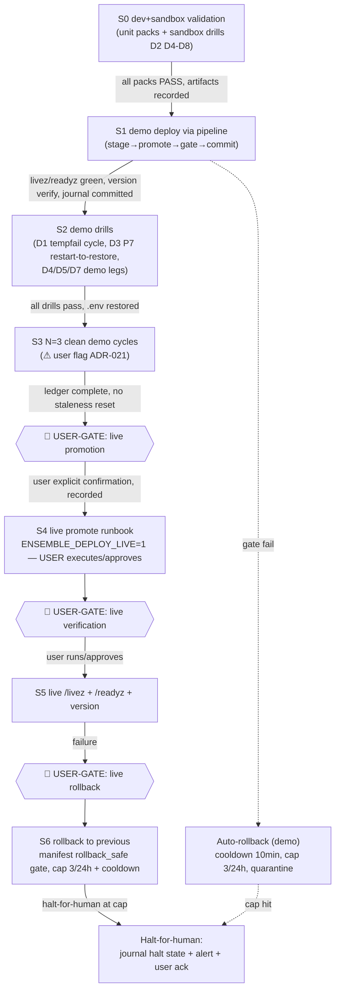

# Promotion Ladder — Demo→Live — Self-Restart / Self-Upgrade Phase 2

- **Date:** 2026-08-22 · **Author:** W3 (this file + `test-strategy.md` + `decisions.md`)
- **Siblings (do not author):** `plan-overview.md` + `phaseN-plan.md` (W1), `tool-api-design.md` + `risk-register.md` (W2)
- **Companion:** `test-strategy.md` defines how each gate below is tested/drilled and its pass artifacts.

> **NEVER touch the live/production ensemble environment — it is the running environment of Ari and all live agents (~/agents-ensemble, port 9797, prod DB, ENSEMBLE_DEPLOY_LIVE are out of bounds; live pids must remain untouched). ALL work/testing/drills in dev and demo only. If any plan step would require touching live, mark it as USER-GATED and design it as an explicit user-confirmed action. Sandbox instances (own port + throwaway PG) are fine.**

**Consequence for this ladder:** it is **executable demo-only end-to-end**. The live stages exist as USER-GATED runbooks — written, reviewable, rehearsed-on-demo — but **never executed as part of this initiative's validation**. Execution requires the user's explicit, separately-recorded confirmation.

---

## 1. Ladder Stages

| Stage | Environment | What happens | Gate to advance | Owner |
|---|---|---|---|---|
| **S0** Validate | dev repo (8079) + sandbox (own port + throwaway PG) | All P2 unit/integration packs + sandbox drills D2/D4/D5/D6/D7/D8 (`test-strategy.md` §1, §3) | All packs PASS; all sandbox drills pass with artifacts | agents (autonomous) |
| **S1** Demo deploy | demo 7979, PG `ensemble_demo` | Pipeline deploy of the new release via `scripts/` stage/promote (env-parameterized, ADR-018) — same mechanism the release ships with; never a bespoke one-off | Health gates green: `/livez` ≤60s, `/readyz` ≤120s (`deploy.sh` phase-5 budgets, verified); version verify; journal `committed` | agents (autonomous; demo is the rehearsal target) |
| **S2** Demo drills | demo 7979 | D1 (tempfail→respawn→recovery — the live cycle Phase 2 owes), D3 (P7 readiness, restart-required-to-restore documented), D4/D5 demo legs, D7 ari-driven legs | Each drill's objective pass criteria (`test-strategy.md` §3); demo `.env` restored after each | agents (autonomous, drill-scoped mutations only) |
| **S3** N clean demo cycles | demo 7979 | **N=3** clean cycles per the OBJECTIVE definition (`test-strategy.md` §4.1) — recommend 3, ⚠ user flag (ADR-021) | N consecutive clean cycles recorded in journal + RESULTS files + ledger; staleness rule holds (no release change mid-count) | agents (autonomous) |
| **S4** Live promotion | live 9797 | **USER-GATED.** Execute the live-promote runbook (same pipeline, target=live, `ENSEMBLE_DEPLOY_LIVE=1`). NOT part of this initiative's validation — the user triggers it when satisfied with S0–S3 evidence | **User's explicit confirmation** (see §5 gate table). Agents never set `ENSEMBLE_DEPLOY_LIVE` | **USER** |
| **S5** Post-promotion verification | live 9797 | **USER-GATED.** `/livez` + `/readyz` + version check on live. Designed as a runbook the user runs (or explicitly approves an agent running — approval is per-action, recorded) | User confirmation per action | **USER** |
| **S6** Live rollback path | live 9797 | **USER-GATED.** Rollback semantics (flip to `previous`, gated on manifest `rollback_safe: true` — ADR-005/M5). Written, rehearsed on demo (D5/D6), executed on live only by/with the user | User confirmation per action; cap + cooldown apply (§2) | **USER** |

**Interim rollback-safety rule (pre-`daemon_meta`):** rollback is gated on the release manifest's `rollback_safe: true` — two enforcement layers, one rule, until Phase 5 lands `daemon_meta` (ADR-007 M5 amendment, verified in the Phase 1 decision log). Releases that drop columns are never rollback targets — halt-for-human instead.

---

## 2. Rollback Cap 3/24h (ADR-005 — D2 APPROVED, user decision 2026-08-16)

Cited from `.agents/shared/planning/auto-restart-upgrade/decisions.md` ADR-005: *"max 3 auto-rollbacks/24h then halt-for-human (user-approved, D2/OQ5 — final); quarantined versions skipped by future promotes"*; plus cooldown 10 min between rollbacks, 300s soak, 10-min post-promote outer window.

| Mechanism | How enforced |
|---|---|
| **Counter** | `releases/state.json` journal rollback counters (ADR-004: journal holds `started-at/rollback counters/quarantine`). Every auto-rollback increments; the launcher's ADR-012 journal-sweep rollback **also counts** (ADR-012 consequence: "the sweep counts as an auto-rollback — cooldown + counters apply") |
| **Cooldown** | 10-min cooldown stamp in the journal; a rollback attempted inside the cooldown is refused |
| **Quarantine** | A version whose promote ended in rollback is marked quarantined in the journal; future promote resolution skips quarantined versions (unit-tested boundary cases — `test-strategy.md` §1 P2.1) |
| **Cap hit → halt-for-human** | Journal enters `halt_for_human` state — **entry-side enforcement only (D-FA4.2, adjudicated): NEW promotes are refused at preflight** (`rollback-cap-exceeded`); **the rollback/sweep path itself NEVER refuses on cap** — a rollback in progress (incl. the launcher's ADR-012 sweep on an orphaned flip) always executes past the cap, because refusing the recovery would strand the environment on a flipped-but-broken release. Reaching the cap arms the halt + cooldown for the *next entry*. Additionally: (b) alert emitted (§3), (c) the user proceeds by an explicit ack — recorded journal action `halt_ack` naming who/when — after which counters reset and the quarantined version remains skipped |

**What halt-for-human looks like on the ground:** daemon stays on the last-known-good release; Ari reports the halt from the journal (§3); the user resolves the root cause (or accepts the previous version), then acks. The halt is a stable resting state, never a loop.

---

## 3. Alerting on Abort

| Event | Detection evidence | Channel 1 — in-daemon SSE | Channel 2 — daemon-down (**decided: ADR-025(b) watchdog-watcher journal-watch extension** — recommended default, ⚠ user-flagged in `decisions.md`) | Ari's relay |
|---|---|---|---|---|
| **Burst abort** (launcher) | `.launcher-state` `abort` marker (launcher burst: >5 crashes/10min → halt, exit 1 — verified exit map in `launcher.sh` header) | Not possible — daemon is the thing that died | **Watchdog-watcher EXTENSION (ADR-025(b), P2.3 T8)**: the existing launchd agent's watch set gains `.launcher-state` abort markers + `releases/state.json` halt/sweep events (files readable without the daemon; base script precedent verified `watchdog-watcher.sh:5-7,174-177`, `/livez`-only, 300s interval, absent >10min → notify) — hard dependency on P2.1 T4 (the journal file exists only once the pipeline writes it) | On next daemon recovery, Ari reads the journal + launcher log tail and reports the abort episode |
| **Rollback-cap halt** | Journal `halt_for_human` + counters | `NotificationBroadcaster` SSE event (`daemon/services/notification_broadcaster.py:19`, verified) with journal snapshot payload — **works only while the daemon is up** (the halted daemon IS up — it's resting on last-good, so SSE applies) | n/a (daemon up) | Ari relays: which version halted, the 3 rollback causes, quarantine list, the ack procedure |
| **Promote refusal** (cap/cooldown/lock/quarantine/gate-refuse) | Journal refusal entry | SSE event with structured reason | n/a | Ari relays refusal reason + what would unblock |
| **Auto-rollback executed** (gate-fail or ADR-012 sweep) | Journal `rolled_back` txn | SSE event | n/a | Ari relays: failed version, trigger evidence, current version, cooldown remaining |

**Limitation (explicit):** SSE is in-daemon — it cannot report the daemon's own death; that class is covered by the **watchdog-watcher journal-watch extension — the decided channel per ADR-025(b)** (⚠ user-flagged option in `decisions.md`, default SSE + extension; anything pointed at live is USER-GATED, U6). **Fallback if the user rejects ADR-025(b) and picks (a) SSE-only:** the daemon-down column becomes an **accepted, documented gap** — burst-abort and daemon-death are then unalerted until the next daemon recovery (Ari relays from the journal); the ladder records this explicitly rather than implying coverage. Alert payloads must be **derived from the journal**, so Ari's relays are evidence-cited, not vibes.

---

## 4. Ladder Diagram

Rollback edges inside S1–S3 are automatic and demo-confined; every edge crossing into live is a USER-GATE (🚨).

---

## 5. USER-GATED Marker Table (every step that could touch live)

| # | Step | Could touch live how | Exact gate (who confirms · how recorded · forbidden before confirmation) |
|---|---|---|---|
| U1 | Live promote (S4) | Pipeline action against `~/agents-ensemble`; sets `ENSEMBLE_DEPLOY_LIVE=1` | **User** confirms explicitly in conversation (or runs the runbook personally). Recorded: journal txn on live gains a `user_confirmed_by/at` field + a note in the demo ledger that S4 was triggered. **Forbidden before:** any agent invocation of the live pipeline; any setting of `ENSEMBLE_DEPLOY_LIVE` by agent code or drills |
| U2 | Live post-promote verification (S5) | HTTP GET to 9797 + reading live journal | User runs the runbook (curl + journal read) **or explicitly approves a named agent action** ("you may GET /livez on live now"). Recorded: approval quote + timestamp in the RESULTS ledger. Forbidden before: any agent-originated request to 9797 — including read-only |
| U3 | Live rollback (S6) | Flip `current` on live + restart | User confirmation per action, same recording as U1. Forbidden before: any agent execution of rollback against live |
| U4 | Live journal/state READ by agents (diagnosis aid) | Reading `~/agents-ensemble/releases/state.json` or logs — read-only but inside the out-of-bounds dir | **Structural (reviewer ruling 2026-08-22): the env self-match applies to ALL tools including reads** — only a LIVE-resident Ari can address live at all (a demo/dev/sandbox-resident Ari is refused `env-self-match` outright); the live-resident Ari still needs **explicit user approval per request; recorded in ledger. Default: agents do NOT read live paths at all**. ⚠ **P2.2 fix-pass deviation (2026-08-23, decisions.md): implemented reads gate on SELF-MATCH ONLY — the per-request approval step is NOT implemented; U4 completion = P2.3 ladder scope.** Residual: a live-resident Ari reads its own live observability without per-request approval (read-only, own-env, no mutation) |
| U5 | `system_upgrade`/`system_restart` with `target=live` from ari (P2.2) | The env-target gate (ADR-017) makes live require the enforced **3-factor runtime gate (D-FA3.1)**: (1) `user_confirmed: true` param, (2) server-side HUMAN-origin trigger marker, (3) **action-binding nonce** contained in the triggering HUMAN message (issued by `dry_run` preflight; mechanics per `tool-api-design.md` §4) | Gate enforced IN CODE, not by convention: refusal unless ALL THREE factors pass — a fabricated param or a non-user-origin turn must fail. Recorded: tool result + journal txn carry the confirmation provenance (nonce mint + consumption journaled per D-FA3.3). Forbidden: any bypass, test-only flag, or fabricated marker (unit-tested — `test-strategy.md` §1 P2.2; live `system_restart` additionally refused outright this initiative per A2) |
| U6 | Watchdog-watcher extension pointed at live (if ADR-025 chooses it) | A launchd agent probing 9797 | Read-only probes still target live — user approves installing/enabling the watcher for live. Forbidden before approval: any 9797 probe from agent-owned tooling |

**Standing invariant:** before any pipeline action anywhere, **scripts** assert the install-dir path + port + DB triple (the 7979↔9797 one-digit-typo hazard — `test-strategy.md` §5.2); **the tool layer instead resolves self-env from the `ENSEMBLE_SELF_ENV` marker and refuses any cross-env target (D-FA2.3 self-match)**; live-target assertions fail closed when unapproved.

---

## 6. What the Ladder Does NOT Cover (explicit)

- **Not a migration plan:** schema/`daemon_meta`/drain phases are later phases; this ladder promotes binaries whose manifests declare `rollback_safe` per the interim rule (ADR-020).
- **Not unattended:** S4–S6 have no automation path; automation exists only up to S3.
- **Not a substitute for the release gate:** any P2 PR touching the job/task/queue core still runs the full e2e gate (`test-strategy.md` §2) regardless of ladder position.
